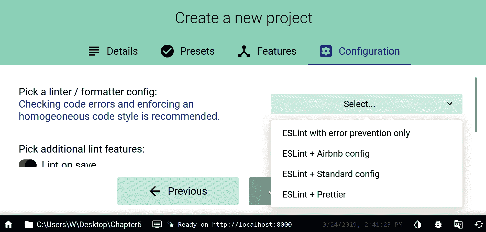

# 在 Vue CLI 3 中使用 ESLint 和 Prettier

在本章中，我们将了解为什么 ESLint 是有用的，并将了解如何使用它对代码进行 lint。我们还将讨论不同的样式指南：standard、Airbnb 和 Google。具体来说，我们将研究以下主题：

*   ESLint 是什么，以及如何自行配置它
*   本地和全局安装 npm 包之间的区别
*   本地安装 ESLint 并使用 npx 运行它
*   在 Vue CLI 3 中使用 ESLint
*   使用 Vue CLI 3 UI 配置 ESLint

我们将首先了解什么是 ESLint，以及如何将其配置为独立的`npm`包。

# ESLint 是什么，以及如何自行配置它

在本章中，我们将讨论 ESLint 的作用。ESLint 与代码质量有关。当你在一个团队中工作时，每个团队成员都会对编写 JavaScript 的最佳方式提出自己的小怪癖和想法。即使您的团队对特定的编码风格和如何编写代码有一些明确的规则，您如何保证每个团队成员都遵守这些规则？如何确保它们提供一致的代码质量？毕竟，我们是人，这意味着我们都有尽自己最大努力的日子，只是忘记了一件我们必须注意的小事。

如果有足够长的时间，我们的团队将开始产生风格不一致的代码。接下来发生的事情是，团队中的每个人都开始将 JavaScript 风格指南视为*一个建议*，而不是您应该*真正遵守的*。

幸运的是，有一些工具允许我们自动改进代码的外观，并在代码没有按照规定的方式执行时对其进行格式化。ESLint 就是这种工具的一个例子。

基本上，ESLint 是一种将*选项卡与*空格以及其他类似争论外包给一个软件的方式，该软件将以一种简化、一致的方式处理这些问题。

在本章中，我们还将简要介绍全局和本地节点模块之间的区别，即在全局和本地安装`npm`包之间的区别。

# 全球安装 npm 包与本地安装 npm 包

下面是一个全局安装的示例：

```js
npm install eslint -g --verbose
```

以下是本地安装的示例：

```js
npm install eslint --save-dev --verbose
```

那么，有什么区别呢？

全局软件包安装在计算机上的一个特定位置。安装它们时您所在的文件夹并不重要；*它们不会保存在该文件夹*中，并且在您的命令行中全局可用。因此，如果我们想从命令行运行包，全局安装是一种方法。

您可以从命令行程序运行`npm install`命令。命令行程序将始终从目录中运行。在安装`npm`软件包时，使用`cd ..`等命令进入操作系统文件系统中的目录，或`cd <directory-name>`向下钻取目录，可以选择命令行程序所在的文件夹。

本地安装`npm`包意味着该包保存在命令行程序指向的当前目录中。当`npm install`命令运行时，您正在安装的新软件包将保存在当前目录的`node_modules`目录中。如果`node_modules`目录不存在，则在运行`npm install`命令时会在当前目录中添加*。*

使用全局模块的缺点是版本控制问题。对于本地模块，计算机上的每个不同目录和每个不同应用程序都有自己的模块版本。但是，如果您有一个全局程序包，并且决定对其进行更新，则全局安装模块的更新版本可能会中断您的应用程序，因为新版本与特定目录中特定应用程序中的其余代码之间存在兼容性问题。

根据经验，`npm`包应该在本地安装，因为可以避免版本控制问题。

To learn more about installing `npm` packages locally, visit this web page: 
[https://docs.npmjs.com/downloading-and-installing-packages-locally.](https://docs.npmjs.com/downloading-and-installing-packages-locally)

使用本地安装的软件包的一个缺点是，特定的命令，例如`prettier`、`webpack`或`eslint`，在命令行上不可用。相反，您需要以 npm 脚本的形式运行本地安装的节点模块

或者，这个本地安装的模块实际上可以直接在命令行上运行，使用`npx`命令，我们将在下一节中讨论。

# 什么更漂亮？

Prettier 是一个代码格式化程序。每当保存文件时，它都会格式化代码。项目网站位于[https://prettier.io/](https://prettier.io/) 。在下面的示例中，我们将运行本地安装的更漂亮的 npm 模块。

# 使用 npx 在命令行上运行本地安装的 npm 模块

为了开始与 Prettier 合作，我们将启动一个新项目，如下所示：

```js
mkdir Chapter6 && cd $_
```

接下来，在新的`Chapter6`文件夹中，我们将添加另一个文件夹`prettier-practice`，如下所示：

```js
mkdir prettier-practice && cd $_
```

接下来，我们将使用如下默认值初始化`npm`：

```js
npm init -y
```

接下来，我们添加一个文件`index.html`，如下所示：

```js
touch index.html && code .
```

前面的命令在 VS 代码中创建并打开了一个新的`index.html`文件。

我们将添加一个没有任何构建过程的小型 Vue 应用程序。让我们在`index.html`文件中添加以下代码：

```js
<!DOCTYPE html>
<html lang="en">

<head>
    <meta charset="UTF-8">
    <title>101 - using watchers in Vue</title>
    <style>
        body,
        input {
            font-family: Arial, sans-serif;
            font-size: 20px;
        }
    </style>
</head>

<body>
    <div id="example">
        <p>Enter owner name and the thing that is owned:
            <input v-model="ownerName" placeholder="enter owner">
            <input v-model="thing" placeholder="enter thing">
        </p>
        <span>{{ ownerName }}</span>
        <span> has a </span>
        <span>{{ thing }}</span>
    </div>
    <script src='https://cdnjs.cloudflare.com/ajax/libs/vue/2.6.10/vue.min.js'></script>
    <script>
        var example = new Vue({
            el: '#example',
            data: {
                ownerName: 'e.g Old McDonald',
                thing: 'e.g cow'
            },
            watch: {
                ownerName(currentValue, previousValue) {
console.log(`The value in the first input has changed from: ${previousValue} to: ${currentValue}`);
                }
            },
            computed: {
                // a computed getter
                ownerHasThing: function () {
                    // `this` points to the Vue instance's data option
                    return this.ownerName + " " + this.thing
                }
            }
        })
    </script>
</body>

</html>
```

您可以看到这个简单的 Vue 应用程序在 CodePen 上运行，网址为：[https://codepen.io/AjdinImsirovic/pen/jprwKe.](https://codepen.io/AjdinImsirovic/pen/jprwKe)

接下来，让我们添加 Prettier，看看它将如何格式化我们的代码。

# 全局安装 Prettier 并在 index.html 上运行

要全局安装 Prettier，可以使用以下命令：

```js
npm install prettier -g --loglevel verbose
```

然后，要开始使用它，只需运行`--help`标志即可查看所有可用的选项，例如：

```js
prettier --help
```

现在，您可以运行`prettier index.html`命令在控制台中查看格式化代码。或者，您可以运行命令`prettier index.html --write`，以便格式化的输出实际保存在您指定的文件中。

接下来，我们将了解如何在本地安装 Prettier 并使用 npx 运行它。

# 用 npx 跑得更漂亮

npx 实用程序是一个**NPM 包运行程序**。它在 5.2.0 版（2017 年上半年）中添加到 NPM 中。它使从`node_modules`目录运行包变得更容易，因为我们不必像之前在`package.json`中那样依赖`npm run <someScriptName>`。

在本例中，我们将看到如何将 Prettier 安装为开发依赖项，以及如何使用 npx 运行它。首先，我们需要在`prettier-practice`文件夹中安装`--save-dev`标志，如下所示：

```js
npm install prettier --save-dev --verbose
```

一旦完成，我们的`package.json`将被更新，我们可以开始使用 Prettier。

最简单的方法是在 VS 代码的终端中运行更漂亮的命令。

要查看可用选项，可以运行以下命令：

```js
npx prettier
```

要在传递了一些选项的情况下实际运行命令，我们可以运行以下代码：

```js
npx prettier --single-quote --trailing-coma es5 --write "index.html" --verbose
```

npx 还有许多其他的使用方法，这是一个让你熟悉的好工具。

另一个有趣的练习是比较 Prettier 的格式和现成的 VS 代码的格式。VS 代码的格式化程序使用*Shift*+*Alt*+*F*键盘组合触发。我们可以在 VS 代码的控制台中按下向上箭头，快速重新运行刚才运行的`npx prettier`命令。

接下来，我们将制作另一个小项目来演示如何使用 ESLint。

# 使用 ESLint

ESLint 是一个 JavaScript linter。您可以在[找到它 https://eslint.org/](https://eslint.org/) 。linter 执行代码分析。它将您的代码与特定标准进行比较。你可以说它是一个检查代码质量的工具。linter 非常适合团队环境，因为它们使我们的代码库遵循特定的代码风格，并且因为它们确保了在代码审查期间少谈论一件事。

在这里可以找到代码样式的示例：[https://github.com/airbnb/javascript](https://github.com/airbnb/javascript) 。这是 Airbnb 的 JavaScript 风格指南。如果向下滚动页面，您将看到有很多信息需要通读：如何访问基元类型，如何重新分配引用，如何在对象声明中对速记属性进行分组，等等。

理解 ESLint 只分析代码是很重要的；它没有运行它。但是，它可以定位错误，也可以修复错误。实际上，如果您设置它，它可以更改您的代码。

还有其他 JavaScript linting 工具，比如 JSLint 或 JSHint。ESLint 被吹捧为更具可定制性。

# 全局安装 ESLint，但从命令行运行它失败

要全局安装 ESLint 节点模块，请运行以下命令：

```js
npm install eslint -g --loglevel verbose
```

现在，我们的`eslint`命令在全球范围内可用。

现在，我们将创建一个新文件夹`eslint-practice`。在它里面，我们将创建一个新文件，`eslint-test.js`

在 VS 代码中打开文件并将此代码添加到其中：

```js
function (a) 
{
console.log(a, b);

}
```

保存文件。

接下来，使用*Ctrl*+*`*打开 VS 代码内部的命令行，运行以下命令：

```js
eslint eslint-test.js
```

您将收到以下输出：

```js
Oops! Something went wrong! :(

ESLint: 5.15.3.
ESLint couldn't find a configuration file. To set up a configuration file for this project, please run:

 eslint --init

ESLint looked for configuration files in C:\Users\Warrior Gaming\Desktop\Chapter6 and its ancestors. If it found none, it then looked in your home directory.
```

为什么会这样？没有 ESLint 配置文件，但为什么 ESLint 需要配置文件才能运行？

这是因为 ESLint 将用于检查代码的规则在**配置**文件中指定。如果没有配置文件，ESLint 就不知道在 lint 代码时应用哪些规则。

这个问题的解决办法很有趣。没有`package.json`，我们无法初始化 ESLint。因为我们必须安装一个新的 NPM 项目，所以我们最好只在本地安装 ESLint 节点模块。这不是必须的，但它是简化工作流的首选选项。

# 运行 eslint--init 命令

显然，如果没有 ESLint 配置文件，我们无法运行`eslint`命令。但是，如果没有`package.json`文件，我们无法初始化 ESLint 配置文件。这意味着我们首先需要运行`npm init`，现在让我们按如下方式运行：

```js
npm init -y
```

现在，我们可以初始化`eslint`，当我们运行`eslint --init`命令时，会在命令行提示中询问我们几个问题。我们的 ESLint 配置将取决于我们选择的答案。以下是我们需要为此示例选择的选项：

*   拾取`To check syntax, find problems, and enforce code style`
*   拾取`None of these`
*   选择`None of these`（对于这个简单的演示，我们将不使用`Vue.js`，因为这需要安装额外的依赖项，目前我们只测试 ESLint）
*   拾取`Browser`
*   拾取`Answer questions about your style`
*   拾取`JSON`
*   拾取`Spaces`
*   拾取`Single`
*   拾取`Windows`
*   键入*Y*（是的，我们需要分号）
*   选择*、*、`JavaScript`、*、*（作为您希望配置文件采用何种格式的答案？）

回答完所有问题后，您将收到以下输出：

```js
Local ESLint installation not found. 
The config that you've selected requires the following dependencies:
eslint@latest
Successfully created .eslintrc.js file in C:\Users\W\Desktop\Chapter6\eslint-practice
ESLint was installed locally. We recommend using this local copy instead of your globally-installed copy.
```

阅读此信息，我们现在可以理解，ESLint 的维护人员正在推动我们走向最佳实践，即限制计算机上全局安装的`npm`包的数量，而不是选择在项目中本地安装节点模块。前面的消息还指出，我们需要`eslint@latest`依赖项才能运行我们的 ESLint 配置，因此我们现在就添加它，如下所示：

```js
npm install eslint@latest --save-dev --verbose
```

It has been mentioned earlier in the book, but this is a great time for a refresher: the `--save-dev` flag means that the package we are installing is only to be used in development, not in production. The `--save-dev` option does not set the local module. You can install ESLint locally by simply running: `npm install estlint@latest`. However, both the `--save-dev` and `--verbose` flags have their place, but it needs to be clear that they don't have anything to do with locally installing an `npm` package.

现在，我们准备在项目的 JavaScript 文件上运行 ESLint。在开始之前，让我们先检查一下`.eslintrc.js`的内容。

# 了解.eslintrc.js 配置文件的结构

根据我们选择的规则，我们生成的`.eslintrc.js`文件如下所示：

```js
module.exports = {
    'env': {
        'browser': true,
        'es6': true
    },
    'extends': 'eslint:recommended',
    'globals': {
        'Atomics': 'readonly',
        'SharedArrayBuffer': 'readonly'
    },
    'parserOptions': {
        'ecmaVersion': 2018
    },
    'rules': {
        'indent': [
            'error',
            4
        ],
        'linebreak-style': [
            'error',
            'windows'
        ],
        'quotes': [
            'error',
            'single'
        ],
        'semi': [
            'error',
            'always'
        ]
    }
};
```

在配置文件中导出的对象内部，我们可以看到环境被设置为`browser`，而`es6`属性被设置为`true`，这意味着 ES6 语法被自动启用。

在`'extends': 'eslint:recommended'`中，我们打开报告常见问题的推荐核心规则。以下页面列出了这些规则：[https://eslint.org/docs/rules/](https://eslint.org/docs/rules/) 。

`'globals'`条目列出了使用指定配置运行 ESLint 时将访问的其他全局变量。

通过`parserOptions`属性，我们将 ECMA 脚本版本设置为使用`2018`，当然也就是 ECMA 脚本 9。最后，`'rules'`属性指定要应用的规则，以及在什么**错误级别**

# 在 JavaScript 文件上运行 ESLint

现在，我们可以在我们的`eslint-test.js`文件上运行`eslint`命令。因为它是全球安装的，所以我们可以简单地运行`eslint eslint-test.js`。

但是，由于模块的维护人员不鼓励这样做，因此让我们使用以下命令在本地运行它：

```js
npx eslint eslint-test.js
```

运行上述命令将产生以下输出：

```js
  1:10 error Parsing error: Unexpected token (

✖ 1 problem (1 error, 0 warnings)
```

我们也可以在 VS 代码中看到错误，它是一个单独的字符，`(`字符，在我们的`eslint-test.js`文件的第一行用红色波浪下划线。当然，这个错误意味着我们缺少函数名。因此，让我们将代码更新为：

```js
function aFunction(a) 
{
console.log(a, b)
}
```

请注意，在调用`console.log`方法之后，我们还删除了分号。让我们再跑一次`eslint`。

这一次我们得到五个新错误，如下所示：

```js
  1:10 error 'aFunction' is defined but never used no-unused-vars
  3:1 error Expected indentation of 4 spaces but found 0 indent
  3:1 error Unexpected console statement no-console
  3:16 error 'b' is not defined no-undef
  3:18 error Missing semicolon semi

✖ 5 problems (5 errors, 0 warnings)
  2 errors and 0 warnings potentially fixable with the `--fix` option.
```

查看前面输出中每一行的末尾，我们可以看到我们的代码违反的特定**ESLint 规则**。在每行的开头，我们可以看到行号，后面是冒号，后面是违反 ESLint 规则的第一个字符的确切位置。因此，1:10 可以被解读为*行 1，字符位于第 10 位*。

让我们再次运行`eslint`，建议的`--fix`标志如下：

```js
npx eslint eslint-test.js --fix
```

现在我们的代码被格式化，如下所示：

```js
function aFunction(a) 
{
    console.log(a, b);

}
```

但是，我们仍然得到一些错误，如下所示：

```js
  1:10 error 'aFunction' is defined but never used no-unused-vars
  3:5 error Unexpected console statement no-console
  3:20 error 'b' is not defined no-undef

✖ 3 problems (3 errors, 0 warnings)
```

从这个小练习中我们可以得出结论，ESLint 将执行以下操作：

*   指出代码中违反规则的情况。
*   允许我们传递`--fix`标志，以纠正工具本身可以修复的错误。

接下来，我们将更新错误级别规则。

# 在 ESLint 中更新错误级别规则

默认情况下，所有规则的错误级别都设置为`'error'`。要手动设置不同的错误级别，例如`'warn'`，我们可以添加一个`errorLevel`常量，并将规则更新到此代码中：

```js
const errorLevel1 = 'warn';
const errorLevel2 = 'error';
module.exports = {
    // ...
    // omitted this section to save space
    // ...
    'rules': {
        'indent': [
            'error',
            4
        ],
        'linebreak-style': [
            'error',
            'windows'
        ],
        'quotes': [
            'warn',
            'single'
        ],
        'semi': [
            'warn',
            'always'
        ]
    }
};
```

现在，通过此更新，`linebreak-style`和`indent`规则的错误级别将为`error`，而`quotes`和`semi`规则的错误级别将为`warn`。

接下来，我们将在 Vue CLI 3 中使用 ESLint。

# 在 Vue CLI 3 中配置 ESLint

现在我们已经熟悉了 Prettier 和 ESLint，我们将使用 Vue CLI 3 将它们安装到一个新项目中。让我们将 Git Bash 指向`Chapter6`文件夹的根目录，并运行以下命令：

```js
code .
```

打开 VS 代码后，我们将在命令行上切换，并运行以下命令：

```js
vue create vc3-prettier-eslint
```

然后，我们将只接受 Babel 和 ESLint 的默认安装，并等待应用程序安装。

接下来，与之前类似，我们将运行`vue ui`，然后将`vc3-eslint`应用程序导入我们的 Vue CLI 3 GUI 仪表板。

正如我们所看到的，ESLint 是我们的 Vue CLI 3 应用程序中的默认安装。但是，我们如何配置 ESLint，就像我们在本章上一节中所做的那样？

# 在 Vue CLI 3 GUI 中设置 ESLint 配置

随着我们的`vc3-eslint`应用程序加载到 Vue CLI 3 UI 中，让我们单击配置图标。

我们将单击 ESLint 配置，它将更新项目配置窗口中的右侧窗格，如下所示：


Figure 6.1: Clicking the configuration icon shows possible configurations for your app

在该视图中，我们可以看到两个主要条目：保存时 Lint 和选择 config。

“保存时起绒”选项当前处于打开状态，但我们可以通过单击“保存时起绒”选项右侧的绿色开关将其关闭。

我们也可以在 Select config 条目中选择不同的配置。默认设置可以更改为强烈建议的设置或建议的设置。我们在本章前面看到了如何在`eslintrc.js`文件中配置此设置

您还可以选择单击页面右上角的 Open eslintrc 按钮来打开项目的 ESLint 配置文件，以便您可以直接编辑它。

最后，通过单击配置面板顶部的规则选项卡，我们可以看到项目中所有 ESLint 规则的列表，如下所示：


Figure 6.2: Selecting individual rules in the ESLint configuration screen in Vue CLI 3 UI

屏幕将显示默认情况下在 ESLint 配置中应用的基本规则，而在 General 选项卡上，我们可以通过单击 Select config 条目中的下拉菜单来更改整个规则集；在规则选项卡中，我们可以混合和匹配单个规则，然后保存更新。这使得我们可以以任何方式更新规则和进行自定义更改。

# 在 Vue CLI 3 UI 项目中同时使用 ESLint 和 Prettier

如果您是在 Vue CLI 3 UI 中从头开始一个项目，还可以使 ESLint 和 Prettier 一起工作。以下是方法：

1.  我们首先将 VUEUI 指向根文件夹，如下所示。请务必确认您不在现有 Vue 应用程序中：


Figure 6.3: Creating a new project in Vue CLI 3 UI

2.  接下来，我们将单击“选择此文件夹”按钮继续，然后选择项目名称，如下所示：


Figure 6.4: Adding project name

3.  接下来，我们将单击“选择此文件夹”按钮继续，然后选择项目名称。单击“下一步”继续，您将进入“预设”选项卡。
4.  进入“预设”选项卡后，选择手动预设以手动选择特征，然后再次单击“下一步”。在“功能”选项卡上，Babel 和 linter/formatter 功能应该已经预选，因此只需再次单击“下一步”转到配置屏幕，如下所示：



Figure 6.5: Choosing ESLint + Prettier from the Configuration screen

5.  Pick a linter/formatter 配置为我们提供了几个选项。选择底部的*ESLint+Prettier*。单击它后，我们将看到一个保存预设的选项，因此让我们将其另存为下图：


Figure 6.6: Saving a new preset in Vue CLI 3 UI

6.  单击“创建新预设”按钮后，我们就完成了项目的自定义，可以等待安装所有依赖项。
7.  完成后，您将看到欢迎使用新项目的消息。现在，您可以单击左侧菜单上的 Project dependencies 链接。除了预期的依赖项（`babel-eslint`、`eslint`、`eslint-plugin-vue`和`vue-template-compiler`，您还将看到`@vue/eslint-config-prettier`开发依赖项。正如我们所看到的，这是一个官方的`vue npm`模块，因为它有`@vue`名称空间。

# 总结

在本章中，我们研究了`npm`和`npx`之间的差异，以及节点模块的全局和本地安装。我们进一步讨论了 ESLint 和 Prettier。我们已经了解了如何在独立项目上安装它们，以及如何使用 Vue CLI 3 GUI 在默认 Vue 应用程序中配置 ESLint。我们还了解了如何在 Vue CLI 3 中使用 Prettier 设置 ESLint

在下一章中，我们将探讨在 Vue CLI 3 中使用 CSS、SCS 和 POSTSS。