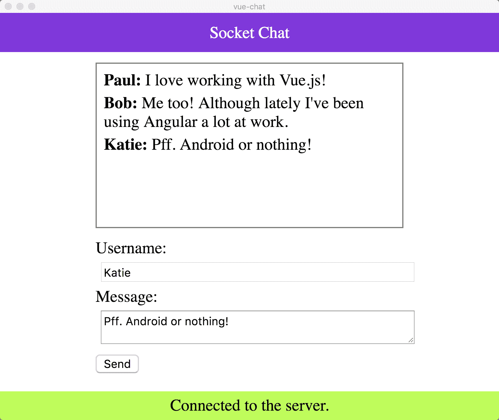
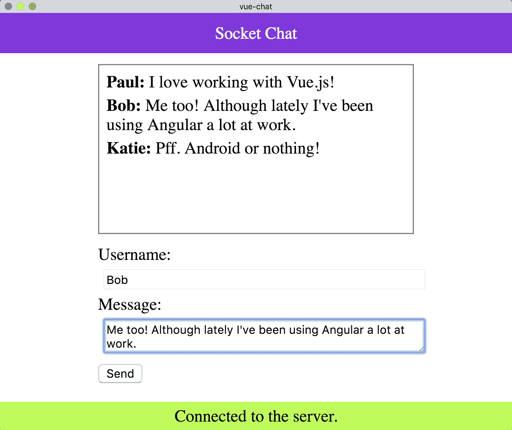

# HTTP 和 WebSocket 通信

在本章中，我们将了解如何使用`HTTP`与服务器端 API 交互。我们将使用我们自己的离线 API 创建一个应用程序，包括`HTTP GET`、`POST`、`PUT`、`PATCH`和`DELETE`。除此之外，我们还将创建一个内存中的实时聊天应用程序，该应用程序利用带有`Socket.io`库的 WebSocket。

在本章结束时，您将了解如何：

*   使用`json-server`创建模拟数据库 API
*   使用`Axios`创建 HTTP 请求
*   使用 WebSocket 和`Socket.io`在客户端之间进行实时通信

# 超文本传输协议

让我们从创建一个新的 Vue.js 项目开始，我们可以将其用作游乐场项目。在终端中键入以下内容：

```js
# Create a new Vue project
$ vue init webpack-simple vue-http

# Navigate to directory
$ cd vue-http
# Install dependencies
$ npm install

# Run application
$ npm run dev
```

有许多方法可以在 JavaScript 中创建 HTTP 请求。我们将使用`Axios`库在项目中使用简化的基于承诺的方法。让我们通过在终端中键入以下内容来安装它：

```js
# Install Axios to our project
$ npm install axios --save
```

我们现在有能力创建 HTTP 请求；我们只需要一个 API 来指向`Axios`。让我们创建一个模拟 API。

# 安装 JSON 服务器

为了创建模拟 API，我们可以使用`json-server`库。这使我们能够通过在项目内部创建一个`db.json`文件，快速启动并在全球范围内运行。它有效地创建了一个 GET、POST、PUT、PATCH 和 DELETE API，并将数据存储在一个附加到原始 JSON 文件的文件中。

我们可以通过在终端中运行以下程序来安装它：

```js
# Install the json-server module globally
$ npm install json-server -g
```

由于我们添加了`-g`标志，我们将能够在整个终端中全局访问`json-server`模块。

我们需要做的下一件事是在项目的根目录中创建`db.json`文件。在数据集上尽可能地发挥创意；我们只是简单地列出了我们可能感兴趣或不感兴趣的课程：

```js
{
  "courses": [
    {
      "id": 1,
      "name": "Vue.js Design Patterns"
    },
    {
      "id": 2,
      "name": "Angular: From Beginner to Advanced"
    },
    {
      "id": 3,
      "name": "Cross Platform Native Applications with Fuse"
    }
  ]
}
```

然后，我们可以通过在终端中运行以下程序来运行数据库：

```js
# Run the database based on our db.json file
$ json-server db.json --watch
```

如果我们已经成功地完成了所有工作，那么我们应该能够访问我们位于`http://localhost:3000`的数据库，如以下成功消息所示：


令人惊叹的我们都准备好了，现在我们可以拿到一份课程表。

# HTTP 获取

我们需要做的第一件事是将`Axios`导入我们的`App.vue`组件。在本例中，我们还可以设置一个`ROOT_URL`，因为我们将只查找`/courses`端点：

```js
<script>
import axios from 'axios'
export default {
  data() {
    return {
      ROOT_URL: 'http://localhost:3000/courses',
      courses: []
    }
  }
}
</script>
```

这样，我们就可以钩住生命周期钩子，比如`created()`，并调用从 API 请求课程的方法：

```js
export default {
  data() {
    return {
      ROOT_URL: 'http://localhost:3000/courses',
      courses: []
    }
  },
  created() {
    this.getCourseList();
  },
  methods: {
    getCourseList() {
      axios
        .get(this.ROOT_URL)
        .then(response => {
          this.courses = response.data;
        })
        .catch(error => console.log(error));
    }
  }
}
```

这里发生了什么事？我们正在调用`getCoursesList`函数，该函数向`http://localhost:3000/courses`端点发出 HTTP`GET`请求。然后，这要么将 courses 数组设置为与数据相等（即，`db.json`中的所有内容），要么仅在存在错误时注销错误。

然后，我们可以使用`v-`for 指令在屏幕上显示：

```js
<template>
  <div class="course-list">
    <h1>Courses</h1>
    <div v-for="course in courses" v-bind:key="course.id">
      <p>
        {{course.name}}
      </p> 
    </div>
  </div>
</template>
```

再加上一点造型，我们可以：

```js
<style>
.course-list {
  background-color: rebeccapurple;
  padding: 10px;
  width: 50%;
  text-align: center;
  margin: 0 auto;
  color: white;
}
</style>
```


让我们转到 HTTP POST！

# HTTP POST

我们可以在`courseName``div`之后添加一个输入框和`button`，允许用户在学习列表中输入新课程：

```js
<div>
 <input type="text" v-model="courseName" placeholder="Course name"> 
 <button @click="addCourse(courseName)">Add</button>
</div>
```

这需要我们将`courseName`变量添加到`data`对象中：

```js
data() {
 return {
  ROOT_URL: 'http://localhost:3000/courses/',
  courses: [],
  courseName: '',
 };
},
```

然后我们可以创建一个名为`addCourse`的类似方法，该方法将`courseName`作为参数：

```js
methods: {
// Omitted
 addCourse(name) {
  axios
   .post(this.ROOT_URL, { name })
   .then(response => {
     this.courses.push(response.data);
     this.courseName = ''; 
   })
   .catch(error => console.log(error));
 }
}
```

您可能会注意到它与之前的 HTTP 调用非常相似，但这次我们使用的不是`.get`，而是`.post`，并传递一个键和值为`name`的对象。

发送 POST 请求后，我们使用`this.courses.push(response.data)`将客户端数组更新为，而服务器端（我们的客户端`db.json`文件）已更新，客户端状态未更新。


# HTTP PUT

接下来我们希望能够做的是更改列表中的项目。也许我们在提交项目时犯了错误，因此希望对其进行编辑。让我们添加这个功能。

首先，让我们告诉 Vue 在编辑课程时随时跟踪。用户每次单击课程名称时，都会进行编辑；然后，我们可以将编辑布尔值添加到`data`对象：

```js
data() {
 return {
  ROOT_URL: 'http://localhost:3000/courses/',
  courses: [],
  courseName: '',
  editing: false,
 };
},
```

然后可以更改我们的模板以反映这一点：

```js
<template>
 <div class="course-list">
  <h1>Courses</h1>
  <div v-for="course in courses" v-bind:key="course.id">
   <p @click="setEdit(course)" v-if="!editing">
   {{course.name}}
   </p>
  <div v-else>
   <input type="text" v-model="course.name">
   <button @click="saveCourse(course)">Save</button>
  </div> 
  </div>
  <div v-if="!editing">
  <input type="text" v-model="courseName" placeholder="Course name"> 
  <button @click="addCourse(courseName)">Add</button>
  </div>
 </div>
</template>
```

这里到底发生了什么？好吧，我们已经将`courseName`改为只在不编辑时显示（也就是说，我们没有点击课程名称）。相反，使用`v-else`指令，我们显示一个输入框和`button`，允许我们保存新的`CourseName`。

我们还隐藏了“添加课程”按钮以保持简单。

下面是代码的样子：

```js
setEdit(course) {
 this.editing = !this.editing;
},
saveCourse(course) {
 this.setEdit();
 axios
 .put(`${this.ROOT_URL}/${course.id}`, { ...course })
 .then(response => {
 console.log(response.data);
 })
 .catch(error => console.log(error));
}
```

这里我们在指向所选课程终点的`axios`实例上使用`.put`方法。作为一个数据参数，我们使用带有`{ ...course }`的 spread 运算符来分解课程变量，以便与我们的 API 一起使用。

之后，我们只需将结果记录到控制台。下面是当我们编辑“Vue.js 设计模式”字符串以简单地说`Vue.js`时的情况：


耶！我们最后要看的是从数据库中删除项目。

# HTTP 删除

要从列表中删除项目，让我们添加一个`button`，这样，当用户进入编辑模式（通过单击项目）时，他们可以删除特定课程：

```js
<div v-else>
  <input type="text" v-model="course.name">
  <button @click="saveCourse(course)">Save</button>
  <button @click="removeCourse(course)">Remove</button>
</div> 
```

我们的`removeCourse`函数如下所示：

```js
removeCourse(course) {
  axios
    .delete(`${this.ROOT_URL}/${course.id}`)
    .then(response => {
      this.setEdit();
      this.courses = this.courses.filter(c => c.id != course.id);
    })
    .catch(error => console.error(error));
},
```

我们正在调用`axios.delete`方法，然后过滤`courses`列表中除已删除课程外的所有课程。然后更新我们的客户机状态，使其与数据库一致。


在本章的这一部分中，我们基于 RESTAPI 创建了一个简单的“我想学习的课程”列表。它当然可以被抽象为多个组件，但由于这不是应用程序的核心焦点，所以我们只是将其全部放在一个组件中。

接下来，我们用 Node 和`Socket.io`制作一个实时聊天应用程序。

# 带有 Node 和 Socket.io 的实时聊天应用程序

在本节中，我们将使用 Node 和`Socket.io`创建一个实时聊天应用程序。我们将使用 Node.js 和 Express 框架编写少量代码，但是您知道并喜欢的 JavaScript 都是一样的。

在终端中运行以下命令以创建新项目：

```js
# Create a new Vue project
$ vue init webpack-simple vue-chat

# Navigate to directory
$ cd vue-chat

# Install dependencies
$ npm install

# Run application
$ npm run dev
```

然后，我们可以创建一个服务器文件夹，并为特定于服务器的依赖项初始化一个`package.json`，如下所示：

```js
# Create a new folder named server
$ mkdir server

# Navigate to directory
$ cd server

# Make a server.js file
$ touch server.js

# Initialise a new package.json
$ npm init -y

# Install dependencies
$ npm install socket.io express --save
```

# 什么是 Socket.io？

在我们前面的示例中，如果我们想从服务器获取新数据，我们需要发出另一个 HTTP 请求，而使用 WebSockets，我们可以简单地拥有一个一致的事件侦听器，该侦听器可以在事件触发时作出反应。

为了在聊天应用程序中利用这一点，我们将使用`Socket.io`。这是一个客户端和服务器端库，允许我们快速轻松地使用 WebSocket。它允许我们定义和提交事件，我们可以监听并随后执行操作。

# 服务器设置

然后，我们可以使用 Express 创建一个新的 HTTP 服务器，并通过在`server.js`中添加以下内容来侦听与`Socket.io`的应用程序连接：

```js
const app = require('express')();
const http = require('http').Server(app);
const io = require('socket.io')(http);
const PORT = 3000;

http.listen(PORT, () => console.log(`Listening on port: ${PORT}`));

io.on('connection', socket => {
  console.log('A user connected.');
});
```

如果我们从终端内的`server`文件夹中运行`node server.js`，我们将看到监听端口 3000 的消息。这意味着，一旦我们在客户机应用程序内部实现了`Socket.io`，我们就能够在任何时候有人连接到应用程序时进行监控。

# 客户端连接

要捕获客户端连接，我们需要将`Socket.io`安装到我们的 Vue 应用程序中。我们还将使用另一个名为`vue-socket.io`的依赖项，它为我们的 Vue 应用程序提供了更平滑的实现。

在终端中运行以下操作，确保您位于根目录中（即不在`server`文件夹中）：

```js
# Install socket.io-client and vue-socket.io
$ npm install socket.io-client vue-socket.io --save
```

# 设置 Vue 和 Socket.io

让我们转到我们的`main.js`文件，这样我们可以注册`Socket.io`和`Vue-Socket.io`插件。您可能还记得前几章中的操作方法：

```js
import Vue from 'vue';
import App from './App.vue';
import SocketIo from 'socket.io-client';
import VueSocketIo from 'vue-socket.io';

export const Socket = SocketIo(`http://localhost:3000`);

Vue.use(VueSocketIo, Socket);

new Vue({
  el: '#app',
  render: h => h(App),
});
```

在前面的代码块中，我们正在导入必要的依赖项并创建对 Socket.io 服务器的引用，该服务器当前正在端口`3000`上运行。然后我们使用`Vue.use`添加 Vue 插件。

如果我们做的一切都正确，那么我们的客户机和服务器应该能够相互通信。我们应该在我们的终端内部获得以下信息：


# 确定连接状态

现在我们已经添加了 Vue-Socket.io 插件，我们可以访问 Vue 实例中的套接字对象。这允许我们监听特定事件，并确定用户是否已连接或断开与 WebSocket 的连接。

在`App.vue`的内部，如果我们与服务器连接/断开，我们将在屏幕上显示一条消息：

```js
<template>
  <div>
    <h1 v-if="isConnected">Connected to the server.</h1>
    <h1 v-else>Disconnected from the server.</h1>
  </div>
</template>

<script>
export default {
  data() {
    return {
      isConnected: false,
    };
  },
  sockets: {
    connect() {
      this.isConnected = true;
    },
    disconnect() {
      this.isConnected = false;
    },
  },
};
</script>
```

除了 sockets 对象之外，这里应该没有太多新内容。无论何时我们连接到套接字，我们都可以在`connect()`钩子中运行我们想要的任何代码，`disconnect()`也是如此。我们只是简单地翻转一个布尔值，用`v-if`和`v-else`指令在屏幕上显示不同的消息。

最初，我们在服务器运行时连接到服务器。如果我们在终端窗口中使用*CTRL*+*C*停止服务器，我们的标题将改变以反映我们不再有 WebSocket 连接的事实。结果如下：


# 创建连接状态栏

让我们从这个概念中获得一些乐趣。我们可以创建一个组件文件夹，然后创建一个名为`ConnectionStatus.vue`的新组件。在该文件中，我们可以创建一个状态栏，在用户联机或脱机时向其显示：

```js
<template>
  <div>
    <span v-if="isConnected === true" class="bar connected">
      Connected to the server.
    </span>
    <span v-else class="bar disconnected">
      Disconnected from the server.
    </span>
  </div>
</template>

<script>
export default {
  props: ['isConnected'],
};
</script>

<style>
.bar {
  position: absolute;
  bottom: 0;
  left: 0;
  right: 0;
  text-align: center;
  padding: 5px;
}

.connected {
  background: greenyellow;
  color: black;
}

.disconnected {
  background: red;
  color: white;
}
</style>
```

虽然我们当前应用程序中只有一个屏幕，但我们可能希望跨多个组件使用此组件，因此我们可以在`main.js`中对其进行全局注册：

```js
import App from './App.vue';
import ConnectionStatus from './components/ConnectionStatus.vue';

Vue.component('connection-status', ConnectionStatus);
```

然后，我们可以编辑我们的`App.vue`模板以使用此组件，并将当前连接状态作为道具传递：

```js
<template>
  <div>
    <connection-status :isConnected="isConnected" />
  </div>
</template>
```

以下是我们的结果：


接下来，我们可以制作一个导航栏组件，使 UI 更加完整。

# 导航栏

导航栏组件除了简单地显示应用程序的名称之外，没有其他用途。您可以将其更改为包括其他功能，如登录/退出、添加新聊天频道或任何其他特定于聊天的用户操作。

让我们在`components`文件夹中创建一个名为`Navbar.vue`的新组件：

```js
<template>
  <div v-once>
    <nav class="navbar">
      <span>Socket Chat</span>
    </nav>
  </div>
</template>

<script>
export default {};
</script>

<style>
.navbar {
  background-color: blueviolet;
  padding: 10px;
  margin: 0px;
  text-align: center;
  color: white;
}
</style>
```

您可能会注意到，`v-once`指令已添加到此`div`上。这是我们第一次看到它，但由于该组件完全是静态的，我们可以告诉 Vue 不要侦听任何更改，只渲染一次。

然后，我们必须删除 HTML 正文中的任何默认填充或边距。在根目录中创建一个名为`styles.css`的文件，该文件包含以下属性：

```js
body {
 margin: 0px;
 padding: 0px;
}
```

然后我们可以将其添加到我们的`index.html`文件中，如下所示：

```js
<head>
 <meta charset="utf-8">
 <title>vue-chat</title>
 <link rel="stylesheet" href="styles.css">
</head>
```

接下来，我们需要全局注册这个组件。如果你觉得可以的话，试着自己在里面做这件事。

这就要求我们进口`Navbar`并进行如下注册：

```js
import Navbar from './components/Navbar.vue'

Vue.component('navigation-bar', Navbar);
```

然后我们可以将其添加到我们的`App.vue`文件中：

```js
<template>
  <div>
    <navigation-bar />
    <connection-status :isConnected="isConnected" />
  </div>
</template>
```

接下来，让我们创建`MessageList`组件来保存消息列表。

# 消息列表

我们可以在屏幕上显示消息列表，方法是创建一个新组件，该组件带有一个接受消息数组的道具。在名为`MessageList.vue`的组件文件夹中创建一个新组件：

```js
<template>
 <div>
  <span v-for="message in messages" :key="message.id">
  <strong>{{message.username}}: </strong> {{message.message}}
  </span>
 </div>
</template>

<script>
export default {
 props: ['messages'],
};
</script>

<style scoped>
div {
 overflow: scroll;
 height: 150px;
 margin: 10px auto 10px auto;
 padding: 5px;
 border: 1px solid gray;
}
span {
 display: block;
 padding: 2px;
}
</style>
```

这个组件相当简单；它所做的只是使用`v-for`指令在`messages`数组上迭代。我们使用适当的道具将消息数组传递到此组件中。

与其全局注册此组件，不如在`App.vue`组件中专门注册它。在这里，我们还可以向`messages`数组添加一些虚拟数据：

```js
import MessageList from './components/MessageList.vue';

export default {
 data() {
  return {
   isConnected: false,
   messages: [
    {
     id: 1,
     username: 'Paul',
     message: 'Hey!',
    },
    {
     id: 2,
     username: 'Evan',
     message: 'How are you?',
    },
   ],
  };
 },
 components: {
 MessageList,
},
```

然后我们可以将`message-list`组件添加到我们的模板中：

```js
 <div class="container">
  <message-list :messages="messages" />
 </div>
```

我们将根据在数据对象内部找到的消息数组，将消息作为道具传递进来。我们还可以添加以下样式：

```js
<style>
.container {
 width: 300px;
 margin: 0 auto;
}
</style>
```

这样做将使我们的消息框在屏幕上居中，并出于演示目的限制`width`。

我们正在进步！这是我们的信息框：


接下来呢？我们仍然需要将消息添加到列表中的功能。让我们下一步做这个。

# 向列表中添加消息

在名为`MessageForm.vue`的组件文件夹中创建一个新组件。这将用于在列表中输入消息。

我们可以从以下几点开始：

```js
<template>
  <form @submit.prevent="sendMessage">
    <div>
      <label for="username">Username:</label>
      <input type="text" name="username" v-model="username">
    </div>
    <div>
      <label for="message">Message:</label>
      <textarea name="message" v-model="message"></textarea>
    </div>
    <button type="submit">Send</button>
  </form>
</template>

<script>
export default {
  data() {
    return {
      username: '',
      message: '',
    };
  },
};
</script>

<style>
input,
textarea {
  margin: 5px;
  width: 100%;
}
</style>

```

这本质上允许我们捕获所选`username`和`message`的用户输入。然后，我们可以使用此信息在`sendMessage`功能中向`Socket.io`服务器发送数据。

通过在表单中添加`@submit.prevent`而不是`@submit`，我们确保覆盖提交表单的默认行为；这是必要的，否则我们的页面将重新加载。

让我们在`App.vue`中注册我们的表单，尽管我们还没有连接任何操作：

```js
import MessageList from './components/MessageList.vue';

export default {
 // Omitted
 components: {
   MessageList,
   MessageForm,
 },
}
```

然后，我们可以将其添加到模板中：

```js
<template>
  <div>
    <navigation-bar />
    <div class="container">
      <message-list :messages="messages" />
      <message-form />
    </div>
    <connection-status :isConnected="isConnected" />
  </div>
</template>
```

下面是我们的应用程序现在的样子：


# 具有 Socket.io 的服务器端事件

为了发送新消息，我们可以在我们的`server.js`文件中侦听名为`chatMessage`的事件。

这可以在原始连接事件内部完成，确保我们在套接字基础上逐个侦听事件：

```js
io.on('connection', socket => {
  console.log('A user connected.');

  socket.on('chatMessage', message => {
    console.log(message);
  })
});
```

如果我们随后从我们的客户机发送`chatMessage`事件，它应该随后在我们的终端内注销此消息。让我们试试看！

因为我们已经更改了`server.js`文件，所以需要重新启动节点实例。在正在运行的终端窗口`server.js`中点击*CTRL*+*C*，再次运行节点`server.js`。

# 诺德蒙

或者，您可能希望使用名为`nodemon`的模块在进行任何更改时自动执行此操作。

在终端内部运行以下命令：

```js
# Install nodemon globally
$ npm install nodemon -g
```

然后我们可以运行：

```js
# Listen for any changes to our server.js file and restart the server
$ nodemon server.js
```

伟大的让我们回到`MessageForm`组件，创建`sendMessage`函数：

```js
methods: {
 sendMessage() {
   this.socket.emit('chatMessage', {
     username: this.username,
     message: this.message,
   });
 },
},
```


在这一点上，点击 Send 并没有将消息添加到数组中，但它确实在终端内部为我们提供了已发送的消息！让我们来看一看：


事实证明，我们不必编写更多的代码来利用我们的 WebSocket。让我们回到`App.vue`组件，向 sockets 对象添加一个名为`chatMessage`的函数。请注意，这与事件名称完全相同，这意味着每次触发此事件时，我们都可以运行特定的方法：

```js
export default {
// Omitted
 sockets: {
  connect() {
   this.isConnected = true;
  },
  disconnect() {
   this.isConnected = false;
  },
  chatMessage(messages) {
   this.messages = messages;
  },
 },
}
```

我们的客户端代码现在已连接并侦听`chatMessage`事件。问题是我们的服务器端代码目前没有向客户端发送任何内容！让我们通过从套接字中发出事件来修复此问题：

```js
const app = require('express')();
const http = require('http').Server(app);
const io = require('socket.io')(http);
const PORT = 3000;

http.listen(PORT, () => console.log(`Listening on port: ${PORT}`));

const messages = [];

const emitMessages = () => io.emit('chatMessage', messages);

io.on('connection', socket => {
  console.log('A user connected.');

  emitMessages(messages);

  socket.on('chatMessage', message => {
    messages.push(message);

    emitMessages(messages);
  });
});
```

我们使用名为 messages 的数组将消息保存在内存中。然后，每当客户机连接到我们的应用程序时，我们也会在下游发出这些消息（之前的所有消息都会显示）。除此之外，每当有新消息添加到阵列中时，我们也会将其发送到所有客户端。

如果我们打开两个 Chrome 标签，我们就可以进行自我引导的对话了！



然后，我们可以在另一个选项卡中自言自语！



# 总结

在本章中，我们学习了如何使用 Vue 使用`Axios`库和`json-server`创建 HTTP 请求。这使我们能够与第三方 API 交互，并为我们的 Vue 应用程序供电。

我们还研究了如何使用 WebSocket 和`Socket.io`创建更大的应用程序。这使我们能够与连接到我们的应用程序的其他客户端进行实时通信，从而提供更多的可能性。

我们已经走了很长的路！为了真正利用 Vue，我们需要掌握路由器并了解高级状态管理概念。这些都将在下一章中介绍！