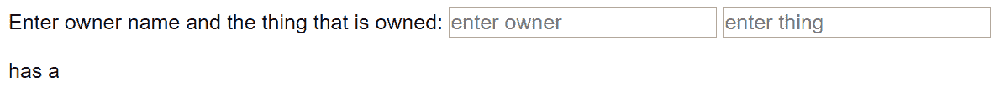
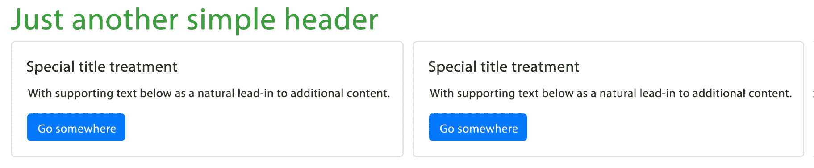
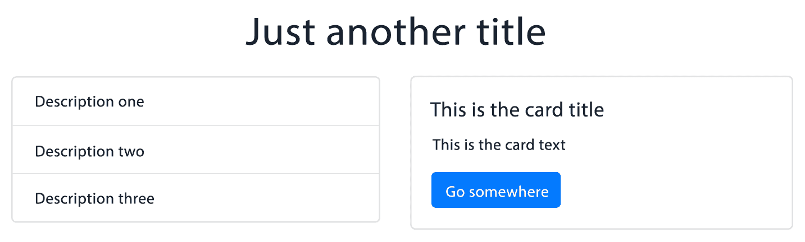

# Vue 2 的基本概念

在本章中，我们将讨论 Vue 中的数据驱动视图。我们还将研究如何在指令的帮助下操作 DOM。接下来，我们将学习什么是组件以及如何创建它们，我们将介绍与模板、方法、数据、计算属性和观察者相关的概念。

所有组件都有一个生命周期，我们有特殊的方法在组件生命周期的某些点访问组件。这些方法称为**生命周期挂钩**，我们也将在本章中对它们进行研究。

在本章中，我们将了解以下内容：

*   Vue 中的数据驱动视图
*   计算属性和方法以及如何使用它们
*   了解组件、模板和道具
*   在 Vue 中构建构件模板的方法
*   借助 Vue 组件和[T0]指令快速创建网站原型
*   在 Vue 中利用观察者
*   生命周期挂钩的重要性以及如何在 Vue 中插入此功能

# Vue 中的数据驱动视图

Vue 中的数据驱动视图是在反应性的帮助下实现的。

# 什么是反应性？

为了更好地理解这个概念，让我们看一个没有反应性的示例代码。我们将使用一个与上一章中比较 Vue 和 vanilla JS 时非常相似的示例。在最初的示例中，我们使用 JavaScript 创建了一个无序列表和其中的三个列表项。三个列表项的值是从我们声明的数组中添加的，无序列表使用 for 循环填充这些列表项。

这一次，我们将做一些稍微不同的事情。要将示例视为一支笔，请访问[https://codepen.io/AjdinImsirovic/pen/JZOZdR](https://codepen.io/AjdinImsirovic/pen/JZOZdR)

在这个非反应性示例中，我们将数组的成员预定义为变量。然后，我们用这些变量填充数组，并将它们作为无序列表的列表项打印到屏幕上，该列表将附加到文档中：

```js
var a = 1;
var b = a + 1;
var c = b + 2;
var arr1 = [a,b,c];
var unorderedList = document.createElement('ul');
document.body.appendChild(unorderedList);
for (var i=0; i<3; i++) {
  var listItem = document.createElement('li');
  listItem.className = "list-item";
  unorderedList.appendChild(listItem);
  listItem.innerHTML = arr1[i];
}
arr1[0] = 2;
for (var i=0; i<3; i++) {
  var listItem = document.createElement('li');
  listItem.className = "list-item";
  unorderedList.appendChild(listItem);
  listItem.innerHTML = arr1[i];
}
```

但是，当我们更改数组的一个成员并再次重复 for 循环时会发生什么？正如我们在钢笔中看到的，第一个和第四个列表项是不同的。第一个值为`1`，第二个值为`2`。为了使其更加明显，这些项目以粗体红色文本显示，并具有灰色背景。第一个值是`var a`的初始值。第二个值是`var a`的值，用这行代码更新：`arr1[0] = 2`。

然而，变量`b`和`c`的值在第二个 for 循环中没有更新，即使我们根据变量`a`分别增加`1`和`2`定义了变量`b`和`c`。

因此，我们可以看到 JavaScript 中没有现成的反应。

就 Vue 而言，反应性是指 Vue 跟踪变化的方式。换句话说，反应性是状态变化在 DOM 中反映的方式。实际上，这意味着当对`data`进行更改时，该更改将传播到页面，以便用户可以看到它。因此，说*Vue 是反应性的*与说*Vue 跟踪变化*是一样的。作为一个概念，就这么简单。

# Vue 如何实现这一点？

Vue 将其数据存储在`data`选项中，该选项为函数或对象：

```js
...
data: {
  // the model goes here
}
...
```

[T0]模型中的任何变化都会反映在视图中（屏幕上）。Vue 在 getter 和 setter 的帮助下实现了这种反应。当 Vue 实例接收到`data`对象时，`data`对象的所有属性都将更新为 getter 和 setter。这是在`Object.defineProperty`API 的帮助下完成的。

# 计算性质和方法

Vue 中反应性的有用性可以用计算性质和方法之间的差异来描述。

如前所述，Vue 实例可以具有计算属性和方法，也可以同时具有计算属性和方法。那么，两者的区别是什么呢？

每次调用方法时都会简单地运行它们。另一方面，计算属性是缓存的，这意味着它们仅在基础数据模型更改时运行。这通常用计算的属性依赖关系来描述。此外，方法可以有参数，而计算属性不能。

# 这些依赖关系到底是什么？

考虑这个简单的 VUE 应用程序，在这个链接中作为笔可用：https://codepen.io/AjdinImsirovic/pen/qKVyry 。

这是简单应用程序的代码：

```js
<!--HTML-->
<div id="example">
  <p>Enter owner name and the thing that is owned:
    <input v-model="ownerName" placeholder="enter owner">
    <input v-model="thing" placeholder="enter thing">
  </p>
  <span>{{ ownerName }}</span>
  <span> has a </span>
  <span>{{ thing }}</span>
</div>

// JS
var example = new Vue({
  el: '#example',
  data: {
    ownerName: 'e.g Old McDonald',
    thing: 'e.g cow'
  },
  computed: {
    // a computed getter
    ownerHasThing: function () {
      // `this` points to the Vue instance's data option
      return this.ownerName + " " + this.thing
    }
  }
})
```

此代码将在屏幕上产生以下输出：



首先，我们可以看到视图中有一行奇怪的文本。这里的问题是我们没有使用我们的`ownerHasThing`计算属性。换句话说，HTML 中的这三行是完全冗余的：

```js
<span>{{ ownerName }}</span>
<span> has a </span>
<span>{{ thing }}</span>
```

此外，如果我们只想在两个输入字段都已填写且焦点已移出输入或按下[T0]Enter[T1]键后运行计算属性，该怎么办？

这似乎是一件相对复杂的事情。幸运的是，在 Vue 中这很容易。

让我们看看更新后的代码（这里也有笔：[https://codepen.io/AjdinImsirovic/pen/aKVjqj](https://codepen.io/AjdinImsirovic/pen/aKVjqj) ：

```js
<!--HTML-->
<div id="example">
  <p>Enter owner name:
    <input v-model.lazy="ownerName" placeholder="enter owner">
  </p>
  <p>Enter thing owned:
    <input v-model.lazy="thing" placeholder="enter thing">
  </p>
  <h1 v-if="ownerName && thing">{{ ownerHasThing }}</h1>
</div>
```

JavaScript 代码只是略有不同：

```js
var example = new Vue({
  el: '#example',
  data: {
    ownerName: '',
    thing: ''
  },
  computed: {
    // a computed getter
    ownerHasThing: function () {
      // `this` points to the Vue instance's data option
      return this.ownerName + " has a " + this.thing
    }
  }
})
```

由此我们可以得出结论，计算属性只是对其执行某些计算的数据依赖项。换句话说，`ownerHasThing`是一个计算属性，其依赖关系是`ownerName`和`thing`。

无论何时`ownerName`或`thing`发生更改，`ownerHasThing`计算属性也将更新

但是，`ownerHasThing`不会总是更新，因为它是缓存的。与此相反，方法将始终更新；也就是说，无论数据模型是否已更改，它都将始终运行。

这似乎不是一个非常重要的区别，但是考虑一种情况，在这种情况下，您的方法需要从第三方 API 获取数据，或者它有很多代码要运行。这可能会减慢速度，这就是为什么在这种情况下，使用计算属性是一种方法。

在结束本节之前，让我们快速浏览上一个示例中的代码。

在 HTML 中，我们使用的是`v-model.lazy`。`lazy`修改器等待用户在输入之外单击或按键盘上的*Enter*键，或以其他方式离开输入字段（如按*Tab*键）

在 HTML 中，我们还使用了[T0]指令，我们给出了[T1]。然后，我们添加了胡须模板：`{{ ownerHasThing }}`。`v-if`指令将等待`ownerName`和`thing`在数据对象中更新。因此，一旦两个输入都填写完毕且不再聚焦，计算属性将更新基础数据模型，只有在此时，`{{ ownerHasThing }}`消息才会打印在屏幕上。

在下一节中，我们将了解如何使用模板和组件。

# 了解组件、模板和道具

首先，让我们看看如何在 Vue 中创建组件。首先，我们指定组件，如下所示：

```js
Vue.component('custom-article', {
  template: `
    <article>
      Our own custom article component!<span></span>
    </article>`
})
new Vue({
    el: '#app'
})
```

组件是我们提供自定义名称的代码块。这个自定义名称可以是我们想出的任何东西，它是*以自定义 HTML 标记的形式表示整个代码块*的单个标签。在前面的示例中，我们将`article`和`span`标记分组，并将该定制标记命名为`custom-article`

Components are named using kebab-case.

此组件的代码在[以代码笔的形式提供 https://codepen.io/AjdinImsirovic/pen/xzpOaJ](https://codepen.io/AjdinImsirovic/pen/xzpOaJ) 。

现在，为了创建组件的实例，我们只需在 HTML 中使用`<custom-article>`开始和结束标记，如下所示：

```js
<main id="app">
    <custom-article></custom-article>
</main>
```

Our custom-article component is referred to as the *child* component.

The parent is the actual Vue instance.

请注意，即使没有组件，也可以使用字符串模板。只需将模板选项添加到 Vue 实例中，如下所示：

```js
//HTML
<main id="app"></main>
//JS
new Vue({
  el: '#app',
  template: '<article>A string template without a component!<span></span></article>'
})
```

前面示例的示例代码可在此处找到：[https://codepen.io/AjdinImsirovic/pen/RJxMae](https://codepen.io/AjdinImsirovic/pen/RJxMae) 。

接下来，我们将了解如何借助于`props`和`data`选项改进组件。

# 添加道具和数据以获得更好的组件

为了使我们的`custom-article`组件更有用，我们将向其添加一个`props`选项，如下所示：

```js
Vue.component('custom-article', {
  props: ['content'],
  template: '<article>{{content}}</article>'
})
new Vue({
  el: '#app'
})
```

道具是将数据从父对象传递给子对象的一种方式。它们是父级和子级之间的单向数据流。道具总是被定义为数组。

上一个示例的代码在此处可用：[https://codepen.io/AjdinImsirovic/pen/KeZNPr](https://codepen.io/AjdinImsirovic/pen/KeZNPr) 。

我们已经在我们的组件中注册了一个道具，现在我们可以在 HTML 中将其作为一个属性使用，命名方式与道具相同：

```js
<main id="app">
  <custom-article content="This component was made with the help of a prop."> 
  </custom-article>
</main>
```

当我们需要对组件进行较小的更改而不必创建一个全新的组件时，可以使用道具。他们帮助我们重新利用我们已经拥有的东西。

在下一节中，我们将使用 Vue 实例的`data`对象向`custom-article`组件添加内容。

# 在数据对象的帮助下向组件添加内容

本例的代码笔位于[https://codepen.io/AjdinImsirovic/pen/QxadmE](https://codepen.io/AjdinImsirovic/pen/QxadmE) 。

在 HTML 中，我们将代码更改为以下内容：

```js
<main id="app">
  <custom-article v-bind:content="datacontent"> 
  </custom-article>
</main>
```

在我们的 JS 中，我们将 Vue 代码更新为：

```js
Vue.component('custom-article', {
  props: ['content'],
  template: '<article>{{content}}</article>'
})
new Vue({
    el: '#app',
    data: {
      datacontent: 'This component was made with the help of a data object in the Vue instance'
    }
})
```

在前面的示例中，我们使用`v-bind`指令将`custom-article`组件中的`content`属性绑定到`data`对象的`datacontent`属性。

If you think through this code, you will see that props are almost like named variables (with the prop's variable `name` being `content` in the example). Props simply pass to the child component whatever data they receive from the parent.

我们还有另一种方法可以做到这一点。我们可以将数据交给我们的组件，而不是在 Vue 实例中使用数据；只是这次它必须是一个数据函数。以下是此实现的完整代码：

```js
// HTML
<main id="app">
  <custom-article></custom-article>
</main>

// JS
Vue.component('custom-article', {
  template: '<article>{{datacontent}}</article>',
  data: function() {
    return {
      datacontent: 'This component was made with the help of a data function in the Vue component called custom-article'
    }
  }
})
new Vue({
    el: '#app'
})
```

要查看上一示例中的笔，请访问[https://codepen.io/AjdinImsirovic/pen/VdyQzW](https://codepen.io/AjdinImsirovic/pen/VdyQzW) 。

If we used data as an object instead of as a function, then reactivity would apply to all instances of our component. Since the main purpose of components is to be reusable, it is important to remember that in this case data must be a function.

道具也可以定义为对象，这使我们能够为它们提供更多的信息：验证传入的数据，在没有数据通过时设置默认值，等等。

在下面的示例中，我们声明我们的`custom-article`组件期望父级传递一个名为`message`的 prop 或 type string，这是必需的：

```js
<!--HTML-->
<div id="app">
  <custom-article :message-being-passed="datacontent"></custom-article>
</div>

//JS
Vue.component('custom-article', {
  props: {
    messageBeingPassed: {
      type: String,
      required: true,
      default: 'Hello Vue'
    }
  },
  template: `<div class="thetemplate">{{ message }}</div>`
});

new Vue({
  el: "#app",
  data: function() {
    return {
      datacontent: 'This component was made with the help of a data function in the Vue component called custom-article, and the data passed was validated with the help of the props object inside the Vue component'
    }
  }
})

//CSS
.thetemplate {
  font-size: 30px;
  padding: 20px;
  color: limegreen;
  font-family: Arial;
  border: 3px solid green;
  border-radius: 10px;
}
```

此示例可在[上找到 https://codepen.io/AjdinImsirovic/pen/mKpxGZ](https://codepen.io/AjdinImsirovic/pen/mKpxGZ) 。

假设我们注释掉了 Vue 实例的`data`函数的`datacontent`属性。你能猜到会发生什么吗？

换句话说，如果`datacontent`没有提供正确的数据，会发生什么？将其子对象`default`还原为其子对象。

要查看此操作，请访问此链接：[https://codepen.io/AjdinImsirovic/pen/BVJxKL](https://codepen.io/AjdinImsirovic/pen/BVJxKL) 。

# 在 Vue 中构建组件模板的其他方法

到目前为止，我们已经将模板定义为字符串（使用单引号或双引号）和模板文本（使用反勾号）。使用组件模板还有许多其他方法：

*   内联模板
*   X 模板
*   渲染函数
*   单文件组件
*   JSX 公司

他们中的大多数人都有自己的优点和缺点。例如，在 Vue 中使用 JSX 是可能的，但通常不赞成，因为这不是 Vue 的工作方式。内联模板是使用 HTML 中的`inline-template`属性生成的。

如果将[T0]添加到 HTML 脚本标记，则将生成 Vue x 模板。下面是一个例子：

```js
// HTML
<div id="app">
  <script type="text/x-template" id="custom-article-template">
    <p>{{ name }}</p>
  </script>
</div>

// JS
Vue.component('custom-article', {
  template: '#custom-article-template',
  props: ['name']
})
new Vue({
    el: '#app'
})
```

此示例的代码笔在此处可用：[https://codepen.io/AjdinImsirovic/pen/NzXyem](https://codepen.io/AjdinImsirovic/pen/NzXyem) 。

单文件模板可能是在 Vue 中创建模板的最实用的方法。您将所有 HTML、JS 和样式保存在一个文件中（具有`.vue`文件扩展名），并使用构建过程（如 Webpack）编译此文件。我们将在后面的章节中介绍 Webpack 在 Vue 中的使用（在 Vue cli 的帮助下）。

# 用组件构建简单的网页

正如我们在上一节中所看到的，有许多方法可以在 Vue 中构建组件，这可能会使事情看起来更复杂。虽然了解 Vue 为我们构建组件的各种方式带来的多功能性很重要，但在本节中，我们将介绍一种使用组件构建网页的简单方法。

在开始构建页面之前，有一件事我们应该清楚：Vue 中的每个组件也只是另一个 Vue 实例。这意味着每个组件接受一个选项对象，该对象与任何其他 Vue 实例具有相同的键值对。此 Vue 实例中只能使用与此 Vue 实例中某些选项不同的附加选项。

在这些介绍性说明之后，让我们看看如何将组件添加到 Vue 实例

# 向 Vue 实例添加简单组件

为了开始这个示例，我们将从一个简单的 Vue 实例开始。

在我们的 JavaScript 文件中，让我们创建一个尽可能简单的 Vue 实例，`#app`元素作为其入口点：

```js
new Vue({
  el: '#app',
  data: {}
})
```

接下来，让我们在 HTML 中只添加一个 div，以便我们的 Vue 实例在页面中有一个元素来访问其 DOM：

```js
<div id="app"></div>
```

现在，我们将向 JavaScript 文件添加另一个组件。让我们通过在顶部添加以下代码来扩展现有的 JS 文件：

```js
Vue.component('the-header', {
  template: '<h1 class="header css classes go here">Our example header</h1>'
})
```

现在，我们可以简单地在 HTML 中添加自定义`the-header`组件：

```js
<div id="app">
  <the-header></the-header>
</div>
```

这样做将在屏幕上呈现示例标题文本。

现在，我们已经了解了向 Vue 应用程序添加一个简单组件是多么容易，让我们再添加一个组件，让我们更深入地了解这一点。

我们将首先使用另一个组件`the-footer`扩展 JS 文件：

```js
Vue.component('the-header', {
  template: '<h1 class="header css classes go here">Our example header</h1>'
});

Vue.component('the-footer', {
  template: '<h1 class="footer css classes go here">Our example header</h1>'
});

//Root Instance
new Vue({
  el: '#app',
  data: {}
})
```

当然，我们需要更新我们的 HTML 以使其正常工作：

```js
<div id="app">
  <the-header></the-header>
  <the-footer></the-footer>
</div>
```

命名自定义组件时，我们需要使用连字符。这样做是为了确保与常规 HTML 元素没有命名冲突。

本节的示例代码见[https://codepen.io/AjdinImsirovic/pen/qypBbz](https://codepen.io/AjdinImsirovic/pen/qypBbz) 。

现在我们已经了解了如何向 Vue 实例添加简单组件，让我们通过添加更复杂的示例进行练习。

# 使用 Vue 中的组件创建更复杂的页面

首先，让我们向新的 Vue 实例添加一个组件。这次，我们将在自定义组件的 options 对象中使用 data 选项。

这是我们开始的代码：

```js
Vue.component('the-header', {
  template: '<h1 class="h1 text-success">{{header}}</h1>',
  data: function() {
    return {
      header: 'Just another simple header'
    }
  }
});

//Root Instance
new Vue({
  el: '#app',
  data: {}
})
```

在这段代码中，我们向模板中添加了 mustache 语法。然后我们使用 data 选项返回文本，文本将插入模板中。mustache 语法告诉我们的组件在数据选项中查找[T0]。

此示例的代码在此处可用：[https://codepen.io/AjdinImsirovic/pen/wxpvxy](https://codepen.io/AjdinImsirovic/pen/wxpvxy)

接下来，在标题下，我们将添加一些引导卡

为了简单起见，我们将使用官方引导文档中的现有示例，该示例可从以下 URL 获得：[https://getbootstrap.com/docs/4.0/components/card/#using-网格标记](https://getbootstrap.com/docs/4.0/components/card/#using-grid-markup)。

该示例提供以下代码：

```js
<div class="row">
  <div class="col-sm-6">
    <div class="card">
      <div class="card-body">
        <h5 class="card-title">Special title treatment</h5>
        <p class="card-text">
          With supporting text below as a natural lead-in to additional 
          content.    
        </p>
        <a href="#" class="btn btn-primary">Go somewhere</a>
      </div>
    </div>
  </div>
  <div class="col-sm-6">
    <div class="card">
      <div class="card-body">
        <h5 class="card-title">Special title treatment</h5>
        <p class="card-text">
          With supporting text below as a natural lead-in to additional 
          content.
        </p>
        <a href="#" class="btn btn-primary">Go somewhere</a>
      </div>
    </div>
  </div>
</div>
```

Although the Bootstrap framework is not the subject of this book, it will be useful for us to give a real-world example of using Vue components in practice. Since Bootstrap has basically become the industry standard for frontend frameworks, it is the perfect candidate for showing not only how Vue components are used in general, but also how they can be incorporated with other frontend technologies.

现在，让我们看看如何将一张卡添加到示例 Vue 网页。这是要添加到 JS 中的代码：

```js
Vue.component('the-card', {
  template: '<div class="card"><div class="card-body"><h5 class="card-title">Special title treatment</h5><p class="card-text">With supporting text below as a natural lead-in to additional content.</p><a href="#" class="btn btn-primary">Go somewhere</a></div></div></div>',
});
```

我们代码开发的这一阶段的代码可在此处获得：[https://codepen.io/AjdinImsirovic/pen/VByYeW](https://codepen.io/AjdinImsirovic/pen/VByYeW) 。

接下来，让我们将卡片组件添加到 HTML 中。完整更新的代码如下所示：

```js
<div id="app">
 <div class="container">
    <the-header></the-header>
    <div class="row">
      <div class="col-sm-6">
        <the-card></the-card>
      </div>
      <div class="col-sm-6">
        <the-card></the-card>
      </div>
    </div>
</div>
```

将前面的代码添加到 HTML 中，如前所述，JS 更新已经就绪，我们将得到以下结果：



我们在 JS 中添加了一个单卡组件；但是，正如我们在前面的示例中所看到的，我们现在可以根据需要在 HTML 中多次重用它。

这为我们提供了一个极好的机会，在 Vue 的帮助下，快速创建完整网页的原型。

我们可以更进一步，我们将在下一节中看到。

# 使用 v-for 改进基于 Vue 的布局

在本节中，我们将借助 Vue 指令改进现有网页

我们的具体目标是尝试在我们的组件实例中使用数据选项，并将其与 Vue 指令的功能结合起来，以进一步改进我们的 Vue 应用程序。

本节的代码可在[上找到 https://codepen.io/AjdinImsirovic/pen/Epoamy](https://codepen.io/AjdinImsirovic/pen/Epoamy) 。

让我们借助 backtick ES6 JS 语法使我们的 JS 更易于阅读。此语法允许我们编写跨多行的 JavaScript 字符串：

```js
Vue.component('the-header', {
  template: '<h1 class="h1 text-success">{{header}}</h1>',
  data: function() {
    return {
      header: 'Just another simple header'
    }
  }
});

Vue.component('the-card', {
  template: `
    <div class="card">
      <div class="card-body">
        <h5 class="card-title">Special title treatment</h5>
        <p class="card-text">
          With supporting text below as a natural lead-in to addtional 
          content.
        </p>
        <a href="#" class="btn btn-primary">Go somewhere</a>
      </div>
    </div>`,
});

//Root Instance
new Vue({
  el: '#app',
  data: {}
})
```

现在，让我们将`data`选项添加到`the-card`Vue 组件中：

```js
  data: function() {
    return {
      customCard: [{
        heading: 'John Doe',
        text: 'John.doe@acme.org'
      }, 
      {
        heading: 'John Doe',
        text: 'John.doe@acme.org'
      }
     ]}
  }
```

正如我们在前面的代码中所看到的，我们返回一个对象的`customCard`数组，每个对象包含一个特定的`heading`和`text`。

接下来，我们可以在模板中使用[T0]指令，如下所示：

```js
Vue.component('the-card', {
  template: `
    <div class="card">
      <div class="card-body" v-for="customCard in customCards">
        <h5 class="card-title">{{customCard.heading}}</h5>
        <p class="card-text">
          {{customCard.text}}
        </p>
        <a href="#" class="btn btn-primary">Go somewhere</a>
      </div>
    </div>`,
```

我们在`div`中引入`v-for`指令，其类为`card-body`。我们循环遍历`customCards`集合中的每个`customCard`，并为`customCard`数组中的每个对象插入`h5`文本内容中的`customCard.heading`。

最后，让我们在 HTML 中添加一个引导类，这样网页的[T0]标记就不会粘在视口的顶部。为此，我们将使用 Bootstrap 的间距实用程序。您可以在此处阅读相关信息：[https://getbootstrap.com/docs/4.0/utilities/spacing/](https://getbootstrap.com/docs/4.0/utilities/spacing/) 。

HTML 中的更改将是最小的，只需添加另一个 CSS 类：`mt-5`。

最后，下面是改进页面的完整 JS 代码。首先，我们注册主标题组件：

```js
//Register main title component
Vue.component("main-title-component", {
  template: '<h1 class="text-center mt-5 mb-4">{{title}}</h1>',
  data: function() {
    return {
      title: "Just another title"
    };
  }
});
```

然后我们注册`list group`组件：

```js
//Register list group component
Vue.component("list-group-component", {
  template: `
    <ul class="list-group">
      <li class="list-group-item" v-for="item in items">{{item.description}}</li>
    </ul>`,
  data: function() {
    return {
      items: [
        {
          description: "Description one"
        },
        {
          description: "Description two"
        },
        {
          description: "Description three"
        }
      ]
    };
  }
});
```

之后，我们注册`card`组件：

```js
// Register card component
Vue.component("card-component", {
  template: `
    <div class="card">
      <div class="card-body">
        <h5 class="card-title">{{title}}</h5>
        <p class="card-text">{{text}}</p>
        <a href="#" class="btn btn-primary">Go somewhere</a>
      </div>
    </div>`,
  data: function() {
    return {
      title: "This is the card title",
      text: "This is the card text"
    };
  }
});
```

我们还添加了`root instance`：

```js
//root Instance
new Vue({
  el: "#app",
    data: {}
});
```

以下是 HTML：

```js
<div id="app">
  <div class="container mt-5 mb-5">
    <main-title-component></main-title-component>
    <div class="row">
      <div class="col">
        <list-group-component></list-group-component>
      </div>
      <div class="col">
        <card-component></card-component>
      </div>
    </div>
  </div>
</div>
```

在此屏幕截图中可以看到添加前面代码的结果：



在本节中，我们将介绍组件以及如何开始使用它们。接下来，我们将讨论 Vue 中的观察者。

# Vue 中的观察者

Vue 中的每个组件都有一个监视程序

为了理解它是如何工作的，让我们从本章前面的一个示例开始。该示例来自*计算属性*部分，在该链接：[https://codepen.io/AjdinImsirovic/pen/qKVyry](https://codepen.io/AjdinImsirovic/pen/qKVyry) 。这是我们的起始代码。正如我们从上一节了解到的，我们在这里有两个输入字段，我们正在打印表单下一些 span 标记中输入这些输入字段的值。

让我们扩展我们的示例。初始代码相同；我们只会在其中添加一个观察者。更新后的代码可以在这个代码笔 URL 上找到：[https://codepen.io/AjdinImsirovic/pen/jprwKe](https://codepen.io/AjdinImsirovic/pen/jprwKe) 。

可以观察到，我们对原始 pen 的唯一更新是添加了 watchers 选项，如下所示：

```js
  watch: {
    ownerName(previousValue,currentValue) {
      console.log(`The value in the first input has changed from:   
        ${previousValue} to: ${currentValue}`);
    }
  },
```

前一个观察者是如何工作的？它允许我们使用一个方法，该方法必须与我们在 HTML 中看到的计算属性具有相同的名称。观察者有可选的参数，我们可以传递给它在方法体中使用；在本例中，我们为可选参数提供了一些好的描述性名称：`previousValue`和`currentValue`

在`watch`方法的主体中，我们将输入值的更改记录到 JavaScript 控制台。测试其工作原理的一种优雅方法是，例如，突出显示第一个输入字段初始值的*例如*部分，然后简单地将其删除，只在输入中留下*旧 McDonald*的值。

执行此操作将导致以下语句被记录到控制台：

```js
The value in the first input has changed from: e.g Old McDonald to: Old McDonald.
```

在下一节中，我们将研究如何连接到组件生命的各个阶段，并使用自定义代码在特定点改变其行为。

# 生命周期挂钩

生命周期挂钩是一种方法，它允许我们在组件生命周期的不同阶段改变组件的行为

# 组件的生命周期是什么？

这只是一个组件的*寿命*的自然过程。

因此，我们可以说生命周期挂钩是每个组件需要经历的旅程中的*点*。在组件生命周期中的这些特定*点*，我们可以使用这些方法来改变组件的行为。

Vue 团队为这些生命周期方法选择了非常具有描述性的名称。以下是按照组件寿命的自然发展顺序组织的生命周期挂钩列表：

*   `beforeCreate`
*   `created`
*   `beforeMount`
*   `mounted`
*   `beforeUpdate`
*   `updated`
*   `activated`
*   `deactivated`
*   `beforeDestroy`
*   `destroyed`

组件生命周期的可视表示可在以下地址获得：[https://vuejs.oimg/life cycle.png](https://vuejs.oimg/lifecycle.png)。

Note that it would be beneficial that you print this image out and keep it with you until you fully understand the information it conveys. This will be of great help for getting a deeper understanding of Vue in general, and its component lifecycle in particular.

正如我们所看到的，组件的生命周期有五个不同的阶段，每个阶段在特定阶段开始之前有一个生命周期挂钩，在特定阶段完成之后有另一个生命周期挂钩。

重要的是要注意，根据数据模型中的更改，可以多次安装组件。这可以在前面提示框中引用的生命周期图中进行验证。但是，理解底层数据更改时发生的 DOM 重新呈现可能导致组件被有效地*卸载*，这一点也很重要，即使在生命周期图中没有明确提及。

# 我们如何使用生命周期挂钩？

让我们看一个简单的例子，可以在这个代码笔 URL 上找到：[https://codepen.io/AjdinImsirovic/pen/jprmoa](https://codepen.io/AjdinImsirovic/pen/jprmoa) 。

首先，让我们添加 HTML：

```js
<div> Lorem ipsum dolor sit amet</div>
<div id="app">
  <custom-article :message="datacontent"></custom-article>
</div>
```

接下来，让我们添加 CSS：

```js
div,.thetemplate {
 font-size: 30px;
 padding: 20px;
 color: limegreen;
 font-family: Arial;
  border: 3px solid green;
  border-radius: 10px;
}
```

最后，JS：

```js
Vue.component('custom-article', {
  props: {
    message: {
      type: String,
      required: true,
      default: 'Hello Vue'
    }
  },
  template: `<div class="thetemplate">{{ message }}</div>`
});

new Vue({
  el: "#app",
  beforeCreate() {
    alert("Lifecycle hook beforeCreate has been run");
  },
  created() {
    setTimeout(function(){
      alert('This message is showing 5 seconds after the \'created\' life cycle hook');
    },5000);
  },
  data: function() {
    return {
      datacontent: 'This component was made with the help of a data function in the Vue component called custom-article, and the data passed was validated with the help of the props object inside the Vue component'
    }
  }
});
```

在 Vue 的生命周期中可以很容易地看到它。这只是为 Vue 实例中的生命周期钩子方法名称提供所需代码（功能）的问题。

在上一个示例中，我们显示了`beforeCreate()`方法的警报，并且在`created()`方法运行 5 秒后显示了另一个警报。

生命周期挂钩还有许多更有用的事情要做，这将在后面的章节中介绍。

# 总结

在本章中，我们介绍了 Vue 中的一些基本概念。我们描述了为什么这些概念很重要以及如何使用它们。我们还研究了在实践中使用这些概念的几个简单示例。

我们了解了 Vue 中的数据驱动视图以及作为跟踪数据模型更改的一种方法的反应性。我们研究了如何使用计算属性和方法、指令及其修饰符。我们已经看到了一些组件、模板和道具的实际示例，以及在 Vue 中构建组件模板的不同方法。

我们学习了如何使用 Vue 组件和指令创建网站原型，并在本章结尾介绍了监视程序和生命周期挂钩，这是在组件生命周期的任何时候改变组件行为的强大方法。

在下一章中，我们将进一步深入研究 Vue 中的反应式编程，重点关注组件、道具和插槽。