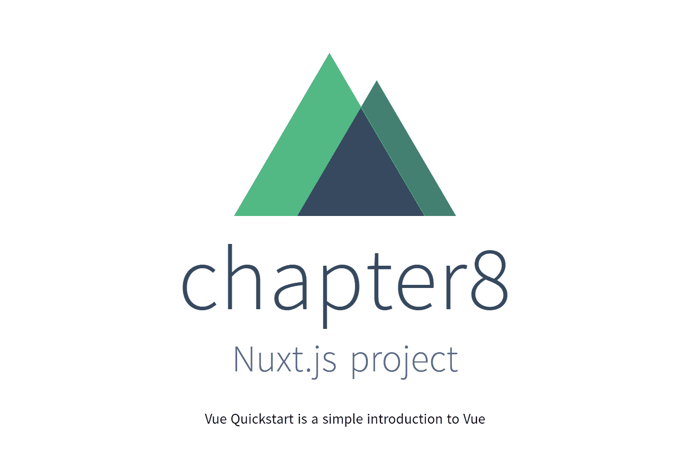
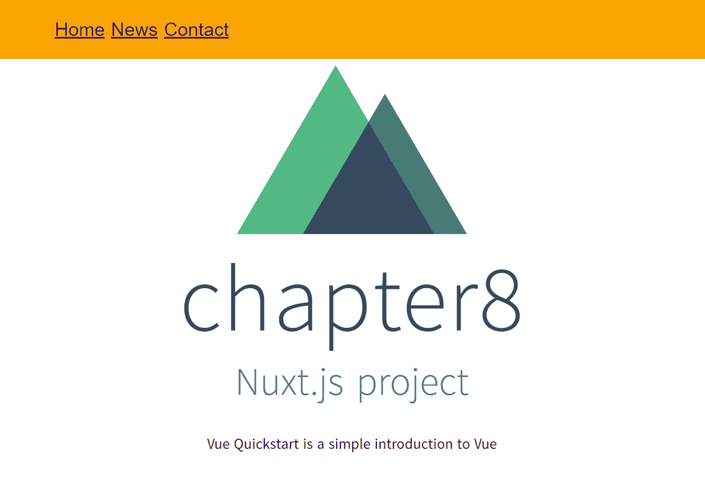

# 八、使用 Nuxt.js 和 Vue 路由

随着**单页申请**（**SPA**的兴起，出现了一些具体问题。在解决这些问题方面有各种各样的尝试，从这些尝试中产生了一些共同的解决办法。在本节中，我们将介绍有关 SPA 的问题以及在 Vue 中解决这些问题的方法

在本章中，我们将使用 Nuxt.js 和 Vue 路由来了解一些概念：

*   单页应用程序
*   初始页面加载
*   服务器端渲染和通用 web 应用程序
*   安装 Nuxt.js
*   Nuxt 页作为路由
*   使用`nuxt-link`标记链接页面

我们将从了解水疗是什么以及它们如何工作开始。

# 单页应用程序和服务器端呈现

传统上，web 服务器只提供静态内容。当用户向应用程序中的链接发出请求时，服务器通常会处理该请求，并将处理结果作为一个完整的页面发送给客户端，浏览器会提供 HTML、CSS 和 JS。在 web 应用程序中请求每条路由时会发生这种情况。如果开发人员想查看浏览器发送的内容，只需在您选择的浏览器中运行[T0]命令即可。

The shortcut key for the view source command is traditionally *Ctrl* + *U* in some browsers, such as Chrome and Firefox.

随着网络体验越来越像台式机，近年来我们看到了**水疗中心的兴起。流行水疗的例子包括 Gmail、Twitter 和谷歌地图。**

 **SPA 的工作方式是：当用户浏览站点上的不同页面（路线）时，浏览器不会向服务器下载带有全新请求的全新页面。SPA 不会在用户每次访问路线时从服务器下载完整页面，而是在客户端呈现所有内容。向服务器发出的请求仅用于获取新数据。

判断一个 web 应用程序是否符合 SPA 的一个好测试是：访问应用程序中的不同路径是否会导致整个应用程序刷新？如果没有，那就是温泉。

An SPA requests new data from the server while traditional web apps download entire pages from the server.

这通常意味着所有 SPA 代码将在一个页面加载**初始页面加载**中下载。这包括 HTML、CSS 和 JS—没有这些代码 SPA 将无法运行。这种方法的缺点是，当在较慢的网络上运行时，或者由于应用程序的巨大规模，下载时间可能会很长，特别是考虑到这些 SPA 中有很多都是 JavaScript 代码的事实。

然而，如前所述，SPAs 的目标是提供卓越的用户体验，表现得像桌面应用程序，即时执行，无延迟。

这个问题的解决方案是引入了**服务器端渲染**。服务器端渲染只是前端框架在服务器上准备 HTML、CSS 和 JS 的能力，这样，当用户访问我们的 SPA 时，他们的浏览器不必一次下载完整的应用程序，而只下载部分代码——完整 SPA 的一部分，不管怎样，仍然允许用户与页面交互。通过代码拆分和再水化等概念，SPA 仅无缝下载开始使用它所需的应用程序部分，然后才下载 SPA 的其余部分，而用户已经在与它交互。这种方法减少了初始加载的延迟。

过去 SPA 的另一个主要问题是搜索引擎爬虫无法读取的问题。由于这些爬虫程序在抓取 SPA 网站时无法运行 JavaScript，因此访问的搜索引擎机器人将看不到 SPA 的内容。因此，服务器端渲染是一种优雅的方法，既可以为用户加快 web 应用程序的速度，也可以让搜索引擎机器人更容易地对其进行索引。

当一个 web 应用程序可以在服务器和客户端上呈现网页时，它被称为**通用 web 应用程序**。通用 web 应用程序基本上是一个具有 SSR 功能的 SPA。

许多现代前端框架都有自己的 SSR 实现。在 Vue 中，这就是我们所称的 Nuxt.js

# 安装 Nuxt.js 并预览默认项目

为了服务不同的路由，在后台 Nuxt.js 使用 Vue 路由。为了保持简单，我们将重点介绍如何使用 Nuxt.js。

有几种方法可以开始使用 Nuxt.js。一个选项是通过`vue init`命令。另一个是一种常见的做法，即`create-nuxt-app`命令，类似于`create-elm-app`或`create-react-app`。

# 使用 vue init 命令安装 Nuxt.js

让我们首先在驱动器上找到一个位置来保存新的 Nuxt 应用程序，然后使用`vue init`命令创建它：

```js
vue init nuxt-community/stater-template chapter8
```

在未安装`vue init`的情况下运行此命令可能会在控制台中返回以下消息：

```js
Command vue init requires a global addon to be installed. 
Please run yarn global add @vue/cli-init and try again.
```

因此，要纠正此问题，只需运行以下命令：

```js
yarn global add @vue/cli-init
```

这需要一些时间，但最终我们将能够运行[T0]命令：

```js
vue init nuxt-community/starter-template chapter8
```

这一次，运行前面的命令将产生一些我们需要回答的问题，以便可以根据我们的喜好配置项目。与我们在 Vue cli 中看到的类似，要接受默认设置，只需按[T0]回车[T1]键即可。

这是控制台的输出，包含所有问题和答案：

```js
? Project name (chapter8)
? Project name chapter8
? Project description (Nuxt.js project)
? Project description Nuxt.js project
? Author (AuthorName <author@email.com>)
? Author AuthorName <author@email.com>)
   vue-cli Generated "chapter 8"

   To get started:
     cd chapter8
     npm install # Or yarn
     npm run dev
```

让我们按照描述运行这些命令。我们将`cd`放入`chapter8`文件夹，然后运行`npm install`。这将产生一个输出，其中包括 Nuxt 徽标的一些漂亮的 ASCII 艺术、贡献者和支持者列表以及其他项目信息。现在，我们可以运行`npm run dev`命令，这将导致以下输出：

```js
[11:12:14] Building project
[11:12:14] Builder initialized
...
[11:12:33] Listening on http://localhost:3000
```

如果我们访问`localhost:3000`页面，我们将看到标准的欢迎屏幕，屏幕上有 Nuxt.js 徽标，下面有我们的项目名称（第 8 章）和两个按钮：指向文档和项目 GitHub 存储库的链接。

# 调试 eslint 错误

在撰写本书时，尽管所有软件都是最新的，`eslint`抛出了一个错误。如果在运行`npm run dev`之后打开`localhost:3000`，您可能会在页面的左上角看到以下错误，即 eslint 模块未定义。

如果发生这种情况，您可以通过在代码编辑器中打开`nuxt.config.js`文件并用以下代码替换第 23 行之后的所有代码来修复：

```js
  build: {
    /*
    ** Run ESLint on save
    */
    /*
    extend (config, { isDev, isClient }) {
      if (isDev && isClient) {
        config.module.rules.push({
          enforce: 'pre',
          test: /\.(js|vue)$/,
          loader: 'eslint-loader',
          exclude: /(node_modules)/
        })
      }
    }
    */
    extend(config) {
      if (process.server && process.browser) {
        config.module.rules.push({
          enforce: 'pre',
          test: /\.(js|vue)$/,
          loader: 'eslint-loader',
          exclude: /(node_modules)/
        })
      }
    } 
  }
}
```

在前面的代码中，我们已经注释掉了有问题的代码，并用正确的代码替换它，以便能够比较差异并理解需要修复的内容。

现在我们可以重新运行[T0]命令，我们应该可以在[T1]处看到没有任何错误的应用程序。

# 使用 CreateNuxt 应用程序安装

或者，我们可以使用`create-nuxt-app`命令。首先，我们需要在全球范围内安装它，以便我们可以在计算机上的任何位置使用它：

```js
npm install -g create-nuxt-app
```

此命令是全局安装，可能需要一些时间。成功安装将导致控制台上记录一些行，即安装了`create-nuxt-app`的本地驱动器上的位置，以及一些其他信息，类似于此：

```js
+ create-nuxt-app@2.1.1
added 401 packages in 20.234s
```

接下来，让我们将控制台指向所需的文件夹，然后运行以下命令：

```js
create-nuxt-app chapter8b
```

与第一种安装方法类似，此方法也会产生一些带有预设答案的问题，我们只需按[T0]回车[T1]键即可接受这些问题。以下是接受默认答案的问题列表：

```js
$ create-nuxt-app chapter8b
> Generating Nuxt.js project in C:\Users\PC\Desktop\chapter8b
? Project name (chapter8b)
? Project name chapter8b
? Project description (My smashing Nuxt.js project)
? Project description My smashing Nuxt.js project
? Use a custom server framework (Use arrow keys)
? Use a custom server framework none
? Use a custom UI framework (Use arrow keys)
? Use a custom UI framework none
? Choose rendering mode (Use arrow keys)
? Choose rendering mode Universal
? Use axios module (Use arrow keys)
? Use axios module no
? Use eslint (Use arrow keys)
? Use eslint no
? Use prettier (Use arrow keys)
? Use prettier no
? Author name (AuthorName)
? Author name AuthorName
? Choose a package manager (Use arrow keys)
? Choose a package manager npm
Initialized empty Git repository in C:/Users/PC/Desktop/chapter8b/.git/
```

与之前的安装类似，我们可以看到运行样板项目的说明，如下所示：

```js
  To get started:

    cd chapter8b
    npm run dev

  To build & start for production:

    cd chapter8b
    npm run build
    npm start
```

那么，让我们运行`cd chapter8b`并使用`npm run dev`进行后续操作。输出几乎与以前的安装方法相同。

# 编辑 index.vue 文件

让我们也编辑我们的`index.vue`文件，在`pages`文件夹中。这是我们应用程序的根路径。我们将做的更改很小：我们将删除[T2]标记中的所有代码。更新后，该代码片段应如下所示：

```js
      <div class="links">
        <p>Vue Quickstart is a simple introduction to Vue</p>
      </div>
```

由于后台的 webpack 正在刷新我们的页面，在保存更改后，我们应该在浏览器中看到此更改的结果：



到目前为止，我们已经了解了如何以两种不同的方式初始化新的 Vue Nuxt 项目。在下一节中，我们将研究[T0]方法的 Nuxt 风格的实现：页面作为路由。

# Nuxt 页作为路由

RubyonRails 推广了*约定优于配置*的方法。这是一种固执己见的 web 开发方法，它在一个框架中以一种“置诸脑后”的方式设置一些东西。当我们说它是自以为是的时候，它仅仅意味着在处理一个问题的几种可能性中，框架的开发人员选择了一种特定的方式，而这种方式是完成某件事情的唯一方式

我们可以说 Nuxt.js 是固执己见的，因为它遵循页面作为路由的约定。因此，我们不必在应用程序中手动设置路由，也就是说，不必***配置***路由，该框架遵循一个简单的***约定***。在 pages 文件夹中，`index.vue`文件充当根路由：`/`。这意味着如果我们运行我们的应用程序，在`localhost:3000`访问根路由等于访问`localhost:3000/index.vue`。

类似地，如果我们创建一个名为`about.vue`的文件并将其放在 pages 文件夹中，要查看该文件，我们需要访问`localhost:3000/about`路径。

那么，我们就这么做吧。在 pages 文件夹中，我们将创建一个新文件并将其命名为`contact.vue`。在该文件中，我们将添加以下代码：

```js
<template>
  <h1>Contact</h1>
</template>
```

这就是`/contact`路线可用所需的全部内容，您可以通过导航到`localhost:3000/contact`亲自查看。我们甚至可以将此文件设置为`contact`文件夹的默认根路径。在这种情况下，我们必须在`pages`文件夹中创建一个子文件夹，并将其命名为`contact`。现在，我们可以在新创建的`contact`文件夹中创建一个`index.vue`文件，路由将保持不变。只有我们在`pages`文件夹中的文件和文件夹结构略有改变，但最终结果是一样的。

但是，在添加更多文件时，将这样的文件拆分为子文件夹将更容易保持组织。

# 通过 components 文件夹向 Nuxt 应用程序添加导航

在我们的应用程序开发的这一点上，有导航功能是非常好的。导航本身不是一个页面；这是一个组件，应该存在于我们的应用程序的每个页面。因此，让我们通过打开`components`文件夹并添加一个新文件来创建它，我们称之为`Navigation.vue`。让我们添加以下代码：

```js
<template>
  <div class="navigation">
    <ul>
        <li><nuxt-link to="/">Home</nuxt-link></li>
        <li><nuxt-link to="/contact">Contact</nuxt-link></li>
        <li><nuxt-link to="/news">News</nuxt-link></li>
    </ul>
  </div>
</template>

<style scoped>
.navigation {
    width: 100%;
    margin: 0;
    padding: 20px;
    background: orange;
    color: #444;
    font-family: Arial, sans-serif;
    font-size: 20px;
}
ul {
    list-style: none;
}
ul li {
    display: inline-block;
}
</style>
```

注意`<nuxt-link>`标签。它只是 Vue 路由实现的一个包装器，`to="..."`属性的值是我们指定实际 URL 的位置，它只是`pages`文件夹中特定文件的名称。

接下来，我们定位`layouts`文件夹，在其内部，在`default.vue`文件中，我们在模板中添加`Navigation`组件，如下所示：

```js
<template>
 <div>
 <Navigation></Navigation>
 <nuxt />
 </div>
</template>
```

Note that we can self-close components, so that instead of `<Navigation></Navigation>`, we could write the shorthand version, which is simply `<Navigation />`.

我们需要确保导入`Navigation`组件时，在`template`标签的正下方添加`script`标签：

```js
<script>
import Navigation from '@/components/Navigation'
export default {
 components: {
 Navigation
 }
}
</script>
```

此时，带有导航更新的主页将如下所示：



现在我们已经准备好导航，我们将添加另一个页面，我们称之为`News.vue`，代码如下：

```js
<template>
  <h1>News</h1>
</template>
```

现在，我们的导航中有三个链接，所以现在我们可以专注于为每个页面添加更多内容。

# 向 Nuxt 应用程序的页面添加内容

让我们更新`News.vue`组件：

```js
<template>
  <section class="news">
    <h1>News</h1>
    <hr>
    <article>
        <h2>We are taking orders for our new product</h2>
        <div>
            Lorem ipsum dolor sit amet, consectetur adipisicing elit. Laudantium perspiciatis dolorem blanditiis maxime doloremque quibusdam obcaecati autem enim ipsum deserunt. Aliquid dolor consequatur repellendus odit, dolores possimus ab cum et voluptatem placeat sunt perferendis porro, eligendi perspiciatis harum pariatur veniam quo sed, reprehenderit voluptates maiores hic! Sint, facilis voluptatibus animi!
        </div>
    </article>
    <article>
        <h2>Our website is live</h2>
        <div>
            Lorem ipsum dolor sit amet, consectetur adipisicing elit. Delectus unde fugit quod, tempore enim obcaecati quam eius explicabo voluptates quo consequatur! Ad iste consequuntur dolorem minima at cupiditate veniam saepe voluptatum, qui hic corporis modi repellendus illum natus optio aut! Omnis praesentium placeat pariatur neque dolorum eaque, labore at et dignissimos impedit nobis, commodi rerum. Debitis est exercitationem ipsa, commodi nihil! Inventore minus ex, quam, facilis ut fuga unde harum possimus dolore ea voluptatum non debitis nihil ipsum repellendus aut dolorum nam nostrum assumenda eveniet corrupti consequatur obcaecati provident alias! Ad est minus repudiandae aliquid maxime provident labore. Asperiores, qui!
        </div>
    </article>
  </section>
</template>

<script>

</script>

<style scoped>
    .news {
        max-width: 500px;
        margin: 0 auto;
        padding-top: 30px;
        font-size: 20px;
    }
    .news article div {
        line-height: 30px;
    }
    h1, h2 {
        padding-top: 20px;
        padding-bottom: 20px;
    }
</style>
```

新闻链接现在将如下所示：


接下来，我们更新`Contact.vue`组件：

```js
<template>
  <section class="contact">
    <h1>Contact</h1>
    <hr>
    <article>
        <h2>Feel free to get in touch!</h2>
        <div>
            <p>Our managers:</p>
            <ul>
                <li>John Doe, +01 123 4567</li>
                <li>Jane Doe, +01 124 4567</li>
                <li>Another Person, +01 125 4567</li>
            </ul>
        </div>
    </article>
  </section>
</template>

<script>

</script>

<style scoped>
    .contact {
        max-width: 500px;
        margin: 0 auto;
        padding-top: 30px;
        font-size: 20px;
    }
    .contact article div {
        line-height: 30px;
    }
    h1, h2 {
        padding-top: 20px;
        padding-bottom: 20px;
    }
</style>
```

我们不会改变我们的 Nuxt.js 项目的原始主页。修改有限的原因是我们只需要有几个页面包含一些虚拟内容，这样我们就可以继续下一节，在这里我们将看到如何将页面转换添加到我们的 Nuxt.js 应用程序中。

# 向我们的 Nuxt.js 应用程序添加页面转换

正如我们在[第 6 章](6.html)、*过渡和动画*中了解到的，Vue 提供了一系列方法来为我们的应用程序添加交互性、过渡和动画。为了加快这个过程，我们将使用`Animate.css`中的动画，并稍作修改。

在 Nuxt 中，我们可以像已经学过的那样使用页面转换挂钩。我们只需将`.v-*`过渡挂钩中的`v`字母替换为`.page-*`。所有的功能和工作方式都将保持不变。

让我们首先打开`pages/index.vue`文件，并在其`style`标记的顶部添加此代码：

```js
.page-enter-active, .page-leave-active {
  transition: opacity 1s;
}
.page-enter, .page-leave-active {
  opacity: 0;
}
```

接下来，我们将打开`contact.vue`文件，并在其`style`标记的顶部添加此代码：

```js
.page-enter-active {
    animation: zoomIn .5s;
} 
@keyframes zoomIn {
from {
    opacity: 0;
    transform: scale3d(0.4, 0.4, 0.4);
}

50% {
    opacity: 1;
}
}

.zoomIn {
animation-name: zoomIn;
}
```

最后，我们将使用以下代码更新`news.vue`的`style`标记顶部：

```js
.page-enter-active {
    animation: bounce .5s;
} 
.page-leave-active {
    animation: bounce .5s;
} 
@keyframes bounce {
    from,
    20%,
    55%,
    85%,
    to {
        animation-timing-function: cubic-bezier(0.320, 0.70, 0.355, 1);
        transform: translate3d(0, 0, 0);
    }

    40%,
    43% {
        animation-timing-function: cubic-bezier(0.700, 0.05, 0.855, 
         0.06);
        transform: translate3d(0, -30px, 0);
    }

    70% {
        animation-timing-function: cubic-bezier(0.700, 0.05, 0.855, 
        0.06);
        transform: translate3d(0, -15px, 0);
    }

    90% {
        transform: translate3d(0, -4px, 0);
    }
}
```

在这一点上，您可以自由地测试您的应用程序，看看您是如何通过对路由文件中的[T0]标记进行少量更改来实现显著的视觉改进的。

In this chapter, we got acquainted with the basics of building a rudimentary Nuxt.js app. There are many ways in which this can be improved and built upon. To continue building better apps and learning more about running Vue apps on Node, feel free to refer to other titles in the Packt library, such as *Full Stack Web Development with Vue.js and Node*.

# 总结

在本章中，我们了解了单页应用程序、导致它们出现的想法以及它们的实现带来的挑战，例如初始页面加载问题。我们还了解了 SPA 相关问题的解决方案，如服务器端渲染，以及 Nuxt.js 如何帮助我们构建通用 web 应用程序。我们学习了如何安装 Nuxt.js 并将 Nuxt.js 页面设置为路由。我们使用`nuxt-link`标记链接了我们的 Vue 应用程序的路由，并在每个页面上添加了一些内容。最后，为了巩固我们在前几章学到的内容，我们添加了一些页面转换，以获得更流畅的用户体验。

这将我们带到*Vue JS 快速启动*的结尾。我们已经介绍了一系列基本的 Vue JS 概念。作为一个快速概述，我们可以重申我们已经介绍过的一些内容：胡须模板、指令、修改器、方法、计算属性、观察者、组件（全局和本地）、属性、生命周期挂钩、vue cli、插槽、父子组件通信、过滤器、混音器、自定义指令和插件、转换、动画、，过渡组件，集成第三方动画、绑定样式、使用过渡组和 JavaScript 动画挂钩、SPA、状态和存储的概念、单向数据流、使用 Vuex、使用初始页面加载、Nuxt、SSR 和通用 web 应用

在这本短小的书中，我们涵盖了很多领域。我们必须保持基本的东西，以便看到组成 Vue JS 的所有运动部件的大图。从这里到哪里去？

您可以通过多种方式进一步提高与 Vue 相关的技能。您可以专注于理解如何使用服务器端技术，如 Node、Laravel 或.NETCore。您还可以使用 VuePress—一种使用 Vue 构建静态 JS 站点的方法。或者您可能想查看*Vuex 快速入门指南*

为了更方便地继续提高 Vue.js 技能，Packt 库中有二十多个标题供您使用，其中包括与本摘要中列出的主题相关的标题。**