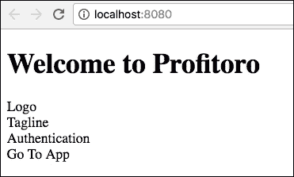
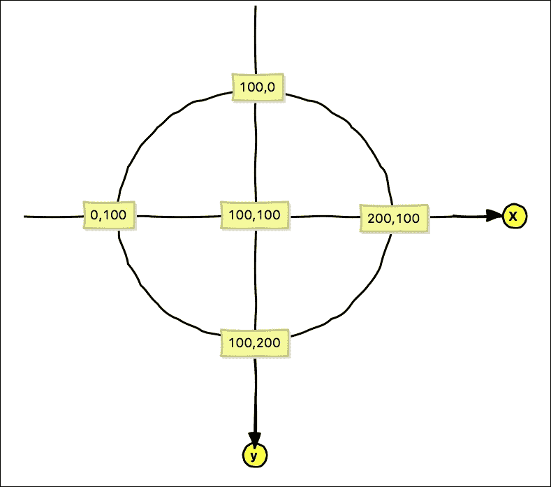
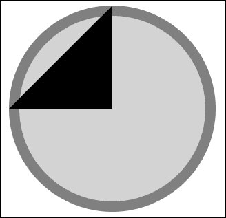
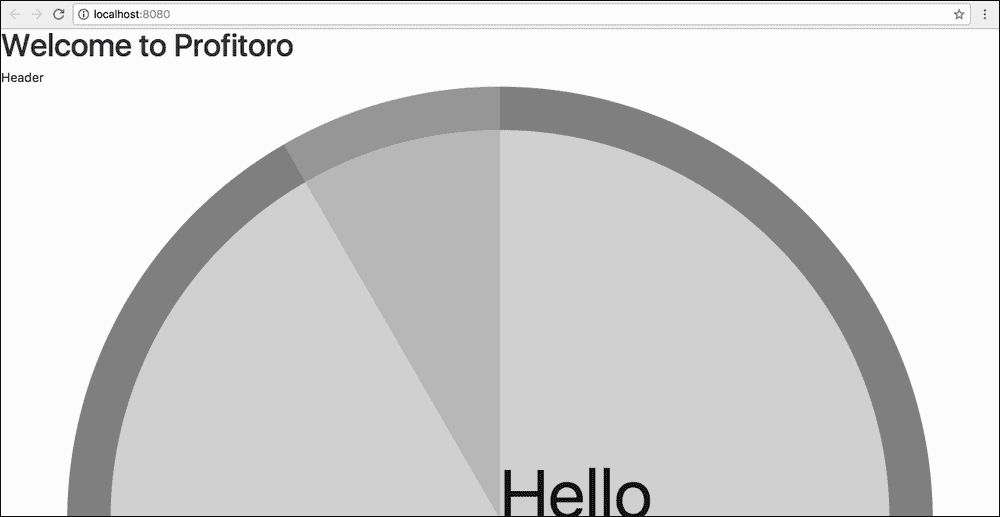
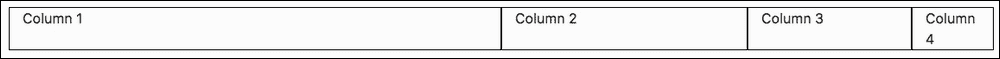
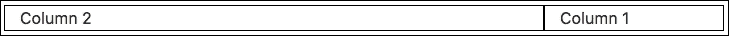
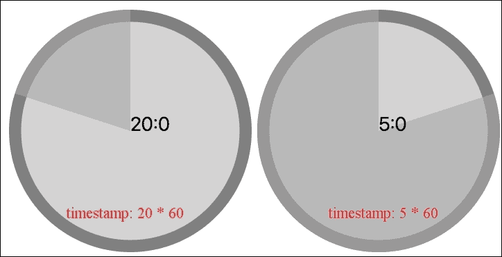
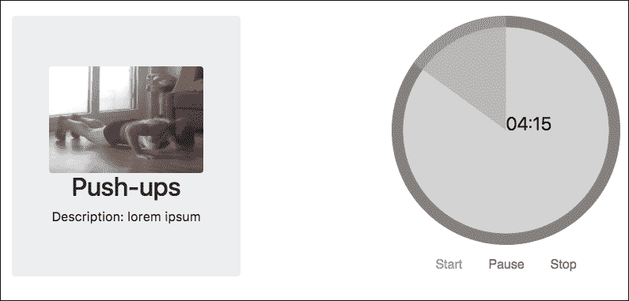
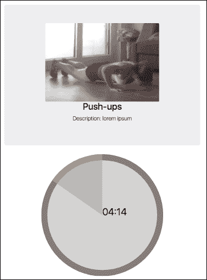

# 第四章，让它来吧，波莫多罗！

上一章以一组用于*ProFitOro*应用程序的模型结束。我们之前已经定义了应用程序应该做什么；我们还确定了一个平均用户配置文件，并准备实施它。在本章中，我们将最终开始编码。因此，在本章中，我们将做以下工作：

*   脚手架*ProFitOro*使用 vue cli 和`webpack`模板
*   定义所有需要的应用程序组件
*   为所有组件创建占位符
*   实现一个组件，该组件将负责使用 Vue.js 和 Bootstrap 呈现 Pomodoro 计时器
*   重温三角函数的基础知识（你没想到，对吧？）

# 搭建应用程序

在做所有事情之前，让我们确保我们在同一页上，至少关于节点版本。我使用的 Node.js 版本是*6.11.1*。

让我们首先为我们的应用程序创建一个框架。我们将使用 vue cli 和`webpack`模板。如果您不记得**vue cli**是关于什么以及它来自何处，请在[查看有关这方面的 vue 官方文档 https://github.com/vuejs/vue-cli](https://github.com/vuejs/vue-cli) 。如果出于某种原因，您仍然没有安装它，请继续安装：

```js
npm install -g vue-cli

```

现在，让我们引导我们的应用程序。我相信您还记得，为了用`vue-cli,`初始化应用程序，您必须运行`vue init`命令，后跟要使用的模板名称和项目本身的名称。我们将使用`webpack`模板，我们的应用程序名称为`profitoro`。那么，让我们初始化它：

```js
vue init webpack profitoro

```

在初始化过程中，您将被问到一些问题。只需不断点击*回车*即可对所有人进行默认`Yes`应答；`Yes`因为对于这个应用程序，我们需要一切：过梁、vue 路由器、单元测试、端到端测试，一切。这将是巨大的！

您的控制台输出应该与我的几乎相同：


应用程序初始化时的控制台输出

现在，在新创建的目录中运行`npm install`：

```js
cd profitoro
npm install

```

让我们安装`sass`加载器，因为我们将使用`sass`预处理器来设计我们的应用程序：

```js
npm install sass-loader node-sass --save-dev

```

最后，我们准备运行它：

```js
npm run dev

```

您的新 Vue 应用程序已准备就绪。为了给我们的 ProFitOro 提供一个干净的场地，请删除与已安装的`Hello`组件相关的所有内容以及默认安装过程。或者，打开[第 4 章](#12AK81-449ee41b57ea4c048225480b41c8dbe3 "Chapter 4. Let It Pomodoro!")的代码文件，*让它来吧！*并从`chapter4/1/profitoro`文件夹中获取样板代码。

# 定义 ProFitOro 组件

我们的应用程序由两个主屏幕组成。

其中一个屏幕是所谓的*登录页*；本页由以下部分组成：

*   标志
*   标语
*   认证部分
*   指向未经注册即可使用的应用程序的链接

示意图上，这是我们的组件在屏幕上的定位方式：


包含徽标、标语、身份验证部分和应用程序链接的登录页

第二个屏幕是主应用程序屏幕。此屏幕包含三个部分：

*   标题
*   页脚
*   内容

内容部分包含Pomodoro 定时器。如果用户经过身份验证，它还将包含设置、训练和统计信息：


包含页眉、页脚和内容的主应用程序屏幕

让我们为相应的子组件创建一个名为`components`的文件夹和名为`main`、`landing,`和`common`的子文件夹。

登录页和主页的组件将驻留在`components`文件夹中；其余 11 个组件将分布在各自的子文件夹中。

对于每个定义的组件文件，添加`template`、`script`和`style`部分。将`lang="sass"`属性添加到`style`标记，因为正如我已经提到的，我们将使用`sass`预处理器来设计我们的组件。因此，例如，`HeaderComponent.vue`将如下所示：

```js
//HeaderComponent.vue
<template>
  <div>Header</div>
</template>
<script>
  export default {

  }
</script>
<style scoped lang="sass">

</style>
```

因此，我们有 13 个占位符用于我们的组件，准备用必要的数据填充。这些组件将被使用和重用。这是因为 Vue 组件是*可重用组件*，这就是为什么它们如此强大的原因。在开发过程中，我们不可避免地会添加更多的组件和子组件，但这是我们的基础：


ProFitOro 的 13 个基本组件

检查`chapter4/2/profitoro`文件夹中的引导组件。

让我们用所需的子组件填充`LandingPage`和`MainContent`组件，以准备它们。在此之前，为每个子文件夹添加一个`index.js`文件，并导出其中相应子文件夹的内容。这将使以后的导入更容易。因此，以文件夹`common`开始并添加具有以下内容的`index.js`文件：

```js
//common/index.js
export {default as Logo} from './Logo'
```

对文件夹`sections`、`main`和`landing`重复相同的操作。

现在，我们可以组成我们的登录页和主要内容组件。让我们从`LandingPage.vue`开始。该组件由徽标、身份验证部分、应用程序链接和标语组成。导入所有这些组件，将它们导出到`components`对象，并在`template`中使用它们！我们在`index.js`文件中导出了这些组件，因此我们可以按如下方式导入它们：

```js
//LandingPage.vue
import {Authentication, GoToAppLink, Tagline} from './landing'
import {Logo} from './common'
```

现在我们可以在`LandingPage`组件的`components`对象中使用这些导入的组件。顺便问一下，你有没有在同一个短语中见过这么多的单词*成分*？“组件，组件，组件”和导出的对象如下所示：

```js
//LandingPage.vue
export default {
  components: {
    Logo,
    Authentication,
    GoToAppLink,
    Tagline
  }
}
```

在`components`对象内导出后，所有这些组件都可以在模板内使用。请注意，**骆驼壳**中的所有内容都将在模板中变成**烤肉串**。所以，我们的`GoToAppLink`看起来像`go-to-app-link`。因此，模板中的组件将如下所示：

```js
<logo></logo>
<tagline></tagline>
<authentication></authentication>
<go-to-app-link></go-to-app-link>
```

因此，我们整个`LandingPage`组件目前将具有以下代码：

```js
//LandingPage.vue
<template>
  <div>
    <logo></logo>
 <tagline></tagline>
 <authentication></authentication>
 <go-to-app-link></go-to-app-link>
  </div>
</template>
<script>
  import {Authentication, GoToAppLink, Tagline} from './landing'
  import {Logo} from './common'
  export default {
    components: {
      Logo,
 Authentication,
 GoToAppLink,
 Tagline
    }
  }
</script>
<style scoped lang="sass">

</style>
```

让我们告诉`App.vue`呈现这个组件：

```js
//App.vue
<template>
  <div id="app">
    <h1>Welcome to Profitoro</h1>
    <landing-page></landing-page>
  </div>
</template>

<script>
  import LandingPage from './components/LandingPage'
  export default {
    name: 'app',
    components: {
      LandingPage
    }
  }
</script>
```

检查页面。你能看到你的部件吗？我相信，你可以：



登陆页面组件

现在，我们*只需*就可以实现对应的组件，我们的登陆页面已经准备好了！

## 运动

对`MainContent`组件执行相同操作，导入和导出所有必要的子组件，并将它们添加到模板中。然后，调用`App.vue,`中的`MainContent`组件，就像我们刚才调用`LandingPage`组件一样。如有疑问，请检查`chapter4/3/profitoro`文件夹中的代码。

# 实现 Pomodoro 定时器

毫无疑问，我们应用程序中最重要的组件之一是 Pomodoro 定时器。它执行应用程序的主要功能。因此，首先实施它可能是一个好主意。

我在想一种循环计时器。大概是这样的：


循环计时器将作为 Pomodoro 计时器实施

随着时间的推移，突出显示的扇区将逆时针移动，时间也将倒计时。为了实现这种结构，我考虑了三个部分：

*   *SvgCircleSector*：此组件将只接收一个角度作为属性，并为 SVG 圆的相应扇区上色。
*   *倒计时*：此组件将接收倒计时的秒数，执行计时器并计算每次计时器更新时传递到`SvgCircularComponent`的角度。
*   *Pomotorotimer*：我们已经引导了该组件。该组件将负责调用具有初始时间的`CountDownTimer`组件，并根据当前工作时间或中断间隔将其更新为相应的秒数。

## SVG 与三角学

让我们从定义`SvgCircleSector`组件开始。该组件将接收`angle`和`text`作为属性，并绘制一个 SVG 圆，该圆具有给定角度的高亮显示扇区。在`components/main/sections`文件夹中创建一个名为`timer`的文件夹，然后在其中创建一个`SvgCircleSector.vue`文件。定义`template`、`script,`和`style`所需的部分。您还可以使用此组件将从其父组件接收的`angle`和`text`属性导出`props`：

```js
//SvgCircleSector.vue
<template>
  <div>
  </div>
</template>
<script>
  export default {
    props: ['angle', 'text']
  }
</script>
<style scoped lang="scss">
</style>
```

那么，我们如何使用 SVG 并通过突出显示其扇区来绘制一个圆圈？首先，让我们画两个圆：一个在另一个里面。让我们把`100px`半径中较大的一个和`90px`半径中较小的一个。本质上，我们必须提供中心、*x*和*y*坐标、半径（`r`和`fill`属性。查看有关 SVG 中圆圈的文档，参见[https://developer.mozilla.org/en-US/docs/Web/SVG/Element/circle](https://developer.mozilla.org/en-US/docs/Web/SVG/Element/circle) 。我们将以这样的方式结束：

```js
<svg width="200" height="200" >
  <circle r="100" cx="100" cy="100" fill="gray"></circle>
  <circle r="90" cx="100" cy="100" fill="lightgray"></circle>
</svg>
```

因此，我们得到了两个圆，一个在另一个里面：


使用 SVG circle 元素绘制的两个圆

现在，为了绘制一个圆的高亮显示扇区，我们将使用*路径*SVG 元素（[https://developer.mozilla.org/en-US/docs/Web/SVG/Element/path](https://developer.mozilla.org/en-US/docs/Web/SVG/Element/path) ）。

使用 SVG path 元素，您可以绘制任何您想要的内容。它的主要属性称为`d`，基本上是一种使用 SVG 领域特定语言编程路径的方法。例如，这是如何在圆内绘制三角形：

```js
<path d="M100,100 V0 L0,100 H0 z"></path>
```

这些代码代表什么？`M`表示*移动*、`L`表示*线*、`V`表示*垂直线*、`H`表示*水平线*、`z`表示*在此停止路径*。因此，我们告诉我们的路径首先移动到`100`、`100`（圆心），然后画一条垂直线，直到它到达*y*轴的`0`点，然后画一条线到`0`、`100`*x*、*y*坐标，然后画一条水平线，直到它到达圆心`100`*x*坐标，然后停止。我们的二维坐标区域由*x*和*y*轴组成，其中*x*从`0`开始，从左到右一直上升到`200`，而【T40 y 从`0`开始从上到下一直上升到`200`。

这就是（*x*、*y*坐标如何寻找我们小圆坐标系的中心点和端点：



标记点表示 SVG 圆的（x，y）坐标，中心位于（100100）

因此，如果我们从（`100`、`100`）开始，画一条到（`100`、`0`）的垂直线，然后画一条到（`0`、`100`）的线，然后画一条水平线直到（`100`、`100`），我们最后在圆的左上象限画一个右三角形：



路径在圆内绘制一个三角形

这只是对 path SVG 元素的一个小介绍，以及使用它可以实现什么。然而，我们仍然需要画一个圆，而不仅仅是一个三角形。为了使用 path 绘制扇区，我们可以在`d`属性中使用`A`命令。`A`表示*弧*。这可能是路径中最复杂的命令。接收以下信息：*rx、ry、x 轴旋转、大弧标志、扫掠标志、x、y*。

我们案例中的前四个属性始终可以是`100`、`100`、`0`、`0`。如果您想了解原因，请查看[T4]中有关弧路径属性的 w3c 文档 https://www.w3.org/TR/SVG/paths.html#PathDataEllipticalArcCommands 。

对我们来说，最重要的属性是最后三个。*扫掠标志*表示*弧*的方向；顺时针和逆时针方向可以是`0`或`1`。在我们的例子中，它将始终是*0*，因为这是我们希望绘制弧的方式（逆时针）。至于最后的*x*和*y*值，这些值决定了电弧将停止的位置。因此，例如，如果我们想要在*90*度处绘制左上扇区，我们将在`0`、`100`坐标处停止圆弧-*x*是`0`，而*y*是`100`-因此我们的`d`属性将如下所示：

```js
d="M100,100 L100,0 A100,100 0 0,0 0,100 z"
```

整个 SVG 元素包含两个圆圈和扇区，如下所示：

```js
<svg width="200" height="200" >
  <circle r="100" cx="100" cy="100" fill="gray"></circle>
  <circle r="90" cx="100" cy="100" fill="lightgray"></circle>
  <path id="sector" fill="darkgray" opacity="0.6" d="M100,100 L100,0 A100,100 0 0,0 0, 100 z"></path>
</svg>
```

此代码生成以下结果：


使用路径 SVG 元素绘制的 90 度扇区

我们必须将这个`d`属性定义为计算值所依赖的动态属性。要表达这一点，我们必须使用分号后面带有属性的`v-bind`：`v-bind:d`，或者干脆使用`:d`。让我们命名相应的属性路径，并将其添加到我们组件的导出对象`computed`：

```js
//SvgCircleSector.vue
<template>
  <div>
    <svg class="timer" width="200" height="200" >
      <...>
      <path class="segment" :d="path"></path>
    </svg>
  </div>
</template>
<script>
  function calcPath (angle) {
    let d
    d = "M100,100 L100,0 A100,100 0 0,0 0, 100 z"
    return d
  }
  export default {
    props: ['angle', 'text'],
    computed: {
      path () {
        return calcPath(this.angle)
      }
    }
  }
</script>
```

我引入了一个名为`calcPath`的函数，它将确定我们的路径字符串。现在，它返回将高亮显示*90*度区域的路径。

我们差不多完成了。我们实际上可以画一个线段，但缺少的是绘制任意角度线段的能力。我们的`SvgCircleSector`组件将接收角度作为属性。此角度并不总是等于*90*度。我们应该提出一个公式，计算出端*x*和*y*坐标，给定`angle`。如果你对重温基本三角不感兴趣，只需跳过这一部分，继续本节的结尾。

这是我计算小于*180*度的角度的*x*、*y*坐标的方法：


为了计算角α的（x，y），我们需要计算直角三角形的 a 边和 b 边

从图中可以看出：

```js
x = 100 – b
y = 100 – a
```

因此，我们只需要计算`a`和`b`。这是一项容易的任务。我们可以计算直角三角形的腿知道角度和斜边。斜边`c`等于圆的半径（`100`在我们的例子中）。与角度相邻的支腿`a`等于`c * cosα`，与角度支腿相对的支腿`b`等于`c * sin``α`。因此：

```js
x = 100 – 100 * sinα
y = 100 – 100 * cosα
```

对于大于*180*度的角度，我们有以下方案：


对于大于 180°的角度，我们还必须计算直角三角形的边

我能告诉你一个秘密吗？我真的不擅长画这样的计划。我尝试了一切，从纸上的草图到使用 Gimp 绘图。一切看起来都很丑陋。幸运的是，我有我的兄弟*伊利亚*，他用草图在五分钟内创建了这些图形。非常感谢，*伊路斯卡*！

回到我们的案子。在这种情况下，直角三角形的角度等于`270° -` `α`。我们的`x`等于`100 + b`，而`y`等于`100 + a`。以下是简单的计算：

```js
a = c * sin (270 - α)
a = c * sin (180 + (90 - α))
a = -c * sin (90 - α)
a = -c * cosα
b = c * cos (270 - α)
b = c * cos (180 + (90 - α))
b = -c * cos (90 - α)
b = -c * sinα
```

因此：

```js
x = 100 + (-100 * sinα) = 100 – 100*sinα
y = 100 + (-100 * cosα) = 100 – 100*cosα
```

这与小于*180*度的角度完全相同！

这就是计算*x*、*y*坐标的JavaScript 代码的样子：

```js
function calcEndPoint (angle) {
  let x, y

  x = 100 - 100 * Math.sin(Math.PI * angle / 180)
 y = 100 - 100 * Math.cos(Math.PI * angle / 180)

  return {
    x, y
  }
}
```

现在，我们终于可以定义一个函数，该函数将根据角度确定 path 元素的`d`字符串属性。此函数将调用`calcEndPoint`函数并返回一个包含最终`d`属性的`string`：

```js
function calcPath (angle) {
  let d
  let {x, y} = calcEndPoint(angle)
  if (angle <= 180) {
    d = `M100,100 L100, 0 A100,100 0 0,0 ${x}, ${y} z`
  } else {
    d = `M100,100 L100, 0 A100,100 0 0,0 100, 200 A100,100 0 0,0 ${x}, ${y} z`
  }
  return d
}
```

为了完成我们的组件，让我们引入一个文本 SVG 元素，它只呈现传递给组件的文本属性。也可以画一个没有任何文字的圆圈；因此，让我们将此元素设置为有条件的。我们通过`v-if`指令实现：

```js
//SvgCircleSector.vue
<template>
  <div>
    <svg class="timer" width="200" height="200" >
      <...>
      <text v-if="text != ''" class="text" x="100" y="100">
        {{text}}
      </text>
    </svg>
  </div>
</template>
```

我们还将提取大圆圈和小圆圈的样式，以及`style`部分的路径和文本。让我们定义有意义的类，以便我们的模板如下所示：

```js
//SvgCircleSector.vue
<template>
  <div>
    <svg class="timer" width="200" height="200" >
      <circle class="bigCircle" r="100" cx="100" cy="100"></circle>
      <circle class="smallCircle" r="90" cx="100" cy="100"></circle>
      <path class="segment" :d="path"></path>
      <text v-if="text != ''" class="text" x="100" y="100">
        {{text}}
      </text>
    </svg>
  </div>
</template>
```

在`style`标记中，让我们为颜色定义变量，并将它们用于我们的圆圈。如果我们决定更改应用程序的颜色方案，则提取变量的颜色将有助于我们在将来轻松地更改它们。因此，SVG 组件的样式如下所示：

```js
//SvgCircleSector.vue
<style scoped lang="scss">
  $big-circle-color: gray;
 $small-circle-color: lightgray;
 $segment-color: darkgray;
 $text-color: black;

  .bigCircle {
    fill: $big-circle-color;
  }
  .smallCircle {
    fill: $small-circle-color;
  }
  .segment {
    fill: $segment-color;opacity: 0.6;
  }
  .text {
    font-size: 1em;
    stroke-width: 0;
    opacity: .9;
    fill: $text-color;
  }
</style>
```

### 运动

到目前为止，我们使用的是绝对大小的圆圈；它的半径总是`100`像素。使用应用于`svg`元素的`viewBox`和`preserveAspectRatio`属性，使我们的圈具有响应性。玩弄它；在具有不同角度属性的`PomodoroTimer`组件中调用此组件，查看其工作原理。我想出了这样一个疯狂的页面：


由许多 SVG 圆圈组成的疯狂页面，扇形由给定角度定义

检查`chapter4/4/profitoro`文件夹中的代码。特别要注意位于`components/sections/timer`文件夹内的`SvgCircleSector.vue`组件和`PomodoroTimer.vue`组件，其中圆组件被多次调用，具有不同的角度属性。

## 实现倒计时组件

现在我们有了一个完整的功能组件，该组件渲染一个带有给定角度的高亮区域的圆，我们将实现`CountDownTimer`组件。此组件将收到作为属性倒计时的秒数。它将包含控制元素：一组按钮，允许您*启动*、*暂停*和*停止*计时器。计时器启动后，秒数将倒计时，角度将相应地重新计算。重新计算的角度将传递给`SvgCircleSector`组件和计算文本。文本将包含计时器上剩余的分钟数和秒数。

首先，在`components/main/sections/timer`文件夹中创建一个`CountDownTimer.vue`文件。让我们从这个组件调用`SvgCircleSector`组件，为`angle`和`text`属性调用一些任意值：

```js
//CountDownTimer.vue
<template>
  <div class="container">
    <div>
      <svg-circle-sector :angle="30" :text="'Hello'"></svg-circle-sector>
    </div>
  </div>
</template>
<script>
  import SvgCircleSector from './SvgCircleSector'
  export default {
    components: {
      SvgCircleSector
    }
  }
</script>
<style scoped lang="scss">

</style>
```

打开页面。有点大。它甚至不适合我的屏幕：



我们的组件不适合我的屏幕

但是，如果我在手机上打开它，它的渲染没有任何问题，实际上看起来很漂亮：


我们的组件实际上非常适合移动屏幕

这是因为我们的圈反应灵敏。如果您尝试调整浏览器的大小，您将看到圆圈会相应地调整大小。其宽度始终为浏览器的*100%*。当页面的高度大于宽度（手机浏览器就是这样）时，它看起来不错，但当宽度大于高度（桌面屏幕就是这样）时，它看起来又大又丑。因此，我们的圈子反应灵敏，但不是真正的适应性。但是我们正在使用引导！Bootstrap 在响应能力和适应能力方面是一个好朋友。

## 使用引导的倒计时计时器的响应性和适应性

为了实现对任何设备的适应性，我们将在[使用引导网格系统构建布局 https://v4-alpha.getbootstrap.com/layout/grid/](https://v4-alpha.getbootstrap.com/layout/grid/) 。

### 注

请注意，此 URL 用于 alpha 版本，下一个版本将在官方网站上提供。

本系统基于十二列行布局。`row`和`col`类包括不同的层，每个媒体查询一个。因此，基于装置尺寸，相同元件可以具有不同的相对尺寸。这些类的名称是不言自明的。包装行类名为`row`。然后，每列可以有一个名为`col`的类。例如，这是一个简单的行，四列大小相等：

```js
<div class="row">
  <div class="col">Column 1</div>
  <div class="col">Column 2</div>
  <div class="col">Column 3</div>
  <div class="col">Column 4</div>
</div>
```

此代码将产生以下结果：


具有四个大小相等的列的引导行

类[T0]可以与您希望为您的列指定的大小组合：

```js
<div class="col-*">Column 1</div>
```

这里，`*`可以是`1`到`12`之间的任何内容，因为每行最多可以包含 12 列。下面是一个包含四列大小不同的行的示例：

```js
<div class="row">
  <div class="col-6">Column 1</div>
  <div class="col-3">Column 2</div>
  <div class="col-2">Column 3</div>
  <div class="col-1">Column 4</div>
</div>
```

因此，第一列将占据行的一半，第二列将是行的第四部分，第三列是行的 1/6 部分，最后一列是行的 1/12 部分。下面是它的样子：



具有不同大小列的引导行

不要介意黑色边框；我添加了它们，因此列宽变得更加明显。Bootstrap 将无边界地绘制布局，除非您告诉它包含它们。

Bootstrap 还提供了一种技术，用于在[处偏移给定数量的列 https://v4-alpha.getbootstrap.com/layout/grid/#offsetting-第](https://v4-alpha.getbootstrap.com/layout/grid/#offsetting-columns)列。

### 注

请注意，此 URL 用于 alpha 版本，下一个版本将在官方网站上提供。

例如，我们就是这样制作两列的，一列的大小为`6`，另一列的大小为`2`，偏移量为`4`：

```js
<div class="row">
  <div class="col-6">Column 1</div>
  <div class="col-2 offset-4">Column 2</div>
</div>
```

下面是它的样子：


具有两列的行，其中一列的偏移量为 4

您甚至可以玩列，并通过玩`push-*`和`pull-*`类来改变它们的顺序。欲了解更多信息，请访问[https://v4-alpha.getbootstrap.com/layout/grid/#push-并拉动](https://v4-alpha.getbootstrap.com/layout/grid/#push-and-pull)。

### 注

请注意，此 URL 用于 alpha 版本，下一个版本将在官方网站上提供

这些类的作用与`offset-*`类几乎相同；它们为您的专栏提供了更大的灵活性。例如，如果我们要渲染一个大小为`3`的列和一个大小为`9`的列并更改它们的顺序，我们需要将大小为`3`的列推到`9`位置，并将大小为`9`的列拉到`3`位置：

```js
<div class="row">
  <div class="col-3 push-9">Column 1</div>
  <div class="col-9 pull-3">Column 2</div>
</div>
```

此代码将生成以下布局：



使用 push-*和 pull-*类更改列顺序

尝试所有这些例子并检查，无论您如何调整页面大小，布局的比例始终相同。这是 Bootstrap 布局的强大功能；您甚至不必费心让布局响应。我在本节第一段中提到的不同设备是什么？到目前为止，我们一直在探索名为`col-*`、`offset-*`、`push-*`和`pull-*`的课程。Bootstrap 还为每种媒体查询提供了这组类。

引导中有五种类型的设备：

<colgroup class="calibre22"><col class="calibre23"> <col class="calibre23"> <col class="calibre23"></colgroup> 
| 哈哈哈。[这些字母是古兰经中的奇迹之一，只有真主知道它们的含义。] | 超小型设备 | 人像电话（<544px） |
| **sm** | 小型设备 | 景观电话(≥544px-<768px） |
| **md** | 媒体设备 | 药片(≥768px-<992px） |
| **lg** | 大型设备 | 台式机(≥992px-<1200px） |
| **xl** | 超大设备 | 台式机(≥1200 像素） |

为了指示给定设备上所需的行为，只需在类名和其大小之间传递设备名称。因此，例如，如果您希望将大小分别为`8`和`4,`的两列转换为移动设备上的两个堆叠列，您可以执行以下操作：

```js
<div class="row">
  <div class="col-sm-12 col-md-8">Column 1</div>
  <div class="col-sm-12 col-md-4">Column 2</div>
</div>
```

如果您在浏览器中打开此代码并尝试调整页面大小，您将看到一旦大小小于`544`像素，列将堆叠：


两列布局在小屏幕上成为堆叠的等尺寸列布局

那么，我们应该如何使用计时器呢？我可以说，它可以在小型设备上占据整个宽度（*100%*），在中等宽度设备上占据宽度的 2/3，在大型设备上占据宽度的一半，在超大设备上占据宽度的 1/3。因此，它需要以下类别：

*   **col-sm-12**用于小型设备
*   **col-md-8**用于中等宽度设备
*   **col-lg-6**用于大型设备
*   **col-xl-4**用于超大设备

我还希望我的圆圈出现在屏幕中央。为此，我将使用应用于行的`justify-content-center`类：

```js
<div class="row justify-content-center">
  <svg-circle-sector class="col-sm-12 col-md-8 col-lg-6 col-xl-4" :angle="30" :text="'Hello'"></svg-circle-sector>
</div>
```

打开页面并尝试调整其大小，模拟不同的设备，测试纵向和横向视图。我们的圆圈相应地调整大小。检查`chapter4/5/profitoro`文件夹中的代码；特别要注意`components/CountDownTimer.vue`组件。

## 倒计时组件–让我们倒计时！

我们已经实现了倒计时计时器组件的响应。让我们最终把它变成一个真正的倒计时组件。让我们从添加控件开始：开始、暂停和停止按钮。现在，我将使它们看起来像链接。为此，我将在[使用引导的`btn-link`类 https://v4-alpha.getbootstrap.com/components/buttons/](https://v4-alpha.getbootstrap.com/components/buttons/) 。

### 注

请注意，此 URL 用于 alpha版本，下一个版本将在官方网站上提供。

我还将使用 Vue 的`v-on`指令在[处的每个按钮点击上绑定方法 https://vuejs.org/v2/api/#v-在](https://vuejs.org/v2/api/#v-on)上：

```js
<button v-on:click="start">Start</button>
```

或者，我们可以简单地使用：

```js
<button @click="start">Start</button>
```

因此，按钮的代码如下所示：

```js
<div class="controls">
  <div class="btn-group" role="group">
    <button @click="start" type="button" class="btn btn-link">Start</button>
    <button @click="pause" type="button" class="btn btn-link">Pause</button>
    <button @click="stop" type="button" class="btn btn-link">Stop</button>
  </div>
</div>
```

将`text-center`类添加到包装容器`div,`中，使按钮居中对齐。现在，通过控制按钮，我们的计时器如下所示：


带控制按钮的倒计时计时器

当我们开始讨论这个组件时，我们说它将从其父组件接收倒计时时间（以秒为单位）。让我们添加一个名为`time`的属性，并从父组件传递该属性：

```js
//CountDownTimer.vue
<script>
  <...>
  export default {
    props: ['time']
    <...>
  }
</script>
```

现在，让我们将此属性导出为`PomodorTimer`组件中的计算硬编码属性，并将其绑定到`CountDownTimer`组件。让我们将其硬编码为`25`分钟或`25 * 60`秒：

```js
//PomodoroTimer.vue
<template>
  <div>
    <count-down-timer :time="time"></count-down-timer>
  </div>
</template>
<script>
  import CountDownTimer from './timer/CountDownTimer'
  export default {
    computed: {
 time () {
 return 25 * 60
 }
 },
    components: {
      CountDownTimer
    }
  }
</script>
```

好的，我们的倒计时组件以秒为单位接收时间。它将如何更新`angle`和`text`？由于我们无法更改父属性（`time`），因此需要引入一个属于此组件的值，然后我们可以在组件内部对其进行更改，并基于此值计算角度和文本值。让我们引入这个新值并将其命名为`timestamp`。将其放入倒计时组件的数据函数中：

```js
//CountDownTimer.vue
data () {
  return {
    timestamp: this.time
  }
},
```

现在让我们为[T0]添加一个计算值。我们如何根据时间戳（以秒为单位）计算角度？如果我们知道每秒的度数，那么我们只需将该值乘以所需秒数：

```js
angle = DegreesPerSecond * this.timestamp
```

知道初始时间（以秒为单位），就很容易计算出每秒的度数。由于整个圆周有*360 度*，我们只需将*360*除以*初始时间*：

```js
DegreesPerSecond = 360/this.time
```

最后，但并非最不重要的一点是，由于我们的计时器是逆时针计时器，我们需要将反向角度传递给`SvgCircleSector`分量，因此我们对角度的最终计算值如下所示：

```js
  computed: {
    angle () {
      return 360 - (360 / this.time * this.timestamp)
    }
  }
```

用角度值替换模板中硬编码的角度绑定：

```js
<svg-circle-sector :angle="angle"></svg-circle-sector>
```

玩弄`timestamp`的价值；尝试将其从`0 * 60`设置为`25 * 60`。您将看到高亮显示的区域如何相应地发生变化：


圆圈的突出显示区域随给定的时间戳而相应改变

我不确定你的情况，但我已经厌倦了看这个你好。让我们做点什么吧。计时器文本应显示倒数计时结束前剩余的分钟数和秒数；它对应于计时器圆圈中未高亮显示的区域。这是一个相当简单的计算。如果我们将时间戳除以`60`并获得除法的全部部分，我们将得到当前的分钟数。如果我们获得该除法的其余部分，我们将获得当前秒数。文本应显示分和秒除以冒号（`:`）。那么，让我们将这三个计算值相加：

```js
//CountDownTimer.vue
computed: {
  angle () {
    return 360 - (360 / this.time * this.timestamp)
  },
  minutes () {
    return Math.floor(this.timestamp / 60)
  },
  seconds () {
    return this.timestamp % 60
  },
  text () {
    return `${this.minutes}:${this.seconds}`
  }
},
```

请注意，我们使用`ES6`模板来计算文本（[https://developer.mozilla.org/en/docs/Web/JavaScript/Reference/Template_literals [T2]。](https://developer.mozilla.org/en/docs/Web/JavaScript/Reference/Template_literals)

最后，将属性绑定中的硬编码字符串`Hello`替换为文本值：

```js
<svg-circle-sector :angle="angle" :text="text"></svg-circle-sector>
```

现在不是好多了吗？



计时器的文本将根据剩余时间进行更改

嗯，现在唯一缺少的是实际启动计时器并使其倒计时。我们已经在每个相应的按钮点击上调用了`start`、`pause`和`stop`方法。让我们创建以下方法：

```js
//CountDownTimer.vue
methods: {
  start () {
  },
  pause () {
  },
  stop () {
  }
},
```

这些方法内部会发生什么？`start`方法应设置一个间隔，每秒钟将使计时器减少 1 秒。`pause`方法应暂停此间隔，`stop`方法应清除此间隔并重置时间戳。在组件的数据函数中引入一个名为`interval`的新变量，并添加所需的方法：

```js
//CountDownTimer.vue
data () {
  return {
    timestamp: this.time,
    interval: null
  }
},
<...>
methods: {
  start () {
    this.interval = setInterval(() => {
      this.timestamp--
      if (this.timestamp === 0) {
        this.timestamp = this.time
      }
    }, 1000)
  },
  pause () {
    clearInterval(this.interval)
  },
  stop () {
    clearInterval(this.interval)
    this.timestamp = this.time
  }
}
```

而且…我们完了！打开页面，单击控制按钮，在初始时间播放不同的值，然后检查它的工作情况！检查`chapter4/6/profitoro`文件夹中`CountDownTimer`组件的代码。

### 运动

我们的倒计时器看起来很不错，但仍然有一些问题。首先，文本看起来不太好。当分钟或秒数小于`9`时，显示相应的文本，不带尾随`0`，例如*5 分 5 秒*的**5:5**。这看起来不像时间。介绍一种方法，我们称之为`leftpad`，它将为这种情况增加一个额外的`0`。请不要破坏互联网！（[https://www.theregister.co.uk/2016/03/23/npm_left_pad_chaos/](https://www.theregister.co.uk/2016/03/23/npm_left_pad_chaos/)

我们计时器的另一个问题是，我们可以在任何时候点击任何按钮。如果你在开始按钮上点击了很多，结果会出人意料地糟糕。引入三个数据变量-`isStarted`、`isPaused`和`isStopped`，它们将在每个方法上进行相应的切换。将`disabled`类绑定到控制按钮。应根据所述变量的值激活此类。因此，行为应如下所示：

*   如果计时器已启动且未暂停，则应禁用“启动”按钮。
*   如果计时器未启动，则应禁用暂停和停止按钮。如果计时器已暂停或停止，也应禁用它们。

要有条件地绑定类，请使用`v-bind:className={expression}`或简单地使用`:className={expression}`符号。例如：

```js
<button :class="{disabled: isStarted}">Start</button>
```

要亲自检查，请查看`chapter4/7/profitoro`目录，尤其是`components/CountDownTimer.vue`组件。

## 波莫多罗计时器

因此，我们已经有了一个功能齐全的倒计时计时器。使用倒计时计时器，我们已经非常接近应用程序的最终目的，它可以倒计时任何给定的时间量。我们只需要在此基础上实现一个 Pomodoro 计时器。我们的 Pomotoro 计时器必须使用工作的 Pomotoro 时间初始化倒计时组件，并在 Pomotoro 完成后将其重置为休息时间。中断结束后，必须再次将其重置为工作时间。等等别忘了，三次常规的波莫多罗之后的休息时间比平常的稍大。

让我们用这些值创建一个`config`文件，以便在需要使用不同计时测试应用程序时轻松地更改它。因此，我们需要指定`workingPomodoro`、`shortBreak`和`longBreak`值。让我们也指定长时间休息前工作的*pomodoros*的数量。默认情况下，它将是三个，但如果你是一个工作狂，你只能在[T7]23485[T8]常规 Pomotoro 之后指定更长的 Pomotoro 休息时间（不要这样做，我仍然需要你！）。因此，我们的配置文件是一个常规的`.js`文件，其内容如下所示：

```js
//src/config.js
export default {
  workingPomodoro: 25,
  shortBreak: 5,
  longBreak: 10,
  pomodorosTillLongBreak: 3
}
```

在`PomodoroTimer`组件中导入此文件。我们还将定义此组件的基本数据。因此，Pomodoro 定时器有三种主要状态；它要么处于工作状态，要么处于短暂休息状态，要么处于长时间休息状态。在长时间休息之前，它还应该计算 Pomodoros 的数量。因此，`PomodoroTimer`组件的数据如下所示：

```js
//PomodoroTimer.vue
data () {
  return {
    isWorking: true,
    isShortBreak: false,
    isLongBreak: false,
    pomodoros: 0
  }
}
```

现在，我们可以根据 Pomodoro 定时器的当前状态计算出`time`的值。为此，我们只需将当前间隔对应的分钟数乘以`60`。我们需要定义以分钟为单位的正确间隔，并根据应用程序的当前状态做出决定。下面是计算值的漂亮的`if-else`结构：

```js
//PomodoroTimer.vue
computed: {
  time () {
    let minutes

    if (this.isWorking) {
      minutes = config.workingPomodoro
    } else if (this.isShortBreak) {
      minutes = config.shortBreak
    } else if (this.isLongBreak) {
      minutes = config.longBreak
    }

    return minutes * 60
  }
}
```

这很清楚，对吧？现在，我们必须编写代码，在 Pomodoro、shortbreak 和 longdbreak 之间切换。我们把这个方法称为`togglePomodoro`。这个方法应该做什么？首先，根据之前的值（`this.isWorking = !this.isWorking`，将`isWorking`状态设置为`true`或`false`。然后，我们应该重置`isShortBreak`和`isLongBreak`值。然后我们必须检查`isWorking`的状态是否为`false`，这意味着我们目前正在休息。如果是的话，我们必须增加 pomodoros 的表演次数，直到那一刻。然后我们需要根据 pomodoros 的数量将其中一个断开状态设置为`true`。方法如下：

```js
//PomodoroTimer.vue
methods: {
  togglePomodoro () {
    // toggle the working state
    this.isWorking = !this.isWorking

    // reset break states
    this.isShortBreak = this.isLongBreak = false

    // we have switched to the working state, just return
    if (this.isWorking) {
      return
    }

    // we have switched to the break state, increase the number of pomodoros and choose between long and short break
    this.pomodoros ++
    this.isLongBreak = this.pomodoros % config.pomodorosTillLongBreak === 0
    this.isShortBreak = !this.isLongBreak
  }
}
```

现在，我们只需要找到一种方法来调用这个方法。什么时候叫？很明显，每次倒计时计时器达到零时都应该调用这个方法，但是我们怎么知道呢？不知何故，倒计时计时器组件必须与其父组件通信它已停止在零位。幸运的是，有了 Vue.js，组件可以使用`this.$emit`方法发出事件。因此，我们将从倒计时组件触发此事件，并将其处理程序绑定到从`PomodoroTimer`调用的组件。我们把这个事件称为`finished`。打开`CountDownTimer.vue`组件，找到一个地方，检查减少的时间戳是否已达到其零值。在这一点上，我们必须喊*嘿，家长！我已经完成了我的任务！再给我一个*。这是一个简单的代码：

```js
// CountDownTimer.vue
<...>
if (this.timestamp <= 0) {
  this.$emit('finished')
  this.timestamp = this.time
}
```

绑定此事件并不简单。就像其他任何事件一样；事件`PomodoroTimer`后紧跟在模板【T0 中的组件名称】

```js
<count-down-timer @finished="togglePomodoro" :time="time"></count-down-timer>
```

现在查看应用程序的页面。尝试使用配置文件中的计时值。检查一切是否正常。

### 运动

你已经开始在日常生活中使用新鲜的 Pomodoro 计时器了吗？如果是的话，我相信当计时器在工作时，您会非常高兴地导航其他选项卡并做其他事情。你有没有注意到时间比应该的要长？我们的浏览器真的很聪明；为了不损坏 CPU，它们在非活动选项卡中保持相当空闲。这实际上非常有道理。为什么非活动选项卡要执行复杂的计算或运行一些基于`setIntervals`和`setTimeout`函数的疯狂动画，如果您不查看它们？虽然它在性能方面非常合理，但对于我们的应用程序来说却没有多大意义。

无论如何，它应该倒计时 25 分钟。对于本练习，请改进倒计时计时器，使其始终倒计时传递给它的确切秒数，即使它在“隐藏”或“非活动浏览器”选项卡中打开。谷歌 it；您将看到整个互联网的*Stackoverflow*结果：


互联网上到处都是搜索结果，在非活动选项卡上搜索 setInerval 的奇怪行为

在本练习中，我希望您做的另一件事是在`CountDownTimer`组件中为`time`属性添加一个观察者，该观察者将重新启动计时器。这将使我们能够更精确地在`PomodoroTimer`组件中更改时间时重置计时器。在[上查看有关这方面的 Vue 文档 https://vuejs.org/v2/guide/computed.html#Watchers](https://vuejs.org/v2/guide/computed.html#Watchers) 。

对于这两项任务，请查看应用程序的文件夹以检查您自己。应用更改的唯一组件是`CountDownTimer.vue`组件。注意`setInterval`功能以及`timestamp`是如何更新的。

# 介绍运动

我一直非常热衷于写这一章，计算正弦、余弦、绘制 SVG、实现计时器、处理不活动的选项卡和几乎忘记做训练的东西！我喜欢木板和俯卧撑，你呢？顺便说一句，你难道没有忘记运动是我们应用程序的一部分吗？休息时，我们应该做一些简单的练习，而不仅仅是检查我们的社交网络！

我们将在接下来的章节中实施全面的训练及其管理；现在，让我们为训练留下一个好的占位符，并在此占位符中硬编码一个练习（我投票赞成俯卧撑，因为这本书是我的，但你可以添加你自己喜欢的训练或练习）。打开`PomodoroTimer.vue`组件，将倒计时组件包装成 `div` 类`row`。我们将使此行包含两列，其中一列是倒计时计时器，另一列是包含训练的条件呈现元素。为什么是有条件的？因为我们只需要在 Pomotoro 休息期间显示此元素。我们将使用`v-show`指令，以便包含的元素始终存在，并且只有`display`属性将更改。因此，标记将如下所示：

```js
//PomodoroTimer.vue
<div class="container">
  <div class="row">
    <div v-show="!isWorking" class="col-sm-4">
      WORKOUT TIME!
    </div>
    <count-down-timer class="col-sm-8" @finished="togglePomodoro" :time="time"></count-down-timer>
  </div>
</div>
```

注`col-sm-4`和`col-sm-8`。再一次，我希望列在较大的设备上看起来不同，在较小的设备上堆叠起来！

我们应该使用什么元素来显示我们的训练？出于某种原因，我喜欢 Bootstrap 的`jumbotrons`（[https://v4-alpha.getbootstrap.com/components/jumbotron/](https://v4-alpha.getbootstrap.com/components/jumbotron/) ）非常多，因此我将使用一个`jumbotron`元素，其中包含训练标题的标题元素、训练描述的标题元素和显示训练图像的图像元素。

### 注

请注意，Bootstrap 的 Jumbotron 组件的 URL 用于 alpha 版本，下一个版本将在官方网站上提供

因此，我用于显示训练的标记结构如下所示：

```js
//PomodoroTimer.vue
<div class="jumbotron">
  <div class="container">
    
    <h2>Push-ups</h2>
    <lead>
      Description: lorem ipsum
    </lead>
  </div>
</div>
```

在本节中，请随意为您添加另一个不错的锻炼，这样您就可以一直锻炼到读完本书为止。检查`section4/9/profitoro`文件夹中此部分的代码。

这是我的 Pomotoro 在笔记本电脑屏幕上的外观：



笔记本电脑屏幕上的 Pomodoro 定时器

这是它在移动屏幕上的外观：



移动屏幕上的 Pomodoro 定时器

当然，它并不是那么漂亮，但它反应灵敏，适应性强，我们还没有为它做过任何 CSS 黑魔法！

# 总结

在这一章中，我们做了很多事情。我们已经实现了 Pomodoro 定时器的主要功能，现在它功能齐全、可配置、可用且响应迅速。我们引导了我们的 ProFitOro 应用程序，将其分为多个组件，为每个定义的组件创建了一个框架，并完全实现了其中的一个组件。我们甚至重温了一些三角学，因为数学无处不在。我们实现了我们的计时器，我们让它工作，甚至在隐藏和不活动的选项卡上。我们使用强大的 Bootstrap 布局类使应用程序响应并适应不同的设备大小。我们的应用程序是功能性的，但它远远不够美观。不过，不要介意这些灰色的阴影；让我们暂时坚持下去。在这本书的最后，你会得到你美丽的 ProFitOro 风格，我向你保证！

我们准备继续我们在科技世界的旅程。在下一章中，我们将学习如何配置 Pomodoro，以及如何使用 Firebase 存储配置和使用统计信息。因此，在下一章中，我们将：

*   回到 Vuex 集中式状态管理体系结构，并将其与 Google Firebase 存储系统相结合，以存储应用程序的关键数据，如配置和统计数据
*   实现 ProFitOro 的配置
*   实现 ProFitOro 使用统计数据的存储、检索和显示