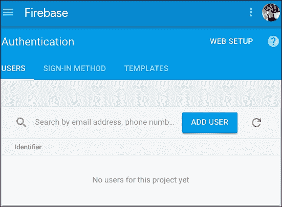
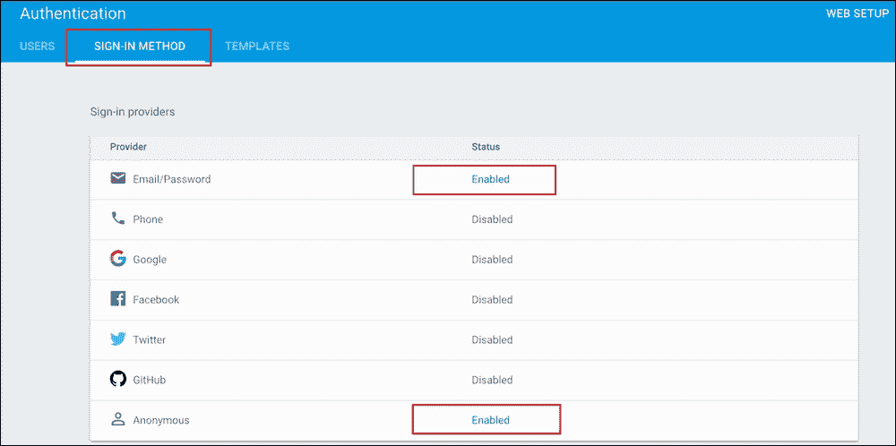
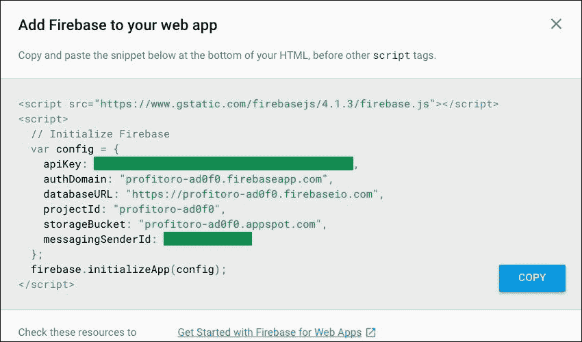
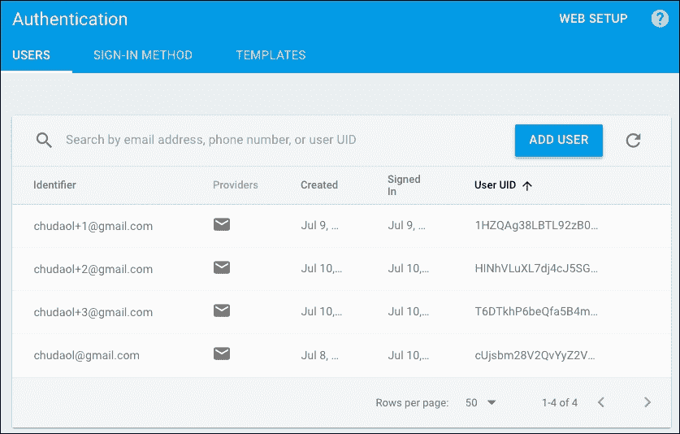
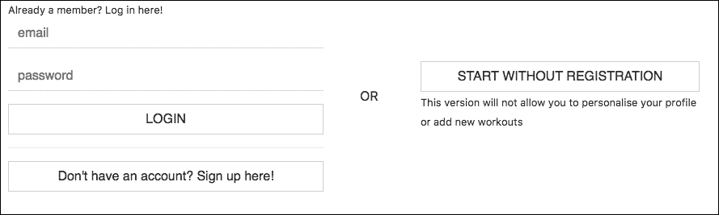
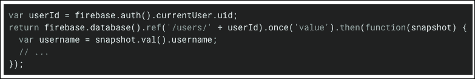
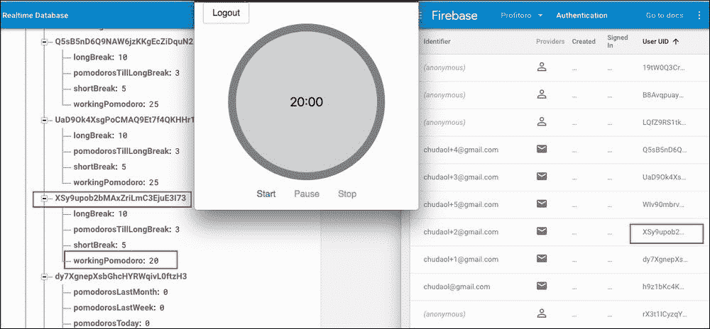
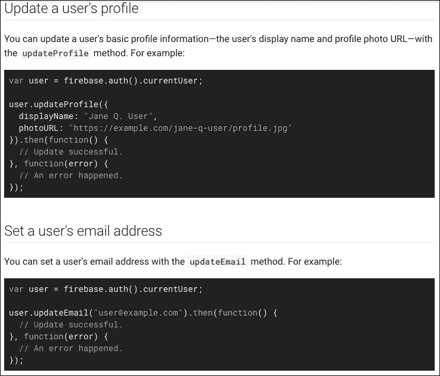
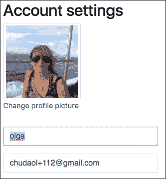

# 六、请验证！

在上一章中，我们将 ProFitOro 应用程序连接到实时数据库。每当用户更新 Pomodoro 计时器设置时，这些设置都存储在数据库中，并立即在使用它们的组件之间传播。由于我们没有身份验证机制，我们不得不使用一个假用户来测试我们的更改。在本章中，我们将有真正的用户！

在这方面，我们将使用 Firebase 身份验证 API。因此，在本章中，我们将做以下工作：

*   讨论 AAA 的含义以及身份验证和授权之间的区别
*   探索 Firebase 身份验证 API
*   创建用于登录和登录的页面，并将其与 Firebase 身份验证 API 连接
*   将用户的设置与用户的身份验证连接起来

# AAA 解释

**AAA**或**AAA**代表**认证、授权和记账**。最初，这个术语被发明为描述安全网络协议的术语；但是，它可以轻松地应用于任何系统、web 资源或站点。

那么，AAA 是什么意思？我们为什么要费心呢？

**认证**是唯一标识系统用户的过程。经过身份验证的用户是被授予系统访问权限的用户。通常，身份验证是通过一些用户名和密码完成的。当你必须提供用户名和密码才能打开 Facebook 页面时，你就是在验证自己。

你的护照是在机场证明你身份的一种方式。护照检查人员会看你的脸，然后检查你的护照。因此，任何允许您*通过*的内容都是您身份验证的一部分。它可以是一个只有您和系统知道的特殊单词（密码），也可以是您随身携带的可以帮助系统唯一识别您的东西（passport）。

**授权**是控制每个用户有权（权限）访问哪些资源的一种方式。如果您正在开发 Facebook 应用程序，您可以访问开发人员的页面，而普通用户无权访问此页面。

**核算**衡量分配给每个用户的资源。如果您有一个 Dropbox 业务标准帐户，您最多可以使用 2 TB 的存储空间，而拥有一个普通的免费 Dropbox 帐户只会给您 2 GB 的空间。

对于我们的应用程序，我们应该关注 AAA 的前两个方面–*认证*和*授权*。在计算机科学中，我们经常使用术语**auth**，而不是指身份验证或授权，甚至是同时指两者。因此，我们将实现 auth，其中 auth 同时指身份验证和授权。在我们的 ProFitOro 应用程序上下文中，这两个术语之间有什么区别？嗯，身份验证将允许用户登录到系统，因此这很容易。授权呢？

您还记得我们决定只有经过身份验证的用户才能访问 Pomotoro 设置和统计数据的配置吗？这是授权。稍后，我们可能会更进一步，实施一个特殊角色——健身教练。具有此角色的用户将可以访问“训练”区域，并可以添加新的训练。

在本章中，我们将使用 Firebase 身份验证机制来增加登录应用程序的可能性，并控制用户有权访问的内容。

# Firebase 如何进行身份验证？

在上一章中，您学习了如何使用Firebase API 创建 Firebase 应用程序实例并通过应用程序使用它。我们能够访问数据库，读取它，并在其中存储数据。

使用 Firebase 身份验证 API 的方式非常相似。您创建一个 Firebase 实例，向其提供一个`config`对象，并使用`firebase.auth()`方法访问与身份验证相关的不同方法。检查 Firebase 控制台的**身份验证**选项卡：



目前还没有用户，但我们将在一分钟内修复它！

Firebase SDK 为用户提供了多种身份验证方法：

*   **基于电子邮件和密码的身份验证**：对用户进行身份验证的经典方式。Firebase提供了一种方式，使用电子邮件/密码登录用户并登录。它还提供重置用户密码的方法。
*   **联邦实体提供商认证**：通过外部实体提供商对用户进行认证的方式，如 Google、Facebook、Twitter 或 GitHub。
*   **电话号码认证**：通过向用户发送带有码的短信来认证用户的方式，用户必须输入该码才能确认其身份。
*   **自定义身份验证系统集成**：将已有身份验证解决方案与 Firebase 身份验证 API 进行集成的方式。
*   **匿名用户认证**：提供 Firebase 功能（如访问 Firebase 数据库）的方式，无需认证。例如，我们可以使用这个匿名帐户提供对数据库中存储的默认配置的访问。

对于我们的应用程序，我们将使用第一个和最后一个方法，因此我们将允许用户使用他们的电子邮件和密码组合登录，并且我们将允许匿名用户使用应用程序的基本功能。

您应该在 Firebase 控制台中显式激活这两种方法。只需打开 Firebase 项目的**认证**选项卡，点击登录方法链接，启用这两种方法：



显式启用电子邮件/密码和匿名登录方法

使用Firebase 认证 API 的工作流程如下：

1.  为登录和登录创建所有必要的方法。
2.  实现身份验证所需的所有 UI。
3.  将 UI 中的更改连接到身份验证方法。

你在第三步发现什么好东西了吗？*将 UI 中的更改连接到身份验证方法*。您还记得我们正在处理一个反应式数据绑定框架，是吗？所以这会很有趣！

# 如何将 Firebase 认证 API 连接到 web 应用程序

为了将您的应用程序连接到Firebase 身份验证 API，您应该首先创建一个 Firebase 应用程序实例：

```js
let config = {
  apiKey: 'YourAPIKey',
  databaseURL: 'YourDBURL',
  authDomain: 'YourAuthDomain'
}
let app = firebase.initializeApp(config)
```

如果单击**Web 设置**按钮，您可以在弹出窗口中找到必要的键和 URL：



在 web 应用程序中使用 Firebase 的设置配置

现在您可以使用 app 实例访问`auth()`对象及其方法。查看有关认证 API 的官方 Firebase 文档：[https://firebase.google.com/docs/auth/users](https://firebase.google.com/docs/auth/users) 。

API 对我们来说最重要的部分是创建和登录用户的方法，以及侦听身份验证状态更改的方法：

```js
app.auth().createUserWithEmailAndPassword(email, password)
```

或：

```js
app.auth().signInWithEmailAndPassword(email, password)
```

监听应用程序认证状态变化的方法称为`onAuthStateChanged`。根据您的应用程序需要的状态（取决于用户是否登录），您可以在此方法中设置重要属性：

```js
app.auth().onAuthStateChanged((user) => {
  if (user) {
    // user is logged in
  } else {
    // user is logged out
  }
})
```

就这些！在我们的应用程序中，我们只需要提供一种可视化的方式将用户名和密码传递给 API。

# 对 ProFitOro 应用程序进行身份验证

现在，让我们能够登录并登录我们的 ProFitOro 应用程序！首先，我们必须设置 Firebase 实例，并确定应该将所有与身份验证相关的方法放在何处。Firebase 应用程序初始化已在`store/index.js`文件中完成。如果`config`中仍然没有包含`apiKey`和`authDomain`配置条目，只需添加它们即可：

```js
// store/index.js
let config = {
  apiKey: 'YourAPIKey',
  databaseURL: 'https://profitoro-ad0f0.firebaseio.com',
  authDomain: 'profitoro-ad0f0.firebaseapp.com'
}
let firebaseApp = firebase.initializeApp(config)
```

我还将使用 spread`…`操作符在商店的国有资产内导出`firebaseApp`：

```js
//store/index.js
export default new Vuex.Store({
  state: {
    ...state,
    firebaseApp
  },
  <...>
})
```

我还将向我们的状态添加一个`user`属性，以便我们可以在`onAuthStateChanged`侦听器的处理程序上重置它：

```js
// store/state.js
export default {
  config,
  statistics,
  user,
 isAnonymous: false
}
```

让我们也创建一个小的突变，将`user`对象的值重置为给定值：

```js
// store/mutations.js
export default {
  <...>
  setUser (state, value) {
 state.user = value
 }
}
```

现在，我们已经完全准备好创建所需的操作。我将创建四个对我们的应用程序必不可少的操作：

*   `createUser`：此操作将使用给定的电子邮件和密码调用 Firebase 验证`createUserWithEmailAndPassword`
*   `authenticate`：此操作将调用 Firebase auth`signInWithEmailAndPassword`方法，使用给定的电子邮件和密码登录用户
*   `logout`：此操作将调用 Firebase auth`signOut`方法
*   `bindAuth`：此操作只会设置`onAuthStateChanged`回调并提交`setUser`突变

首先，让我们以一种非常简单的方式实现这些操作，而不附带任何回调。所以它们看起来是这样的：

```js
// store/actions.js
createUser ({state}, {email, password}) {
  state.firebaseApp.auth().createUserWithEmailAndPassword(email, password).catch(error => {
    console.log(error.code, error.message)
  })
},
authenticate ({state}, {email, password}) {
  state.firebaseApp.auth().signInWithEmailAndPassword(email, password)
},
logout ({state}) {
  state.firebaseApp.auth().signOut()
},
bindAuth ({commit, state}) {
  state.firebaseApp.auth().onAuthStateChanged((user) => {
    commit('setUser', user)
  })
},
```

伟大的现在让我们将动作附加到主`App.vue`组件的`created`方法上：

```js
// App.vue
methods: {
  ...mapActions(['bindStatistics', 'bindConfig', 'bindAuth'])
},
created () {
  this.bindAuth()
  this.bindConfig()
  this.bindStatistics()
}
```

现在，一旦创建了应用程序，将立即将侦听器绑定到身份验证状态。我们能用它做什么？现在，`App.vue`组件立即显示的唯一组件是主内容组件。但是，如果用户未登录，我们应该实际显示登录页组件，以便为用户提供登录或登录的可能性。我们可以使用绑定到`user`属性的`v-if`指令轻松地完成此操作。如果定义了用户，那么让我们显示主内容组件；否则，让我们显示登录页组件。这有多容易？我们的`App.vue`组件模板如下所示：

```js
// App.vue
<template>
  <div id="app">
    <landing-page v-if="!user"></landing-page>
    <main-content v-if="user"></main-content>
  </div>
</template>
```

如果现在打开页面，您将看到登录页面显示：


启动应用程序时，将显示登录页，因为用户未登录

本部分之前的所有相关代码都在`chapter6/1/profitoro`文件夹中。特别注意商店的文件（`index.js, actions.js, mutations.js, state.js`和`App.vue`组件。

现在我们停留在登录页面上，只显示一些占位符文本，无法继续应用程序，因为我们无法登录！

这个问题很容易解决：让我们创建一个简单的表单来注册并登录`Authentication.vue`组件，并将其与我们的操作连接起来。

因此，我将添加组件的数据，其中包含用于注册的电子邮件、用于登录的电子邮件以及相应的密码：

```js
// Authentication.vue
export default {
  data () {
    return {
 registerEmail: '',
 registerPassword: '',
 loginEmail: '',
 loginPassword: ''
    }
  }
}
```

我还将添加一个非常简单的标记，用于显示相应数据的输入：

```js
<template>
  <div>
    <h1>Register</h1>
    <input v-model="registerEmail" type="text" placeholder="email">
    <input v-model="registerPassword" type="password" placeholder="password">
    <button>Register!</button>
    <h1>Login</h1>
    <input v-model="loginEmail" type="text" placeholder="email">
    <input v-model="loginPassword" type="password" placeholder="password">
    <button>Log in!</button>
  </div>
</template>
```

现在让我们导入必要的操作（`authenticate`和`createUser`并创建调用这些操作的方法：

```js
// Authentication.vue
<script>
  import {mapActions} from 'vuex'

  export default {
    <...>
    methods: {
      ...mapActions(['createUser', 'authenticate']),
      onRegisterClick () {
        this.createUser({email: this.registerEmail, password: this.registerPassword})
      },
      onLoginClick () {
        this.authenticate({email: this.loginEmail, password: this.loginPassword})
      }
    }
  }
</script>
```

现在我们只需将绑定`v-on:click`指令的事件附加到相应的按钮：

```js
// Authentication.vue
<template>
  <div>
    <h1>Register</h1>
    <input v-model="registerEmail" type="text" placeholder="email">
    <input v-model="registerPassword" type="password" placeholder="password">
    <button @click="onRegisterClick">Register!</button>
    <h1>Login</h1>
    <input v-model="loginEmail" type="text" placeholder="email">
    <input v-model="loginPassword" type="password" placeholder="password">
    <button @click="onLoginClick">Log in!</button>
  </div>
</template>
```

我们还要在`HeaderComponent.vue`组件中添加一个按钮。此按钮应允许用户注销。这很容易；我们甚至不必创建任何方法，只需将事件绑定到实际操作。因此，整个标记和所需的脚本看起来很简单，如下所示：

```js
// HeaderComponent.vue
<template>
  <div>
    <button @click="logout">Logout</button>
  </div>
</template>
<script>
  import {mapActions} from 'vuex'

  export default {
    methods: {
      ...mapActions(['logout'])
    }
  }
</script>
```

就这样！打开页面，尝试注册您的应用程序！它起作用了！登录后，不仅可以看到 Pomodoro 计时器，还可以看到注销按钮。单击它并检查您是否真的从应用程序中抛出到登录页。尝试再次登录。每件事都很有魅力。

别忘了打开 Firebase 控制台并检查**身份验证**选项卡。您应该在此处看到所有注册用户：



通过 Firebase 控制台的“身份验证”选项卡监视注册用户

祝贺您刚刚使用 Firebase 身份验证 API 为您的应用程序实现了完整的身份验证机制。您可以在`chapter6/2/profitoro`文件夹中找到相应的代码。特别注意`Authentication.vue`和`HeaderComponent.vue`部件。

# 让认证 UI 再次伟大

我们刚刚为 ProFitOro 应用程序实现了身份验证机制。这很好，但是我们的身份验证页面的 UI 看起来就像我们使用了一台时间机器，可以追溯到 20 年前的互联网时代。让我们使用我们强大的朋友-引导来修复它。

首先，我想将我的登录页面布局设置为两栏网格布局，因此整个登录/登录属于左侧栏，而引导用户进入应用程序而未注册的按钮停留在右侧。但是，我希望这两列可以堆叠在移动设备上。

这对你来说不是什么新鲜事；我想您还记得如何使用 Bootstrap 的网格布局来实现此行为：[https://v4-alpha.getbootstrap.com/layout/grid/](https://v4-alpha.getbootstrap.com/layout/grid/) 。因此，在我们的`LandingPage`组件中，我将只使用`row`类将身份验证和`go-to-app-link`组件包装到`div`中，并将相应的`col-*`类添加到这些组件中：

```js
// LandingPage.vue
<template>
  <div>
    <...>
    <div class="container row justify-content-center">
      <div class="col-sm-12 col-md-6 col-lg-6">
        <authentication></authentication>
      </div>
      <div class="col-sm-12 col-md-6 col-lg-6">
        <go-to-app-link></go-to-app-link>
      </div>
    </div>
  </div>
</template>
```

就这样！现在您有了一个很好的两列布局，可以在小型设备上转换为单列布局：


这就是我们的布局在桌面设备上的外观

如您所见，在桌面设备上，我们有一个很好的两列布局。如果将浏览器的大小调整为移动设备的大小，则右栏会跳到左栏的后面：


这就是我们在移动设备上的布局

现在让我们来看一下我们的`Authentication.vue`组件。为了使它比一个 20 年前的网页更好，让我们将 Bootstrap 的魔力应用于它。为此，我们将使用 Bootstrap 表单的类：[https://v4-alpha.getbootstrap.com/components/forms/](https://v4-alpha.getbootstrap.com/components/forms/) 。

我们将把整个表单包装到`<form>`标记中，并将每个输入用`form-group`类包装到`div`中。我们还将向每个输入添加类`form-control`。例如，电子邮件的输入如下所示：

```js
<div class="form-group">
  <input class="form-control" v-model="email" type="email" placeholder="email">
</div>
```

作为一项小练习，请执行以下操作：

*   使它成为唯一一个有按钮在登录和注册表单之间切换的表单
*   根据窗体当前所处的状态，使其仅成为一个调用其中一个操作的方法
*   探索 Bootstrap 的实用程序类，删除除底部边框以外的所有边框，并从中删除圆角：[https://v4-alpha.getbootstrap.com/utilities/borders/](https://v4-alpha.getbootstrap.com/utilities/borders/)

最后，您的表单应该如下所示：


这是两种形式在结尾时的表现。它们应该通过底部按钮进行切换

试着自己去实现它。要检查您的工作，请查看`chapter6/3/profitoro`文件夹。特别要检查`Authentication.vue`部件的代码。这是非常不同的！

# 管理匿名用户

ProFitOro 还允许未注册的用户使用该应用程序。唯一的区别是，这些未注册用户也不允许配置其设置，因为他们无权访问其统计数据。他们也无法管理训练。因此，我们在这里遇到了 AAA 定义的第二个 A-*授权*。我们如何管理这些用户？如果我们只允许用户注册和登录，他们怎么能真正进入应用程序？嗯，出于某种原因，我们准备了一部分，上面写着**转到 App**。让我提醒你它在实体模型中的外观：


无需注册即可开始！初始模型中的按钮

幸运的是，Firebase 身份验证 API 提供了一种登录匿名用户的方法。返回的用户对象包含`isAnonymous`属性，这将允许我们管理该匿名用户可以访问或不能访问的资源。因此，让我们添加名为`authenticateAnonymous`的操作，并在其中调用相应的 Firebase`auth`方法：

```js
// store/actions.js
authenticateAnonymous ({state}) {
  state.firebaseApp.auth().signInAnonymously().catch(error => {
    console.log(error.code, error.message)
  })
},
```

我们到了！现在，让我们稍微修改一个变异，将用户和**isAnonymous**状态的属性设置为用户对象中相应的属性：

```js
// store/mutations.js
setUser (state, value) {
  state.user = value
  state.isAnonymous = value.isAnonymous
}
```

我们还要修改绑定配置和统计操作，只有在设置了用户并且用户不是匿名的情况下才执行实际绑定：

```js
// state/actions.js
bindConfig: firebaseAction(({bindFirebaseRef, state}) => {
  if (state.user && !state.isAnonymous) {
    bindFirebaseRef('config', state.configRef)
  }
}),
bindStatistics: firebaseAction(({bindFirebaseRef, state}) => {
  if (state.user && !state.isAnonymous) {
    bindFirebaseRef('statistics', state.statisticsRef)
  }
})
```

我们已经完成了后端！现在让我们实现这个按钮！实现这一目标只有三个步骤。打开`GoToAppLink.vue`组件，导入`mapActions`助手，添加按钮，并使用`v-on:click`指令将事件监听器绑定到该组件，该事件监听器将调用相应的操作：

```js
// GoToAppLink.vue
<template>
  <div>
    <button @click="authenticateAnonymous">
 START WITHOUT REGISTRATION
 </button>
  </div>
</template>
<script>
  import {mapActions} from 'vuex'

  export default {
    methods: {
      ...mapActions(['authenticateAnonymous'])
    }
  }
</script>
```

这有多容易？现在，作为一个小练习，在 Bootstrap 的帮助下，尝试使事情看起来如下所示：



使用相应的引导类使按钮看起来像这样，并垂直对齐列

检查引导程序的类是否对齐：[https://v4-alpha.getbootstrap.com/layout/grid/#alignment](https://v4-alpha.getbootstrap.com/layout/grid/#alignment) 。同时检查 helper 类以去除圆角。通过查看`chapter6/4/profitoro`文件夹中的代码来检查自己。特别注意`GoToAppLink.vue`组件和门店组件，如`action.js`和`mutations.js`。

# 个性化 Pomodoro 定时器

好吧，既然我们已经可以登录新用户并登录现有用户，也许我们应该考虑利用我们的身份验证机制，因为现在我们实际上什么都没有做。我们只是注册，然后登录。是的，我们也可以根据用户的身份验证隐藏或显示某些内容，但这还不够。所有这些工作的全部要点是能够存储和检索用户对 Pomotoro 计时器的自定义配置以及用户的统计数据。

到目前为止，我们一直使用带有键[T0]的硬编码数据库对象来访问用户的数据，但现在，由于我们已经有了真正的用户，是时候用真正用户的数据填充数据库并在我们的应用程序中使用它了。实际上，我们唯一要做的就是用实际用户的 ID 替换这个硬编码的值。例如，我们绑定`config`引用的代码如下所示：

```js
// store/actions.js
bindConfig: firebaseAction(({bindFirebaseRef, state}) => {
  if (state.user && !state.isAnonymous) {
    bindFirebaseRef('config', state.configRef)
  }
}),
```

这里，参考`state.configRef`已在门店入口点`index.js`中定义：

```js
// store/actions.js
let firebaseApp = firebase.initializeApp(config)
let db = firebaseApp.database()
let configRef = db.ref('/configuration/test')

```

现在，我们无法在存储的入口点内实际实例化数据库引用，因为在这一点上（没有双关语），我们仍然不知道用户是否经过身份验证。因此，最好将此代码传递给实际的`bindConfig`函数，并用实际用户的*uid*替换此`test`：

```js
// store/action.js
bindConfig: firebaseAction(({bindFirebaseRef, state}) => {
  if (state.user && !state.isAnonymous) {
    let db = firebaseApp.database()
    bindFirebaseRef('config', db.ref(`/configuration/${state.user.uid}`))
  }
}),
```

现在，我亲爱的细心的用户，我知道您在惊叹“但是用户的*uid*存储的配置到底是怎样的？”非常好地注意到：它不是。我们仍然必须在用户首次注册时存储它。实际上，我们必须同时存储配置和统计信息。

Firebase 数据库提供了一种将新数据写入名为`set`的数据库的方法。因此，您基本上可以获得引用（就像读取数据一样），并设置需要写入的数据：

```js
firebaseApp.database().ref(`/configuration/${state.user.uid}`).set(
  state.config
);
```

这将在我们的配置表中创建一个具有给定用户 ID 的新条目，并设置默认状态的`config`数据。因此，我们必须在创建新用户时调用此方法。我们仍然需要将数据库引用绑定到状态对象。为了减少代码量，我创建了一个方法`bindFirebaseReference`，它接收引用和表示应该绑定到的状态的键的字符串。此方法将分析给定引用的条目是否已存在于数据库中，并在需要时创建它。为此，Firebase 提供了一个很好的方法，可以应用于几乎所有的东西——这个方法被称为`once`，它接收一个回调，其中包含应用于任何东西的快照。因此，在这个回调中，我们可以分析这个快照是否有一个具有给定名称的子项，或者它是否有一个值或者它是`null`。如果已经设置了该值，我们将把状态绑定到它。如果没有，我们将创建一个新条目。请查阅 Firebase 官方文档：[https://firebase.google.com/docs/database/web/read-and-write](https://firebase.google.com/docs/database/web/read-and-write) 。这就是`once`方法及其回调的样子：



如何使用 once 方法检查数据库中是否存在数据

不管数据是否存在，我们的绑定引用方法应该调用 Firebase 绑定。因此，它将如下所示：

```js
// store/actions.js
bindFirebaseReference: firebaseAction(({bindFirebaseRef, state}, {reference, toBind}) => {
  return reference.once('value').then(snapshot => {
    if (!snapshot.val()) {
      reference.set(state[toBind])
    }
    bindFirebaseRef(toBind, reference)
  })
}),
```

我还用一种方法替换了绑定`config`和`statistics`的方法：

```js
// store/actions.js
bindFirebaseReferences: firebaseAction(({bindFirebaseRef, state, commit, dispatch}, user) => {
  let db = state.firebaseApp.database()
  let configRef = db.ref(`/configuration/${user.uid}`)
  let statisticsRef = db.ref(`/statistics/${user.uid}`)
  dispatch('bindFirebaseReference', {reference: configRef, toBind: 'config'}).then(() => {
    commit('setConfigRef', configRef)
  })
  dispatch('bindFirebaseReference', {reference: statisticsRef, toBind: 'statistics'}).then(() => {
    commit('setStatisticsRef', statisticsRef)
  })
}),
```

正在从`bindAuth`方法调用此方法。现在我们可以从`App.vue`的`created`方法中删除绑定`config`和`statistics`的动作调用。我们也不需要在`store/index.js`中实例化引用，因为这两个引用都是在这个新方法中实例化的。我们必须添加两个将引用设置为状态的突变，这样我们就不需要更改 Pomodoro 配置设置操作，因为它们使用两个引用来更新数据。

检查`chapter6/5/profitoro`文件夹中的代码。查看`App.vue`组件中的细微变化，查看商店的文件现在是什么样子的（`index.js`、`mutations.js`、`state.js`，尤其是`actions.js`。

使用您的应用程序。注册、登录、更改 Pomodoro 计时器配置、注销，并检查其是否工作。检查您的 Firebase 控制台，**实时数据库**选项卡和**身份验证**选项卡。检查您所做的任何更改，确保您的数据在任何地方都是一致的–在您的数据库中，在您的**身份验证**选项卡中，最重要的是在您的应用程序中（因为应用程序就是您的用户将要看到的，对吗？）：



检查所有地方的数据是否一致

现在我们可以注册一个新用户，以现有用户身份登录，以匿名用户身份登录。我们为经过身份验证的用户提供了一个很好的价值——能够配置他们的 Pomodoro 计时器并检查他们的统计数据。当然，我们的应用程序还远远不够完美——我们不验证输入，我们接受 Pomotoro 配置区域中的任何值，这是不对的，我们也不在启动页面上显示更改密码的可能性。但我们有坚实的框架，这使我们能够在其基础上构建一个坚实而漂亮的应用程序。让我们继续前进！

# 更新用户档案

如果我们可以通过显示类似于**welcome Olga**的欢迎信息来欢迎我们的用户，这不是很有趣吗？但是我们的用户没有名字；他们只有电子邮件和密码，这是注册过程中传递的两个基本身份验证组件。那么，我们如何才能做到这一点呢？好的，如果您仔细阅读了 Firebase 文档中有关身份验证的[T3]（[T4]https://firebase.google.com/docs/auth/web/manage-users ），你可能已经发现了这些不错的方法：



用于更新用户配置文件和电子邮件地址的 Firebase 方法

让我们使用这些方法来更新我们的用户配置文件和用户配置文件图片！

我们将定义三个新操作–一个通过调用 Firebase`updateProfile`方法更新用户的显示名称，一个通过调用相同的方法更新用户的配置文件图片的 URL，另一个将调用`updateEmail`方法。然后，我们将在`Settings.vue`组件中创建必要的标记，该标记将在相应输入的更新上绑定这些操作。听起来很简单，对吧？相信我，这听起来很容易实现。

那么，让我们来定义我们的行动。它们将如下所示：

```js
// store/actions.js
updateUserName ({state, commit}, displayName) {
  state.user.updateProfile({
    displayName
  })
},
updatePhotoURL ({state}, photoURL) {
  state.user.updateProfile({
    photoURL
  })
},
updateUserEmail ({state}, email) {
  state.user.updateEmail(email).then(() => {
    // Update successful.
  }, error => {
    console.log(error)
  })
},
```

伟大的现在让我们切换到我们的`Settings.vue`组件，它将负责呈现所需的数据以更改帐户设置，并在需要时通过调用所需的操作来更新这些数据。因此首先，我将在数据函数中添加三个条目，一旦组件为`created`时，这些条目将被设置为当前用户对象的相应属性：

```js
// Settings.vue
data () {
  return {
    displayName: '',
    email: '',
    photoURL: 'static/tomato.png'
  }
},
computed: {
  ...mapGetters({user: 'getUser'})
},
created () {
  this.displayName = this.user.displayName
  this.email = this.user.email
  this.photoURL = this.user.photoURL ? this.user.photoURL : this.photoURL
}
```

现在可以在相应的操作中使用此数据。因此，让我们导入所需的操作并创建相应的方法：

```js
// Settings.vue
methods: {
  ...mapActions(['updateUserName', 'updateUserEmail', 'updatePhotoURL']),
  onChangeUserName () {
    this.updateUserName(this.displayName)
  },
  onChangeUserEmail () {
    this.updateUserEmail(this.email)
  },
  onProfilePicChanged () {
    this.updatePhotoURL(this.photoURL)
  }
}
```

现在我们可以添加所需的标记，其中包含我们将使用`v-model`数据绑定指令绑定数据的输入！我们还将在每次输入更新时调用相应的方法：

```js
// Settings.vue
<form>
  <div class="form-group">
    <figure class="figure">
      
      <input type="text" v-model="photoURL" @change="onProfilePicChanged">
    </figure>
  </div>
  <div class="form-group">
    <input @change="onChangeUserName" v-model="displayName" type="text" placeholder="Change your username">
  </div>
  <div class="form-group">
    <input @change="onChangeUserEmail" v-model="email" type="text" placeholder="Change your username">
  </div>
</form>
```

而且…我们完了！

作为一个小练习，请执行以下操作：在图片后面添加一个数字标题，上面写着**更改配置文件图片**。新图片 URL 的输入元素应仅在用户单击此图片标题时可见。URL 更新完成后，输入应再次不可见。

结果应如下所示：


这是用户单击更改配置文件图片标题之前的外观

最初，它包含默认用户图片。

用户单击标题后，将显示用于更改图片 URL 的输入：


用户单击图形标题后，将显示输入

用户更改档案图片 URL 后，再次隐藏输入：



用户更改配置文件图片的 URL 后，输入将消失

我的建议是：在`Settings.vue`组件的数据中添加一个附加属性，当用户点击标题时将其设置为`true`，当输入中的值发生变化时将其重置为`false`。

另外，不要忘记我们本节的最初目标–在`Header.vue`组件中添加欢迎信息。此欢迎信息应包含用户的显示名称。它应该是这样的：


提及用户名的欢迎信息

请注意，如果您决定更改您的电子邮件，您将不得不注销并再次登录；否则，您的控制台中会出现一些 Firebase 安全错误。

本章的最终代码可在`chapter6/6/profitoro`文件夹中找到。注意，我用两个单独的组件（`AccountSettings.vue`和`PomodoroTimerSettings.vue`拆分了帐户设置和 Pomodoro 设置。它使事情更容易维护。还要注意商店的部件。检查`Header.vue`组件和如何实际显示欢迎信息。

# 总结

在本章中，我们学习了如何结合 Firebase 实时数据库和身份验证 API 来更新用户设置。我们已经建立了一个用户界面，允许用户更新他们的配置文件设置。在短短几分钟内，我们就构建了应用程序的完整身份验证和授权部分。我不知道你的情况，但我对此感到非常惊讶。

在下一章中，我们将最终摆脱这个巨大的页面，它包含了我们应用程序的所有部分——Pomotoro 计时器本身、统计数据和设置配置视图。我们将探索 Vue 的一个非常好和重要的特性——`vue-router`。我们将把它与 Bootstrap 的导航系统结合起来，以实现一个漂亮而流畅的导航。为了实现应用程序的延迟加载，我们还将探讨诸如代码拆分这样的热门话题。那么，我们走吧！