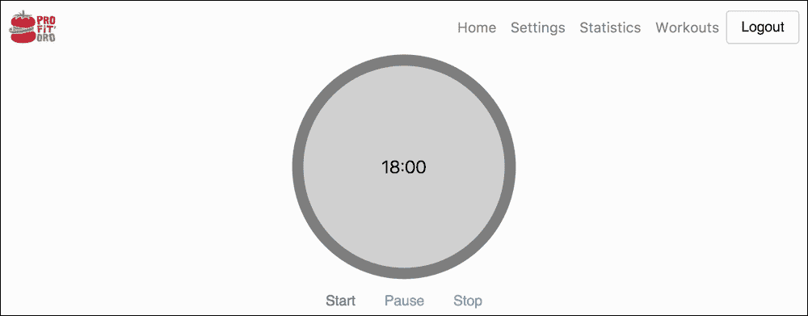
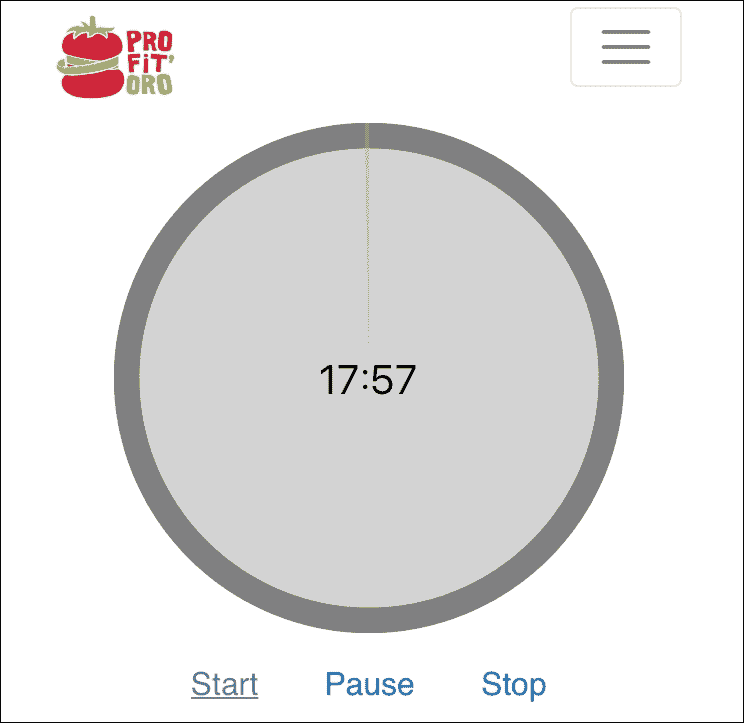
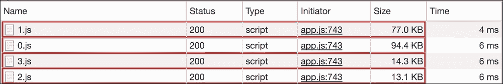

# 七、使用 vue router 和 Nuxt.js 添加菜单和路由功能

在上一章中，我们在应用程序中添加了一个非常重要的功能—*身份验证*。现在，我们的用户可以在登录后注册、登录到应用程序并管理他们的资源。因此，现在他们可以管理 Pomodoro 计时器的配置和帐户设置。他们还可以在登录后访问其统计数据。我们已经学习了如何使用 Firebase 的身份验证 API 并将 Vue 应用程序连接到该 API。我必须说，前一章内容广泛，是一个非常面向后端的章节。我很喜欢，希望你也喜欢。

尽管具有这种复杂的身份验证和授权功能，但我们的应用程序仍然缺乏导航。为了简单起见，我们目前正在主页上显示应用程序的所有部分。这是…丑陋的：


承认吧，这很难看

在这一章中，我们不会让事物变得美丽。我们将要做的是使事物可导航，以便应用程序的所有部分都可以通过导航访问。我们将应用`vue-router`机制来实现自然浏览器的导航，我们将使用 Bootstrap 的`navbar`来拥有相应的按钮来轻松导航到每个部分。因此，在本章中，我们将：

*   再次探索`vue-router`以实现 ProFitOro 应用程序的导航
*   使用引导程序的`navbar`呈现导航栏
*   探索代码拆分技术，仅在需要时加载应用程序的每个部分
*   最后，我们将探索 Nuxt.js 模板，使用它重建我们的应用程序，并以一种不引人注目、令人愉快的方式实现路由

# 使用 vue 路由器添加导航

我希望你还记得第二章中的什么是`vue-router`，它做什么，以及它是如何工作的。只是提醒你：

> Vue 路由器是 Vue.js 的官方路由器。它与 Vue.js core 深度集成，使使用 Vue.js 构建单页应用程序变得轻而易举。

-（来自 vue 路由器的官方文档）

`vue-router`非常容易使用，我们不需要安装任何东西——它已经带有 Vue 应用程序的默认框架和网页包模板。简言之，如果我们有 Vue 组件来表示路由，那么我们必须这样做：

*   告诉视图使用`vue-router`
*   创建路由器实例并将每个组件映射到其路径
*   将此实例传递给 Vue 实例或组件的选项
*   使用`router-view`组件渲染它

### 注

检查官方`vue-router`文件：[https://router.vuejs.org](https://router.vuejs.org)

当您创建路由器时，您应该将路由数组传递给它。每个数组项表示给定组件到某个路径的映射：

```js
{
  name: 'home',
  component: HomeComponent,
  path: '/'
}
```

PrimeToRo 只有四种可能的路径——PoMoDoRo 计时器本身，我们可以将其视为主页，使用设置和统计视图，以及协同锻炼的视图。因此，我们的路由器看起来非常简单易懂：

```js
// router/index.js
import Vue from 'vue'
import Router from 'vue-router'
import {PomodoroTimer, Settings, Statistics, Workouts} from '@/components/main/sections'

Vue.use(Router)

export default new Router({
  mode: 'history',
  routes: [
    {
      name: 'home',
      component: PomodoroTimer,
      path: '/'
    },
    {
      name: 'settings',
      component: Settings,
      path: '/settings'
    },
    {
      name: 'statistics',
      component: Statistics,
      path: '/statistics'
    },
    {
      name: 'workouts',
      component: Workouts,
      path: '/workouts'
    }
  ]
})
```

现在，如果您在`ContentComponent`视图中导入创建的路由器，将其传递给组件的选项，并渲染`router-view`组件，您将能够看到 Vue 路由正在运行！您还可以删除所有组件导入，因为`ContentComponent`现在唯一应该导入的是路由器，它将负责所有其他内容。因此，`ContentComponent`将如下所示：

```js
// ContentComponent.vue
<template>
  <div class="container">
    <router-view></router-view>
  </div>
</template>
<script>
  import router from '@/router'

  export default {
    router
  }
</script>
```

打开页面，在浏览器的地址栏中键入`localhost:8080/settings`、`localhost:8080/statistics`、`localhost:8080/workouts`，您将看到视图是如何根据您实际试图访问的内容显示的。你必须承认这真的很容易。

现在让我们添加链接，因为我们希望通过单击一些按钮来导航，而不是在浏览器地址栏中引入导航 URL，对吗？

添加带有`vue-router`的导航链接相当容易。使用提供的具有属性`to`的`router-link`组件将链接指向所需路径：

```js
<router-link to="/">Home</router-link>
```

让我们在`Header`组件中添加这些链接。这是应该负责导航表示的组件。因此，在我们的`HeaderComponent.vue`的`template`部分，添加以下内容：

```js
// HeaderComponent.vue
<template>
  <router-link to="/">Home </router-link>
  <router-link to="statistics">Statistics </router-link>
  <router-link to="workouts">Workouts </router-link>
  <router-link to="settings">Settings </router-link>
</template>
```

不要忘记导入路由器并在组件的选项中导出：

```js
// HeaderComponent.vue
<script>
  //...
  import router from '@/router'

  export default {
    //

    router
  }
</script>
```

通过使用引导类，我们可以得到如下结果：


使用 vue 路由器导航 ProFitOro

简言之，这是基础知识，涵盖使用`vue-router`及其组件的路由和导航。您可以在`chapter7/1/profitoro`文件夹中找到此部件的最终代码。特别注意路由器本身（`router/index.js`）、`ContentComponent.vue`和`HeaderComponent.vue`文件。

## 练习-根据认证限制导航

不要忘记，我们必须根据用户的身份验证状态限制导航链接。如果用户是匿名身份验证的，我们根本不应该显示导航链接。但是，应该有一个按钮，允许用户返回主页。因此，这个按钮应该调用注销功能，只显示不同的文本，比如说，**转到起始页**。您已经知道如何有条件地渲染 Vue 组件。我们的路由器链接只不过是常规组件，因此根据用户的值及其属性`isAnonymous`对其应用条件呈现机制。

在`chapter7/2/profitoro`文件夹中检查此练习的解决方案。注意`HeaderComponent`部件。

# 使用引导导航栏进行导航链接

我们目前的导航栏很棒–功能齐全，但没有响应能力。幸运的是，Bootstrap 有一个`navbar`组件，它为我们实现了响应性和适应性。我们只需要用一些引导类来包装导航元素，然后坐下来检查我们漂亮的导航栏，它在移动设备上折叠，在桌面设备上扩展。检查关于`navb``ar`组件[的引导文档 https://v4-alpha.getbootstrap.com/components/navbar/](https://v4-alpha.getbootstrap.com/components/navbar/) 。

### 注

请记住，此 URL 用于 alpha 版本。下一个稳定版本 4 将在官方网站上发布。

我们将使用这些类将我们的简单导航栏转换为引导管理的响应式导航栏：

*   `navbar`：这将包装整个导航栏元素
*   `navbar-toggleable-*`：这还应该包装整个导航栏元素，并告诉它何时在展开/折叠状态之间切换（例如，`navbar-toggleable-md`会使导航栏在中型设备上折叠）
*   `navbar-toggler`：这是一个用于在小型设备上单击按钮打开折叠菜单的类
*   `navbar-toggler-*`：告知`toggler`元素定位的位置，例如`navbar-toggler-right`
*   `navbar-brand`：这是代表品牌的导航栏元素的类（可以是徽标和/或文本）
*   `collapse navbar-collapse`：这些类将封装应该在小型设备上折叠的导航栏元素
*   `nav-item`：这是每个导航栏项目的一个类
*   `nav-link`：这是`nav-item`项的嵌套元素的类；这将最终成为一个锚，将引导你到给定的链接

还有许多其他类可以为导航栏定义颜色方案，以及它的定位、对齐等。检查文档并全部试用。我将只更改`Header`组件的标记。因此，它将如下所示：

```js
// HeaderComponent.vue
<template>
  <div>
    <nav class="navbar navbar-toggleable-md navbar-light">
      <button class="navbar-toggler navbar-toggler-right" type="button" data-toggle="collapse" data-target="#navbarHeader" aria-controls="navbarHeader" aria-expanded="false" aria-label="Toggle navigation">
        <span class="navbar-toggler-icon"></span>
      </button>
      <div class="navbar-brand">
        <logo></logo>
      </div>
      <div class="collapse navbar-collapse" id="navbarHeader">
        <ul class="navbar-nav ml-auto">
          <li class="nav-item">
            <router-link class="nav-link" to="/">Home </router-link>
          </li>
          <li class="nav-item">
            <router-link class="nav-link" to="settings">Settings </router-link>
          </li>
          <li class="nav-item">
            <router-link class="nav-link" to="statistics">Statistics </router-link>
          </li>
          <li class="nav-item">
            <router-link class="nav-link" to="workouts">Workouts </router-link>
          </li>
        </ul>
        <form class="form-inline my-2 my-lg-0">
          <button class="btn btn-secondary" @click="onLogout">Logout</button>
        </form>
      </div>
    </nav>
  </div>
</template>
```

您可能已经注意到，我在导航项中使用了`router-link`元素和`nav-link`类。结果证明他们在一起玩得真的很好。因此，我们将 Vue 路由机制与 Bootstrap 的导航栏相结合，在我们的 Vue 应用程序中实现了一个优雅的响应路由解决方案。现在，我们的标题看起来就像这样：



桌面设备上的 ProFitOro 导航栏

如果我们在移动设备上打开ProFitOro，我们将看到漂亮的切换按钮，而不是菜单：



这就是 ProFitOro 的菜单在移动设备上的外观

如果单击移动设备上的切换按钮，菜单将垂直展开：


这就是扩展的 ProFitOro 菜单在移动设备上的外观

### 提示

这与引导程序 4 的 alpha 版本很好地配合，但是，如果使用引导程序 4 Beta 版，您将看到一些不一致之处。一些类被删除，一些类被添加。要使其看起来完全相同，请执行以下操作：

*   将`navbar-tooglable-md`类替换为`navbar-expand-lg`
*   将`btn-secondary`按钮类替换为`button-outline-secondary`切换按钮和品牌元素

已放弃基于身份验证的条件呈现功能。我将重新添加它，但是当用户匿名时，我将禁用这些元素，而不是。这将为应用程序带来额外的价值–未注册的用户将不断被提醒，如果他注册，他可以使用一些不错的功能。因此，我将把`disabled`引导类绑定到`router-link`元素。如果用户是匿名的，则该类将被激活。因此，我们的每个路由器链接将如下所示：

```js
// HeaderComponent.vue
<router-link class="nav-link" :class="{disabled:user.isAnonymous}" to="settings">Settings </router-link>
```

如果现在打开页面并以匿名用户身份输入应用程序，您将看到链接显示为已禁用：


对于未经授权的用户，链接显示为禁用

但是，我们的用户很聪明，我们都知道，对吗？我们的用户将做与您现在考虑做的完全相同的事情（如果您还没有做过的话）-打开开发者工具控制台，转到元素选项卡，编辑标记并删除类`disabled`。*巴都 tsss*，现在您可以点击导航链接了！

所以，我们还需要在路由器端保护它。幸运的是，`vue-router`实例提供了一个名为`beforeEach`的钩子方法。此方法接收下一个和上一个路由，在其中，您可以评估它们并调用`next()`方法，该方法将继续下一个路由或替换正在调用的路径，具体取决于条件。

此外，每个路由项可以包含元属性，我们可以在其中传递一个条件，在此条件下可以调用或不能调用此路由。检查`vue-router`相关文件：[https://router.vuejs.org/en/advanced/meta.html](https://router.vuejs.org/en/advanced/meta.html) 。

因此，让我们为三个路由项中的每一个添加一个元属性`requiresAuth`，并使用如下的`beforeEach`方法：

```js
// router/index.js
router.beforeEach((to, from, next) => {
  if (to.matched.some(record => record.meta.requiresAuth)) {
    if (!store.state.user || store.state.user.isAnonymous) {
      next({
        path: '/'
      })
    } else {
      next()
    }
  } else {
    next()
  }
})
```

*Et voilá*，从现在开始，即使您在未经授权的情况下在浏览器的地址栏中显式键入一个条件路由 URL，您也会被重定向到主页！

在`chapter7/3/profitoro`文件夹中检查此部件的最终代码。特别注意路由器本身（`router/index.js`和`Header`组件。

# 代码拆分或延迟加载

当我们构建应用程序以部署用于生产时，所有 JavaScript 都绑定到一个独特的 JavaScript 文件中。它非常方便，因为一旦浏览器加载了这个文件，整个应用程序就已经在客户端了，没有人担心加载更多的东西。当然，这只对温泉有效。

我们的 ProFitOro 应用程序（至少在这个阶段）受益于这种捆绑行为——它很小，只是一个请求，一切就绪，我们不需要从服务器请求任何 JavaScript 文件。

然而，这种捆绑可能有一些缺点。我敢肯定，您已经构建或看到了巨大的 JavaScript 应用程序。总有一天，加载庞大的捆绑包会变得极其缓慢，特别是当我们希望这些应用程序同时在桌面和移动环境中运行时。

这个问题的一个显而易见的解决方案是以这样一种方式分割代码，即只在需要时加载不同的代码块。这对于单页应用程序来说是一个相当大的挑战，这就是为什么我们现在有一个巨大的社区致力于 web 开发。

目前，一些简单的技术已经存在于 web 开发世界中，可以用来拆分 web 包应用程序中的代码。查看官方网页文档了解更多信息：[https://webpack.js.org/guides/code-splitting/](https://webpack.js.org/guides/code-splitting/) 。

为了在 Vue.js 应用程序中使用代码拆分，您不需要做任何复杂的事情。不需要重新配置您的网页包配置文件，也不需要重写您的组件。检查有关延迟加载路径的此文档条目：[https://router.vuejs.org/en/advanced/lazy-loading.html](https://router.vuejs.org/en/advanced/lazy-loading.html) 。

### 提示

**TL；DR**：为了延迟加载您的路由，您只需要更改导入它们的方式。因此，考虑下面的代码：Apple T0.为了慢吞吞地加载您的路由，您将编写以下内容：

代码的其余部分保持完全不变！

因此，我们只需改变在路由器中导入组件的方式：

```js
// router/index.js
const PomodoroTimer = () => import('@/components/main/sections/PomodoroTimer')
const Settings = () => import('@/components/main/sections/Settings')
const Statistics = () => import('@/components/main/sections/Statistics')
const Workouts = () => import('@/components/main/sections/Workouts')
```

就这样！检查页面并确保一切仍按预期工作。检查网络面板。您将看到，现在它将为不同的路由视图请求不同的 JavaScript 包！

如果您将网络请求与以前的版本进行比较，您将看到，与以前的单个`app.js`请求相比，现在实际上有四个请求—`0.js`、`1.js`、`2.js,`和`3.js -`：


代码拆分前对 app.js 捆绑包的单个请求

代码拆分后，如果我们浏览应用程序的导航链接，我们将看到以下内容：



每个路由请求的 JavaScript 块都要小得多

注意块的大小。对于大型项目，代码拆分技术实际上可能会提高应用程序的性能，您不同意吗？检查`chapter7/3.1/profitoro`文件夹中的路由器代码。

# 服务器端渲染

**服务器端呈现**（**SSR**）最近成为 web 开发领域另一个流行的缩写。除了使用代码拆分技术外，它还可以帮助您提高 web 应用程序的性能。它也会对你的搜索引擎优化产生积极的影响，因为所有的内容都是一次出现的，爬虫可以立即看到，这与最初请求后在浏览器中构建内容的情况相反。

我发现了一篇关于 SSR 的优秀文章，对服务器端渲染和客户端渲染进行了比较（尽管这是 2012 年的文章）。查看：[http://openmymind.net/2012/5/30/Client-Side-vs-Server-Side-Rendering/](http://openmymind.net/2012/5/30/Client-Side-vs-Server-Side-Rendering/) 。

将服务器端渲染引入 Vue 应用程序相当容易——请查看这方面的官方文档：[https://ssr.vuejs.org](https://ssr.vuejs.org) 。

重要的是，我们的应用程序性能良好；搜索引擎优化工作也很重要。然而，同样重要的是不要滥用工具，不要引入实现开销和过度杀伤力。ProFitOro 应用程序是否需要 SSR？为了回答这个问题，让我们考虑一下我们的内容。如果有很多内容被带到页面，并被用作初始呈现的基础，那么答案可能是肯定的。我们的申请不是这样的。我们有一个简单的登录页面、ProFitOro 定时器和一些配置设置。未来唯一有意义的观点是包含锻炼的观点。但现在，让我们不要把事情复杂化。您可以使用我们的 ProFitOro 为 Vue 应用程序尝试服务器端渲染技术，但请记住，它不应该一直使用。了解服务器端渲染和预渲染的区别（[https://github.com/chrisvfritz/prerender-spa-plugin](https://github.com/chrisvfritz/prerender-spa-plugin) ）并检查我们的应用程序如何从这两种技术中实际获益。

# Nuxt.js

当我们忙于定义路由器对象、路由器链接、代码拆分以及学习有关服务器端呈现的知识时，有人实现了一种开发 Vue.js 应用程序的方法，而不必担心所有这些事情。只需编写代码。路由、代码拆分甚至服务器端渲染等所有事情都将在幕后为您处理！如果你想知道这到底是什么，让我把你介绍给 Nuxt.js:[T2]https://nuxtjs.org 。

那么，什么是 Nuxt.js？

Nuxt.js 是一个用于创建通用 Vue.js 应用程序的框架。

它的主要作用域是 UI 呈现，同时抽象出客户机/服务器分布。

它有什么了不起的？js 引入了页面的概念——基本上，页面也是 Vue 组件，但每一个页面都代表一个*路由*。一旦您在`pages`文件夹中定义了组件，它们将成为路由，而无需任何额外配置。

在本章中，我们将完全将 ProFitOro 迁移到 Nuxt 体系结构。所以，振作起来；我们要做很多改变！在这一章的结尾，我们的努力将得到一段漂亮、优雅的代码。

Nuxt 应用程序有一个`config`文件，您可以在其中定义必要的网页配置，以及`index.html`文件的`meta`、`links`和其他`scripts`。这是因为 Nuxt 将在构建过程中自动生成您的`index.html`，因此您不必将其放在应用程序的根目录中。在这个配置文件中，您还可以定义每次路由更改时应该发生的转换。

创建 Nuxt 应用程序的方法与创建任何 Vue 应用程序非常相似–所有 Nuxt.js 功能都构建在`nuxt-starter`模板[中 https://github.com/nuxt-community/starter-template](https://github.com/nuxt-community/starter-template) 。因此，使用 Nuxt 模板创建 Vue.js 应用程序只是：

```js
vue init nuxt/starter <project-name>

```

让我们创建一个`profitoro-nuxt`项目，看看它是如何工作的。运行以下命令：

```js
vue init nuxt/starter profitoro-nuxt

```

单击 Enter 以回答问题。

输入生成的文件夹，安装依赖项，然后运行应用程序：

```js
cd profitoro-nuxt
npm install
npm run dev

```

打开`localhost:3000`上的页面，确保您看到以下内容：


Nuxt 应用程序的初始默认页

让我们研究一下文件夹的结构和代码。有一个名为`pages`的文件夹，您可以在其中找到`index.vue`页面。还有一个名为`components`的文件夹，我们将在这里存储我们的组件。有一个`nuxt.config.js`文件，其中存储了所有基本配置。简而言之，就是这样。

让我们来处理`pages`文件夹。我们可以将 ProFitOro 应用程序的哪些组件定义为`pages`？识别它们相当容易，因为我们已经定义了路线。因此，我想说，我们可以确定以下页面：

*   `index.vue`：这将检查用户是否已登录，并呈现登录页面或 Pomotoro 计时器页面
*   `login.vue`：此页面与我们当前的`LandingComponent.vue`相同
*   `pomodoro.vue`：这将是包含 Pomotoro 定时器组件的页面
*   `settings.vue`：此页面将代表我们的`Settings.vue`组件
*   `statistics.vue`：此页面将负责呈现`Statistics.vue`组件
*   `workouts.vue`：此页面将负责管理训练

让我们为所有这些页面创建占位符。这就是我在`pages`文件夹中的目录结构：

```js
├── pages
│   ├── index.vue
│   ├── login.vue
│   ├── pomodoro.vue
│   ├── settings.vue
│   ├── statistics.vue
│   └── workouts.vue

```

这是`login.vue`页面的初始内容：

```js
//login.vue
<template>
  <div>
    login
  </div>
</template>
<script>

</script>
<style scoped>

</style>
```

除`index.vue`页面外，其他所有页面均与本页面非常相似：

```js
//index.vue
<template>
  <div>
    <pomodoro></pomodoro>
    <login></login>
  </div>
</template>
<script>
  import login from './login'
 import pomodoro from './pomodoro'

  export default {
    components: {login, pomodoro}
  }
</script>
<style>
</style>
```

如果您在浏览器中打开此应用程序，并尝试在浏览器的地址栏中键入不同的路径（`localhost:3000/pomodoro`、`localhost:3000/settings`等），您将看到它实际如何呈现相应的页面。那有多好？为了实现这种行为，我们不必定义任何路由或任何附加配置！检查`chapter7/4/profitoro-nuxt`文件夹中此部件的代码。

## 添加带有 nuxt 链接的链接

就像`vue-router`提供一个名为`router-link`的组件一样，Nuxt 提供了一个非常类似的名为`nuxt-link`的组件。让我们改变我们的`HeaderComponent`使用 nuxt 链接而不是路由器链接，并将此组件包含在页面中。

在这样做之前，让我们先安装`sass-loader`，因为，如果您还记得的话，我们的 CSS 使用的是 sass 预处理器，而我们的`HeaderComponent`实际上非常依赖于此。因此，请继续运行以下操作：

```js
npm install --save-dev node-sass sass-loader

```

我还重新加入了引导样式，使用它的*sass*样式而不是普通 CSS。查看`chapter7/5/profitoro-nuxt`文件夹中的`img/styles`文件夹。在此文件夹内运行`npm install`并将其用作此部件的工作目录。

现在让我们将我们的`HeaderComponent.vue`和`Logo.vue`复制到`components/common`文件夹中。我们的标志的标记将改变。在它被包装在`router-link`组件中并指向主页之前。我们将使用`nuxt-link`组件代替`router-link`：

```js
//components/common/Logo.vue
<template>
  <nuxt-link to="/">
    
  </nuxt-link>
</template>
```

注意，我们将`src`属性绑定到`src`值。我们将从`assets`文件夹中获取来源。在 Nuxt 应用程序中，我们可以使用 `~`符号指示应用程序的根目录。使用此符号实际上有助于使用相对路径。因此，徽标的源数据属性如下所示：

```js
// components/common/Logo.vue
<script>
  export default {
    data () {
      return {
        src: require(img/profitoro_logo.svg')
      }
    }
  }
</script>
```

我们的标志已经准备好了；现在是时候检查`HeaderComponent`组件并用`nuxt-links`替换所有路由器链路了。

打开刚刚复制的`HeaderComponent.vue`组件，暂时删除 Vuex 存储中使用的所有数据，只保留 `Logo` 组件的`import`：

```js
//components/common/HeaderComponent.vue
<script>
  import Logo from '~/components/common/Logo'

  export default {
    components: {
      Logo
    }
  }
</script>
```

此外，删除对标记内任何数据的所有引用，只保留链接，并将其替换为`nuxt-link`组件。因此，我们的链接部分如下所示：

```js
//components/common/HeaderComponent.vue
<ul class="navbar-nav ml-auto">
  <li class="nav-item">
    <nuxt-link class="nav-link" to="/">Home </nuxt-link>
  </li>
  <li class="nav-item">
    <nuxt-link class="nav-link" to="settings">Settings </nuxt-link>
  </li>
  <li class="nav-item">
    <nuxt-link class="nav-link" to="statistics">Statistics </nuxt-link>
  </li>
  <li class="nav-item">
    <nuxt-link class="nav-link" to="workouts">Workouts </nuxt-link>
  </li>
</ul>
<form class="form-inline my-2 my-lg-0">
  <button class="btn btn-secondary" >Logout</button>
</form>
```

将`HeaderComponent`导入我们的页面（`settings`、`statistics`、`pomodoro`和`workouts`：

```js
//pages/pomodoro.vue
<template>
  <div class="container">
    <header-component></header-component>
    pomodoro
  </div>
</template>
<script>
  import HeaderComponent from '~/components/common/HeaderComponent'
  export default {
    components: {
      HeaderComponent
    }
  }
</script>
<style scoped lang="scss">
  @import "img/styles/main";
</style>
```

打开页面。检查我们的链接是否完全没有改变：


我们的链接看起来完全一样！

检查我们的响应能力是否仍然存在。如果调整页面大小，将看到引导菜单按钮：


菜单按钮也仍然存在

当然，最重要的部分是路由工作！单击链接并检查页面是否更改。

当你从一个页面切换到另一个页面时，你是否也注意到了一个很好的过渡？


转换是自动发生的，我们没有为它编写任何额外的代码！

您可以在`chapter7/6/profitoro-nuxt`文件夹中找到目前为止的最终代码。

## 练习–使菜单按钮工作

正如我们已经检查过的，我们的响应菜单按钮仍然存在。然而，如果你点击它，什么也不会发生！这是因为这个按钮的行为是在`bootstrap.js`依赖项中定义的，我们还没有包括它。使用`nuxt.config.js`包含必要的 JavaScript 文件，使菜单按钮再次伟大。

完成后，在`chapter7/7/profitoro-nuxt`文件夹中检查我的解决方案。特别要检查`nuxt.config.js`文件的`head`部分。

## Nuxt.js 和 Vuex 商店

好的，这一部分不会有任何新的内容——Vuex 商店可以用与以前完全相同的方式使用。啊，等等。在 Nuxt 应用程序中，我们必须导出返回 Vuex 存储的函数，而不是实例本身。检查这方面的官方文件：[https://nuxtjs.org/guide/vuex-store](https://nuxtjs.org/guide/vuex-store) 。因此，基本上，我们不会使用以下代码：

```js
export default new Vuex.Store({
  state,
  getters,
  mutations: {
    ...
  },
  actions
})
```

相反，我们必须做到以下几点：

```js
export default () => Vuex.Store({
  state,
  getters,
  mutations: {
    ...
  },
  actions
})
```

让我们也借此机会在一个单独的文件中初始化 Firebase 应用程序，并将其用作我们的应用程序的单例。因此，将`firebaseApp`初始化移动到其单独的`firebase/index.js`文件中，并用导入的`firebaseApp`实例替换所有出现的`state.firebaseApp`。

最后，但并非最不重要的一点是，不要忘记安装所需的`vuexfire`和`firebase`依赖项：

```js
npm install --save vuexfire firebase

```

在`chapter7/8/profitoro-nuxt`文件夹中检查此部件的代码。尤其要特别注意`store`和`firebase`文件夹。

## Nuxt.js 中间件

您还记得我们如何将`beforeEach`方法引入 vue 路由器实例，以防止在用户未经身份验证的情况下呈现某些路由吗？Nuxt.js 有一个非常类似的机制。您只需定义一个所谓的`middleware`，在这里您可以根据某些条件（例如，根据 Vuex 存储中`isAuthenticated`属性的值）重定向请求，然后告诉页面它们必须依赖身份验证中间件。然后，每次尝试路由到给定页面时，中间件的功能都将运行并执行它需要执行的任何操作。

让我们将这种中间件添加到 ProFitOro Nuxt 应用程序中。在文件夹`middleware`中创建一个文件`authentication.js`，并添加以下内容：

```js
//middleware/authenticated.js
export default function ({ store, redirect }) {
  if (!store.getters.isAuthenticated) {
    return redirect('/')
  }
}
```

这段代码负责检查`isAuthenticated`属性，并在错误或未定义的情况下将用户重定向到主页。

现在，将属性中间件添加到设置、统计和训练页面：

```js
<template>
  <...>
</template>
<script>
  //...
  export default {
    middleware: 'authenticated',
    //...
  }
</script>
```

打开页面并尝试单击我们刚刚添加中间件的页面的相应链接。这行不通！尝试删除部分页面的中间件代码，然后检查路由是否正常。这不是很棒吗？

在`chapter7/9/profitoro-nuxt`文件夹中检查此部件的代码。检查`pages`文件夹中的`middleware/index.js`文件和 Vue 页面。

## 练习——把它们都做完！

好吧，我们已经做了很多工作，以使我们的 ProFitOro 成为一个 Nuxt.js 应用程序，但我们的功能仍然不完全存在。我们仍然需要复制大量的组件。所以，请做吧。现在，这只是一个好的拷贝粘贴的问题。所以，请这样做，并确保我们的 ProFitOro 工作正常。

如有疑问，请查看`chapter7/10/profitoro-nuxt`文件夹。您可能会遇到这样的问题：尝试使用[T1]输入[T2]键登录，发现自己是匿名用户。这是一个小问题，将在下一章中解决。现在，每次您尝试使用有效凭证登录时，请不要忘记单击**登录**按钮！

# 总结

在本章中，我们使用不同的工具为应用程序添加了基本路由。首先，我们学习了如何使用 vue router 实现路由功能，然后使用 Nuxt.js 模板使用旧组件和样式构建一个全新的应用程序。我们使用了 Nuxt vue 提供的页面概念，以实现与`vue-router`相同的路由功能，并以一种简单、不引人注目的方式将我们的 ProFitOro 应用程序转换为 Nuxt 应用程序。我们已经大大减少了代码的数量，并学到了一些新的东西。总冠军！

在本章中，我们还使用了 Bootstrap 的`navbar`以一种友好且响应迅速的方式显示了我们的导航路线，并了解到，即使进行了最剧烈的重构，当我们使用 Bootstrap 方法时，功能性和响应性仍然存在。再一次——巨大的成功！

我们的应用程序几乎功能齐全，但仍然缺少其主要功能—训练。现在，在 Pomodoro 间歇期，我们将展示一个硬编码的俯卧撑训练。

您在阅读本书时是否正在使用 ProFitOro 应用程序？如果是的话，我想我会在街上认出你——你做了这么多俯卧撑后，肌肉会变得很发达。

是时候在我们的应用程序中添加更多的训练了，你不觉得吗？如果您还记得这些要求，那么训练就是协作工作的主题。因此，我们将在下一章中添加此功能。我们将使用 Firebase 的数据存储机制来存储训练图像，使用实时数据库来存储训练对象，使用 Bootstrap 的卡片布局来显示不同的训练，使用 Bootstrap 驱动的表单来向我们的应用程序添加新的训练。