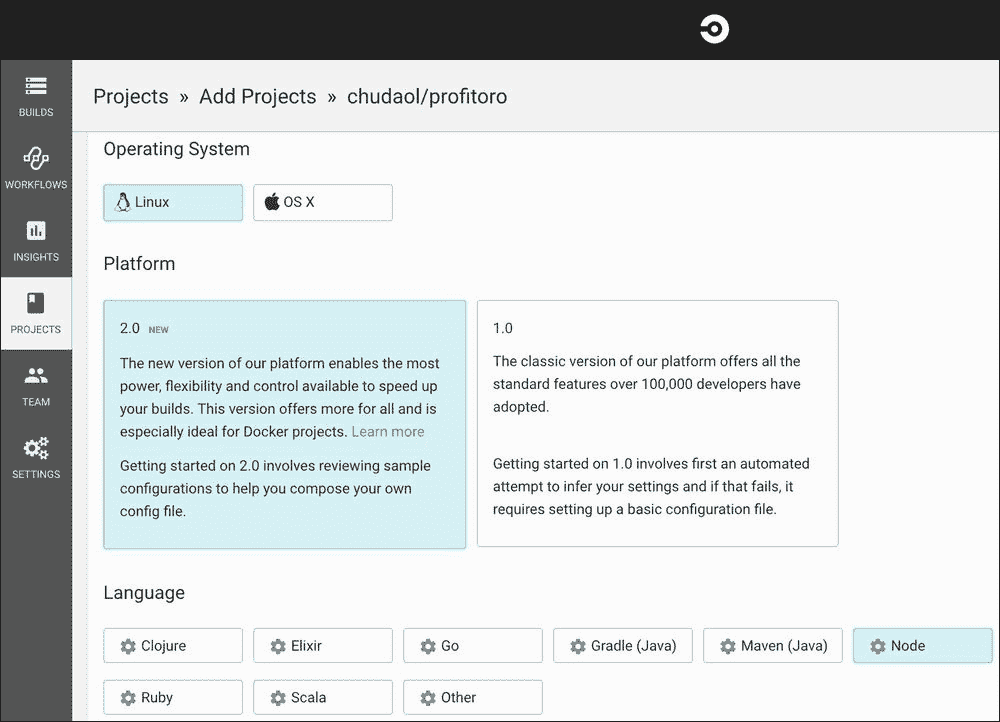
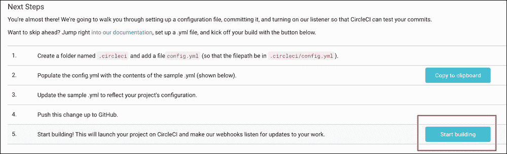
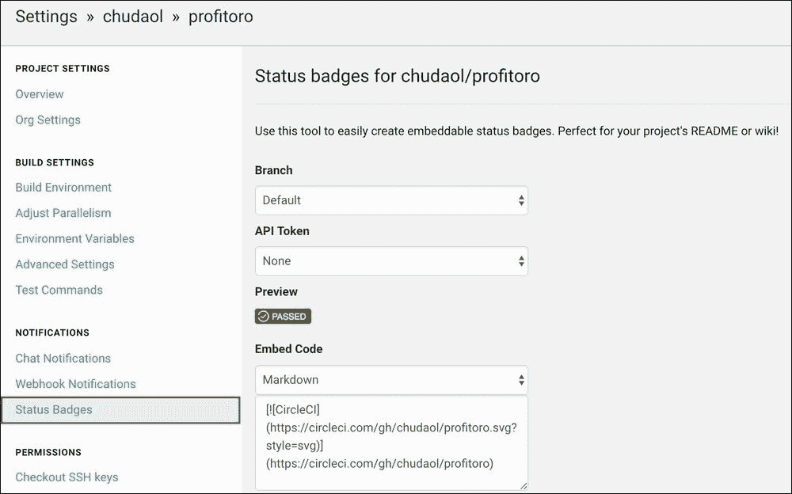
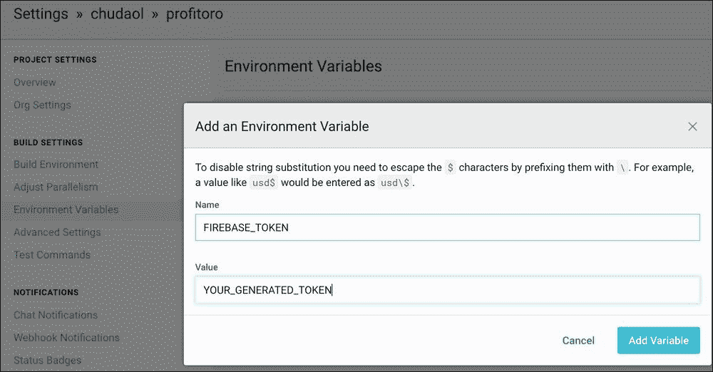
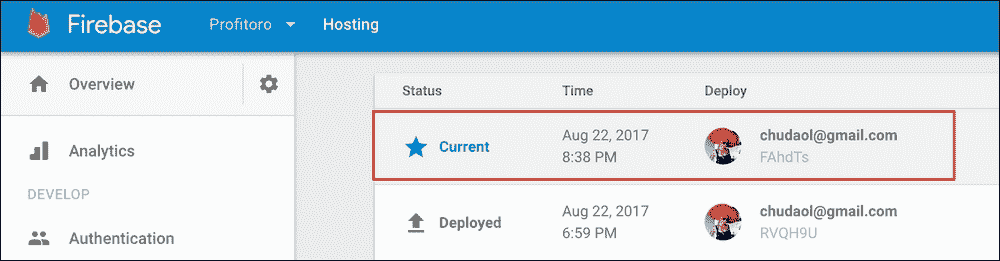
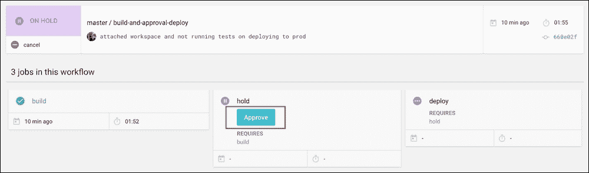

# 第 10 章使用火基部署

在上一章中，我们为应用程序的代码设置了测试框架，从现在起，我们可以使用单元测试和快照测试来覆盖它。在本章中，我们将使我们的应用程序生效！我们还将建立**持续集成**（**CI**）和**持续部署**（**CD**环境。因此，在本章中，我们将学习如何执行以下操作：

*   在本地使用 Firebase 工具部署到 Firebase 主机
*   使用 CircleCI 设置 CI 工作流
*   使用 Firebase 和 CircleCI 设置登台和生产环境

# 从本地计算机部署

在本节中，我们将使用 Firebase 命令行工具部署我们的应用程序。我们已经做到了。查看 Google Firebase文档，了解快速入门信息：[https://firebase.google.com/docs/hosting/quickstart](https://firebase.google.com/docs/hosting/quickstart) 。

基本上，如果您还没有安装 Firebase 工具，请立即安装！

```js
npm install -g firebase-tools

```

现在在项目目录内切换并初始化 Firebase 项目：

```js
firebase init

```

从出现的下拉菜单中，选择**托管**。

### 提示

这不是很明显，所以请记住，要真正从列表中选择某个内容，必须按[T0]空格[T1]。


按空格键选择托管功能

之后，从列表中选择您的ProFitOro 项目，然后，为构建的输出目录指定文件夹`dist`：


为资产的公共目录键入 dist

回答`No`下一个问题，您就完成了！确保 Firebase 在项目文件夹中创建了`firebase.json`和`.firebaserc`文件。

这就是`firebase.json`文件的外观：

```js
// firebase.json
{
  "hosting": {
    "public": "dist"
  }
}
```

这就是你的`.firebaserc`文件的样子：

```js
.firebasercs
{
  "projects": {
    "default": "profitoro-ad0f0"
  }
}
```

你完了！现在，如果使用`npm run generate`命令生成我们的静态资产，这些资产将最终位于`dist`文件夹中。如果在此之后运行`firebase deploy`，您的应用程序将立即部署！

因此，请继续运行以下操作：

```js
npm run generate
firebase deploy

```

如果遇到一些错误或问题，请执行以下操作：

*   确保您的 Firebase CLI 是最新的
*   如有必要，请使用`firebase login --reauth`重新验证
*   如果出现错误，请尝试使用`firebase use --add`添加项目

恭喜！您的应用程序已启动并正在运行！

### 注

您可能会问，如果我们最终只是生成要部署的静态资产，那么为什么还要费心处理整个 Nuxt 路由和服务器端渲染。不幸的是，Firebase 只托管静态文件。为了能够运行节点服务器，我们应该使用另一个容器，例如 Heroku:[https://stackoverflow.com/questions/30172320/firebase-hosting-with-own-server-node-js](https://stackoverflow.com/questions/30172320/firebase-hosting-with-own-server-node-js) 。

还有一件事你应该注意：事实证明现在不可能在本地运行我们的应用程序；如果我们尝试这样做，我们将得到一个`webpack`错误：


尝试在本地运行应用程序时出现网页包错误

出于某种原因，我们的`actions.js`文件尝试导入`firebase.json`而不是位于`firebase`目录中的 Firebase 应用程序`index.js`文件。这是很容易修复的。重命名 Firebase 目录`firebaseapp`——最终，它位于内部。请在`chapter10/1/profitoro`文件夹中找到本节对应的代码。注意根目录中新的`firebase.json`和`.firebaserc`文件，Firebase 应用程序的所有导入都更改为`firebaseapp`文件夹。

# 使用 CircleCI 设置 CI/CD

现在，如果我们想要部署我们的应用程序，我们首先必须在本地运行测试，确保一切正常，没有任何问题，然后使用`firebase deploy`命令部署它。理想情况下，所有这些都应该自动化。理想情况下，如果我们将代码推送到主分支，一切都应该在没有我们干预的情况下发生。带有自动测试检查的自动部署过程称为连续部署。这个术语的意思和它听起来的完全一样——您的代码正在不断地被部署。有很多工具允许您在按下按钮或按下主分支后自动将代码部署到生产环境中。从优秀但可靠的 Jenkins 开始，到 Codeship、CloudFlare、CircleCI、Travis……这个列表是无穷无尽的！我们将使用 CircleCI，因为它与 GitHub 很好地集成。如果您想了解如何使用 Travis 进行部署，请参阅我以前在 Vue.js 上的一本书：

[https://www.packtpub.com/web-development/learning-vuejs-2](https://www.packtpub.com/web-development/learning-vuejs-2)

首先，您应该在 GitHub 上托管您的项目。请按照 GitHub 文档了解如何初始化存储库：

[https://help.github.com/articles/adding-an-existing-project-to-github-using-the-command-line/](https://help.github.com/articles/adding-an-existing-project-to-github-using-the-command-line/)

或者干脆用叉子我的：

我对上帝发誓。https://github.com/chudaol/profitoro T1。

一旦您的存储库联机，请在 CircleCI 上创建您的帐户：

T0https://circleci.com T1

使用 CircleCI web 界面，创建一个新项目并从列表中选择您的存储库。然后，为语言选择 Linux 操作系统和节点：



CircleCI 项目配置

现在我们必须在我们的项目中添加一个 CircleCI 配置，以便第一个知道在我们推动后要做什么。创建名为`config.yml`的文件以及以下内容的`.circleci`文件夹：

```js
// .circleci/config.yml
# Javascript Node CircleCI 2.0 configuration file
#
# Check https://circleci.com/docs/2.0/language-javascript/ for more details
#
version: 2
jobs:
  build:
    docker:
      # specify the version you desire here
      - image: circleci/node:7.10

      # Specify service dependencies here if necessary
      # CircleCI maintains a library of pre-built images
      # documented at https://circleci.com/docs/2.0/circleci-img/
      # - image: circleci/mongo:3.4.4

    working_directory: ~/repo

    steps:
      - checkout

      # Download and cache dependencies
      - restore_cache:
          keys:
          - v1-dependencies-{{ checksum "package.json" }}
          # fallback to using the latest cache if no exact match is found
          - v1-dependencies-

      - run: npm install

      - save_cache:
          paths:
            - node_modules
          key: v1-dependencies-{{ checksum "package.json" }}

      # run tests!
      - run: npm test
```

提交并将您的更改推送到 master。进入 CircleCI 界面点击**开始搭建**按钮：



单击“开始构建”按钮

如果您像我一样幸运，您将看到以下成功输出：


CircleCI 成功了！

让我们在我们的`README.md`文件中添加一个状态标记，以便它出现在 GitHub 上。转到 CircleCI 项目设置（单击项目名称附近的 cog）：


单击项目名称附近的 cog 以打开项目的“设置”选项卡

在**设置**部分，选择**通知****状态标识**：



导航到设置|通知|状态徽章

将标记代码复制粘贴到您的`README.md`文件中，如下所示：

```js
// README.md
# Profitoro

[](https://circleci.com/gh/chudaol/profitoro)

> Take breaks during work. Exercise during breaks.
```

提交并将您的更改推送到 master！

如果您现在打开 GitHub 存储库，您将看到这个漂亮的徽章，上面写着**已通过**：


CircleCI 徽章显示了一个很好的信息：通过

但我们的整个重点不仅仅是看到一个漂亮的绿色徽章，而是实际上能够部署到 Firebase 托管容器。为此，我们必须配置 CircleCI。我们通过将[T0]节添加到[T1]文件中来实现这一点。检查[处的文件 https://circleci.com/docs/2.0/configuration-reference/#deploy](https://circleci.com/docs/2.0/configuration-reference/#deploy) 。为了能够部署到 Firebase 主机，我们需要登录。很明显，CircleCI 在任何情况下都没有登录到我们的 Firebase 帐户。幸运的是，这很容易解决。我们需要生成一个 CI 令牌，然后在我们的`deploy`命令中使用它。

### 注

可以使用`firebase login:ci`命令生成 Firebase CI 令牌。

只需在控制台中运行以下命令：

```js
firebase login:ci

```

您将获得如下类似的输出：


Firebase 登录：ci 命令的输出

进入 CircleCI 的 web界面，找到项目的设置。在左侧，您将看到名为**构建设置**的选项卡。点击**环境变量**链接上的，将弹出**环境变量**部分。点击**添加变量**按钮，添加名为`FIREBASE_TOKEN`且值为`YOUR_GENERATED_TOKEN`的变量：



将新环境变量添加到 CircleCI 项目设置中

现在，让我们向`config.yml`文件添加一个部署步骤。在执行此操作之前，请记住我们必须调用[T1]命令。好的，为此，我们应该在 CircleCI 服务器上全局安装 Firebase 工具。与其用一些全局安装的软件污染 CircleCI 服务器，不如将其作为*开发依赖项*安装，然后从`node_modules`文件夹调用命令。因此，作为第一步，将`firebase-tools`作为`dev`依赖项安装：

```js
npm install --save-dev firebase-tools

```

现在我们终于可以添加`deploy`步骤了。在此步骤中，我们必须使用`npm run generate`命令生成资产，并使用我们的令牌运行`firebase deploy`（该命令将是`firebase deploy --token=<YOUR_FIREBASE_TOKEN>`。我们不必指定令牌本身，因为我们已经为它创建了一个环境变量，因此该命令如下所示：

```js
firebase deploy --token=$FIREBASE_TOKEN

```

整个`deploy`条目如下所示：

```js
// .circleci/config.yml
jobs:
  build:
    #...

    steps:
      - checkout

      #...      
      # deploy!
      - deploy:
 command: |
 if [ "${CIRCLE_BRANCH}" == "master" ]; then
 npm run generate
 ./node_modules/.bin/firebase deploy --token=$FIREBASE_TOKEN --non-interactive
 fi

```

推动改变。检查您的 CircleCI 控制台。成功部署后，在**主机**选项卡上检查 Firebase 控制台，确保最后一次部署完全在此时完成：



确保最后一次部署恰好在此时完成！

这是不是太棒了？每次您将新更改推送到 master 时，都会首先对它们进行测试，只有通过所有测试，它们才会部署到您的 Firebase 托管提供商！我们花了多长时间来建立这一切？20 分钟？耶！

# 搭建舞台和生产环境

您可能知道，立即部署到生产环境不是很好的做法。即使测试通过，我们也必须首先检查是否一切正常，这就是为什么我们需要一个*分期*环境。

让我们在 Firebase 控制台上创建一个新的项目，并将其命名为`profitoro-staging`。现在，让我们使用 Firebase 命令行工具为我们的项目添加一个新环境。只需在控制台中运行以下命令：

```js
firebase use –add

```

选择正确的项目：


选择新创建的 profitoro 暂存项目

在下一步中键入别名`staging`：

```js
What alias do you want to use for this project? (e.g. staging) staging

```

检查是否已将新条目添加到您的`.firebaserc`文件中：

```js
// .firebaserc
{
  "projects": {
    "default": "profitoro-ad0f0",
    "staging": "profitoro-staging"
  }
}
```

如果您现在在本地运行`firebase use staging`和`firebase deploy`命令，您的项目将部署到我们新创建的暂存环境中。如果您想切换并部署到您的生产环境，只需运行命令[T2]，然后再运行命令[T3]。

现在我们需要重新配置 CircleCI 工作流。我们想要实现的是自动将资产部署到临时服务器，然后运行手动批准，以便部署到生产环境中。为此，我们将使用带有手动批准的工作流配置。请查看 CircleCI 官方文件页面：[https://circleci.com/docs/2.0/workflows/#holding-a-workflow-for-a-manual-approval](https://circleci.com/docs/2.0/workflows/#holding-a-workflow-for-a-manual-approval)。

我们将得到两个非常相似的作业–第一个作业将被称为`build`，它将包含与之前完全相同的内容，唯一的区别是部署步骤将使用别名`staging`：

```js
version: 2
jobs:
  build:
    docker
    #...

      # deploy to staging!
      - deploy:
          command: |
            if [ "${CIRCLE_BRANCH}" == "master" ]; then
              npm run generate
              ./node_modules/.bin/firebase use staging
              ./node_modules/.bin/firebase deploy --token=$FIREBASE_TOKEN --non-interactive
            fi
```

第二个作业将被称为`deploy`，它将执行与`staging`作业完全相同的步骤（只是为了完全确保一切正常）。唯一的区别是在部署之前会使用`default`别名：

```js
build:
  #...
deploy:
  docker:
    # ...
    # deploy to production!
    - deploy:
        command: |
          if [ "${CIRCLE_BRANCH}" == "master" ]; then
            npm run generate
            ./node_modules/.bin/firebase use default
            ./node_modules/.bin/firebase deploy --token=$FIREBASE_TOKEN --non-interactive
          fi
```

之后，我们将添加一个名为`workflows`的新条目，如下所示：

```js
// .circleci/config.yml
jobs:
  build:
    #...
  deploy:
    #...
workflows:
  version: 2
  build-and-approval-deploy:
    jobs:
      - build
      - hold:
         type: approval
         requires:
           - build
      - deploy:
          requires:
            - hold
```

提交并推送至 master。检查您的 CircleCI 控制台。成功部署到暂存环境后，点击**工作流**选项卡，检查其是否实际**处于搁置状态**：


工作流被搁置

检查您的登台环境网站，确保一切正常。

在完全确定一切正常后，我们可以将我们的产品推向生产。点击您的工作流程并点击**批准**按钮：



现在，我们可以手动批准生产部署

过一段时间，就会有巨大的成功！这不是很棒吗？

### 提示

尽管这超出了本书的范围，但请记住，在登台环境上运行某些检查时，您不希望破坏生产数据库。因此，为了使登台成为真正的登台，使生产成为真正的生产，我们还应该建立登台数据库。

检查`chapter10/2/profitoro`文件夹中此部分的代码。您只需要注意两件事，`.firebaserc`配置文件和驻留在`.circleci/config.yml`目录中的 CircleCI 的配置。

# 我们取得了什么成就？

亲爱的读者，我们已经踏上了一段伟大的旅程。我们从一开始就构建了响应迅速的应用程序，直到部署。我们使用了 Vue.js、Bootstrap 4 和 Google Firebase 等优秀技术来构建我们的应用程序。我们不仅使用了所有这些技术并了解了它们是如何协同工作的，我们实际上还遵循了软件开发的整个过程。

我们从业务理念、需求定义、用户故事定义和实体模型创建开始。我们继续实际的实现——包括前端和后端。我们使用 Jest 进行了彻底的测试，最终将应用程序部署到两个不同的环境中。甚至不仅仅是一个部署——我们已经实施了一个 CD 策略，它将自动为我们执行部署过程。

最重要的是，我们最终得到了一个功能齐全的应用程序，它可以让我们在工作中管理时间并保持健康！t 现场：

‘T0’。https://profitorolife.com/ “T1”。

我甚至创建了一个 Facebook 页面：

‘T0’。https://www.facebook.com/profitoro/ “T1”。

如果您喜欢 ProFitOro 的标识，请向我的朋友 Carina 致以爱和感谢：

`<[car.marg@gmail.com](mailto:car.marg@gmail.com)>`

如果你喜欢实体模型的创建方式，你应该感谢我的朋友和同事萨菲：

我对上帝发誓。https://github.com/Safure T1。

如果您喜欢 ProFitOro 的设计和插图，请查看我的朋友 Vanessa 的其他作品（[https://www.behance.net/MeegsyWeegsy](https://www.behance.net/MeegsyWeegsy) ）并与她交谈，以防你觉得她可能也会帮助你。

如果您喜欢 SCSS 实现设计的方式，请给我的朋友 Filipe（[一些*喜欢的*https://github.com/fil090302](https://github.com/fil090302) ）。

# 总结

在本章中，我们使用 CircleCI 和 Firebase 来保证我们不断部署的软件的持续质量。正如我已经提到的，很高兴看到您从头开始创建并运行的东西！

然而，我们的工作还没有完成。要做的改进太多了。我们需要验证。我们需要编写更多的测试来增加代码覆盖率！我们需要更多的锻炼，我们需要它们看起来漂亮。我们可能需要一个后台办公室，负责人可以检查每一项增加的训练，并在它真正进入每个人都能看到的训练列表之前批准它。

我们需要一个适当的统计页面与一些美丽的图形。我们需要优化图像渲染。我们需要为每个训练展示多张图片。我们可能需要为训练添加视频支持。我们还需要在 Pomodoro 工作计时器结束后显示的训练屏幕上进行一些工作。现在看起来是这样的：


这里有很多按钮！它们实际上都不起作用：(

有三个按钮，但都不起作用。

所以，正如你所看到的，虽然我们已经完成了这本书，并且我们有一个功能性的软件，但是我们仍然有一些工作要做。事实上，这让我非常高兴，因为它让我觉得我现在不必说再见。

与我分享您的想法，做一些令人惊奇的事情并与我分享，在 GitHub 上创建一些请求或问题。我很乐意回答你。如果您在`<[chudaol@gmail.com](mailto:chudaol@gmail.com)>`有任何问题、建议或想法，请发电子邮件给我。

谢谢你读这本书…去工作…出去！