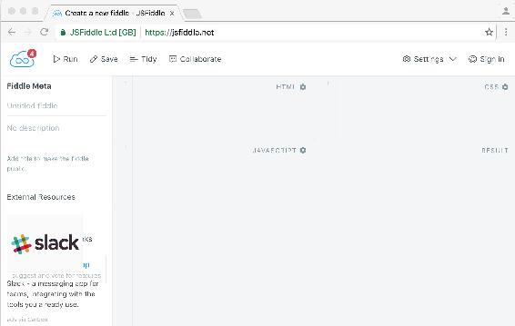
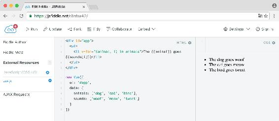
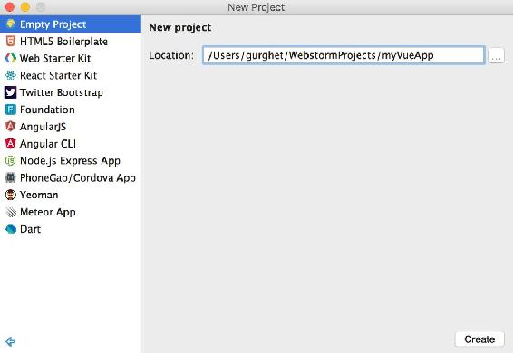
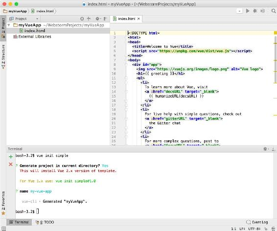
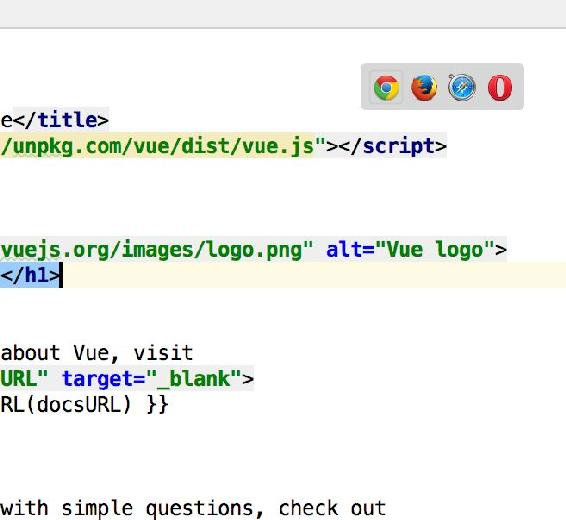
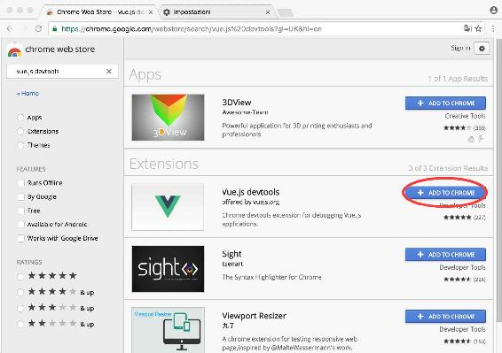
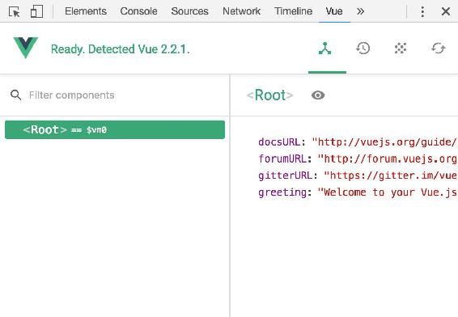
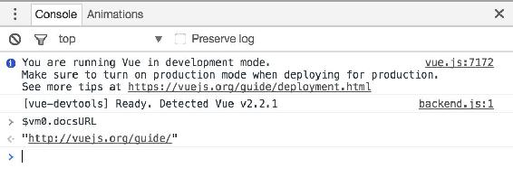

# 一、VueJS 入门

本章将介绍以下配方:

*   用 Vue.js 写 Hello World
*   写列表
*   创建动态的动画列表
*   对点击和击键等事件做出反应
*   选择开发环境
*   用过滤器格式化文本
*   用胡子调试应用(例如，JSON 过滤器)
*   使用 Vue 开发人员工具检查您的应用
*   升级到 Vue.js 2


# 介绍

Vue 是一个非常强大的框架，但它的优势之一是它非常轻量级，容易上手。事实上，在第一个食谱中，你将在几分钟内建立一个简单而有效的程序，不需要任何设置。

在这一章中，你将学习列表，它将帮助你创建有重复元素的网页(如目录)。此外，您将构建一个带有事件监听器的交互式页面。

提供了一些开发环境，以便您可以选择更适合您的环境；您将使用一些调试技巧，这将在开发您自己的代码时给您一个良好的开端，并让您更好地了解如何消除应用中的 bug。

请注意，在撰写本文时，ES5 是浏览器中最受支持的 JavaScript 标准。在这一章中，我将使用 ES5，这样即使你的浏览器不支持新的 ES6，你也可以跟着做。请记住，在接下来的章节中将会用到 ES6。到目前为止，Chrome 已经兼容了大多数 ES6 的重要组件，但是一般来说，你应该使用 **Babel** 来让你的应用兼容旧的浏览器。准备使用 Babel 的时候参考[第八章](part0390.html#BJTRC0-d58460e0eb6644049f9e99e6566f895c)、*Organize+Automate+Deploy = web pack*中的*如何使用 Babel 从 ES6* 编译。


# 用 Vue.js 写 Hello World

让我们在 Vue.js 中创建一个最简单的程序，强制性的 Hello World 程序。这里的目标是让我们熟悉 Vue 如何操作你的网页以及数据绑定是如何工作的。


# 做好准备

为了完成这个介绍性的食谱，我们只需要浏览器。也就是说，我们将使用 JSFiddle 编写我们的代码:



如果你没用过 JSFiddle，不用担心；您即将成为一名专业的前端开发人员，使用 JSFiddle 将成为您口袋中的一个便利工具:

1.  把你的浏览器指向[https://jsfiddle.net](https://jsfiddle.net)T2:

你将会看到一个分成四个象限的空白页。左下角是我们编写 JavaScript 代码的地方。顺时针方向，我们有一个 HTML 部分，一个 CSS 部分，最后是结果页面的预览。

在开始之前，我们应该告诉 JSFiddle 我们想要使用 Vue 库。

2.  在 JavaScript 象限的右上方，按下齿轮并从列表中选择 Vue 2.2.1(您应该会发现不止一个版本，“edge”指的是最新版本，在撰写本文时对应于 Vue 2)。

我们现在准备编写我们的第一个 Vue 程序。


# 怎么做...

1.  在 JavaScript 部分，编写:

```js
        new Vue({el:'#app'})

```

2.  在 HTML 象限中，我们创建了 `<div>` :

```js
        <div id="app">
          {{'Hello ' + 'world'}}
        </div>

```

3.  点击左上角的运行按钮；我们看到页面上问候我们的是 Hello world :


# 它是如何工作的...

`new Vue({el:'#app'})`将实例化一个新的 Vue 实例。它接受一个选项对象作为参数。这个对象是 Vue 的核心，定义并控制数据和行为。它包含创建 Vue 实例和组件所需的所有信息。在我们的例子中，我们只指定了接受选择器或元素作为参数的`el`选项。`#app`参数是一个选择器，它将返回页面中以`app`为标识符的元素。例如，在这样的页面中:

```js
<!DOCTYPE html> 
<html> 
  <body> 
    <div id="app"></div> 
  </body> 
</html>

```

我们在 ID 为`app`的`<div>`中写的所有东西都在 Vue 的范围之内。

现在，JSFiddle 把我们在 HTML 象限中写的所有东西都包装在 body 标签中。这意味着，如果我们只需要在 HTML 象限中编写`<div>`，JSFiddle 会将它包装在 body 标签中。

It's also important to note that placing the `#app` on the `body` or `html` tag will throw an error, as Vue advises us to mount our apps on normal elements, and its the same thing goes for selecting the `body` in the `el` option.

八字胡(或把手)是一种告诉 Vue 把所有东西都放在里面并作为代码解析的方式。引号是 JavaScript 中声明文字字符串的正常方式，因此 Vue 只返回由 `hello` 和 `world` 组成的字符串连接。没什么特别的，我们只是连接了两个字符串并显示了结果。


# 还有更多

我们可以利用它来做一些更有趣的事情。如果我们是外星人，我们想同时问候多个世界，我们可以写:

```js
We conquered 5 planets.<br/> 
{{'Hello ' + 5 + ' worlds'}}

```

我们可能会忘记我们征服了多少个世界。没问题，我们可以在胡子里做数学。同样，让我们将`Hello`和`worlds`放在括号外:

```js
We conquered {{5 + 2}} planets.<br/> 
Hello {{5 + 2}} worlds

```

把世界的数量作为原始数字放在胡子里是很混乱的。我们将使用数据绑定将它放入实例中的命名变量中:

```js
<div id="app"> 
  We conquered {{countWorlds}} planets.<br/> 
  Hello {{countWorlds}} worlds 
</div>

new Vue({ 
  el:'#app', 
  data: { 
    countWorlds: 5 + 2 
  } 
})

```

整洁的应用就是这样完成的。现在，每征服一个星球，我们只需要编辑`countWorlds`变量。反过来，每次我们修改这个变量，HTML 就会自动更新。

恭喜您，您已经完成了进入 Vue 世界的第一步，现在您已经能够使用反应式数据绑定和字符串插值来构建简单的交互式应用了。


# 写列表

产生列表的欲望似乎是人类天性的一部分。一个人看着有序的列表在电脑屏幕上显示出来，会有一种深深的满足感。

有了 Vue，我们就有了制作各种列表的工具，它们有着令人惊叹的外观和最大的便利性。


# 做好准备

对于这个配方，我们将使用基本的数据绑定，如果你遵循第一个配方，你就已经熟悉它了。


# 怎么做...

我们将用几种不同的方式来构建列表:用一系列数字，用一个数组，最后用一个对象。


# 数字范围

要从列表开始，像前面的方法一样设置您的 JSFiddle，添加 Vue.js 作为框架。选择 Vue 2.2.1 (或 Vue (edge) ):

1.  在 JavaScript 部分，编写:

```js
        new Vue({el:'#app'})

```

2.  并在 HTML 中写道:

```js
        <div id="app"> 
          <ul> 
            <li v-for="n in 4">Hello!</li> 
          </ul> 
        </div>

```

这将产生一个带有 *Hello！*写了四遍。几秒钟后，你的第一份清单就完成了，干得好！

我们可以用这种技术写一个倒计时——在 HTML 中，用下面的内容替换`<div>`的内容:

```js
<div id="app"> 
  <ul> 
    <li v-for="n in 10">{{11-n}}</li> 
    <li>launch missile!</li> 
  </ul> 
</div>

```


# 数组

1.  在 HTML 中，为了获得相同的结果，请编辑列表以反映以下内容:

```js
        <ul> 
            <li v-for="n in [10,9,8,7,6,5,4,3,2,1]">{{n}}</li> 
            <li>launch missile!</li> 
        </ul>

```

尽管这个列表与前一个相同，但是我们不应该在 HTML 标记中放置文字数组。

2.  我们最好使用包含数组的变量。编辑前面的代码以匹配以下内容:

```js
        <ul> 
          <li v-for="n in countdown">{{n}}</li> 
          <li>launch missile!</li> 
        </ul>

```

3.  然后把数组的倒计时放到 JavaScript 中:

```js
        new Vue({ 
          el:'#app', 
          data: { 
            countdown: [10,9,8,7,6,5,4,3,2,1] 
          } 
        })

```


# 带索引符号的数组

在枚举数组时，我们还可以访问索引，由下面代码中的变量`i`表示:

1.  HTML 变成了:

```js
        <div id="app"> 
          <ul> 
            <li v-for="(animal, i) in animals">
              The {{animal}} goes {{sounds[i]}}
            </li> 
          </ul> 
        </div>

```

2.  在代码部分，编写:

```js
        new Vue({ 
          el: '#app', 
          data: { 
            animals: ['dog', 'cat', 'bird'], 
            sounds: ['woof', 'meow', 'tweet'] 
          } 
        })

```



# 目标

前面的例子可以重构以匹配动物名称和它们的音，这样索引的意外错位不会影响我们的列表。

1.  HTML 变成了:

```js
        <div id="app"> 
          <ul> 
            <li v-for="(sound, name) in animals"> 
              The {{name}} goes {{sound}} 
            </li> 
          </ul> 
        </div>

```

2.  我们需要在 JavaScript 中创建`animals`对象:

```js
        new Vue({ 
          el: '#app', 
          data: { 
            animals: { 
              dog: 'woof', cat: 'meow', bird: 'tweet' 
            } 
          } 
        })

```


# 它是如何工作的...

列表的工作非常简单；这里有一点关于语法的解释。


# 数字范围

变量`n`在`<li>`标签的范围内。为了证明给自己看，你可以快速建立一个如下的倒计时列表:

```js
<ul> 
  <li v-for="n in 10">{{11 - n}}</li> 
  <li>launch missile!</li> 
</ul>

```

我们写`11`而不是`10`，因为 Vue 中的枚举是 1 索引的；这意味着`10` 中的 `n`将从`1`开始计数，而不是像有人可能预期的那样从`0`开始，一直上到`10`。如果我们想让我们的倒计时从`10`开始，那么我们必须放`11`。最后一个数字将是`10`，所以我们将`1`作为导弹发射前的最后一个数字。

`v-for="n in 10"`做的是调用**枚举**；具体来说，我们正在列举一系列数字(1 到 10)。


# 数组

Vue 也允许我们枚举数组。一般语法如下:

```js
v-for="(element, index) in array"

```

正如所见，如果我们想要的只是数组元素，那么可以省略索引和括号。

这种形式的枚举保证是有序的。换句话说，数组中元素的有序序列将与您在屏幕上看到的相同；枚举对象时情况并非如此。


# 目标

语法是`v-for="(value, property)"`，如果你想的话，你也可以用`v-for="(value, property, index)"`挤进索引。但是不推荐使用后者，因为正如已经说过的，枚举属性的顺序是不固定的。实际上，在大多数浏览器中，顺序与插入顺序相同，但这并不保证。


# 创建动态的动画列表

在 Vue 中，大多数数据都是被动的。实际上，这意味着如果我们的视图模型发生了变化，我们将立即看到结果。这是让你专注于应用本身，抛开所有的绘图逻辑。在这个食谱中，我们也要承认这个系统的一些局限性。


# 做好准备

要完成这个菜谱，您应该知道如何使用基本的数据绑定(在第一个菜谱中介绍过)以及如何创建列表(第二个菜谱)。


# 怎么做...

在前一个配方中，我们为导弹发射建立了一个倒计时列表:

```js
<div id="app"> 
  <ul> 
    <li v-for="n in countdown">{{n}}</li> 
    <li>launch missile!</li> 
  </ul> 
</div>

```

```js
new Vue({
  el:'#app',
  data: {
    countdown: 
      [10,9,8,7,6,5,4,3,2,1]
  }
})

```

如果拍成动画岂不是很棒？我们可以调整 JavaScript，随着时间的流逝给倒计时添加数字:

1.  将前面的代码复制到 JSFiddle 的 HTML 和 JavaScript 部分，例外的是我们将自己填充倒计时，所以将其设置为一个空数组。

为了获得倒计时变量，我们必须通过 Vue 实例本身传递变量。

2.  将 Vue 实例分配给一个变量，供以后参考:

```js
        var vm = new Vue({
          el:'#app',
          data: {
            countdown: []
          }
        })

```

这样我们可以使用`vm`来访问 Vue 实例。

3.  从 10:

```js
        var counter = 10

```

4.  设置一个函数，将剩余的秒数重复添加到现在为空的 `countdown`数组:

```js
        setInterval(function () { 
          if (counter > 0) { 
            vm.countdown.push(counter--) 
          } 
        }, 1000)

```


# 它是如何工作的...

我们要做的是获取一个对`countdown`数组的引用，并在`setInterval`的帮助下用递减的数字填充它。

我们通过在`vm.countdown.push(counter--)`行中设置的`vm`变量来访问`countdown`，所以每次我们向数组中添加一个新数字时，我们的列表都会更新。

这段代码非常简单，只需注意我们必须使用`push`函数向数组中添加元素。使用方括号符号添加元素将不起作用:

```js
vm.countdown[counter] = counter-- // this won't work

```

数组将被更新，但是由于 JavaScript 的实现方式，这种分配方式将跳过 Vue 的反应式系统。


# 还有更多

现在运行代码将一次添加一个倒计时数字；很好，但是最后一个元素`launch missile`呢？我们希望它只出现在最后。

要做到这一点，我们可以直接在 HTML 中使用一个小技巧:

```js
<ul> 
  <li v-for="n in countdown">{{n}}</li> 
  <li>{{ countdown.length === 10 ? 'launch missile!' : '...' }}</li> 
</ul>

```

这个解决方案不是我们能做的最好的；在`v-show`上了解更多食谱。

我们刚刚了解到，如果我们想让数组在视图中更新，就不能用括号符号向反应式数组添加元素。对于使用括号修改元素以及手动更改数组长度也是如此:

```js
vm.reactiveArray[index] = 'updated value' // won't affect the view 
vm.reactiveArray.length = 0 // nothing happens apparently

```

您可以使用拼接方法来克服这一限制:

```js
vm.reactiveArray.splice(index, 1, 'updated value') 
vm.reactiveArray.splice(0)

```


# 对点击和击键等事件做出反应

每个应用的一个基本部分是与用户的交互。Vue 有速记来拦截大多数用户事件，并将它们连接到相关的动作。


# 做好准备

为了成功完成这个食谱，你应该知道如何创建一个列表。如果你不知道，看看[第二章](part0082.html#2E6E40-d58460e0eb6644049f9e99e6566f895c)、*基本 Vue.js 特性*中的*过滤带有计算属性*的列表的方法。


# 怎么做...

以下代码显示了如何对`click`事件做出反应:

1.  填写以下 HTML:

```js
        <div id="app"> 
          <button v-on:click="toast">Toast bread</button> 
        </div>

```

2.  至于 JavaScript，编写如下代码:

```js
        new Vue({el:'#app', methods:{toast(){alert('Tosted!')}}})

```

3.  运行代码！按钮上将安装一个事件监听器。
4.  点击按钮，你应该会看到一个弹出窗口，上面写着 *烤好了！*


# 它是如何工作的...

运行上述代码将在按钮上安装一个事件处理程序。语法是`v-on:DOMevent="methodEventHandler"`。处理程序必须是一个方法，即方法选项中的一个函数。在前面的例子中，`toast`是处理程序。


# 双向数据绑定

在大多数情况下,`v-on`属性将覆盖您，尤其是当事件来自元素时。另一方面，对于某些任务来说，它有时可能过于冗长。

例如，如果我们有一个文本框，我们想用文本框的内容更新一个变量，并确保文本框总是有一个变量的更新值(称为**双向数据绑定**)，我们就必须编写几个处理程序。

相反，该操作由`v-model`属性执行，如以下代码所示:

```js
<div id="app"> 
  <button v-on:click="toast">Toast bread</button> 
  <input v-model="toastedBreads" /> 
  Quantity to put in the oven: {{toastedBreads}} 
</div>

new Vue({ 
  el: '#app', 
  methods: { 
    toast () { 
      this.toastedBreads++ 
    } 
  }, 
  data: { 
    toastedBreads: 0 
  } 
})

```

试用一下这个应用，注意保持文本框同步不需要任何处理程序。每次`toastedBreads`更新，文字也会更新；相反，每次你写一个数字，数量也会更新。


# 还有更多

如果你遵循本章的第一个食谱，你会记得我们是如何迎接不同数量的世界的；我们可以让体验更具互动性。让我们建立一个我们想要问候的星球的列表:

```js
<div id="app"> 
  <ul> 
    <li v-for="world in worlds">{{world}}</li> 
  </ul> 
</div>

new Vue({ 
  el: '#app', 
  data: { 
    worlds: ['Terran', 'L24-D', 'Ares', 'New Kroy', 'Sebek', 'Vestra'] 
  } 
})

```

我们希望能够跟踪新征服的世界，并删除我们摧毁的世界。这意味着从列表中添加和删除元素。考虑下面的 HTML:

```js
<ul> 
  <li v-for="(world, i) in worlds"> 
    {{world}} 
  <button @click="worlds.splice(i, 1)">Zap!</button> 
  </li> 
</ul> 
<input v-model="newWorld"/> 
<button @click="worlds.push(newWorld)">Conquer</button>

```

这里的`@`符号是 `v-on` : 的简写，让我们来检查一下修改:

*   我们添加了一个按钮来移除行星(我们需要在`v-for`中写出索引)
*   我们放置了一个绑定到数据变量`newWorld`的文本框
*   我们放置了一个相应的按钮，将文本框中的内容添加到列表中

运行这段代码会起作用。但是，如果您查看控制台，您会在更新文本字段时看到一条警告:

```js
[Vue warn]: Property or method "newWorld" is not defined on the instance but referenced during render. Make sure to declare reactive data properties in the data option. (found in root instance)

```

这是因为我们从未在 Vue 实例中声明过`newWorld`，但这很容易解决:

```js
new Vue({ 
  el: '#app', 
  data: { 
    worlds: ['Terran', 'L24-D', 'Ares', 'New Kroy', 'Sebek', 'Vestra'], 
    newWorld: '' 
  } 
})

```


# 选择开发环境

我们将探索一些不同的开发风格，从简单的 JSFiddle 方法到支持 WebStorm 的更健壮的方法。因为我们希望使用库来为我们的软件添加新的功能，所以不管您选择哪种开发方法，我都将为您提供一个添加库的指南。


# 怎么做...

我将从最简单的方法开始，然后向您展示一些更大项目的更复杂的方法。


# 只有浏览器

有一系列的网站，比如 JSFiddle，可以让你直接从浏览器(CodePen 和 JS Bin 等)编写 Vue 应用，这些网站非常适合测试新功能和尝试本书中的方法。另一方面，他们在代码组织方面太受限制，无法开发更多的东西。在本章的第一个配方中，使用了这种开发风格，所以请参考它来学习如何只使用浏览器进行开发。总的来说，你应该根据你正在开发的东西，把你通过这种方法学习到的东西转移到更结构化的项目中去。


# 仅通过浏览器添加依赖关系

每次提到外部库，你都会在网上搜索相对的`.js`文件，最好是某个 CDN 分发的，添加到 JSFiddle 的左侧菜单。让我们试试 moment.js 。

1.  打开一个新的 jsdild(将浏览器指向 https://jsfiddle.net/)。
2.  在另一个选项卡中，在您最喜欢的搜索引擎中搜索`momentjs CDN`。
3.  第一个结果应该会引导您进入一个带有链接列表的 CDN 网站；您最终应该会找到类似于 `https://somecdn.com/moment.js/X.X.X/moment.js`的东西，其中 *X* 代表版本号。
4.  复制你找到的链接，回到 JSFiddle。
5.  在左边栏的外部资源部分，粘贴你的链接，按 *进入* 。

对于许多图书馆来说，这已经足够了；有些库不支持这一点，你必须以其他方式将它们包含在你的 JSFiddle 中。


# 文字编辑器

启动和运行的最简单方法是使用文本编辑器和浏览器。这对于简单的自包含组件来说是完全合理的。

如今有大量的文本编辑器可供选择。我喜欢用的一个是微软的 Visual Studio 代码([https://github.com/Microsoft/vscode](https://github.com/Microsoft/vscode))。如果你使用另一个插件，差别不大，只是碰巧代码中有一个 Vue 插件:

1.  创建一个名为`myapp.html`的新文件，我们在其中写道:

```js
        <!DOCTYPE html> 
        <html> 
          <head> 
            
          </head> 
          <body> 
            <div id="app"> 
              {{'hello world'}} 
            </div> 
            <script 
              src="https://cdnjs.cloudflare.com/ajax
               /libs/vue/2.0.0/vue.js">
            </script> 
            <script> 
              new Vue({el:'#app'}) 
            </script> 
          </body> 
        </html>

```

2.  在浏览器中打开刚刚创建的文件。

Vue 从[https://cdnjs.com/](https://cdnjs.com/)下载，文本`hello world`应该会出现(没有八字胡——如果你看到八字胡，可能是出了什么问题，所以检查控制台的错误)。

这种方法类似于 JSFiddle:我们有一个 HTML 部分、一个 JavaScript 部分和一个 CSS 部分。我们正在控制一切。此外，这样我们可以使用 Vue 开发工具(查看使用 Vue 开发工具对您的应用进行 X 射线检查的方法*以了解相关介绍)。*


# 使用文本编辑器添加依赖关系

在这个配置中添加外部库意味着简单地在文件中添加另一个`<script>`条目，并将 source 属性设置为相应的链接。如果我们想添加`moment.js`，我们用和前面解释的一样的方法查找库，然后我们将下面的代码片段添加到我们的页面中:

```js
<script src="https://somecdn.com/moment.js/X.X.X/moment.js "></script>

```

Please note that you have to paste the link you found instead of the fake one mentioned in the preceding snippet.

# 节点程序包管理器(npm)

Vue 项目的规范工作方式，也是 Vue 社区官方支持的方式，包括使用 npm ，特别是一个名为`vue-cli`的 npm 包。

如果你不熟悉 npm ，把它放在你要做的事情的清单上，特别是如果你计划广泛地用 JavaScript 开发的话。

简而言之，npm 是一个组织和共享你的代码的工具，而不仅仅是在你的项目中使用别人的代码。更正式地说，它是所有 JavaScript 的包管理器。我们现在将使用一些基本的命令，在本书的后面部分将使用一些更高级的命令，但是您也可以自己学习更多的命令:

1.  安装 npm。因为它捆绑在 Node.js 中，所以最好的方法是直接安装 Node.js。你会在[](https://github.com/Microsoft/vscode)找到说明。
2.  安装 npm 后，打开命令行，键入`npm install -g vue-cli`；这将安装`vue-cli`。`-g`选项代表全球，这意味着无论你在哪里，你可以输入`vue`，它就会运行程序。
3.  创建一个新目录作为工作区。我们会把所有的项目放在里面。
4.  类型`vue list`；我们从官方的 Vue 模板库中获得所有可用的模板——也可以使用其他来源的模板。

这个`simple`模板将创建一个类似于我们之前几段所做的页面。我邀请你跑一跑`vue init simple`看看；找出那和我们所做的之间的区别。相反，我们现在所做的是更进一步。我们将使用一个包含捆绑器的更复杂的模板。`webpack`和`browserify`各一个；我们选择第一种。

如果您不熟悉`webpack`或`browserify`，它们是控制 JavaScript 程序构建过程的程序，从源代码和资产(图像、css 文件等)到定制的包。例如，对于单个`.js`文件:

1.  键入`vue init webpack-simple`,程序会问你一些关于你希望你的项目如何的问题。如果你不知道如何回答，按下*进入*进入默认状态。

我们可以用同样的方式选择`browserify-simple`模板；这是两个不同的库来实现相同的结果。

2.  一旦脚手架完成，键入`npm install`。这将负责下载和安装我们编写 Vue 应用所需的所有 npm 包。

在这之后，您就已经有了一个正常运行的演示应用。

3.  键入`npm run dev`运行您的应用。进一步的指示，将出现在屏幕上，并会告诉你访问一个特定的网址，但有一个很好的机会，你的浏览器将自动打开。
4.  将浏览器指向指定的地址。您应该可以马上看到演示应用。

探索由`vue-cli`创建的源文件，你会发现两个值得注意的文件。第一个文件是应用的入口点，`src/main.js`。它将包含如下内容:

```js
import Vue from 'vue' 
import App from './App.vue'

new Vue({ 
 el: '#app', 
 render: h => h(App) 
})

```

这段代码加载在您刚刚看到的`index.html`页面中。它只是告诉主 Vue 实例加载并呈现由`#app`选择的元素中的`App`组件(具有属性`id="app"`的元素，在我们的例子中是一个`<div>`)。

您将找到的`App.vue`文件是一种自包含的方式，您可以用它来编写 Vue 组件。您将在其他菜谱中找到更多关于组件的内容，但是现在，您可以将它视为一种可以进一步划分应用以使其更加有序的方式。

以下代码不同于您在官方模板中找到的代码，但它总结了一般结构:

```js
<template> 
  <div id="app"> 
     
    <h1>\{{ msg }}</h1> 
  </div> 
</template>
<script> 
export default { 
  data () { 
    return { 
      msg: 'Hello Vue 2.0!' 
    } 
  } 
} 
</script> 
<style> 
body { 
  font-family: Helvetica, sans-serif; 
} 
</style>

```

您可以看到，将代码分成 HTML、JavaScript 和 CSS 是一种重复出现的模式。在这个文件中，我们可以看到一些类似于我们在第一个菜谱中在 JSFiddle 中看到的东西。

在`<template>`标签中我们放入 HTML，在`<script>`标签中放入 JavaScript 代码，我们使用`<style>`标签为我们的应用添加一些样式。

运行`npm run dev`后，可以尝试编辑这个文件中的`msg`变量；保存修改后，网页将自动重新加载组件。


# 使用 npm 添加依赖关系

要在此配置中添加外部库，您只需键入`npm install`，后跟库的名称。然后，在您的代码中，您可以按照以下方式使用它:

```js
import MyLibrary from 'mylibrary'

```

我们可以用下面的命令导入`moment.js`:

```js
npm install moment

```

然后，在我们的 JavaScript 中，我们添加了以下几行:

```js
import moment from 'moment'

```


# 集成驱动电子设备

如果你有一个非常大的项目，你可能已经在使用 IntelliJ 或 Webstorm 这样的工具了。在这种情况下，我建议您坚持使用嵌入式控制台来完成大部分工作，并且只使用语法突出显示和代码完成等功能。这是因为开发人员的工具对于 Vue 来说还不成熟，你可能会花更多的时间来配置你的工具，而不是实际编程:

1.  打开 Webstorm 并创建一个新的空项目:



2.  在左下角你应该可以打开控制台或终端:


3.  根据这个提示，您应该能够完全按照上一段中的说明使用 npm。如果你还没有读它。在我们的例子中，我们将假设安装了 Node 并且还安装了 vue-cli 。

4.  键入`vueinit simple`并回答问题；您应该会得到类似于以下内容的结果:



5.  双击打开`index.html`文件。
6.  将鼠标悬停在`index.html`文件的右上角，你应该会看到浏览器图标；点击一个:



7.  您的示例应用已经启动并运行了！


# 包裹

你可以在专门的食谱中看到更多这方面的内容。在这里，我想让您对使用 Vue 进行开发的可能性有一个大致的了解。对于快速原型，您绝对可以使用 JSFiddle。当你需要你自己的环境或者你需要使用 Vue 开发工具而不是更多的时候，仅仅使用一个文本编辑器是可以接受的。然而，对于大多数严肃的项目，你应该熟悉 npm ，w ebpack，或 B rowserify ，并使用 vue-cli 来搭建你的新项目。


# 用过滤器格式化文本

Vue 的第一个版本捆绑了一些文本过滤器，帮助格式化文本和解决一些常见问题。

在这个新版本中，没有内置的过滤器(除了下一个食谱中提到的 JSON 过滤器的等价物)。我认为这是因为很容易编写自己的过滤器，也很容易找到在特定情况下做得更好的在线库。最后，过滤器的用途有所改变:它们现在更多地用于后处理，而不是真正的过滤和排序数组。

为了演示创建一个过滤器有多容易，我们将重新创建一个旧版本 Vue 的过滤器:大写。


# 做好准备

你不需要任何特别的知识来完成这个食谱。


# 怎么做...

有时我们有一些字符串在变量中浮动，比如标签。当我们把它们放在句子中间时，它们工作得很好，但另一方面，它们放在句子或要点的开头看起来不太好。

我们想写一个过滤器，它将大写我们放入的任何字符串。例如，如果我们希望字符串 `hello world` 以大写字母`H`开头，我们希望能够编写:

```js
{{'hello world' | capitalize }}

```

如果我们试图在 Vue 应用中运行 HTML，它会抱怨`[Vue warn]: Failed to resolve filter: capitalize`。

让我们创建过滤器并将其添加到 Vue 的内部过滤器列表中:

1.  编写以下 JavaScript 来注册一个过滤器并实例化 Vue:

```js
        Vue.filter('capitalize', function (string) { 
          var capitalFirst = string.charAt(0).toUpperCase() 
          var noCaseTail = string.slice(1, string.length) 
            return capitalFirst + noCaseTail 
        }) 
        new Vue({el:'#app'})

```

2.  在 HTML 部分，写下:

```js
        {{'hello world' | capitalize }}

```

3.  运行您的代码，注意文本现在显示为 Hello world 。


# 它是如何工作的...

管道符号表示下面是一个过滤器的名称；在我们的例子中,`capitalize`不在 Vue 的过滤器列表中，因此出现警告。Vue 将按原样打印字符串。

Vue 在开始之前会做的是在它的资源库中注册我们的过滤器(用`Vue.filter`)。Vue 有一个内部的过滤器对象，并将创建一个新条目:`capitalize`。每次看到管道符号时，它都会寻找相应的过滤器。记住在 Vue 实例实际实例化之前写它，因为否则 Vue 将找不到它。

过滤器的工作是非常基本的 JavaScript，事实上，用 ES6 编写过滤器的更好方法是:

```js
Vue.filter('capitalize', function (string) { 
  var [first, ...tail] = string 
  return first.toUpperCase() + tail.join('') 
})

```

如果你不熟悉 ES6，这里简单解释一下。第二行称为字符串的**析构**赋值；特别是，我们将 string 解释为一个字符数组，将第一个字符分隔成 first，并将所有其他字符放入`tail`。这是将数组的不同部分赋给多个变量的一种更快的方法。另一件可能看起来很神秘的事情是`join('')`。由于`tail`现在是一个字符数组，我们需要一些方法将单个字母重新组合成一个紧凑的字符串。`join`的参数表示单个字符之间的分隔符。我们不想要，所以我们传递一个空字符串。

在下一章中，你会发现更多的过滤器的配方，并涵盖其他真正的用例。


# 用胡子调试应用(例如，JSON 过滤器)

在前一个配方中，我们对过滤器有一个完整的概述，我们说过 Vue 没有内置过滤器，除了一个相当于 JSON 的过滤器。这个过滤器非常有用，虽然用它来调试被认为不是真正正统的，但有时它只是让您的生活更容易。现在我们直接拥有它，甚至不用写它。


# 怎么做...

要查看它的运行情况，我们可以简单地在 Vue 实例中显示一个对象的值。

1.  编写以下 JavaScript:

```js
        new Vue({ 
          el: '#app', 
          data: { 
            cat: { 
              sound: 'meow' 
            } 
          } 
        })

```

这只是在我们的代码中创建了一个包含字符串的`cat`对象。

2.  编写以下 HTML:

```js
        <p>Cat object: {{ cat }}</p>

```

3.  运行你的应用，注意`cat`对象是如何完美输出的，就像`JSON.stringify`一样。


# 它是如何工作的...

Cat 将显示`cat`对象的内容。在旧的 Vue 中，为了得到这个结果，我们必须编写`{{ cat | json }}`。

需要警惕的是对象中的循环。如果我们的对象包含一个循环引用，并且你用胡子把它包起来，这将不起作用。这些物体比你想象的更常见。例如，HTML 元素是包含对父节点的引用的 JavaScript 对象；父节点又包含对其子节点的引用。任何这样的树结构都会导致八字胡打印出对象的无限描述。当你真的这么做时，Vue 只是抛出一个错误并拒绝工作。您在控制台中看到的错误实际上是由用于打印`JSON.stringify`对象的内部方法抛出的。

使用八字胡的一个实际情况是，当同一个值在几个地方发生变化时，或者当您想要快速检查变量的内容时。从你将在本书中看到的用法来看，胡子甚至可以用于演示目的。


# 使用 Vue 开发人员工具检查您的应用

使用胡子是显示对象内容的一种快捷方式。然而，它有一些局限性；在前一个方法中概述的其中一个是，开箱即用，当处理包含循环引用的对象时，它会中断。Vue developer tools 是一个工具，它在检查内部变量时没有这种限制，并且具有更多的调试功能。有一个 Chrome 扩展将在开发的每一步帮助你，可视化组件的状态，它们在页面中的位置，等等。它还与 **Vuex** 深度集成(在后面的菜谱中有介绍)，并具有时间机器功能，让你直接从浏览器倒带事件流。


# 做好准备

要安装它，你只需从 Chrome 网上商店的扩展类别中下载扩展即可。只需查找 V ue.js devtools 就能马上找到，按下**添加到 CHROME** 按钮，一切就绪:



不幸的是，在某些配置中你将无法使用它；特别是它目前似乎不能在`iframe`环境中工作，JSFiddle 就是其中之一，所以要看到它，你至少要使用*选择开发环境*中概述的*单页方法*。
。


# 怎么做...

1.  访问 Chrome 的开发者工具(通常带有*c*MD+*opt*+*I*或*Ctrl*+*Shift*+*I*)，你会在末尾看到一个新的标签，上面写着 Vue 。点击它将显示开发者工具。

To make it work for pages opened via the `file://` protocol, you need to check Allow access to file URLs for this extension in Chrome's extension management panel.

你将会看到一个分层的树状结构，显示在你的页面上，通过选择它们，你将能够实时深入地看到所有的变量。

2.  单击三个中的各种对象查看详细信息:



此外，你会看到一个有用的按钮: inspect DOM 按钮(眼睛)会将页面滚动到元素所在的位置，并显示 Chrome 开发工具中的 DOM 表示。此外，当您单击一个组件(图中的根)时，您将有一个类似于`$vm0`的变量可用于控制台。例如，您可以执行方法或检查变量。

3.  单击根组件并在控制台中编写以下内容，以浏览`$vm0.docsUrl`属性:



# 升级到 Vue.js 2

如果你需要将你的 Vue 应用升级到第 2 版，你的大部分代码都可以运行了。虽然有几个功能需要一些修改。有些是简单的改名，有些比较复杂。


# 怎么做...

让您的迁移有一个良好的开端；Chris Fitz(Vue 核心团队的成员)创建了一个小助手应用，它将扫描您的代码并指导您进行迁移:

1.  使用以下 npm 命令安装 Vue 迁移帮助程序:

```js
 npm install -g git://github.com/vuejs/vue-migration-helper.git

```

2.  导航到您的应用文件夹。
3.  使用以下命令运行程序:

```js
 vue-migration-helper

```

所有需要更改的行都将突出显示。一旦您完成更新，或者如果您仍然有疑问，您应该在 https://rc.vuejs.org/guide/migration.html 的 [查看官方文档迁移页面。](https://rc.vuejs.org/guide/migration.html)


# 它是如何工作的...

通读文档将帮助您理解需要更新的关键点。在这里，我将为您提供一些最具挑战性的修改的基本原理。


# 不赞成使用$broadcast、$dispatch 和 events 选项

方法`$broadcast`和`$dispatch`现在都合并到了`$emit`方法中，语法与旧版本相同。不幸的是，用`$emit`替换`$broadcast`和`$dispatch`的每一个实例并不能保证总是有效，因为现在用于管理事件的模式略有不同。

在 Vue 1 中，事件沿着一条路径向下(对于`$broadcast`)或向上(对于`$dispatch`)以及水平(对于`$emit`)穿过层次树。

老实说，我从来不喜欢有两个(如果算上老的`$emit`)方法来发射事件。即使在最小的背景下也令人困惑，因为你必须问自己*这个活动是为父母还是孩子举办的？*大多数时候，区别并不重要，你只是希望你的方法能够成功。但是天下没有免费的午餐；我们必须在我们的系统中添加一个可移动的部分，以使一切都在新的范例中工作。

现在，所有事件都应该通过一个或多个中心枢纽。这个中央集线器的角色可以由 Vue 实例来承担，因为它们实现了必要的接口。

当发出一个被`v-on`消耗的事件时，你可以用`$emit`代替`$broadcast`，因为事件不需要传播很远。另一方面，如果你根据事件为一个组件定义一个接口，你将不得不对事件选项说再见，因为它将不再工作。这是让所有事件通过一个中心的直接后果——事件选项不知道在哪里注册所有事件。这是拥有单一发射方法的代价:它向每个方向发射，但只能在精确的管道中发射。

假设您有一个专用的空 Vue 实例，它将充当事件中心:

```js
var eventBus = new Vue()

```

如果您正在编写一个茶壶组件，并且您想要注册 brew 事件，您将在创建的挂钩中编写如下内容:

```js
new Vue({ 
  el: '#app', 
  components: { 
   comp1: { 
         template: '<div/>', 
         created () { 
         eventBus.$on('brew', () => { 
         console.log('HTTP Error 418: I'm a teapot') 
        }) 
      } 
    }, 
    comp2: { 
         template: '<div/>', 
         created () { 
         eventBus.$emit('brew') 
      } 
    } 
  } 
})

```

对于 HTML:

```js
<div id="app"> 
  <comp1></comp1> 
  <comp2></comp2> 
</div>

```

每次用`eventBus.$emit('brew')`发出`brew`事件，控制台都会输出一条消息。

As you can see, this example is not very scalable. You cannot register a lot of events in the created hook and then expect to easily keep track of what they do and in which hub they are registered. For these more involved scenarios, the suggested way to proceed is to use Vuex, introduced in later recipes.

您将编写的任何组件都可以充当事件中心。还有删除监听器的 API 方法 `$off` ，以及监听一个事件但只监听一次的 API 方法`$once`。


# 阵列过滤器的弃用

如果你有很多过滤列表，我有个坏消息要告诉你。即使在野外，过滤器最常见的用法是使用`v-for`，社区还是选择移除这个特性。原因主要是因为有许多过滤器，通常用管道连接在一起，很难进行推理和维护。

推荐的筛选列表的新方法是使用计算属性。幸运的是，我们有完整的食谱来教你怎么做。请参阅下一章中的配方*过滤带有计算属性*的列表。


# 不赞成使用 Vue.config .分隔符

自定义分隔符不在组件级别。如果您愿意，您可以使用不同的分隔符拥有两个不同的组件。

这很容易升级，并允许您编写要在其他模板引擎中使用的组件:

```js
<div id="app"> 
  {!msg!} 
</div>

new Vue({ 
 el: '#app', 
 data: { 
   msg:'hello world' 
 }, 
 delimiters: ['{!','!}'] 
})

```


# 生命周期挂钩的重命名

生命周期现在有了更一致的命名，这将有助于长期记住它们的名称:

| **老钩** | **新挂钩** |
| `init` | `beforeCreate` |
| `created` | `created` |
| `beforeCompile` | `created` |
| `no equivalent` | `beforeMount` |
| `compiled` | `mounted` |
| `ready` | `mounted` |
| `attached` | `no equivalent` |
| `detached` | `no equivalent` |
| `no equivalent` | `beforeUpdate` |
| `no equivalent` | `updated` |