# 项目 3-支持中心

在本章中，我们将使用路由系统（这意味着多个虚拟页面）构建一个更复杂的应用程序。这将是一家名为“我的衬衫店”的虚构公司的支持中心。它将有两个主要部分：

*   包含一些问题和答案的常见问题页面
*   支持票证管理页面，用户可以在其中显示和创建新票证

应用程序将有一个身份验证系统，允许用户创建帐户或登录。

我们将首先开始创建一些基本路线，然后我们将集成此帐户系统，以完成有关路线的更高级主题。通过本章，我们将尽可能地重用代码并应用最佳实践。

# 通用应用程序结构

在第一部分中，我们将创建项目结构，并了解有关路由和页面的更多信息。

# 建立项目

设置项目时，需要遵循以下步骤：

1.  首先，使用`vue init webpack-simple <folder>`命令生成一个 Vue 项目，就像我们在[第 4 章](4.html)、*高级项目设置*中所做的那样：

```js
 vue init webpack-simple support-center
 cd support-center
 npm install
      npm install --save babel-polyfill
```

2.  安装编译手写笔代码所需的软件包（我们的风格将使用手写笔编写）：

*   `stylus`
*   `stylus-loader`

```js
 npm install --save-dev stylus stylus-loader
```

Don't forget to save the development tools packages in the development dependencies of your `package.json` file with the `--save-dev` flag.

3.  删除`src`文件夹中的内容，我们将在其中放置应用程序的所有来源。
4.  然后使用创建 Vue 应用程序所需的代码创建一个`main.js`文件：

```js
      import 'babel-polyfill'
      import Vue from 'vue'

      new Vue({
        el: '#app',
        render: h => h('div', 'Support center'),
      })
```

您现在可以尝试使用[T0]命令运行应用程序！

5.  应用程序的大多数样式已经可用。下载它（[https://github.com/Akryum/packt-vue-project-guide/tree/master/chapter5-download)](https://github.com/Akryum/packt-vue-project-guide/tree/master/chapter5-download)并将触控笔文件解压缩到`src`目录下的`style`文件夹中。同时解压缩`assets`文件夹。

# 路由和页面

我们的应用程序将分为六个主页：

*   主页
*   公共常见问题页面
*   登录页面
*   票页
*   发送新票证的页面
*   显示一张票的详细信息和对话的页面

路由是表示应用程序状态的路径，通常以页面的形式出现。每个路由都与一个 URL 模式相关联，该模式将在地址匹配时触发路由。然后，相应的页面将呈现给用户。

# 插件视图

要在我们的应用程序中启用路由，我们需要一个名为`vue-router`的官方 Vue 插件。Vue 插件是一些 JavaScript 代码，旨在向 Vue 库添加更多功能。您可以在 npm 注册表中找到许多插件，我推荐使用 awesome–vue GitHub 存储库（[https://github.com/vuejs/awesome-vue](https://github.com/vuejs/awesome-vue) ）按类别列出：

1.  使用项目目录中的以下命令从 npm 下载`vue-router`包：

```js
 npm install --save vue-router
```

我们将把所有与路由相关的代码放在一个新的`router.js`文件中，该文件位于您需要创建的`main.js`文件旁边。然后，我们需要使用全局`Vue.use()`方法安装我们想要使用的插件（在我们的例子中是`vue-router`。

2.  创建`router.js`文件并从相应的包中导入`Vue`库和`VueRouter`插件：

```js
      import Vue from 'vue'
      import VueRouter from 'vue-router'
```

3.  然后将插件安装到 Vue 中：

```js
 Vue.use(VueRouter)
```

`vue-router`插件现在可以使用了！

# 我们使用 vue 的第一条路线–路由器

在本节中，我们将介绍在 Vue 应用程序中设置路由所需的步骤。

# 路由器布局-视图

在添加路由之前，我们需要为将渲染路由组件的应用程序设置布局。

1.  让我们在`src`目录中的新`components`文件夹中创建一个名为`AppLayout.vue`的组件。
2.  编写组件的模板--`<div>`元素，其中包含一个带有图像和一些文本的`<header>`。然后，在表头后面添加一个`<router-view />`组件：

```js
      <template>
        <div class="app-layout">
          <header class="header">
            <div></div>
            <div>My shirt shop</div>
          </header>

          <!-- Menu will be here -->

          <router-view />
        </div>
      </template>
```

`<router-view />`组件是`vue-router`插件提供的特殊组件，用于呈现当前匹配路由的组件。它不是一个真正的组件，因为它没有自己的模板，也不会出现在 DOM 中。

3.  在模板之后，在*设置项目*部分中，添加一个`style`标记，从您之前下载的`styles`文件夹导入主触控笔文件。别忘了指定我们正在使用带有`lang`属性的`stylus`：

```js
      <style lang="stylus">
      @import '../style/main';
      </style>
```

4.  既然我们可以在一个 SFC 中拥有我们所需要的任意多个`style`标记，那么再添加一个，但这次的范围是有限的。我们将在第二个样式部分中指定`header`徽标的尺寸：

```js
      <style lang="stylus" scoped>
      .header {
        .img {
          width: 64px;
          height: 64px;
        }
      }
      </style>
```

To improve the performance, it is recommended to use classes inside scoped styles.

我们的布局组件已准备好包含在我们的应用程序中！

5.  在`main.js`文件中导入并在`root`Vue 实例上渲染：

```js
      import AppLayout from './components/AppLayout.vue'

      new Vue({
        el: '#app',
        render: h => h(AppLayout),
      })
```

我们还不能启动应用程序，因为我们还没有完成路由！

If you look at the console of your browser, you might see an error message complaining about the `<router-view />` component being missing. This is because we don't have the imported `router.js` file where we installed the `vue-router` plugin into Vue, so the code isn't included in our app yet.

# 创建路由

让我们为测试路由创建几个哑页：

1.  在`components`文件夹中，创建一个`Home.vue`组件，其中包含一个非常简单的模板，带有`<main>`元素、标题和一些文本：

```js
      <template>
        <main class="home">
          <h1>Welcome to our support center</h1>
          <p>
            We are here to help! Please read the <a>F.A.Q</a> first,
            and if you don't find the answer to your question, <a>send                  
            us a ticket!</a>
          </p>
        </main>
      </template>
```

2.  然后，在`Home.vue`旁边创建一个`FAQ.vue`组件。它还应该包含一个`<main>`元素，您可以在其中添加一个简单的标题：

```js
      <template>
        <main class="faq">
          <h1>Frenquently Asked Questions</h1>
        </main>
      </template>
```

我们现在有了创建一些路线所需的东西。

3.  在`router.js`文件中，导入我们刚刚创建的两个组件：

```js
      import Home from './components/Home.vue'
      import FAQ from './components/FAQ.vue'
```

4.  然后，创建一个`routes`数组：

```js
      const routes = [
        // Routes will be here
      ]
```

路由是包含路径、名称和要渲染的组件的对象：

```js
{ path: '/some/path', name: 'my-route', component: ... }
```

路径是当前 URL 应与要激活的路由匹配的模式。该组件将在特殊的`<router-view />`组件中呈现。

The route name is optional, but I strongly recommend using it. It allows you to specify the names of the routes instead of the path, so that you can move and change your routes around without ending up with broken links.

5.  考虑到这一点，我们现在可以在`routes`数组中添加两条路由：

```js
      const routes = [
        { path: '/', name: 'home', component: Home },
        { path: '/faq', name: 'faq', component: FAQ },
      ]
```

让我们回顾一下它将做什么：

*   当浏览器 URL 为`http://localhost:4000/`时，将呈现`Home.vue`组件
*   当 URL 为`http://localhost:4000/faq/`时，将显示`FAQ.vue`组件

# 路由器对象

当我们的路由准备就绪后，我们需要创建一个`router`对象来为我们管理路由。我们将使用`vue-router`包中的`VueRouter`构造函数。它需要一个`options`参数，现在我们将使用`routes`参数：

1.  在`router.js`文件中的`routes`数组之后，创建一个新的`router`对象，并指定`routes`参数：

```js
      const router = new VueRouter({
        routes,
      })
```

The plugin we installed is also the router constructor, so we are using the same `VueRouter` variable. `VueRouter` is in fact a valid Vue plugin because it has an `install` method. We will create our own plugin in this chapter!

2.  将`router`对象导出为模块默认导出值：

```js
 export default router
```

3.  现在回到我们的`main.js`文件，我们需要向 Vue 应用程序提供`router`对象。导入我们刚刚创建的`router`：

```js
      import router from './router'
```

4.  然后将其作为定义选项添加到根 Vue 实例：

```js
      new Vue({
        el: '#app',
        render: h => h(AppLayout),
        // Provide the router to the app
        router,
      })
```

这就是我们需要让路由工作的全部！现在，您可以尝试将浏览器中的 URL 更改为`http://localhost:4000/#/`或`http://localhost:4000/#/faq`，并每次获得不同的页面：


Don't forget the sharp `#` character in the URL; it is needed to fake the route changes while not changing the real web page. This is the default router mode called `hash`, and it works with any browser and server.

# 路由器模式

我们可以使用构造函数选项中的`mode`参数更改路由器模式。可以是`'hash'`（默认）、`'history'`或`'abstract'`。

`hash`模式是我们已经使用的默认模式。它是“最安全”的选择，因为它与任何浏览器和服务器兼容。它包括使用 URL 的“散列”部分（即尖锐字符后面的部分）并对其进行更改或对更改做出反应。最大的优点是更改散列部分不会更改应用程序运行的真实网页（这将是非常不幸的）。明显的缺点是，它迫使我们用不太清晰的符号将 URL 一分为二。

多亏了 HTML5`history.pushState`API，我们可以摆脱这个尖锐的角色，为我们的应用程序获得一个真正的 URL！我们需要在构造器中将模式更改为`'history'`：

```js
const router = new VueRouter({
  routes,
  mode: 'history',
})
```

现在我们可以在我们的单页应用程序中使用漂亮的 URL，比如`http://localhost:4000/faq`！但有两个问题：

*   浏览器需要支持 HTML5API，这意味着它不能在 InternetExplorer9 或更低版本上工作（所有其他主流浏览器都支持它已经有一段时间了）。
*   服务器必须配置为发送主页，而不是在访问诸如`/faq`之类的路由时抛出 404 错误，因为它实际上并不存在（您没有名为`faq.html`的文件）。这也意味着我们必须自己实现 404 页面。

谢天谢地，`vue build`使用的 webpack 服务器默认配置为支持此功能。因此，您可以继续尝试新的`http://localhost:4000/faq`URL！

第三种模式称为`abstract`，可用于任何 JavaScript 环境（包括 Node.js）。如果没有可用的浏览器 API，路由器将被迫使用此模式。

# 创建导航菜单

与其手动输入 URL，不如在我们的应用程序中有一个正确的导航`menu`就好了！让我们在`components`文件夹中创建一个新的`NavMenu.vue`文件：

```js
<template>
  <nav class="menu">
    <!-- Links here -->
  </nav>
</template>
```

接下来，我们将把它添加到布局中。在`AppLayout`中导入新组件：

```js
<script>
import NavMenu from './NavMenu.vue'
export default {
  components: {
    NavMenu,
  },
}
</script>
```

然后将其添加到`AppLayout`模板中：

```js
<header class="header">
  <div></div>
  <div>My shirt shop</div>
</header>

<NavMenu />
```

# 路由器链路

`vue-router`插件为我们提供了另一个方便的特殊组件——`<router-link>`。它是一个组件，由于它的`to`属性，当点击时，它将更改为指定的路由。默认情况下，它将是一个`<a>`HTML 元素，但可以使用`tag`属性进行自定义。

例如，FAQ 页面的链接如下：

```js
<router-link to="/faq">FAQ</router-link>
```

`to`道具还可以获取具有 name 属性的对象，而不是路径：

```js
<router-link :to="{ name: 'faq' }">FAQ</router-link>
```

这将动态生成路由的正确路径。我建议您使用第二种方法，而不是只指定路径——这样，如果更改路线的路径，您的导航链接仍然有效。

When using the object notation, don't forget to bind the `to` prop with `v-bind` or the `:` shorthand, or else the `router-link` component will get a string and won't understand it's an object.

现在我们可以添加到`NavMenu`组件的链接：

```js
<template>
  <nav class="menu">
    <router-link :to="{ name: 'home' }">Home</router-link>
    <router-link :to="{ name: 'faq' }">FAQ</router-link>
  </nav>
</template>
```

你现在应该在应用程序中有一个工作菜单：


# 活动类

当与之关联的路由当前处于活动状态时，路由器链接将获取活动类。默认情况下，组件获得`router-link-active`CSS 类，因此您可以相应地更改其视觉效果：

1.  在我们的`NavMenu.vue`组件中，声明一些范围样式，以便使用手写笔向活动链接添加底部边框：

```js
      <style lang="stylus" scoped>
      @import '../style/imports';

      .router-link-active {
        border-bottom-color: $primary-color;
      }
      </style>
```

We include the `$primary-color` variable with the `@import '../style/imports';` statement, which imports the `imports.styl` file containing the Stylus variables.

如果你现在试用这个应用程序，你会发现我们的菜单出现了一些奇怪的现象。如果转到主页，它将按预期工作：

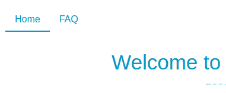

但当您转到 FAQ 页面时，主页和 FAQ 链接都会突出显示：


这是因为默认情况下，活动类匹配行为是包含的！这意味着如果路径为`/faq`或以`/faq/`开头，则`<router-link to="/faq">`将获得活动类。但也意味着如果当前路径以`/`开头，则`<router-link to="/">`将获得该类，这些都是可能的路径！这就是为什么我们的主页链接总是会得到这个类。

为了防止这种情况发生，有一个`exact`属性，它是一个布尔值。如果设置为`true`，则只有当前路径完全匹配时，链路才会获得活动类。

2.  将`exact`道具添加到主链接：

```js
      <router-link :to="{ name: 'home' }" exact>Home</router-link>
```

现在，只应突出显示 FAQ 链接：

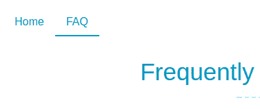

# 常见问题解答-使用 API

在本节中，我们将创建 FAQ 页面，该页面将从服务器获取数据。它将显示加载动画，然后显示问题和答案列表。

# 服务器设置

这是我们第一个与服务器通信的应用程序。您将获得一个具有随时可用的 API 的服务器。

您可以下载服务器文件（[https://github.com/Akryum/packt-vue-project-guide/tree/master/chapter5-download](https://github.com/Akryum/packt-vue-project-guide/tree/master/chapter5-download) ）。将它们解压缩到应用程序以外的其他文件夹中，并运行以下命令以安装依赖项并启动服务器：

```js
cd server_folder
npm install
npm start
```

您现在应该让服务器在端口 3000 上运行。当这一切完成后，我们可以继续建设我们的应用程序与真正的后端这一次！

# 使用 fetch

在`FAQ.vue`单文件组件中，我们将使用 web 浏览器的标准`fetch`API 从我们的服务器检索问题。该请求将是对`http://localhost:3000/questions`的一个非常简单的`GET`请求，没有身份验证。每个问题对象将有`title`和`content`字段：

1.  打开`FAQ.vue`并开始在组件脚本中添加`questions`数据属性，该属性将保存从服务器检索到的问题数组。我们还需要一个`error`属性，以便在网络请求过程中出现问题时显示消息：

```js
      <script>
      export default {
        data () {
          return {
            questions: [],
            error: null,
          }
        },
      }
      </script>
```

2.  现在我们可以通过`v-for`循环将问题和答案添加到模板中，并显示以下错误消息：

```js
      <template>
        <main class="faq">
          <h1>Frequently Asked Questions</h1>

          <div class="error" v-if="error">
            Can't load the questions
          </div>

          <section class="list">
            <article v-for="question of questions">
              <h2 v-html="question.title"></h2>
              <p v-html="question.content"></p>
            </article>
          </section>
        </main>
      </template>
```

我们准备好去拿了！fetchapi 是基于承诺的，并且使用非常简单。以下是`fetch`用法的一个示例：

```js
fetch(url).then(response => {
  if (response.ok) {
    // Returns a new promise
    return response.json()
  } else {
    return Promise.reject('error')
  }
}).then(result => {
  // Success
  console.log('JSON:', result)
}).catch(e => {
  // Failure
  console.error(e)
})
```

我们首先调用`fetch`，第一个参数是请求的 URL。它返回一个带有`response`对象的承诺，该对象保存有关请求结果的信息。如果成功，我们使用`response.json()`，它返回一个带有 JSON 解析结果对象的新承诺。

当路由匹配时，请求将在组件内部创建，这意味着您应该在组件定义中使用`created`生命周期挂钩：

```js
data () {
  // ...
},
created () {
  // fetch here
},
```

如果一切顺利，我们将使用 JSON 解析结果设置 questions 属性。否则我们将显示一条错误消息。

3.  首先使用正确的 URL 调用`fetch`：

```js
 created () {
        fetch('http://localhost:3000/questions')
      },
```

4.  使用`response`对象添加第一个`then`回调：

```js
      fetch('http://localhost:3000/questions').then(response => {
        if (response.ok) {
          return response.json()
        } else {
          return Promise.reject('error')
        }
      })
```

5.  我们需要另一个`then`回调，因为`response.json()`返回了一个新的承诺：

```js
        // ...
      }).then(result => {
        // Result is the JSON parsed object from the server
        this.questions = result
      })
```

6.  最后，我们捕获所有可能的错误以显示错误消息：

```js
        // ...
      }).catch(e => {
        this.error = e
      })
```

以下是我们`created`钩子的总结：

```js
created () {
  fetch('http://localhost:3000/questions').then(response => {
    if (response.ok) {
      return response.json()
    } else {
      return Promise.reject('error')
    }
  }).then(result => {
    this.questions = result
  }).catch(e => {
    this.error = e
  })
},
```

我们可以使用`async`和`await`JavaScript 关键字重写此代码，使其看起来像顺序代码：

```js
async created () {
  try {
    const response = await fetch('http://localhost:3000/questions')
    if (response.ok) {
      this.questions = await response.json()
    } else {
      throw new Error('error')
    }
  } catch (e) {
    this.error = e
  }
},
```

您现在可以尝试该页面，该页面将显示问题和答案的列表：

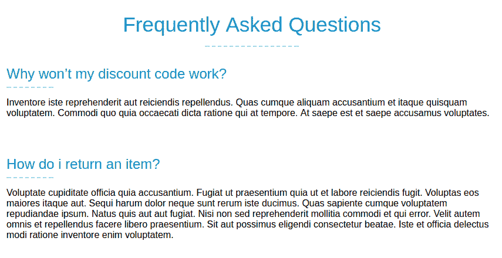

要查看我们的错误管理是否有效，您可以转到服务器正在运行的控制台并停止它（例如，使用 C*trl*+*C*键盘快捷键）。然后，您可以重新加载应用程序，并显示以下错误消息：


# 加载动画

还有最后一件事遗漏了——我们应该显示一个加载动画来通知用户操作正在进行，而不是一个空屏幕。为此，服务器在`/questions`请求上假装延迟了 1.5 秒，因此我们可以很容易地看到加载动画。

由于我们将在多个组件内显示加载动画，因此我们将创建一个新的全局组件：

1.  在`components`文件夹中，使用以下模板创建一个新的`Loading.vue`文件：

```js
      <template>
        <div class="loading">
          <div></div>
        </div>
      </template>
```

2.  在`main`文件夹中的`main.js`文件旁边创建一个新的`global-components.js`文件。在此文件中，我们将使用`Vue.component()`方法全局注册`Loading`组件：

```js
      import Vue from 'vue'
      import Loading from './components/Loading.vue'

      Vue.component('Loading', Loading)
```

This is the file where we will register all the global components used across all the application.

3.  然后在`main.js`文件中导入`global-components.js`模块：

```js
      import './global-components'
```

4.  回到我们的`FAQ.vue`组件，我们需要一个新的`loading`布尔数据属性来切换动画的显示：

```js
      data () {
        return {
          questions: [],
          error: null,
          loading: false,
        }
      },
```

5.  在模板中，添加加载动画：

```js
      <Loading v-if="loading" />
```

6.  最后，将`created`钩子稍微改变一下，开始时将`loading`设置为`true`，一切完成后将`false`设置为：

```js
      async created () {
        this.loading = true
        try {
          const response = await                             
       fetch('http://localhost:3000/questions')
          // ...
        } catch (e) {
          this.error = e
        }
        this.loading = false
      }
```

现在，您可以重新加载页面，并在问题出现之前短暂查看加载动画：

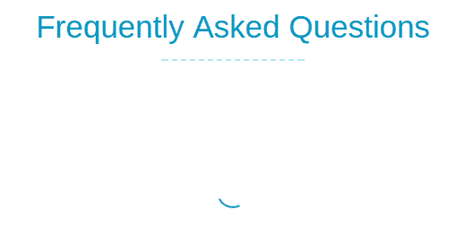

# 使用我们自己的插件扩展 Vue

由于我们将在应用程序中使用多个组件，并且我们希望尽可能地重用代码，因此最好在所有组件上都有一个方法，使用预定义的 URL 向服务器发出请求。

这是一个很好的自定义 Vue 插件用例！别担心，编写插件其实很简单。

# 创建插件

要创建插件，只有一条规则——插件应该是一个带有`install`方法的对象，该方法将 Vue 构造函数作为第一个参数，并带有一个可选的`options`参数。然后，此方法将通过修改构造函数向框架添加新功能：

1.  在`src`文件夹中新建一个`plugins`文件夹。
2.  在`plugins`文件夹中，创建一个`fetch.js`文件，我们将在其中编写插件。在这种情况下，我们的插件将在所有组件上添加一个新的`$fetch`特殊方法。我们将通过更改 Vue 的原型来实现这一点。
3.  让我们尝试创建一个非常简单的插件，通过使用`install`方法导出一个对象：

```js
      export default {
        install (Vue) {
          console.log('Installed!')
        }
      }
```

就这样！我们已经创建了一个 Vue 插件！现在，我们需要将其安装到我们的应用程序中。

4.  在`main.js`文件中，导入插件，然后调用`Vue.use()`方法，就像我们对`vue-router`所做的一样：

```js
      import VueFetch from './plugins/fetch'
      Vue.use(VueFetch)
```

您现在应该可以在浏览器控制台中看到[T0]消息。

# 插件选项

我们可以使用`options`参数配置插件：

1.  编辑`install`方法，在`Vue`之后增加此参数：

```js
      export default {
        install (Vue, options) {
          console.log('Installed!', options)
        },
      }
```

我们现在可以在`main.js`文件中的`Vue.use()`方法中添加一个配置对象。

2.  让我们在配置中添加一个`baseUrl`属性：

```js
      Vue.use(VueFetch, {
        baseUrl: 'http://localhost:3000/',
      })
```

您现在应该可以在浏览器控制台中看到[T0]对象。

3.  将`baseUrl`存储到变量中，以便以后使用：

```js
      let baseUrl

      export default {
        install (Vue, options) {
          console.log('Installed!', options)

          baseUrl = options.baseUrl
        },
      }
```

# 获取方法

现在，我们将编写`$fetch`方法。我们将使用 FAQ 组件的`created`钩子中使用的大部分代码：

1.  使用`fetch`执行`$fetch`方法：

```js
      export async function $fetch (url) {
        const response = await fetch(`${baseUrl}${url}`)
        if (response.ok) {
          const data = await response.json()
          return data
        } else {
          const error = new Error('error')
          throw error
        }
      }
```

我们导出它，这样我们也可以在普通 JavaScript 代码中使用它。`url`参数现在只是没有域的查询路径，它现在在`baseUrl`变量中——这允许我们轻松地更改它，而不必重构每个组件。我们还负责 JSON 解析，因为来自服务器的所有数据都将用 JSON 编码。

2.  要使其在所有组件中都可用，只需将其添加到`Vue`原型（用于创建组件的构造函数）中即可：

```js
      export default {
        install (Vue, options) {
          // Plugin options
          baseUrl = options.baseUrl

          Vue.prototype.$fetch = $fetch
        },
      }
```

3.  然后，重构 FAQ 组件，在创建的钩子中使用我们新的特殊`$fetch`方法：

```js
      this.loading = true
      try {
        this.questions = await this.$fetch('questions')
      } catch (e) {
        this.error = e
      }
      this.loading = false
```

我们在组件中的代码现在更短、更易于阅读，并且更具可伸缩性，因为我们可以轻松地更改基本 URL。

# 使用 mixin 重用代码

我们已经看到了如何创建插件，但还有另一种方法可以改进代码——如果我们可以跨多个组件重用组件定义，如计算属性、方法或观察者，该怎么办？这就是 mixin 的用途！

mixin 是可以应用于其他定义对象（包括其他 mixin）的组件定义对象。编写起来非常简单，因为它看起来与常规组件定义完全相同！

我们的目标是拥有一个`RemoteData`mixin，它允许任何组件向服务器发出请求以获取数据。让我们在`src`目录中添加一个新的`mixins`文件夹，并创建一个新的`RemoteData.js`文件：

1.  我们将从导出具有数据属性的定义开始：

```js
      export default {
        data () {
          return {
            remoteDataLoading: 0,
          }
        },
      }
```

This `remoteDataLoading` property will be used to count the number of requests that are currently loading, to help us display a loading animation.

2.  现在，要在我们的 FAQ 组件中使用此 mixin，我们需要导入它并将其添加到`mixins`数组中：

```js
      <script>
      import RemoteData from '../mixins/RemoteData'

      export default {
        mixins: [
          RemoteData,
        ],

        // ...
      }
      </script>
```

如果您检查组件，现在应该会看到显示的附加`remoteDataLoading`属性：


发生了什么事？mixin 被应用并合并到`FAQ.vue`的组件定义中，这意味着数据钩子被调用了两次——首先从 mixin 调用，然后从 FAQ 定义调用，并添加了一个新属性！

Vue will automatically merge the standard options such as hooks, data, computed, methods, and watch, but if you have, for example, a property of a method with the same name, the last one applied will override the previous ones.

3.  让我们尝试用另一个值覆盖组件中的新属性：

```js
      data () {
        return {
          questions: [],
          error: null,
          loading: false,
          remoteDataLoading: 42,
        }
      },
```

正如您在组件检查器中看到的，最终组件定义的优先级高于 mixin。另外，您可能已经注意到，`mixins`选项是一个数组，因此我们可以对定义应用多个 mixin，这些 mixin 将按顺序合并。例如，考虑我们有两个混合器，并希望将它们应用到组件定义中。以下是将会发生的情况：

您现在可以从 FAQ 组件定义中删除重复的`remoteDataLoading: 42,`。

Hooks such as `data`, `created`, `mounted`... are each called individually in the order they were applied to the final definition. This also means that the final component definition hooks will be called last.

# 获取远程数据

我们有一个问题——使用`RemoteData`mixin 的每个组件都有不同的数据属性要获取。因此，我们需要将参数传递给 mixin。既然 mixin 本质上是一个定义对象，为什么不使用一个可以获取参数然后返回定义对象的函数呢？这就是我们要做的！

1.  使用`resources`参数将我们在函数中定义的对象包装起来：

```js
 export default function (resources) {
        return {
          data () {
            return {
              remoteDataLoading: 0,
            }
          },
        }
      }
```

`resources`参数将是一个对象，每个键都是我们要添加的数据属性的名称，值是需要向服务器发出的请求的路径。

2.  因此，我们需要将`FAQ.vue`组件中 mixin 的使用方式更改为函数调用：

```js
      mixins: [
        RemoteData({
          questionList: 'questions',
        }),
      ],
```

在这里，我们将获取`http://localhost:3000/questions`URL（使用前面创建的特殊`$fetch`方法），并将结果放入`questionList`属性中。

现在进入我们的`RemoteData`混搭！

3.  首先，我们需要将每个数据属性初始化为一个`null`值，以便 Vue 可以对其进行设置：

```js
 data () {
        let initData = {
          remoteDataLoading: 0,
        }

        // Initialize data properties
        for (const key in resources) {
          initData[key] = null
        }

        return initData
      },
```

This step is important--if you don't initialize the data, it won't be made reactive by Vue, so the component will not be updated when the properties change.

您可以尝试该应用程序，并在组件检查器中看到一个新的`questionList`数据属性已添加到 FAQ 组件中：


4.  然后，我们将创建一个新的`fetchResource`方法，获取一个资源并更新相应的数据属性：

```js
 methods: {
        async fetchResource (key, url) {
          try {
            this.$data[key] = await this.$fetch(url)
          } catch (e) {
            console.error(e)
          }
        },
      },
```

我们的组件现在可以访问这个新方法，并可以直接使用它。

5.  为了使我们的 mixin 更智能，我们将自动在`created`钩子（将合并）中调用它：

```js
 created () {
        for (const key in resources) {
          let url = resources[key]
          this.fetchResource(key, url)
        }
      },
```

您现在可以验证`questionList`数据属性是否通过向服务器发出的新请求得到更新：

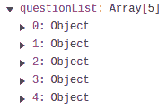

6.  然后，您可以删除`FAQ.vue`组件中具有`questions`属性的旧代码，并更改模板以使用新属性：

```js
      <article v-for="question of questionList">
```

# 装载管理

我们要做的下一件事是提供一种方法来知道是否应该显示加载动画。因为我们可能有多个请求，所以我们将使用一个数字计数器，而不是我们已经在`data`钩子中声明的布尔值--`remoteDataLoading`。每次发出请求时，我们递增计数器，完成后递减计数器。这意味着如果它等于零，则当前没有挂起的请求，如果它大于或等于 1，则应显示加载动画：

1.  在`fetchResource`方法中增加`remoteDataLoading`计数器的递增和递减两条语句：

```js
      async fetchResource (key, url) {
        this.$data.remoteDataLoading++
        try {
          this.$data[key] = await this.$fetch(url)
        } catch (e) {
          console.error(e)
        }
        this.$data.remoteDataLoading--
      },
```

2.  为了让我们在使用 mixin 时更轻松，让我们添加一个名为`remoteDataBusy`的计算属性，当我们需要显示加载动画时，该属性将为`true`：

```js
 computed: {
        remoteDataBusy () {
          return this.$data.remoteDataLoading !== 0
        },
      },
```

3.  回到我们的 FAQ 组件，我们现在可以删除`loading`属性，更改`Loading`组件的`v-if`表达式，并使用`remoteDataLoading`计算属性：

```js
      <Loading v-if="remoteDataBusy" />
```

您可以尝试刷新页面，以查看在检索数据之前显示的加载动画。

# 错误管理

最后，我们可以管理任何资源请求可能发生的错误：

1.  我们将每个资源的错误存储在一个新的`remoteErrors`对象中，该对象需要初始化：

```js
      // Initialize data properties
      initData.remoteErrors = {}
      for (const key in resources) {
        initData[key] = null
        initData.remoteErrors[key] = null
      }
```

`remoteErrors`对象的键将与资源相同，如果没有错误，值将为 error 或`null`。

接下来我们需要修改`fetchResource`方法：

*   在请求之前，通过将其设置为`null`重置错误
*   如果 catch 块中有错误，则将其放入右键的`remoteErrors`对象中

2.  `fetchResource`方法现在应该如下所示：

```js
      async fetchResource (key, url) {
        this.$data.remoteDataLoading++
        // Reset error
        this.$data.remoteErrors[key] = null
        try {
          this.$data[key] = await this.$fetch(url)
        } catch (e) {
          console.error(e)
          // Put error
          this.$data.remoteErrors[key] = e
        }
        this.$data.remoteDataLoading--
      },
```

现在，我们可以为每个资源显示特定的错误消息，但我们只需在此项目中显示一条通用错误消息。让我们添加另一个名为`hasRemoteErrors`的计算属性，如果至少有一个错误，它将返回 true。

3.  使用 JavaScript`Object.keys()`方法，我们可以迭代`remoteErrors`对象的键，并检查某些值是否不是`null`（这意味着它们是真实的）：

```js
      computed: {
        // ...

        hasRemoteErrors () {
          return Object.keys(this.$data.remoteErrors).some(
            key => this.$data.remoteErrors[key]
          )
        },
      },
```

4.  现在，我们可以通过将[T0]属性替换为新属性来再次更改 FAQ 组件模板：

```js
      <div class="error" v-if="hasRemoteErrors">
```

与之前一样，您可以关闭服务器以查看显示的错误消息。

我们现在已经完成了 FAQ 组件，其脚本现在应该如下所示：

```js
<script>
import RemoteData from '../mixins/RemoteData'

export default {
  mixins: [
    RemoteData({
      questionList: 'questions',
    }),
  ],
}
</script>
```

正如你所看到的，它现在非常简洁！

# 支持票

在最后一部分中，我们将为我们的应用程序创建一个经过身份验证的部分，用户可以在其中添加和查看支持票证。所有必要的请求都可以在您已经下载的服务器上获得，如果您想知道在`passport.js`节点中是如何完成的，您可以查看源代码！

# 用户身份验证

在第一部分中，我们将关注应用程序的用户系统。我们将拥有登录和注册组件，以便能够创建新用户。

# 以集中状态存储用户

我们将像在[第 3 章](3.html)、*项目 2*-*城堡决斗浏览器游戏*中一样，将用户数据存储在状态对象中，因此我们可以在应用程序的任何组件中访问它：

1.  在`main.js`旁边新建一个`state.js`文件，导出状态对象：

```js
      export default {
        user: null,
      }
```

当没有用户登录时，`user`属性将为空，否则它将包含用户数据。

2.  然后，在`main.js`文件中，导入状态：

```js
      import state from './state'
```

3.  然后，将其用作根实例的数据，以便 Vue 使其具有反应性：

```js
      new Vue({
        el: '#app',
        data: state,
        router,
        render: h => h(AppLayout),
      })
```

# 另一个插件

然后，我们可以在需要时将状态导入组件文件中，但在 Vue 原型上使用名为`$state`的特殊 getter 访问状态会更方便，就像我们在`fetch`插件中所做的那样。我们将把 state 对象传递给 pluginoptions，getter 将返回它。

1.  在`plugins`文件夹中，创建一个导出新插件的`state.js`文件：

```js
      export default {
        install (Vue, state) {
          Object.defineProperty(Vue.prototype, '$state', {
            get: () => state,
          })
        }
      }
```

在这里，我们使用 JavaScript`Object.defineProperty()`方法在 Vue 原型上设置一个 getter，因此每个组件都将继承它！

最后一件事——我们需要安装状态插件！

2.  在`main.js`文件中，导入新插件：

```js
      import VueState from './plugins/state'
```

3.  然后将状态对象作为选项参数安装：

```js
 Vue.use(VueState, state)
```

我们现在可以在我们的组件中使用`$state`来访问全球状态！以下是一个例子：

```js
console.log(this.$state)
```

这将输出具有[T0]属性的状态对象。

# 登录表单

在本节中，我们将首先创建新组件以帮助我们更快地构建表单，然后我们将使用`Login.vue`组件将注册和登录表单添加到应用程序中。在后面的部分中，我们将创建另一个表单来提交新的支持票证。

# 智能表格

这个通用组件将负责表单组件的一般结构，并将自动调用`operation`函数，显示加载动画和操作引发的最终错误消息。大多数情况下，操作都是向服务器发出的`POST`请求。

模板本质上是一个带有标题的表单，一个用于渲染输入的默认窗口，一个用于按钮的`actions`窗口，一个加载动画，以及一个用于错误消息的位置。这对于我们在应用程序中需要的两种形式来说已经足够通用了：

1.  在`components`文件夹中创建一个新的`SmartForm.vue`组件：

```js
      <template>
        <form @submit.prevent="submit">
          <section class="content">
            <h2>{{ title }}</h2>

            <!-- Main content -->
            <slot />

            <div class="actions">
              <!-- Action buttons -->
              <slot name="actions" />
            </div>

            <div class="error" v-if="error">{{ error }}</div>
          </section>

          <transition name="fade">
            <!-- Expanding over the form -->
            <Loading v-if="busy" class="overlay" />
          </transition>
        </form>
      </template>
```

On the `<form>` element, we set up an event listener on the `'submit'` event, which prevents the default behavior of the browser (reloading the page) with the `prevent` modifier.

目前，`SmartForm`组件将有三个支柱：

*   `title`：显示在`<h2>`元素中。
*   `operation`：表单提交时调用的异步函数。它应该回报一个承诺。
*   `valid`：一个布尔值，用于在表单无效时防止调用该操作。

2.  将它们添加到组件的`script`部分：

```js
      <script>
      export default {
        props: {
          title: {
            type: String,
            required: true,
          },
          operation: {
            type: Function,
            required: true,
          },
          valid: {
            type: Boolean,
            required: true,
          },
        },
      }
      </script>
```

如您所见，我们现在使用一种不同的方式声明道具——通过使用对象，我们可以指定道具的更多细节。例如，使用[T0]，如果我们忘记了道具，Vue 将警告我们。我们还可以放置一个 Vue 也将检查的类型。建议使用这种语法，因为它既有助于理解组件的特性，又有助于避免错误。

我们还需要两个数据属性：

*   `busy`：用于切换加载动画显示的布尔值
*   `error`：这是错误信息，如果没有，则为`null`

3.  用`data`挂钩将其添加：

```js
 data () {
        return {
          error: null,
          busy: false,
        }
      },
```

4.  最后，我们需要编写提交表单时调用的`submit`方法：

```js
 methods: {
        async submit () {
          if (this.valid && !this.busy) {
            this.error = null
            this.busy = true
            try {
              await this.operation()
            } catch (e) {
              this.error = e.message
            }
            this.busy = false
          }
        },
      },
```

如果表单无效或仍然忙，我们不会调用该操作。或者我们重置`error`属性，然后使用`await`关键字调用`operation`属性，因为它应该是一个返回承诺的异步函数。如果捕捉到错误，我们将消息设置为`error`属性，以便显示。

5.  现在我们的通用表单已经准备好，我们可以在`global-components.js`文件中注册它：

```js
      import SmartForm from './components/SmartForm.vue'
      Vue.component('SmartForm', SmartForm)
```

# 表单输入组件

在我们的表单中，我们将有许多具有相同标记和功能的输入。这是制作另一个通用和可重用组件的最佳时机。它将有一个小模板，主要是一个`<input>`元素，并能向用户显示它是无效的，带有红色边框：

1.  首先用以下道具创建一个新的`FormInput.vue`组件：
    *   `name`是输入的 HTML 名称，需要浏览器自动完成才能工作。
    *   `type`默认为`'text'`，但最终需要设置`'password'`。
    *   `value`是输入的当前值。
    *   `placeholder`是输入内显示的标签。
    *   `invalid`是一个布尔值，用于切换无效显示（红色边框）。默认为`false`。

使用 prop 对象表示法时，脚本应如下所示：

```js
<script>
export default {
  props: {
    name: {
      type: String,
    },
    type: {
      type: String,
      default: 'text',
    },
    value: {
      required: true,
    },
    placeholder: {
      type: String,
    },
    invalid: {
      type: Boolean,
      default: false,
    },
  },
}
</script>
```

2.  对于无效显示，我们将添加一个 computed 属性来动态更改输入的 CSS 类：

```js
 computed: {
        inputClass () {
          return {
            'invalid': this.invalid,
          }
        },
      },
```

3.  现在我们可以编写模板了。它将有一个包含`<input>`的`<div>`元素：

```js
      <template>
        <div class="row">
          <input
            class="input"
            :class="inputClass"
            :name="name"
            :type="type"
            :value.prop="value"
            :placeholder="placeholder"
          />
        </div>
      </template>
```

We use the `prop` modifier on the `v-bind:value` directive to tell Vue to set the DOM node `value` property directly instead of setting the HTML attribute. This is a good practise when dealing with properties such as `value` for input HTML elements.

4.  要开始测试，我们可以在`global-components.js`文件中注册组件：

```js
      import FormInput from './components/FormInput.vue'
      Vue.component('FormInput', FormInput)
```

5.  使用`FormInput`组件创建新的`Login.vue`组件：

```js
      <template>
        <main class="login">
          <h1>Please login to continue</h1>
          <form>
            <FormInput
              name="username"
              :value="username"
              placeholder="Username" />
          </form>
        </main>
      </template>

      <script>
      export default {
        data () {
          return {
            username: '',
          }
        },
      }
      </script>
```

6.  不要忘记`router.js`文件中对应的路由：

```js
      import Login from './components/Login.vue'

      const routes [
        // ...
        { path: '/login', name: 'login', component: Login },
      ]
```

您可以使用 URL 中的`/login`路径打开应用程序来测试组件：

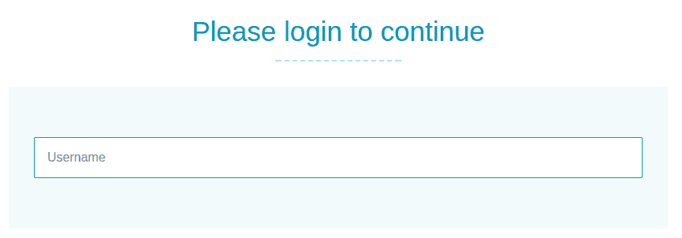

目前，`FormInput`组件是只读的，因为当用户在字段中键入内容时，我们不会执行任何操作。

7.  让我们添加一个方法来解决这个问题：

```js
 methods: {
        update (event) {
          console.log(event.currentTarget.value)
        },
      },
```

8.  然后我们可以收听文本字段上的`input`事件：

```js
 @input="update"
```

现在，如果您在文本字段中键入，则内容应打印到控制台。

9.  在`update`方法中，我们将发出一个事件，将新值发送到父组件。默认情况下，`v-model`指令监听`input`事件，新值为第一个参数：

```js
      methods: {
        update (event) {
          this.$emit('input', event.currentTarget.value)
        },
      },
```

为了理解事物是如何工作的，我们还不打算使用`v-model`。

10.  我们现在可以收听此`input`事件并更新`username`道具：

```js
      <FormInput
       name="username"
       :value="username"
       @input="val => username = val"
       placeholder="Username" />
```

`username`道具的值应在`Login`组件上更新：


11.  使用`v-model`指令，我们可以简化此代码：

```js
      <FormInput
       name="username"
       v-model="username"
       placeholder="Username" />
```

它将使用`value`道具，为我们收听`input`事件！

# 定制 v 型

默认情况下，`v-model`使用我们刚才看到的`value`道具和`input`事件，但我们可以定制：

1.  在`FormInput`组件中，添加`model`选项：

```js
 model: {
       prop: 'text',
       event: 'update',
      },
```

2.  然后我们需要将`value`道具的名称更改为`text`：

```js
      props: {
        // ...
        text: {
          required: true,
        },
      },
```

3.  在模板中：

```js
      <input
       ...
       :value="text"
       ... />
```

4.  加上`input`事件应重命名为`update`：

```js
      this.$emit('update', event.currentTarget.value)
```

组件应该仍然在`Login`组件中工作，因为我们告诉`v-model`使用`text`道具和`update`事件！

我们的输入组件现在准备好了！对于这个项目，我们保持了这个组件的简单性，但是如果您愿意，您可以向其中添加更多功能，例如图标、错误消息、浮动标签等等。

# 登录组件

我们现在可以继续构建`Login`组件，该组件将负责登录和注册用户。

此组件的状态需要几个数据属性：

*   `mode`：可以是`'login'`也可以是`'signup'`。我们将根据这一点改变布局。
*   `username`：两种模式都使用。
*   `password`：在两种模式中都有使用。
*   `password2`：用于注册时验证密码。
*   `email`：用于注册模式。

1.  我们的`data`钩子现在应该是这样的：

```js
 data () {
        return {
          mode: 'login',
          username: '',
          password: '',
          password2: '',
          email: '',
        }
      },
```

2.  然后，我们可以添加一个`title`计算属性，根据模式更改表单标题：

```js
 computed: {
        title () {
          switch (this.mode) {
            case 'login': return 'Login'
            case 'signup': return 'Create a new account'
          }
        },
      },
```

我们还将添加一些基本的输入验证。首先，当 retype`password`字段不等于第一个密码时，我们想突出显示它。

3.  让我们为其添加另一个计算属性：

```js
 retypePasswordError () {
        return this.password2 && this.password !== this.password2
      },
```

然后，我们还将检查所有字段是否为空，因为它们都是必需的。

4.  这一次，我们将把它分成两个计算属性，因为我们不想在`login`模式下检查特定于注册的字段：

```js
 signupValid () {
        return this.password2 && this.email &&             
        !this.retypePasswordError
      },
      valid () {
        return this.username && this.password &&
        (this.mode !== 'signup' || this.signupValid)
      },
```

5.  接下来，添加我们将用于`login`或`sign up`用户的方法（稍后我们将在*注册操作*和*登录操作*部分中实现）：

```js
 methods: {
        async operation() {
          await this[this.mode]()
        },
        async login () {
          // TODO
        },
        async signup () {
          // TODO
        },
      }
```

6.  现在我们可以进入模板。首先添加一个`SmartForm`组件：

```js
      <template>
        <main class="login">
          <h1>Please login to continue</h1>
          <SmartForm
            class="form"
            :title="title"
            :operation="operation"
            :valid="valid">
            <!-- TODO -->
          </SmartForm>
        </main>
      </template>
```

7.  然后我们可以添加`input`字段：

```js
      <FormInput
        name="username"
        v-model="username"
        placeholder="Username" />
      <FormInput
        name="password"
        type="password"
        v-model="password"
        placeholder="Password" />
      <template v-if="mode === 'signup'">
        <FormInput
          name="verify-password"
          type="password"
          v-model="password2"
          placeholder="Retype Password"
          :invalid="retypePasswordError" />
        <FormInput
          name="email"
          type="email"
          v-model="email"
          placeholder="Email" />
      </template>
```

Don't forget the name attributes--it will allow the browser to auto-complete the fields.

8.  在`input`字段下方，我们需要为每个模式设置两个不同的按钮。对于登录模式，我们需要一个`sign up`和`login`按钮。对于`sign up`模式，我们需要一个后退按钮和一个创建帐户按钮：

```js
      <template slot="actions">
        <template v-if="mode === 'login'">
          <button
            type="button"
            class="secondary"
            @click="mode = 'signup'">
            Sign up
          </button>
          <button
            type="submit"
            :disabled="!valid">
            Login
          </button>
        </template>
        <template v-else-if="mode === 'signup'">
          <button
            type="button"
            class="secondary"
            @click="mode = 'login'">
            Back to login
          </button>
          <button
            type="submit"
            :disabled="!valid">
            Create account
          </button>
        </template>
      </template>
```

现在您可以测试组件并在`login`和`sign up`模式之间切换：

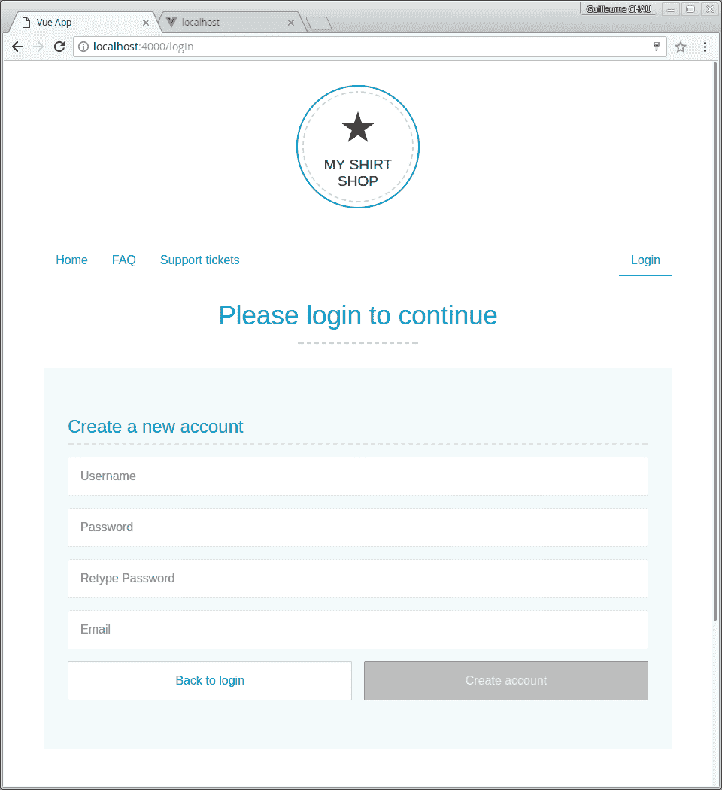

# 设置作用域元素的子元素的样式

表单当前占用了所有可用空间。最好把它缩小一点。

For this section to work, you need the latest `vue-loader` package installed in your project.

让我们添加一些样式以使窗体具有最大宽度：

```js
<style lang="stylus" scoped>
.form {
  >>> .content {
    max-width: 400px;
  }
}
</style>
```

`>>>`组合器允许我们以模板中使用的组件内的元素为目标，同时仍然限定`CSS`选择器的其余部分。在我们的示例中，生成的`CSS`如下所示：

```js
.form[data-v-0e596401] .content {
  max-width: 400px;
}
```

如果我们不使用这个组合器，我们会有这个`CSS`：

```js
.form .content[data-v-0e596401] {
  max-width: 400px;
}
```

因为`.content`元素在我们在模板中使用的`SmartForm`组件中，所以这不起作用。

If you are using SASS, you need to use the `/deep/` selector instead of the `>>>` combinator.

该表单现在应该如下所示：


# 改进我们的抓取插件

目前我们的`$fetch`方法只能向服务器发出`GET`请求。加载 FAQ 已经足够了，但现在我们需要添加更多功能：

1.  在`plugins/fetch.js`文件中，编辑函数的签名以接受新的`options`参数：

```js
      export async function $fetch (url, options) {
        // ...
      }
```

`options`参数是浏览器`fetch`方法的可选对象，允许我们更改不同的参数，如使用的 HTTP 方法、请求正文等。

2.  在`$fetch`函数的开头，我们想为这个`options`参数设置一些默认值：

```js
      const finalOptions = Object.assign({}, {
        headers: {
          'Content-Type': 'application/json',
        },
        credentials: 'include',
      }, options)
```

默认选项告诉服务器，我们将始终在请求正文中发送 JSON，并告诉浏览器，如果用户登录，我们还将包括验证用户身份所需的授权令牌。然后，提供的`options`参数（如果有）将其值添加到`finalOptions`对象（例如，`method`属性或`body`属性）。

3.  接下来，我们将新选项添加到`fetch`浏览器方法中：

```js
      const response = await fetch(`${baseUrl}${url}`, finalOptions)
```

4.  此外，服务器将始终以文本形式发送错误，因此我们可以捕获错误并将其显示给用户：

```js
      if (response.ok) {
        const data = await response.json()
        return data
      } else {
        const message = await response.text()
 const error = new Error(message)
 error.response = response
        throw error
      }
```

我们现在准备向服务器发出第一个`POST`请求，以便为用户创建一个新帐户，然后让他登录！

# 注册操作

我们将从帐户创建开始，因为我们还没有任何用户。在服务器上调用的路径是`/signup`，它需要一个`POST`请求，请求正文中包含一个 JSON 对象，其中包含新帐户的用户名、密码和电子邮件：

让我们使用我们刚刚改进的`$fetch`方法来实现这一点：

```js
async signup () {
  await this.$fetch('signup', {
    method: 'POST',
    body: JSON.stringify({
      username: this.username,
      password: this.password,
      email: this.email,
    }),
  })
  this.mode = 'login'
},
```

We don't manage errors here, as it's the job of the `SmartForm` component we built earlier.

就这样！你现在可以用一个简单的`password`创建一个新帐户，以后你必须记住。如果账户创建成功，表单返回`login`模式。

One thing we don't do here, but that could be improved, is to let the user know their account has been created and that they can now log in. You could add a message below the form, or even make a floating notification appear!

# 登录操作

登录方法将与注册几乎相同。区别在于：

*   我们只将请求体中的`username`和`password`发送到`/login`路径
*   响应是我们需要设置为全局状态的用户对象，这样每个组件都可以知道是否有连接的用户（使用我们公开[T0]属性的插件）
*   然后我们重定向到主页

现在应该是这样的：

```js
async login () {
  this.$state.user = await this.$fetch('login', {
    method: 'POST',
    body: JSON.stringify({
      username: this.username,
      password: this.password,
    }),
  })
  this.$router.push({ name: 'home' })
},
```

您现在可以尝试使用之前创建帐户时使用的`username`和`password`登录。如果登录成功，您应该通过`router.push()`方法重定向到主页。

此请求返回的`user`对象包含将在导航菜单中显示的`username`字段。

# 用户菜单

现在是时候将用户相关功能添加到我们在`NavMenu.vue`文件开头制作的导航菜单中了：

1.  我们希望它们出现在菜单的最右侧，因此我们将在我们已经编写的路由器链接之后添加此元素：

```js
      <div class="spacer"></div>
```

这将简单地增长到使用 CSS flexbox 属性占用菜单中的所有可用空间，这样我们放在后面的任何内容都将被推到右边。

由于我们在前面的*部分中制作了插件，将用户存储在一个集中式状态*部分中，我们可以使用`$state`属性访问全局状态。它包含`user`对象，允许我们知道用户是否登录，并显示他们的`username`和`logout`链接。

2.  在`NavMenu.vue`组件中添加用户菜单：

```js
      <template v-if="$state.user">
        <a>{{ $state.user.username }}</a>
        <a @click="logout">Logout</a>
      </template>
```

3.  如果用户未连接，我们只会显示一个`login`链接（将此链接添加到我们刚刚添加的`template`下方）：

```js
      <router-link v-else :to="{name: 'login'}">Login</router-link>
```

`logout`链接需要我们现在创建的新`logout`方法。

# 注销方法

注销方法包括对服务器上的`/logout`路径的简单调用，该路径应返回一个`status`属性等于`'ok'`的对象：

```js
<script>
export default {
  methods: {
    async logout () {
      const result = await this.$fetch('logout')
      if (result.status === 'ok') {
        this.$state.user = null
      }
    },
  },
}
</script>
```

如果用户成功注销，我们在全局状态下重置`user`值。

# 带导航警卫的私人路线

现在我们已经准备好了身份验证系统，我们可以有不同类型的路由：

*   公共路线总是可以到达的
*   专用路由仅限于登录的用户
*   来宾路由仅可供尚未连接的用户访问

我们将提前创建一个 routes 组件来测试我们的代码：

1.  让我们创建`TicketsLayout.vue`组件，稍后我们将使用该组件来显示用户支持票证：

```js
      <template>
        <main class="tickets-layout">
          <h1>Your Support tickets</h1>
          <!-- TODO -->
        </main>
      </template>
```

2.  然后在`router.js`文件中添加相应的路由：

```js
      import TicketsLayout from './components/TicketsLayout.vue'

      const routes = [
        // ...
        { path: '/tickets', name: 'tickets',
 component: TicketsLayout },
      ]
```

3.  最后，在导航菜单中添加指向此新页面的链接：

```js
      <router-link :to="{ name: 'tickets' }">
        Support tickets</router-link>
```

# 路由元属性

我们可以在`router.js`文件中受影响路由的`meta`对象中添加页面访问类型信息。

我们刚刚创建的路由应该是私有的，并且只能由连接的用户访问：

*   将`private`属性添加到路由上的`meta`对象：

```js
      { path: '/tickets', /* ... */, meta: { private: true } },
```

现在，如果您转到 tickets 页面并检查任何组件，您应该会看到由`vue-router`插件公开的`$route`对象。它包含`meta`对象中的`private`属性：

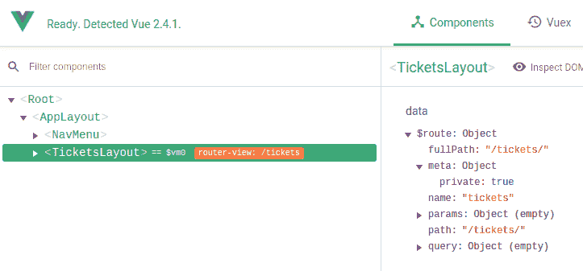

You can put any additional information in the `meta` object of a route to extend the router capabilities.

# 路由器导航卫士

既然我们知道 tickets 路由是私有的，我们希望在解析路由之前执行一些逻辑，以检查用户是否已连接。这就是导航保护派上用场的地方——当路由发生问题时，会调用函数挂钩，它们可以改变路由器的行为。

我们需要的导航卫士是`beforeEach`，它在每次解决路线之前都会运行。它允许我们在必要时用另一条路线替换目标路线。它接受带有三个参数的回调：

*   `to`该路线目前是否为目标路线
*   `from`是上一条路线吗
*   `next`是一个我们必须在某个时刻调用的函数，以便继续进行解析

If you forget to call `next` in your navigation guard, your app will be stuck. This is because you can do asynchronous operations before calling it, so the router doesn't make any assumption on its own.

1.  导出路由器实例前，添加`beforeEach`导航卫士：

```js
      router.beforeEach((to, from, next) => {
        // TODO
        console.log('to', to.name)
        next()
      })
```

2.  现在，我们需要确定目标路由是否为专用路由：

```js
      if (to.meta.private) {
        // TODO Redirect to login
      }
```

3.  要检查用户是否已连接，我们需要全局状态——您可以在文件开头导入它：

```js
      import state from './state'
```

4.  将条件更改为同时检查用户状态：

```js
      if (to.meta.private && !state.user) {
        // TODO Redirect to login
      }
```

可以使用 route 参数调用下一个函数，以将导航重定向到另一个路由。

5.  所以在这里，我们可以重定向到登录路径，就像我们使用`router.push()`方法一样：

```js
      if (to.meta.private && !state.user) {
        next({ name: 'login' })
 return
      }
```

Don't forget to return, or you will call `next` a second time at the end of the function!

我们现在可以尝试注销并单击支持票证链接。您应该立即重定向到登录页面。

When redirecting with `next`, no additional entry is added to the browser history for each redirection. Only the final route has a history entry.

正如您在浏览器控制台中所看到的，每次尝试解析路线时都会调用导航卫士：


这就解释了为什么该函数被称为`next`——解析过程将继续，直到我们不重定向到另一个路由为止。

This means the navigation guard can be called multiple times, but this also means you should be careful of not creating an infinite "loop" of resolutions!

# 重定向到想要的路线

用户登录后，应用程序应将其重定向到他们最初想要浏览的页面：

1.  将当前想要的 URL 作为参数传递给登录路由：

```js
      next({
        name: 'login',
        params: {
          wantedRoute: to.fullPath,
        },
      })
```

现在，如果您单击 support tickets 链接并重定向到登录页面，您应该会在任何组件的`$route`对象中看到`wantedRoute`参数：


2.  在`Login`组件中，我们可以更改`login`方法中的重定向，并使用此参数：

```js
      this.$router.replace(this.$route.params.wantedRoute ||
        { name: 'home' })
```

The `router.replace()` method is very similar to the `router.push()` method, the difference being it replaces the current entry in the browser history with the new route instead of adding a new entry.

现在，如果您登录，您应该被重定向到支持票证页面，而不是主页。

# 初始化用户身份验证

当页面加载和应用程序启动时，我们需要检查用户是否已经连接。因此，服务器有一个`/user`路径，如果用户登录，该路径将返回用户对象。我们将把它置于全局状态，就像我们登录一样。然后，我们将启动 Vue 应用程序：

1.  在`main.js`文件中，从我们的插件导入`$fetch`：

```js
      import VueFetch, { $fetch } from './plugins/fetch'
```

2.  然后我们需要创建一个名为`main`的新异步函数，在其中我们将请求用户数据，然后启动应用程序：

```js
      async function main () {
        // Get user info
        try {
          state.user = await $fetch('user')
        } catch (e) {
          console.warn(e)
        }
        // Launch app
        new Vue({
          el: '#app',
          data: state,
          router,
          render: h => h(AppLayout),
        })
      }

      main()
```

现在，如果您登录并刷新页面，您仍应保持连接！

# 客人路线

还有一种情况我们还没有处理——我们不希望已经连接的用户访问登录路径！

1.  这就是我们将其标记为客人路线的原因：

```js
      { path: '/login', name: 'login', component: Login,
        meta: { guest: true } },
```

2.  在`beforeEach`导航卫士内，我们将检查路线是否仅限访客，用户是否已连接，然后重定向到主页：

```js
      router.beforeEach((to, from, next) => {
        // ...
        if (to.meta.guest && state.user) {
          next({ name: 'home' })
          return
        }
        next()
      })
```

如果您已登录，您可以尝试转到登录 URL——您应该立即重定向到主页！您只有在未登录的情况下才能访问此页面。

# 显示和添加票证

在本节中，我们将向应用程序添加票证支持内容。首先，我们将显示它们，然后构建一个表单，让用户创建新的表单。我们将有两个组件，嵌套在前面制作的`TicketsLayout`组件中。

别担心！创建帐户时，会自动为用户创建一个示例支持票证。

# 门票单

可在服务器上的`/tickets`请求票证：

1.  创建一个新的`Tickets.vue`组件，该组件与 FAQ 组件非常相似。
2.  使用`RemoteData`mixin 取票：

```js
      <script>
      import RemoteData from '../mixins/RemoteData'

      export default {
        mixins: [
          RemoteData({
            tickets: 'tickets',
          }),
        ],
      }
      </script>
```

3.  然后添加带有加载动画、空消息和票证列表的模板：

```js
      <template>
        <div class="tickets">
          <Loading v-if="remoteDataBusy"/>

          <div class="empty" v-else-if="tickets.length === 0">
            You don't have any ticket yet.
          </div>

          <section v-else class="tickets-list">
            <div v-for="ticket of tickets" class="ticket-item">
              <span>{{ ticket.title }}</span>
              <span class="badge">{{ ticket.status }}</span>
              <span class="date">{{ ticket.date }}</span>
            </div>
          </section>
        </div>
      </template>
```

我们需要一个过滤器来显示票据日期！

4.  使用以下命令终止客户端编译并安装`momentjs`：

```js
 npm install --save moment
```

5.  在`main.js`文件旁边创建一个新的`filters.js`文件，并使用`date`过滤器：

```js
      import moment from 'moment'

      export function date (value) {
        return moment(value).format('L')
      }
```

6.  然后在`main.js`中导入`filters`并将其注册到一个方便的循环中：

```js
      import * as filters from './filters'

      for (const key in filters) {
        Vue.filter(key, filters[key])
      }
```

7.  我们现在可以在`Tickets`组件中以更人性化的方式显示日期：

```js
      <span class="date">{{ ticket.date | date }}</span>
```

然后，您可以将此新组件添加到`TicketsLayout`组件中，并获取票证列表：


别忘了导入`Tickets`并将其设置在`components`选项中！

# 会话到期

一段时间后，用户会话可能不再有效。这可能是因为超时过期（对于此服务器，此设置为三小时），或者只是因为服务器已重新启动。让我们尝试重现这种情况——我们将重新启动服务器并再次尝试加载票据：

1.  确保您已登录到应用程序。
2.  输入`rs`，然后在服务器运行的终端中按`Return`重新启动服务器。
3.  单击应用程序中的主页按钮。
4.  单击支持票证按钮返回票证列表页面。

控制台中应该有一个卡住的加载动画和一条错误消息：

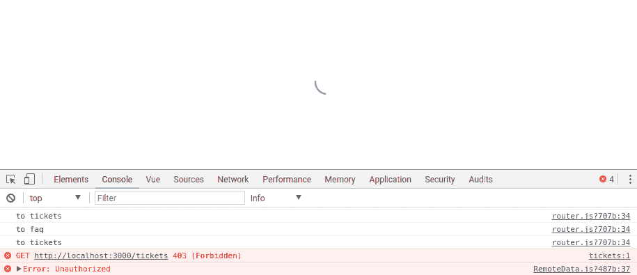

服务器返回了一个未经授权的错误——这是因为我们不再登录！

要解决这个问题，我们需要注销用户并将其重定向到登录页面（如果我们在专用路由中）。

放置代码的最佳位置是我们所有组件中使用的`$fetch`方法，位于`plugins/fetch.js`文件中。尝试访问限制为连接用户的路径时，服务器将始终返回 403 错误。

1.  在修改方法之前，我们需要导入状态和路由器：

```js
      import state from '../state'
      import router from '../router'
```

2.  让我们在响应处理中添加一个新案例：

```js
      if (response.ok) {
        // ...
      } else if (response.status === 403) {
        // If the session is no longer valid
        // We logout
        state.user = null

        // If the route is private
        // We go to the login screen
        if (router.currentRoute.matched.some(r => r.meta.private)) {
          router.replace({ name: 'login', params: {
            wantedRoute: router.currentRoute.fullPath,
          }})
        }
      } else {
        // ...
      }
```

We use the `replace` method instead of `push` because we don't want to create a new navigation in the browser history. Imagine if the user clicks the back button, it will redirect again to the login page and the user will not be able to go back to the page before the private one.

您现在可以再试一次——当您重新启动服务器并单击 support tickets 链接时，您应该被重定向到登录页面，并且导航菜单不应该再显示您的用户名。

# 嵌套路由

由于我们还希望切换到此页面中的表单，因此最好使用嵌套路由构造组件——如果每个路由至少有一个路由器视图，则每个路由都可以有子路由！所以在`/tickets`路由器下，我们现在将有两个孩子：

*   `''`将是票证列表（完整路径将是`/tickets/`。其作用类似于`/tickets`下的默认路由。
*   `'/new'`将是发送新票的表单（完整路径为`/tickets/new/`。

1.  使用临时模板创建新的`NewTicket.vue`组件：

```js
      <template>
        <div class="new-ticket">
          <h1>New ticket</h1>
        </div>
      </template>
```

2.  在`routes.js`文件中，将`/tickets`路由下的两条新路由添加到子属性中：

```js
      import Tickets from './components/Tickets.vue'
      import NewTicket from './components/NewTicket.vue'

      const routes = [
        // ...
        { path: '/tickets', component: TicketsLayout,
          meta: { private: true }, children: [
          { path: '', name: 'tickets', component: Tickets },
          { path: 'new', name: 'new-ticket', component: NewTicket },
        ] },
      ]
```

Since the first child route is an empty string, it will be the default when the parent route is resolved. This means you should move the name of the route (`'tickets'`) from the parent to it.

3.  最后，我们可以将`TicketsLayout`组件更改为使用路由器视图以及几个按钮在子路由之间切换：

```js
      <template>
        <main class="tickets-layout">
          <h1>Your Support tickets</h1>

          <div class="actions">
            <router-link
              v-if="$route.name !== 'tickets'"
              tag="button"
              class="secondary"
              :to="{name: 'tickets'}">
              See all tickets
            </router-link>
            <router-link
              v-if="$route.name !== 'new-ticket'"
              tag="button"
              :to="{name: 'new-ticket'}">
              New ticket
            </router-link>
          </div>

          <router-view />
        </main>
      </template>
```

You can use the `tag` prop on router links to change the HTML tag used to render it.

如您所见，我们根据当前路线名称隐藏每个按钮——我们不希望在已在“票证”页面上时显示“显示票证”按钮，也不希望在已在相应表单上时显示“新票证”按钮！

现在，您可以在两个子路由之间切换，并查看相应的 URL 更改：

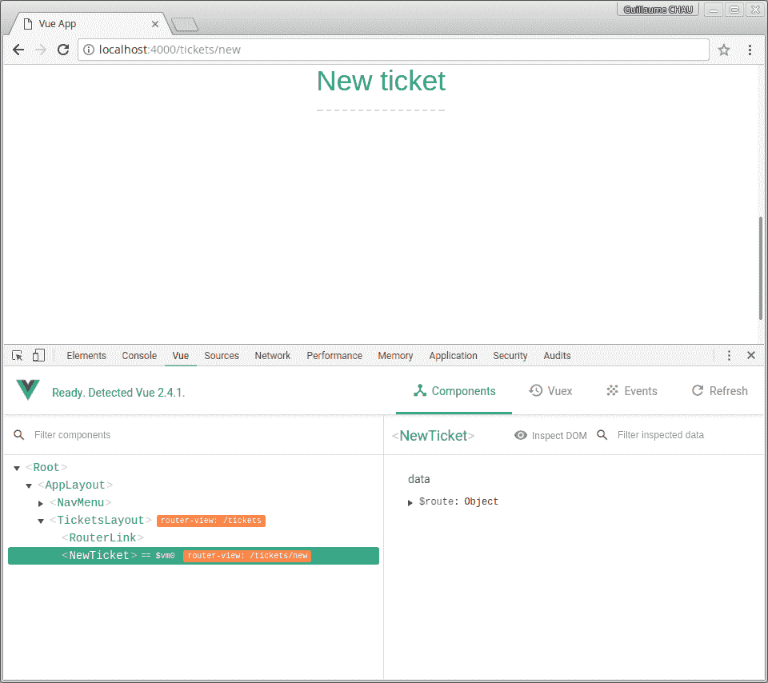

# 修理我们的导航装置

如果您注销然后转到“票证”页面，您应该会惊讶于能够访问该页面！这是因为我们的`beforeEach`导航保护的实现中存在一个缺陷——我们设计得很糟糕，没有考虑到我们可能有嵌套的路线这一事实！出现这个问题的原因是`to`参数只是目标路由，它是`/tickets`路由的第一个子路由——它没有`private`元属性！

因此，我们应该检查所有匹配的嵌套路由对象，而不是仅仅依赖于目标路由。谢天谢地，每个 route 对象都允许我们访问这些具有[T0]属性的 route 对象的列表。然后，我们可以使用`some`数组方法来验证是否至少有一个路由对象具有所需的元属性。

我们可以在`router.js`文件的`beforeEach`导航栏中将条件代码更改为：

```js
router.beforeEach((to, from, next) => {
  if (to.matched.some(r => r.meta.private) && !state.user) {
    // ...
  }
  if (to.matched.some(r => r.meta.guest) && state.user) {
    // ...
  }
  next()
})
```

现在，不管嵌套路由的数量如何，我们的代码都可以工作！

It is strongly recommended to use this approach with the `matched` property every time to avoid errors.

# 发送表格

在本节中，我们将完成`NewTicket`组件，该组件将允许用户发送新的支持票证。我们需要两个字段来创建新的票证--`title`和`description`：

1.  在`NewTicket.vue`组件的模板中，我们已经可以添加一个标题为`InputForm`组件的`SmartForm`组件：

```js
      <SmartForm
       title="New ticket"      
       :operation="operation"
       :valid="valid">
        <FormInput
          name="title"
          v-model="title"
          placeholder="Short description (max 100 chars)"
          maxlength="100"
          required/>
      </SmartForm>
```

2.  我们还可以添加两个数据属性，`operation`方法和一些具有`valid`计算属性的输入验证：

```js
      <script>
      export default {
        data () {
          return {
            title: '',
            description: '',
          }
        },

        computed: {
          valid () {
            return !!this.title && !!this.description
          },
        },

        methods: {
          async operation () {
            // TODO
          },
        },
      }
      </script>
```

# 文本区

对于`description`字段，我们需要一个`<textarea>`元素，以便用户可以编写多行文本。不幸的是，我们的`FormInput`组件还不支持这一点，所以我们需要对其进行一些修改。我们将使用值为`'textarea'`的组件的`type`道具将`<input>`元素更改为`<textarea>`元素：

1.  让我们创建一个新的 computed 属性来确定要呈现哪种类型的 HTML 元素：

```js
      computed: {
        // ...
        element () {
          return this.type === 'textarea' ? this.type : 'input'
        },
      },
```

所以当传递值`'textarea'`时，我们需要呈现一个`<textarea>`。所有其他类型将使组件呈现一个`<input>`元素。

我们现在可以使用特殊的`<component>`组件，它可以使用`is`道具渲染任一元素，而不是静态`<input>`元素。

2.  模板中的行现在应如下所示：

```js
      <component
        :is="element"
        class="input"
        :class="inputClass"
        :name="name"
        :type="type"
        :value.prop="text"
        @input="update"
        :placeholder="placeholder"
      />
```

3.  我们现在可以在`title`输入之后将`description`文本区域添加到`NewTicket`表单中：

```js
      <FormInput
        type="textarea"
        name="description"
        v-model="description"
        placeholder="Describe your problem in details"/>
```

# 绑定属性

在其他元素中，`<textarea>`有一些我们想要使用的方便属性，比如`rows`属性。我们可以为它们中的每一个创建一个道具，但这很快就会变得单调乏味。取而代之的是，我们将使用 Vue 组件方便的`$attrs`特殊属性，它将组件上设置的所有非 prop 属性作为一个对象，键是属性的名称。

这意味着，如果你在你的组件上有一个`text`道具，并且你在另一个组件上写下这个道具：

```js
<FormInput :text="username" required>
```

Vue 将把`required`视为属性，因为它不在`FormInput`组件公开的道具列表中。然后您可以通过`$attrs.required`访问它！

[T0]指令可以获取一个对象，其中键是要设置的道具和属性的名称。这将是非常有用的！

1.  我们可以在`FormInput.vue`部分的`<component>`上写下：

```js
      <component
        ...
        v-bind="$attrs" />
```

2.  现在您可以在`NewTicket.vue`组件中的`description`输入上添加`rows`属性：

```js
      <FormInput
        ...
        rows="4"/>
```

您应该在呈现的 HTML 中看到，`FormInput`组件中的`<textarea>`元素上设置了属性：

```js
<textarea data-v-ae2eb904="" type="textarea" placeholder="Describe your problem in details" rows="4" class="input"></textarea>
```

# 用户操作

现在，我们将在表单中实现用户能够执行的几个操作：

1.  在`SmarForm`组件中，在输入后添加以下两个按钮：

```js
      <template slot="actions">
        <router-link
          tag="button"
          :to="{name: 'tickets'}"
          class="secondary">
          Go back
        </router-link>
        <button
          type="submit"
          :disabled="!valid">
          Send ticket
        </button>
      </template>
```

2.  然后实现`operation`方法，这将类似于我们在`Login`组件中所做的。我们需要发送`POST`请求的服务器路径为`/tickets/new`：

```js
      async operation () {
        const result = await this.$fetch('tickets/new', {
          method: 'POST',
          body: JSON.stringify({
            title: this.title,
            description: this.description,
          }),
        })
        this.title = this.description = ''
      },
```

您现在可以创建新的票证了！

# 备份用户输入

为了改善用户体验，我们应该自动备份用户在表单中键入的内容，以防出现错误——例如，浏览器可能崩溃或用户可能意外刷新页面。

我们将编写一个 mixin，它将自动将一些数据属性保存到浏览器本地存储中，并在创建组件时恢复这些属性：

1.  在`mixins`文件夹中创建一个新的`PersistantData.js`文件。
2.  与我们所做的其他 mixin 一样，它将有一些参数，因此我们需要将其导出为函数：

```js
      export default function (id, fields) {
        // TODO
      }
```

`id`参数是存储此特定组件数据的唯一标识符。

首先，我们将观察在 mixin 中通过的所有字段。

3.  为此，我们将动态创建`watch`对象，每个键是字段，值是将值保存到本地存储器中的处理函数：

```js
      return {
        watch: fields.reduce((obj, field) => {
          // Watch handler
          obj[field] = function (val) {
            localStorage.setItem(`${id}.${field}`, JSON.stringify(val))
          }
          return obj
        }, {}),
      }
```

4.  返回到`NewTicket`组件并添加混合物：

```js
      import PersistantData from '../mixins/PersistantData'

      export default {
        mixins: [
          PersistantData('NewTicket', [
            'title',
            'description',
          ]),
        ],

       // ...
      }
```

因此，mixin 将观察者添加到组件中，`reduce`产生了如下等价物：

```js
{
  watch: {
    title: function (val) {
      let field = 'title'
      localStorage.setItem(`${id}.${field}`, JSON.stringify(val))
    },
    description: function (val) {
      let field = 'description'
      localStorage.setItem(`${id}.${field}`, JSON.stringify(val))
    },
  },
}
```

We are saving the property values as JSON since the local storage only supports strings.

您可以尝试在字段中键入，然后查看浏览器开发工具以查看是否已保存两个新的本地存储项：

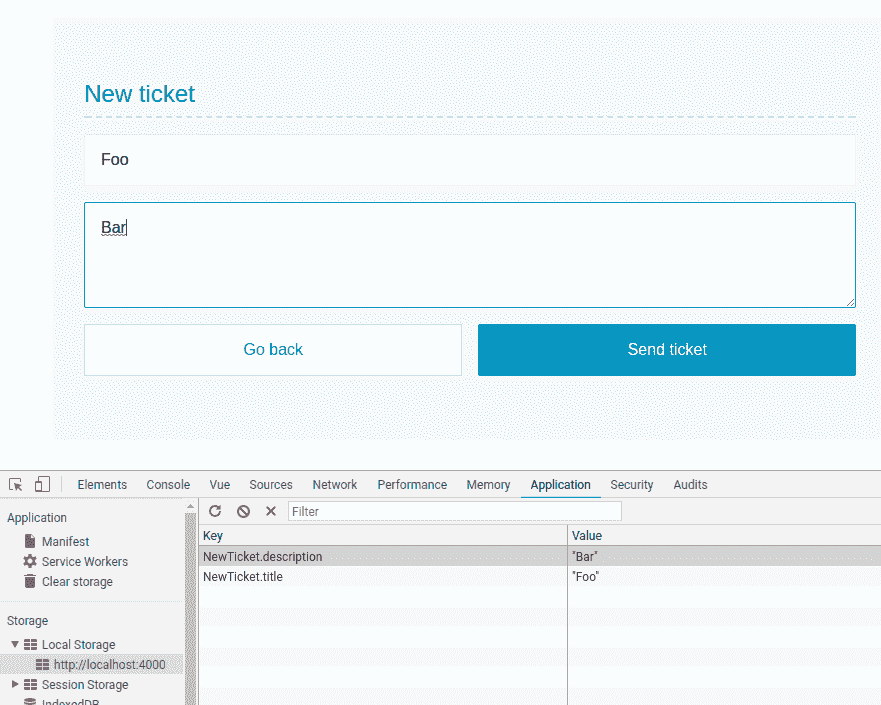

5.  在 mixin 中，我们还可以在组件被销毁时保存字段：

```js
 methods: {
        saveAllPersistantData () {
          for (const field of fields) {
            localStorage.setItem(`${id}.${field}`,             
            JSON.stringify(this.$data[field]))
          }
        },
      },
      beforeDestroy () {
        this.saveAllPersistantData()
      },
```

6.  最后，我们需要在创建组件时恢复值：

```js
 created () {
        for (const field of fields) {
          const savedValue = localStorage.getItem(`${id}.${field}`)
          if (savedValue !== null) {
            this.$data[field] = JSON.parse(savedValue)
          }
        }
      },
```

现在，如果您在表单中键入一些内容，然后刷新页面，那么您键入的内容应该仍在表单中！

With the session expiration management we added to `$fetch`, you will be redirected to the login page if you try to send your new ticket while you are no longer connected. Then, once you're logged in again, you should be right back to the form with what you typed still there!

# 高级路由功能

这是本章的最后一节，我们将在其中进一步探讨路由！

# 带参数的动态路由

我们将在应用程序中添加的最后一个组件是`Ticket`，它通过 ID 显示一张票的详细视图。它将显示用户输入的标题和说明，以及日期和状态。

1.  创建一个新的`Ticket.vue`文件，并使用通常的加载动画和`not found`通知添加此模板：

```js
      <template>
        <div class="ticket">
          <h2>Ticket</h2>

          <Loading v-if="remoteDataBusy"/>

          <div class="empty" v-else-if="!ticket">
            Ticket not found.
          </div>

          <template v-else>
            <!-- General info -->
            <section class="infos">
              <div class="info">
                Created on <strong>{{ ticket.date | date }}</strong>
              </div>
              <div class="info">
                Author <strong>{{ ticket.user.username }}</strong>
              </div>
              <div class="info">
                Status <span class="badge">{{ ticket.status }}</span>
              </div>
            </section>
            <!-- Content -->
            <section class="content">
              <h3>{{ ticket.title }}</h3>
              <p>{{ ticket.description }}</p>
            </section>
          </template>
        </div>
      </template>
```

2.  然后向组件添加一个`id`道具：

```js
      <script>
      export default {
        props: {
          id: {
            type: String,
            required: true,
          },
        },
      }
      </script>
```

# 动态远程数据

`id`道具将是我们将获取详细信息的车票的 ID。服务器以`/ticket/<id>`的形式提供动态路由，`<id>`为票证 ID。

能够使用我们的`RemoteData`mixin 会很好，但它目前缺乏对动态路径的支持！我们可以做的是传递一个函数，而不是一个普通字符串作为 mixin 参数的值：

1.  在`RemoteData`mixin 中，我们只需要修改处理`created`hook 中参数的方式。如果该值是函数，我们将使用`$watch`方法查看其值，而不是直接调用`fetchResource`方法：

```js
      created () {
        for (const key in resources) {
          let url = resources[key]
          // If the value is a function
          // We watch its result
          if (typeof url === 'function') {
            this.$watch(url, (val) => {
              this.fetchResource(key, val)
            }, {
              immediate: true,
            })
          } else {
            this.fetchResource(key, url)
          }
        }
      },
```

Don't forget the `immediate: true` option for the watcher since we want to call `fetchResource` a first time before watching the value.

2.  在`Ticket`组件中，我们现在可以使用此 mixin 加载票据的数据，具体取决于`id`属性：

```js
      import RemoteData from '../mixins/RemoteData'

      export default {
        mixins: [
          RemoteData({
            ticket () {
              return `ticket/${this.id}`
            },
          }),
        ],
        // ...
      }
```

让我们在`Tickets`组件中试试这个。

3.  使用新的`id`数据属性向其添加新的`Ticket`组件：

```js
      import Ticket from './Ticket.vue'

      export default {
        //...
        components: {
          Ticket,
        },
        data () {
          return {
            id: null,
          }
        },
      }
```

4.  然后在模板中添加一个`Ticket`组件：

```js
      <Ticket v-if="id" :id="id"/>
```

5.  在票证列表中，将标题更改为在`click`上设置`id`数据属性的链接：

```js
      <a @click="id = ticket._id">{{ ticket.title }}</a>
```

如果您在应用程序中单击票证，则应在以下列表中显示详细信息：


# 动态路径

由于我们将在另一个路由中放置票证详细信息，您可以撤消我们刚才在`Tickets`组件中所做的操作。

该路线将是票证路线的子路线，其形式为`/tickets/<id>`，其中`<id>`是所显示票证的 ID。这得益于 vue 路由器的动态路由匹配功能！

可以使用分号将动态管段添加到管线路径中。然后，每个段将暴露在路由`params`对象中。以下是一些带有参数的路线示例：

| 图案 | 示例路径 | `$route.params`值 |
| `/tickets/:id` | `/tickets/abc` | `{ id: 'abc' }` |
| `/tickets/:id/comments/:comId` | `/tickets/abc/comments/42` | `{ id: 'abc', comId: '42' }` |

1.  让我们在`router.js`文件中添加新路由作为`/tickets`的子路由：

```js
      import Ticket from './components/Ticket.vue'

      const routes = [
        // ...
        { path: '/tickets', component: TicketsLayout,
          meta: { private: true }, children: [
          // ...
          { path: ':id', name: 'ticket', component: Ticket },
        ] },
      ]
```

2.  在`Tickets`组件列表中，我们需要将 title 元素更改为指向新路由的链接：

```js
<router-link :to="{name: 'ticket', params: { id: ticket._id }}">        {{ ticket.title }}</router-link>
```

现在，如果您单击票据，`$route.params`对象的`id`属性将设置为票据的名称。

我们可以将`Ticket`组件更改为使用计算属性而不是道具：

```js
computed: {
  id () {
    return $route.params.id
  },
},
```

但这是一个坏主意——我们正在将组件耦合到路由！这意味着我们将无法以另一种方式轻松地重用它。最佳实践是使用道具将信息传递给组件，所以让我们继续这样做吧！

3.  所以我们将保留`Ticket`组件的 ID prop，并告诉`vue-router`将所有路由参数作为具有`props`属性的 prop 传递给它：

```js
      { path: ':id', /* ... */, props: true },
```

这相当于基于将 route 对象作为参数的函数的更灵活语法：

```js
{ path: ':id', /* ... */, props: route => ({ id: route.params.id }) },
```

基于对象的另一种语法也存在（当道具是静态的时很有用）：

```js
{ path: ':id', /* ... */, props: { id: 'abc' } },
```

我们不会使用第三种语法，因为我们的[T0]属性应该等于路由的动态参数。

If you need to combine static and dynamic props, use the function syntax! This is also useful if the route parameters and the component props names don't match.

现在，`id`参数作为道具传递给组件，单击列表中的票证时，您应该会看到票证详细信息页面：


# 未找到页面

目前，如果你在应用程序中输入一个无效的 URL，你会看到一个无聊的空白页面。这是`vue-router`的默认行为，但谢天谢地，它可以更改！我们现在将自定义我们应用程序的“未找到”页面！

1.  让我们用一个新的`NotFound.vue`组件创建一个更好的“未找到”页面：

```js
      <template>
        <main class="not-found">
          <h1>This page can't be found</h1>
          <p class="more-info">
            Sorry, but we can't find the page you're looking for.<br>
            It might have been moved or deleted.<br>
            Check your spelling or click below to return to the                           
            homepage.
          </p>
          <div class="actions">
            <router-link tag="button" :to="{name: 'home'}">Return to             
            home</router-link>
          </div>
        </main>
      </template>

      <style lang="stylus" scoped>
      .more-info {
        text-align: center;
      }
      </style>
```

2.  现在在`router.js`文件中，我们只需要添加一条与`'*'`路径匹配的新路由：

```js
      import NotFound from './components/NotFound.vue'

      const routes = [
        // ...
        { path: '*', component: NotFound },
      ]
```

这意味着对于任何路由，我们都会显示`NotFound`组件。非常重要的事实是，我们将此路由放在`routes`数组的末尾——这确保了在匹配最后一个特定的、全面覆盖的路由之前，所有合法路由都将被匹配。

您现在可以尝试一个不存在的 URL，如`/foo`，以显示页面：


# 过渡

设置路线更改的动画非常简单--这与我们以前的做法完全相同：

*   在`AppLayout`组件中，使用此转换包装路由器视图：

```js
      <transition name="fade" mode="out-in">
        <router-view />
      </transition>
```

`router-view`特殊组件将被我们拥有的路由的不同组件替换，从而触发转换。

# 滚动行为

路由器的历史模式允许我们在路由更改时管理页面滚动。我们可以每次将位置重置为顶部，或者恢复用户在更改路线之前的位置（这在用户返回浏览器时非常有用）。

创建路由器实例时，我们可以传递一个`scrollBehavior`函数，该函数将获得三个参数：

*   `to`是目标路由对象。
*   `from`是上一个路由对象。
*   `savedPosition`是为浏览器历史记录中的每个条目自动保存的滚动位置。在路线更改之前，每个新条目都不会包含此信息。

`scrollBehavior`函数需要一个可以采用两种不同形式的对象。第一个是我们要应用的卷轴的坐标；例如：

```js
{ x: 100, y: 200 }
```

第二个是我们希望页面滚动到的 HTML 元素的选择器，带有可选偏移量：

```js
{ selector: '#foo', offset: { x: 0, y: 200 } }
```

1.  因此，要在路线发生变化时滚动到页面顶部，我们需要编写以下内容：

```js
      const router = new VueRouter({
        routes,
        mode: 'history',
        scrollBehavior (to, from, savedPosition) {
          return { x: 0, y: 0 }
        },
      })
```

要每次滚动到[T0]元素，我们可以执行以下操作：

```js
return { selector: 'h1' }
```

2.  相反，我们将检查路由是否具有模拟浏览器行为的哈希：

```js
      if (to.hash) {
        return { selector: to.hash }
      }
      return { x: 0, y: 0 }
```

3.  最后，如果存在以下情况，我们可以恢复滚动位置：

```js
 if (savedPosition) {
 return savedPosition
 }
      if (to.hash) {
        return { selector: to.hash }
      }
      return { x: 0, y: 0 }
```

就这么简单！该应用程序现在应该像一个旧的多页网站。然后，可以使用偏移或布线图元属性自定义滚动的行为方式。

# 总结

在本章中，我们在 Vue 和官方`vue-router`库的帮助下创建了一个相当大的应用程序。我们创建了一些路线，并通过链接将它们连接起来，这些链接变成了一个真正的导航菜单。然后，我们创建了一个通用的、可重用的组件来构建应用程序表单，这有助于我们制作登录表单和注册表单。然后，我们将用户身份验证系统与路由器集成，这样我们的应用程序就可以对页面刷新或会话过期做出智能反应。最后，我们深入研究了`vue-router`的特性和功能，以进一步增强我们的应用程序和用户体验。

我们已经完成了应用程序，但请自行改进！以下是您可以实施的一些想法：

*   向票证添加注释。显示带有相应用户名称的注释列表。
*   添加关闭此票证按钮，防止用户添加新评论。
*   在票证列表中已关闭的票证旁边显示一个特殊图标！
*   向用户添加角色。例如，普通用户可以打开票据，但只有管理员用户可以关闭票据。

在下一章中，我们将创建一个地理定位的博客应用程序，我们将学习如何使用集中式状态解决方案更大程度地扩展我们的应用程序，以及如何集成第三方库以扩展 Vue 的功能。