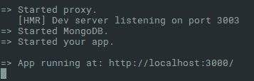
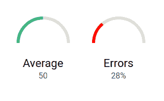

# 八、项目 6——使用 Meteor 的实时仪表板

在最后一章中，我们将使用 Vue 和一个完全不同的堆栈——Meteor！

我们将发现这个完整的 JavaScript 框架，并构建一个实时仪表板来监控一些产品的生产。我们将讨论以下主题：

*   安装 Meteor 并建立一个项目
*   使用 Meteor 方法将数据存储到 Meteor 集合中
*   订阅集合并使用我们的 Vue 组件中的数据

该应用程序将有一个带有一些指标的主页，例如：


它还将有另一个带有按钮的页面来生成假测量，因为我们没有真正的传感器可用。

# 建立项目

在第一部分中，我们将介绍 Meteor，并在此平台上启动并运行一个简单的应用程序。

# 什么是流星？

Meteor 是一个用于构建 web 应用程序的全栈 JavaScript 框架。

流星堆的主要元素如下：

*   Web 客户端（可以使用任何前端库，如 React 或 Vue）；它有一个名为 Minimongo 的客户端数据库
*   基于 nodejs 的服务器；它支持现代 ES2015+功能，包括[T0]语法
*   使用 MongoDB 的服务器上的实时数据库
*   抽象了客户端和服务器之间的通信；客户端和服务器端数据库可以轻松地实时同步
*   可选的混合移动应用程序（Android 和 iOS），内置一个命令
*   集成开发人员工具，如功能强大的命令行实用程序和易于使用的构建工具
*   Meteor 特定的软件包（但您也可以使用 npm 软件包）

正如您所看到的，JavaScript 到处都在使用。Meteor 还鼓励您在客户端和服务器之间共享代码。

由于 Meteor 管理整个堆栈，因此它提供了非常强大且易于使用的系统。例如，整个堆栈是完全反应式的、实时的——如果一个客户端向服务器发送更新，那么所有其他客户端都将接收新数据，并且它们的 UI 将自动更新。

Meteor has its own build system called "IsoBuild" and doesn't use Webpack. It focuses on ease of use (no configuration), but is, as a result, also less flexible.

# 安装流星

如果您的系统上没有 Meteor，您需要在 Meteor 官方网站[上打开安装指南 https://www.meteor.com/install](https://www.meteor.com/install) 。按照操作系统的说明安装 Meteor。

完成后，您可以使用以下命令检查 Meteor 是否正确安装：

```js
meteor --version
```

应显示 Meteor 的当前版本。

# 创建项目

现在安装了 Meteor，让我们建立一个新项目：

1.  让我们用[T0]命令创建我们的第一个 Meteor 项目：

```js
 meteor create --bare <folder>
 cd <folder>
```

`--bare`论点告诉 Meteor 我们想要一个空项目。默认情况下，Meteor 将生成一些我们不需要的样板文件，因此我们不必删除它们。

2.  然后，我们需要两个特定于 Meteor 的包——一个用于编译 Vue 组件，另一个用于编译这些组件内的手写笔。使用`meteor add`命令安装它们：

```js
 meteor add akryum:vue-component akryum:vue-stylus
```

3.  我们还将从 npm 安装`vue`和`vue-router`包：

```js
 meteor npm i -S vue vue-router
```

Note that we use the `meteor npm` command instead of just `npm`. This is to have the same environment as Meteor (nodejs and npm versions).

4.  要在开发模式下启动 Meteor 应用程序，只需运行[T0]命令：

```js
 meteor
```

Meteor 应启动 HTTP 代理、MongoDB 和 nodejs 服务器：



它还显示应用程序可用的 URL；但是，如果您现在打开它，它将是空白的。

# 我们的第一款 Vue Meteor 应用程序

在本节中，我们将在应用程序中显示一个简单的 Vue 组件：

1.  在项目目录中创建一个新的`index.html`文件，并告诉 Meteor 我们希望页面正文中有`app`id 的`div`：

```js
      <head>
        <title>Production Dashboard</title>
      </head>
      <body>
        <div id="app"></div>
      </body>
```

This is not a real HTML file. It is a special format where we can inject additional elements to the `head` or `body` section of the final HTML page. Here, Meteor will add a `title` into the `head` section and the `<div>` into the `body` section.

2.  使用简单模板创建新的`client`文件夹、新的`components`子文件夹和新的`App.vue`组件：

```js
      <!-- client/components/App.vue -->
      <template>
        <div id="#app">
          <h1>Meteor</h1>
        </div>
      </template>
```

3.  下载（[https://github.com/Akryum/packt-vue-project-guide/tree/master/chapter8-full/client](https://github.com/Akryum/packt-vue-project-guide/tree/master/chapter8-full/client) 将此手写笔文件保存在`client`文件夹中，并将其添加到主`App.vue`组件中：

```js
      <style lang="stylus" src="../style.styl" />
```

4.  在`client`文件夹中创建一个`main.js`文件，用于启动`Meteor.startup`钩子内的 Vue 应用程序：

```js
      import { Meteor } from 'meteor/meteor'
      import Vue from 'vue'
      import App from './components/App.vue'

      Meteor.startup(() => {
        new Vue({
          el: '#app',
          ...App,
        })
      })
```

In a Meteor app, it is recommended that you create the Vue app inside the `Meteor.startup` hook to ensure that all the Meteor systems are ready before starting the frontend. This code will only be run on the client because it is located in a `client` folder.

你现在应该在浏览器中显示一个简单的应用程序。您还可以打开 Vue devtools 并检查页面上是否存在[T0]组件。

# 路由

让我们在应用程序中添加一些路由；我们将有两个页面——带有指示器的仪表板和一个带有生成虚假数据按钮的页面：

1.  在`client/components`文件夹中，创建两个新组件--`ProductionGenerator.vue`和`ProductionDashboard.vue`。
2.  在`main.js`文件旁边，在`router.js`文件中创建路由器：

```js
      import Vue from 'vue'
      import VueRouter from 'vue-router'

      import ProductionDashboard from 
      './components/ProductionDashboard.vue'
      import ProductionGenerator from 
      './components/ProductionGenerator.vue'

      Vue.use(VueRouter)

      const routes = [
        { path: '/', name: 'dashboard', component: ProductionDashboard 
        },
        { path: '/generate', name: 'generate',
          component: ProductionGenerator },
      ]

      const router = new VueRouter({
        mode: 'history',
        routes,
      })

      export default router
```

3.  然后，在`main.js`文件中导入路由器并将其注入应用程序，就像我们在[第 5 章](5.html)、*项目 3-支持中心*中所做的那样。
4.  在`App.vue`主组件中，添加导航菜单和路由器视图：

```js
      <nav>
        <router-link :to="{ name: 'dashboard' }" exact>Dashboard
          </router-link>
        <router-link :to="{ name: 'generate' }">Measure</router-link>
      </nav>
      <router-view />
```

我们应用程序的基本结构现已完成：


# 生产措施

我们将创建的第一个页面是度量页面，其中有两个按钮：

*   第一个生成当前为`date`且随机为`value`的假生产度量
*   第二个也将生成一个度量值，但将[T0]属性设置为[T1]

所有这些度量值都将存储在一个名为“measures”的集合中。

# 流星收藏集成

Meteor 集合是对象的反应列表，类似于 MongoDB 集合（事实上，它在引擎盖下使用 MongoDB）。

我们需要使用 Vue 插件将 Meteor 集合集成到我们的 Vue 应用程序中，以便自动更新：

1.  添加`vue-meteor-tracker`npm 包：

```js
 meteor npm i -S vue-meteor-tracker
```

2.  然后，将库安装到 Vue 中：

```js
      import VueMeteorTracker from 'vue-meteor-tracker'

      Vue.use(VueMeteorTracker)
```

3.  使用`meteor`命令重新启动 Meteor。

该应用程序现在知道 Meteor 集合，我们可以在我们的组件中使用它们，我们马上就会这么做。

# 设置数据

下一步是建立流星收集，我们将在那里存储我们的测量数据。

# 添加集合

我们将把我们的测量结果储存在`Measures`流星收藏中。在项目目录中创建一个新的`lib`文件夹。将首先在客户端和服务器上执行此文件夹中的所有代码。创建一个`collections.js`文件，我们将在其中声明我们的`Measures`收藏：

```js
import { Mongo } from 'meteor/mongo'

export const Measures = new Mongo.Collection('measures')
```

# 添加流星方法

`Meteor`方法是一种特殊的函数，将在客户端和服务器上调用。这对于更新收集数据非常有用，并将提高应用程序的感知速度——客户端将在 minimongo 上执行，而无需等待服务器接收和处理。

This technique is called "Optimistic Update" and is very effective when the network quality is poor.

1.  在`lib`文件夹中的`collections.js`文件旁边，创建一个新的`methods.js`文件。然后，添加一个将新度量插入到`Measures`集合的`measure.add`方法：

```js
      import { Meteor } from 'meteor/meteor'
      import { Measures } from './collections'

      Meteor.methods({
        'measure.add' (measure) {
          Measures.insert({
            ...measure,
            date: new Date(),
          })
        },
      })
```

我们现在可以通过`Meteor.call`函数调用此方法：

```js
Meteor.call('measure.add', someMeasure)
```

该方法将在客户端（使用名为 minimongo 的客户端数据库）和服务器上运行。这样，客户端的更新将是即时的。

# 模拟措施

没有进一步的延迟，让我们构建一个简单的组件，称之为`measure.add`Meteor 方法：

1.  在`ProductionGenerator.vue`的模板中增加两个按钮：

```js
      <template>
        <div class="production-generator">
          <h1>Measure production</h1>

          <section class="actions">
            <button @click="generateMeasure(false)">Generate 
            Measure</button>
            <button @click="generateMeasure(true)">Generate 
            Error</button>
          </section>
        </div>
      </template>
```

2.  然后，在组件脚本中，创建生成一些虚拟数据的`generateMeasure`方法，然后调用`measure.add`Meteor 方法：

```js
      <script>
      import { Meteor } from 'meteor/meteor'

      export default {
        methods: {
          generateMeasure (error) {
            const value = Math.round(Math.random() * 100)
            const measure = {
              value,
              error,
            }
            Meteor.call('measure.add', measure)
          },
        },
      }
      </script>
```

组件应如下所示：


如果单击按钮，则不会出现任何可见的情况。

# 检查数据

有一种简单的方法可以检查我们的代码是否有效，并验证您是否可以在`Measures`集合中添加项。我们可以通过一个命令连接到`MongoDB`数据库。

在另一个终端中，运行以下命令以连接到应用程序的数据库：

```js
meteor mongo
```

然后，输入此 MongoDB 查询以获取`measures`集合的文档（创建`Measures`Meteor 集合时使用的参数）：

```js
db.measures.find({})
```

如果单击按钮，则应显示测量文件列表：


这意味着我们的 Meteor 方法起作用了，对象被插入了我们的 MongoDB 数据库。

# 仪表板和报告

现在我们的第一页已经完成，我们可以继续使用实时仪表板。

# 进度条库

为了显示一些漂亮的指示器，让我们安装另一个 Vue 库，它允许沿 SVG 路径绘制进度条；这样，我们就可以得到半圆形钢筋：

1.  将`vue-progress-path`npm 包添加到项目中：

```js
 meteor npm i -S vue-progress-path
```

我们需要告诉 Meteor 的 Vue 编译器不要处理安装包的`node_modules`中的文件。

2.  在项目根目录中创建一个新的`.vueignore`文件。此文件的工作方式类似于`.gitignore`：每一行都是一条忽略某些路径的规则。如果以斜杠`/`结尾，则只会忽略相应的文件夹。因此，`.vueignore`的内容应如下：

```js
      node_modules/
```

3.  最后，在`client/main.js`文件中安装`vue-progress-path`插件：

```js
 import 'vue-progress-path/dist/vue-progress-path.css'
      import VueProgress from 'vue-progress-path'

      Vue.use(VueProgress, {
        defaultShape: 'semicircle',
      })
```

# 流星出版物

要同步数据，客户端必须订阅服务器上声明的发布。Meteor 发布是一个返回 Meteor 集合查询的函数。它可以使用参数来筛选要同步的数据。

对于我们的应用程序，我们只需要一份简单的`measures`出版物，发送`Measures`收藏的所有文档：

1.  此代码应仅在服务器上运行。因此，在`project`文件夹中创建一个新的`server`，并在该文件夹中创建一个新的`publications.js`文件：

```js
      import { Meteor } from 'meteor/meteor'
      import { Measures } from '../lib/collections'

      Meteor.publish('measures', function () {
        return Measures.find({})
      })
```

This code will only run on the server because it is located in a folder called `server`.

# 创建仪表板组件

我们已经准备好构建我们的`ProductionDashboard`组件。多亏了我们之前安装的`vue-meteor-tracker`，我们有了一个新的组件定义选项--`meteor`。这是一个对象，用于描述需要订阅的发布以及需要为该组件检索的集合数据。

1.  使用`meteor`定义选项添加以下脚本部分：

```js
      <script>
      export default {
        meteor: {
          // Subscriptions and Collections queries here
        },
      }
      </script>
```

2.  在`meteor`选项中，使用`$subscribe`对象订阅`measures`出版物：

```js
      meteor: {
        $subscribe: {
          'measures': [],
        },
      },
```

The empty array means we pass no parameter to the publication.

3.  通过查询`meteor`选项内的`Measures`流星收集来检索度量：

```js
      meteor: {
        // ...

        measures () {
          return Measures.find({}, {
            sort: { date: -1 },
          })
        },
      },
```

The second parameter of the `find` method is an options object very similar to the MongoDB JavaScript API. Here, we are sorting the documents by their date in descending order, thanks to the `sort` property of the options object.

4.  最后，创建`measures`数据属性并将其初始化为空数组。

组件的脚本现在应该如下所示：

```js
      <script>
      import { Measures } from '../../lib/collections'

      export default {
        data () {
          return {
            measures: [],
          }
        },

        meteor: {
          $subscribe: {
            'measures': [],
          },

          measures () {
            return Measures.find({}, {
              sort: { date: -1 },
            })
          },
        },
      }
      </script>
```

在浏览器 devtools 中，现在可以检查组件是否已从集合中检索到项。

# 指标

我们将为仪表板指示器创建一个单独的组件，如下所示：

1.  在`components`文件夹中，创建一个新的`ProductionIndicator.vue`组件。
2.  声明显示进度条、标题和其他信息文本的模板：

```js
      <template>
        <div class="production-indicator">
          <loading-progress :progress="value" />
          <div class="title">{{ title }}</div>
          <div class="info">{{ info }}</div>
        </div>
      </template>
```

3.  添加`value`、`title`和`info`道具：

```js
      <script>
      export default {
        props: {
          value: {
            type: Number,
            required: true,
          },
          title: String,
          info: [String, Number],
        },
      }
      </script>
```

4.  回到`ProductionDashboard`部分，让我们计算平均值和错误率：

```js
      computed: {
        length () {
          return this.measures.length
        },

        average () {
          if (!this.length) return 0
          let total = this.measures.reduce(
            (total, measure) => total += measure.value,
            0
          )
          return total / this.length
        },

        errorRate () {
          if (!this.length) return 0
          let total = this.measures.reduce(
            (total, measure) => total += measure.error ? 1 : 0,
            0
          )
          return total / this.length
        },
      },
```

In the preceding code snippet, we cached the length of the `measures` array in a `length` computed property.

5.  在模板中添加两个指标-一个用于平均值，一个用于错误率：

```js
      <template>
        <div class="production-dashboard">
          <h1>Production Dashboard</h1>

          <section class="indicators">
            <ProductionIndicator
              :value="average / 100"
              title="Average"
              :info="Math.round(average)"
            />
            <ProductionIndicator
              class="danger"
              :value="errorRate"
              title="Errors"
              :info="`${Math.round(errorRate * 100)}%`"
            />
          </section>
        </div>
      </template>
```

Don't forget to import `ProductionIndicator` into the component!

指标应如下所示：



# 列出措施

最后，我们将在指标下面显示一个度量列表：

1.  为每个度量添加一个简单的`<div>`元素列表，如果有错误，则显示日期和值：

```js
      <section class="list">
        <div
          v-for="item of measures"
          :key="item._id"
        >
          <div class="date">{{ item.date.toLocaleString() }}</div>
          <div class="error">{{ item.error ? 'Error' : '' }}</div>
          <div class="value">{{ item.value }}</div>
        </div>
      </section>
```

该应用程序现在应该如下所示，带有导航工具栏、两个指示器和度量值列表：


如果你在另一个窗口中打开应用程序，并将窗口并排放置，你可以看到 Meteor 的完整堆栈反应。在一个窗口中打开仪表板，在另一个窗口中打开生成器页面。然后，添加假测量值并实时观察另一个窗口上的数据更新。

如果您想了解更多有关流星的信息，请访问官方网站（[https://www.meteor.com/developers](https://www.meteor.com/developers) 和 Vue 集成存储库（[https://github.com/meteor-vue/vue-meteor](https://github.com/meteor-vue/vue-meteor) ）。

# 总结

在最后一章中，我们使用一个名为 Meteor 的新的完整堆栈框架创建了一个项目。我们将 Vue 集成到应用程序中，并建立了 Meteor 反应收集。使用 Meteor 方法，我们将文档插入到集合中，并在仪表板组件中实时显示数据。

本书可能已经结束，但您使用 Vue 的旅程才刚刚开始。我们从模板和反应数据的基本概念开始，编写简单的应用程序，而不使用任何构建工具。即使行李不多，我们也可以制作一个 Mardown 笔记本，甚至可以制作一个带有动画的浏览器卡片游戏。然后，我们开始使用我们可以使用的全套工具来制作更大的应用程序。官方命令行工具 vue cli 对构建我们的项目非常有帮助。单文件组件（`.vue`文件）使组件易于维护和演化。我们甚至可以很容易地使用预处理语言，比如手写笔。vue 路由器官方库是管理多个页面的必备工具，就像我们在[第 5 章](5.html)、*项目 3-支持中心*中所做的那样，它有一个良好的用户系统和专用路由。接下来，我们进入了另一个具有高级功能的级别，比如 GoogleOAuth 和 GoogleMaps，同时使用官方 Vuex 库以可扩展和安全的方式构建地理定位博客。然后，我们用 ESLint 改进了在线商店代码的质量，并为我们的组件编写了单元测试。我们甚至在应用程序中添加了本地化和服务器端渲染，所以现在它有了一种非常专业的感觉。

您现在可以通过改进来实践我们构建的项目，甚至可以开始自己的项目。使用 Vue 将提高您的技能，但您也可以参加活动、与社区在线聊天、参与（[https://github.com/vuejs/vue](https://github.com/vuejs/vue) ），或帮助他人学习 Vue。分享你的知识只会增加你自己的知识，你会做得更好。