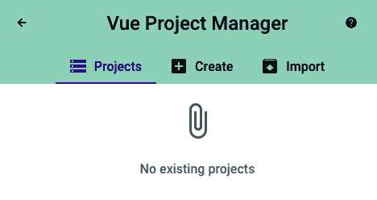
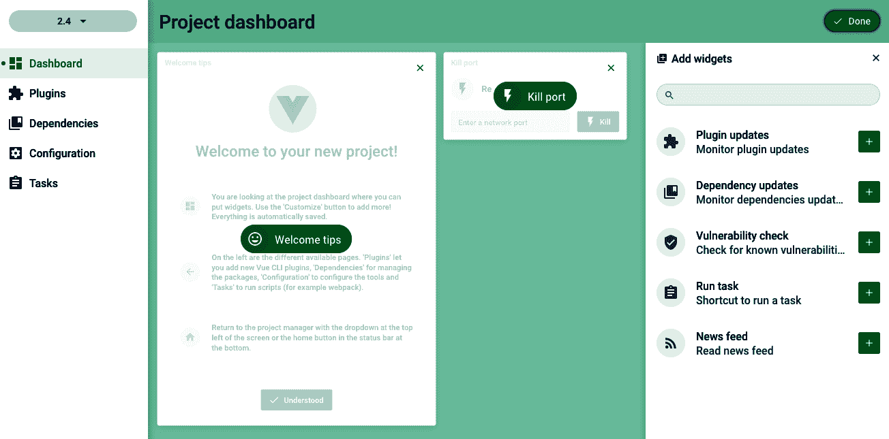
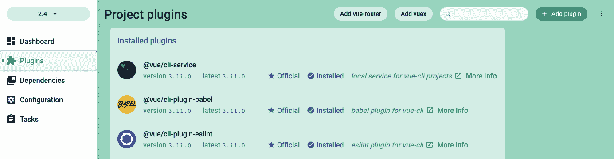
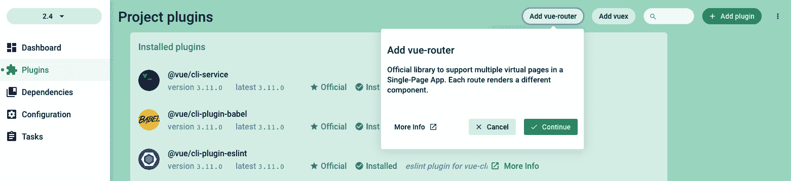
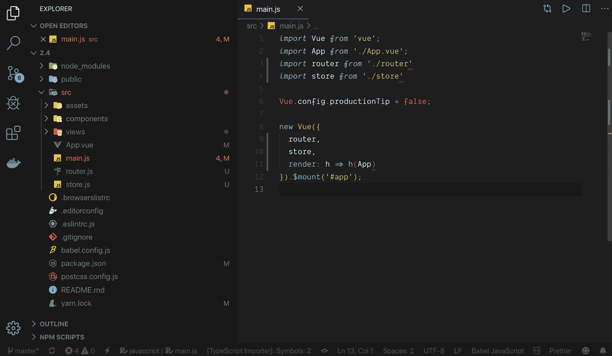
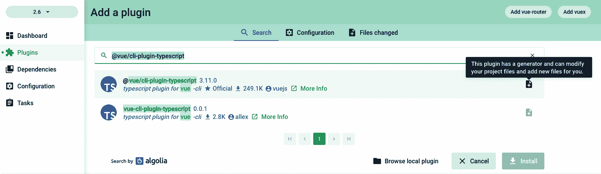
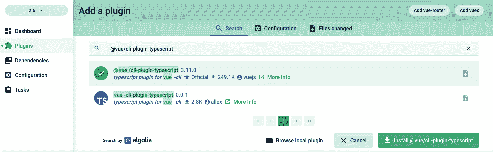
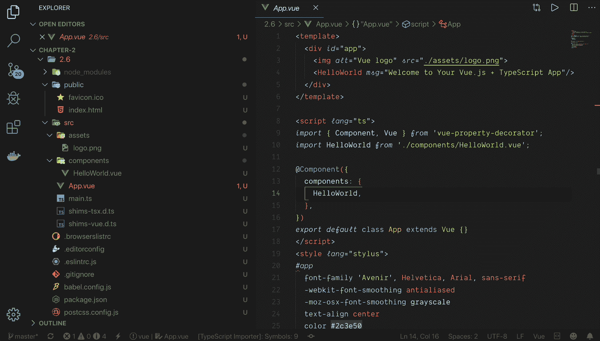
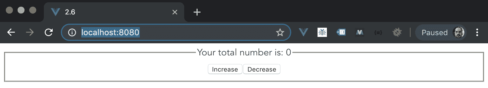

# 二、ypeScript 和 Vue 生态系统简介

TypeScript 是一种新的基于 Vue 的语言，在**Vue 3**上完全受支持。现在可以使用类型化 JSX（也称为 TSX）、类型注释、代码的静态验证等等。

Vue 生态系统每天都在变大，因此为了帮助我们，Vue 团队开发了一些工具来改进项目处理和管理。这些工具是 Vue CLI 和 Vue UI，它们现在是本地 Vue 开发的主要工具。

Vue CLI 工具是每个项目的开始；使用它，您将能够选择基本功能或仅选择您所做的预设，以创建新的 Vue 项目。创建项目后，您可以使用 Vue UI 来管理项目、添加新功能、检查项目状态，以及通过添加更多功能来执行以前需要在命令行界面（CLI）中执行的几乎所有操作。

在这些章节中，您将进一步了解 TypeScript 作为 JavaScript 上的超集，以及如何将 Vue CLI 工具和 Vue UI 的强大功能结合起来，使整个应用启动并运行。

在本章中，我们将介绍以下配方：

*   创建类型脚本项目
*   理解打字脚本
*   创建第一个 TypeScript 类
*   使用 Vue CLI 创建第一个项目
*   使用 Vue 将 CLI 插件添加到 Vue 项目
*   将 TypeScript 添加到 Vue CLI 项目
*   使用[T0]创建第一个 TypeScript Vue 组件
*   使用`vue-class-component`创建自定义混音
*   使用`vue-class-component`创建自定义函数装饰器
*   将自定义挂钩添加到`vue-class-component`
*   在`vue-class-component`中增加`vue-property-decorator`

# 技术要求

在本章中，我们将使用**Node.js**、**Vue CLI**和**TypeScript**。

Attention, Windows users—you need to install an `npm` package called `windows-build-tools` to be able to install the following required packages. To do it, open PowerShell as administrator and execute the following command:
`> npm install -g windows-build-tools`.

要安装**Vue CLI**工具，请打开终端（macOS 或 Linux）或命令提示符/PowerShell（Windows）并执行以下命令：

```js
> npm install -g @vue/cli @vue/cli-service-global
```

要安装**类型脚本**，请打开终端（macOS 或 Linux）或命令提示符/PowerShell（Windows）并执行以下命令：

```js
> npm install -g typescript
```

# 创建类型脚本项目

TypeScript 是 JavaScript 的类型化超集，在编译时，它为我们提供了简单的 JavaScript 代码。它似乎是一种新语言，但最终还是 JavaScript。

使用 TypeScript 的优点是什么？主要的优点是类型化语法，它有助于静态检查和代码重构。您仍然可以使用所有 JavaScript 库和程序，使用最新的 ECMAScript 功能。

编译后，TypeScript 将提供一个纯 JavaScript 文件，可以在任何浏览器、Node.js 或任何能够执行 ECMAScript 3 或更新版本的 JavaScript 引擎上运行。

## 准备

要开始我们的项目，我们需要创建一个`npm`项目。打开终端（macOS 或 Linux）或命令提示符/PowerShell（Windows）并执行以下命令：

```js
> npm init -y
```

您还需要安装 TypeScript，以便打开终端（macOS 或 Linux）或命令提示符/PowerShell（Windows）并执行以下命令：

```js
> npm install typescript --only=dev
```

## 怎么做。。。

环境就绪后，我们需要启动 TypeScript 项目。让我们创建一个`.ts`文件并编译它：

1.  要启动 TypeScript 项目，请打开终端（macOS 或 Linux）或命令提示符/PowerShell（Windows）并执行以下命令：

```js
> tsc --init
```

这将在我们的文件夹中创建一个`tsconfig.json`文件。这是一个编译器设置文件。在这里，您可以定义目标、开发中将提供哪些 JavaScript 库、目标 ECMAScript 版本、模块生成等等。

When developing for the web, don't forget to add the **Document Object Model** (**DOM**) to the libraries on the `compilerOption` property inside the `tsconfig.json` file so that you can have access to the window and document object when developing.

2.  现在，我们需要创建我们的`index.ts`文件。让我们在`index.ts`文件中创建一些简单的代码，将数学计算记录在终端中：

```js
function sum(a: number, b: number): number {
    return a + b;
}

const firstNumber: number = 10;

const secondNumber: number = 20;

console.log(sum(firstNumber, secondNumber));
```

此函数接收两个参数`a`和`b`，这两个参数的类型都设置为`number`，预计函数将返回一个`number`。我们制作了两个变量，`firstNumber`**和`secondNumber`，在本例中，这两个变量分别设置为`number`类型-`10`和`20`，因此传递给函数是有效的。如果我们将它设置为任何其他类型，例如字符串、布尔值、浮点值或数组，编译器将抛出一个关于变量和函数执行的静态类型检查的错误。**

 **3.  现在，我们需要将此代码编译为 JavaScript 文件。打开终端（macOS 或 Linux）或命令提示符/PowerShell（Windows）并执行以下命令：

```js
> tsc ./index.ts
```

编译完成后，我们可以在`index.js`中看到最终文件。如果我们查看文件内部，最终代码将类似于：

```js
function sum(a, b) {
    return a + b;
}
var firstNumber = 10;
var secondNumber = 20;
console.log(sum(firstNumber, secondNumber));
```

你可能会想：*我的类型在哪里？*由于 ECMAScript 是一种动态语言，TypeScript 的类型仅存在于超集级别，不会传递给 JavaScript 文件。

您的最终 JavaScript 将以传输文件的形式出现，配置在`tsconfig.json`文件中定义。

## 它是如何工作的。。。

当我们创建 TypeScript 项目时，会在文件夹中创建一个名为`tsconfig.json`的文件。该文件协调开发过程中编译器上的所有规则和静态类型检查。所有开发都基于此文件中定义的规则。每个环境都取决于需要导入的特定规则和库。

在开发时，我们可以直接将类型分配给常量、变量、函数参数、返回等等。这些类型的定义可以防止基本类型错误和代码重构。

开发完成并编译项目后，最终产品将是一个纯 JavaScript 文件。由于 JavaScript 的动态类型，此文件不会有任何类型的检查。

这个 JavaScript 文件被传输到目标模型并在配置文件中定义，因此我们可以毫无问题地执行它。

## 另见

有关 TypeScript 的更多信息，请访问[https://www.typescriptlang.org/docs/home.html](https://www.typescriptlang.org/docs/home.html) 。

在[中有一个从 JavaScript 迁移的指南 https://www.typescriptlang.org/docs/handbook/migrating-from-javascript.html](https://www.typescriptlang.org/docs/handbook/migrating-from-javascript.html) 。

关于打字脚本的 5 分钟课程可在[找到 https://www.typescriptlang.org/docs/handbook/typescript-in-5-minutes.html](https://www.typescriptlang.org/docs/handbook/typescript-in-5-minutes.html) 。

# 理解打字脚本

TypeScript 是一种基于类型的语言。它的大部分功能来自于使用 JavaScript 进行静态代码分析的能力。由于 TypeScript 环境中的工具，这是可能的。

这些工具包括编译器，它可以在开发期间和编译之后提供静态分析，以及 ECMAScript transpiler，它可以让您的代码在几乎任何 JavaScript 引擎上运行。

让我们进一步了解该语言及其工作原理。

## 准备

首先，我们需要创建一个`npm`项目。打开终端（macOS 或 Linux）或命令提示符/PowerShell（Windows）并执行以下命令：

```js
> npm init -y
```

您还需要安装 TypeScript，以便打开终端（macOS 或 Linux）或命令提示符/PowerShell（Windows）并执行以下命令：

```js
> npm install typescript --only=dev
```

## 类型

我们从使用 TypeScript 中获得的主要特性是**类型**。在本节中，我们将学习类型、如何声明它们以及如何使用它们。

以下是静态类型语言中的一些基本类型：

*   一串
*   数字
*   布尔值
*   阵列
*   元组
*   枚举
*   任何
*   无效的
*   物体

让我们讨论其中的一些类型，并展示如何在 TypeScript 中使用它们。

### 一串

JavaScript 上的所有文本数据将被视为一个**字符串**。要声明一个字符串，我们总是需要用双引号`(")`或单引号`(')`或`(`)`重调，通常称为模板字符串。

在文本中声明模板字符串对于 TypeScript 来说不是问题。模板字符串是 ECMAScript 中的一项功能，它可以在字符串中添加变量，而无需连接：

```js
const myText: string = 'My Simple Text';
const myTextAgain: string = "My Simple Text";
const greeting: string = `Welcome back ${myName}!`;
```

### 数字

在 JavaScript 中，所有数字都是浮点值。在 TypeScript 中，它是相同的。这些数字会得到一个**数字**类型。除了十六进制和十进制数字外，ECMAScript 2015 中引入的二进制和八进制文字也被视为数字：

```js
const myAge: number = 31;
const hexNumber: number = 0xf010d;
const binaryNumber: number = 0b1011;
const octalNumber: number = 0o744;
```

### 布尔值

编程语言中最基本的类型是**布尔**值——简单的 1 或 0，以及 true 或 false。这称为**布尔值**：

```js
const isTaskDone: boolean = false;
const isGreaterThen: boolean = 10 > 5;
```

### 阵列

大多数语言中的一组元素通常称为**数组**。在 TypeScript 中，我们可以用两种不同的方式声明它。

最简单的方法就是声明元素的类型，后跟`[]`*方括号*，表示它是声明类型的**数组**：**

 **```js
const primeNumbers: number[] = [1, 3, 5, 7, 11];
```

或者，您可以使用`Array<type>`声明进行一般性声明。这不是最常用的方法，但是，根据您正在开发的代码，您可能需要使用它：

```js
const switchInstructions: Array<boolean> = [true, false, false, true];
```

### 元组

**元组**是一种具有特定结构的变量。在结构上，元组是两个元素的数组；两者都是编译器和用户已知的类型，但这些元素不需要具有相同的类型：

```js
let person: [string, number];
person = ['Heitor', 31];

console.log(`My name is ${person[0]} and I am ${person[1]} years old`);
```

如果试图访问已知索引之外的元素，则会出现错误。

### 枚举

**枚举**与 JavaScript 对象类似，但它们有一些特殊属性，有助于应用的开发。对于数值，您可以有一个友好的名称，对于函数可以接受的变量的常量，您可以有一个更受控制的环境。

无需任何声明即可创建数字枚举。这样，它将从初始值`0`开始，以最终索引号的值结束；或者，您可以通过传递枚举值的索引来获取枚举的名称：

```js
enum ErrorLevel { 
    Info, 
    Debug, 
    Warning, 
    Error, 
    Critical,
}

console.log(ErrorLevel.Error); // 3
console.log(ErrorLevel[3]); // Error
```

或者，可以使用值声明枚举。它可以是 TypeScript 编译器将其余元素解释为第一个元素增量的初始声明，也可以是单个声明：

```js
enum Color {
    Red = '#FF0000',
    Blue = '#0000FF',
    Green = '#00FF00',
}

enum Languages {
    JavaScript = 1,
    PHP,
    Python,
    Java = 10,
    Ruby,
    Rust,
    TypeScript,
}

console.log(Color.Red) // '#FF0000'
console.log(Languages.TypeScript) // 13
```

### 任何

由于 JavaScript 是一种动态语言，TypeScript 需要实现一个没有定义值的类型，因此它实现了**any**类型。any 类型 any 最常用的情况是使用来自第三方库的值。在这种情况下，我们知道我们正在放弃类型检查：

```js
let maybeIs: any = 4;
maybeIs = 'a string?';
maybeIs = true;
```

任何类型的主要用途都是将遗留 JavaScript 项目升级到 TypeScript 时，您可以逐步向变量和函数添加类型和验证。

### 无效的

与任何类型相反，**void**完全没有该类型。最常用的情况是不返回任何值的函数：

```js
function logThis(str: string): void{
    console.log(str);
}
```

使用 void 来键入变量是无用的，因为它只能被分配给 undefined 和 null。

### 物体

TypeScripts 中的**对象**有一种特殊的声明形式，因为它可以声明为接口、直接**对象、**或自己的类型。

将对象声明为接口时，必须在使用前声明接口，必须传递所有属性，并且需要设置类型：

```js
interface IPerson {
    name: string;
    age: number;
}

const person: IPerson = {
    name: 'Heitor',
    age: 31,
};
```

在传递给函数时，使用对象作为直接输入有时很常见：

```js
function greetingUser(user: {name: string, lastName: string}) {
    console.log(`Hello, ${user.name} ${user.lastName}`);
}
```

最后，它们用于声明对象类型并重用它：

```js
type Person = {
    name: string,
    age: number,
};

const person: Person = {
    name: 'Heitor',
    age: 31,
};

console.log(`My name is ${person.name}, I am ${person.age} years old`);
```

### 功能

在 TypeScript 中，最难声明的类型之一是**函数**。它可以在一个简单的功能链串联中变得非常复杂。

在 TypeScript 中声明函数是函数将接收的参数和函数将返回的最终类型的组合。

您可以在常量中声明一个简单函数，如下所示：

```js
const sumOfValues: (a:number, b:number): number = (a: number, b: number): number => a + b;
```

在常量中声明的更复杂的函数可以这样声明：

```js
const complexFunction: (a: number) => (b:number) => number = (a: number): (b: number) => number => (b: number): number => a + b;
```

将函数声明为普通函数时，键入函数的方式几乎与常量相同，但不需要声明函数是函数。以下是一个例子：

```js
function foo(a: number, b:number): number{
    return a + b;
}
```

## 接口

TypeScript 检查变量的值是否为正确的类型，并且相同的原则应用于代码之间的类、对象或契约。这通常被称为“duck 类型”或“structural sub-typing”。接口用于填充此空间并定义这些契约或类型。

我们试着用这个例子来理解一个**接口**：

```js
function greetingStudent(student: {name: string}){
    console.log(`Hello ${student.name}`);
}

const newStudent = {name: 'Heitor'};

greetingStudent(newStudent);
```

函数将知道对象上有属性名，并且调用它是有效的。

我们可以使用接口类型重写它，以更好地管理代码：

```js
interface IStudent {
    name: string;
    course?: string;
    readonly university: string;
}

function greetingStudent(student: IStudent){
    console.log(`Hello ${student.name}`);
    if(student.course){
        console.log(`Welcome to the ${student.course}` semester`);
    }
}

const newStudent: IStudent = { name: 'Heitor', university: 'UDF' };

greetingStudent(newStudent);
```

正如您所看到的，我们有一个名为`course`的新属性，上面声明了一个`?`。这表示此属性可以为 null 或未定义。它被称为可选属性。

存在一个声明了只读属性的属性。如果我们试图在变量创建时声明它之后进行更改，我们将收到一个编译错误，因为它使属性为只读。

## 装饰师

ECMAScript 6-Class 中引入了一个新特性。通过引入这些，可以在 JavaScript 引擎上使用装饰器。

**Decorators**提供了一种向类声明及其成员添加注释和元编程语法的方法。由于它处于 TC-39 委员会的最终批准状态（其中，**TC**代表**技术委员会**，TypeScript 编译器已经可以使用它了。

要启用它，您可以在`tsconfig.json`文件上设置标志：

```js
{
    "compilerOptions": {
        "target": "ES5",
        "experimentalDecorators": true
    }
}
```

装饰器是一种特殊的声明，可以附加到类、方法、访问器属性或参数。它们以`@expression`的形式使用，其中表达式是将在运行时调用的函数。

可以应用于类的装饰器示例可以在以下代码段中看到：

```js
function classSeal(constructor: Function) {
    Object.seal(constructor);
    Object.seal(constructor.prototype);
}
```

创建此函数时，您的意思是构造函数的对象及其原型将被密封。

在类中使用它非常简单：

```js
@classSeal
class Animal {
    sound: string;
    constructor(sound: string) {
        this.sound = sound;
    }
    emitSound() {
        return "The animal says, " + this.sound;
    }
}
```

这些只是装饰器的一些例子，它们的功能可以帮助您使用 TypeScript 开发**面向对象编程**（**OOP**）。

## 总之

总之，类型只是在使用 TypeScript 和 JavaScript 开发过程中使我们的生活更轻松的一种方式。

因为 JavaScript 是一种动态语言，没有静态类型，所以 TypeScript 中声明的所有类型和接口都严格由 TypeScript 使用。这有助于编译器捕获错误、警告，并帮助语言服务器在开发过程中帮助**集成开发环境**（**IDE**）分析正在编写的代码。

这是对 TypeScript 的基本介绍，涵盖了类型化语言的基本知识，以及如何理解和使用它。关于它的使用还有很多需要了解的，比如泛型、模块、名称空间等等。

通过本介绍，您可以了解新的**Vue 3**核心是如何工作的，以及如何在项目中使用 TypeScript 的基础知识，并在项目中利用打字语言。

TypeScript 总是有更多的知识可以找到，因为它是 JavaScript 之上的一种不断增长的“语言”，并且拥有一个不断增长的社区。

不要忘记查看 TypeScript 文档，了解更多关于它的信息，以及从现在起它如何改进您的代码。

## 另见

有关 TypeScript 基本类型的更多信息，请访问[https://www.typescriptlang.org/docs/handbook/basic-types.html](https://www.typescriptlang.org/docs/handbook/basic-types.html) 。

有关 TypeScript 函数的更多信息，请访问[https://www.typescriptlang.org/docs/handbook/functions.html](https://www.typescriptlang.org/docs/handbook/functions.html) 。

有关 TypeScript 枚举的更多信息，请访问[https://www.typescriptlang.org/docs/handbook/enums.html](https://www.typescriptlang.org/docs/handbook/enums.html) 。

有关 TypeScript 高级类型的更多信息，请访问[https://www.typescriptlang.org/docs/handbook/advanced-types.html](https://www.typescriptlang.org/docs/handbook/advanced-types.html) 。

您可以在[找到有关 TypeScript 装饰器的更多信息 https://www.typescriptlang.org/docs/handbook/decorators.html](https://www.typescriptlang.org/docs/handbook/decorators.html) 。

在[查看关于类型脚本类型的备忘单 https://rmolinamir.github.io/typescript-cheatsheet/#types](https://rmolinamir.github.io/typescript-cheatsheet/#types) 。

# 创建第一个 TypeScript 类

在 TypeScript 中，没有编写程序的主要范例。您可以在面向对象、结构或事件功能之间进行选择。

在大多数情况下，您将看到正在使用 OOP 范例。在这个配方中，我们将学习如何在 TypeScript 中创建一个类、它的继承、接口以及其他可以在代码中使用的属性。

## 准备

要开始我们的项目，我们需要创建一个`npm`项目。为此，请打开终端（macOS 或 Linux）或命令提示符/PowerShell（Windows）并执行以下命令：

```js
> npm init -y
```

您还需要安装 TypeScript**。**为此，打开终端（macOS 或 Linux）或命令提示符/PowerShell（Windows）并执行以下命令：

```js
> npm install typescript --only=dev
```

## 怎么做。。。

在 TypeScript 文件中编写类时，我们首先需要记住这个类将做什么，这个类可以做什么，它如何通过继承被另一个类扩展，以及在这个过程中它如何受到影响。

想象一下，我们有一个基本的`Animal`课程。这个类可以有一些基本属性，比如它的`name`、它是否产生`sound`、它的`family`和这个动物吃的基本`food chain`。

1.  让我们从流程的基础开始，`food chain`。我们需要确保它是一个数不清的列表，并且使用它的每个文件在最后都有相同的值。我们只需要调用一个常量变量：

```js
export enum FoodChainType {
    Carnivorous = 'carnivorous',
    Herbivorous = 'herbivorous',
    Omnivorous = 'omnivorous',
}
```

2.  现在，我们要为我们的动物制作基本的`interface`。我们知道我们的动物有一个`name`，可以产生一个`sound`，可以是`family`的一部分，并且属于`food chain`类。使用类中的接口，我们在类和将要公开的内容之间订立契约，帮助开发过程：

```js
interface IAnimal {
    name: string;
    sound?: string;
    family: string;
    foodChainType: FoodChainType;
}
```

3.  所有这些都解决了，我们就可以上课了。每个类都可以有自己的构造函数。类构造函数可以很简单，只包含一些变量作为参数，也可以更复杂，以对象作为参数。如果构造函数有任何参数，则需要一个接口或声明每个参数的类型。在这种情况下，我们的构造函数将是一个对象，并且只有一个与`Animal`相同的参数，因此它将扩展`IAnimal`接口：

```js
interface IAnimalConstructor extends IAnimal { 
}
```

4.  现在，为了创建我们的类，我们已经声明了将要使用的接口和枚举。我们将首先声明该类将实现`IBasicAnimal`接口。为此，我们需要添加一些类将拥有的公共元素，并声明它们。我们需要实现这些功能来显示它是什么动物以及它发出什么声音。现在，我们有了一个基本类，它包含了我们动物的所有属性。它为类和构造函数提供了单独的接口。食物链的枚举是以人类可读的方式声明的，因此该库的 JavaScript 导入可以毫无问题地执行：

```js
interface IBasicAnimal extends IAnimal {
  whoAmI: () => void;
  makeSound: () => void;
}

export class Animal implements IBasicAnimal {
  public name: string;
  public sound: string;
  public family: string;
  public foodChainType: FoodChainType;

  constructor(params: IAnimalConstructor) {
    this.name = params.name;
    this.sound = params.sound || '';
    this.family = params.family;
    this.foodChainType = params.foodChainType;
  }

  public whoAmI(): void {
    console.log(`I am a ${this.name}, my family is ${this.family}. 
    My diet is ${this.foodChainType}.`);
    if (this.sound) {
      console.log([...Array(2).fill(this.sound)].join(', '));
    }
  }

  public makeSound(): void {
    console.log(this.sound);
  }
}
```

5.  让我们用几行代码扩展这个类，并将这个`Animal`转换为`Dog`：

```js
import {Animal, FoodChainType} from './Animal';

class Dog extends Animal {
  constructor() {
    super({
      name: 'Dog',
      sound: 'Wof!',
      family: 'Canidae',
      foodChainType: FoodChainType.Carnivorous,
    });
  }n
}
```

这是一种扩展父类并使用父类对子类的定义组成一个新类的简单方法，该类具有与父类几乎相同的接口。

## 它是如何工作的。。。

TypeScript 中的类与 Java 或 C#等语言中的其他类的工作原理相同。编译器在开发和编译期间评估这些通用原则。

在本例中，我们创建了一个简单的类，该类具有一些儿童类固有的公共属性。这些变量都是可读的，可以变异。

## 还有更多。。。

在 TypeScript 中，类有着广泛的可能用途，例如抽象类、特殊修饰符和使用类作为接口。我们刚刚介绍了这些课程的基础知识，为我们提供了一个良好的入门知识库。如果您想更深入地了解，TypeScript 文档非常有用，其中有许多示例可以帮助您学习。

## 另见

有关 TypeScript 类的更多信息，请访问[https://www.typescriptlang.org/docs/handbook/classes.html](https://www.typescriptlang.org/docs/handbook/classes.html) 。

在[查看关于 TypeScript 类的备忘单 https://rmolinamir.github.io/typescript-cheatsheet/#classes](https://rmolinamir.github.io/typescript-cheatsheet/#classes) 。

# 使用 Vue CLI 创建第一个项目

当 Vue 团队意识到开发人员在创建和管理其应用时遇到问题时，他们看到了一个机会，可以创建一个可以帮助世界各地开发人员的工具。Vue CLI 项目诞生了。

Vue CLI 工具是一种 CLI 工具，用于终端命令，如 Windows PowerShell、Linux Bash 或 macOS 终端。它是作为 Vue 开发的起点创建的，在这里，开发人员可以启动一个项目并顺利地管理和构建它。Vue CLI 团队在开发时的重点是让开发人员有更多的时间思考代码，并在将代码投入生产所需的工具上花费更少的时间，添加新插件或简单的[T0]。

Vue CLI 工具经过调整，在投入生产之前，无需将工具代码弹出 CLI 之外。

在版本 3 发布时，Vue UI 项目作为主要功能添加到 CLI 中，将 CLI 命令转换为一个更完整的可视化解决方案，并进行了大量新的添加和改进。

## 准备

此配方的先决条件如下：

*   Node.js 12+

所需的 Node.js 全局对象如下：

*   `@vue/cli`
*   `@vue/cli-service-global`

## 怎么做。。。

要创建 Vue CLI 项目，请执行以下步骤：

1.  我们需要打开终端（macOS 或 Linux）或命令提示符/PowerShell（Windows）并执行以下命令：

```js
> vue create my-first-project
```

2.  CLI 将询问一些有助于创建项目的问题。您可以使用箭头键导航，*输入*键继续，使用*空格键*选择选项：

```js
? Please pick a preset: (Use arrow keys)
  default (babel, eslint) ❯ Manually select features ‌
```

3.  启动新项目有两种方法。默认的方法是基本的`babel`和`eslint`项目，没有任何插件或配置，以及`Manually`模式，您可以在其中选择更多模式、插件、过梁和选项。我们将选择`Manually`。‌
4.  现在，我们被问及我们希望在该项目中使用的功能。这些功能包括一些 Vue 插件，如 Vuex 或路由器（Vue 路由器）、测试仪、linter 等：

```js
? Check the features needed for your project: (Use arrow keys)
 ❯ Babel
   TypeScript
   Progressive Web App (PWA) Support
   Router
   Vuex
   CSS Pre-processors
 ❯ Linter / Formatter
   Unit Testing
 ❯ E2E Testing
```

5.  对于本项目，我们将选择`CSS Pre-processors`并按*进入*继续：

```js
? Check the features needed for your project: (Use arrow keys) ❯ Babel
  TypeScript
  Progressive Web App (PWA) Support
  Router
  Vuex ❯ CSS Pre-processors ❯ Linter / Formatter
 Unit Testing E2E Testing
```

6.  可以选择主要的**级联样式表**（**CSS**预处理器）与 Vue-`Sass`、`Less`和`Stylus`一起使用。由您选择最适合您且最适合您的：

```js
? Pick a CSS pre-processor (PostCSS, Autoprefixer and CSS Modules
  are supported by default): (Use arrow keys)
  Sass/SCSS (with dart-sass) 
  Sass/SCSS (with node-sass) 
  Less 
❯ Stylus 
```

7.  是时候格式化你的代码了。您可以使用基本配置在`AirBnB`、`Standard`和`Prettier`之间进行选择。`ESLint`中导入的规则始终可以定制，没有任何问题，并且有一个完美的规则满足您的需求。你知道什么最适合你：

```js
? Pick a linter / formatter config: (Use arrow keys)
  ESLint with error prevention only ❯ ESLint + Airbnb config ESLint + Standard config 
  ESLint + Prettier
```

8.  在设置了 linting 规则之后，我们需要定义它们何时应用于代码。它们可以在保存时应用，也可以在提交时修复：

```js
? Pick additional lint features: (Use arrow keys) Lint on save
❯ Lint and fix on commit
```

9.  在定义了所有这些插件、linter 和处理器之后，我们需要选择存储设置和配置的位置。存储它们的最佳位置是在专用文件中，但也可以存储在`package.json`文件中：

```js
? Where do you prefer placing config for Babel, ESLint, etc.? (Use arrow keys) ❯ In dedicated config files In package.json
```

10.  现在，您可以选择是否要将此选择设置为未来项目的预设，以便无需再次重新选择所有内容：

```js
? Save this as a preset for future projects? (y/N) n
```

11.  CLI 将使用您在第一步中设置的名称自动创建文件夹，安装所有内容并配置项目。

现在，您可以导航并运行项目。Vue CLI 项目上的基本命令如下：

*   `npm run serve`-用于在本地运行开发服务器
*   `npm run build`-用于构建和缩小部署应用
*   `npm run lint`-在代码上执行 lint

您可以通过终端（macOS 或 Linux）或命令提示符/PowerShell（Windows）执行这些命令。

## 还有更多。。。

CLI 中有一个名为 Vue UI 的工具，可帮助您管理 Vue 项目。此工具将处理项目依赖项、插件和配置。

Vue UI 工具中的每个`npm`脚本都被命名为任务，在这些任务上，您可以获得实时统计信息，例如资产、模块和依赖项的大小；错误或警告的数量；以及用于微调应用的更深入的网络数据。

要进入 Vue UI 界面，需要打开终端（macOS 或 Linux）或命令提示符/PowerShell（Windows）并执行以下命令：

```js
> vue ui
```

## 另见

有关 Vue CLI 项目的更多信息，请访问[https://cli.vuejs.org/guide/](https://cli.vuejs.org/guide/) 。

有关 Vue CLI 插件开发的更多信息，请访问[https://cli.vuejs.org/dev-guide/plugin-dev.html](https://cli.vuejs.org/dev-guide/plugin-dev.html) 。

# 使用 Vue 将 CLI 插件添加到 Vue 项目

VUEUI**t**工具是 Vue 开发中最强大的附加工具之一。它使开发人员的生活更加轻松，同时可以帮助管理 Vue 项目。

## 准备

此配方的先决条件如下：

*   Node.js 12+

所需的 Node.js 全局对象如下：

*   `@vue/cli`
*   `@vue/cli-service-global`

## 怎么做。。。

首先，我们需要创建 Vue CLI 项目。要了解如何创建 Vue CLI 项目，请检查“使用 Vue CLI 创建第一个项目”配方。我们可以使用上一个配方中创建的配方，也可以开始一个新配方。现在，按照说明添加插件：

1.  打开 Vue UI 界面。打开终端（macOS 或 Linux）或命令提示符/PowerShell（Windows）并执行以下命令：

```js
> vue ui
```

2.  将出现一个新的浏览器窗口，带有**Vue UI**界面：



在这里，您可以列出项目、创建新项目或导入现有项目。

3.  现在，我们将导入我们创建的：


您需要找到您创建的文件夹，然后单击“导入此文件夹”。

4.  导入文件夹后，将显示项目的默认仪表板：


在这里，通过单击顶部的“自定义”按钮，可以自定义您的仪表板，添加新的小部件：



5.  要添加新插件，必须单击左侧边栏中的插件菜单：



您在 Vue CLI 工具上添加的基本插件已在此处列出。

6.  现在，我们将添加基本视图生态系统插件-**VUEX**和**视图路由器**：

****

7.  如果您检查代码，您将看到`main.js`文件已更改，`vuex (store)`和`vue-router (router)`插件现在已导入并注入 Vue 实例：



## 它是如何工作的。。。

Vue UI 插件与`npm`或`yarn`一起工作，在项目上自动安装软件包，然后在可能的情况下在 Vue 实例上注入必要的条件。

如果插件是可视的、指令的或非直接实例化的插件，Vue UI 将安装并管理它，但您需要导入它以便在应用上使用。

# 将 TypeScript 添加到 Vue CLI 项目

在 JavaScript 项目中使用 TypeScript，即使是静态类型检查，也是一种很好的做法。它有助于最大限度地减少项目中出现错误和对象问题的可能性。

在 VUEUI 的帮助下将 TypeScript 添加到 Vue 项目非常简单，您将能够使用带有 TypeScript 的 JavaScript 代码。

## 准备

此配方的先决条件如下：

*   Node.js 12+

所需的 Node.js 全局对象如下

*   `@vue/cli`
*   `@vue/cli-service-global`

## 怎么做。。。

首先，我们需要创建 Vue CLI 项目。要了解如何创建 Vue CLI 项目，请检查“使用 Vue CLI 创建第一个项目”配方。我们可以使用上一个配方中创建的配方，也可以开始一个新配方。

要将 TypeScript 添加到 Vue CLI 项目，请执行以下步骤：

1.  打开 Vue UI 界面。打开终端（macOS 或 Linux）或命令提示符/PowerShell（Windows）并执行以下命令：

```js
> vue ui
```

2.  在您的项目中，转到插件管理器，单击+添加插件，然后搜索`@vue/cli-plugin-typescript`：

****

3.  现在，单击页面底部的 Install@vue/cli plugin typescript 按钮：



4.  下载插件后，在最终安装之前，您将被要求进行一些配置设置：
    *   **是否使用类样式的组件语法？**使用带有 TypeScript 的`vue-class-component`插件。
    *   **在打字脚本旁边使用巴别塔（现代模式、自动检测多填充、传输 JSX 所需）？**除了 TypeScript 编译器外，激活 Babel 以传输 TypeScript。
    *   **使用 ESLint？**使用 ESLint 作为`.ts`和`.tsx`文件的过梁。
    *   **是否将所有.js 文件转换为.ts？**在安装过程中自动将您所有的`.js`文件转换为`.ts`文件。
    *   **是否允许编译.js 文件？**激活`tsconfig.json`标志，接受编译器中的`.js`文件。
5.  选择选项后，单击“完成安装”。
6.  现在，您的项目是一个 TypeScript Vue 项目，所有文件都已配置并准备好进行编码：



## 它是如何工作的。。。

作为插件管理器的 Vue UI 将下载为 Vue 制作的 TypeScript 包，并使用您选择的设置为您安装和配置它。

您的项目将根据您的规范进行更改和修改，然后准备好进行开发。

## 另见

有关 TypeScript ESLint 的更多信息，请访问[https://github.com/typescript-eslint/typescript-eslint \12304；T1]](https://github.com/typescript-eslint/typescript-eslint)

有关`vue-class-component`的更多信息，请访问[https://github.com/vuejs/vue-class-component](https://github.com/vuejs/vue-class-component) 。

# 使用 Vue 类组件创建第一个 TypeScript Vue 组件

由于 Vue 组件是基于对象的，并且与 JavaScript 对象的[T0]关键字有很强的关系，所以开发 TypeScript 组件有点让人困惑。

`vue-class-component`插件使用 ECMAScript decorators 建议将静态类型的值直接传递给 Vue 组件，并使编译器的过程更容易理解正在发生的事情。

## 准备

此配方的先决条件如下：

*   Node.js 12+

所需的 Node.js 全局对象如下：

*   `@vue/cli`
*   `@vue/cli-service-global`

## 怎么做。。。

首先，我们需要创建 Vue CLI 项目。我们可以使用上一个配方中创建的配方，也可以开始一个新配方。要了解如何使用 TypeScript 创建 Vue CLI 项目，请检查“[T0]向 Vue CLI 项目添加 TypeScript 的方法”[T1]。

按照说明使用 Typescript 和[T0]创建第一个 Vue 组件：

1.  在`src/components`文件夹中创建一个名为`Counter.vue`的新文件。
2.  现在，让我们开始将脚本作为 Vue 组件的一部分。我们将创建一个类，该类的数据包含一个数字，两种方法一种用于增加，另一种用于减少，最后是一个计算属性，用于格式化最终数据：

```js
<script lang="ts">
import Vue from 'vue';
import Component from 'vue-class-component';

@Component
export default class Counter extends Vue {
  valueNumber: number = 0;

  get formattedNumber() {
    return `Your total number is: ${this.valueNumber}`;
  }

  increase() {
    this.valueNumber += 1;
  }

  decrease() {
    this.valueNumber -= 1;
  }
}
</script>
```

3.  现在是为该组件创建模板和渲染的时候了。该过程与 JavaScript Vue 文件相同。我们将添加用于增加和减少值以及显示格式化文本的按钮：

```js
<template>
  <div>
    <fieldset>
      <legend>{{ formattedNumber }}</legend>
        <button @click="increase">Increase</button>
        <button @click="decrease">Decrease</button>
    </fieldset>
  </div>
</template>
```

4.  在`App.vue`文件中，我们需要导入刚刚创建的组件：

```js
<template>
  <div id="app">
    <Counter />
  </div>
</template>

<script lang="ts">
import { Component, Vue } from 'vue-property-decorator';
import Counter from './components/Counter.vue';

@Component({
  components: {
    Counter,
  },
})
export default class App extends Vue {

}
</script>
<style lang="stylus">
  #app
    font-family 'Avenir', Helvetica, Arial, sans-serif
    -webkit-font-smoothing antialiased
    -moz-osx-font-smoothing grayscale
    text-align center
    color #2c3e50
    margin-top 60px
</style>
```

5.  现在，当您在终端（macOS 或 Linux）或命令提示符/PowerShell（Windows）上运行`npm run serve`命令时，您将看到您的组件在屏幕上运行和执行：



## 它是如何工作的。。。

`vue-class-component`插件利用新的 decorator 方案，将一些属性注入并传递给 TypeScript 上的类。

这种注入有助于简化组件的开发过程，该组件的语法更符合 TypeScript，而不是 Vue 公共对象。

## 另见

有关`vue-class-component`的更多信息，请访问[https://github.com/vuejs/vue-class-component](https://github.com/vuejs/vue-class-component) 。

# 使用 vue 类组件创建自定义 mixin

在 Vue 中，`mixin`是一种在其他 Vue 对象中重用相同代码的方法，就像在组件内部混合`mixin`的所有属性一样。

使用 mixin 时，Vue 首先声明`mixin`属性，然后声明组件值，因此组件将始终是最后的有效值。此合并以深度模式发生，并且在框架内已经声明了一种特定的方式，但是可以通过特殊的配置进行更改。

通过使用 mixin，开发人员可以编写微小的代码片段，并在许多组件中重用它们。

这种方法简化了您的工作，并允许您更快地完成任务。

## 准备

此配方的先决条件如下：

*   Node.js 12+

所需的 Node.js 全局对象如下：

*   `@vue/cli`
*   `@vue/cli-service-global`

## 怎么做。。。

首先，我们需要创建 Vue CLI 项目。我们可以使用上一个配方中创建的配方，也可以开始一个新配方。要了解如何使用 TypeScript 创建 Vue CLI 项目，请查看“[T0]使用 Vue 类组件[T1]创建第一个 TypeScript Vue 组件”[T2][T3”配方。

在这个食谱中，我们将把它分成两部分。首先，我们将创建计数器组件，然后使用共享的代码创建 mixin。

### 创建计数器组件

现在，按照说明使用`vue-class-component`创建自定义混音：

1.  我们需要在`src/components`文件夹中创建一个名为`CounterByTen.vue`的新组件。
2.  现在，让我们开始将脚本作为 Vue 组件的一部分。我们将创建一个类，该类将有一个数字类型的变量和一个默认值`0`；两种方法，一种是增加`10`，另一种是减少`10`；最后，一个用于格式化最终数据的计算属性：

```js
<script lang="ts">
import Vue from 'vue';
import Component from 'vue-class-component';

@Component
export default class CounterByTen extends Vue {
  valueNumber: number = 0;

  get formattedNumber() {
    return `Your total number is: ${this.valueNumber}`;
  }

  increase() {
    this.valueNumber += 10;
  }

  decrease() {
    this.valueNumber -= 10;
  }
}
</script>
```

3.  现在是为该组件创建模板和渲染的时候了。该过程与 JavaScript Vue 文件的过程相同。我们将添加用于增加和减少值以及显示格式化文本的按钮：

```js
<template>
  <div>
    <fieldset>
      <legend>{{ this.formattedNumber }}</legend>
        <button @click="increase">Increase By Ten</button>
        <button @click="decrease">Decrease By Ten</button>
    </fieldset>
  </div>
</template>
```

4.  在`App.vue`文件中，我们需要导入刚刚创建的组件：

```js
<template>
  <div id="app">
    <Counter />
    <hr />
    <CounterByTen />
  </div>
</template>

<script lang="ts">
import { Component, Vue } from 'vue-property-decorator';
import Counter from './components/Counter.vue';
import CounterByTen from './components/CounterByTen.vue';

@Component({
  components: {
    Counter,
    CounterByTen,
  },
})
export default class App extends Vue {

}
</script>
<style lang="stylus">
  #app
    font-family 'Avenir', Helvetica, Arial, sans-serif
    -webkit-font-smoothing antialiased
    -moz-osx-font-smoothing grayscale
    text-align center
    color #2c3e50
    margin-top 60px
</style>
```

### 为 mixin 提取类似代码

由于这两个组件都有相似的代码，我们可以提取相似的代码并创建一个 mixin。可以在两个组件中导入此 mixin，它们的行为将相同：

1.  在`src/mixins`文件夹中创建一个名为`defaultNumber.ts`的文件。
2.  为了编写我们的 mixin，我们将从[T2]插件中导入[T0]和[T1]修饰符，作为 mixin 的基础。我们需要获取一个类似的代码并将其放置在 mixin 中：

```js
import Vue from 'vue';
import Component from 'vue-class-component';

@Component
export default class DefaultNumber extends Vue {
  valueNumber: number = 0;

  get formattedNumber() {
    return `Your total number is: ${this.valueNumber}`;
  }
}
```

3.  在 mixin 就绪的情况下，打开`src/components`文件夹上的`Counter.vue`组件并导入它。为此，我们需要从`vue-class-component`导入一个名为`mixins`的特殊导出，并使用我们想要扩展的 mixin 对其进行扩展。这将删除`Vue`和`Component`装饰符，因为它们已在 mixin 上声明：

```js
<template>
  <div>
    <fieldset>
      <legend>{{ this.formattedNumber }}</legend>
      <button @click="increase">Increase By Ten</button>
      <button @click="decrease">Decrease By Ten</button>
    </fieldset>
  </div>
</template>

<script lang="ts">
import Vue from 'vue';
import Component, { mixins } from 'vue-class-component';
import DefaultNumber from '../mixins/defaultNumber';

@Component
export default class CounterByTen extends mixins(DefaultNumber) {
  increase() {
    this.valueNumber += 10;
  }

  decrease() {
    this.valueNumber -= 10;
  }
}
</script>
```

4.  现在，当您在终端（macOS 或 Linux）或命令提示符/PowerShell（Windows）上运行`npm run serve`命令时，您将看到您的组件在屏幕上运行和执行：


## 它是如何工作的。。。

将 mixin 与 TypeScript 一起使用的过程与使用 Vue 对象的过程相同。共享的代码可以分割成更小的文件，并在组件中调用，以便于编码。

当使用 TypeScript 和`vue-class-component`时，需要在 mixin 上声明`Vue`和`Component`修饰符，因为将使用 mixin 的类在扩展此 mixin 时已经具有此扩展。

我们使用在两个组件上工作相同的同一段代码，并将其放入一个新文件中，然后在两个组件中调用该文件。

## 另见

在[找到更多关于`vue-class-component`混合的信息 https://github.com/vuejs/vue-class-component#using-mixins](https://github.com/vuejs/vue-class-component#using-mixins)。

有关 Vue mixins 的更多信息，请访问[https://v3.vuejs.org/guide/mixins.html](https://v3.vuejs.org/guide/mixins.html)

# 使用 vue 类组件创建自定义函数装饰器

装饰器是在 ECMAScript 2015 中引入的。装饰器是一种高阶函数，它用另一个函数包装一个函数。

这为代码带来了许多新的改进，同时提高了生产率，因为它采用了函数式编程的原理并简化了它。

## 准备

此配方的先决条件如下：

*   Node.js 12+

所需的 Node.js 全局对象如下：

*   `@vue/cli`
*   `@vue/cli-service-global`

## 怎么做。。。

首先，我们需要创建 Vue CLI 项目。要了解如何创建 Vue CLI 项目，请查看“[T0]使用 Vue CLI 创建第一个项目的方法”[T1]。我们可以使用上一个配方中创建的配方，也可以开始一个新配方。

按照以下步骤使用[T0]创建自定义函数装饰器：

1.  在`src/decorators`文件夹中创建一个名为`componentMount.js`的文件。
2.  我们需要从`vue-class-component`导入`createDecorator`函数，以便能够在基于`vue-class-component`的组件上使用它，并开始编码我们的装饰器：

```js
import { createDecorator } from 'vue-class-component';
import componentMountLogger from './componentLogger';

export default createDecorator((options) => {
  options.mixins = [...options.mixins, componentMountLogger];
});
```

A `createDecorator` function is like an extension of the Vue vm *(View-Model)*, so it won't have the property of an ECMAScript decorator but will function as a Vue decorator.

3.  我们需要在我们的装饰师中使用`componentLogger.js`文件。此函数将获取`"decorated" component`中设置的所有数据值，并向其添加一个观察者。每当新值和旧值发生变化时，此监视程序将记录它们。此功能仅在调试数据设置为`true`时执行：

```js
export default {
  mounted() {
    if (this.debug) {
      const componentName = this.name || '';
      console.log(`The ${componentName} was mounted 
                                       successfully.`);

      const dataKeys = Object.keys(this.$data);

      if (dataKeys.length) {
        console.log('The base data are:');
        console.table(dataKeys);

        dataKeys.forEach((key) => {
          this.$watch(key, (newValue, oldValue) => {
            console.log(`The new value for ${key} is: 
                            ${newValue}`);
            console.log(`The old value for ${key} is: 
                            ${oldValue}`);
          }, {
            deep: true,
          });
        });
      }
    }
  },
};
```

4.  现在，我们需要将 decorator 导入到位于`src/components`文件夹中的`Counter.vue`组件文件中，并向其中添加调试器数据：

```js
<template>
  <div>
    <fieldset>
      <legend>{{ this.formattedNumber }}</legend>
      <button @click="increase">Increase</button>
      <button@click="decrease">Decrease</button>
    </fieldset>
  </div>
</template>

<script lang="ts">
import Vue from 'vue';
import Component from 'vue-class-component';
import componentMount from '../decorators/componentMount';

@Component
@componentMount
export default class Counter extends Vue {
  valueNumber: number = 0;

  debug: boolean = true;

  get formattedNumber() {
    return `Your total number is: ${this.valueNumber}`;
  }

  increase() {
    this.valueNumber += 1;
  }

  decrease() {
    this.valueNumber -= 1;
  }
}
</script>
```

## 它是如何工作的。。。

`createDecorator`函数是一个扩展 Vue vm（视图模型）的工厂函数，它生成 Vue 组件的扩展，例如 Vue mixin。Vue mixin 是 Vue 组件的一个属性，可用于在组件之间共享和重用代码。

当我们调用 mixin 时，它将当前组件作为第一个参数的选项（如果它附加到属性，则为键）及其索引。

我们添加了一个动态调试器，该调试器仅在存在调试数据时附加，并设置为`true`。此调试器将记录当前数据，并为数据中的更改设置监视程序，每次更改数据时在控制台上显示日志。

## 还有更多。。。

当使用过梁时，一些规则可能是装饰器的问题。因此，明智的做法是仅在代码运行所需的规则存在问题的文件上禁用它们。

例如，在 AirBnB 样式中，`no-param-reassign`规则是必需的，因为装饰器将该选项用作传递值的引用。

## 另见

在[上找到有关使用`vue-class-component`创建自定义装饰器的更多信息 https://github.com/vuejs/vue-class-component#create-定制装饰师](https://github.com/vuejs/vue-class-component#create-custom-decorators)。

在[T0]上找到 ECMAScript 上有关装饰器的更多信息 https://www.typescriptlang.org/docs/handbook/decorators.html 。

# 向 vue 类组件添加自定义挂钩

在 Vue 上，可以通过插件**应用编程接口（API）**向其生命周期添加挂钩。最基本的例子是带有导航防护装置的`vue-router`，例如`beforeRouterEnter`和`beforeRouterLeave`函数。

顾名思义，钩子是每次发生某些事情时调用的小函数。

你可以利用这些钩子，让它们更强大，为你的组件添加新的功能，比如检查特殊的安全访问，添加元**搜索引擎优化**（**SEO**），甚至预取数据。

## 准备

此配方的先决条件如下：

*   Node.js 12+

所需的 Node.js 全局对象如下：

*   `@vue/cli`
*   `@vue/cli-service-global`

## 怎么做。。。

首先，我们需要创建 Vue CLI 项目。我们可以使用上一个配方中创建的配方，也可以开始一个新配方。要了解如何使用 TypeScript 创建 Vue CLI 项目，请检查“[T0]向 Vue CLI 项目添加 TypeScript 的方法”[T1]。

现在，按照以下步骤使用 TypeScript 和[T0]向 Vue 项目添加自定义挂钩：

1.  我们需要在项目中增加`vue-router`。这可以通过 Vue CLI 项目创建完成，也可以在项目创建后在 Vue UI 界面中完成。

If prompted about the mode, the `vue-router` should run. Take note that selecting the **History** option will require special server configuration when it's time to deploy.

2.  打开终端（macOS 或 Linux）或命令提示符/PowerShell（Windows）并执行`npm run serve`命令，您将看到`vue-router`正在工作，并且有两个正在工作的路由器：`home`和`about`。

3.  让我们开始创建并命名要在主应用上注册的钩子。为此，我们需要在`src/classComponentsHooks`文件夹中创建一个`vue-router.js`文件：

```js
import Component from 'vue-class-component';

Component.registerHooks([
  'beforeRouteEnter',
  'beforeRouteLeave',
]);
```

4.  我们需要将此文件导入到`main.ts`文件，因为它需要在应用最终构建之前调用：

```js
import './classComponentsHooks/vue-router';

import Vue from 'vue';
import App from './App.vue';
import router from './router';

Vue.config.productionTip = false;

new Vue({
 router,
 render: h => h(App),
}).$mount('#app');
```

5.  我们现在在`vue-class-component`上注册了钩子，它们可以在 TypeScript 组件中使用。

6.  我们需要在`src/views`文件夹中创建一个名为`Secure.vue`的新路由器位置。安全页面将有一个密码输入，`vuejs`。当用户输入此密码时，路由器守卫将授予权限，用户可以查看页面。如果密码错误，用户将返回主页。当他们离开页面时，一个警报将向用户显示一条消息：

```js
<template>
  <div class="secure">
    <h1>This is an secure page</h1>
  </div>
</template>

<script lang="ts">
import { Component, Vue } from 'vue-property-decorator';
import { Route, RawLocation } from 'vue-router';

type RouteNext = (to?: RawLocation | false | ((vm: Vue) => any) | 
   void) => void;

@Component
export default class Home extends Vue {
  beforeRouteEnter(to: Route, from: Route, next: RouteNext) {
    const securePassword = 'vuejs';

    const userPassword = prompt('What is the password?');

    if (userPassword === securePassword) {
      next();
    } else if (!userPassword) {
      next('/');
    }
  }

  beforeRouteLeave(to: Route, from: Route, next: RouteNext) {
    alert('Bye!');
    next();
  }
}
</script>
```

7.  现在页面完成后，我们需要将其添加到`router.ts`文件中，以便能够在 Vue 应用中调用它：

```js
import Vue from 'vue';
import Router from 'vue-router';
import Home from './views/Home.vue';

Vue.use(Router);

export default new Router({
  routes: [
    {
      path: '/',
      name: 'home',
      component: Home,
    },
    {
      path: '/about',
      name: 'about',
      component: () => import('./views/About.vue'),
    },
    {
      path: '/secure',
      name: 'secure',
      component: () => import('./views/Secure.vue'),
    },
  ],
});
```

8.  添加路由并创建视图后，最后一步是将链接添加到主`App.vue`文件，我们将有一个组件，该组件上有一个集成的钩子：

```js
<template>
  <div id="app">
    <div id="nav">
      <router-link to="/">Home</router-link> |
      <router-link to="/about">About</router-link> |
      <router-link to="/secure">Secure</router-link>
    </div>
    <router-view/>
  </div>
</template>
<style lang="stylus">
#app
  font-family 'Avenir', Helvetica, Arial, sans-serif
  -webkit-font-smoothing antialiased
  -moz-osx-font-smoothing grayscale
   text-align center
   color #2c3e50

#nav
  padding 30px
  a
    font-weight bold
    color #2c3e50
    &.router-link-exact-active
      color #42b983
</style>
```

## 它是如何工作的。。。

在执行 Vue 应用之前，类组件需要了解要添加到 Vue 原型中的导航卫士是什么。因此，我们需要导入`main.ts`文件第一行的定制钩子。

在组件中，注册了钩子后，可以将它们作为方法添加，因为`vue-class-component`已经将所有这些自定义导入组件装饰器的基本方法中。

我们使用了两个`vue-router`导航护卫钩。每次路线进入或离开时都会调用这些挂钩。我们没有使用的前两个参数，`to`和`from`参数，是携带未来路线和过去路线信息的参数。

`next`功能始终是必需的，因为它执行路由更改。如果函数中未传递任何参数，则路由将继续使用调用的路由，但如果要动态更改路由，则可以传递参数以更改用户将要去的位置。

## 另见

有关 vue 路由器导航卫士的更多信息，请访问[https://router.vuejs.org/guide/advanced/navigation-guards.html](https://router.vuejs.org/guide/advanced/navigation-guards.html) 。

有关 vue 类组件挂钩的更多信息，请访问[https://github.com/vuejs/vue-class-component#adding-定制挂钩](https://github.com/vuejs/vue-class-component#adding-custom-hooks)。

# 将 vue 属性装饰器添加到 vue 类组件

Vue 的一些最重要的部分在[T0]中以 TypeScript 装饰器的形式丢失。因此，社区建立了一个名为`vue-property-decorator`的图书馆，该图书馆得到了 Vue 核心团队的充分认可。

该库提供了一些缺少的部分作为 ECMAScript 提案装饰器，如[T0]、[T1]、[T2]、[T3]等。

## 准备

此配方的先决条件如下：

*   Node.js 12+

所需的 Node.js 全局对象如下：

*   `@vue/cli`
*   `@vue/cli-service-global`

## 怎么做。。。

首先，我们需要创建 Vue CLI 项目。我们可以使用上一个配方中创建的配方，也可以开始一个新配方。要了解如何使用 TypeScript 创建 Vue CLI 项目，请查看“[T0]使用 Vue 类组件创建自定义 mixin”[T1]配方。

按照以下步骤向 Vue`class-based component`添加`vue-property-decorator`：

1.  我们需要将`vue-property-decorator`添加到我们的项目中。打开终端（macOS 或 Linux）或命令提示符/PowerShell（Windows）并执行以下命令：

```js
> npm install -S vue-property-decorator
```

2.  在 components mixin 中，我们将添加一个用于接收道具的装饰器，道具是我们计算的数字的值：

```js
import {
  Vue,
  Component,
  Prop,
} from 'vue-property-decorator';

@Component
export default class DefaultNumber extends Vue {
  valueNumber: number = 0;

  @Prop(Number) readonly value: number | undefined;

  get formattedNumber() {
    return `Your total number is: ${this.valueNumber}`;
  }
}
```

3.  有了这个数字，我们需要让观察者在值更改时向父组件发出事件，并在父组件内的值更改时更新内部的值。为此，我们需要在`src/mixins`文件夹中创建一个名为`numberWatcher.ts`的新文件：

```js
import {
  Watch,
  Mixins,
} from 'vue-property-decorator';
import DefaultNumber from './defaultNumber';

export default class NumberWatchers extends Mixins(DefaultNumber) {
  @Watch('valueNumber')
  onValueNumberChanged(val: number) {
    this.$emit('input', val);
  }

  @Watch('value', { immediate: true })
  onValueChanged(val: number) {
    this.valueNumber = val;
  }
}
```

In Vue, the `v-model` directive works like a sugar syntax, as a combination of the Vue `$emit` function and the Vue `props` function. When the value is changed, the component needs to `$emit` with the `'input'` name, and the component needs to have in the `props` function a `value` key, which will be the value that will be passed down from the parent component to the child component.

4.  随着 mixin 的更新，我们的组件也需要更新。首先，我们将更新`Counter.vue`组件，将导入的 mixin 从`defaultNumber.ts`文件更改为`numberWatcher.ts`：

```js
<template>
  <div>
    <fieldset>
      <legend>{{ this.formattedNumber }}</legend>
      <button @click="increase">Increase</button>
      <button @click="decrease">Decrease</button>
    </fieldset>
  </div>
</template>

<script lang="ts">
import Vue from 'vue';
import Component, { mixins } from 'vue-class-component';
import NumberWatcher from '../mixins/numberWatcher';

@Component
export default class Counter extends mixins(NumberWatcher) {
  increase() {
    this.valueNumber += 1;
  }

  decrease() {
    this.valueNumber -= 1;
  }
}
</script>
```

5.  现在，我们将更新`CounterByTen.vue`组件，并添加新创建的 mixin：

```js
<template>
  <div>
    <fieldset>
      <legend>{{ this.formattedNumber }}</legend>
      <button @click="increase">Increase By Ten</button>
      <button @click="decrease">Decrease By Ten</button>
    </fieldset>
  </div>
</template>

<script lang="ts">
import Vue from 'vue';
import Component, { mixins } from 'vue-class-component';
import NumberWatcher from '../mixins/numberWatcher';

@Component
export default class CounterByTen extends mixins(NumberWatcher) {
  increase() {
    this.valueNumber += 10;
  }

  decrease() {
    this.valueNumber -= 10;
  }
}
</script>
```

6.  一切都解决了，我们只需要更新`App.vue`组件。这一次，我们将在组件中存储一个变量，该变量将传递给两个子组件，当组件发出更新事件时，该变量将自动更改，并更新其他组件：

```js
<template>
  <div id="app">
    <Counter
      v-model="amount"
    />
    <hr />
    <CounterByTen
      v-model="amount"
    />
  </div>
</template>

<script lang="ts">
import { Component, Vue } from 'vue-property-decorator';
import Counter from './components/Counter.vue';
import CounterByTen from './components/CounterByTen.vue';

@Component({
  components: {
    Counter,
    CounterByTen,
  },
})
export default class App extends Vue {
  amount: number = 0;
}
</script>
<style lang="stylus">
  #app
    font-family 'Avenir', Helvetica, Arial, sans-serif
    -webkit-font-smoothing antialiased
    -moz-osx-font-smoothing grayscale
    text-align center
    color #2c3e50
    margin-top 60px
</style>
```

## 它是如何工作的。。。

通过在`vue-class-components`处注入装饰程序，`vue-property-decorator`帮助 TypeScript 编译器检查 Vue 代码的类型和静态分析。

我们使用了两种可用的装饰器，`@Watch`和`@Prop`装饰器。

当我们以 mixin 的形式分解代码的公共部分时，流程实现变得更加容易。

父组件将属性传递给子组件，传递初始值和随后更新的值。

该值在子组件内进行检查和更新，子组件用于更新计算函数使用的局部变量。当计算完成并更改值时，观察者将发出一个事件，该事件将传递给父组件，父组件将更新主变量，循环将继续。

## 还有更多。。。

还有另一个库的工作原理与`vue-property-decorator`相同，但用于`vuex`插件，称为`vuex-class`。

此库使用与`vue-property-decorator`相同的过程。它在组件中创建一个注入装饰器。这些装饰器帮助 TypeScript 编译器在开发过程中检查类型。

您可以在[找到有关此库的更多信息 https://github.com/ktsn/vuex-class/](https://github.com/ktsn/vuex-class/)

## 另见

您可以在[找到更多关于`vue-property-decorator`的信息 https://github.com/kaorun343/vue-property-decorator](https://github.com/kaorun343/vue-property-decorator)****