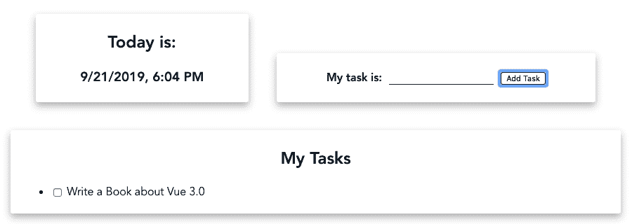
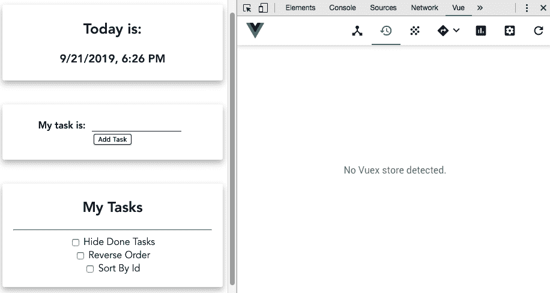
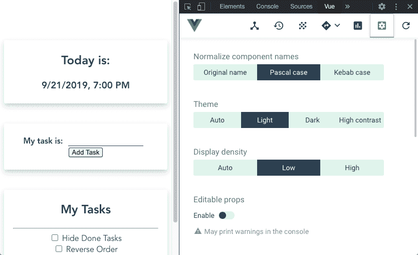

# 三、数据绑定、表单验证、事件和计算属性

数据是目前世界上最有价值的资产，知道如何管理它是必须的。在 Vue 中，我们有权选择如何收集这些数据，根据需要对其进行操作，并将其传送到服务器。

在本章中，我们将进一步了解数据操作和数据处理过程、表单验证、数据过滤、如何向用户显示这些数据，以及如何以不同于应用内部的方式呈现这些数据。

我们将学习如何使用`vue-devtools`深入 Vue 组件，了解我们的数据和应用发生了什么。

在本章中，我们将介绍以下配方：

*   创建“hello world”组件
*   使用双向数据绑定创建输入表单
*   向元素添加事件侦听器
*   从输入中删除 v 模型
*   创建动态待办事项列表
*   创建计算属性并探索其工作方式
*   使用自定义过滤器显示更清晰的数据和文本
*   使用 Vuelidate 添加表单验证
*   为列表创建过滤器和分类器
*   创建条件筛选以对列表数据进行排序
*   添加自定义样式和过渡
*   使用`vue-devtools`调试应用

# 技术要求

在本章中，我们将使用**Node.js**和**Vue CLI****。**

Attention, Windows users—you need to install an `npm` package called `windows-build-tools` to be able to install the following required packages. To do this, open PowerShell as administrator and execute the following command:
`> npm install -g windows-build-tools`.

要安装**Vue CLI**，您需要打开终端（macOS 或 Linux）或命令提示符/PowerShell（Windows）并执行以下命令：

```js
> npm install -g @vue/cli @vue/cli-service-global
```

# 创建“hello world”组件

Vue 应用是各种组件的组合，由 Vue 框架绑定在一起并进行编排。了解如何制作组件非常重要。每个构件就像墙上的一块砖，需要以一种在放置时不需要在其周围以不同方式重塑其他砖的方式制作。我们将学习如何创建一个基本组件，以及一些重要的原则，这些原则关注于组织和干净的代码。

## 准备

此配方的先决条件如下：

*   Node.js 12+

所需的 Node.js 全局对象如下：

*   `@vue/cli`
*   `@vue/cli-service-global`

## 怎么做。。。

为了启动我们的组件，我们可以按照[C](02.html)[第 2 章](02.html)、**引入 TypeScript 和 Vue 生态系统*中的“使用 Vue CLI 创建您的第一个项目”中的方法，使用 Vue CLI 创建 Vue 项目，或者启动一个新项目。*

 *要启动新的，请打开终端（macOS 或 Linux）或命令提示符/PowerShell（Windows）并执行以下命令：

```js
> vue create my-component
```

**命令行界面**（**CLI**将询问一些有助于创建项目的问题。您可以使用箭头键导航，*输入*键继续，以及*空格键*选择一个选项。选择**`default`**选项：

```js
? Please pick a preset: (Use arrow keys)
❯ default (babel, eslint) 
  Manually select features ‌
```

让我们按照以下步骤创建第一个“hello world”组件：

1.  让我们在`src/components`文件夹中创建一个名为`CurrentTime.vue`的新文件。
2.  在这个文件中，我们将从组件的`<template>`部分开始。它将是一个阴影框卡，显示当前日期，格式为：

```js
<template>
  <div class='cardBox'>
    <div class='container'>
      <h2>Today is:</h2>
      <h3>{{ getCurrentDate }}</h3>
    </div>
  </div>
</template>
```

3.  现在，我们需要创建`<script>`部分。我们将从`name`属性开始。这将在使用`vue-devtools`调试我们的应用时使用，以识别我们的组件，并帮助**集成开发环境**（**IDE**）。对于`getCurrentDate`计算属性，我们将创建一个`computed`属性，该属性将返回当前日期，由`Intl`浏览器功能格式化：

```js
<script>
export default {
  name: 'CurrentTime',
  computed: {
    getCurrentDate() {
      const browserLocale =
        navigator.languages && navigator.languages.length
          ? navigator.languages[0]
          : navigator.language;
      const intlDateTime = new Intl.DateTimeFormat(
        browserLocale, 
        {
          year: 'numeric',
          month: 'numeric',
          day: 'numeric',
          hour: 'numeric',
          minute: 'numeric'
        });

      return intlDateTime.format(new Date());
    }
  }
};
</script>
```

4.  要设置方框的样式，我们需要在`src`文件夹中创建一个`style.css`文件，然后将`cardBox`样式添加到其中：

```js
.cardBox {
  box-shadow: 0 5px 10px 0 rgba(0, 0, 0, 0.2);
  transition: 0.3s linear;
  max-width: 33%;
  border-radius: 3px;
  margin: 20px;
}

.cardBox:hover {
  box-shadow: 0 10px 20px 0 rgba(0, 0, 0, 0.2);
}

.cardBox>.container {
  padding: 4px 18px;
}

[class*='col-'] {
  display: inline-block;
}

@media only screen and (max-width: 600px) {
  [class*='col-'] {
    width: 100%;
  }

  .cardBox {
    margin: 20px 0;
  }
}

@media only screen and (min-width: 600px) {
  .col-1 {width: 8.33%;}
  .col-2 {width: 16.66%;}
  .col-3 {width: 25%;}
  .col-4 {width: 33.33%;}
  .col-5 {width: 41.66%;}
  .col-6 {width: 50%;}
  .col-7 {width: 58.33%;}
  .col-8 {width: 66.66%;}
  .col-9 {width: 75%;}
  .col-10 {width: 83.33%;}
  .col-11 {width: 91.66%;}
  .col-12 {width: 100%;}
}

@media only screen and (min-width: 768px) {
  .col-1 {width: 8.33%;}
  .col-2 {width: 16.66%;}
  .col-3 {width: 25%;}
  .col-4 {width: 33.33%;}
  .col-5 {width: 41.66%;}
  .col-6 {width: 50%;}
  .col-7 {width: 58.33%;}
  .col-8 {width: 66.66%;}
  .col-9 {width: 75%;}
  .col-10 {width: 83.33%;}
  .col-11 {width: 91.66%;}
  .col-12 {width: 100%;}
}

@media only screen and (min-width: 992px) {
  .col-1 {width: 8.33%;}
  .col-2 {width: 16.66%;}
  .col-3 {width: 25%;}
  .col-4 {width: 33.33%;}
  .col-5 {width: 41.66%;}
  .col-6 {width: 50%;}
  .col-7 {width: 58.33%;}
  .col-8 {width: 66.66%;}
  .col-9 {width: 75%;}
  .col-10 {width: 83.33%;}
  .col-11 {width: 91.66%;}
  .col-12 {width: 100%;}
}

@media only screen and (min-width: 1200px) {
  .col-1 {width: 8.33%;}
  .col-2 {width: 16.66%;}
  .col-3 {width: 25%;}
  .col-4 {width: 33.33%;}
  .col-5 {width: 41.66%;}
  .col-6 {width: 50%;}
  .col-7 {width: 58.33%;}
  .col-8 {width: 66.66%;}
  .col-9 {width: 75%;}
  .col-10 {width: 83.33%;}
  .col-11 {width: 91.66%;}
  .col-12 {width: 100%;}
}
```

5.  我们需要在`App.vue`文件中看到它：

```js
<template>
  <div id='app'>
    <current-time />
  </div>
</template>

<script>
import CurrentTime from './components/CurrentTime.vue';

export default {
  name: 'app',
  components: {
    CurrentTime
  }
}
</script>
```

6.  在`main.js`文件中，我们需要导入要包含在 Vue 应用中的`style.css`文件：

```js
import Vue from 'vue';
import App from './App.vue';
import './style.css';

Vue.config.productionTip = false

new Vue({
  render: h => h(App),
}).$mount('#app')
```

7.  要运行服务器并查看组件，您需要打开终端（macOS 或 Linux）或命令提示符/PowerShell（Windows）并执行以下命令：

```js
> npm run serve
```

以下是渲染并运行的组件：


## 它是如何工作的。。。

Vue 组件的工作原理几乎与 Node.js 包类似。要在代码中使用它，需要导入组件，然后在要使用的组件的`components`属性中声明它。

与砖墙一样，Vue 应用由调用和使用其他组件的组件组成。

对于我们的组件，我们使用了`Intl.DateTimeFormat`函数，这是一个本机函数，可用于格式化日期并将其解析到声明的位置。为了获得本地格式，我们使用了`navigator`全局变量。

## 另见

有关`Intl.DateTimeFormat`的更多信息，请访问[https://developer.mozilla.org/en-US/docs/Web/JavaScript/Reference/Global_Objects/DateTimeFormat](https://developer.mozilla.org/en-US/docs/Web/JavaScript/Reference/Global_Objects/DateTimeFormat) 。

有关 Vue 组件的更多信息，请访问[https://v3.vuejs.org/guide/single-file-component.html](https://v3.vuejs.org/guide/single-file-component.html)

# 使用双向数据绑定创建输入表单

为了在 web 上收集数据，我们使用 HTML 表单输入。在 Vue 中，可以使用双向数据绑定方法，**文档对象模型**（**DOM**上的输入值传递给 JavaScript，反之亦然。

这使 web 表单更加动态，使您能够在保存数据或将数据发送回服务器之前管理、格式化和验证数据。

## 准备

此配方的先决条件如下：

*   Node.js 12+

所需的 Node.js 全局对象如下：

*   `@vue/cli`
*   `@vue/cli-service-global`

## 怎么做。。。

为了启动我们的组件，我们可以使用 Vue CLI 创建我们的 Vue 项目，如[第 2 章](02.html)中的*使用 Vue CLI 创建您的第一个项目*中所述，*介绍 TypeScript 和 Vue 生态系统*，或者使用*创建“hello world”组件*中的项目“食谱。

现在，让我们按照以下步骤创建具有双向数据绑定的输入表单：

1.  让我们在`src/components`文件夹中创建一个名为`TaskInput.vue`的新文件。
2.  在这个文件中，我们将创建一个具有文本输入和显示文本的组件。此文本将基于在文本输入中键入的内容。在组件的`<template>`部分，我们需要创建一个 HTML 输入和一个`mustache`变量来接收和呈现数据：

```js
<template>
  <div class='cardBox'>
    <div class='container tasker'>
      <strong>My task is: {{ task }}</strong>
      <input 
        type='text'
        v-model='task'
        class='taskInput' />
    </div>
  </div>
</template>
```

3.  现在，在组件的`<script>`部分，我们将命名它并将任务添加到`data`属性中。由于数据总是需要返回`Object`，我们将使用箭头函数直接返回`Object`：

```js
<script>
export default {
  name: 'TaskInput',
  data: () => ({
    task: '',
  }),
};
</script>
```

4.  我们需要为这个组件添加一些样式。在组件的`<style>`部分，我们需要添加`scoped`属性，这样样式只绑定到组件，不会与其他**级联样式表**（**CSS**规则混在一起：

```js
<style scoped>
  .tasker{
    margin: 20px;
  }
  .tasker .taskInput {
    font-size: 14px;
    margin: 0 10px;
    border: 0;
    border-bottom: 1px solid rgba(0, 0, 0, 0.75);
  }
  .tasker button {
    border: 1px solid rgba(0, 0, 0, 0.75);
    border-radius: 3px;
    box-shadow: 0 1px 2px 0 rgba(0, 0, 0, 0.2);
  }
</style>
```

5.  现在，我们需要将这个组件导入到我们的`App.vue`文件中：

```js
<template>
  <div id='app'>
    <current-time class='col-4' />
    <task-input class='col-6' />
  </div>
</template>

<script>
import CurrentTime from './components/CurrentTime.vue';
import TaskInput from './components/TaskInput';

export default {
  name: 'app',
  components: {
    CurrentTime,
    TaskInput,
  }
}
</script>
```

6.  要运行服务器并查看组件，您需要打开终端（macOS 或 Linux）或命令提示符/PowerShell（Windows）并执行以下命令：

```js
> npm run serve
```

这是您渲染并运行的组件：


## 它是如何工作的。。。

当您创建一个 HTML`input`元素并向其中添加一个`v-model`元素时，您正在传递一个内置于 Vue 中的指令，该指令检查输入类型并为我们提供输入的 sugar 语法。这将处理变量和 DOM 值的更新。

这个模型就是所谓的双向数据绑定。如果代码更改了变量，DOM 将重新呈现，如果 DOM 通过用户输入（如[T0]）更改了变量，则 JavaScript 代码可以执行一个函数。

## 另见

有关表单输入绑定的更多信息，请访问[https://v3.vuejs.org/guide/forms.html](https://v3.vuejs.org/guide/forms.html)

# 向元素添加事件侦听器

Vue 中最常见的父子沟通方法是通过道具和事件。在 JavaScript 中，通常向 DOM 树的元素添加事件侦听器，以对特定事件执行函数。在 Vue 中，可以添加监听器并根据需要命名它们，而不是坚持使用 JavaScript 引擎上的名称。

在本食谱中，我们将学习如何创建自定义事件以及如何发出这些事件。

## 准备

此配方的先决条件如下：

*   Node.js 12+

所需的 Node.js 全局对象如下：

*   `@vue/cli`
*   `@vue/cli-service-global`

## 怎么做。。。

为了启动我们的组件，我们可以使用 Vue CLI 创建我们的 Vue 项目，如[第 2 章](02.html)*中的*使用 Vue CLI*创建您的第一个项目中所述，介绍 TypeScript 和 Vue 生态系统*，或者使用*中的项目创建具有双向数据绑定的输入表单*“食谱。

按照以下步骤在 Vue 上的元素中添加事件侦听器：

1.  创建新组件或打开`TaskInput.vue`文件。
2.  在`<template>`部分，我们将添加一个 button 元素，并使用`v-on`指令向 button click 事件添加一个事件监听器。我们将从组件中删除`{{ task }}`变量，因为从现在起它将被发出，并且不再显示在组件上：

```js
<template>
  <div class='cardBox'>
    <div class='container tasker'>
      <strong>My task is:</strong>
      <input 
        type='text' 
        v-model='task' 
        class='taskInput' />
      <button 
        v-on:click='addTask'>
            Add Task
      </button>
    </div>
  </div>
</template>
```

3.  在组件的`<script>`部分，我们需要添加一个方法来处理 click 事件。此方法将命名为`addTask`。该方法将发出一个名为`add-task`的事件，并发送数据上的任务。之后，将重置组件上的任务：

```js
<script>
export default {
  name: 'TaskInput',
  data: () => ({
    task: '',
  }),
  methods: {
    addTask(){
      this.$emit('add-task', this.task);
      this.task = '';
    },
  }
};
</script>
```

4.  在`App.vue`文件中，我们需要在组件上添加一个事件侦听器绑定。此侦听器将附加到`add-task`事件。我们将使用`v-on`指令的简称`@`。触发时，事件将调用方法`addNewTask`，该方法将发送新任务已添加的警报：

```js
<template>
  <div id='app'>
    <current-time class='col-4' />
    <task-input 
      class='col-6'
      @add-task='addNewTask'
    />
  </div>
</template>
```

5.  现在，让我们创建`addNewTask`方法。这将接收任务作为参数，并向用户显示警报，显示任务已添加：

```js
<script>
import CurrentTime from './components/CurrentTime.vue';
import TaskInput from './components/TaskInput';

export default {
  name: 'app',
  components: {
    CurrentTime,
    TaskInput,
  },
  methods:{
    addNewTask(task){
      alert(`New task added: ${task}`);
    },
  },
}
</script>
```

6.  要运行服务器并查看组件，您需要打开终端（macOS 或 Linux）或命令提示符/PowerShell（Windows）并执行以下命令：

```js
> npm run serve
```

这是您渲染并运行的组件：


## 它是如何工作的。。。

Vue 使用`v-on`事件处理指令读取 HTML 事件。当我们将[T1]指令附加到按钮上时，我们在按钮上添加了一个侦听器，以便在用户单击按钮时执行一个函数。

该函数在组件方法上声明。该函数在被调用时将发出一个事件，表示任何将该组件作为子组件使用的组件都可以使用[T0]指令侦听它。

## 另见

有关事件处理的更多信息，请访问[https://v3.vuejs.org/guide/events.html](https://v3.vuejs.org/guide/events.html)

# 从输入中删除 v 模型

如果我告诉你在`v-model`的魔力背后有很多代码使得我们的魔法糖语法发生了呢？如果我告诉你兔子洞可以足够深，你可以通过事件和输入值控制一切可能发生的事情，会怎么样？

我们将学习如何提取[T0]指令的 sugar 语法，并将其转换为其背后的基本语法。

## 准备

此配方的先决条件如下：

*   Node.js 12+

所需的 Node.js 全局对象如下：

*   `@vue/cli`
*   `@vue/cli-service-global`

## 怎么做。。。

为了启动我们的组件，我们可以使用 Vue CLI 创建我们的 Vue 项目，正如在[第 2 章](02.html)*中的*使用 Vue CLI*创建您的第一个项目中所学到的，介绍了 TypeScript 和 Vue 生态系统*，或者使用*中的项目将事件侦听器添加到元素*配方

在以下步骤中，我们将从输入中删除[T0]指令 sugar 语法：

1.  打开`TaskInput.vue`文件。
2.  在组件的`<template>`块中，找到`v-model`指令。我们将删除[T2]指令。然后，我们需要向名为`v-bind:value`或简称为`:value`的输入添加一个新绑定，并向 HTML`input`元素添加一个事件侦听器。我们需要使用`v-on:input`指令或缩短版本`@input`向`input`事件添加事件侦听器。输入绑定将接收任务值作为参数，事件侦听器将接收值属性，其中它将使任务变量等于事件值的值：

```js
<template>
  <div class='cardBox'>
    <div class='container tasker'>
      <strong>My task is:</strong>
      <input 
        type='text' 
        :value='task' 
        @input='task = $event.target.value' 
        class='taskInput' 
      />
      <button v-on:click='addTask'>
        Add Task
      </button>
    </div>
  </div>
</template>
```

3.  要运行服务器并查看组件，您需要打开终端（macOS 或 Linux）或命令提示符/PowerShell（Windows）并执行以下命令：

```js
> npm run serve 
```

## 它是如何工作的。。。

作为一种糖类语法，`v-model`指令可以为您自动向元素声明绑定和事件侦听器，但其副作用是您无法完全控制可以实现的功能。

如我们所见，例如，绑定值可以是变量、方法、计算属性或 Vuex getter。对于事件侦听器，它可以是函数，也可以是变量赋值的直接声明。当发出事件并将其传递给 Vue 时，`$event`变量用于传递事件。在本例中，与普通 JavaScript 一样，为了捕获输入的值，我们需要使用`event.target.value`值。

## 另见

有关事件处理的更多信息，请访问[https://v3.vuejs.org/guide/events.html](https://v3.vuejs.org/guide/events.html)

# 创建动态待办事项列表

每个程序员在学习新语言时首先创建的项目之一是待办事项列表。这样做可以让我们了解更多关于状态和数据操作的语言过程。

我们将使用 Vue 制作待办事项列表。我们将使用我们在前面的食谱中学习和创造的内容。

## 准备

此配方的先决条件如下：

*   Node.js 12+

所需的 Node.js 全局对象如下：

*   `@vue/cli`
*   `@vue/cli-service-global`

## 怎么做。。。

有一些基本原则涉及到做一个待办事项的申请，它必须有一个任务列表；这些任务可以标记为“完成”和“撤消”，并且可以对列表进行筛选和排序。现在，我们将学习如何接受任务并将其添加到任务列表中。

为了启动我们的组件，我们可以使用 Vue CLI 创建我们的 Vue 项目，如[第 2 章](02.html)*中的*使用 Vue CLI*创建您的第一个项目中所述，介绍 TypeScript 和 Vue 生态系统*，或者使用*中的项目从输入*中删除 v 模型。

现在，按照以下步骤使用 Vue 和以前的配方创建动态待办事项列表：

1.  在`App.vue`文件中，我们将创建任务数组。此任务将在`TaskInput.vue`组件每次发出消息时完成。我们将向该数组中添加一个对象，其中包含任务以及创建任务的当前日期。任务完成的日期目前尚未定义。为此，在组件的`<script>`部分，我们需要创建一个接收任务的方法，并将当前日期的任务添加到`taskList`数组中：

```js
<script>
import CurrentTime from './components/CurrentTime.vue';
import TaskInput from './components/TaskInput';

export default {
  name: 'TodoApp',
  components: {
    CurrentTime,
    TaskInput,
  },
  data: () => ({
    taskList: [],
  }),
  methods:{
    addNewTask(task){
      this.taskList.push({
        task,
        createdAt: Date.now(),
        finishedAt: undefined,
      })
    },
  },
}
</script>
```

2.  现在，我们需要在`<template>`部分呈现此列表。我们将使用 Vue 的`v-for`指令迭代任务列表。当我们将该指令与数组一起使用时，它允许我们访问两个属性：项本身和项的索引。我们将使用项来渲染它，并使用索引来制作渲染元素的键。我们需要添加一个复选框，当标记该复选框时，该复选框将调用一个函数，该函数在任务完成时更改任务的状态和显示：

```js
<template>
  <div id='app'>
    <current-time class='col-4' />
    <task-input class='col-6' @add-task='addNewTask' />
    <div class='col-12'>
      <div class='cardBox'>
        <div class='container'>
          <h2>My Tasks</h2>
          <ul class='taskList'>
            <li 
              v-for='(taskItem, index) in taskList'
              :key='`${index}_${Math.random()}`'
            >
              <input type='checkbox' 
                :checked='!!taskItem.finishedAt' 
                @input='changeStatus(index)'
              /> 
              {{ taskItem.task }} 
              <span v-if='taskItem.finishedAt'>
                {{ taskItem.finishedAt }}
              </span>
            </li>
          </ul>
        </div>
      </div>
    </div>
  </div>
</template>
```

It's always important to remember that the key in the iterator needs to be unique. This is needed because the render function needs to knows which elements were changed. In the example, we added the `Math.random()` function to the index to generate a unique key, because the index of the first elements of the array is always the same number when the number of elements is reduced.

3.  我们需要在`App.vue`的`methods`属性上创建`changeStatus`函数。此函数将接收任务的索引作为参数，然后转到任务数组并更改`finishedAt`属性，这是任务完成时的标记：

```js
changeStatus(taskIndex){
  const task = this.taskList[taskIndex];
    if(task.finishedAt){
      task.finishedAt = undefined;
    } else {
      task.finishedAt = Date.now();
    }
}
```

4.  现在，我们需要将任务文本添加到屏幕的左侧。在组件的`<style>`部分，我们将使其作用域化并添加自定义类：

```js
<style scoped>
  .taskList li{
    text-align: left;
  }
</style>
```

5.  要运行服务器并查看组件，您需要打开终端（macOS 或 Linux）或命令提示符/PowerShell（Windows）并执行以下命令：

```js
> npm run serve
```

以下是渲染并运行的组件：



## 它是如何工作的。。。

当我们从组件接收到发出的消息时，我们用更多的数据将消息水合，并将其推送到本地数组变量。

在模板中，我们迭代该数组，使其成为任务列表。这将显示我们需要执行的任务、要在任务完成时标记的复选框以及任务完成的时间。

当用户单击复选框时，它会执行一个函数，将当前任务标记为已完成。如果任务已经完成，函数会将`finishedAt`属性设置为`undefined`。

## 另见

有关列表呈现的更多信息，请访问[https://v3.vuejs.org/guide/list.html#mapping-an-array-to-elements-with-v-for](https://v3.vuejs.org/guide/list.html#mapping-an-array-to-elements-with-v-for)

您可以在[找到更多关于条件渲染的信息 https://v3.vuejs.org/guide/conditional.html#v-如果](https://v3.vuejs.org/guide/conditional.html#v-if)

有关`Math.random`的更多信息，请访问[https://developer.mozilla.org/en-US/docs/Web/JavaScript/Reference/Global_Objects/Math/random](https://developer.mozilla.org/en-US/docs/Web/JavaScript/Reference/Global_Objects/Math/random) 。

# 创建计算属性并了解其工作方式

想象一下，每次必须获取被操纵的数据时，都需要执行一个函数。想象一下，您需要获取需要经过某个过程的特定数据，并且每次都需要通过一个函数来执行它。这类工作不容易维持。存在计算属性来解决这些问题。使用计算属性可以更容易地获取需要预处理甚至缓存的数据，而无需执行任何其他外部存储功能。

## 准备

此配方的先决条件如下：

*   Node.js 12+

所需的 Node.js 全局对象如下：

*   `@vue/cli`
*   `@vue/cli-service-global`

## 怎么做。。。

我们将继续我们的待办事项列表项目，或者您可以使用 Vue CLI 创建一个新的 Vue 项目，如[第 2 章](02.html)*中的*使用 Vue CLI*创建您的第一个项目中所述，介绍 TypeScript 和 Vue 生态系统*。

现在，按照以下步骤创建计算属性并了解其工作原理：

1.  在`App.vue`文件的`<script>`部分，我们将在`data`和`method`之间添加一个新属性，称为`computed`。这是放置`computed`属性的位置。我们将创建一个名为`displayList`的新计算属性，该属性将用于在模板上呈现最终列表：

```js
<script>
import CurrentTime from './components/CurrentTime.vue';
import TaskInput from './components/TaskInput';

export default {
  name: 'TodoApp',
  components: {
    CurrentTime,
    TaskInput
  },
  data: () => ({
    taskList: []
  }),
  computed: {
    displayList(){
      return this.taskList;
    },
  },
  methods: {
    addNewTask(task) {
      this.taskList.push({
        task,
        createdAt: Date.now(),
        finishedAt: undefined
      });
    },
    changeStatus(taskIndex){
      const task = this.taskList[taskIndex];
      if(task.finishedAt){
        task.finishedAt = undefined;
      } else {
        task.finishedAt = Date.now();
      }
    }
  }
};
</script>
```

目前，`displayList`属性只是返回变量的缓存值，而不是直接变量本身。

2.  现在，在`<template>`部分，我们需要更改获取列表的位置：

```js
<template>
  <div id='app'>
    <current-time class='col-4' />
    <task-input class='col-6' @add-task='addNewTask' />
    <div class='col-12'>
      <div class='cardBox'>
        <div class='container'>
          <h2>My Tasks</h2>
          <ul class='taskList'>
            <li 
              v-for='(taskItem, index) in displayList'
              :key='`${index}_${Math.random()}`'
            >
              <input type='checkbox' 
                :checked='!!taskItem.finishedAt' 
                @input='changeStatus(index)'
              /> 
              {{ taskItem.task }} 
              <span v-if='taskItem.finishedAt'>
                {{ taskItem.finishedAt }}
              </span>
            </li>
          </ul>
        </div>
      </div>
    </div>
  </div>
</template>
```

3.  要运行服务器并查看您的组件，您需要打开终端（macOS 或 Linux）或命令提示符/PowerShell*l*（Windows）并执行以下命令：

```js
> npm run serve
```

## 它是如何工作的。。。

当使用`computed`属性向模板传递值时，该值现在被缓存。这意味着我们将仅在更新值时触发渲染过程。同时，我们确保模板不使用该变量进行渲染，因此不能在模板上更改它，因为它是该变量的缓存副本。

使用此过程，我们可以获得最佳性能，因为我们不会浪费处理时间来重新呈现 DOM 树，以进行对显示的数据没有影响的更改。这是因为，如果某些内容发生更改，并且结果相同，`computed`属性将缓存结果，并且不会更新最终结果。

## 另见

有关计算属性的更多信息，请访问[https://v3.vuejs.org/guide/computed.html.](https://v3.vuejs.org/guide/computed.html)

# 使用自定义过滤器显示更清晰的数据和文本

有时，您可能会发现用户甚至您都无法读取 Unix 时间戳或其他`DateTime`格式。我们如何解决这个问题？在 Vue 中呈现数据时，可以使用我们称之为过滤器的方法。

想象一系列数据流经的管道。数据以一种形状进入每个管道，以另一种形状退出。这就是 Vue 中的过滤器的外观。您可以在同一个变量上放置一系列过滤器，以便在代码保持不变的情况下对其进行格式化、重塑，并最终显示不同的数据。初始变量的代码在这些管道中是不可变的。

## 准备

此配方的先决条件如下：

*   Node.js 12+

所需的 Node.js 全局对象如下：

*   `@vue/cli`
*   `@vue/cli-service-global`

## 怎么做。。。

我们将继续我们的待办事项列表项目，或者您可以使用 Vue CLI 创建一个新的 Vue 项目，如[第 2 章](02.html)*中的*使用 Vue CLI*创建您的第一个项目中所述，介绍 TypeScript 和 Vue 生态系统*。

按照以下步骤创建第一个自定义 Vue 筛选器：

1.  在`App.vue`文件的`<script>`部分，在方法中，在该属性内创建一个`formatDate`函数。此功能将接收`value`作为参数并进入过滤管。我们可以检查该值是否为数字，因为我们知道时间是基于 Unix 时间戳格式的。如果它是一个数字，我们将根据当前浏览器位置格式化并返回格式化值。如果传递的值不是数字，我们只返回传递的值：

```js
<script>
  import CurrentTime from './components/CurrentTime.vue';
  import TaskInput from './components/TaskInput';

  export default {
    name: 'TodoApp',
    components: {
      CurrentTime,
      TaskInput
    },
    data: () => ({
      taskList: []
    }),
    computed: {
      displayList() {
        return this.taskList;
      }
    },
    methods: {
      formatDate(value) {
        if (!value) return '';
        if (typeof value !== 'number') return value;

        const browserLocale =
          navigator.languages && navigator.languages.length
            ? navigator.languages[0]
            : navigator.language;
        const intlDateTime = new Intl.DateTimeFormat(
          browserLocale, 
          {
            year: 'numeric',
            month: 'numeric',
            day: 'numeric',
            hour: 'numeric',
            minute: 'numeric'
          });

        return intlDateTime.format(new Date(value));
      },
      addNewTask(task) {
        this.taskList.push({
          task,
          createdAt: Date.now(),
          finishedAt: undefined
        });
      },
      changeStatus(taskIndex) {
        const task = this.taskList[taskIndex];
        if (task.finishedAt) {
          task.finishedAt = undefined;
        } else {
          task.finishedAt = Date.now();
        }
      }
    }
  };
</script>
```

2.  在组件的`<template>`部分，我们需要将变量传递给 filter 方法。为此，我们需要找到`taskItem.finishedAt`属性，并将其作为`formatDate`方法的参数。我们将添加一些文本来表示任务是日期开始时的`Done at:`：

```js
<template>
  <div id='app'>
    <current-time class='col-4' />
    <task-input class='col-6' @add-task='addNewTask' />
    <div class='col-12'>
      <div class='cardBox'>
        <div class='container'>
          <h2>My Tasks</h2>
          <ul class='taskList'>
            <li 
              v-for='(taskItem, index) in displayList'
              :key='`${index}_${Math.random()}`'
            >
              <input type='checkbox' 
                :checked='!!taskItem.finishedAt' 
                @input='changeStatus(index)'
              /> 
              {{ taskItem.task }} 
              <span v-if='taskItem.finishedAt'> | 
                Done at: 
                {{ formatDate(taskItem.finishedAt) }}
              </span>
            </li>
          </ul>
        </div>
      </div>
    </div>
  </div>
</template>
```

3.  要运行服务器并查看组件，请打开终端（macOS 或 Linux）或命令提示符/PowerShell（Windows），然后执行以下命令：

```js
> npm run serve
```

以下是渲染并运行的组件：


## 它是如何工作的。。。

筛选器是接收值的方法，必须返回要在文件的`<template>`部分显示的值，或在 Vue 属性中使用的值。

当我们将值传递给`formatDate`方法时，我们知道它是一个有效的 Unix 时间戳，因此可以调用一个新的`Date`类构造函数，将`value`作为参数传递，因为 Unix 时间戳是一个有效的日期构造函数。

我们过滤器背后的代码是`Intl.DateTimeFormat`函数，这是一个本机函数，可用于格式化日期并将其解析到声明的位置。为了获得本地格式，我们使用了`navigator`全局变量。

## 另见

有关`Intl.DateTimeFormat`的更多信息，请访问[https://developer.mozilla.org/en-US/docs/Web/JavaScript/Reference/Global_Objects/DateTimeFormat](https://developer.mozilla.org/en-US/docs/Web/JavaScript/Reference/Global_Objects/DateTimeFormat) 。

# 使用 Vuelidate 添加表单验证

最初，JavaScript 仅用于在将 HTML 表单发送到服务器之前验证这些表单；我们没有任何 JavaScript 框架，也没有今天的 JavaScript 生态系统。但是，有一点是相同的：表单验证首先由 JavaScript 引擎完成，然后再将表单发送到服务器。

我们将学习如何在发送输入表单之前使用 Vue 生态系统中最流行的库之一验证输入表单。

## 准备

此配方的先决条件如下：

*   Node.js 12+

所需的 Node.js 全局对象如下：

*   `@vue/cli`
*   `@vue/cli-service-global`

## 怎么做。。。

我们将继续我们的待办事项列表项目，或者您可以使用 Vue CLI 创建一个新的 Vue 项目，如[第 2 章](02.html)*中的*使用 Vue CLI*创建您的第一个项目中所述，介绍 TypeScript 和 Vue 生态系统*。

现在，按照以下步骤将表单验证添加到 Vue 项目和表单组件中：

1.  要安装**Vuelidate**，您需要打开终端（macOS 或 Linux）或命令提示符/PowerShell（Windows）并执行以下命令：

```js
> npm install vuelidate --save
```

2.  要将 Vuelidate 插件添加到 Vue 应用中，我们需要将其导入并添加到`src`文件夹中`main.js`文件中的 Vue 中：

```js
import Vue from 'vue';
import App from './App.vue';
import Vuelidate from 'vuelidate';
import './style.css';

Vue.config.productionTip = false
Vue.use(Vuelidate);

new Vue({
  render: h => h(App),
}).$mount('#app')
```

3.  在`TaskInput.vue`文件中，我们将向 Vue 对象添加一个新属性。此属性由安装的新插件解释。在对象的末尾，我们将添加`validations`属性，在该属性中，我们将添加模型*的名称。*模型是插件将检查验证的数据或计算属性的直接名称：

```js
<script>
export default {
  name: 'TaskInput',
  data: () => ({
    task: ''
  }),
  methods: {
    addTask() {
      this.$emit('add-task', this.task);
      this.task = '';
    }
  },
  validations: {
    task: {}
  }
};
</script>
```

4.  现在，我们需要导入我们想要使用的插件上已经存在的规则，这些规则将是`required`和`minLength`。导入后，我们会将这些规则添加到模型中：

```js
<script>
import { required, minLength } from 'vuelidate/lib/validators';

export default {
  name: 'TaskInput',
  data: () => ({
    task: ''
  }),
  methods: {
    addTask() {
      this.$emit('add-task', this.task);
      this.task = '';
    }
  },
  validations: {
    task: {
      required,
      minLength: minLength(5),
    }
  }
};
</script>
```

5.  现在，我们需要在发出事件之前添加验证。我们将使用`$touch`内置函数告知插件该字段已被用户触摸，并检查验证。如果有任何字段与用户有任何交互，插件将相应地设置标志。如果没有错误，我们将发出事件，并使用`$reset`函数重置验证。为此，我们将更改`addTask`方法：

```js
addTask() {
    this.$v.task.$touch();

    if (this.$v.task.$error) return false;

    this.$emit('add-task', this.task);
    this.task = '';
    this.$v.task.$reset();
    return true;
}
```

6.  为了提醒用户该字段有一些错误，我们将使输入将样式更改为完整的红色边框，并显示红色文本。为此，我们需要在输入字段上创建一个条件类。这将直接连接到模型的`$error`属性：

```js
<template>
  <div class='cardBox'>
    <div class='container tasker'>
      <strong>My task is:</strong>
      <input 
        type='text' 
        :value='task' 
        @input='task = $event.target.value' 
        class='taskInput'
        :class="$v.task.$error ? 'fieldError' : ''" 
      />
      <button v-on:click='addTask'>Add Task</button>
    </div>
  </div>
</template>
```

7.  对于该类，我们可以在`src`文件夹的`style.css`文件中创建一个`fieldError`类：

```js
.fieldError {
  border: 2px solid red !important;
  color: red;
  border-radius: 3px;
}
```

8.  要运行服务器并查看组件，您需要打开终端（macOS 或 Linux）或命令提示符/PowerShell（Windows）并执行以下命令：

```js
> npm run serve
```

以下是渲染并运行的组件：


## 它是如何工作的。。。

一旦安装，Vuelidate 插件将向 Vue 原型添加一个新的`$v`属性，并检查 Vue 对象中的一个新对象属性，称为`validations`。当这个属性被定义并且有一些规则时，插件会在每次更新时检查模型的规则。

使用这个新的 Vue 原型，我们可以在代码中检查我们定义的规则中的错误，并执行函数告诉插件该字段被用户触摸，以标记为脏字段或重置它。使用这些特性，我们能够根据在任务模型上定义的规则添加一个新的条件类。

任务模型是必需的，至少有五个字符。如果不符合这些规则，插件将用错误标记模型。我们获取此错误并使用它向用户显示任务字段有一个活动错误。当用户满足要求时，错误显示消失，并且可以发出事件。

## 另见

有关 Vuelidate 的更多信息，请访问[https://vuelidate.netlify.com/](https://vuelidate.netlify.com/) 。

有关类和样式绑定的更多信息，请访问[https://v3.vuejs.org/guide/class-and-style.html](https://v3.vuejs.org/guide/class-and-style.html)

# 为列表创建过滤器和分类器

在处理列表时，经常会发现自己使用原始数据。有时，您需要对这些数据进行过滤，以便用户能够读取。要做到这一点，我们需要一个计算属性的组合，以形成最终的过滤器和分类器集。

在本食谱中，我们将学习如何创建一个简单的过滤器和分类器，用于控制初始待办任务列表。

## 准备

此配方的先决条件如下：

*   Node.js 12+

所需的 Node.js 全局对象如下：

*   `@vue/cli`
*   `@vue/cli-service-global`

## 怎么做。。。

我们将继续我们的待办事项列表项目，或者您可以使用 Vue CLI 创建一个新的 Vue 项目，正如在[第 2 章](02.html)*、**介绍 TypeScript 和 Vue 生态系统*中的*使用 Vue CLI*创建您的第一个项目中所学到的。

按照以下步骤向列表中添加一组筛选器和排序：

1.  在`App.vue`文件中，在`<script>`部分，我们将添加新的计算属性；这些将用于排序和筛选。我们将添加三个新的计算属性，`baseList`、`filteredList`和`sortedList`。`baseList`地产将是我们第一次操纵。我们将通过`Array.map`向任务列表添加`id`属性。由于 JavaScript 数组从零开始，我们将把`1`添加到数组的索引中。`filteredList`属性将过滤`baseList`属性并仅返回未完成的任务，`sortedList`属性将对`filteredList`属性进行排序，以便最后添加的`id`属性将首先显示给用户：

```js
<script>
import CurrentTime from "./components/CurrentTime.vue";
import TaskInput from "./components/TaskInput";

export default {
  name: "TodoApp",
  components: {
    CurrentTime,
    TaskInput
  },
  data: () => ({
    taskList: [],
  }),
  computed: {
    baseList() {
      return [...this.taskList]
        .map((t, index) => ({
            ...t,
            id: index + 1
          }));
    },
    filteredList() {
      return [...this.baseList]
            .filter(t => !t.finishedAt);
    },
    sortedList() {
      return [...this.filteredList]
          .sort((a, b) => b.id - a.id);
    },
    displayList() {
      return this.sortedList;
    }
  },
  methods: {
    formatDate(value) {
      if (!value) return "";
      if (typeof value !== "number") return value;

      const browserLocale =
        navigator.languages && navigator.languages.length
          ? navigator.languages[0]
          : navigator.language;
      const intlDateTime = new Intl.DateTimeFormat(browserLocale, {
        year: "numeric",
        month: "numeric",
        day: "numeric",
        hour: "numeric",
        minute: "numeric"
      });

      return intlDateTime.format(new Date(value));
    },
    addNewTask(task) {
      this.taskList.push({
        task,
        createdAt: Date.now(),
        finishedAt: undefined
      });
    },
    changeStatus(taskIndex) {
      const task = this.taskList[taskIndex];

      if (task.finishedAt) {
        task.finishedAt = undefined;
      } else {
        task.finishedAt = Date.now();
      }
    }
  }
};
</script>
```

2.  在`<template>`部分，我们将添加`Task ID`作为指示符，并更改`changeStatus`方法发送参数的方式。因为现在索引是可变的，我们不能用它作为变量；它只是数组上的一个临时索引。我们需要使用任务`id`：

```js
<template>
  <div id="app">
    <current-time class="col-4" />
    <task-input class="col-6" @add-task="addNewTask" />
    <div class="col-12">
      <div class="cardBox">
        <div class="container">
          <h2>My Tasks</h2>
          <ul class="taskList">
            <li 
              v-for="(taskItem, index) in displayList"
              :key="`${index}_${Math.random()}`"
            >
              <input type="checkbox" 
                :checked="!!taskItem.finishedAt" 
                @input="changeStatus(taskItem.id)"
              /> 
              #{{ taskItem.id }} - {{ taskItem.task }} 
              <span v-if="taskItem.finishedAt"> | 
                Done at: 
                {{ formatDate(taskItem.finishedAt) }}
              </span>
            </li>
          </ul>
        </div>
      </div>
    </div>
  </div>
</template>
```

3.  在`changeStatus`方法上，我们也需要更新我们的函数。由于索引现在从`1`开始，我们需要将数组的索引减少 1，以获得元素的实际索引，然后再对其进行更新：

```js
changeStatus(taskId) {
    const task = this.taskList[taskId - 1];

    if (task.finishedAt) {
    task.finishedAt = undefined;
    } else {
    task.finishedAt = Date.now();
    }
}
```

4.  要运行服务器并查看组件，您需要打开终端（macOS 或 Linux）或命令提示符/PowerShell（Windows）并执行以下命令：

```js
> npm run serve
```

以下是渲染并运行的组件：


## 它是如何工作的。。。

`computed`属性作为列表的缓存一起工作，确保对元素的操作没有副作用：

1.  在`baseList`属性中，我们创建了一个具有相同任务的新数组，但在任务中添加了一个新的`id`属性。
2.  在`filteredList`属性，我们接受`baseList`属性，只返回未完成的任务。
3.  在`sortedList`属性中，我们按照任务 ID 按降序对`filteredList`属性中的任务进行排序。

完成所有操作后，`displayList`属性返回被操作数据的结果。

## 另见

有关`Array.prototype.map`的更多信息，请访问[https://developer.mozilla.org/en-US/docs/Web/JavaScript/Reference/Global_Objects/Array/map](https://developer.mozilla.org/en-US/docs/Web/JavaScript/Reference/Global_Objects/Array/map) 。

有关`Array.prototype.filter`的更多信息，请访问[https://developer.mozilla.org/en-US/docs/Web/JavaScript/Reference/Global_Objects/Array/filter](https://developer.mozilla.org/en-US/docs/Web/JavaScript/Reference/Global_Objects/Array/filter) 。

有关`Array.prototype.sort`的更多信息，请访问[https://developer.mozilla.org/en-US/docs/Web/JavaScript/Reference/Global_Objects/Array/sort](https://developer.mozilla.org/en-US/docs/Web/JavaScript/Reference/Global_Objects/Array/sort) 。

# 创建条件筛选器以对列表数据进行排序

完成上一个配方后，应该对数据进行过滤和排序，但您可能需要检查过滤后的数据或需要更改其排序方式。在这个配方中，我们将学习如何创建条件过滤器并对列表中的数据进行排序。

使用一些基本原理，可以收集信息并以多种不同的方式显示。

## 准备

此配方的先决条件如下：

*   Node.js 12+

所需的 Node.js 全局对象如下：

*   `@vue/cli`
*   `@vue/cli-service-global`

## 怎么做。。。

我们将继续我们的待办事项列表项目，或者您可以使用 Vue CLI 创建一个新的 Vue 项目，如[第 2 章](02.html)*中的*使用 Vue CLI*创建您的第一个项目中所述，介绍 TypeScript 和 Vue 生态系统*。

现在，按照以下步骤添加条件筛选器以对列表数据进行排序：

1.  在`App.vue`文件中，在`<script>`部分，我们将更新`computed`属性、`filteredList`、`sortedList`和`displayList`。我们需要在我们的项目中添加三个新变量，`hideDone`、`reverse`和`sortById`。这三个变量都将是布尔变量，并将以默认值`false`开始。`filteredList`属性将检查`hideDone`变量是否为`true`。如果是，它将具有相同的行为，但如果不是，它将显示整个列表，而不显示过滤器。`sortedList`属性将检查`sortById`**变量**是否为`true`。如果是，它将具有相同的行为，但如果不是，它将按照任务的完成日期对列表进行排序。`displayList`**属性**将检查`reverse`变量是否为`true`。如果是，则会反转显示的列表，如果不是，则会有相同的行为：******** 

 ******```js
<script>
import CurrentTime from "./components/CurrentTime.vue";
import TaskInput from "./components/TaskInput";

export default {
  name: "TodoApp",
  components: {
    CurrentTime,
    TaskInput
  },
  data: () => ({
    taskList: [],
    hideDone: false,
    reverse: false,
    sortById: false,
  }),
  computed: {
    baseList() {
      return [...this.taskList]
        .map((t, index) => ({
            ...t,
            id: index + 1
          }));
    },
    filteredList() {
      return this.hideDone
        ? [...this.baseList]
            .filter(t => !t.finishedAt)
        : [...this.baseList];
    },
    sortedList() {
      return [...this.filteredList]
          .sort((a, b) => (
            this.sortById
              ? b.id - a.id
              : (a.finishedAt || 0) - (b.finishedAt || 0)
          ));
    },
    displayList() {
      const taskList = [...this.sortedList];

      return this.reverse 
      ? taskList.reverse() 
      : taskList;
    }
  },
  methods: {
    formatDate(value) {
      if (!value) return "";
      if (typeof value !== "number") return value;

      const browserLocale =
        navigator.languages && navigator.languages.length
          ? navigator.languages[0]
          : navigator.language;

      const intlDateTime = new Intl.DateTimeFormat(browserLocale, {
        year: "numeric",
        month: "numeric",
        day: "numeric",
        hour: "numeric",
        minute: "numeric"
      });

      return intlDateTime.format(new Date(value));
    },
    addNewTask(task) {
      this.taskList.push({
        task,
        createdAt: Date.now(),
        finishedAt: undefined
      });
    },
    changeStatus(taskId) {
      const task = this.taskList[taskId - 1];

      if (task.finishedAt) {
        task.finishedAt = undefined;
      } else {
        task.finishedAt = Date.now();
      }
    }
  }
};
</script>
```

2.  在`<template>`部分，我们需要为这些变量添加控制器。我们将创建三个复选框，通过`v-model`指令直接链接到变量：

```js
<template>
  <div id="app">
    <current-time class="col-4" />
    <task-input class="col-6" @add-task="addNewTask" />
    <div class="col-12">
      <div class="cardBox">
        <div class="container">
          <h2>My Tasks</h2>
          <hr /> 
          <div class="col-4">
            <input 
              v-model="hideDone"
              type="checkbox"
              id="hideDone"
              name="hideDone"
            />
            <label for="hideDone">
              Hide Done Tasks
            </label>
          </div>
          <div class="col-4">
            <input 
              v-model="reverse"
              type="checkbox"
              id="reverse"
              name="reverse"
            />
            <label for="reverse">
              Reverse Order
            </label>
          </div>
          <div class="col-4">
            <input 
              v-model="sortById"
              type="checkbox"
              id="sortById"
              name="sortById"
            />
            <label for="sortById">
              Sort By Id
            </label>
          </div>
          <ul class="taskList">
            <li 
              v-for="(taskItem, index) in displayList"
              :key="`${index}_${Math.random()}`"
            >
              <input type="checkbox" 
                :checked="!!taskItem.finishedAt" 
                @input="changeStatus(taskItem.id)"
              /> 
              #{{ taskItem.id }} - {{ taskItem.task }} 
              <span v-if="taskItem.finishedAt"> | 
                Done at: 
                {{ formatDate(taskItem.finishedAt) }}
              </span>
            </li>
          </ul>
        </div>
      </div>
    </div>
  </div>
</template>
```

3.  要运行服务器并查看组件，您需要打开终端（macOS 或 Linux）或命令提示符/PowerShell（Windows）并执行以下命令：

```js
> npm run serve
```

以下是渲染并运行的组件：


## 它是如何工作的。。。

`computed`属性作为列表的缓存一起工作，确保对元素的操作没有任何副作用。通过条件过程，可以通过变量更改过滤和排序规则，并实时更新显示：

1.  在`filteredList`属性，我们获取`baseList`属性并返回未完成的任务。当`hideDone`变量为`false`时，我们返回了整个列表，没有任何过滤器。
2.  在`sortedList`属性，我们在`filteredList`属性上对任务进行排序。当`sortById`变量为`true`时，列表按 ID 降序排序；当为`false`时，按任务完成时间升序排序。
3.  在`displayList`属性中，当`reverse`变量为`true`时，最终列表被反转。

完成所有操作后，`displayList`**属性返回被操作数据的结果。**

 **这些`computed`属性由用户屏幕上的复选框控制，因此用户可以完全控制他们可以看到什么以及如何看到它。

## 另见

有关`Array.prototype.map`的更多信息，请访问[https://developer.mozilla.org/en-US/docs/Web/JavaScript/Reference/Global_Objects/Array/map](https://developer.mozilla.org/en-US/docs/Web/JavaScript/Reference/Global_Objects/Array/map) 。

有关`Array.prototype.filter`的更多信息，请访问[https://developer.mozilla.org/en-US/docs/Web/JavaScript/Reference/Global_Objects/Array/filter](https://developer.mozilla.org/en-US/docs/Web/JavaScript/Reference/Global_Objects/Array/filter) 。

有关`Array.prototype.sort`的更多信息，请访问[https://developer.mozilla.org/en-US/docs/Web/JavaScript/Reference/Global_Objects/Array/sort](https://developer.mozilla.org/en-US/docs/Web/JavaScript/Reference/Global_Objects/Array/sort) 。

# 添加自定义样式和过渡

在组件中添加样式是一种很好的做法，因为它允许您更清楚地向用户显示正在发生的事情。通过这样做，您可以向用户显示视觉响应，并在应用上提供更好的体验。

在这个配方中，我们将学习如何添加一种新的条件类绑定。我们将使用 CSS 效果与每个新的 Vue 更新附带的重新渲染相混合。

## 准备

此配方的先决条件如下：

*   Node.js 12+

所需的 Node.js 全局对象如下：

*   `@vue/cli`
*   `@vue/cli-service-global`

## 怎么做。。。

我们将继续我们的待办事项列表项目，或者您可以使用 Vue CLI 创建一个新的 Vue 项目，如[第 2 章](02.html)*中的*使用 Vue CLI*创建您的第一个项目中所述，介绍 TypeScript 和 Vue 生态系统*。

按照以下步骤向组件添加自定义样式和过渡：

1.  在`App.vue`文件中，我们将向已完成任务的列表项中添加一个条件类：

```js
<template>
  <div id="app">
    <current-time class="col-4" />
    <task-input class="col-6" @add-task="addNewTask" />
    <div class="col-12">
      <div class="cardBox">
        <div class="container">
          <h2>My Tasks</h2>
          <hr /> 
          <div class="col-4">
            <input 
              v-model="hideDone"
              type="checkbox"
              id="hideDone"
              name="hideDone"
            />
            <label for="hideDone">
              Hide Done Tasks
            </label>
          </div>
          <div class="col-4">
            <input 
              v-model="reverse"
              type="checkbox"
              id="reverse"
              name="reverse"
            />
            <label for="reverse">
              Reverse Order
            </label>
          </div>
          <div class="col-4">
            <input 
              v-model="sortById"
              type="checkbox"
              id="sortById"
              name="sortById"
            />
            <label for="sortById">
              Sort By Id
            </label>
          </div>
          <ul class="taskList">
            <li 
              v-for="(taskItem, index) in displayList"
              :key="`${index}_${Math.random()}`"
              :class="!!taskItem.finishedAt ? 'taskDone' : ''"
            >
              <input type="checkbox" 
                :checked="!!taskItem.finishedAt" 
                @input="changeStatus(taskItem.id)"
              /> 
              #{{ taskItem.id }} - {{ taskItem.task }} 
              <span v-if="taskItem.finishedAt"> | 
                Done at: 
                {{ formatDate(taskItem.finishedAt) }}
              </span>
            </li>
          </ul>
        </div>
      </div>
    </div>
  </div>
</template>
```

2.  在组件的`<style>`部分，我们将为`taskDone`CSS 类创建 CSS 样式表类。我们需要使列表中的项目之间有一个分隔符；然后，我们将使列表具有条纹样式；当它们被标记为“完成”时，背景会发生变化并产生效果。要在线条和条纹列表或斑马样式之间添加分隔符，我们需要添加一个 CSS 样式表规则，该规则适用于我们列表中的每个`even nth-child`**：**

 **```js
<style scoped>
  .taskList li {
    list-style: none;
    text-align: left;
    padding: 5px 10px;
    border-bottom: 1px solid rgba(0,0,0,0.15);
  }

  .taskList li:last-child {
    border-bottom: 0px;
  }

  .taskList li:nth-child(even){
    background-color: rgba(0,0,0,0.05);
  }
</style>
```

3.  为了在背景上添加效果，当任务完成时，在`<style>`部分的末尾，我们将添加一个 CSS 动画关键帧，指示背景颜色的变化，并将此动画应用于`.taskDone`CSS 类：

```js
<style scoped>
  .taskList li {
    list-style: none;
    text-align: left;
    padding: 5px 10px;
    border-bottom: 1px solid rgba(0,0,0,0.15);
  }

  .taskList li:last-child {
    border-bottom: 0px;
  }

  .taskList li:nth-child(even){
    background-color: rgba(0,0,0,0.05);
  }

  @keyframes colorChange {
    from{
      background-color: inherit;
    }
    to{
      background-color: rgba(0, 160, 24, 0.577); 
    }
  }

  .taskList li.taskDone{
    animation: colorChange 1s ease;
    background-color: rgba(0, 160, 24, 0.577);
  }
</style>
```

4.  要运行服务器并查看组件，您需要打开终端（macOS 或 Linux）或命令提示符/PowerShell（Windows）并执行以下命令：

```js
> npm run serve
```

以下是渲染并运行的组件：


## 它是如何工作的。。。

每次应用中的一个新项标记为 done 时，`displayList`属性就会更新并触发组件的重新呈现。

因为我们的动画是附在背景上的。

## 另见

有关 CSS 动画的更多信息，请访问[https://developer.mozilla.org/en-US/docs/Web/CSS/CSS_Animations/Using_CSS_animations](https://developer.mozilla.org/en-US/docs/Web/CSS/CSS_Animations/Using_CSS_animations) 。

有关类和样式绑定的更多信息，请访问[https://v3.vuejs.org/guide/class-and-style.html](https://v3.vuejs.org/guide/class-and-style.html)

# 使用 vue devtools 调试应用

`vue-devtools`是每个 Vue 开发人员必须具备的功能。此工具向我们显示 Vue 组件、路由、事件和 vuex 的深度。

借助于`vue-devtools`扩展，我们可以调试应用，在更改代码之前尝试新数据，执行函数而无需直接在代码中调用它们，等等。

在本教程中，我们将进一步了解如何使用 devtools 查找有关应用的更多信息，以及如何使用 devtools 帮助调试过程。

## 准备

此配方的先决条件如下：

*   Node.js 12+

所需的 Node.js 全局对象如下：

*   `@vue/cli`
*   `@vue/cli-service-global`

您需要在浏览器中安装`vue-devtools`扩展：

*   铬延伸-[http://bit.ly/chrome-vue-devtools](http://bit.ly/chrome-vue-devtools)
*   Firefox 扩展-[http://bit.ly/firefox-vue-devtools](http://bit.ly/firefox-vue-devtools)

## 怎么做。。。

我们将继续我们的待办事项列表项目，或者您可以使用 Vue CLI 创建一个新的 Vue 项目，如[第 2 章](02.html)*中的*使用 Vue CLI*创建您的第一个项目中所述，介绍 TypeScript 和 Vue 生态系统*。

在开发任何 Vue 应用时，使用`vue-devtools`进行开发始终是一种良好的做法。

按照以下步骤了解如何使用`vue-devtools`以及如何正确调试 Vue 应用：

1.  要输入[T0]，您需要先将其安装在浏览器中，因此请查看此配方的“准备就绪”部分，以获取指向 Chrome 或 Firefox 扩展的链接。在 Vue 开发应用中，输入**浏览器开发人员检查器**模式。必须显示名为 Vue 的新选项卡：


2.  您看到的第一个选项卡是**组件**选项卡。此选项卡显示应用组件树。如果您单击一个组件，您将能够看到所有可用数据、计算属性、由插件（如[T0]、[T1]或[T2]）注入的额外数据。您可以编辑数据以实时查看应用中的更改：


3.  第二个选项卡用于**vuex 开发**。此选项卡将显示突变的历史记录、当前状态和 getter。可以检查传递的有效载荷的每个突变，并进行时间旅行突变，以在 vuex 中“返回时间”状态变化：



4.  第三个选项卡专用于应用中的**事件发射器**。应用中发出的所有事件都将显示在此处。您可以通过单击来检查发出的事件。您可以看到事件的名称、类型、事件源（在本例中，它是一个组件）和有效负载：


5.  第四个选项卡专用于**vue 路由器**插件。在那里，您可以看到导航历史，以及传递到新路由的所有元数据。您可以检查应用中的所有可用路由：


6.  第五个标签是**性能**标签。在这里，您可以通过实时发生的事件检查组件加载时间、应用运行的每秒帧数。第一个屏幕截图显示当前应用每秒的当前帧数，以及所选组件的当前帧数：


第二个屏幕截图显示了组件生命周期挂钩的性能以及执行每个挂钩所需的时间：


7.  第六个选项卡是您的**设置**选项卡；在这里，您可以管理扩展、更改其外观、内部行为以及在 Vue 插件中的行为：



8.  最后一个选项卡是`vue-devtools`的刷新按钮。有时，当`hot-module-reload`发生时，或者当应用组件树中发生一些复杂事件时，扩展可能无法跟踪正在发生的事情。此按钮强制扩展重新加载并再次读取 Vue 应用状态。

## 另见

有关`vue-devtools`的更多信息，请访问[https://github.com/vuejs/vue-devtools](https://github.com/vuejs/vue-devtools) 。***********