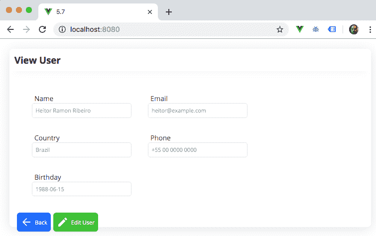

# 五、通过 HTTP 请求从 Web 获取数据

数据是当今日常生活的一部分。如果没有数据，您就不会阅读这本书或试图了解更多有关 Vue 的信息。

了解如何在应用中获取和发送数据是开发人员的一项要求，而不仅仅是一项额外的技能。学习它的最好方法是练习它，并了解它是如何在幕后完成的。

在本章中，我们将学习如何使用 Fetch API 和目前 web 上最流行的 API 库`axios`构建我们自己的 API 数据操作。

在本章中，我们将介绍以下配方：

*   为作为 HTTP 客户端的 Fetch API 创建包装器
*   创建随机 cat 图像或 GIF 组件
*   使用`MirageJS`创建本地伪 JSON API 服务器
*   使用`axios`作为新的 HTTP 客户端
*   创建不同的`axios`实例
*   为`axios`创建请求和响应拦截器
*   与`axios`和`Vuesax`创建 CRUD 接口

# 技术要求

在本章中，我们将使用 Node.js 和 Vue CLI。

Attention, Windows users! You need to install an NPM package called `windows-build-tools` to be able to install the following required packages. To do this, open PowerShell as administrator and execute the following command:
`> npm install -g windows-build-tools`

要安装 Vue CLI，请打开终端（macOS 或 Linux）或命令提示符/PowerShell（Windows），然后执行以下命令：

```js
> npm install -g @vue/cli @vue/cli-service-global
```

# 为作为 HTTP 客户端的 Fetch API 创建包装器

Fetch API 是旧[T0]的子 API。它有一个改进的 API 和一套新的功能强大的完全基于`Promises`的特性。

Fetch API 既简单又基于两个对象的通用定义`Request`和`Response`，这使得它可以在浏览器中的任何地方使用。浏览器获取 API 也可以在`window`或`service worker`内部执行。此 API 的使用没有限制。

在这个配方中，我们将学习如何围绕 fetchapi 创建一个包装器，以使 API 调用更加简单。

## 准备

此配方的先决条件如下：

*   Node.js 12+

所需的 Node.js 全局对象如下：

*   `@vue/cli`
*   `@vue/cli-service-global`

## 怎么做。。。

为了启动我们的组件，我们可以使用我们在[第 2 章](02.html)*介绍 TypeScript 和 Vue 生态系统*中的*使用 Vue CLI 创建您的第一个项目中创建的 Vue 项目，或者我们可以启动一个新项目。*

要启动新的，请打开终端（macOS 或 Linux）或命令提示符/PowerShell（Windows）并执行以下命令：

```js
> vue create http-project
```

CLI 将询问一些有助于创建项目的问题。您可以使用箭头键导航，*输入*键继续，以及*空格键*选择一个选项。选择`default`选项：

```js
? Please pick a preset: (Use arrow keys)
❯ default (babel, eslint) 
  Manually select features ‌
```

### 创建包装器

首先，我们需要创建一个新的 API 包装器以用于此配方。这将是我们将在所有 HTTP 方法上使用的主文件。

让我们按照以下步骤创建基本包装器：

1.  在`src/http`文件夹中创建一个名为`baseFetch.js`的新文件。
2.  我们将创建一个异步函数，该函数将接收[T0]、[T1]和[T2]三个变量作为参数。这将是一个 currying 函数，第二个函数将接收该函数作为参数[T3]：

```js
export default async (url, method, options = {}) => {
  let httpRequest;
  if (method.toUpperCase() === 'GET') {
    httpRequest = await fetch(url, {
      cache: 'reload',
      ...options,
    });
  } else {
    httpRequest = fetch(url, {
      method: method.toUpperCase(),
      cache: 'reload',
      ...options,
    });
  }
  return (type) => {
    switch (type.toLocaleLowerCase()) {
      case 'json':
        return httpRequest.json();
      case 'blob':
        return httpRequest.blob();
      case 'text':
        return httpRequest.text();
      case 'formdata':
        return httpRequest.formData();
      default:
        return httpRequest.arrayBuffer();
    }
  };
};
```

### 创建 API 方法

现在我们需要使我们的 HTTP 方法功能。这些函数将使用包装器执行浏览器获取 API 并返回响应。

按照以下步骤创建每个 API 方法调用：

1.  让我们在`src/http`文件夹中创建一个名为`fetchApi.js`的新文件。
2.  我们需要从第一步创建的文件中导入`baseHttp`：

```js
import baseHttp from './baseFetch';
```

现在在下面的部分中，我们将创建包装器中可用的每个 HTTP 方法。

#### 获取方法函数

在这些步骤中，我们将创建*HTTP GET*方法。按照以下说明创建`getHttp`功能：

1.  创建一个名为`getHttp`的常量。
2.  将该常量定义为接收三个参数的异步函数，`url`、`type`和`options`。`type`参数的默认值为`'json'`。

3.  在这个函数返回中，我们将执行`baseHttp`函数，传递我们收到的`url`作为第二个参数，`'get'`作为第三个参数，`options`作为第三个参数，并立即使用我们收到的`type`参数执行函数：

```js
export const getHttp = async (url, type = 'json', options) => (await   
   baseHttp(url, 'get', options))(type);
```

#### 后置方法函数

在这一部分中，我们将创建*HTTP POST*方法。按照以下步骤创建`postHttp`函数：

1.  创建一个名为`postHttp`的常量。
2.  为该常量分配一个异步函数，该函数接收四个参数：`url`、`body`、`type`和`options`。`type`参数的默认值为`'json'`。
3.  在这个函数返回中，我们将执行`baseHttp`函数，传递我们收到的`url`参数，`'post'`作为第二个参数。在第三个参数中，我们将传递一个带有`body`变量的对象，以及我们收到的解构的`options`参数。由于`baseHttp`的 currying 属性，我们将使用收到的`type`参数执行返回的函数。[T7]通常是 JSON 或 JavaScript 对象。如果此请求是文件上传，`body`需要是`FormData`对象：

```js
export const postHttp = async (
  url,
  body,
  type = 'json',
  options,
) => (await baseHttp(url,
  'post',
  {
    body,
    ...options,
  }))(type);
```

#### PUT 方法函数

现在我们正在创建一个*HTTP PUT*方法。使用以下步骤创建`putHttp`功能：

1.  创建一个名为`putHttp`的常量。
2.  为该常量分配一个异步函数，该函数接收四个参数：`url`、`body`、`type`和`options`。`type`参数的默认值为`'json'`。
3.  在这个函数返回中，我们将执行`baseHttp`函数，传递我们收到的`url`和`'put'`作为第二个参数。在第三个参数中，我们将传递一个带有`body`变量的对象，以及我们收到的解构的`options`参数。由于`baseHttp`的 currying 属性，我们将使用收到的`type`参数执行返回的函数。`body`通常是 JSON 或 JavaScript 对象，但如果此请求是文件上传，`body`需要是`FormData`对象：

```js
export const putHttp = async (
  url,
  body,
  type = 'json',
  options,
) => (await baseHttp(url,
  'put',
  {
    body,
    ...options,
  }))(type);
```

#### 贴片法函数

是时候创建一个*HTTP 补丁*方法了。按照以下步骤创建`patchHttp`函数：

1.  创建一个名为`patchHttp`的常量。
2.  为该常量分配一个异步函数，该函数接收四个参数：`url`、`body`、`type`和`options`。`type`参数的默认值为`'json'`。

3.  在这个函数返回中，我们将执行`baseHttp`函数，传递我们收到的`url`和`'patch'`作为第二个参数。在第三个参数中，我们将传递一个带有`body`变量的对象，以及我们收到的解构的`options`参数。由于`baseHttp`的 currying 属性，我们将使用收到的`type`执行返回的函数。`body`通常是 JSON 或 JavaScript 对象，但如果此请求是文件上传，`body`需要是`FormData`对象：

```js
export const patchHttp = async (
  url,
  body,
  type = 'json',
  options,
) => (await baseHttp(url,
  'patch',
  {
    body,
    ...options,
  }))(type); 
```

#### 更新方法函数

在本节中，我们将创建一个*HTTP 更新*方法。按照以下步骤创建`updateHttp`函数：

1.  创建一个名为`updateHttp`的常量。
2.  为该常量分配一个异步函数，该函数接收四个参数：`url`、`body`、`type`和`options`。`type`参数的默认值为`'json'`。
3.  在这个函数返回中，我们将执行`baseHttp`函数，传递我们收到的`url`和`'update'`作为第二个参数。在第三个参数中，我们将传递一个带有`body`变量的对象，以及我们收到的解构的`options`参数。由于`baseHttp`的 currying 属性，我们将使用收到的`type`执行返回的函数。`body`通常是 JSON 或 JavaScript 对象，但如果此请求是文件上传，`body`需要是`FormData`对象：

```js
export const updateHttp = async (
  url,
  body,
  type = 'json',
  options,
) => (await baseHttp(url,
  'update',
  {
    body,
    ...options,
  }))(type); 
```

#### 删除方法函数

在最后一步中，我们将创建一个*删除 HTTP*方法。按照以下步骤创建`deleteHttp`函数：

1.  创建一个名为`deleteHttp`的常量。
2.  为该常量分配一个异步函数，该函数接收四个参数：`url`、`body`、`type`和`options`。类型参数的默认值为`'json'`。
3.  在这个函数返回中，我们将执行`baseHttp`函数，传递我们收到的`url`和`'delete'`作为第二个参数。在第三个参数中，我们将传递一个带有`body`变量的对象，以及我们收到的解构的`options`参数。由于`baseHttp`的 currying 属性，我们将使用收到的`type`执行返回的函数。`body`通常是 JSON 或 JavaScript 对象，但如果此请求是文件上传，`body`需要是`FormData`对象：

```js
export const deleteHttp = async (
  url,
  body,
  type = 'json',
  options,
) => (await baseHttp(url,
  'delete',
  {
    body,
    ...options,
  }))(type); 
```

## 它是如何工作的。。。

在这个配方中，我们为[T1]元素上显示的[T0]API 创建了一个包装器。这个包装器由一个 currying 和 closure 函数组成，其中第一个函数接收 fetchapi 的 URL 数据、方法和选项，结果函数是 fetchapi 响应转换器。

在包装器中，函数的第一部分将创建我们的`fetch`请求。在这里，我们需要检查它是否是一个*GET*方法，所以我们只需要使用`url`参数执行它，并忽略其他参数。函数的第二部分负责转换`fetch`响应。它将在`type`参数之间切换，并根据正确的参数执行检索功能。

要接收请求的最终数据，您始终需要在请求后调用响应转换器，如下例所示：

```js
getHttp('https://jsonplaceholder.typicode.com/todos/1',
          'json').then((response) => { console.log(response)); }
```

这将从 URL 获取数据，并将响应转换为 JSON/JavaScript 对象。

第二部分是翻译方法。我们为剩下的每一个动词制作了函数，以便更容易地使用。GET 动词不能传递任何[T0]，但所有其他动词都可以在请求中传递[T1]。

## 另见

您可以在[上找到有关获取 API 的更多信息 https://developer.mozilla.org/en-US/docs/Web/API/Fetch_API](https://developer.mozilla.org/en-US/docs/Web/API/Fetch_API) 。

有关 FormData 的更多信息，请访问[https://developer.mozilla.org/en-US/docs/Web/API/FormData/FormData](https://developer.mozilla.org/en-US/docs/Web/API/FormData/FormData) 。

您可以在[中找到有关获取响应正文的更多信息 https://developer.mozilla.org/en-US/docs/Web/API/Body/body](https://developer.mozilla.org/en-US/docs/Web/API/Body/body) 。 [](https://developer.mozilla.org/en-US/docs/Web/API/Body/body) 

您可以在[找到更多关于标题的信息 https://developer.mozilla.org/en-US/docs/Web/API/Headers](https://developer.mozilla.org/en-US/docs/Web/API/Headers) 。

有关请求的更多信息，请访问[https://developer.mozilla.org/](https://developer.mozilla.org/en-US/docs/Web/API/Request) [en-US/docs/Web/API/Request](https://developer.mozilla.org/en-US/docs/Web/API/Request)。

# 创建随机 cat 图像或 GIF 组件

众所周知，互联网是由许多礼物和猫的视频组成的。我敢肯定，如果我们删除了所有与 cat 相关的内容，我们将面临网络瘫痪。

了解 Fetch API 以及如何在组件中使用它的最好方法是创建一个随机的 cat 图像或 GIF 组件。

## 准备

此配方的先决条件如下：

*   Node.js 12+

所需的 Node.js 全局对象如下：

*   `@vue/cli`
*   `@vue/cli-service-global`

## 怎么做。。。

要启动我们的组件，我们可以使用 Vue 项目和 Vue CLI，我们在“*创建获取 API 的包装器作为 HTTP 客户端*配方中使用了该项目，或者我们可以启动一个新的包装器。

要启动新的，请打开终端（macOS 或 Linux）或命令提示符/PowerShell（Windows）并执行以下命令：

```js
> vue create http-project
```

CLI 将询问一些有助于创建项目的问题。您可以使用箭头键导航，*输入*键继续，以及*空格键*选择一个选项。选择`default`选项：

```js
? Please pick a preset: (Use arrow keys)
❯ default (babel, eslint) 
  Manually select features ‌
```

### 创建组件

在本配方中，我们将使用[第 4 章](04.html)*中创建的组件、组件、混合器和功能组件*作为视觉元素。使用简单的 HTML 元素可以获得相同的结果。

我们将此组件的创建分为三个步骤：`<script>`、`<template>`和`<style>`。

#### 单文件组件

按照以下步骤创建单文件组件的`<script>`部分：

1.  在`src/components`文件夹中创建一个名为`RandomCat.vue`的新文件并打开它。
2.  从我们在“*中创建的作为 HTTP 客户端*的 Fetch API 包装器配方：
    中创建的`fetchApi`包装器中导入`getHttp`函数

```js
import { getHttp } from '../http/fetchApi';
```

3.  异步导入`component`属性中的`MaterialButton`和`MaterialCardBox`组件：

```js
components: {
  MaterialButton: () => import('./MaterialButton.vue'),
  MaterialCardBox: () => import('./MaterialCardBox.vue'),
},
```

4.  在`data`属性中，我们需要创建一个名为`kittyImage`的新数据值，默认为空字符串：

```js
data: () => ({
  kittyImage: '',
}),
```

5.  在`methods`属性中，我们需要创建`getImage`方法，该方法将获取图像作为`Blob`并将其作为`URL.createObjectURL`返回。我们还需要创建`newCatImage`方法来获取新的猫的静止图像，以及`newCatGif`方法来获取新的猫 GIF：

```js
methods: {
    async getImage(url) {
      return URL.createObjectURL(await getHttp(url, 'blob'));
    },
    async newCatImage() {
      this.kittyImage = await
          this.getImage('https://cataas.com/cat');
    },
    async newCatGif() {
      this.kittyImage = await 
          this.getImage('https://cataas.com/cat/gif');
    },
  },
```

6.  在`beforeMount`生命周期钩子中，我们需要使其异步并执行`newCatImage`方法：

```js
async beforeMount() {
    await this.newCatImage();
  },
```

#### 单文件组件<template></template>

按照以下步骤创建单文件组件的`<template>`部分：

1.  首先，我们需要添加带有头和子头的`MaterialCardBox`组件，激活`media`和`action`部分，并为`media`和`action`创建`<template>`命名插槽：

```js
<MaterialCardBox
  header="Cat as a Service"
  sub-header="Random Cat Image"
  show-media
  show-actions
>
  <template
    v-slot:media>
  </template>
  <template v-slot:action>
  </template>
</MaterialCardBox>
```

2.  在`media`的`<template>`命名槽中，我们需要添加一个``元素，该元素将接收一个 URI`Blob`，当`kittyImage`变量中有任何数据时会显示该 URI，或者会显示一个加载图标：

```js

 <p v-else style="text-align: center">
   <i class="material-icons">
     cached
   </i>
 </p>
```

3.  在`action`的`<template>`命名槽中，我们将创建两个按钮，一个用于获取 cat 图像，另一个用于获取 cat GIF，两个按钮都将在`@click`指令上有一个事件监听器，该监听器调用获取相应图像的函数：

```js
<MaterialButton
  background-color="#4ba3c7"
  text-color="#fff"
  @click="newCatImage"
>
  <i class="material-icons">
    pets
  </i> Cat Image
</MaterialButton>
<MaterialButton
  background-color="#005b9f"
  text-color="#fff"
  @click="newCatGif"
>
  <i class="material-icons">
    pets
  </i> Cat GIF
</MaterialButton>
```

#### 单文件组件

在组件的`<style>`部分，我们需要为基于`rem`和`em`的 CSS 样式计算设置`body font-size`：

```js
<style>
  body {
    font-size: 14px;
  }
</style>
```

### 启动并运行新组件

按照以下步骤将组件添加到 Vue 应用：

1.  打开`src`文件夹中的`App.vue`文件。
2.  在`components`属性中，异步导入`RandomCat.vue`组件：

```js
<script>
export default {
  name: 'App',
  components: {
    RandomCat: () => import('./components/RandomCat'),
  },
};
</script>
```

3.  在文件的`<template>`部分，声明导入的组件：

```js
<template>
  <div id="app">
    <random-cat />
  </div>
</template>
```

要运行服务器并查看组件，您需要打开终端（macOS 或 Linux）或命令提示符/PowerShell（Windows）并执行以下命令：

```js
> npm run serve
```

以下是渲染并运行的组件：


## 它是如何工作的。。。

使用`getHttp`包装器，组件能够获取 URL 并将其作为`Blob`类型检索。有了这个响应，我们可以使用`URL.createObjectUrl`导航器方法并将`Blob`作为参数传递，以获得可用作`src`属性的有效图像 URL。

## 另见

有关`URL.createObjectUrl`的更多信息，请访问[https://developer.mozilla.org/en-US/docs/Web/API/URL/createObjectURL](https://developer.mozilla.org/en-US/docs/Web/API/URL/createObjectURL) 。

有关`Blob`响应类型的更多信息，请访问[https://developer.mozilla.org/en-US/docs/Web/API/Body/blob](https://developer.mozilla.org/en-US/docs/Web/API/Body/blob) 。

# 使用 MirageJS 创建伪 JSON API 服务器

为测试、开发或设计伪造数据一直是一个问题。在开发阶段展示应用时，需要有一个大的 JSON 或定制服务器来处理任何数据更改。

现在有一种方法可以帮助开发人员和 UI 设计师实现这一点，而无需编写外部服务器代码——一种称为 MirageJS 的新工具，一种在浏览器上运行的服务器模拟器。

在本教程中，我们将学习如何使用 MirageJS 作为模拟服务器，并在其上执行 HTTP 请求。

## 准备

此配方的先决条件如下：

*   Node.js 12+

所需的 Node.js 全局对象如下：

*   `@vue/cli`
*   `@vue/cli-service-global`

## 怎么做。。。

要启动我们的组件，我们可以使用 Vue 项目和 Vue CLI，就像我们在“*为获取 API 创建一个包装器作为 HTTP 客户端*配方中所做的那样，或者我们可以启动一个新的包装器。

要启动新的，请打开终端（macOS 或 Linux）或命令提示符/PowerShell（Windows）并执行以下命令：

```js
> vue create visual-component
```

CLI 将询问一些有助于创建项目的问题。您可以使用箭头键导航，*输入*键继续，以及*空格键*选择一个选项。选择`default`选项：

```js
? Please pick a preset: (Use arrow keys)
❯ default (babel, eslint) 
  Manually select features ‌
```

### 创建模拟服务器

在这个配方中，我们将使用我们在“为获取 API 创建一个包装器作为 HTTP 客户端”配方中制作的`fetchApi`包装器中的`getHttp`函数。

完成以下步骤和部分以创建您的`MirageJS`模拟服务器：

将`MirageJS`服务器安装到您的软件包中。您需要打开终端（macOS 或 Linux）或命令提示符/PowerShell（Windows）并执行以下命令：

```js
> npm install --save miragejs
```

The version used in this recipe was 0.1.32\. Watch for any changes to `MirageJS`, as there are no current LTS versions of the library yet.

现在在下面的部分中，我们将创建 MirageJS 服务器将模拟的每个 HTTP 方法。

#### 创建模拟数据库

在本节中，我们将创建一个`MirageJS`数据库，用于存储临时数据。按照以下步骤创建它：

1.  在`src/server`文件夹中为初始加载的数据创建一个名为`db.js`文件的新文件。
2.  我们需要将 JavaScript 对象作为此文件的默认导出，其中包含我们希望服务器拥有的初始数据：

```js
export default {
  users: [
    {
      name: 'Heitor Ramon Ribeiro',
      email: 'heitor@example.com',
      age: 31,
      country: 'Brazil',
      active: true,
    },
  ],
};
```

#### 创建 GET route 函数

在本节中，我们将创建*HTTP GET*方法，该方法将被`MirageJS`服务器模拟。按照以下步骤创建它：

1.  对于*GET*方法，我们需要在`src/server`文件夹中创建一个名为`get.js`的新文件。
2.  对于这个配方，我们将创建一个通用的`getFrom`函数，该函数接收一个键作为参数，并返回一个函数。此返回函数使用指示的键返回指向本地数据库的直接点：

```js
export const getFrom = key => ({ db }) => db[key];

export default {
  getFrom,
};
```

#### 创建 POST-route 函数

在本节中，我们将创建*HTTP POST*方法，该方法将被`MirageJS`服务器模拟。按照以下步骤创建它：

1.  对于*POST*方法，我们需要在`src/server`文件夹中创建一个名为`post.js`的新文件。

2.  对于这个配方，我们将创建一个通用的`postFrom`函数，该函数接收一个键作为参数，并返回一个函数。这个返回的函数将解析 HTTP 请求主体的`data`属性，并返回将数据插入数据库中的服务器模式的内部函数。使用`key`参数，模式知道我们正在处理哪个表：

```js
export const postFrom = key => (schema, request) => {
  const { data } = typeof request.requestBody === 'string'
    ? JSON.parse(request.requestBody)
    : request.requestBody;

  return schema.db[key].insert(data);
};

export default {
  postFrom,
}; 
```

#### 创建补丁路由函数

在本节中，我们将创建*HTTP 补丁*方法，该方法将被`MirageJS`服务器模拟。按照以下步骤创建它：

1.  对于*补丁*方法，我们需要在`src/server`文件夹中创建一个名为`patch.js`的新文件。
2.  对于这个配方，我们将创建一个通用的`patchFrom`函数，该函数接收一个键作为参数，并返回一个函数。此返回函数将解析 HTTP 请求主体的`data`属性，并返回服务器架构的内部函数，该函数使用随数据一起传递的`id`属性更新特定对象。使用`key`参数，模式知道我们正在处理哪个表：

```js
export const patchFrom = key => (schema, request) => {
  const { data } = typeof request.requestBody === 'string'
    ? JSON.parse(request.requestBody)
    : request.requestBody;

  return schema.db[key].update(data.id, data);
};

export default {
  patchFrom,
};
```

#### 创建删除路由函数

在本节中，我们将创建*HTTP DELETE*方法，该方法将被`MirageJS`服务器模拟。按照以下步骤创建它：

1.  对于*删除*方法，我们需要在`src/server`文件夹中创建一个名为`delete.js`的新文件。
2.  对于这个配方，我们将创建一个通用的`patchFrom`函数，该函数接收一个键作为参数，并返回一个函数。此返回函数将解析 HTTP 请求主体的`data`属性，并返回服务器架构的内部函数，该函数删除具有`id`属性的特定对象，该对象通过路由*REST*参数传递给服务器。使用`key`参数，模式知道我们正在处理哪个表：

```js
export const deleteFrom = key => (schema, request) => 
   schema.db[key].remove(request.params.id);

export default {
  deleteFrom,
};
```

#### 创建服务器

在本节中，我们将创建`MirageJS`服务器和可用的路由。按照以下步骤创建服务器：

1.  在`src/server`文件夹中创建一个名为`server.js`的新文件。
2.  接下来，我们需要导入`Server`类、`baseData`和路由器方法：

```js
import { Server } from 'miragejs';
import baseData from './db';
import { getFrom } from './get';
import { postFrom } from './post';
import { patchFrom } from './patch';
import { deleteFrom } from './delete';

```

3.  在`window`范围内创建一个名为`server`的全局变量，并将该变量设置为`Server`类的新执行：

```js
window.server = new Server({});
```

4.  在`Server`类构造选项中，添加一个名为`seeds`的新属性。此属性是一个函数，它接收服务器（`srv`作为参数，并执行传递`baseDate`作为参数的`srv.db.loadData`函数：

```js
seeds(srv) {
  srv.db.loadData({ ...baseData });
},
```

5.  现在我们需要在名为`routes`的新属性中添加相同的构造选项，该属性将创建模拟服务器路由。此属性是一个函数，在函数体上，我们需要设置模拟服务器的`namespace`以及服务器响应的延迟（毫秒）。将有四条路线。对于**创建**路由，我们将创建一个名为`/users`的新路由，该路由将侦听*POST*方法。对于**Read**路由，我们将创建一个新的路由，名为`/users`，它将侦听*GET*方法。对于**更新**路由，我们将新建一条名为`/users/:id`的路由，听*补丁*方法，最后对于**删除**路由，我们将新建一条名为`/users`的路由，听*删除*方法：

```js
routes() {
    this.namespace = 'api';

    this.timing = 750;

    this.get('/users', getFrom('users'));

    this.post('/users', postFrom('users'));

    this.patch('/users/:id', patchFrom('users'));

    this.delete('/users/:id', deleteFrom('users'));
  },

```

#### 添加到应用中

在本节中，我们将向 Vue 应用添加`MirageJS`服务器。按照以下步骤使服务器可用于 Vue 应用：

1.  打开`src`文件夹中的`main.js`文件。
2.  我们需要将服务器声明为第一个导入的声明，以便在应用的初始加载时可用：

```js
import './server/server';
import Vue from 'vue';
import App from './App.vue';

Vue.config.productionTip = false;

new Vue({
  render: h => h(App),
}).$mount('#app');
```

### 创建组件

现在我们有了服务器，我们需要测试它。为此，我们将创建一个简单的应用，该应用将运行每个 HTTP 方法并显示每个调用的结果。

在以下部分中，我们将创建一个简单的 Vue 应用。

#### 单文件组件

在这一部分中，我们将创建单文件组件的`<script>`部分。按照以下步骤创建它：

1.  打开`src`文件夹中的`App.vue`文件。
2.  从我们在“为作为 HTTP 客户端的获取 API 创建包装”配方中制作的`fetchHttp`包装中导入`getHttp`、`postHttp`、`patchHttp`和`deleteHTTP`方法：

```js
import {
  getHttp,
  postHttp,
  patchHttp,
  deleteHttp,
} from './http/fetchApi';
```

3.  在`data`属性中，我们需要创建三个要使用的新属性，`response`、`userData`和`userId`：

```js
data: () => ({
    response: undefined,
    userData: '',
    userId: undefined,
  }),
```

4.  在`methods`属性中，我们需要创建四种新方法，`getAllUsers`、`createUser`、`updateUser`和`deleteUser`：

```js
methods: {
  async getAllUsers() {
  },
  async createUser() {
  },
  async updateUser() {
  },
  async deleteUser() {
  },
},
```

5.  在`getAllUsers`方法中，我们将响应数据属性设置为`api/users`路由的`getHttp`功能的结果：

```js
async getAllUsers() {
  this.response = await getHttp(`${window.location.href}api/users`);
},
```

6.  在`createUser`方法中，我们将收到一个`data`参数，它将是一个对象，我们将通过`api/users`路由传递给`postHttp`，然后执行`getAllUsers`方法：

```js
async createUser(data) {
  await postHttp(`${window.location.href}api/users`, { data });
  await this.getAllUsers();
},
```

7.  对于`updateUser`方法，我们将收到一个`data`参数，该参数将是一个对象，我们将使用对象上的`id`属性作为路由上的`:id`传递给`api/users/:id`路由上的`patchHttp`。之后，我们将执行`getAllUsers`方法：

```js
async updateUser(data) {
  await patchHttp(`${window.location.href}api/users/${data.id}`, 
     { data });
  await this.getAllUsers();
},
```

8.  最后，在`deleteUser`方法中，我们接收用户`id`作为参数，这是一个数字，然后我们将其传递给`api/users/:id`路由上的`deleteHttp`，ID 为`:id`。之后，我们执行`getAllUsers`方法：

```js
async deleteUser(id) {
  await deleteHttp(`${window.location.href}api/users/${id}`, {},
     'text');
  await this.getAllUsers();
},
```

#### 单文件组件<template></template>

在这一部分中，我们将创建单文件组件的`<template>`部分。按照以下步骤创建它：

1.  在模板的顶部，我们需要添加`response`属性，该属性包装在`<pre>`HTML 元素中：

```js
<h3>Response</h3>
<pre>{{ response }}</pre>
```

2.  为了创建和更新用户，我们需要创建一个`textarea`HTML 输入，并将`v-model`指令绑定到`userData`属性：

```js
<hr/>
<h1> Create / Update User </h1>
<label for="userData">
 User JSON:
 <textarea
 id="userData"
 v-model="userData"
 rows="10"
 cols="40"
 style="display: block;"
 ></textarea>
</label>
```

3.  要发送此数据，我们需要创建两个按钮，都有一个事件监听器绑定在点击事件上，分别以`createUser`和`updateUser`为目标的`@click`指令，并在执行中传递`userData`：

```js
<button
  style="margin: 20px;"
  @click="createUser(JSON.parse(userData))"
>
  Create User
</button>
<button
  style="margin: 20px;"
  @click="updateUser(JSON.parse(userData))"
>
  Update User
</button>
```

4.  要执行*DELETE*方法，我们需要创建一个类型为`number`的输入 HTML 元素，并将`v-model`指令绑定到`userId`属性：

```js
<h1> Delete User </h1>
<label for="userData">
  User Id:
<input type="number" step="1" v-model="userId">
</label>
```

5.  最后，要执行此操作，我们需要创建一个按钮，该按钮将使用`@click`指令在 click 事件上绑定一个事件侦听器，以`deleteUser`方法为目标，并在执行时传递`userId`属性：

```js
<button
  style="margin: 20px;"
  @click="deleteUser(userId)"
>
  Delete User
</button>
```

要运行服务器并查看组件，您需要打开终端（macOS 或 Linux）或命令提示符/PowerShell（Windows）并执行以下命令：

```js
> npm run serve
```

以下是渲染并运行的组件：


## 它是如何工作的。。。

`MirageJS`的工作原理类似于应用上发生的每个 HTTP 请求的拦截器。服务器截获浏览器上的所有**XHR（XMLHttpRequest）**执行，并检查路由，以查看它是否与创建服务器时创建的任何一个路由匹配。如果匹配，服务器将在相应的路由上相应地执行该功能。

作为具有基本 CRUD 功能的简单 REST 服务器，该服务器具有类似于模式的数据库结构，有助于创建用于存储数据的虚拟数据库。

## 另见

有关 MirageJS 的更多信息，请访问 https://github.com/miragejs/miragejs T1-T1T2

# 使用 axios 作为新的 HTTP 客户端

当您需要一个用于 HTTP 请求的库时，毫无疑问，`axios`是您应该访问的库。这个库被 150 多万个开源项目和无数封闭项目使用，是 HTTP 库之王。

它是为大多数浏览器而构建的，并提供了最完整的选项集之一–您可以自定义请求中的所有内容。

在这个配方中，我们将学习如何将 fetchapi 包装器更改为`axios`并开始解决它。

## 准备

此配方的先决条件如下：

*   Node.js 12+

所需的 Node.js 全局对象如下：

*   `@vue/cli`
*   `@vue/cli-service-global`

## 怎么做。。。

要启动我们的组件，我们可以使用 Vue 项目和 Vue CLI，这是我们在“*使用 MirageJS*创建假 JSON API 服务器”配方中创建的，或者我们可以启动一个新的。

要启动新的，请打开终端（macOS 或 Linux）或命令提示符/PowerShell（Windows）并执行以下命令：

```js
> vue create http-project
```

CLI 将询问一些有助于创建项目的问题。您可以使用箭头键导航，*输入*键继续，以及*空格键*选择一个选项。选择`default`选项：

```js
? Please pick a preset: (Use arrow keys)
❯ default (babel, eslint) 
  Manually select features ‌
```

### 从 fetchapi 更改为 Axios

在接下来的步骤中，我们将更改[T0]库的 HTTP 包装中使用的获取 API。请按照以下步骤进行正确更改：

1.  在您的软件包中安装`axios`。您需要打开终端（macOS 或 Linux）或命令提示符/PowerShell（Windows）并执行以下命令：

```js
> npm install --save axios
```

The version used in this recipe was 0.19.0\. Watch for changes to `axios`, as there is no LTS version of the library yet.

2.  打开`src/http`文件夹中的`baseFetch.js`文件。
3.  简化方法，使其接收三个参数`url`、`method`和`options`，并返回一个`axios`方法，使用作为实例构造函数传递的方法调用 HTTP 请求：

```js
import axios from 'axios';

export default async (url, method, options = {}) => axios({
  method: method.toUpperCase(),
  url,
  ...options,
});
```

#### 更改 GET 方法函数

在这一部分中，我们将更改*HTTP GET*方法。按照以下说明更改`getHttp`功能：

1.  打开`src/http`文件夹中的`fetchApi.js`文件。
2.  在`getHttp`函数中，我们将添加一个新的参数 param，并删除 currying 函数：

```js
export const getHttp = async (
  url,
  params,
  options,
) => baseHttp(url,
  'get',
  {
    ...options,
    params,
  });
```

#### 更改 POST 方法函数

在这一部分中，我们将更改*HTTP POST*方法。按照以下说明更改`postHttp`功能：

1.  打开`http`文件夹中的`fetchApi.js`文件。
2.  在`postHttp`函数中，我们将`body`参数改为`data`，并删除咖喱函数：

```js
export const postHttp = async (
  url,
  data,
  options,
) => baseHttp(url,
  'post',
  {
    data,
    ...options,
  });
```

#### 更改 PUT 方法函数

在这一部分中，我们将更改*HTTP PUT*方法。按照以下说明更改`putHttp`功能：

1.  打开`http`文件夹中的`fetchApi.js`文件。
2.  在`putHttp`函数中，我们将`body`参数改为`data`，并删除咖喱函数：

```js
export const putHttp = async (
  url,
  data,
  options,
) => baseHttp(url,
  'put',
  {
    data,
    ...options,
  });
```

#### 更改面片法函数

在这一部分中，我们将更改*HTTP 补丁*方法。按照以下说明更改`patchHttp`功能：

1.  打开`http`文件夹中的`fetchApi.js`文件。
2.  在`patchHttp`函数中，我们将`body`参数改为`data`，并删除咖喱函数：

```js
export const patchHttp = async (
  url,
  data,
  options,
) => baseHttp(url,
  'patch',
  {
    data,
    ...options,
  });
```

#### 更改更新方法函数

在这一部分中，我们将更改*HTTP 更新*方法。按照以下说明更改`updateHttp`功能：

1.  打开`http`文件夹中的`fetchApi.js`文件。
2.  在`updateHttp`函数中，我们将添加一个新的参数 param，并删除 currying 函数：

```js
export const updateHttp = async (
  url,
  data,
  options,
) => baseHttp(url,
  'update',
  {
    data,
    ...options,
  });
```

#### 更改删除方法函数

在这一部分中，我们将更改*HTTP DELETE*方法。按照以下说明更改`deleteHttp`功能：

1.  打开`http`文件夹中的`fetchApi.js`文件。
2.  在`deleteHttp`函数中，我们将`body`参数改为`data`，并删除咖喱函数：

```js
export const deleteHttp = async (
  url,
  data,
  options,
) => baseHttp(url,
  'delete',
  {
    data,
    ...options,
  });
```

### 更改组件

在这一部分中，我们将改变组件如何使用新功能。按照以下说明进行正确更改：

1.  打开`src`文件夹中的`App.vue`文件。
2.  在`getAllUsers`方法中，我们需要更改响应的定义方式，因为`axios`为我们提供了一个与 Fetch API 完全不同的响应对象：

```js
async getAllUsers() {
  const { data } = await getHttp(`${window.location.href}api/users`);
  this.response = data;
 },
```

3.  在`deleteUser`方法中，我们只需将 URL 作为参数传递：

```js
async deleteUser(id) {
  await deleteHttp(`${window.location.href}api/users/${id}`);
  await this.getAllUsers();
 },
```

要运行服务器并查看您的组件，您需要打开终端（macOS 或 Linux）或命令提示符/PowerShell（Windows）并执行以下命令：

```js
> npm run serve
```

## 它是如何工作的。。。

当我们为 fetchapi 制作包装器时，我们使用了一种将 API 抽象到另一个接口的技术，这使得从 fetchapi 转换到`axios`库成为可能。通过这样做，我们能够改进方法并简化函数的调用和处理方式。例如，GET 方法现在可以接收一个名为**params**的新参数，它是将自动注入 URL 的 URL 查询参数的对象。

我们还必须改变解释响应的方式，因为`axios`有一个比 Fetch API 更健壮、更完整的响应对象，Fetch API 只返回已获取的响应本身。

## 另见

您可以在“T1”中找到有关“T0”的更多信息 https://github.com/axios/axios 。“T3”。

# 创建不同的 axios 实例

当使用`axios`时，您可以运行多个实例，其中任何一个都不会相互干扰。例如，您有一个实例指向版本 1 上的用户 API，另一个实例指向版本 2 上的支付 API，这两个实例共享相同的命名空间。

在这里，我们将学习如何创建各种`axios`实例，以便您能够使用任意多的 API 名称空间，而不会出现问题或干扰。

## 准备

此配方的先决条件如下：

*   Node.js 12+

所需的 Node.js 全局对象如下：

*   `@vue/cli`
*   `@vue/cli-service-global`

## 怎么做。。。

要启动我们的组件，我们可以使用 Vue 项目和 Vue CLI，就像我们在“*中使用 axios 作为新的 HTTP 客户端*配方中所做的那样，或者我们可以启动一个新的。

要启动新的，请打开终端（macOS 或 Linux）或命令提示符/PowerShell（Windows）并执行以下命令：

```js
> vue create http-project
```

CLI 将询问一些有助于创建项目的问题。您可以使用箭头键导航，*输入*键继续，以及*空格键*选择一个选项。选择`default`选项：

```js
? Please pick a preset: (Use arrow keys)
❯ default (babel, eslint) 
  Manually select features ‌
```

### 更改 HTTP 函数

创建多个`axios`实例时，调用`axios`库的过程会发生变化。因此，我们需要改变 HTTP 包装器实例化`axios`库的方式。

在下面的部分中，我们将更改 HTTP 包装器在创建新的`axios`实例时的工作方式，并使其可用于应用。

#### 更改 HTTP 获取包装器

在以下步骤中，我们将创建一个新的自定义`axios`实例，该实例将在 HTTP 包装器中使用。按照以下说明将新实例添加到应用：

1.  打开`src/http`文件夹中的`baseFetch.js`文件。
2.  每个实例都需要`axios`执行一个新的工厂才能生成【T0:

```js
export function createAxios(options = {}) {
  return axios.create({
    ...options,
  });
}
```

3.  现在我们需要创建`localApi`常量，其值将是`createAxios`工厂执行的结果：

```js
const localApi = createAxios();
```

4.  对于`JSONPlaceHolder`我们将创建一个将导出的常量，名为`jsonPlaceholderApi`，其值将是`createAxios`工厂的执行。我们还将通过定义了[T3]属性的参数传递一个对象：

```js
export const jsonPlaceholderApi = createAxios({
  baseURL: 'https://jsonplaceholder.typicode.com/',
});
```

5.  在`export default`功能中，我们需要从`axios`改为`localApi`：

```js
export default async (url, method, options = {}) => localApi({
  method: method.toUpperCase(),
  url,
  ...options,
});
```

#### 更改 HTTP 方法函数

在这一部分中，我们将改变 HTTP 方法如何处理新的`axios`实例。请按照说明正确执行此操作：

1.  打开`src/http`文件夹中的`fetchApi.js`文件。
2.  我们将从`baseFetch`导入`jsonPlaceholderApi`函数作为额外导入值：

```js
import baseHttp, { jsonPlaceholderApi } from './baseFetch';
```

3.  我们需要创建一个名为`getTodos`的新常量，该常量将被导出。该常量将是一个函数，它将接收一个`userId`作为参数，并在名为`params`的属性中的配置对象内从`axios`返回 GET 函数，其中包含我们刚刚接收到的`userId`参数：

```js
export const getTodos = async userId => jsonPlaceholderApi.get('todos',
  {
    params: {
      userId,
    },
  });
```

#### 更改 MirageJS 服务器

在这一部分中，我们将改变`MirageJS`服务器如何处理创建的新`axios`实例。请按照说明正确执行此操作：

1.  打开`src/server`文件夹中的`server.js`文件。
2.  在构造函数对象中的`routes`属性上，我们需要添加一个`passthrough`声明，它将向 MirageJS 指示对该 URL 的所有调用都不会被拦截：

```js
import { Server } from 'miragejs';
import baseData from './db';
import { getFrom } from './get';
import { postFrom } from './post';
import { patchFrom } from './patch';
import { deleteFrom } from './delete';

window.server = new Server({
  seeds(srv) {
    srv.db.loadData({ ...baseData });
  },

  routes() {
    this.passthrough();
    this.passthrough('https://jsonplaceholder.typicode.com/**');

    this.namespace = 'api';

    this.timing = 750;

    this.get('/users', getFrom('users'));

    this.post('/users', postFrom('users'));

    this.patch('/users/:id', patchFrom('users'));

    this.delete('/users/:id', deleteFrom('users'));
  },
});
```

### 更改组件

在包装器函数、`MirageJS`服务器方法和 HTTP 方法更改之后，我们需要将组件更改为实现的新库。

在下面的部分中，我们将更改组件以匹配已实现的新库。

#### 单文件组件

在这一部分中，我们将更改单文件组件的`<script>`部分。请按照以下步骤进行操作：

1.  打开`src`文件夹中的`App.vue`文件。
2.  我们需要导入新的`getTodos`功能，如下所示：

```js
import {
  getHttp,
  postHttp,
  patchHttp,
  deleteHttp,
  getTodos,
} from './http/fetchApi';

```

3.  在`Vue`对象的`data`属性中，我们需要创建一个名为`userTodo`的新属性，默认值为空数组：

```js
data: () => ({
  response: undefined,
  userData: '',
  userId: undefined,
  userTodo: [],
}),
```

4.  在`methods`属性中，我们需要创建一个名为`getUserTodo`的新方法来接收`userId`参数。此方法将获取用户的待办事项列表，并将响应归因于`userTodo`属性：

```js
async getUserTodo(userId) {
  this.userTodo = await getTodos(userId);
},
```

#### 单文件组件<template></template>

在这一部分中，我们将更改单文件组件的`<template>`部分。请按照以下步骤进行操作：

1.  打开`src`文件夹中的`App.vue`文件。
2.  在模板的底部，我们需要创建一个新的`input`HTML 元素，`v-model`指令绑定到`userId`属性：

```js
<h1> Get User ToDos </h1>
<label for="userData">
  User Id:
  <input type="number" step="1" v-model="userId">
</label>
```

3.  要获取项目列表，我们需要创建一个按钮，该按钮的事件监听器绑定在带有[T0]指令的 click 事件上，以[T1]为目标，并在执行中传递[T2]：

```js
<button
  style="margin: 20px;"
  @click="getUserTodo(userId)"
>
  Fetch Data
</button>
```

要运行服务器并查看组件，您需要打开终端（macOS 或 Linux）或命令提示符/PowerShell（Windows）并执行以下命令：

```js
> npm run serve
```

以下是渲染并运行的组件：


## 它是如何工作的。。。

当我们创建`axios`的新实例时，将创建一个新对象，并定义新的配置、头、拦截器和操纵器。这是因为`axios`声明`create`的功能与`new Class`相同。它是相同的界面，但对象不同。

利用这种可能性，我们能够创建两个连接驱动程序，一个用于本地 API，另一个用于具有不同的`baseURL`的`JSONPlaceHolder`API。

由于 MirageJS 服务器集成，所有 HTTP 请求都被 MirageJS 拦截，因此我们需要在路由器构造函数中添加一个指令，指示 MirageJS 不会拦截的路由。

## 另见

您可以在[找到关于 JSONPlaceHolder API 的更多信息 https://jsonplaceholder.typicode.com/](https://jsonplaceholder.typicode.com/) 。

有关`axios`实例的更多信息，请访问[https://github.com/axios/axios#creating-一个例子](https://github.com/axios/axios#creating-an-instance)。

有关 MirageJS 的更多信息，请访问 https://github.com/miragejs/miragejs T1-T1T2

# 为 axios 创建请求和响应拦截器

在我们的应用中使用`axios`作为主要 HTTP 操纵器，允许我们使用请求和响应拦截器。它们用于在将数据发送到服务器之前操作数据，或者在接收数据时，在将数据发送回 JavaScript 代码之前操作数据。

拦截器最常用的使用方式是 JWT 令牌验证和刷新接收特定错误或 API 错误操作的请求。

在本配方中，我们将学习如何创建请求拦截器来检查*POST*、*补丁*和*DELETE*方法以及响应错误操纵器。

## 准备

此配方的先决条件如下：

*   Node.js 12+

所需的 Node.js 全局对象如下：

*   `@vue/cli`
*   `@vue/cli-service-global`

## 怎么做。。。

要启动我们的组件，我们可以使用我们在“*创建不同 axios 实例*配方中制作的 Vue 项目和 Vue CLI，或者我们可以启动一个新的项目。

要启动新的，请打开终端（macOS 或 Linux）或命令提示符/PowerShell（Windows）并执行以下命令：

```js
> vue create http-project
```

CLI 将询问一些有助于创建项目的问题。您可以使用箭头键导航，*输入*键继续，以及*空格键*选择一个选项。选择`default`选项：

```js
? Please pick a preset: (Use arrow keys)
❯ default (babel, eslint) 
  Manually select features ‌
```

### 创建拦截器

在以下步骤中，我们将创建一个`axios`拦截器，该拦截器将用作中间件。按照说明正确操作：

1.  安装`Sweet Alert`包。为此，您需要打开终端（macOS 或 Linux）或命令提示符/PowerShell（Windows）并执行以下命令：

```js
> npm install --save sweetalert2
```

2.  在`src/http`文件夹中创建一个名为`interceptors.js`的新文件并打开它。

3.  然后，我们导入 Sweet Alert 包：

```js
import Swal from 'sweetalert2';
```

4.  我们需要创建一个常量，其中包含将被拦截的*POST*方法数组：

```js
const postMethods = ['post', 'patch'];
```

5.  我们需要创建一个名为`requestInterceptor`的函数并将其导出。此函数将接收一个参数`config`，它是`axios`配置对象。我们需要检查请求方法是否包含在我们之前创建的数组中，以及数据体的`data`属性是否具有`id`属性。如果任何一个检查不通过，我们将抛出一个`Error`，否则，我们将返回`config`：

```js
export function requestInterceptor(config) {
  if (
    postMethods.includes(config.method.toLocaleLowerCase()) &&
    Object.prototype.hasOwnProperty.call('id', config.data.data) && 
      !config.data.data.id) 
    {
      throw new Error('You need to pass an ID for this request');
    }

 return config;
}

```

6.  对于响应拦截器，我们需要创建一个名为`responseInterceptor`的新函数来返回响应，因为我们不会更改此拦截器中的任何内容：

```js
export function responseInterceptor(response) {
  return response;
}
```

7.  为了捕获错误，我们需要创建一个`errorInterceptor`函数，该函数将被导出。此函数接收一个`error`作为参数，将显示一条`sweetalert2`警报错误消息，并返回一条带有`error`的`Promise.reject`：

```js
export function errorInterceptor(error) {
  Swal.fire({
    type: 'error',
    title: 'Error!',
    text: error.message,
  });

  return Promise.reject(error);
}
```

### 向 HTTP 方法函数添加拦截器

在下面的步骤中，我们将把`axios`拦截器添加到 HTTP 方法函数中。请按照以下步骤正确执行此操作：

1.  打开`src/http`文件夹中的`baseFetch.js`文件。
2.  我们需要导入刚刚创建的三个拦截器：

```js
import {
  errorInterceptor,
  requestInterceptor,
  responseInterceptor,
} from './interceptors';
```

3.  创建`localApi`实例后，我们声明使用请求和响应拦截器：

```js
localApi.interceptors
  .request.use(requestInterceptor, errorInterceptor);

localApi.interceptors
  .response.use(responseInterceptor, errorInterceptor);
```

4.  创建`jsonPlaceholderApi`实例后，我们声明使用请求和响应拦截器：

```js
jsonPlaceholderApi.interceptors
  .request.use(requestInterceptor, errorInterceptor);

jsonPlaceholderApi.interceptors
  .response.use(responseInterceptor, errorInterceptor);
```

## 它是如何工作的。。。

[T0]执行的每个请求都会通过集合中的任何一个拦截器。同样的事情也发生在反应上。如果在拦截器上抛出任何错误，它将自动传递给错误操纵器，因此根本不会执行请求，或者响应将作为错误发送到 JavaScript 代码。

我们检查了针对*POST*、*补丁*和*DELETE*方法所做的每个请求，以查看主体数据中是否存在`id`属性。如果没有，我们会向用户抛出一个错误，说他们需要为请求传递一个 ID。

## 另见

有关 Sweet Alert 2 的更多信息，请访问[https://sweetalert2.github.io](https://sweetalert2.github.io) 。

有关`axios`请求拦截器的更多信息，请访问**[https://github.com/axios/axios#interceptors](https://github.com/axios/axios#interceptors) 。**

# 使用 Axios 和 Vuesax 创建 CRUD 接口

在处理数据时，我们总是需要做一些事情：CRUD 过程。无论您正在开发哪种应用，都需要 CRUD 接口来输入和操作服务器、管理员面板、应用后端甚至客户端上的任何数据。

在这里，我们将学习如何使用`Vuesax`框架为 UI 和`axios`为 HTTP 请求创建一个简单的 CRUD 接口。

## 准备

此配方的先决条件如下：

*   Node.js 12+

所需的 Node.js 全局对象如下：

*   `@vue/cli`
*   `@vue/cli-service-global`

## 怎么做。。。

要启动我们的组件，请使用我们在“*为 axios*创建请求和响应拦截器”配方中使用的 Vue 项目和 Vue CLI，或者启动一个新的拦截器。

要启动新的，请打开终端（macOS 或 Linux）或命令提示符/PowerShell（Windows）并执行以下命令：

```js
> vue create http-project
```

CLI 将询问一些有助于创建项目的问题。您可以使用箭头键导航，*输入*键继续，以及*空格键*选择一个选项。选择`default`选项：

```js
? Please pick a preset: (Use arrow keys)
❯ default (babel, eslint) 
  Manually select features ‌
```

### 将 Vuesax 添加到应用

在以下步骤中，我们将介绍如何将[T0]UI 库添加到 Vue 应用中。请按照以下说明正确操作：

1.  打开终端（macOS 或 Linux）或命令提示符/PowerShell（Windows）并执行以下命令：

```js
> npm install --save vuesax material-icons
```

2.  在`src`文件夹中创建一个名为`style.css`的文件并打开它。
3.  导入`vuesax`、`material-icon`和`Open Sans`字体样式表：

```js
@import url('https://fonts.googleapis.com/css?family=Open+Sans:300,300i,400,400i,600,600i,700,700i,800,
    800i&display=swap');
@import url('~vuesax/dist/vuesax.css');
@import url('~material-icons/iconfont/material-icons.css');

* {
  font-family: 'Open Sans', sans-serif;
}
```

4.  打开`src`文件夹中的`main.js`文件。
5.  导入`style.css`文件和`Vuesax`。之后，您需要通知 Vue 使用`Vuesax`：

```js
import './server/server';
import Vue from 'vue';
import App from './App.vue';
import Vuesax from 'vuesax';
import './style.css';

Vue.use(Vuesax);

Vue.config.productionTip = false;

new Vue({
  render: h => h(App),
}).$mount('#app');
```

### 创建组件布线

我们将继续五个部分的配方：`List`、`Create`、`Read`、`Update`和`Delete`。我们的应用将是一个动态组件应用，因此我们将创建五个组件，每个部分一个。这些组件将类似于我们的页面。

首先，我们需要将`App.vue`更改为我们的主路由管理器，并创建一个用于更改组件的 mixin。

#### 单文件组件

在这一部分中，我们将创建单文件组件的`<script>`部分。按照以下说明正确创建组件：

1.  打开`src`文件夹中的`App.vue`。
2.  导入将在此处创建的每个组件：

```js
import List from './components/list';
import Create from './components/create';
import View from './components/view';
import Update from './components/update';
```

3.  在`data`属性中，创建两个新值：`componentIs`的默认值为`'list'`，而`userId`的默认值为`0`：

```js
data: () => ({
  componentIs: 'list',
  userId: 0,
}),
```

4.  我们需要向 Vue 对象添加一个名为`provide`的新属性。此属性将是一个函数，因此提供给组件的值可以是反应性的：

```js
provide () {
  const base = {};

  Object.defineProperty(base, 'userId', {
    enumerable: true,
    get: () => Number(this.userId),
  });

  return base;
},
```

5.  在`computed`属性中，我们需要创建一个名为`component`的新属性。这将是一个开关盒，它将返回我们的组件，基于`componentIs`属性：

```js
computed: {
  component() {
    switch (this.componentIs) {
      case 'list':
        return List;
      case 'create':
        return Create;
      case 'view':
        return View;
      case 'edit':
        return Update;
      default:
        return undefined;
    }
  }
},
```

6.  最后，在方法中，我们需要创建一个将当前组件更新为新组件的`changeComponent`方法：

```js
methods: {
  changeComponent(payload) {
    this.componentIs = payload.component;
    this.userId = Number(payload.userId);
  },
},
```

#### 单文件组件<template></template>

在这一部分中，我们将创建单文件组件的`<template>`部分。按照以下说明正确创建组件：

1.  在`div#app`HTML 元素中，我们需要添加一个`vs-row`组件：

```js
<div id="app">
    <vs-row></vs-row>
</div>
```

2.  在`vs-row`组件中，我们需要添加一个具有以下属性的`vs-col`组件：`vs-type`定义为`flex`、`vs-justify`定义为`left`、`vs-align`定义为`left`、`vs-w`定义为`12`：

```js
<vs-col
  vs-type="flex"
  vs-justify="left"
  vs-align="left"
  vs-w="12">
</vs-col>
```

3.  最后，在`vs-col`组件内部，我们将向计算属性`component`添加一个具有`is`属性的动态组件，并将事件侦听器指向将执行`changeComponent`方法的`"change-component"`事件：

```js
<component
 :is="component"
 @change-component="changeComponent"
/>
```

#### 创建路由 mixin

在这一部分中，我们将创建组件 mixin，以便在其他组件中重用。按照以下说明正确创建组件：

1.  在`src/mixin`文件夹中创建一个名为`changeComponent.js`的新文件并打开它。
2.  该 mixin 将有一个名为`changeComponent`的方法，该方法将发出一个`'change-component'`事件，其中包含需要渲染的新组件的名称和`userId`：

```js
export default {
  methods: {
    changeComponent(component, userId = 0) {
      this.$emit('change-component', { component, userId });
    },
  }
}
```

### 创建列表组件

列表组件将是索引组件。它将列出应用中的用户，并具有其他 CRUD 操作的所有链接。

#### 单文件组件

在这一部分中，我们将创建单文件组件的`<script>`部分。按照以下说明正确创建组件：

1.  在`src/components`文件夹中创建一个名为`list.vue`的新文件并打开它。
2.  从`fetchApi`和`changeComponent`混合输入`getHttp`和`deleteHttp`：

```js
import {
    getHttp,
    deleteHttp,
  } from '../http/fetchApi';
  import changeComponent from '../mixin/changeComponent';
```

3.  在组件`mixins`属性中，我们需要添加导入的`changeComponent`mixin：

```js
mixins: [changeComponent],
```

4.  在组件的`data`属性中，我们添加了一个名为`userList`的新属性，默认为空数组：

```js
data: () => ({
  userList: [],
}),
```

5.  对于方法，我们创建了`getAllUsers`和`deleteUsers`方法。在`getAllUsers`方法中，我们获取用户列表并将`userList`值设置为`getHttp`函数执行的响应。`deleteUser`方法将执行`deleteHttp`功能，然后执行`getAllUsers`方法：

```js
methods: {
  async getAllUsers() {
    const { data } = await getHttp(`${window.location.href}api/users`);
    this.userList = data;
  },
  async deleteUser(id) {
    await deleteHttp(`${window.location.href}api/users/${id}`);
    await this.getAllUsers();
  },
}
```

6.  最后，我们将`beforeMount`生命周期钩子异步化，调用`getAllUsers`方法：

```js
async beforeMount() {
  await this.getAllUsers();
},
```

#### 单文件组件<template></template>

在这一部分中，我们将创建单文件组件的`<template>`部分。按照以下说明正确创建组件：

1.  创建一个`vs-card`组件，其`style`属性定义为`margin: 20px`：

```js
<vs-card
    style="margin: 20px;"
  >
</vs-card>
```

2.  在`vs-card`组件内部，为`header`创建一个名为 slot 的动态`<template>`，带有`<h3>`标签和您的标题：

```js
<template slot="header">
  <h3>
    Users
  </h3>
</template>
```

3.  然后创建一个`vs-row`组件，其中包含一个`vs-col`组件，具有以下属性：`vs-type`定义为`flex`、`vs-justify`定义为`left`、`vs-align`定义为`left`、`vs-w`定义为`12`：

```js
<vs-row>
  <vs-col
    vs-type="flex"
    vs-justify="left"
    vs-align="left"
    vs-w="12">
  </vs-col>
</vs-row>
```

4.  在`vs-col`组件内部，我们需要创建一个`vs-table`组件。此组件将具有指向`userList`变量的`data`属性，并且将`search`、`stripe`和`pagination`属性定义为 true。`max-items`属性将被定义为`10`，而`style`属性的值将为`width: 100%; padding: 20px;`：

```js
<vs-table
  :data="userList"
  search
  stripe
  pagination
  max-items="10"
  style="width: 100%; padding: 20px;"
></vs-table>
```

5.  对于表头，我们需要创建一个名为 slot`thead`的动态`<template>`组件，并为每个列创建一个`vs-th`组件，其中`sort-key`属性定义为相应的 object key 属性，显示为您想要的名称：

```js
<template slot="thead">
  <vs-th sort-key="id">
    #
  </vs-th>
  <vs-th sort-key="name">
    Name
  </vs-th>
  <vs-th sort-key="email">
    Email
  </vs-th>
  <vs-th sort-key="country">
    Country
  </vs-th>
  <vs-th sort-key="phone">
    Phone
  </vs-th>
  <vs-th sort-key="Birthday">
    Birthday
  </vs-th>
  <vs-th>
    Actions
  </vs-th>
</template>
```

6.  对于表体，我们需要创建一个动态的`<template>`，其中`slot-scope`属性定义为`data`属性。在这个`<template>`中，我们需要创建一个`vs-tr`组件，该组件将迭代数据属性，并为表头上设置的每一列创建一个`vs-td`组件。每个`vs-td`组件都有一个数据属性设置为各自的列数据对象属性，内容将与呈现的数据相同。最后一列即 actions 列将有三个按钮，一个用于读取，另一个用于更新，最后一个用于删除。读取按钮将在`"click"`事件上有一个指向`changeComponent`的事件侦听器，更新按钮也是如此。删除按钮`"click"`事件监听器将指向`deleteUser`方法：

```js
<template slot-scope="{data}">
  <vs-tr :key="index" v-for="(tr, index) in data">
    <vs-td :data="data[index].id">
      {{data[index].id}}
    </vs-td>
    <vs-td :data="data[index].name">
      {{data[index].name}}
    </vs-td>
    <vs-td :data="data[index].email">
      <a :href="`mailto:${data[index].email}`">
        {{data[index].email}}
      </a>
    </vs-td>
    <vs-td :data="data[index].country">
      {{data[index].country}}
    </vs-td>
    <vs-td :data="data[index].phone">
      {{data[index].phone}}
    </vs-td>
    <vs-td :data="data[index].birthday">
      {{data[index].birthday}}
    </vs-td>
    <vs-td :data="data[index].id">
      <vs-button
        color="primary"
        type="filled"
        icon="remove_red_eye"
        size="small"
        @click="changeComponent('view', data[index].id)"
      />
      <vs-button
        color="success"
        type="filled"
        icon="edit"
        size="small"
        @click="changeComponent('edit', data[index].id)"
      />
      <vs-button
        color="danger"
        type="filled"
        icon="delete"
        size="small"
        @click="deleteUser(data[index].id)"
      />
    </vs-td>
  </vs-tr>
</template>
```

7.  最后，在卡片页脚中，我们需要为`footer`创建一个动态的`<template>`命名插槽。在`<template>`中，我们将添加一个`vs-justify`属性定义为`flex-start`的`vs-row`组件，并插入一个`vs-button`属性定义为`primary`、`type`属性定义为`filled`、`icon`属性定义为`fiber_new`、`size`属性定义为`small`。`@click`事件侦听器将使用参数`'create'`和`0`针对`changeComponent`方法：

```js
<template slot="footer">
  <vs-row vs-justify="flex-start">
    <vs-button
      color="primary"
      type="filled"
      icon="fiber_new"
      size="small"
      @click="changeComponent('create', 0)"
    >
      Create User
    </vs-button>
  </vs-row>
</template>

```

#### 单文件组件

在这一部分中，我们将创建单文件组件的`<style>`部分。按照以下说明正确创建组件：

1.  为`vs-button`组件类创建边距声明：

```js
<style scoped>
  .vs-button {
    margin-left: 5px;
  }
</style>
```

2.  要运行服务器并查看组件，您需要打开终端（macOS 或 Linux）或命令提示符/PowerShell（Windows）并执行以下命令：

```js
> npm run serve
```

以下是渲染并运行的组件：


### 创建通用用户表单组件

在以下部分中，我们将创建一个通用的用户表单组件，该组件将由其他组件使用。此组件被视为通用组件，因为它是任何人都可以使用的组件。

#### 单文件组件

在这一部分中，我们将创建单文件组件的`<script>`部分。按照以下说明正确创建组件：

1.  在`src/components`文件夹中创建一个名为`userForm.vue`的新文件并打开它。
2.  在`props`Vue 属性中，创建两个名为`value`和`disabled`的新属性，它们都是对象，并且具有`type`、`required`和`default`三个属性。对于`value`属性，`type`将是`Object`、`required`将是`false`、`default`将是返回对象的工厂。对于`disabled`属性，`type`将为`Boolean`、`required`将为`false`、`default`也将为`false`：

```js
props: {
  value: {
    type: Object,
    required: false,
    default: () => {
    },
  },
  disabled: {
    type: Boolean,
    required: false,
    default: false,
  }
},
```

3.  在`data`属性中，我们需要添加一个新值`tmpForm`，默认值为空对象：

```js
data: () => ({
  tmpForm: {},
}),
```

4.  在 Vue`watch`属性中，我们需要为`tmpForm`和`value`创建处理程序。对于`tmpForm`观察者，我们将添加一个`handler`函数，该函数将在每次使用新的`value`进行更改时发出一个`'input'`事件，并将`deep`属性添加到`true`。最后，在`value`观察者上，我们将添加一个`handler`函数，将`tmpForm`的值设置为新的`value`。我们还需要将`deep`和`immediate`属性定义为`true`：

```js
watch: {
  tmpForm: {
    handler(value) {
      this.$emit('input', value);
    },
    deep: true,
  },
  value: {
    handler(value) {
      this.tmpForm = value;
    },
    deep: true,
    immediate: true,
  }
},
```

`deep`

`immediate`

#### 单文件组件<template></template>

在这一部分中，我们将创建单文件组件的`<template>`部分。按照以下说明正确创建组件：

1.  对于输入包装器，我们需要创建一个`vs-row`组件。在`vs-row`组件中，我们将为我们的用户表单创建每个输入：

```js
<vs-row></vs-row>
```

2.  对于名称输入，我们需要创建一个`vs-col`组件，属性为`vs-type`定义为`'flex'`、`vs-justify`定义为`'left'`、`vs-align`定义为`'left'`、`vs-w`定义为`'6'`。在`vs-col`组件内部，我们需要创建一个`vs-input`组件，`v-model`指令绑定`tmpForm.name`，`disabled`属性绑定`disabled`道具，`label`定义为`'Name'`，`placeholder`定义为`'User Name'`，`class`定义为`'inputMargin full-width'`：

```js
<vs-col
  vs-type="flex"
  vs-justify="left"
  vs-align="left"
  vs-w="6">
  <vs-input
    v-model="tmpForm.name"
    :disabled="disabled"
    label="Name"
    placeholder="User Name"
    class="inputMargin full-width"
  />
</vs-col>
```

3.  对于邮件输入，我们需要创建一个`vs-col`组件，属性为`vs-type`定义为`'flex'`、`vs-justify`定义为`'left'`、`vs-align`定义为`'left'`、`vs-w`定义为`'6'`。在`vs-col`组件内部，我们需要创建一个`vs-input`组件，将`v-model`指令绑定到`tmpForm.email`，将`disabled`属性绑定到`disabled`道具，`label`定义为`'Email'`，`placeholder`定义为`'User Email'`，`class`定义为`'inputMargin full-width'`：

```js
<vs-col
  vs-type="flex"
  vs-justify="left"
  vs-align="left"
  vs-w="6">
  <vs-input
    v-model="tmpForm.email"
    :disabled="disabled"
    label="Email"
    placeholder="User Email"
    class="inputMargin full-width"
  />
</vs-col>
```

4.  对于国家输入，我们需要创建一个`vs-col`组件，属性为`vs-type`定义为`'flex'`、`vs-justify`定义为`'left'`、`vs-align`定义为`'left'`、`vs-w`定义为`'6'`。在`vs-col`组件内部，我们需要创建一个`vs-input`组件，将`v-model`指令绑定到`tmpForm.country`，将`disabled`属性绑定到`disabled`道具，`label`定义为`'Country'`，`placeholder`定义为`'User Country'`，`class`定义为`'inputMargin full-width'`：

```js
<vs-col
  vs-type="flex"
  vs-justify="left"
  vs-align="left"
  vs-w="6">
  <vs-input
    v-model="tmpForm.country"
    :disabled="disabled"
    label="Country"
    placeholder="User Country"
    class="inputMargin full-width"
  />
</vs-col>
```

5.  对于手机输入，我们需要创建一个`vs-col`组件，属性为`vs-type`定义为`'flex'`、`vs-justify`定义为`'left'`、`vs-align`定义为`'left'`、`vs-w`定义为`'6'`。在`vs-col`组件内部，我们需要创建一个`vs-input`组件，将`v-model`指令绑定到`tmpForm.phone`，将`disabled`属性绑定到`disabled`道具，`label`定义为`'Phone'`，`placeholder`定义为`'User Phone'`，`class`定义为`'inputMargin full-width'`：

```js
<vs-col
  vs-type="flex"
  vs-justify="left"
  vs-align="left"
  vs-w="6">
  <vs-input
    v-model="tmpForm.phone"
    :disabled="disabled"
    label="Phone"
    placeholder="User Phone"
    class="inputMargin full-width"
  />
</vs-col>
```

6.  生日输入需要创建一个`vs-col`组件，属性`vs-type`定义为`'flex'`、`vs-justify`定义为`'left'`、`vs-align`定义为`'left'`、`vs-w`定义为`'6'`。在`vs-col`组件内部，我们需要创建一个`vs-input`组件，将`v-model`指令绑定到`tmpForm.birthday`，将`disabled`属性绑定到`disabled`道具，`label`定义为`'Birthday'`，`placeholder`定义为`'User Birthday'`，`class`定义为`'inputMargin full-width'`：

```js
<vs-col
  vs-type="flex"
  vs-justify="left"
  vs-align="left"
  vs-w="6">
  <vs-input
    v-model="tmpForm.birthday"
    :disabled="disabled"
    label="Birthday"
    placeholder="User Birthday"
    class="inputMargin full-width"
  />
</vs-col>
```

#### 单文件组件

在这一部分中，我们将创建单文件组件的`<style>`部分。按照以下说明正确创建组件：

创建一个名为`inputMargin`的新作用域类，其`margin`属性定义为`15px`：

```js
<style>
  .inputMargin {
    margin: 15px;
  }
</style>
```

### 创建创建用户组件

为了开始我们的用户操作流程，我们需要创建一个初始的基本用户表单，以便在`View`、`Create`和`Update`组件之间共享。

#### 单文件组件

在这一部分中，我们将创建单文件组件的`<script>`部分。按照以下说明正确创建组件：

1.  在`src/components`文件夹中创建一个名为`create.vue`的新文件并打开它。
2.  从`fetchApi`导入`UserForm`成分、`changeComponent`混合素和`postHttp`：

```js
import UserForm from './userForm';
import changeComponent from '../mixin/changeComponent';
import { postHttp } from '../http/fetchApi';
```

3.  如果是`data`属性，我们将添加一个`userData`对象，其中`name`、`email`、`birthday`、`country`和`phone`属性都定义为空字符串：

```js
data: () => ({
  userData: {
    name: '',
    email: '',
    birthday: '',
    country: '',
    phone: '',
  },
}),
```

4.  在 Vue`mixins`属性中，我们需要添加`changeComponent`：

```js
mixins: [changeComponent],
```

5.  在 Vue`components`属性中，添加`UserForm`组件：

```js
components: {
  UserForm,
},
```

6.  在`methods`属性中，我们需要创建`createUser`方法，该方法将使用`userData`属性上的数据，并在服务器上创建一个新用户，然后将用户重定向到用户列表：

```js
methods: {
  async createUser() {
    await postHttp(`${window.location.href}api/users`, {
      data: {
        ...this.userData,
      }
    });
    this.changeComponent('list', 0);
  },
},
```

#### 单文件组件<template></template>

在这一部分中，我们将创建单文件组件的`<template>`部分。按照以下说明正确创建组件：

1.  创建一个`vs-card`组件，其`style`属性定义为`margin: 20px`：

```js
<vs-card
    style="margin: 20px;"
  >
</vs-card>
```

2.  在`vs-card`组件内部，为`header`创建一个名为 slot 的动态`<template>`，带有`<h3>`标签和您的标题：

```js
<template slot="header">
  <h3>
    Create User
  </h3>
</template>
```

3.  之后，创建一个`vs-row`组件，其中包含一个`vs-col`组件，属性`vs-type`定义为`flex`、`vs-justify`定义为`left`、`vs-align`定义为`left`、`vs-w`定义为`12`：

```js
<vs-row>
  <vs-col
    vs-type="flex"
    vs-justify="left"
    vs-align="left"
    vs-w="12">
  </vs-col>
</vs-row>
```

4.  在`vs-col`组件中，我们将添加`user-form`组件，其中`v-model`指令绑定到`userData`：

```js
<user-form
  v-model="userData"

/>
```

5.  最后，在卡片页脚中，我们需要为`footer`创建一个动态的`<template>`命名插槽。在这个`<template>`中，我们将添加一个`vs-row`组件，该组件的`vs-justify`属性定义为`flex-start`，并插入两个`vs-button`组件。第一个用于创建用户，属性为`color`定义为`success`、`type`定义为`filled`、`icon`定义为`save`、`size`定义为`small`。`@click`事件侦听器将以`createUser`方法为目标，第二个`vs-button`组件将用于取消此操作并返回到用户列表。它将具有`color`定义为`danger`、`type`定义为`filled`、`icon`定义为`cancel`、`size`定义为`small`、`style`定义为`margin-left: 5px`的属性，`@click`事件侦听器通过`'list'`和`0`参数指向`changeComponent`方法：

```js
<template slot="footer">
  <vs-row vs-justify="flex-start">
    <vs-button
      color="success"
      type="filled"
      icon="save"
      size="small"
      @click="createUser"
    >
      Create User
    </vs-button>
    <vs-button
      color="danger"
      type="filled"
      icon="cancel"
      size="small"
      style="margin-left: 5px"
      @click="changeComponent('list', 0)"
    >
      Cancel
    </vs-button>
  </vs-row>
</template>
```

要运行服务器并查看组件，您需要打开终端（macOS 或 Linux）或命令提示符/PowerShell（Windows）并执行以下命令：

```js
> npm run serve
```

以下是渲染并运行的组件：


### 视图组件

在以下部分中，我们将创建可视化组件。此组件将仅用于查看用户的信息。

#### 单文件组件

在这一部分中，我们将创建单文件组件的`<script>`部分。按照以下说明正确创建组件：

1.  在`src/components`文件夹中创建一个名为`view.vue`的文件并打开它。
2.  从`fetchApi`导入`UserForm`成分、`changeComponent`混合素和`getHttp`：

```js
import {
  getHttp,
} from '../http/fetchApi';
import UserForm from './userForm';
import changeComponent from '../mixin/changeComponent';
```

3.  在`data`属性中，我们将添加一个`userData`对象，其中`name`、`email`、`birthday`、`country`和`phone`属性均定义为空字符串：

```js
data: () => ({
  userData: {
    name: '',
    email: '',
    birthday: '',
    country: '',
    phone: '',
  },
}),
```

4.  在 Vue`mixins`属性中，我们需要添加`changeComponent`mixin：

```js
mixins: [changeComponent],
```

5.  在 Vue`inject`属性中，我们需要声明`'userId'`属性：

```js
inject: ['userId'],
```

6.  在 Vue`components`属性中，添加`UserForm`组件：

```js
components: {
  UserForm,
},
```

7.  对于方法，我们将创建`getUserById`方法。此方法将根据当前 ID 获取用户数据，并将`userData`值设置为`getHttp`函数执行的响应：

```js
methods: {
  async getUserById() {
    const { data } = await getHttp(`${window.location.href}api/users/${this.userId}`);
    this.userData = data;
  },
}
```

8.  在`beforeMount`生命周期钩子中，我们将使其异步，调用`getUserById`方法：

```js
async beforeMount() {
  await this.getUserById();
},
```

#### 单文件组件<template></template>

在这一部分中，我们将创建单文件组件的`<template>`部分。按照以下说明正确创建组件：

1.  创建一个`vs-card`组件，其`style`属性定义为`margin: 20px`：

```js
<vs-card
    style="margin: 20px;"
  >
</vs-card>
```

2.  在`vs-card`组件内部，为`header`创建一个名为 slot 的动态`<template>`，带有`<h3>`标签和您的标题：

```js
<template slot="header">
  <h3>
    View User
  </h3>
</template>
```

3.  之后，创建一个`vs-row`组件，其中包含一个`vs-col`组件，属性`vs-type`定义为`flex`、`vs-justify`定义为`left`、`vs-align`定义为`left`、`vs-w`定义为`12`：

```js
<vs-row>
  <vs-col
    vs-type="flex"
    vs-justify="left"
    vs-align="left"
    vs-w="12">
  </vs-col>
</vs-row>
```

4.  在`vs-col`组件中，我们将添加`v-model`指令绑定到`userData`且`disabled`属性设置为`true`的`UserForm`组件：

```js
<user-form
  v-model="userData"
  disabled
/>
```

5.  最后，在卡片页脚中，我们需要为`footer`创建一个动态的`<template>`命名插槽。在这个`<template>`中，我们将添加一个`vs-row`组件，该组件的`vs-justify`属性定义为`flex-start`，并插入两个`vs-button`组件。第一个将用于取消此操作并返回到用户列表。它将具有`color`定义为`danger`、`type`定义为`filled`、`icon`定义为`cancel`、`size`定义为`small`的属性，`@click`事件侦听器使用`'list'`和`0`参数指向`changeComponent`方法。第二个`vs-button`组件将用于编辑用户，将具有`color`定义为`success`、`type`定义为`filled`、`icon`定义为`save`、`size`定义为`small`、`style`定义为`margin-left: 5px`的属性，以及`@click`事件监听器目标为`changeComponent`使用`'list'`参数和注入`userId`的方法：

```js
<template slot="footer">
  <vs-row vs-justify="flex-start">
    <vs-button
      color="primary"
      type="filled"
      icon="arrow_back"
      size="small"
      style="margin-left: 5px"
      @click="changeComponent('list', 0)"
    >
      Back
    </vs-button>
    <vs-button
      color="success"
      type="filled"
      icon="edit"
      size="small"
      style="margin-left: 5px"
      @click="changeComponent('edit', userId)"
    >
      Edit User
    </vs-button>
  </vs-row>
</template>
```

要运行服务器并查看组件，您需要打开终端（macOS 或 Linux）或命令提示符/PowerShell（Windows）并执行以下命令：

```js
> npm run serve
```

以下是渲染并运行的组件：



### 更新用户组件

我们刚刚查看了用户数据，现在我们想更新它。我们需要创建一个新组件，该组件与视图组件几乎相同，但具有更新用户的方法，并且启用了表单。

#### 单文件组件

在这一部分中，我们将创建单文件组件的`<script>`部分。按照以下说明正确创建组件：

1.  在`src/components`文件夹中创建一个名为`update.vue`的文件并打开它。
2.  从`fetchApi`导入`UserForm`组件、`changeComponent`mixin、`getHttp`和`patchHttp`功能：

```js
import UserForm from './userForm';
import changeComponent from '../mixin/changeComponent';
import {
  getHttp,
  patchHttp,
} from '../http/fetchApi';
```

3.  在`data`属性中，我们将添加一个`userData`对象，其中`name`、`email`、`birthday`、`country`和`phone`属性均定义为空字符串：

```js
data: () => ({
  userData: {
    name: '',
    email: '',
    birthday: '',
    country: '',
    phone: '',
  },
}),
```

4.  在 Vue`mixins`属性中，我们需要添加`changeComponent`mixin：

```js
mixins: [changeComponent],
```

5.  在 Vue`inject`属性中，我们需要声明`'userId'`属性：

```js
inject: ['userId'],
```

6.  在 Vue`components`属性中，添加`UserForm`组件：

```js
components: {
  UserForm,
},
```

7.  对于方法，我们将创建两个：`getUserById`和`updateUser`。`getUserById`方法根据当前 ID 获取用户数据，并将`userData`值设置为`getHttp`函数执行的响应，`updateUser`通过`patchHttp`函数将当前`userDate`发送到服务器，并重定向回用户列表：

```js
methods: {
  async getUserById() {
    const { data } = await 
      getHttp(`${window.location.href}api/users/${this.userId}`);
    this.userData = data;
  },
  async updateUser() {
    await patchHttp
      (`${window.location.href}api/users/${this.userData.id}`, {
      data: {
        ...this.userData,
      }
    });
    this.changeComponent('list', 0);
  },
},
```

8.  在`beforeMount`生命周期钩子上，我们将使其异步，调用`getUserById`方法：

```js
async beforeMount() {
 await this.getUserById();
},
```

#### 单文件组件<template></template>

在这一部分中，我们将创建单文件组件的`<template>`部分。按照以下说明正确创建组件：

1.  创建一个`vs-card`组件，其`style`属性定义为`margin: 20px`：

```js
<vs-card
    style="margin: 20px;"
  >
</vs-card>
```

2.  在`vs-card`组件内部，为`header`创建一个名为 slot 的动态`<template>`，带有`<h3>`标签和您的标题：

```js
<template slot="header">
  <h3>
    Update User
  </h3>
</template>
```

3.  之后，创建一个`vs-row`组件，其中包含一个`vs-col`组件，属性`vs-type`定义为`flex`、`vs-justify`定义为`left`、`vs-align`定义为`left`、`vs-w`定义为`12`：

```js
<vs-row>
  <vs-col
    vs-type="flex"
    vs-justify="left"
    vs-align="left"
    vs-w="12">
  </vs-col>
</vs-row>
```

4.  在`vs-col`组件中，我们将添加`v-model`指令绑定到`userData`且`disabled`属性设置为`true`的`UserForm`组件：

```js
<user-form
  v-model="userData"
  disabled
/>
```

5.  最后，在卡片页脚中，我们需要为`footer`创建一个动态的`<template>`命名插槽。在`<template>`中，我们将添加一个`vs-justify`属性定义为`flex-start`的`vs-row`组件，并插入两个`vs-button`组件。第一个将用于创建用户，并且将具有以下属性：`color`定义为`success`、`type`定义为`filled`、`icon`定义为`save`、`size`定义为`small`、`@click`事件侦听器目标到`updateUser`方法。第二个`vs-button`组件将用于取消此操作并返回用户列表。它将具有`color`定义为`danger`、`type`定义为`filled`、`icon`定义为`cancel`、`size`定义为`small`、`style`定义为`margin-left: 5px`的属性，`@click`事件侦听器通过`'list'`和`0`参数指向`changeComponent`方法：

```js
<template slot="footer">
  <vs-row vs-justify="flex-start">
    <vs-button
      color="success"
      type="filled"
      icon="save"
      size="small"
      @click="updateUser"
    >
      Update User
    </vs-button>
    <vs-button
      color="danger"
      type="filled"
      icon="cancel"
      size="small"
      style="margin-left: 5px"
      @click="changeComponent('list', 0)"
    >
      Cancel
    </vs-button>
  </vs-row>
</template>
```

要运行服务器并查看组件，您需要打开终端（macOS 或 Linux）或命令提示符/PowerShell（Windows）并执行以下命令：

```js
> npm run serve
```

以下是渲染并运行的组件：


## 它是如何工作的。。。

我们创建的 CRUD 接口与路由器应用类似，有三条路由：索引或列表、视图和编辑路由。每条路线都有自己的屏幕和组件，具有独立的逻辑功能。

我们创建了一个抽象的`UserForm`组件，用于`View`和`Update`组件。这个抽象组件可以在许多其他组件中使用，因为它不需要任何基本逻辑来工作；它就像一个输入，但由几个输入组成。

使用 Vue 的提供/注入 API，我们能够以可观察的方式将`userId`传递给每个组件，这意味着当变量更新时，组件接收更新的变量。使用普通的 VUEAPI 无法实现这一点，因此我们必须使用`Object.defineProperty`并使用`provide`属性作为工厂函数来返回最终对象。

## 另见

有关`Vuesax`的更多信息，请访问[https://lusaxweb.github.io/vuesax/](https://lusaxweb.github.io/vuesax/) 。

有关`Object.defineProperty`的更多信息，请访问[https://developer.mozilla.org/en-US/docs/Web/JavaScript/Reference/Global_Objects/Object/defineProperty](https://developer.mozilla.org/en-US/docs/Web/JavaScript/Reference/Global_Objects/Object/defineProperty) 。

有关 Vue 提供/注入 API 的更多信息，请访问[https://vuejs.org/v2/guide/components-edge-cases.html](https://vuejs.org/v2/guide/components-edge-cases.html) 。