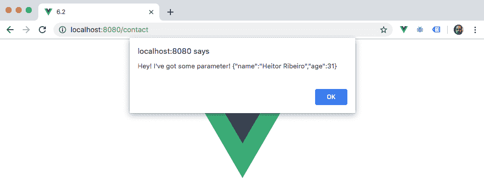
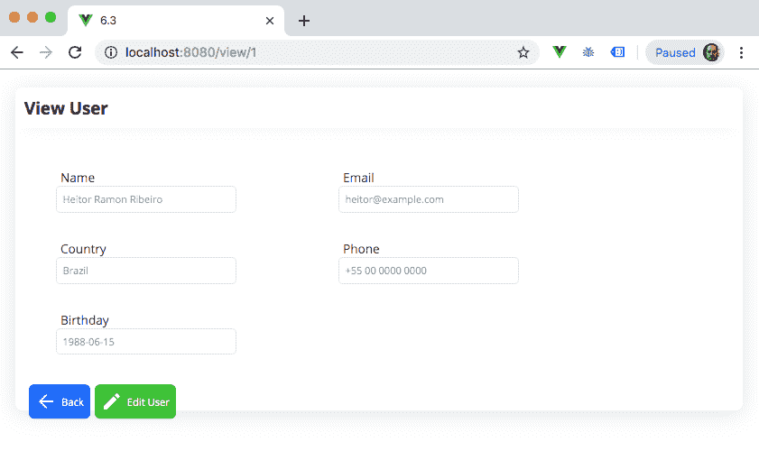
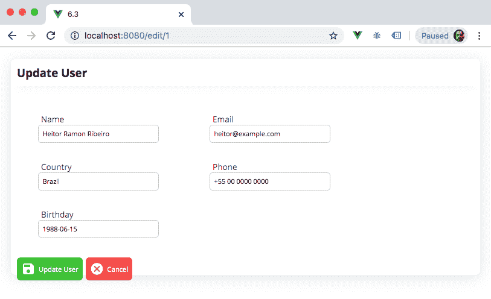
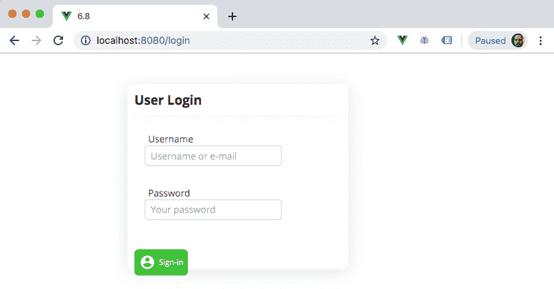

# 六、使用`vue-router`管理路由

应用的主要部分之一是路由器管理。在这里，可以在一个地方组合无限个组件。

路由器能够根据 URL 协调组件呈现和指示应用应该在哪里。增加`vue-router`定制的方式有很多种。您可以添加路由保护，以检查特定路由是否可以通过访问级别进行导航，或在进入路由之前获取数据，从而管理应用上的错误。

在本章中，您将学习如何创建应用路由、动态路由、别名和可信路由以及嵌套路由器视图。我们还将研究如何管理错误、创建路由器防护以及延迟加载页面。

在本章中，我们将介绍以下配方：

*   创建简单路线
*   创建程序化导航
*   创建动态路由器路径
*   创建路由别名
*   创建路由重定向
*   创建嵌套路由器视图
*   创建 404 错误页面
*   创建身份验证中间件
*   延迟异步加载页面

# 技术要求

在本章中，我们将使用**Node.js**和**Vue CLI。**

Attention Windows users: you need to install an npm package called `windows-build-tools` to be able to install the following required packages. To do so, open the PowerShell as an administrator and execute the following command:
`> npm install -g windows-build-tools`

要安装 Vue CLI，您需要打开终端（macOS 或 Linux）或命令提示符/PowerShell（Windows）并执行以下命令：

```js
> npm install -g @vue/cli @vue/cli-service-global
```

# 创建简单路线

在应用中，您可以创建无限多个路由组合，这些路由可以指向任意数量的页面和组件。

`vue-router`是该组合的维护者。我们需要使用它来设置如何为访客创建路径和铺设路线的说明。

在本配方中，我们将学习如何创建一条通向不同组件的初始路线。

## 准备

此配方的先决条件如下：

*   Node.js 12+

所需的 Node.js 全局对象如下：

*   `@vue/cli`
*   `@vue/cli-service-global`

## 怎么做。。。

要创建 Vue CLI 项目，请执行以下步骤：

1.  我们需要打开终端（macOS 或 Linux）或命令提示符/PowerShell（Windows）并执行以下命令：

```js
> vue create initial-routes
```

2.  CLI 将询问一些有助于创建项目的问题。您可以使用箭头键进行导航，*输入*键继续，*空格键*选择一个选项。

3.  启动新项目有两种方法。默认方法是没有任何插件或配置的基本 Babel 和 ESLint 项目，以及`Manually`模式，您可以在其中选择更多模式、插件、linter 和选项。我们将选择`Manually`：

```js
? Please pick a preset: (Use arrow keys)
 default (babel, eslint) 
❯ Manually select features ‌
```

4.  现在，我们被问及该项目需要哪些功能。这些特性是一些 Vue 插件，如 Vuex 或 Vue 路由器（Vue 路由器）、测试器、linter 等。选择`Babel`、`Router`和`Linter / Formatter`**：**

```js
? Check the features needed for your project: (Use arrow keys) ❯ Babel
  TypeScript
  Progressive Web App (PWA) Support ❯ Router
  Vuex
  CSS Pre-processors ❯ Linter / Formatter
  Unit Testing
  E2E Testing
```

5.  现在，Vue CLI 将询问您是否要在路由管理上使用历史记录模式。我们将选择`Y`（是）：

```js
? Use history mode for router? (Requires proper server setup for
  index fallback in production) (Y/n) y
```

6.  通过选择一根短绒并格式化，继续此过程。在本例中，我们将选择`ESLint + Airbnb config`：

```js
? Pick a linter / formatter config: (Use arrow keys)
  ESLint with error prevention only ❯ ESLint + Airbnb config ESLint + Standard config 
  ESLint + Prettier
```

7.  在设置了 linting 规则之后，我们需要定义它们何时应用于代码。它们可以在保存时应用，也可以在提交时修复：

```js
? Pick additional lint features: (Use arrow keys)
  Lint on save ❯ Lint and fix on commit
```

8.  在定义了所有这些插件、linter 和处理器之后，我们需要选择存储设置和配置的位置。存储它们的最佳位置是在专用文件中，但也可以将它们存储在`package.json`中：

```js
? Where do you prefer placing config for Babel, ESLint, etc.? (Use arrow keys) ❯ In dedicated config files  In package.json 
```

9.  现在，您可以选择是否要将此选择设置为未来项目的预设，因此无需再次重新选择所有内容：

```js
? Save this as a preset for future projects? (y/N) n
```

我们的配方将分为五个部分：

*   创建`NavigationBar`组件
*   创建联系人页面
*   创建关于页面
*   更改应用的主要组件
*   创建路由

让我们开始吧。

### 创建导航栏组件

现在我们要创建将在我们的应用中使用的`NavigationBar`组件。

#### 单文件组件

在这一部分中，我们将创建单文件组件的`<script>`部分。按照以下说明正确创建组件：

1.  在`src/components`文件夹中创建一个`navigationBar.vue`文件并打开它。
2.  创建组件的默认`export`对象，Vue 属性为`name`：

```js
<script>
export default {
  name: 'NavigationBar',
};
</script>
```

#### 单文件组件<template></template>

在这一部分中，我们将创建单文件组件的`<template>`部分。按照以下说明正确创建组件：

1.  创建一个`div`HTML 元素，其`id`属性定义为`"nav"`，并在其内部创建三个`RouterLink`组件。这些组件将指向`Home`、`About`和`Contact`路线。在`RouterLink`组件中，我们将添加一个`to`属性，分别定义为每个组件的路由，并将文本内容定义为菜单的名称：

```js
<div id="nav">
  <router-link to="/">
    Home
  </router-link> |
  <router-link to="/about">
    About
  </router-link> |
  <router-link to="/contact">
    Contact
  </router-link>
</div>
```

### 创建联系人页面

我们需要确保在用户输入`/contact`URL 时呈现联系人页面。为此，我们需要创建一个单独的文件组件作为联系人页面。

#### 单文件组件

在这一部分中，我们将创建单文件组件的`<script>`部分。按照以下说明正确创建组件：

1.  在`src/views`文件夹中，创建一个名为`contact.vue`的新文件并打开它。
2.  创建组件的默认`export`对象，Vue 属性为`name`：

```js
<script>
export default {
  name: 'ContactPage',
};
</script>
```

#### 单文件组件<template></template>

在这一部分中，我们将创建单文件组件的`<template>`部分。按照以下说明正确创建组件：

1.  创建一个`div`HTML 元素，将`class`属性定义为`"contact"`。
2.  在`<h1>`HTML 元素内，添加显示当前页面的文本上下文：

```js
<template>
  <div class="contact">
    <h1>This is a contact page</h1>
  </div>
</template>
```

### 创建关于页面

我们需要在用户输入`/about`URL 时呈现联系人页面。在下面的小节中，我们将为 about 页面创建单文件组件。

#### 单文件组件

在这一部分中，我们将创建单文件组件的`<script>`部分。按照以下说明正确创建组件：

1.  在`src/views`文件夹中，创建一个名为`About.vue`的新文件并打开它。
2.  使用 Vue 属性`name`创建组件的默认导出对象：

```js
<script>
export default {
  name: 'AboutPage',
};
</script>
```

#### 单文件组件<template></template>

在这一部分中，我们将创建单文件组件的`<template>`部分。按照以下说明正确创建组件：

1.  创建一个具有定义为`"about"`的`class`属性的`div`HTML 元素。
2.  在其内部，放置一个带有文本上下文的`<h1>`元素，显示当前页面：

```js
<template>
  <div class="about">
    <h1>This is an about page</h1>
  </div>
</template>
```

### 更改应用的主要组件

在创建页面和导航栏之后，我们需要更改应用的主要组件，以便能够呈现路线，并使导航栏位于顶部。

#### 单文件组件

在这一部分中，我们将创建单文件组件的`<script>`部分。按照以下说明正确创建组件：

1.  打开`src`文件夹中的`App.vue`。
2.  导入`NavigationBar`组件：

```js
import NavigationBar from './components/navigationBar.vue';
```

3.  在 Vue`components`属性中，声明导入的`NavigationBar`：

```js
export default {
  components: { NavigationBar },
};
```

#### 单文件组件<template></template>

在这一部分中，我们将创建单文件组件的`<template>`部分。在`div`HTML 元素中，添加`NavigationBar`组件和`RouterView`组件：

```js
<template>
  <div id="app">
    <navigation-bar />
    <router-view/>
  </div>
</template>
```

### 创建路由

现在我们需要使路由在应用中可用。为此，首先，我们需要声明路由和路由将渲染的组件。按照以下步骤正确创建 Vue 应用路由器：

1.  在`src/router`文件夹中，打开`index.js`文件。
2.  导入`Contact`组件页面：

```js
import Vue from 'vue';
import VueRouter from 'vue-router';
import Home from '../views/Home.vue';
import Contact from '../views/contact.vue';
```

3.  在`routes`数组中，我们需要创建一个新的`route`对象。此对象的`path`属性定义为`'/contact'`、`name`属性定义为`'contact'`、`component`属性指向导入的`Contact`组件：

```js
{
  path: '/contact',
  name: 'contact',
  component: Contact,
},
```

要运行服务器并查看组件，您需要打开终端（macOS 或 Linux）或命令提示符/PowerShell（Windows）并执行以下命令：

```js
> npm run serve
```

以下是渲染并运行的组件：


## 它是如何工作的。。。

当`vue-router`作为插件添加到 Vue 中时，它会开始观察`window.location.pathname`和其他 URL 属性的变化，以对照路由器配置上的 URL 列表检查浏览器上当前 URL 的权重。

在这种情况下，我们使用的是直接 URL 和非动态 URL。因此，`vue-router`插件只需要检查 URL 路径的直接匹配，而不需要根据正则表达式验证器权衡可能的匹配。

匹配 URL 后，`router-view`组件充当**动态组件**，呈现我们在`vue-router`配置中定义的组件。

## 另见

有关`vue-router`的更多信息，请访问[https://router.vuejs.org/.](https://router.vuejs.org/)

有关 Vue CLI 的更多信息，请访问[https://cli.vuejs.org/.](https://cli.vuejs.org/)

# 创建程序化导航

当使用`vue-router`时，也可以通过函数执行来改变应用的当前路由，而不需要专门的`vue-router`组件来创建链接。

使用编程导航，您可以确保所有路由重定向都可以在代码中的任何位置执行。使用此方法可以使用特殊的路线方向，例如传递参数和使用路线名称进行导航。

在本食谱中，我们将学习如何使用编程导航功能提供的额外可能性来执行该功能。

## 准备

此配方的先决条件如下：

*   Node.js 12+

所需的 Node.js 全局对象如下：

*   `@vue/cli`
*   `@vue/cli-service-global`

## 怎么做。。。

要启动我们的组件，我们可以使用我们在“*创建简单路由*”*配方中创建的 Vue 项目和 Vue CLI，或者我们可以启动一个新的。*

 *要启动新的，请打开终端（macOS 或 Linux）或命令提示符/PowerShell（Windows）并执行以下命令：

```js
> vue create route-project
```

选择手动功能并添加`Router`作为所需功能，如“*如何操作”中所示。。。*创建简单路线*配方中的*部分。

我们的配方将分为两部分：

*   更改应用的主要组件
*   更改联系人视图

让我们开始吧。

### 更改应用的主要组件

我们将从`App.vue`文件开始。我们将添加一个在超时后执行的编程导航函数，该函数将添加到组件生命周期挂钩中。

#### 单文件组件

在这一部分中，我们将创建单文件组件的`<script>`部分。按照以下说明正确创建组件：

1.  打开`src`文件夹中的`App.vue`。
2.  添加一个`mounted`属性：

```js
mounted() {}
```

3.  在`mounted`属性中，我们需要添加一个`setTimeout`函数，它将执行`$router.push`函数。执行此函数时，将接收一个 JavaScript 对象作为参数，该对象具有两个属性`name`和`params`：

```js
mounted() {
  setTimeout(() => {
    this.$router.push({
      name: 'contact',
      params: {
        name: 'Heitor Ribeiro',
        age: 31,
      },
    });
  }, 5000);
},
```

### 更改联系人视图

在 contact 视图中，我们需要添加一个事件侦听器，它将获取路由更改并执行一个操作。

#### 单文件组件

在这一部分中，我们将创建单文件组件的`<script>`部分。按照以下说明正确创建组件：

1.  打开`src/views`文件夹中的`contact.vue`。
2.  添加新的`mounted`属性：

```js
mounted() {}
```

3.  在此属性中，我们将添加一个验证，该验证将检查`$route.params`对象上是否有任何参数，并显示一个带有`$route.params`的`alert`：

```js
mounted() {
  if (Object.keys(this.$route.params).length) {
    alert(`Hey! I've got some parameter! 
       ${JSON.stringify(this.$route.params)}`);
  }
},
```

要运行服务器并查看组件，您需要打开终端（macOS 或 Linux）或命令提示符/PowerShell（Windows）并执行以下命令：

```js
> npm run serve
```

以下是渲染并运行的组件：



## 它是如何工作的。。。

执行`$router.push`功能时，通知`vue-router`更改应用所在的位置，在此过程中，您将一些参数传递给新路由器，新路由器将替换当前路由。在这些参数中，有一个名为`params`的属性，它向新路由器发送一组参数。

当进入这个新路由器时，我们将从路由器中调用的所有参数都将在`$route.params`对象中可用；在那里，我们可以在视图或组件中使用它。

## 还有更多。。。

在编程导航中，可以通过路由器导航，使用`$router.push`功能将路由器添加到浏览器历史记录中，但也可以使用其他功能。

`$router.replace`功能将替换新的用户导航历史记录，使其无法返回到最后一页。

`$router.go`用于逐步移动用户导航历史记录。向前，你需要传递正数，向后，你需要传递负数。

## 另见

有关`vue-router`程序导航的更多信息，请访问[https://router.vuejs.org/guide/essentials/navigation.html.](https://router.vuejs.org/guide/essentials/navigation.html)

# 创建动态路由器路径

向应用添加路由是必须的，但有时您需要的不仅仅是简单的路由。在本食谱中，我们将了解动态路由是如何发挥作用的。使用动态路由，您可以定义可以通过 URL 设置的自定义变量，并且您的应用可以从已经定义的变量开始。

在本食谱中，我们将学习如何在 CRUD 列表上使用动态路由器路径。

## 准备

此配方的先决条件如下：

*   Node.js 12+

所需的 Node.js 全局对象如下：

*   `@vue/cli`
*   `@vue/cli-service-global`

## 怎么做。。。

为了启动我们的组件，我们将使用 Vue 项目和 Vue CLI，这是我们在[第 5 章](05.html)*通过 HTTP 请求从 Web 获取数据*中的“*与 axios 和 Vuesax*创建 CRUD 接口”中完成的。在以下步骤中，我们将通过 Vue UI 仪表板将`vue-router`添加到项目中：

1.  首先，您需要打开`vue ui`。为此，请打开终端（macOS 或 Linux）或命令提示符/PowerShell（Windows）并执行以下命令：

```js
> vue ui
```

2.  在那里，您需要通过定位项目文件夹来导入项目。导入`vue ui`后，您将被重定向到仪表板。
3.  点击【添加插件管理】页面上的【添加插件】按钮。然后，点击继续*按钮。*
**   Vue CLI 将自动为我们在项目上安装和配置 Vue 路由器。我们现在需要为**列表**、**视图、**和**编辑**页面创建每个视图。*

 *要开始视图开发，我们将首先按照用户列表路线进行。在每个路径中，我们将解构我们制作的旧组件，并将其重新创建为视图。

我们的配方将分为八个部分：

*   更改应用的主要组件
*   更改 mixin 的路径
*   Axios 实例配置
*   用户列表视图
*   用户创建视图
*   用户信息视图
*   用户更新视图
*   创建动态路由

让我们开始吧。

### 更改应用的主要组件

添加 vue 路由器插件后，`App.vue`将发生变化。我们需要恢复安装`vue-router`时所做的更改。这是必要的，因为当`vue-ui`添加`vue-router`插件时，它将更改`App.vue`，添加我们不需要的示例代码。

#### 单文件组件<template></template>

在这一部分中，我们将创建单文件组件的`<template>`部分。按照以下说明正确创建组件：

1.  打开`src`文件夹中的`App.vue`。
2.  删除所有内容，只留下[T0]HTML 元素和[T1]组件：

```js
<template>
  <div id="app">
    <router-view/>
  </div>
</template>
```

### 更改 mixin 的路径

在上一个配方中，我们使用了一种`changeComponent`混合剂。现在我们要处理 routes，我们需要将这个 mixin 更改为一个`changeRoute`mixin 并改变它的行为。在以下步骤中，我们将更改 mixin 的工作方式，以便能够更改路由而不是组件：

1.  在`src/mixin`文件夹中，将`changeComponent.js`重命名为`changeRoute.js`并打开。

2.  我们将删除`changeComponent`方法，并创建一个名为`changeRoute`的新方法。这个新方法将接收两个参数，`name`和`id`。`name`参数是路由名称，如`vue-router`配置中所设置，`id`将是我们将在路由更改中传递参数的用户 id。此方法将执行`$router.push`，并将这些参数作为参数传递：

```js
export default {
  methods: {
    async changeRoute(name, id = 0) {
      await this.$router.push({
        name,
        params: {
          id,
        },
      });
    },
  }
}
```

### Axios 实例配置

为了在 MirageJS 服务器中获取数据，我们需要在 axios 实例中定义一些选项。现在，在以下步骤中，我们将配置 axios 实例以使用新的路由系统：

1.  在`src/http`文件夹中，打开`baseFetch.js`文件。
2.  在`axios`的`localApi`实例的创建者处，我们需要添加一个`options`对象，传递`baseURL`属性。此`baseURL`将是当前浏览器导航 URL：

```js
const localApi = createAxios({
  baseURL: `${document.location.protocol}//${document.location.host}`,
});
```

### 用户列表视图

为了创建视图，我们将从`list.vue`组件中提取代码，并将其重塑为页面视图。

#### 单文件组件

在这一部分中，我们将创建单文件组件的`<script>`部分。按照以下说明正确创建组件：

1.  将`list.vue`文件从`components`移动到`views`文件夹，并将其重命名为`List.vue`。
2.  移除旧的`changeComponent`mixin 导入，导入新的`changeRoute`mixin：

```js
import changeRouteMixin from '@/mixin/changeRoute';
```

3.  在 Vue`mixins`属性中，我们需要将`changeComponent`替换为`changeRoute`：

```js
mixins: [changeRouteMixin],
```

4.  在`getAllUsers`和`deleteUser`方法中，我们需要从`getHttp`和`deleteHttp`功能参数中删除`${window.location.href}`：

```js
methods: {
  async getAllUsers() {
    const { data } = await getHttp(`api/users`);
    this.userList = data;
  },
  async deleteUser(id) {
    await deleteHttp(`api/users/${id}`);
    await this.getAllUsers();
  },
}
```

#### 单文件组件<template></template>

在这一部分中，我们将创建单文件组件的`<template>`部分。按照以下说明正确创建组件：

1.  我们需要用`VsRow`和`VsCol`组件包装`VsCard`组件及其子内容。`VsCol`组件的`vs-type`属性定义为`'flex'`、`vs-justify`属性定义为`'left'`、`vs-align`属性定义为`'left'`、`vs-w`属性定义为`12`：

```js
<template>
  <vs-row>
    <vs-col
      vs-type="flex"
      vs-justify="left"
      vs-align="left"
      vs-w="12">
      <vs-card... />
    </vs-col>
  </vs-row>
</template>
```

2.  在动作按钮上，我们将`changeComponent`功能更改为`changeRoute`：

```js
<vs-td :data="data[index].id">
  <vs-button
    color="primary"
    type="filled"
    icon="remove_red_eye"
    size="small"
    @click="changeRoute('view', data[index].id)"
  />
  <vs-button
    color="success"
    type="filled"
    icon="edit"
    size="small"
    @click="changeRoute('edit', data[index].id)"
  />
  <vs-button
    color="danger"
    type="filled"
    icon="delete"
    size="small"
    @click="deleteUser(data[index].id)"
  />
</vs-td>
```

3.  在`VsCard`页脚，我们需要将动作按钮`changeComponent`方法更改为`changeRoute`方法：

```js
<template slot="footer">
  <vs-row vs-justify="flex-start">
    <vs-button
      color="primary"
      type="filled"
      icon="fiber_new"
      size="small"
      @click="changeRoute('create')"
    >
      Create User
    </vs-button>
  </vs-row>
</template>
```

### 用户创建视图

为了创建视图，我们将从`create.vue`组件中提取代码，并将其重塑为页面视图。

#### 单文件组件

在这一部分中，我们将创建单文件组件的`<script>`部分。按照以下说明正确创建组件：

1.  将`create.vue`文件从`components`移动到`views`文件夹，并将其重命名为`Create.vue`。
2.  移除旧的`changeComponent`mixin 导入，导入新的`changeRoute`mixin：

```js
import changeRouteMixin from '@/mixin/changeRoute';
```

3.  在 Vue`mixins`属性中，我们需要将`changeComponent`替换为`changeRoute`：

```js
mixins: [changeRouteMixin],
```

4.  在`getUserById`方法中，我们需要从`postHttp`函数 URL 中删除`${window.location.href}`并将`changeComponent`函数更改为`changeRoute`：

```js
async createUser() {
  await postHttp(`/api/users`, {
    data: {
      ...this.userData,
    }
  });
  this.changeRoute('list');
},
```

#### 单文件组件<template></template>

在这一部分中，我们将创建单文件组件的`<template>`部分。按照以下说明正确创建组件：

1.  我们需要用`VsRow`和`VsCol`组件包装`VsCard`组件及其子内容。`VsCol`组件的`vs-type`属性定义为`'flex'`、`vs-justify`属性定义为`'left'`、`vs-align`属性定义为`'left'`、`vs-w`属性定义为`12`：

```js
<template>
  <vs-row>
    <vs-col
      vs-type="flex"
      vs-justify="left"
      vs-align="left"
      vs-w="12">
      <vs-card... />
    </vs-col>
  </vs-row>
</template>
```

2.  在`VsCard`页脚，我们需要将`Cancel`按钮的`changeComponent`功能更改为`changeRoute`：

```js
<vs-button
  color="danger"
  type="filled"
  icon="cancel"
  size="small"
  style="margin-left: 5px"
  @click="changeRoute('list')"
>
  Cancel
</vs-button>
```

### 用户信息视图

为了创建视图，我们将从`view.vue`组件中提取代码，并将其重塑为页面视图。

#### 单文件组件

在这一部分中，我们将创建单文件组件的`<script>`部分。按照以下说明正确创建组件：

1.  将`view.vue`文件从`src/components`移动到`src/views`文件夹，并将其重命名为`View.vue`。
2.  移除旧的`changeComponent`mixin 导入，导入新的`changeRoute`mixin：

```js
import changeRouteMixin from '@/mixin/changeRoute';
```

3.  在 Vue`mixins`属性中，我们需要将`changeComponent`替换为`changeRoute`：

```js
mixins: [changeRouteMixin],
```

4.  在`component`对象中新建`computed`属性，属性为`userId`，返回`$route.params.id`：

```js
computed: {
  userId() {
    return this.$route.params.id;
  },
},
```

5.  在`getUserById`方法中，我们需要从`getHttp`函数 URL 中删除`${window.location.href}`：

```js
methods: {
  async getUserById() {
    const { data } = await getHttp(`api/users/${this.userId}`);
    this.userData = data;
  },
}
```

#### 单文件组件<template></template>

在这一部分中，我们将创建单文件组件的`<template>`部分。按照以下说明正确创建组件：

1.  我们需要用`VsRow`和`VsCol`组件包装`VsCard`组件及其子内容。`VsCol`组件的`vs-type`属性定义为`'flex'`、`vs-justify`属性定义为`'left'`、`vs-align`属性定义为`'left'`、`vs-w`属性定义为`12`：

```js
<template>
  <vs-row>
    <vs-col
      vs-type="flex"
      vs-justify="left"
      vs-align="left"
      vs-w="12">
      <vs-card... />
    </vs-col>
  </vs-row>
</template>
```

2.  在`VsCard`页脚，我们需要将后退按钮`changeComponent`功能更改为`changeRoute`：

```js
<vs-button
  color="primary"
  type="filled"
  icon="arrow_back"
  size="small"
  style="margin-left: 5px"
  @click="changeRoute('list')"
>
  Back
</vs-button>
```

### 用户更新视图

为了创建视图，我们将从`update.vue`组件中提取代码，并将其重塑为页面视图。

#### 单文件组件

在这一部分中，我们将创建单文件组件的`<script>`部分。按照以下说明正确创建组件：

1.  将`update.vue`文件从`src/components`移动到`src/views`文件夹，并将其重命名为`Edit.vue`。
2.  移除旧的`changeComponent`mixin 导入，导入新的`changeRoute`mixin：

```js
import changeRouteMixin from '@/mixin/changeRoute';
```

3.  在 Vue`mixins`属性中，我们需要将`changeComponent`替换为`changeRoute`：

```js
mixins: [changeRouteMixin],
```

4.  在`component`对象中新建一个`computed`属性，使用`userId`属性，返回`$route.params.id`：

```js
computed: {
  userId() {
    return this.$route.params.id;
  },
},
```

5.  在`getUserById`和`updateUser`方法中，我们需要从`getHttp`和`patchHttp`函数 URL 中删除
    `${window.location.href}`，并将`changeComponent`函数更改为`changeRoute`：

```js
methods: {
  async getUserById() {
    const { data } = await getHttp(`api/users/${this.userId}`);
    this.userData = data;
  },
  async updateUser() {
    await patchHttp(`api/users/${this.userData.id}`, {
      data: {
        ...this.userData,
      }
    });
    this.changeRoute('list');
  },
},
```

#### 单文件组件<template></template>

在这一部分中，我们将创建单文件组件的`<template>`部分。按照以下说明正确创建组件：

1.  我们需要用`VsRow`和`VsCol`组件包装`VsCard`组件及其子内容。`VsCol`组件的`vs-type`属性定义为`'flex'`、`vs-justify`属性定义为`'left'`、`vs-align`属性定义为`'left'`、`vs-w`属性定义为`12`：

```js
<template>
  <vs-row>
    <vs-col
      vs-type="flex"
      vs-justify="left"
      vs-align="left"
      vs-w="12">
      <vs-card... />
    </vs-col>
  </vs-row>
</template>
```

2.  在`VsCard`页脚，我们需要将`Cancel`按钮的`Component`功能更改为`changeRoute`：

```js
<vs-button
  color="danger"
  type="filled"
  icon="cancel"
  size="small"
  style="margin-left: 5px"
  @click="changeRoute('list')"
>
  Cancel
</vs-button>
```

### 创建动态路由

现在，随着页面视图的创建，我们需要创建路由并使其接受参数，将其转换为动态路由。在以下步骤中，我们将创建应用的动态路由：

1.  打开`src/router`文件夹中的`index.js`。
2.  首先，我们需要导入四个新页面——`List`、`View`、`Edit`、`Create`和`Update`：

```js
import List from '@/views/List.vue';
import View from '@/views/View.vue';
import Edit from '@/views/Edit.vue';
import Create from '@/views/Create.vue';

```

3.  在`routes`数组中，我们将为导入的每个页面添加一个新的 route 对象。在这个对象中，将有三个属性：`name`、`path`和`component`。
4.  对于`list`路线，我们将`name`定义为`'list'`、`path`定义为`'/'`、`component`定义为进口`List`组件：

```js
{
  path: '/',
  name: 'list',
  component: List,
},
```

5.  在`view`路线上，我们将`name`定义为`'view'`、`path`定义为`'/view/:id'`、`component`定义为进口`View`组件：

```js
{
  path: '/view/:id',
  name: 'view',
  component: View,
},
```

6.  在`edit`路线中，我们将`name`定义为`'edit'`、`path` 定义为`'/edit/:id'`、`component`定义为进口`Edit`组件：

```js
{
  path: '/edit/:id',
  name: 'edit',
  component: Edit,
},
```

7.  最后，在`create`路线上，我们将`name`定义为`'create'`、`path`定义为`'/create'`、`component`定义为进口`Create`组件：

```js
{
  path: '/create',
  name: 'create',
  component: Create,
},
```

8.  创建`VueRouter`时，我们会添加`mode`选项属性，并将其设置为`'history'`：

```js
const router = new VueRouter({
  mode: 'history',
  base: process.env.BASE_URL,
  routes
});
```

要运行服务器并查看组件，您需要打开终端（macOS 或 Linux）或命令提示符/PowerShell（Windows）并执行以下命令：

```js
> npm run serve
```

以下是渲染并运行的组件：

*   **列表查看路径-**`/`将是您的用户列表页面，其中包含应用中所有用户的列表、查看、编辑和删除按钮，以及创建新用户的按钮：


*   **用户查看路线-**`/view/:id`将是您的用户查看页面，在这里可以查看您的用户信息，如用户名、电子邮件、国家/地区、生日和电话号码：



*   **用户编辑路径-**`/update/:id`将是您的用户编辑页面，在这里可以编辑您的用户信息，更改用户名、电子邮件、国家、生日和电话号码：



*   **创建用户路由—**`/update/:id`**将是您的用户创建页面，可以在系统上创建新用户：**

 **

## 它是如何工作的。。。

当`vue-router`被创建，并且路由通过匹配时，路由器分析基于用于定义每个路由权重的正则表达式检查路由的最佳匹配。

当路由被定义且路径中有变量时，需要在变量参数前添加一个`:`。此参数将传递给`$route.params`属性中的组件。

## 另见

有关动态路由器匹配的更多信息，请访问[https://router.vuejs.org/guide/essentials/dynamic-matching.html.](https://router.vuejs.org/guide/essentials/dynamic-matching.html)

# 创建路由别名

每一个应用都是一个活的有机体——它每天都在进化、变异和变化。有时，为了更好的命名或不推荐的服务，这些演进可以通过路由器更改的形式实现。在`vue-router`中，可以使所有这些更改对用户不可见，因此当用户使用旧链接时，他们仍然可以访问应用。

在此配方中，我们将学习如何为应用创建路由别名并使用它。

## 准备

此配方的先决条件如下：

*   Node.js 12+

所需的 Node.js 全局对象如下：

*   `@vue/cli`
*   `@vue/cli-service-global`

## 怎么做。。。

要启动我们的组件，我们将使用我们在“*创建动态路由器路径*配方”中完成的带有 Vue CLI 的 Vue 项目，或者我们可以启动一个新的。

要启动新的，请打开终端（macOS 或 Linux）或命令提示符/PowerShell（Windows）并执行以下命令：

```js
> vue create http-project
```

选择手动功能并添加`router`作为所需功能，如“*如何操作”中所示。。。*创建简单路线*配方的*部分。

现在，在以下步骤中，我们将创建路由器别名：

1.  打开`src/router`文件夹中的`index.js`。
2.  在`list`对象，我们将`path`属性从`'/'`更改为`'/user'`，对于`alias`属性，我们将设置`'/'`：

```js
{
  path: '/user',
  name: 'list',
  alias: '/',
  component: List,
},
```

3.  在`view`对象中，我们将`path`属性从`'/view/:id'`更改为`'/user/:id'`，并将`alias`属性设置为`'/view/:id'`：

```js
{
  path: '/user/:id',
  name: 'view',
  alias: '/view/:id',
  component: View,
},
```

4.  在`edit`对象中，我们将`path`属性从`'/edit/:id'`更改为`'/user/edit/:id'`，并将`alias`属性设置为`'/edit/:id'`：

```js
{
  path: '/user/edit/:id',
  name: 'edit',
  alias: '/edit/:id',
  component: Edit,
},
```

5.  最后，在`create`对象中，我们将`path`属性从`'/create'`更改为`'/user/create'`，并将`alias`属性设置为`'/create'`：

```js
{
  path: '/user/create',
  name: 'create',
  alias: '/create',
  component: Create,
},
```

## 它是如何工作的。。。

当用户进入您的应用时，`vue-router`将尝试将路径与用户试图访问的路径匹配。如果 route 对象中有一个名为`alias`的属性，`vue-router`将使用该属性来维护引擎盖下的旧路由，并使用别名路由。如果找到别名，将呈现该别名的组件，路由器将保留为别名，不向用户显示更改，从而使其透明。

在我们的场景中，我们对应用进行了一次转换，现在可以处理在`/user`名称空间中调用的所有用户，但仍然保持旧的 URL 结构，这样，如果老访问者试图访问网站，他们将能够正常使用该应用。

## 另见

您可以在[找到有关`vue-router`别名的更多信息 https://router.vuejs.org/guide/essentials/redirect-and-alias.html#alias.](https://router.vuejs.org/guide/essentials/redirect-and-alias.html#alias)

# 创建路由重定向

路由器重定向的工作原理与路由器别名几乎相同，但主要区别在于用户被真正重定向到新的 URL。使用此过程，您可以管理如何加载新路由。

## 准备

此配方的先决条件如下：

*   Node.js 12+

所需的 Node.js 全局对象如下：

*   `@vue/cli`
*   `@vue/cli-service-global`

## 怎么做。。。

要启动我们的组件，我们将使用我们在“*创建路由别名*配方中完成的 Vue 项目和 Vue CLI，或者我们可以启动一个新的。

要启动新的，请打开终端（macOS 或 Linux）或命令提示符/PowerShell（Windows）并执行以下命令：

```js
> vue create http-project
```

选择手动功能并添加`Router`作为所需功能，如“*如何操作”中所示。。。*创建简单路线*配方中的*步骤。

现在，在这些步骤中，我们将创建路由器重定向规则：

1.  打开`src/router`文件夹中的`index.js`。
2.  在`routes`数组的末尾插入一个新的 route 对象。此对象将有两个属性，`path`和`redirect`。在`path`属性中，我们需要定义用户将输入的路径`'/create-new-user'`，在`redirect`中，定义用户将被重定向到的路径，在本例中为`'/user/create'`：

```js
{
  path: '/create-new-user',
  redirect: '/user/create',
},
```

3.  创建一个新对象，该对象将有两个属性，`path`和`redirect`。在`path`属性中，我们需要定义用户将输入的路径`'/users'`，在`redirect`中，我们将创建一个名为`name`的属性的对象，并将值设置为`'list'`：

```js
{
  path: '/users',
  redirect: {
    name: 'list',
  },
},
```

4.  创建一个新对象。此对象将有两个属性，`path`和`redirect`。在`path`属性中，我们需要定义用户将输入的路径`'/my-user/:id?'`，在`redirect`中，我们将创建一个函数，该函数将接收一个参数`to`，它是当前路由的对象。我们需要检查路由中是否存在用户 ID，以将用户重定向到编辑页面。否则，我们会将它们重定向到用户列表：

```js
{
  path: '/my-user/:id?',
  redirect(to) {
    if (to.params.id) {
      return '/user/:id';
    }
    return '/user';
  },
},
```

5.  最后，我们将创建一个具有两个属性的 route 对象，`path`和`redirect`。在`path`属性中，我们需要定义用户将要输入的路径`'/*'`，在`redirect`中，我们需要将`redirect`属性定义为`'/'`：

```js
{
  path: '*',
  redirect: '/',
},
```

Remember that the last route with the `'*'` will always be the route that will be rendered when there is no match in the URL that your user is trying to enter.

## 它是如何工作的。。。

当我们将`redirect`定义为一个新路由时，它的工作原理与别名类似，但`redirect`属性可以接收三种类型的参数：路由本身重定向时的字符串、使用其他参数（如路由名称）重定向时的对象，以及最后但并非最不重要的函数类型，即`redirect`可以处理并返回前两个对象中的一个，以便重定向用户。

## 另见

您可以在[找到有关`vue-router`重定向的更多信息 https://router.vuejs.org/guide/essentials/redirect-and-alias.html#redirect.](https://router.vuejs.org/guide/essentials/redirect-and-alias.html#redirect)

# 创建嵌套路由器视图

在`vue-router`中，嵌套路由类似于路由的名称空间，在该名称空间中，可以在同一路由中有多个级别的路由，使用基础视图作为主视图，并在其中呈现嵌套路由。

在多模块应用中，这用于处理 CRUD 之类的路由，其中您将有一个基本路由，子路由将是 CRUD 视图。

在本配方中，您将学习如何创建嵌套管线。

## 准备

此配方的先决条件如下：

*   Node.js 12+

所需的 Node.js 全局对象如下：

*   `@vue/cli`
*   `@vue/cli-service-global`

## 怎么做。。。

要启动我们的组件，我们将使用 Vue 项目和 Vue CLI，这是我们在“*创建动态路由器路径*配方中使用的，或者我们可以启动一个新的。

要启动新的，请打开终端（macOS 或 Linux）或命令提示符/PowerShell（Windows）并执行以下命令：

```js
> vue create http-project
```

选择手动功能并添加`Router`作为所需功能，如“*如何操作”中所示。。。*创建简单路线*配方中的*部分。

我们的配方将分为两部分：

*   在布局上创建`router-view`
*   更改路由器文件

让我们开始吧。

### 在布局上创建路由器视图

当将`vue-router`用于儿童路线时，我们需要创建主视图，它将有一个名为`RouterView`的特殊组件。此组件将在正在呈现的布局或页面中呈现当前路由器。

现在，在以下步骤中，我们将创建页面布局：

1.  在`src/views`文件夹中，我们需要创建一个名为`user`的新文件夹，并将`Create`、`Edit`、`List`、**、**和`View`页面移动到此新文件夹中。
2.  在`user` 文件夹中创建一个名为`Index.vue`的新文件并打开它。
3.  在单文件组件`<template>`部分，添加一个`router-view`组件：

```js
<template>
  <router-view/>
</template>
<script>
  export default {
    name: 'User',
  }
</script>
```

### 更改路由器文件

我们将创建一个新文件来管理用户的特定路由，这将帮助我们维护代码并使其更干净。

#### 用户路由

在以下步骤中，我们将为用户创建路由：

1.  在`src/router`文件夹中创建一个名为`user.js`的新文件。
2.  导入`Index`、`List`、`View`、`Edit`**、**和`Create`视图：

```js
import Index from '@/views/user/Index.vue';
import List from '@/views/user/List.vue';
import View from '@/views/user/View.vue';
import Edit from '@/views/user/Edit.vue';
import Create from '@/views/user/Create.vue';
```

3.  创建一个数组并将其作为文件的默认导出。在此数组中，添加一个具有四个属性的`route`对象—`path`、`name`、`component`和`children`。将`path`属性设置为`'/user'`，将`name`属性定义为`'user'`，将`component`定义为导入的`Index`组件，最后将`children`属性定义为空数组：

```js
export default [
  {
    path: '/user',
    name: 'user',
    component: Index,
    children: [],
  },
]

```

4.  在`children`属性中，添加一个具有三个属性的新路由对象—`path`、`name`和`component`。将`path`定义为`''`、`name`定义为`'list'`，最后将`component`属性定义为导入的`List`组件：

```js
{
  path: '',
  name: 'list',
  component: List,
},
```

5.  为视图管线创建管线对象，并使用与最后一个`route`对象相同的结构。将`path`属性定义为`':id'`，将`name`定义为`'view'`，将`component`定义为导入的`View`组件：

```js
{
  path: ':id',
  name: 'view',
  component: View,
},
```

6.  为`edit`路由创建一个路由对象，并使用与最后一个`route`对象相同的结构。将`path`属性定义为`'edit/:id'`，将`name`定义为`'edit'`，将`component`定义为导入的`Edit`组件：

```js
{
  path: 'edit/:id',
  name: 'edit',
  component: Edit,
},
```

7.  为`create`路由创建一个路由对象，使用与最后一个`route`对象相同的结构。将`path`属性定义为`'create'`，将`name`定义为`'create'`，将`component`定义为导入的`Create`组件：

```js
{
  path: 'create',
  name: 'create',
  component: Create,
},
```

#### 路由器管理器

在以下步骤中，我们将创建控制应用上所有路由的路由器管理器：

1.  打开`src/router`文件夹中的`index.js`。
2.  在`src/router`文件夹中导入新创建的`user.js`文件：

```js
import Vue from 'vue';
import VueRouter from 'vue-router';
import UserRoutes from './user';
```

3.  在`routes`数组中，将导入的`UserRoutes`添加为析构函数数组：

```js
const routes = [
  ...UserRoutes,
  {
    path: '*',
    redirect: '/user',
  },
];
```

## 它是如何工作的。。。

`vue-router`提供将子管线用作当前视图或布局内部组件的功能。这样就可以使用一个特殊的布局文件创建一个初始路由，并通过`RouterView`组件呈现该布局中的子组件。

此技术通常用于定义应用中的布局，并为模块设置名称空间，其中父路由可以具有一组特定的顺序，这些顺序将可用于其每个子路由。

## 另见

您可以在[找到有关嵌套路由的更多信息 https://router.vuejs.org/guide/essentials/nested-routes.html#nested-路线](https://router.vuejs.org/guide/essentials/nested-routes.html#nested-routes)。

# 创建 404 错误页面

在某些情况下，您的用户可能会尝试输入旧链接或输入错误，但无法到达正确的路线，这将直接导致他们出现未找到的错误。

在本食谱中，您将学习如何处理`vue-router`中的 404 错误。

## 准备

此配方的先决条件如下：

*   Node.js 12+

所需的 Node.js 全局对象如下：

*   `@vue/cli`
*   `@vue/cli-service-global`

## 怎么做。。。

要启动我们的组件，我们将使用 Vue 项目和 Vue CLI，这是我们在“[T0]创建嵌套路由器视图[T1]”配方中使用的，或者我们可以启动一个新的。

要启动新的，请打开终端（macOS 或 Linux）或命令提示符/PowerShell（Windows）并执行以下命令：

```js
> vue create http-project
```

选择手动功能并添加`Router`作为所需功能，如“*如何操作”中所示。。*。*创建简单路线*配方中的部分。

我们的配方将分为两部分：

*   创建`NotFound`视图
*   更改路由器文件

让我们开始吧。

### 创建 NotFound 视图

我们需要创建一个新的视图，当应用上没有匹配的路由时为用户显示。此页面将是一个简单的通用页面。

#### 单文件组件<template></template>

在这一部分中，我们将创建单文件组件的`<template>`部分。按照以下说明正确创建组件：

1.  在`src/views`文件夹中，创建一个名为`NotFound.vue`的新文件并打开它。

2.  创建一个`VsRow`组件，在其内部创建四个`VsCol`组件。所有这些组件的属性`vs-w`定义为`12`，而`class`定义为`text-center`：

```js
<vs-row>
  <vs-col vs-w="12" class="text-center">
  <!-- Icon -->
  </vs-col>
  <vs-col vs-w="12" class="text-center">
  <!-- Title -->
  </vs-col>
  <vs-col vs-w="12" class="text-center">
  <!-- Text -->
  </vs-col>
  <vs-col vs-w="12" class="text-center">
  <!-- Button -->
  </vs-col>
</vs-row>
```

3.  在第一个`VsCol`组件上，我们将添加一个`VsIcon`组件，并将属性图标设置为`sentiment_dissatisfied`，将`size`定义为`large`：

```js
<vs-icon
  icon="sentiment_dissatisfied"
  size="large"
/>
```

4.  在第二个`VsCol`组件中，我们将为页面添加一个标题：

```js
<h1>Oops!</h1>
```

5.  在第三个`VsCol`组件中，我们需要创建将放置在页面上的文本：

```js
<h3>The page you are looking for are not here anymore...</h3>
```

6.  最后，在第四个`VsCol`组件上，我们将添加`VsButton`组件。该按钮的属性`type`定义为`relief`，属性`to`定义为`'/'`：

```js
<vs-button
  type="relief"
  to="/"
>
  Back to Home...
</vs-button>
```

#### 单文件组件

在这一部分中，我们将创建单文件组件的`<style>`部分。按照以下说明正确创建组件：

1.  将`scoped`标签添加到`<style>`标签：

```js
<style scoped>
</style>
```

2.  创建一个名为`.text-center`的新规则，`text-align`属性定义为`center`，`margin-bottom`属性定义为`20px;`：

```js
.text-center {
  text-align: center;
  margin-bottom: 20px;
}

```

### 更改路由器文件

创建视图后，我们需要将其添加到路由器并使其可供用户使用。为此，我们需要将视图路由添加到路由器管理器中。

在这些步骤中，我们将更改路由器管理器，以添加新的错误页面：

1.  打开`src/router`文件夹中的`index.js`。
2.  导入`NotFound`组件：

```js
import Vue from 'vue';
import VueRouter from 'vue-router';
import UserRoutes from './user';
import NotFound from '@/views/NotFound';
```

3.  在`routes`数组中，在`UserRoutes`之后添加一个新的`route`对象，该对象具有两个属性`path`和`redirect`。将`path`属性定义为`'/'`，将`redirect`属性定义为`'/user'`：

```js
{
  path: '/',
  redirect: '/user'
},
```

4.  对于未找到的页面，我们需要创建一个新的 route 对象，该对象需要放置在`routes`数组的最后一个位置。此路由对象将有两个属性，`path`和`component`。`path`属性将被定义为`'*'`，而`component`将被定义为导入的`NotFound`视图：

```js
{
  path: '*',
  component: NotFound,
},

```

要运行服务器并查看组件，您需要打开终端（macOS 或 Linux）或命令提示符/PowerShell（Windows）并执行以下命令：

```js
> npm run serve
```

以下是渲染并运行的组件：


## 它是如何工作的。。。

`vue-router`试图找到用户想要访问的 URL 的最佳匹配；如果没有匹配，`vue-router`将使用`'*'`路径作为这些场景的默认值，`*`表示用户输入的任何不在路由器列表中的值。

由于`vue-router`中的匹配过程是由路由的权重决定的，我们需要将错误页面放在最底部，因此`vue-router`需要在实际调用`NotFound`路由之前传入所有可能的路由。

## 另见

有关在 vue 路由器历史记录模式下处理 404 错误的更多信息，请访问[https://router.vuejs.org/guide/essentials/history-mode.html#caveat.](https://router.vuejs.org/guide/essentials/history-mode.html#caveat)

# 身份验证中间件的创建与应用

在`vue-router`中，可以创建路由器防护–每次更改路由器时运行的功能。这些防护装置在路由器管理过程中用作中间件。通常将它们用作身份验证中间件或会话验证器。

在本教程中，我们将学习如何创建身份验证中间件，向路由添加元数据以限制路由，以及创建登录页面。

## 准备

此配方的先决条件如下：

*   Node.js 12+

所需的 Node.js 全局对象如下：

*   `@vue/cli`
*   `@vue/cli-service-global`

## 怎么做。。。

要启动我们的组件，我们将使用我们在“*创建 404 错误页面*配方中使用的 Vue 项目和 Vue CLI，或者我们可以启动一个新的。

要启动新的，请打开终端（macOS 或 Linux）或命令提示符/PowerShell（Windows）并执行以下命令：

```js
> vue create http-project
```

选择手动功能并添加`Router`作为所需功能，如“*如何操作”中所示。。。*创建简单路线*配方中的*部分。

我们的配方将分为三个部分：

*   创建身份验证中间件
*   将元数据和中间件添加到路由器
*   将中间件连接到 vue 路由器并创建登录页面

让我们开始吧。

### 创建登录视图

登录视图将是用户在未经身份验证时看到的页面。我们将构建一个包含两个输入的简单页面–一张卡和一个按钮。

#### 单文件组件

在这一部分中，我们将创建单文件组件的`<script>`部分。按照以下说明正确创建组件：

1.  在`src/views`文件夹中，创建一个名为`Login.vue`的新文件并打开它。
2.  创建一个`data`属性，包含`username`、`password`和`error`：

```js
data: () => ({
  username: '',
  password: '',
  error: false,
}),
```

3.  然后使用名为`userSignIn`的方法创建`methods`属性。此方法将验证`username`和`password`数据是否完整。如果是，它将在`sessionStorage`中创建一个名为`'auth'`的新密钥，其中包含`username`数据的加密字符串化 JSON。然后，将`error`设置为`false`并执行`$router.replace`将用户重定向到用户列表`'/user'`。如果任何字段未通过任何验证，则该方法将错误定义为`true`并返回`false`：

```js
methods: {
  userSignIn() {
    if (this.username && this.password) {
      window.sessionStorage.setItem('auth',
        window.btoa(JSON.stringify({
            username: this.username
          })
        )
      );
      this.error = false;
      this.$router.replace('/user');
    }
    this.error = true;
    return false;
  },
}
```

#### 单文件组件<template></template>

在这一部分中，我们将创建单文件组件的`<template>`部分。按照以下说明正确创建组件：

1.  创建一个[T0]HTML 元素，其中包含一个[T1]组件。`VsRow`组件将具有定义为`"center"`的`vs-align`属性和定义为`"center"`的`vs-justify`属性：

```js
<div class="container">
  <vs-row
    vs-align="center"
    vs-justify="center"
  >
  </vs-row>
</div>
```

2.  在`VsRow`组件内部，添加一个`VsCol`组件，属性`vs-lg`定义为`4`、`vs-sm`定义为`6`、`vs-xs`定义为`10`。然后，在`VsCol`组件内部，我们将创建一个`VsCard`组件，其`style`属性定义为`margin: 20px;`：

```js
<vs-col
  vs-lg="4"
  vs-sm="6"
  vs-xs="10"
>
  <vs-card
    style="margin: 20px;"
  >
  </vs-card>
</vs-col>
```

3.  在`VsCard`组件内部，使用名为`header`的`slot`，一个`h3`HTML 元素和您的标题创建一个动态`<template>`：

```js
<template slot="header">
  <h3>
    User Login
  </h3>
</template>
```

4.  之后，创建一个`VsRow`**组件，其属性`vs-align`定义为`"center"`、`vs-justify`定义为`"center"`，其内部创建两个`VsCol`组件，其属性`vs-w`定义为`12`：**

 **```js
<vs-row
  vs-align="center"
  vs-justify="center"
>
  <vs-col vs-w="12">
  </vs-col>
  <vs-col vs-w="12">
  </vs-col>
</vs-row>
```

5.  在第一个`VsCol`组件上，我们将添加一个`VsInput`组件，属性`danger`定义为数据`error`值，`danger-text`定义为出错时显示的文本，`label`定义为`"Username"`，`placeholder`定义为`"Username or e-mail"`，`v-model`指令绑定到`username`：

```js
<vs-input
  :danger="error"
  danger-text="Check your username or email"
  label="Username"
  placeholder="Username or e-mail"
  v-model="username"
/>
```

6.  在第二个`VsCol`组件中，我们将添加一个`VsInput`组件，属性`danger`定义为数据`error`值，`danger-text`定义为出错时显示的文本，`label`定义为`"Password"`，`type`定义为`password`，`placeholder`定义为`"Your password"`，【T11 指令绑定到`password` :

```js
<vs-input
  :danger="error"
  label="Password"
  type="password"
  danger-text="Check your password"
  placeholder="Your password"
  v-model="password"
/>
```

7.  最后，在卡片页脚中，我们需要创建一个名为`footer`的插槽的动态`<template>`。在此`<template>`中，我们将添加一个`vs-justify`属性定义为`flex-start`的`VsRow`组件，并插入一个`VsButton`属性定义为`success`、`type`属性定义为`filled`、`icon`属性定义为`account_circle`、`size`属性定义为`small`的组件，以及针对该组件的`@click`事件侦听器`userSignIn`方法：

```js
<template slot="footer">
  <vs-row vs-justify="flex-start">
    <vs-button
      color="success"
      type="filled"
      icon="account_circle"
      size="small"
      @click="userSignIn"
    >
      Sign-in
    </vs-button>
  </vs-row>
</template>
```

#### 单文件组件

在这一部分中，我们将创建单文件组件的`<style>`部分。按照以下说明正确创建组件：

1.  首先，我们需要确定此部分的范围，以便 CSS 规则不会影响应用的任何其他组件：

```js
<style scoped></style>
```

2.  然后，我们需要为`container` 类和`VsInput`组件添加规则：

```js
<style scoped>
  .container {
    height: 100vh;
    display: flex;
    flex-wrap: wrap;
    justify-content: center;
    align-content: center;
  }

  .vs-input {
    margin: 5px;
  }
</style>
```

要运行服务器并查看您的组件，您需要打开终端（macOS 或 Linux）或命令提示符/PowerShell（Windows）并执行以下命令：

```js
> npm run serve
```

这是您渲染并运行的组件：



### 创建中间件

所有`vue-router`中间件也可以称为导航卫士，它们可以连接到应用路由更改。这些更改有一些挂钩，您可以将其应用于中间件。认证中间件发生在路由器更改之前，因此我们可以处理所有事情并将用户发送到正确的路由。

1.  在`src/router`文件夹中，创建一个名为`middleware`的新文件夹，然后创建并打开一个名为`authentication.js`的新文件。

2.  在这个文件中，我们将创建一个默认的`export`函数，该函数将有三个函数参数—`to`、`from`和`next`。`to`和`from`参数是对象，`next`参数是回调函数：

```js
export default (to, from, next) => {
};

```

3.  我们需要检查我们被重定向到的路由是否有一个已验证的`meta`属性设置为`true`，以及我们是否有一个带有`'auth'`密钥的`sessionStorage`项。如果我们通过了这些验证，我们可以执行`next`回调：

```js
if (to.meta.authenticated && sessionStorage.getItem('auth')) {
  return next();
}
```

4.  然后，如果第一次验证没有通过，我们需要检查我们将用户重定向到的路由器是否具有已验证的`meta` 属性，并检查它是否为`false`值。如果验证通过，我们将执行`next`回调：

```js
if (!to.meta.authenticated) {
  return next();
}
```

5.  最后，如果没有一个验证通过，则执行`next`回调，将`'/login'`作为参数传递：

```js
next('/login');
```

### 将元数据和中间件添加到路由器

在创建中间件之后，我们需要定义哪些路由将进行身份验证，哪些路由不进行身份验证。然后我们必须将中间件导入路由器，并在执行时对其进行定义：

1.  打开`src/router`文件夹中的`user.js`。
2.  在每个`route`对象中，添加一个名为`meta`的新属性。此属性将是一个具有已验证的`key`和定义为`true`的`value`的对象。我们需要对每一条路线——甚至是儿童路线——都这样做：

```js
import Index from '@/views/user/Index.vue';
import List from '@/views/user/List.vue';
import View from '@/views/user/View.vue';
import Edit from '@/views/user/Edit.vue';
import Create from '@/views/user/Create.vue';

export default [
  {
    path: '/user',
    name: 'user',
    component: Index,
    meta: {
      authenticated: true,
    },
    children: [
      {
        path: '',
        name: 'list',
        component: List,
        meta: {
          authenticated: true,
        },
      },
      {
        path: ':id',
        name: 'view',
        component: View,
        meta: {
          authenticated: true,
        },
      },
      {
        path: 'edit/:id',
        name: 'edit',
        component: Edit,
        meta: {
          authenticated: true,
        },
      },
      {
        path: 'create',
        name: 'create',
        component: Create,
        meta: {
          authenticated: true,
        },
      },
    ],
  },
]
```

3.  打开`src/router`文件夹中的`index.js`。
4.  导入新创建的中间件和`Login`视图组件：

```js
import Vue from 'vue';
import VueRouter from 'vue-router';
import UserRoutes from './user';
import NotFound from '@/views/NotFound';
import Login from '@/views/Login';
import AuthenticationMiddleware from './middleware/authentication';
```

5.  为登录页面视图创建一个新的`route`对象。此路由对象将`path`设置为`'/login'`，`name`定义为`'login'`，`component`定义为`Login`，`meta`属性将具有`authenticated`键，其值设置为`false`：

```js
{
  path: '/login',
  name: 'login',
  component: Login,
  meta: {
    authenticated: false,
  },
},
```

6.  在错误处理路由上，我们将`meta`属性`authenticated`定义为`false`，因为登录视图是一个公共路由：

```js
{
  path: '*',
  component: NotFound,
  meta: {
    authenticated: false,
  },
},
```

7.  最后，在`router`构造函数创建完成后，我们需要在`beforeEach`执行中注入中间件：

```js
router.beforeEach(AuthenticationMiddleware);
```

## 它是如何工作的。。。

路由器防护作为中间件；它们有一个钩子，在`vue-router`过程的每个生命周期中执行。出于这个方法的目的，我们选择了`beforeEach`钩子来添加我们的中间件。

在这个钩子中，我们检查用户是否经过身份验证，以及用户是否需要身份验证来导航路径。在检查了这些变量之后，我们继续这个过程，将用户发送到他们需要的路由。

## 另见

您可以在[找到有关 vue 路由器防护的更多信息 https://router.vuejs.org/guide/advanced/navigation-guards.html#global-在守卫](https://router.vuejs.org/guide/advanced/navigation-guards.html#global-before-guards)之前。

# 延迟异步加载页面

组件可以在需要时加载，管线也可以。在`vue-router`中使用延迟加载技术，可以在应用中实现更多的代码拆分和更小的最终捆绑包。

在这个配方中，我们将学习如何转换路由以异步加载它们。

## 准备

此配方的先决条件如下：

*   Node.js 12+

所需的 Node.js 全局对象如下：

*   `@vue/cli`
*   `@vue/cli-service-global`

## 怎么做。。。

要启动我们的组件，我们将使用 Vue 项目和 Vue CLI，这是我们在“*创建身份验证中间件*配方中使用的，或者我们可以启动一个新的。

要启动新的，请打开终端（macOS 或 Linux）或命令提示符/PowerShell（Windows）并执行以下命令：

```js
> vue create http-project
```

选择手动功能并添加`Router`作为所需功能，如“*如何操作”中所示。。。*创建简单路线*配方中的*部分。

我们的配方将分为两部分：

*   更新路由器管理器
*   更新用户路由

让我们开始吧。

### 更新路由器管理器

要更新路由器管理器，请按照以下说明操作：

1.  打开`src/router`文件夹中的`index.js`文件。
2.  在每个具有`component`属性的路由中，我们将把组件的直接属性转换为新函数。这将是一个返回 webpack 的`import()`方法的箭头函数：

```js
{
  path: '/login',
  name: 'login',
  component: () => import('@/views/Login'),
  meta: {
    authenticated: false,
  },
},
```

3.  对每个具有`component`属性的`route`对象重复此过程。

### 更新用户路由

要更新用户路由，请按照以下说明操作：

1.  打开`src/router`文件夹中的`user.js`文件。
2.  在每个具有`component`属性的路由中，我们将把组件的直接属性转换为新函数。这将是一个返回 webpack 的`import()`方法的箭头函数：

```js
{
  path: '/user',
  name: 'user',
  component: () => import('@/views/user/Index.vue'),
  meta: {
    authenticated: true,
  },
  children: [],
},
```

3.  对每个具有`component`属性的`route`对象重复此过程。

## 它是如何工作的。。。

在 ECMAScript 中，`export`和`import`是使用`export default`方法时具有预定义值的对象。这意味着当我们`import`创建一个新组件时，该组件已经指向该文件的`default export`。

要执行延迟加载过程，我们需要传递一个将在运行时执行的函数，该函数的返回将是 webpack 在绑定过程中划分的代码部分。

当我们在`vue-router`中调用此函数时，`vue-router`不是直接组件导入，而是验证检查当前组件导入是否是一个函数并且需要执行。执行该功能后，响应被用作将显示在用户屏幕上的组件。

因为 webpack`import()`方法是异步的，所以这个过程可以与其他代码执行一起进行，而不会影响或阻塞 JavaScript VM 的主线程。

## 另见

您可以在[找到关于`vue-router`延迟加载的更多信息 https://router.vuejs.org/guide/advanced/lazy-loading.html.](https://router.vuejs.org/guide/advanced/lazy-loading.html)

您可以在[找到更多关于`webpack`代码拆分的信息 https://webpack.js.org/guides/code-splitting/.](https://webpack.js.org/guides/code-splitting/)

您可以在[找到关于 ECMAScript 动态导入方案的更多信息 https://github.com/tc39/proposal-dynamic-import.](https://github.com/tc39/proposal-dynamic-import)******