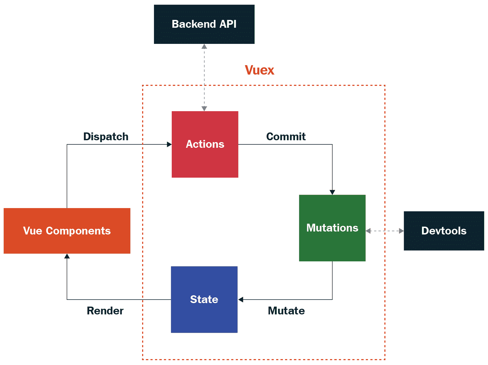
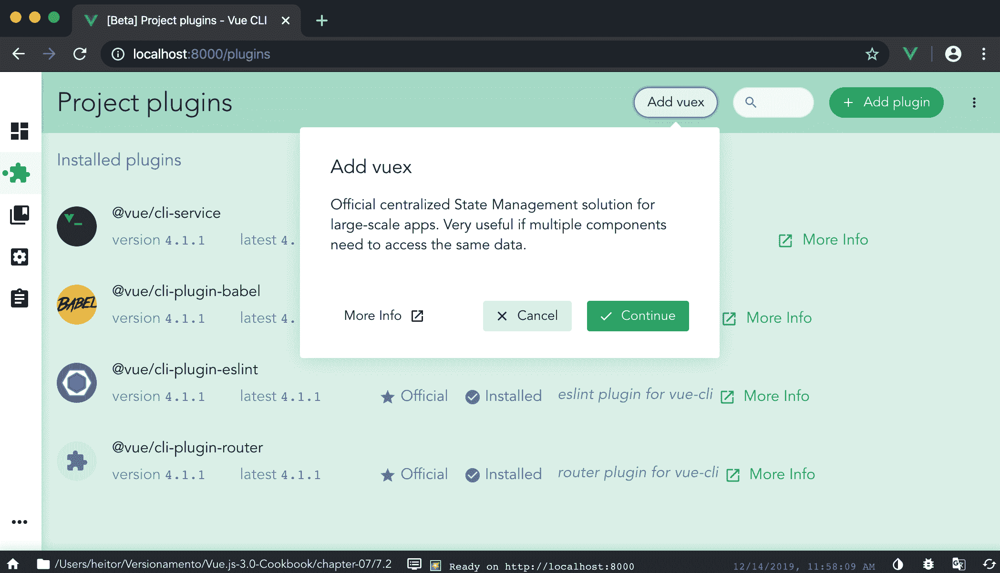

# 七、使用 Vuex 管理应用状态

在同级组件之间传输数据非常容易，但想象一下，让组件树对任何数据更改做出反应。您需要在事件总线中触发事件或通过所有父组件发送事件，直到它到达事件链的顶部，然后一直发送到所需组件；这个过程可能非常乏味和痛苦。如果您正在开发一个大规模的应用，那么这个过程是不可持续的。

Flux 库的开发是为了帮助实现这一过程，其思想是将反应性带到组件边界之外，因为 Vuex 能够维护数据的单一真实来源，同时也是您拥有业务规则的地方。

在本章中，我们将学习如何使用 Vuex，开发我们的存储，将其应用于我们的组件，并对其命名，以便在同一存储中拥有 Vuex 的不同模块。

在本章中，我们将介绍以下配方：

*   创建简单的 Vuex 存储
*   创建和理解 Vuex 状态
*   创建和理解 Vuex 突变
*   创建和理解 Vuex 操作
*   创建和理解 Vuex getter
*   使用 Vuex 创建动态组件
*   为开发添加热模块重新加载
*   创建 Vuex 模块

# 技术要求

在本章中，我们将使用**Node.js**和**Vue CLI**。

Attention, Windows users, you need to install an NPM package called `windows-build-tools`, to be able to install the following required packages. To do it, open PowerShell as administrator and execute the following command:
`> npm install -g windows-build-tools`

要安装 Vue CLI，您需要打开终端（macOS 或 Linux）或命令提示符/PowerShell（Windows）并执行以下命令：

```js
> npm install -g @vue/cli @vue/cli-service-global
```

# 创建简单的 Vuex 存储

在应用中创建一个单一的真实来源可以简化数据流，使数据的反应性能够流入另一个视角，在这个视角下，您不再与父子关系相联系。数据现在可以存储在一个地方，每个人都可以获取或请求数据。

在本教程中，我们将学习如何安装 Vuex 库并创建第一个单一存储，以及如何使用反应式操作和数据获取程序对其进行操作。

## 准备

此配方的先决条件如下：

*   Node.js 12+

所需的 Node.js 全局对象如下：

*   `@vue/cli`
*   `@vue/cli-service-global`

## 怎么做。。。

要创建 Vue CLI 项目，请执行以下步骤：

1.  我们需要打开终端（macOS 或 Linux）或命令提示符/PowerShell（Windows）并执行以下命令：

```js
> vue create initial-vuex
```

2.  CLI 将询问一些有助于创建项目的问题。您可以使用箭头键进行导航，*输入*键继续，*空格键*选择一个选项。

3.  启动新项目有两种方法。默认的方法是基本的`babel`和`eslint`项目，没有任何插件或配置，以及`Manually`模式，您可以在其中选择更多模式、插件、过梁和选项。我们将选择`Manually`：

```js
? Please pick a preset: (Use arrow keys)
 default (babel, eslint)
❯ Manually select features
```

4.  现在，我们被问及项目中需要哪些功能。这些特性是一些 Vue 插件，如 Vuex 或路由（`Vue-Router`），测试员，linter 等等。选择`Babel`、`Router`**、**`Vuex`**、**和`Linter / Formatter`：

```js
? Check the features needed for your project: (Use arrow keys) ❯ Babel
  TypeScript
  Progressive Web App (PWA) Support ❯ Router ❯ Vuex
  CSS Pre-processors ❯ Linter / Formatter
  Unit Testing
  E2E Testing
```

5.  通过选择 linter 和 formatter 继续此过程。在本例中，我们将选择`ESLint + Airbnb`配置：

```js
? Pick a linter / formatter config: (Use arrow keys)
  ESLint with error prevention only ❯ ESLint + Airbnb config ESLint + Standard config 
  ESLint + Prettier
```

6.  在设置了 linting 规则之后，我们需要定义它们何时应用于代码。可应用于`on save`或固定于`on commit`：

```js
? Pick additional lint features: (Use arrow keys)
  Lint on save ❯ Lint and fix on commit
```

7.  在定义了所有这些插件、linter 和处理器之后，我们需要选择存储设置和配置的位置。存储它们的最佳位置是在专用文件中，但也可以将它们存储在`package.json`文件中：

```js
? Where do you prefer placing config for Babel, ESLint, etc.? (Use 
  arrow keys) ❯ In dedicated config files  In package.json 
```

8.  现在，您可以选择是否要将此选择设置为未来项目的预设，因此无需再次重新选择所有内容：

```js
? Save this as a preset for future projects? (y/N) n
```

我们的配方将分为两部分：

*   创建商店
*   使用 Vuex 创建被动组件

让我们开始吧。

### 创建商店

现在您有了 Vuex 库的项目，我们需要创建第一个存储。在以下步骤中，我们将创建 Vuex 存储：

1.  从`src/store`文件夹中打开`index.js`。
2.  在`state`属性中，添加一个名为`counter`的新键，并将该值设置为`0`：

```js
state: {
  counter: 0,
},
```

3.  在`mutations`属性中，添加两个新函数`increment`和`decrement`。这两个函数都有一个`state`参数，它是当前的 Vuex`state`对象。`increment`功能将`counter`增加`1`，而`decrement`功能将`counter`减少`1`：

```js
mutations: {
  increment: (state) => {
    state.counter += 1;
  },
  decrement: (state) => {
    state.counter -= 1;
  },
},
```

4.  最后，在`actions`属性中，添加两个新函数`increment`和`decrement`。这两个函数都有一个解构参数`commit`，它是一个调用 Vuex 变异的函数。在每个函数中，我们将执行`commit`函数，将当前函数的名称作为字符串作为参数传递：

```js
actions: {
 increment({ commit }) {
 commit('increment');
 },
 decrement({ commit }) {
 commit('decrement');
 },
},

```

### 使用 Vuex 创建被动组件

现在已经定义了 Vuex 存储，您需要与它进行交互。我们将创建一个无功组件，该组件将在屏幕上显示当前状态`counter`，并显示两个按钮，一个用于增加`counter`，另一个用于减少`counter`。

#### 单文件组件

这里我们将编写单文件组件的`<script>`部分：

1.  从`src`文件夹中打开`App.vue`文件。
2.  在文件中创建`<script>`节，其中包含一个`export default`对象：

```js
<script>
  export default {};
</script>
```

3.  在新创建的对象中，添加 Vue`computed`属性和名为`counter`的属性。在此属性中，我们需要返回当前的`$store.state.counter`：

```js
computed: {
  counter() {
    return this.$store.state.counter;
  },
},
```

4.  最后，创建一个带有两个函数的 Vue`methods`属性，`increment`和`decrement`。两个函数都将执行一个参数为字符串形式的函数名的`$store.dispatch`：

```js
methods: {
  increment() {
    this.$store.dispatch('increment');
  },
  decrement() {
    this.$store.dispatch('decrement');
  },
},
```

#### 单文件组件<template></template>

让我们对单文件组件的`<template>`部分进行编码：

1.  打开`src`文件夹中的`App.vue`文件。
2.  在`<template>`部分，移除`div#app`中的所有内容。
3.  创建一个[T0]HTML 元素，其中包含计数器变量。
4.  在调用`increment`函数的`@click`指令上创建一个带有事件侦听器的按钮，并将`+`作为标签：

```js
<button @click="increment">+</button>
```

5.  在调用`decrement`函数的`@click`指令上创建一个带有事件侦听器的按钮，并将`-`作为标签：

```js
<button @click="decrement">-</button>
```

要运行服务器并查看组件，您需要打开终端（macOS 或 Linux）或命令提示符/PowerShell（Windows）并执行以下命令：

```js
> npm run serve
```

以下是渲染并运行的组件：


## 它是如何工作的。。。

声明 Vuex 存储时，需要创建三个主要属性，`state`、`mutations`和`actions`。这些属性作为单个结构，通过`$store`注入的原型或导出的`store`变量绑定到 Vue 应用。

`state`是一个集中的对象，它保存您的信息，并使其可供`mutation`、`actions,`或组件使用。更改`state`始终需要通过`mutation`执行同步功能。

`mutation`是一个同步函数，可以更改`state`并且是可跟踪的，因此在开发时，您可以在 Vuex 存储中穿越所有执行的`mutations`。

`action`是一个异步函数，可以用来保存业务逻辑、API 调用、调度其他`actions`和执行`mutations`。这些功能是 Vuex 商店中任何更改的共同入口点。

在此图表中可以看到 Vuex 存储的简单表示：



## 另见

有关 Vuex 的更多信息，请访问[https://vuex.vuejs.org/](https://vuex.vuejs.org/) 。

# 创建和理解 Vuex 状态

Vuex 状态似乎很容易理解。然而，随着数据变得更加深入和嵌套，其复杂性和可维护性可能会变得更加复杂。

在本教程中，我们将学习如何创建一个 Vuex 状态，该状态可以在**渐进式 Web 应用（PWA）**/**单页应用（SPA）**和**服务器端呈现（SSR）**的场景中使用，没有任何问题。

## 准备

此配方的先决条件如下：

*   Node.js 12+

所需的 Node.js 全局对象如下：

*   `@vue/cli`
*   `@vue/cli-service-global`

## 怎么做。。。

为了启动我们的组件，我们将使用 Vue 项目和 Vue CLI，这是我们在[第 6 章](06.html)*中的*延迟异步加载页面*配方中使用的，或者我们可以启动一个新的 Vue 路由*管理路由。

要启动新的，请打开终端（macOS 或 Linux）或命令提示符/PowerShell（Windows）并执行以下命令：

```js
> vue create vuex-store
```

选择手动功能，根据需要添加`Router`和`Vuex`功能，如“*如何操作”中所示。。。*C**制作简单 Vuex 商店*配方的*部分。

我们的配方将分为两部分：

*   通过`vue ui`添加 Vuex
*   创建`Vuex`状态

让我们开始吧。

### 通过 UI 视图添加 Vuex

导入通过 Vue CLI 创建的旧项目时，可以通过`vue ui`界面自动添加 Vuex，而无需任何努力。我们将学习如何将 Vuex 库添加到旧项目中，以便继续开发配方。

在以下步骤中，我们将添加带有`vue ui`接口的 Vuex：

1.  在项目文件夹中，通过在终端（macOS 或 Linux）或命令提示符/PowerShell（Windows）上执行以下命令打开`vue ui`：

```js
> vue ui
```

2.  选择您正在处理的正确项目。在右侧边栏中，单击插件菜单图标：


3.  在插件页面的顶部栏上，单击添加 vuex 按钮。这将触发一个弹出模式，然后单击**继续**按钮完成 Vuex 在应用上的安装：



4.  将 Vuex 添加到我们的应用将改变应用的结构。首先，我们会注意到在`src`文件夹中有一个名为`store`的新文件夹，在`main.js`文件中，它被添加到 Vue 应用中`store`的导入和注入中：

```js
import './server/server';
import Vue from 'vue';
import App from './App.vue';
import Vuesax from 'vuesax';
import './style.css';
import router from './router'
import store from './store'

Vue.use(Vuesax);

Vue.config.productionTip = false;

new Vue({
  router,
  store,
  render: h => h(App)
}).$mount('#app');
```

### 创建 Vuex 状态

为了在 Vuex 中保存数据，您需要有一个初始状态，该状态随应用一起加载，并在用户进入应用时定义为默认状态。在这里，我们将学习如何创建 Vuex 状态并将其用作单例，以便 Vuex 可以在 SPA 和 SSR 页面中使用：

现在，我们将创建一个可用于 SSR 和 SPA 的 Vuex 商店：

1.  在`src/store`文件夹中创建一个名为`user`的新文件夹，并在该文件夹中创建一个名为`state.js`的新文件。
2.  创建一个新的`generateState`函数。此函数将返回一个 JavaScript 对象，该对象具有三个主要属性：`data`、`loading`和`error`。`data`属性将是一个 JavaScript 对象，一个名为`usersList`的属性定义为空数组作为默认值，一个名为`userData`的属性定义为用户的默认对象。`loading`属性将是一个布尔值，默认设置为`false`，并且`error`将有一个默认值初始化为`null`：

```js
const generateState = () => ({
  data: {
    usersList: [],
    userData: {
      name: '',
      email: '',
      birthday: '',
      country: '',
      phone: '',
    },
  },
  loading: false,
  error: null,
});
```

3.  创建函数后，我们将在文件末尾创建一个`export default`对象，它将是一个 JavaScript 对象，我们将破坏`generateState`函数的返回：

```js
export default { ...generateState() };
```

4.  在`user`文件夹中创建一个名为`index.js`的新文件并打开它。
5.  导入新创建的`state`：

```js
import state from './state';
```

6.  在文件末尾，创建一个`export default`文件作为 JavaScript 对象。在此对象中，我们将添加导入的`state`：

```js
export default {
  state,
};

```

7.  从`src/store`文件夹中打开`index.js`文件。
8.  从`user`文件夹导入`index.js`文件：

```js
import Vue from 'vue';
import Vuex from 'vuex';
import UserStore from './user';
```

9.  在创建新 Vuex 存储的`export default`函数中，我们将删除其中的所有属性，并将导入的`UserStore`解构对象放入`Vuex.Store`参数中：

```js
export default new Vuex.Store({
  ...UserStore,
})
```

## 它是如何工作的。。。

当使用`vue ui`添加 Vuex 作为插件时，`vue ui`会自动添加所需文件，并导入所需的所有内容。这是 Vuex`store`创建的初始阶段。

首先是创建一个专用文件来管理`state`，我们可以使用该文件将状态如何开始以及如何初始化的过程与`store`分开。

在这个`state`的例子中，我们使用了一个函数，每次调用它时都会生成一个全新的`state`。这是一个很好的实践，因为在 SSR 环境中，服务器的`state`总是相同的，我们需要为每个新连接创建一个新的`state`。

创建`state`后，我们需要创建默认文件，用于导出将在`user`文件夹中创建的 Vuex 文件。此文件是将在文件夹`state`、`actions`、`mutation`和`getters`中创建的所有文件的简单导入。导入后，我们导出一个具有所需 Vuex 属性名称的对象，`state`、`actions`、`mutations`和`getters`。

最后，在 Vuex`store`中，我们导入聚合所有内容的文件，并将其解构到我们的存储中进行初始化。

## 还有更多。。。

`Vuex`状态在应用中是唯一的真实来源，它的工作方式类似于全局数据管理器，不应直接更改。这是因为我们需要防止数据的突变与相同数据的并发突变。为了避免这种情况，我们总是需要通过突变来改变我们的状态，因为这些功能是同步的，并且由 Vuex 控制。

## 另见

有关 Vuex 状态的更多信息，请访问[https://vuex.vuejs.org/guide/state.html](https://vuex.vuejs.org/guide/state.html) 。

# 创建和理解 Vuex 突变

当 Vuex 中发生更改时，我们需要一种以异步形式执行此更改并跟踪它的方法，以便在第一次更改完成之前不会执行另一次更改。

对于这种情况，我们需要突变，突变是只负责更改应用状态的函数。

在本食谱中，我们将学习如何创建 Vuex 突变以及最佳实践。

## 准备

此配方的先决条件如下：

*   Node.js 12+

所需的 Node.js 全局对象如下：

*   `@vue/cli`
*   `@vue/cli-service-global`

## 怎么做。。。

要启动我们的组件，我们将使用我们在“*创建和理解 Vuex 状态*配方中使用的 Vue 项目和 Vue CLI，或者我们可以启动一个新的项目。

要启动新的，请打开终端（macOS 或 Linux）或命令提示符/PowerShell（Windows）并执行以下命令：

```js
> vue create vuex-store
```

选择手动功能，根据需要添加`Router`和`Vuex`功能，如“*如何操作”中所示。。。*创建简单 Vuex 商店*配方的*部分。

现在我们为突变创建 Vuex 突变和碱基类型：

1.  在`src/store`文件夹内的`user`文件夹中创建一个名为`types.js`的新文件，并将其打开。
2.  在这个文件中，我们将创建一个`export default`JavaScript 对象，其中包含一组键，这些键将是我们的变体的名称。这些钥匙将是`LOADING`、`ERROR`、`SET_USER_LIST`、`SET_USER_DATA`、`UPDATE_USER`和`REMOVE_USER`：

```js
export default {
  LOADING: 'LOADING',
  ERROR: 'ERROR',
  SET_USER_LIST: 'SET_USER_LIST',
  SET_USER_DATA: 'SET_USER_DATA',
  UPDATE_USER: 'UPDATE_USER',
  REMOVE_USER: 'REMOVE_USER',
}
```

3.  在`user`文件夹中创建一个名为`mutations.js`的新文件，并将其打开。
4.  导入新创建的`types.js`文件：

```js
import MT from './types';
```

5.  创建一个名为`setLoading`的新函数，该函数将接收 Vuex`state`作为参数，并在执行时将状态的加载属性定义为`true`：

```js
const setLoading = state => {
  state.loading = true;
};
```

6.  创建一个名为`setError`的新函数，该函数将接收 Vuex`state`作为参数和`payload`。此函数将`state`的`loading`属性设置为`false`，将`error`属性设置为接收到的`payload`参数：

```js
const setError = (state, payload) => {
  state.loading = false;
  state.error = payload;
};
```

7.  创建一个名为`setUserList`的新函数，该函数将接收 Vuex`state`和`payload`作为参数。此函数将为接收到的`payload`参数定义`state.data`的`usersList`属性，将`state`的`loading`属性设置为`false`，将`error`属性设置为`null`：

```js
const setUserList = (state, payload) => {
  state.data.usersList = payload;
  state.loading = false;
  state.error = null;
};
```

8.  创建一个名为`setUserData`的新函数，该函数将接收 Vuex`state`和`payload`作为参数。此函数将为接收到的`payload`参数定义`state.data`的`userData`属性，将`state`的`loading`属性设置为`false`，将`error`属性设置为`null`：

```js
const setUserData = (state, payload) => {
  state.data.userData = payload;
  state.loading = false;
  state.error = null;
};
```

9.  创建一个名为`updateUser`的新函数，该函数将接收 Vuex`state`和`payload`作为参数。此功能将更新`state.data`的`usersList`属性中的用户数据，将`state`的`loading`属性定义为`false`，将`error`属性定义为`null`：

```js
const updateUser = (state, payload) => {
  const userIndex = state.data.usersList.findIndex(u => u.id === 
     payload.id);
  if (userIndex > -1) {
    state.data.usersList[userIndex] = payload;
  }
  state.loading = false;
  state.error = null;
};
```

10.  创建一个名为`removeUser`的新函数，该函数将接收 Vuex`state`和`payload`作为参数。此功能将删除`state.data`的`usersList`属性中的用户数据，将`state`的`loading`属性定义为`false`，将`error`属性定义为`null`：

```js
const removeUser = (state, payload) => {
  const userIndex = state.data.usersList.findIndex(u => u.id === 
     payload);
  if (userIndex > -1) {
    state.data.usersList.splice(userIndex, 1);
  }
  state.loading = false;
  state.error = null;
};
```

11.  最后，创建一个`export default`对象，键是我们在`types.js`文件中创建的类型，并定义我们创建的函数的每个键：

```js
export default {
  [MT.LOADING]: setLoading,
  [MT.ERROR]: setError,
  [MT.SET_USER_LIST]: setUserList,
  [MT.SET_USER_DATA]: setUserData,
  [MT.UPDATE_USER]: updateUser,
  [MT.REMOVE_USER]: removeUser,
}
```

12.  打开`user`文件夹中的`index.js`文件。
13.  导入新创建的`mutations.js`文件，并将其添加到`export default`JavaScript 对象：

```js
import state from './state';
import mutations from './mutations';

export default {
  state,
  mutations,
};
```

## 它是如何工作的。。。

每个`mutation`都是一个函数，将作为`commit`调用，并在 Vuex 存储中具有*标识符*。此标识符是导出的 JavaScript 对象中的`mutation`键。在这个配方中，我们创建了一个文件，它将所有标识符保存为对象值，以便在代码中用作常量。

这个模式帮助我们开发 Vuex`actions`，它需要知道每个`mutation`名称。

导出`mutation`JavaScript 对象时，我们使用常量作为键，相应的函数作为其值，因此 Vuex 存储在调用时可以执行正确的函数。

## 另见

在[中查找有关 Vuex 突变的更多信息 https://vuex.vuejs.org/guide/mutations.html](https://vuex.vuejs.org/guide/mutations.html) 。

# 创建和理解 Vuex getter

从`Vuex`访问数据可以通过状态本身完成，这可能非常危险，也可以通过 getter 完成。getter 类似于可以预处理和交付的数据，而无需接触或干扰 Vuex 存储状态。

getters 背后的全部思想是，可以编写自定义函数，在需要时在单个位置从状态中提取数据，以便只获取所需的数据。

在本教程中，我们将学习如何创建可作为高阶函数使用的 Vuex getter 和动态 getter。

## 准备

此配方的先决条件如下：

*   Node.js 12+

所需的 Node.js 全局对象如下：

*   `@vue/cli`
*   `@vue/cli-service-global`

## 怎么做。。。

要启动我们的组件，我们将使用 Vue 项目和 Vue CLI，这是我们在“创建和理解 Vuex 突变”配方中使用的，或者我们可以启动一个新的 Vue 项目。

要启动新的，请打开终端（macOS 或 Linux）或命令提示符/PowerShell（Windows）并执行以下命令：

```js
> vue create vuex-store
```

选择手动功能，并根据需要添加路由和`Vuex`功能，如“创建简单 Vuex 存储”配方的“如何操作…”部分所示。

在以下步骤中，我们将创建 Vuex getter：

1.  在`src/store/user`文件夹中创建一个名为`getters.js`的新文件。
2.  创建一个名为`getUsersList`的新函数，并返回`state.data.usersList`属性：

```js
function getUsersList(state) {
  return state.data.usersList;
}
```

In a `getter` function, the first argument that the function will receive will be always the current `state` of the Vuex `store`.

3.  创建一个名为`getUserData`的新函数，并返回`state.data.userData`属性：

```js
function getUserData(state) {
  return state.data.userData;
}
```

4.  创建一个名为`getUserById`的新函数，并返回另一个接收`userId`作为参数的函数。此返回功能将返回与接收到的`userId`相同的`id`匹配的`state.data.usersList`搜索结果：

```js
function getUserById(state) {
  return (userId) => {
    return state.data.usersList.find(u => u.id === userId);
  }
}
```

5.  创建一个名为`isLoading`的新函数，并返回`state.loading`属性：

```js
function isLoading(state) {
  return state.loading;
}
```

6.  创建一个名为`hasError`的新函数，并返回`state.error`属性：

```js
function hasError(state) {
  return state.error;
}
```

7.  最后，创建一个`export default`JavaScript 对象，将所有创建的函数作为属性：

```js
export default {
  getUsersList,
  getUserData,
  getUserById,
  isLoading,
  hasError,
};

```

8.  打开`src/store/user`文件夹中的`index.js`文件。
9.  导入新创建的`getters.js`文件，并将其添加到导出默认 JavaScript 对象中：

```js
import state from './state';
import mutations from './mutations';
import getters from './getters';

export default {
  state,
  mutations,
  getters,
};
```

## 它是如何工作的。。。

getter 类似于对象的 GET 函数，是静态缓存函数–它们仅在[T0]发生更改时更改返回值。但是，如果将返回作为一个高阶函数添加，则可以赋予它更大的能力来使用更复杂的算法并提供特定的数据。

在这个配方中，我们创建了两种类型的 getter：最基本的 getter，具有简单的数据返回；高阶函数，需要作为函数调用以检索所需的值。

## 还有更多。。。

在业务逻辑中使用 getter 是收集更多状态数据的好方法。这是一个很好的模式，因为在大型项目中，它可以帮助其他开发人员更多地了解每个 GET 函数中发生的事情以及它在幕后是如何工作的。

您始终需要记住，getter 是同步函数，并且对状态更改作出反应，因此 getter 上的数据将被存储和缓存，直到单一真相源接收到提交并更改它。

## 另见

您可以在[上找到有关 Vuex Getter 的更多信息 https://vuex.vuejs.org/guide/getters.html](https://vuex.vuejs.org/guide/getters.html) 。

# 创建和理解 Vuex 操作

您已经准备好了所有状态和数据集，现在您需要从外部源获取新数据或在应用中更改这些数据。下面是行动发挥作用的部分。

操作负责在应用和外部世界之间的通信中协调流程。控制何时需要在状态上更改数据并将其返回给操作的调用方。

通常，动作是通过组件或视图进行的分派，但在某些情况下，动作可以分派另一个动作以在应用中创建动作链。

在本教程中，我们将学习如何在应用中创建定义用户列表、更新用户和删除用户所需的操作。

## 准备

此配方的先决条件如下：

*   Node.js 12+

所需的 Node.js 全局对象如下：

*   `@vue/cli`
*   `@vue/cli-service-global`

## 怎么做。。。

要启动我们的组件，我们将使用我们在“*创建和理解 Vuex getters*配方中使用的 Vue 项目和 Vue CLI，或者我们可以启动一个新的项目。

要启动新的，请打开终端（macOS 或 Linux）或命令提示符/PowerShell（Windows）并执行以下命令：

```js
> vue create vuex-store
```

选择手动功能，并根据需要添加`Router`和`Vuex`功能，如“*如何操作”中所示。。。*创建简单 Vuex 商店*配方的*部分。

现在按照以下步骤创建 Vuex 操作：

1.  在`src/store/user`文件夹中创建一个名为`actions.js`的新文件。
2.  从`fetchApi`包装器导入突变类型文件（`types.js`），以及`getHttp`、`patchHttp`、`postHttp`和`deleteHttp`函数：

```js
import {
  getHttp,
  patchHttp,
  deleteHttp,
  postHttp,
} from '@/http/fetchApi';
import MT from './types';
```

3.  创建一个名为`createUser`的新`asynchronous`函数，该函数接收一个解构的 JavaScript 对象作为第一个参数，该对象具有`commit`属性，`userData`作为第二个参数，用于创建用户。在`try`上下文中添加`try/catch`语句。首先，我们执行`commit(MT.LOADING)`，然后从 API 中获取用户列表，最后，`commit(MT.SET_USER_DATA, data)`，传递要修改的用户列表。如果我们收到异常并进入`Catch`语句，我们将执行`commit(MT.ERROR, error)`，将我们收到的错误传递给`state`：

```js
async function createUser({ commit }, userData) {
  try {
    commit(MT.LOADING);
    await postHttp(`/api/users`, {
      data: {
        ...userData,
      }
    });
    commit(MT.SET_USER_DATA, userData);
  } catch (error) {
    commit(MT.ERROR, error);
  }
}
```

4.  创建一个名为`fetchUsersList`的新`asynchronous`函数，该函数接收一个解构的 JavaScript 对象作为第一个参数，该对象具有`commit`属性。在`try`上下文中添加`try/catch`语句。我们执行`commit(MT.LOADING)`，然后从 API 中获取用户列表，最后`commit(MT.SET_USER_LIST, data)`，传递要修改的用户列表。如果我们收到异常并进入`catch`语句，我们将执行一个`commit(MT.ERROR, error)`突变，将我们收到的错误传递给`state`：

```js
async function fetchUsersList({ commit }) {
  try {
    commit(MT.LOADING);
    const { data } = await getHttp(`api/users`);
    commit(MT.SET_USER_LIST, data);
  } catch (error) {
    commit(MT.ERROR, error);
  }
}
```

5.  创建一个名为`fetchUsersData`的新`asynchronous`函数，该函数接收一个解构的 JavaScript 对象作为第一个参数，该对象具有`commit`属性，第二个参数为将要获取的`userId`。在`try`上下文中添加`try/catch`语句。我们执行`commit(MT.LOADING)`，然后从 API 中获取用户列表，最后，`commit(MT.SET_USER_DATA, data)`，传递要修改的用户列表。如果我们收到异常并进入`catch`语句，我们将执行`commit(MT.ERROR, error)`的突变，将我们收到的错误传递给`state`：

```js
async function fetchUserData({ commit }, userId) {
  try {
    commit(MT.LOADING);
    const { data } = await getHttp(`api/users/${userId}`);
    commit(MT.SET_USER_DATA, data);
  } catch (error) {
    commit(MT.ERROR, error);
  }
}
```

6.  创建一个名为`updateUser`的新`asynchronous`函数，该函数接收一个解构的 JavaScript 对象作为第一个参数，该对象具有`commit`属性，`payload`作为第二个参数。在`try`上下文中添加`try/catch`语句。我们执行`commit(MT.LOADING)`，然后将用户数据修补到 API，最后执行`commit(MT.UPDATE_USER, payload)`，传递给用户新的数据进行变异。如果我们收到一个异常并进入`catch`语句，我们将执行一个`commit(MT.ERROR, error)`突变，将我们收到的错误传递给`state`：

```js
async function updateUser({ commit }, payload) {
  try {
    commit(MT.LOADING);
    await patchHttp(`api/users/${payload.id}`, {
      data: {
        ...payload,
      }
    });
    commit(MT.UPDATE_USER, payload);
  } catch (error) {
    commit(MT.ERROR, error);
  }
}
```

7.  创建一个名为`removeUser`的新`asynchronous`函数，该函数接收一个解构的 JavaScript 对象作为第一个参数，该对象具有`commit`属性，`userId`作为第二个参数。在`try`上下文中添加`try/catch`语句。我们执行`commit(MT.LOADING)`，然后从 API 中删除用户数据，最后执行`commit(MT.REMOVE_USER, userId)`，传递`userId`用于突变。如果我们收到异常并进入`Catch`语句，我们将执行一个`commit(MT.ERROR, error)`突变，将我们收到的错误传递给`state`：

```js
async function removeUser({ commit }, userId) {
  try {
    commit(MT.LOADING);
    await deleteHttp(`api/users/${userId}`);
    commit(MT.REMOVE_USER, userId);
  } catch (error) {
    commit(MT.ERROR, error);
  }
}

```

8.  最后，我们将创建一个导出默认 JavaScript 对象，将所有创建的函数作为属性：

```js
export default {
  createUser,
  fetchUsersList,
  fetchUserData,
  updateUser,
  removeUser,
} 

```

9.  在`src/store/user`文件夹的`index.js`中导入新创建的`actions.js`文件，并将其添加到`export default`JavaScript 对象中：

```js
import state from './state';
import mutations from './mutations';
import getters from './getters';
import actions from './actions';

export default {
  state,
  mutations,
  getters,
  actions,
};
```

## 它是如何工作的。。。

操作是所有 Vuex 生命周期更改的初始值设定项。在调度时，该操作可以执行一个变种提交、另一个操作调度，甚至可以执行对服务器的 API 调用。

在我们的例子中，我们进行 API 调用并将其放入操作中，因此当异步函数返回时，我们可以执行提交并将状态设置为函数的结果。

## 另见

有关 Vuex 操作的更多信息，请访问[https://vuex.vuejs.org/guide/actions.html](https://vuex.vuejs.org/guide/actions.html) 。

# 使用 Vuex 创建动态组件

将 Vuex 与 Vue 组件相结合，可以在不需要直接父子通信的情况下利用多个组件之间的反应性，并划分组件的责任。

使用此方法允许开发人员增强应用的规模，不需要将数据状态存储在组件本身中，而是使用单个真实源作为整个应用的存储。

在这个配方中，我们将使用最后的配方来改进一个应用，在这个应用中，它使用了亲子沟通，并使之成为整个应用中可用的唯一真理来源。

## 准备

此配方的先决条件如下：

*   Node.js 12+

所需的 Node.js 全局对象如下：

*   `@vue/cli`
*   `@vue/cli-service-global`

## 怎么做。。。

为了创建我们的动态组件，我们将把组件从有状态转换为无状态，并提取一些可以制作成新组件的部分。

我们将使用 Vue 项目和我们在“[T0]创建和理解 Vuex 操作[T1]”配方中使用的 Vue CLI，或者我们可以启动一个新的 Vue 项目。

要启动新的，请打开终端（macOS 或 Linux）或命令提示符/PowerShell（Windows）并执行以下命令：

```js
> vue create vuex-store
```

选择手动功能，并根据需要添加`Router`和`Vuex`功能，如“*如何操作”中所示。。。*创建简单 Vuex 商店*配方的*部分。

我们的配方将分为五个部分：

*   创建用户列表组件
*   编辑用户列表页面
*   编辑用户视图页面
*   编辑用户视图页面
*   编辑用户创建页面

让我们开始吧。

### 创建用户列表组件

由于 Vuex 使我们能够在应用上获得单一的真实来源，因此我们可以为应用创建一个新组件，该组件将处理用户列表并触发 Vuex 操作，从服务器获取用户列表。该组件可以是无状态的，并且可以自己执行`Vuex`操作。

#### 单文件组件

让我们对单文件组件的`<script>`部分进行编码：

1.  在`src/components`文件夹中创建一个名为`userList.vue`的新文件。
2.  从`src/mixin`文件夹导入`changeRouterMixin`：

```js
import changeRouteMixin from '@/mixin/changeRoute';

```

3.  创建一个`export default`JavaScript 对象，并添加一个名为`mixin`的新 Vue 属性，默认值为数组。在此数组中，添加导入的`changeRouteMixin`：

```js
mixins: [changeRouteMixin],
```

4.  创建名为`computed`的新 Vue 属性。在此属性中，创建一个名为`userList`的新值。此属性将是一个返回 Vuex 存储 getter`getUsersList`的函数：

```js
computed: {
  userList() {
    return this.$store.getters.getUsersList;
  },
},

```

#### 单文件组件<template></template>

在这里，我们将对单文件组件的`<template>`部分进行编码：

1.  打开`views`文件夹内`users`文件夹中的`List.vue`文件，复制`VsTable`组件中的内容和组件。
2.  从`src/components`文件夹中打开`userList.vue`文件。
3.  将您从`List.vue`文件复制的内容粘贴到`<template>`部分：

```js
<template>
  <vs-table
    :data="userList"
    search
    stripe
    pagination
    max-items="10"
    style="width: 100%; padding: 20px;"
  >
    <template slot="thead">
      <vs-th sort-key="name">
        #
      </vs-th>
      <vs-th sort-key="name">
        Name
      </vs-th>
      <vs-th sort-key="email">
        Email
      </vs-th>
      <vs-th sort-key="country">
        Country
      </vs-th>
      <vs-th sort-key="phone">
        Phone
      </vs-th>
      <vs-th sort-key="Birthday">
        Birthday
      </vs-th>
      <vs-th>
        Actions
      </vs-th>
    </template>
    <template slot-scope="{data}">
      <vs-tr :key="index" v-for="(tr, index) in data">
        <vs-td :data="data[index].id">
          {{data[index].id}}
        </vs-td>
        <vs-td :data="data[index].name">
          {{data[index].name}}
        </vs-td>
        <vs-td :data="data[index].email">
          <a :href="`mailto:${data[index].email}`">
            {{data[index].email}}
          </a>
        </vs-td>
        <vs-td :data="data[index].country">
          {{data[index].country}}
        </vs-td>
        <vs-td :data="data[index].phone">
          {{data[index].phone}}
        </vs-td>
        <vs-td :data="data[index].birthday">
          {{data[index].birthday}}
        </vs-td>
        <vs-td :data="data[index].id">
          <vs-button
            color="primary"
            type="filled"
            icon="remove_red_eye"
            size="small"
            @click="changeRoute('view', data[index].id)"
          />
          <vs-button
            color="success"
            type="filled"
            icon="edit"
            size="small"
            @click="changeRoute('edit', data[index].id)"
          />
          <vs-button
            color="danger"
            type="filled"
            icon="delete"
            size="small"
            @click="deleteUser(data[index].id)"
          />
        </vs-td>
      </vs-tr>
    </template>
  </vs-table>
</template>

```

### 编辑用户列表页面

现在，我们已经将用户列表提取到一个新组件中，我们需要导入这个组件并删除扰乱视图的旧 VsTable。

#### 单文件组件

在这一步中，我们将编写单文件组件的`<script>`部分：

1.  打开`views`文件夹中`users`文件夹中的`List.vue`文件。
2.  从`components`文件夹导入新创建的用户列表组件：

```js
import changeRouteMixin from '@/mixin/changeRoute';
import UserTableList from '@/components/userList';
```

3.  在`export default`JavaScript 对象中，添加一个名为`components`的新属性。将属性声明为 JavaScript 对象，并将导入的`UserTableList`组件添加到该对象：

```js
components: { UserTableList },
```

4.  在`methods`属性中，在`getAllUsers`函数中，我们需要更改内容以在调用时执行 Vuex 分派。此方法将执行`fetchUsersList`Vuex 操作：

```js
async getAllUsers() {
  this.$store.dispatch('fetchUsersList');
},
```

5.  最后，在`deleteUser`函数中，我们需要更改内容，以便在调用时执行 Vuex 分派。此方法将执行`removeUser`Vuex 操作，将`userId`作为参数传递：

```js
async deleteUser(id) {
  this.$store.dispatch('removeUser', id);
  await this.getAllUsers();
},
```

#### 单文件组件<template></template>

让我们对单文件组件的`<template>`部分进行编码：

1.  打开`view`文件夹中`users`文件夹中的`List.vue`文件。
2.  用新进口的`UserTableList`替换`VsTable`部件及其内含物：

```js
<vs-col
  vs-type="flex"
  vs-justify="left"
  vs-align="left"
  vs-w="12">
  <user-table-list />
</vs-col>

```

### 编辑用户视图页面

现在，我们可以将 Vuex 添加到用户视图页面。我们将添加 Vuex 操作和 getter 来操作数据，并从页面中提取管理数据的责任。

#### 单文件组件

现在您要创建单文件组件的`<script>`部分：

1.  从`view`文件夹中的`users`文件夹中打开`View.vue`文件。
2.  删除 Vue`data`属性。
3.  在 Vue`computed`属性中，添加`userData`，返回 Vuex 吸气剂`getUserData`：

```js
userData() {
  return this.$store.getters.getUserData;
},
```

4.  最后，在`getUserById`方法中，将内容更改为分派 Vuex 操作`fetchUserData`，将计算出的`userId`属性作为参数传递：

```js
async getUserById() {
  await this.$store.dispatch('fetchUserData', this.userId);
},
```

#### 单文件组件<template></template>

现在是编写单文件组件的`<template>`部分的时候了：

1.  打开`view`文件夹中`users`文件夹中的`View.vue`文件。
2.  在 UserForm 组件中，将`v-model`指令更改为`:value`指令：

```js
<user-form
  :value="userData"
  disabled
/>
```

When using a read-only value, or you need to remove the syntactic sugar of the `v-model` directive, you can declare the input value as a `:value` directive and the value change event to an `@input` event listener.

### 编辑用户编辑页面

我们需要编辑我们的用户。在上一个配方中，我们使用了一个有状态的页面，并执行页面中的所有内容。我们将把状态转换为临时状态，并对 Vuex 操作执行 API 调用。

#### 单文件组件

在这里，我们将创建单文件组件的`<script>`部分：

1.  打开`view`文件夹中`users`文件夹中的`Edit.vue`文件。
2.  在 Vue`data`属性中，将数据的名称从`userData`更改为`tmpUserData`：

```js
data: () => ({
  tmpUserData: {
    name: '',
    email: '',
    birthday: '',
    country: '',
    phone: '',
  },
}),
```

3.  在 Vue`computed`属性中，添加一个名为`userData`的新属性，该属性将返回 Vuex getter`getUserData`：

```js
userData() {
  return this.$store.getters.getUserData;
}
```

4.  添加一个名为`watch`的新 Vue 属性，并添加一个新属性`userData`，该属性将是一个 JavaScript 对象。在此对象中，添加三个属性，`handler`、`immediate`和`deep`。`handler`属性将是一个函数，它接收一个名为`newData`的参数，该参数将为此参数设置`tmpUserData`。`immediate`和`deep`属性都是设置为`true`的布尔属性：

```js
watch: {
  userData: {
    handler(newData) {
      this.tmpUserData = newData;
    },
    immediate: true,
    deep: true,
  }
},
```

5.  在 Vue`methods`属性中，我们需要更改`getUserById`的内容，以发送名为`fetchUserData`的 Vuex 动作，并将`computed`属性`userId`作为参数传递：

```js
async getUserById() {
  await this.$store.dispatch('fetchUserData', this.userId);
},
```

6.  在`updateUser`方法中，将内容更改为分派名为`updateUser`的 Vuex 动作，并将`tmpUserData`作为参数传递：

```js
async updateUser() {
  await this.$store.dispatch('updateUser', this.tmpUserData);
  this.changeRoute('list');
},
```

#### 单文件组件<template></template>

在这一部分中，我们将编写单文件组件的`<template>`部分：

1.  打开`view`文件夹内`users`文件夹中的`Edit.vue`。
2.  将`UserForm`组件的`v-model`指令目标更改为`tmpUserData`：

```js
<vs-col
  vs-type="flex"
  vs-justify="left"
  vs-align="left"
  vs-w="12"
  style="margin: 20px"
>
  <user-form
    v-model="tmpUserData"
  />
</vs-col>
```

### 编辑用户创建页面

对于用户创建页面，更改将是最小的，因为它只执行一个 API 调用。我们需要添加 Vuex 操作分派。

#### 单文件组件

在这里，我们将创建单文件组件的`<script>`部分：

1.  打开`view`文件夹中`users`文件夹中的`Create.vue`文件。
2.  将`createUser`方法的内容更改为发送一个名为`createUser`的 Vuex 动作，传递`userData`作为参数：

```js
async createUser() {
  await this.$store.dispatch('createUser', this.userData);
  this.changeRoute('list');
},

```

## 它是如何工作的。。。

在所有四个页面中，我们都进行了更改，删除了从页面到 Vuex 存储的业务逻辑或 API 调用，并尝试降低其维护数据的责任。

因此，我们可以将一段代码放入一个新组件中，该组件可以放置在应用中的任何位置，并将显示当前用户列表，而不受实例化它的容器的任何限制。

这种模式有助于我们开发更突出的应用，在这些应用中，需要的组件不太面向业务，而是更专注于它们的任务。

## 另见

有关 Vuex 应用结构的更多信息，请访问[https://vuex.vuejs.org/guide/structure.html](https://vuex.vuejs.org/guide/structure.html) 。

# 为开发添加热模块重新加载

**热模块重新加载**（**HMR**是一种用于加快应用开发速度的技术，您无需刷新整个页面即可在编辑器上获得刚刚更改的新代码。HMR 将仅更改和刷新您在编辑器上更新的零件。

在所有 Vue CLI 项目或基于 Vue 的框架（如 Quasar Framework）中，HMR 都出现在应用的演示文稿中。因此，每当您更改任何作为 Vue 组件的文件并对其进行渲染时，应用都会动态地将旧代码替换为新代码。

在本教程中，我们将学习如何将 HMR 添加到 Vuex 存储，并能够在不刷新整个应用的情况下更改 Vuex 存储。

## 准备

此配方的先决条件如下：

*   Node.js 12+

所需的 Node.js 全局对象如下：

*   `@vue/cli`
*   `@vue/cli-service-global`

## 怎么做。。。

要启动我们的组件，我们将使用 Vue 项目和 Vue CLI，这是我们在“[T0]使用 Vuex[T1]创建动态组件”配方中使用的，或者我们可以启动一个新的。

要启动新的，请打开终端（macOS 或 Linux）或命令提示符/PowerShell（Windows）并执行以下命令：

```js
> vue create vuex-store
```

选择手动功能，根据需要添加`Router`和`Vuex`功能，如“*如何操作”中所示。。。*创建简单 Vuex 商店*配方的*部分。

在以下步骤中，我们将向 Vuex 添加 HMR：

1.  打开`src/store`文件夹中的`index.js`文件。
2.  将`export default`转换为一个名为`store`的常数，并使其可导出：

```js
export const store = new Vuex.Store({
  ...UserStore,
});
```

3.  检查网页包`hot-module-reload`插件是否处于活动状态：

```js
if (module.hot) {}
```

4.  创建一个名为`hmr`的新常量，它是一个数组，包含指向`user`文件夹的`index.js`、`getters.js`、`actions.js`和`mutations.js`文件的方向：

```js
const hmr = [
  './user',
  './user/getters',
  './user/actions',
  './user/mutations',
];
```

5.  创建一个名为`reloadCallback`的新函数。在此函数中，创建三个常量，`getters`、`actions`和`mutations`。每个常量将指向`user`文件夹中的等效文件，并调用`store.hotUpdate`函数，将对象作为参数传递给您创建的常量值：

```js
const reloadCallback = () => {
  const getters = require('./user/getters').default;
  const actions = require('./user/actions').default;
  const mutations =  require('./user/mutations').default;

  store.hotUpdate({
    getters,
    actions,
    mutations,
  })
};
```

Because of the Babel output of the files, you need to add the `.default` in the end of the files that you are dynamically importing with the webpack `require` function.

6.  执行 webpack HMR`accept`函数，将`hmr`常量作为第一个参数传递，将`reloadCallback`作为第二个参数传递：

```js
module.hot.accept(hmr, reloadCallback);
```

7.  最后，默认导出创建的`store`：

```js
export default store;

```

## 它是如何工作的。。。

Vuex 商店通过 webpack HMR 插件的 API 支持 HMR。

当它可用时，我们会创建一个可以更新的可能文件列表，这样 webpack 就可以知道这些文件的任何更新。更新这些文件时，将执行您创建的特殊回调。此回调使 Vuex 能够完全更新或更改已更新文件的行为。

## 另见

有关 Vuex 热重新加载的更多信息，请访问[https://vuex.vuejs.org/guide/hot-reload.html](https://vuex.vuejs.org/guide/hot-reload.html) 。

有关网页 HMR 的更多信息，请访问[https://webpack.js.org/guides/hot-module-replacement/](https://webpack.js.org/guides/hot-module-replacement/) 。

# 创建 Vuex 模块

随着应用的增长，在单个对象中工作可能会非常危险。项目的可维护性和每次变更可能产生的风险每次都变得更糟。

Vuex 有一种称为模块的方法，可以帮助我们将商店划分为不同的商店分支。这些分支或模块中的每一个都有一组不同的状态、突变、getter 和动作。此模式有助于开发并降低向应用添加新功能的风险。

在这个配方中，我们将学习如何创建一个模块，以及如何使用它，将其划分为专用的分支。

## 准备

此配方的先决条件如下：

*   Node.js 12+

所需的 Node.js 全局对象如下：

*   `@vue/cli`
*   `@vue/cli-service-global`

## 怎么做。。。

要启动我们的组件，我们将使用 Vue 项目和 Vue CLI，这是我们在“[T0]使用 Vuex[T1]创建动态组件”配方中使用的，或者我们可以启动一个新的。

要启动新的，请打开终端（macOS 或 Linux）或命令提示符/PowerShell（Windows）并执行以下命令：

```js
> vue create vuex-store
```

选择手动功能，并根据需要添加`Router`和`Vuex`功能，如“*如何操作”中所示。。。*创建简单 Vuex 商店*配方的*部分。

我们的配方将分为两部分：

*   创建新的身份验证模块
*   向 Vuex 添加模块

让我们开始吧。

### 创建新的身份验证模块

首先，我们需要创建一个新的`Vuex`模块。此示例模块将被称为`authentication`，并将为用户存储凭据数据。

在这些步骤中，我们将为`Vuex`创建`authentication`模块：

1.  在`src/store`文件夹中创建一个名为`authentication`的新文件夹。
2.  在这个新创建的文件夹中，创建一个名为`state.js`的新文件，并将其打开。
3.  创建一个名为`generateState`的函数，该函数将返回一个属性为`data.username`、`data.token`、`data.expiresAt`、`loading`和`error`的 JavaScript 对象：

```js
const generateState = () => ({
  data: {
    username: '',
    token: '',
    expiresAt: null,
  },
  loading: false,
  error: null,
});
```

4.  在文件末尾创建一个`export default`对象。此对象将是一个 JavaScript 对象。我们将破坏`generateState`函数的返回：

```js
export default { ...generateState() };
```

5.  在`src/store`文件夹内的`authentication`文件夹中创建一个名为`index.js`的新文件，并将其打开。

6.  导入新创建的`state.js`文件：

```js
import state from './state';
```

7.  在文件末尾创建一个`export default`对象。此对象将是一个 JavaScript 对象。添加一个名为`namespaced`的新属性，其值设置为`true`，并添加导入的`state`：

```js
export default {
  namespaced: true,
  state,
};

```

### 将模块添加到 Vuex

现在我们已经创建了模块，我们将把它们添加到 Vuex 存储中。我们可以将新模块与旧代码集成。这不是问题，因为 Vuex 将使用完全独立的 Vuex 存储将新模块作为命名空间对象处理。

现在，在这些步骤中，我们将向 Vuex 添加创建的模块：

1.  打开`src/store`文件夹中的`index.js`文件。
2.  从`authentication`文件夹导入`index.js`文件：

```js
import Vue from 'vue';
import Vuex from 'vuex';
import UserStore from './user';
import Authentication from './authentication';
```

3.  在`Vuex.Store`函数中，添加一个名为`modules`的新属性，它是一个 JavaScript 对象。然后添加导入的`User`和`Authentication`模块：

```js
export default new Vuex.Store({
  ...UserStore,
  modules: {
    Authentication,
  }
})

```

## 它是如何工作的。。。

模块的工作方式类似于单独的 Vuex 存储，但位于同一 Vuex 单一真相来源中。这有助于开发更大规模的应用，因为您可以维护和使用更复杂的结构，而无需检查同一文件中的问题。

同时，还可以使用模块和普通 Vuex 存储，从遗留应用迁移，这样您就不必从头重写所有内容，就可以使用模块结构。

在我们的例子中，我们添加了一个名为`authentication`的新模块，其中存储中只存在一个状态，并继续使用旧用户 Vuex 存储，以便将来我们可以将用户存储重构为一个新模块，并将其分离为一个更具体的域驱动体系结构。

## 另见

有关 Vuex 模块的更多信息，请访问[https://vuex.vuejs.org/guide/modules.html](https://vuex.vuejs.org/guide/modules.html) 。