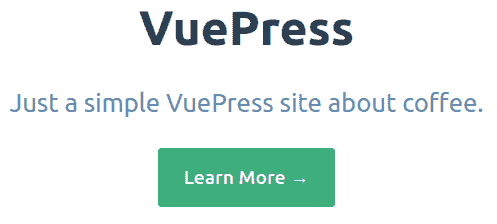
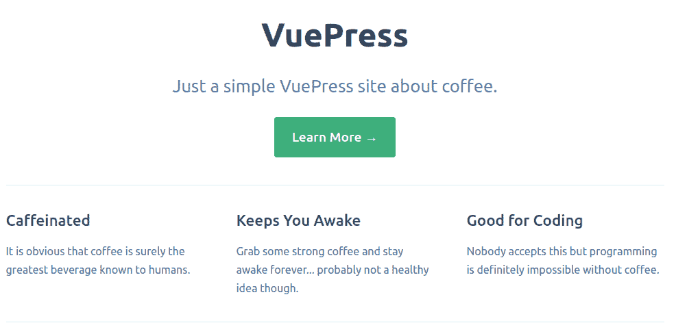
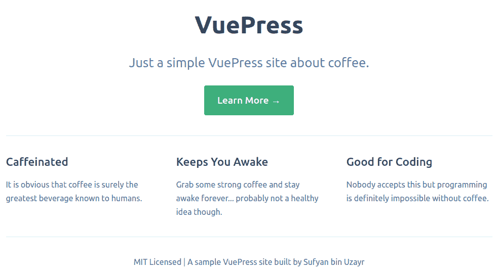
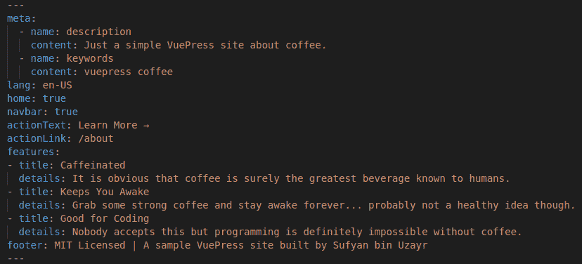
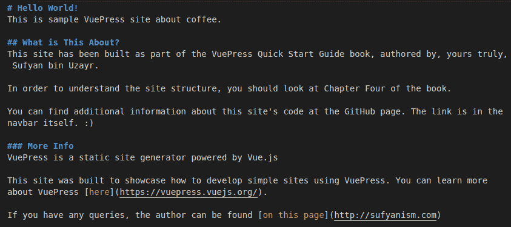
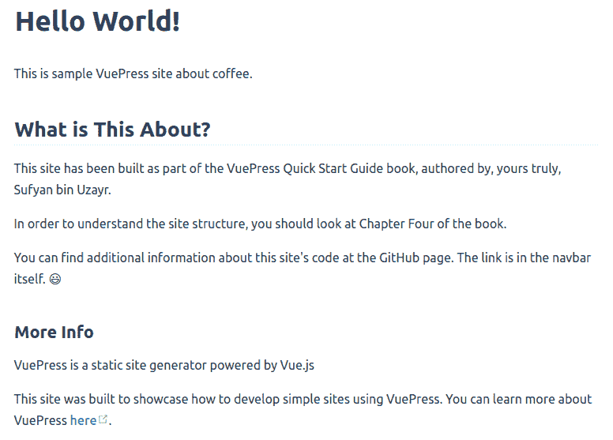
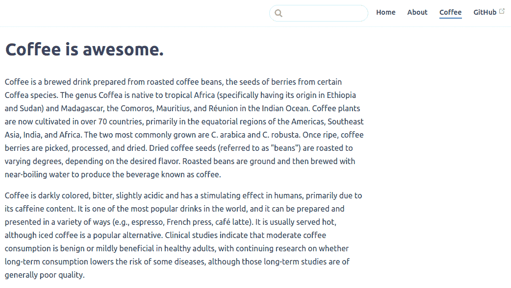
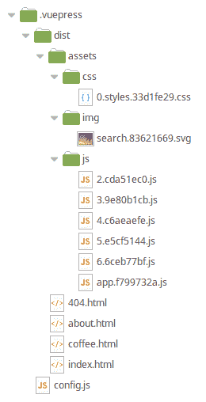

# 四、在 VuePress 中创建站点

在[第 3 章](3.html)*VuePress 开发–初步步骤*中，我们学习了与 VuePress 配置相关的基础知识以及如何使用变量和函数。我们了解了各种价值观，我们可以调整这些价值观来个性化和设置我们的 VuePress 站点。

除此之外，在[第 2 章](2.html)*开始使用 VuePress*中，我们已经在系统上安装了 VuePress。根据我们可能面临的需求，我们可以选择全局安装 VuePress，或者作为现有包中的依赖项安装 VuePress。

不管安装方法如何，目前最重要的是我们应该有一个工作的 VuePress 安装。另外，现在我们已经掌握了 VuePress 等静态站点生成器的功能，以及如何配置它们，现在是我们开始观察实际情况的时候了。

因此，在本章中，我们将把注意力转向 VuePress 的实际实现。换句话说，我们将使用 VuePress 构建一个实际的网站。这将帮助我们更好地理解 VuePress 中的工作流，并让我们更透彻地理解其基本概念。

所以，不要再浪费时间了，让我们开始吧！

在本章中，您将了解以下内容：

*   在 VuePress 中构建站点
*   如何创建 Markdown 文件并运行 VuePress 开发引擎
*   如何在 VuePress 中构建和呈现静态站点
*   `.vuepress/config.js`文件简介

# 在 VuePress 中构建站点

值得注意的是，在此阶段，您应该有一个正在运行的 VuePress 实例。如果您尚未安装 VuePress，请参阅本书[第 2 章](2.html)、*VuePress*入门。

此外，您还需要使用基本的 Markdown 文件来输入内容。大多数 web 开发人员都很清楚降价，并且大多数开发人员定期使用降价。如果您碰巧不知道什么是 Markdown，或者不习惯使用它，请参阅本书的[第 5 章](5.html)、*在 VuePress*中使用 Markdown。也就是说，在本章中，我们将只触及降价元素的表面，例如段落、标题和链接。因此，就目前而言，即使是对降价的基本认识也已经足够了。

最后，虽然我们将在本章中实际构建一个站点，但我们不会将其部署到 web 上的实时服务器上。关于部署细节，我们单独留出了一章。如果您希望在构建站点后立即部署项目文件，请参阅本书[第 8 章](8.html)、*将 VuePress 部署到 Web*。

现在我们已经完成了介绍，现在是在 VuePress 中开始站点开发的时候了！

# 我们将建造什么？

最大的问题是：我们到底想要建设什么？

我们将使用 VuePress 创建一个简单的网站。为了这个例子，让我们假设这个给定的站点是关于咖啡的。

以下是我们打算如何构建它：

*   一个主页，详细说明网站的内容（并有一个行动按钮）
*   关于页面
*   关于咖啡本身的示例页面

此外，我们的网站还将有一个导航菜单与我们所有的网页链接，以及一个外部链接。本质上，我们希望在 VuePress 中构建一个具有自定义主页视图的多页面静态站点。

以下是最终主页的外观示例：


# 创建 VuePress 站点

现在我们已经了解了我们要做的事情，让我们开始构建我们的站点。

# 自述.md 文件

在 VuePress 中，`README.md`文件充当我们的主页。当然，index.html 文件中的所有内容都应该放在这里。

我们可以在 Markdown 中编辑此文件，以包含我们需要的所有内容。除此之外，我们还可以使用 YAML 前端语法为主页指定自定义选项，例如区域设置、与 SEO 相关的元数据和自定义布局。

安装 VuePress 后，我们可以使用以下命令直接创建一个`README.md`文件：

```js
echo ‘Hello World!' > README.md
```

此命令将在 Markdown 中创建一个简单文件，其中包含行 Hello World！以下是输出的外观：


显然，这对于我们的主页来说是不够的，是吗？我们将很快建立一个自定义主页。

# 启动 dev 引擎

此时，最好打开终端（或命令行）并运行以下命令：

```js
vuepress dev
```

这将启动 VuePress 开发引擎，如下所示：


现在，我们可以在 web 浏览器中打开提供的 URL，如上面的屏幕截图所示，当我们对文件结构进行更改时，页面将自动刷新，以在保存更改时显示实时更改。只要开发引擎正在运行（即，终端处于打开状态），我们就可以在保存内容时查看实时更改。

确保在安装 VuePress 的确切目录中运行[T0]命令。所有文件都将放置并创建在其中，包括 Markdown 文件、任何媒体元素以及任何 JS 配置文件。

# 构建主页

还记得我们刚刚创建的`README.md`文件吗？让我们打开它并编辑一下。

Any editor can be used to edit Markdown files. I personally just use the xed or gedit default text editors in Linux. You can also choose to use popular code editors for editing Markdown files.

我们将添加我们的头条新闻，以便生成自定义主页。我们将利用 YAML 前端事务。如果您不熟悉它，请不要担心，我们将在下一章讨论降价时详细介绍它

我们的主页应该有一个标题，然后是一个行动号召按钮，以鼓励我们的访问者了解更多的产品。然后，我们还将添加三个单独的部分，向全世界介绍我们的产品。最后，我们将添加页脚布局。

现在，让我们构建主页。

了解 VuePress 默认主题附带有自己的主页布局，这一点非常重要。我们所要做的就是在前面指定我们希望使用主页布局。为此，我们只需输入以下内容：

```js
---
home: true
---
```

然后，我们将添加其他条目，如我们的行动呼吁按钮文本和链接，如下所示：

```js
---
home: true
navbar: true
actionText: Learn More →
actionLink: /about
---
```

现在我们可以保存文件以预览更改。再次提醒您，我们正在对刚刚创建的`README.md`文件进行更改

正如我们在下面的屏幕截图中所看到的，添加了一个调用操作按钮，该按钮链接到一个关于的*页面（尚未创建，因此单击该按钮将显示 404 错误）。*



接下来，我们可以将剩下的内容添加到我们的前端事务中。以下是当前的前沿问题：

```js
---
home: true
navbar: true
actionText: Learn More →
actionLink: /about
features:
    - title: Caffeinated
    details: It is obvious that coffee is surely the greatest beverage known to humans.
    - title: Keeps You Awake
    details: Grab some strong coffee and stay awake forever... probably not a healthy idea though.
    - title: Good for Coding
    details: Nobody accepts this but programming is definitely impossible without coffee.
---
```

我们在主页上添加了一个功能部分。我们添加了三个特性，每个特性都有自己的标题和正文内容。

因此，我们的主页应该如下所示：



接下来，剩下要做的就是添加页脚。我们只需要在前面的内容中指定一个 footer 子句，如下所示：

```js
---
footer: MIT Licensed | A sample VuePress site built by Sufyan bin Uzayr
---
```

我们之所以选择 MIT 许可证，是因为 VuePress 也附带此许可证。当然，这完全取决于您希望如何许可您的内容。

添加页脚后，我们的主页应如下所示：



# 添加元数据

一旦我们构建了主页，我们也可以向首页添加一些元数据，如下所示：

```js
---
meta:
    - name: description
    content: Just a simple VuePress site about coffee.
    - name: keywords
    content: vuepress coffee
lang: en-US
---
```

在前面的代码片段中，我们为我们的站点添加了一个元描述，并指定了一些关键字。另外，我们已经告诉引擎和爬虫，我们的网站正在使用我们的英语。

此时，我们的`README.md`文件应该如下所示：



值得注意的是，整个文件仅由前端内容组成。当我们讨论主题开发时，我们将在[第 5 章](5.html)*中使用 VuePress*中的 Markdown 以及[第 6 章](6.html)【VuePress 中的主题开发】中详细了解 YAML 前端内容。

现在，我们的主页已经准备好了。我们可以选择在 Markdown 中将任何其他内容添加到此文件。这样的内容需要在首页之后添加，尽管会显示在页脚上方和主页内容下方。

# 添加其他内容页

现在我们的网站需要额外的页面来展示更多的内容。考虑到 VuePress 是一个静态站点生成器，我们只需要相应地添加内容，VuePress 就可以完成其余的工作。

是的，就是这么简单！：

1.  我们将内容添加为降价文件
2.  VuePress 从这些 Markdown 文件中转换 HTML 文件，只要所述文件的格式有效

仅此而已。由于 VuePress 仍然不是博客或电子商务引擎，因此没有可添加的自定义分类法，或者类似地。

对于我们的网站，我们将添加两个页面。第一个是关于的*页面，第二个是关于咖啡的页面。*

对于我们的*关于*页面，我们在与`README.md`文件相同的目录中创建了一个`about.md`文件。然后，我们可以用我们喜欢的任何内容填充我们的网站。以下是我们在网站上使用的示例：



这就是输出应该显示的内容（添加此文件后，请确保再次运行[T0]命令）：



要查看输出，只需根据开发引擎显示的本地主机地址将 web 浏览器导航到`/about.html`。

值得注意的是，VuePress 可以自己处理一些事情：

*   表情符号是基于 GitHub 表情符号服务显示的。
*   更重要的是，Markdown 中的每一个 H1、H2、H3 和其他类似标题标签都被视为 HTML 中的锚链接。您可以将光标悬停在任何标题上，并注意自动为其生成锚定链接。

同样，我们也可以添加[T0]文件。事实上，我们可以添加任意多的页面。我们需要做的就是添加 Markdown 文件，并通知 VuePress 正确的位置。

# 添加导航菜单

在这个阶段，我们已经将所有的页面和内容添加到我们的站点。我们还建立了一个主页，我们可以在 web 浏览器中浏览和预览所有内容。

但很明显，我们只是为每个页面输入 URL，以便预览它们。现实世界的用户将无法猜测文件名。因此，我们的网站无法在没有导航菜单的情况下运行。

对我们来说，考虑向我们的站点添加一个导航栏是合乎逻辑的。当我们在[第 6 章](6.html)、*VuePress*主题开发中更详细地研究 VuePress 主题开发时，我们将触及导航栏定制的每一个方面（包括永久禁用导航栏）。但是，现在，我们的首要任务是展示一个功能强大且有用的导航栏，这样我们的用户就可以轻松地浏览网站了。

好的是 VuePress 支持开箱即用的导航栏功能。也就是说，除非我们明确地向它添加项目，否则它将不会显示。

为了创建导航菜单，我们需要使用以下代码：

```js
module.exports = {
 themeConfig: {
    nav: [
      { text: 'Home', link: '/' },
      { text: 'About', link: '/about' },
      { text: 'Coffee', link: '/coffee' },
      { text: 'GitHub', link: 'https://github.com/packtpublishing/vuepress-quick-start-guide' },
    ]
  }
 }
```

前面的代码为我们的主题配置导出一个导航栏数组。在这里，我们为以下页面添加了四个链接：

*   主页，位于`/`
*   关于页面，位于`/about`
*   咖啡页面，位于`/coffee`
*   这本书的 GitHub 存储库的外部链接

值得注意的是，所有外部链接都需要完整输入，URL 开头使用 HTTP/HTTPS 协议，如此屏幕截图所示：


我们需要将此代码添加到我们的`config.js`文件中。此特定文件位于 VuePress 站点的`.vuepress`目录中（如果碰巧该文件不存在，请随意创建一个名为`config.js`的空白文件，然后在其中输入前面的代码）。如果我们将此文件放在`.vuepress`目录之外，则可能无法按预期工作。

What is the `config.js` file?
In VuePress, the `config.js` file contains, as the name suggests, all the configuration-related code. This means any function or code that tweaks the VuePress configuration should be added to this file itself. In the absence of this file, VuePress will fall back to default configuration values.

保存 config.js 条目后，可以刷新输出并添加导航栏，如以下屏幕截图顶部所示：



您可能会注意到，还添加了一个搜索栏。但是等等，我们实际上没有在任何地方添加搜索栏，是吗？

没错，VuePress 自带的搜索栏功能不需要修改。它位于导航菜单的旁边。但是，我们可以使用外部搜索索引服务扩展或替换默认搜索方法。

搜索栏在我们键入时显示结果；不需要刷新页面。这就是 JavaScript 的魅力所在；其他几种 web 开发语言只有在强制重新加载整个页面后才会显示结果。


与 WordPress 和其他软件不同，VuePress 本机搜索不在内容体中搜索。相反，它只搜索输入术语的标题。这就是为什么在前面的屏幕截图中，我们只显示了`Coffee is awesome`页面作为结果，而术语`coffee`出现在主页上，以及*关于*页面。

因此，为了获得更强大的搜索体验，通常建议使用外部服务。我们将在本书的[第 6 章](6.html)*中学习如何在 VuePress*中进行主题开发。

# 最终构建

现在我们已经成功地建立了完整的网站。我们添加了内容和单独的页面，甚至创建了一个导航菜单。

到目前为止，我们使用了`vuepress dev`命令来运行开发引擎并预览站点。一旦我们确定我们已经建立了这个网站，我们就可以安全地（并且确切地说）建立它。

为此，我们需要输入以下命令：

```js
vuepress build
```

此命令将提取我们的站点元数据并编译信息。然后，它将根据 Markdown 内容呈现静态 HTML 页面，如下所示：


生成的内容默认放置在`.vuepress`目录下的 dist 目录中。因此，我们的 VuePress 站点的一般目录结构如下：



值得指出的是，VuePress 根据我们创建的 Markdown 文件生成 HTML 文件。它还将所有媒体元素、JS 文件和 CSS 文件放置在`.vuepress/dist`路径的资产子目录中。`/img`目录由图像组成，`/js`子目录由 JS 文件组成，顾名思义

除此之外，VuePress 还创建了一个`404`文件，在*页面未找到*错误时显示该文件。我们可以自定义此文件以满足我们的需要，也可以保持原样。

Fun fact: The final build of this example site, all zipped together, is approx 68 KB. A similar site of three pages in a dynamic database-driven CMS, such as WordPress or Drupal, would have easily spanned 50+ MB.

这就是全部！我们已经成功构建了 VuePress 站点！很简单，不是吗？

# 总结

在本章中，我们学习了如何使用 VuePress 构建静态站点。我们学习了自定义主页布局，在其他内容旁边添加了一个调用操作按钮，以及其他页面。

不仅如此，我们甚至在网站上添加了导航菜单。此外，我们还了解了`config.js`文件的作用。在接下来的章节中，我们将学习更多与定制相关的调整。大多数这样的调整将放在`config.js`文件中。

最后，我们学习了如何使用`vuepress build`命令*构建*VuePress 站点。此时，我们已经使用自己的内容生成了一个静态站点。

You can find the raw code of this site, including all Markdown files, over at the book's GitHub repository, as a zipped file. You can also download the exported `build` files, including the static content, as another zipped file. The GitHub repository can be found at [https://github.com/packtpublishing/vuepress-quick-start-guide](https://github.com/packtpublishing/vuepress-quick-start-guide).

这个特殊的站点现在可以轻松地部署到我们选择的任何云托管服务。然而，我们将在本书的最后一章转向部署，其中我们将学习如何将我们的站点部署到各种托管服务，如 Heroku、Netlify 和 Google Firebase！

现在，我们将深入研究降价，以便更好地掌握内容格式和表示。然后，我们将学习一些关于主题开发的知识，使我们能够定制我们的网站，使之成为我们想要的方式。

在下一章中，我们将把注意力转向 Markdown 中的内容编辑以及 VuePress 如何使用 Markdown。