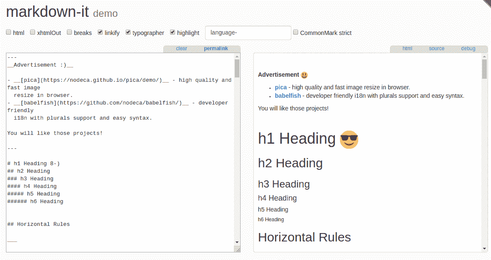
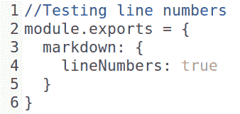
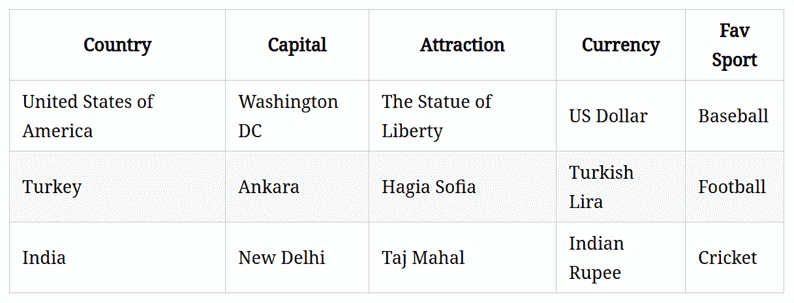
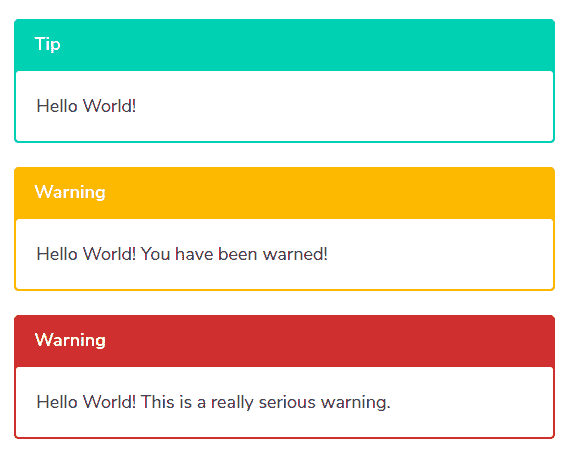
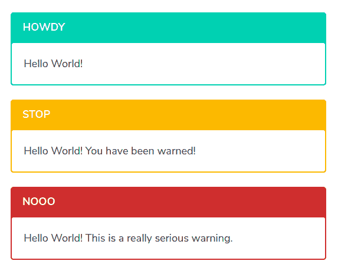

# 在 VuePress 中使用标记

在[第 4 章](4.html)*中，我们学习了如何使用 VuePress*创建网站或博客。如果您一直在阅读本书，那么您应该在本地服务器或计算机上安装一个活动的 VuePress，并将所有变量准备就绪。另外，您还应该知道可以调整的各种配置值，以充分利用 VuePress。

除此之外，您还知道如何使用页面、如何设置站点结构和导航、应用默认样式等等。

换句话说，您知道如何启动和运行 VuePress 站点，以及如何用内容填充它。

但说到内容，如何在 VuePress 中管理和添加内容？在这种情况下，完成事情的最简单和首选方法是使用降价。

Markdown is a simple and lightweight markup language that comes with its own formatting and syntax. Owing to its simplicity and ease of use, Markdown has risen in popularity ever since its birth.

在本章中，我们不仅将学习什么是标记，还将学习如何在 VuePress 中使用它。我们将学习 Markdown 语法、VuePress 的 Markdown 扩展以及 Markdown 的各种配置变量。

在本章结束时，您应该不仅能够在 VuePress 中使用标记输入内容，还能够在任何其他内容管理系统中使用标记输入内容。

在本章中，您将了解以下主题：

*   什么是降价？
*   如何使用降价？
*   VuePress 中的标记配置
*   VuePress 的标记扩展
*   在 VuePress 中格式化标记内容

# 学习在 VuePress 中使用的降价

最好掌握一些标记格式的基本技能，因为它很快就会成为技术文档领域的事实标准，例如 VuePress 中项目的自述文件，甚至 Vue.js 中的自述文件。

# 什么是降价？

如果您一直活跃在 web 开发领域，您可能已经遇到了降价，并且很可能正在您的项目中使用降价。当然，由于它的流行，降价不需要大量的介绍。

话虽如此，顺便提一提降价及其优势可能是值得的，这样即使是对这个话题不熟悉的读者也会觉得它有一些价值。

简单地说，Markdown 是一种内容格式化解决方案，其重点在于易用性和可读性。它是 2004 年由约翰·格鲁伯与亚伦·斯沃茨合作创建的。这里的目标是以更直观的格式提供纯文本内容，如果需要，可以选择将其转换为有效的 HTML。

由于其高度简化和非常体面的性质，Markdown 在技术上有能力的人中赢得了很好的追随者。

Markdown comes with a BSD-style license, and is currently available for various content management systems in the form of specialized plugins. Even WordPress has several Markdown plugins available.

此外，许多网站和项目都实施了自己定制的降价变体。这些用户包括 SourceForge、GitHub、reddit、Stack Exchange 和许多其他用户。

# 一个例子

注意，我们在上一节讨论了可读性？Markdown 非常注重可读性，即使是原始格式。

考虑下面的一个简单的 HTML 代码：

```js
<h1>VuePress Quick Start Guide</h1>
<h2>By: Sufyan bin Uzayr</h2>
<p>VuePress is a static site generator.</p>
<p>It is powered by Vue.js which is an amazing JS framework.</p>
<hr />
<p>Major features:</p>
<ul>
    <li>Easy to use</li>
    <li>Simple and powerful</li>
    <li>Supports Markdown</li>
</ul>
<p>Features again:</p>
<ol>
    <li>Easy to use</li>
    <li>Simple and powerful</li>
    <li>Supports Markdown</li>
</ol>
<p><a href="https://vuepress.vuejs.org/">VuePress Homepage</a></p>
<blockquote>
<p>This is a blockquote.</p>
</blockquote>
```

现在，将前面的示例与 Markdown 中的以下代码进行比较：

```js
# VuePress Quick Start Guide
## By: Sufyan bin Uzayr
VuePress is a static site generator.
It is powered by Vue.js which is an amazing JS framework.
* * *
Major features:
* Easy to use
* Simple and powerful
* Supports Markdown
Features again:
1\. Easy to use
2\. Simple and powerful
3\. Supports Markdown
[VuePress Homepage](https://vuepress.vuejs.org/)
> This is a blockquote.
```

前面的两个代码示例将提供相同的输出。这将显示如下：


但是，正如您所看到的，标记代码看起来相当干净，并且比 HTML 更易于阅读。它没有因繁琐的标记和其他元素而过载。简单的格式化帮助意味着您甚至可以读取原始格式的文本（也就是说，没有输出）。这就是降价的简单和美丽所在！它可读性强，易于掌握，而且很容易打字。

You can read more about the features and settings of Markdown on the official website, available at [https://daringfireball.net/projects/markdown](https://daringfireball.net/projects/markdown).

当然，许多静态网站内容管理系统（如 VuePress）出于这些原因倾向于降价。因此，为了充分利用 VuePress，最好尝试掌握 Markdown 中的一些基本格式帮助。

# markdownit 解析器

现在，我们已经了解了什么是降价以及它可以为我们提供哪些优势，现在是开始学习 VuePress 中降价的用法和变化的时候了。但是，在进入 VuePress 环境之前，我们必须了解名为 Markdown it 的 Markdown 解析器。

What does a Markdown parser do?
Its simplest task is to analyze and break down Markdown statements into syntactical components for easier processing.

markdown 它的工作做得相当好，而且使用起来相当简单。它有自己的一套自定义扩展、多个插件，并且根本不会减慢您的环境。VuePress 中的大多数 Markdown 扩展和配置变量都可以与 Markdown it 配合使用，有些只能通过 Markdown it 使用。

为了使用 markdown，您首先需要安装它。这可以通过 npm 完成，VuePress 也是如此（您已经在[第 1 章](1.html)、*介绍静态站点生成器和 VuePress*中了解了 npm 的安装）：

```js
npm install markdown-it --save
```

接下来，您可以加载它的插件，并根据需要使用它。要了解有关 markdown it 解析器的更多信息，您可以在[查看其 GitHub 存储库 https://github.com/markdown-it/markdown-it](https://github.com/markdown-it/markdown-it) 。

或者，在[上还有一个工作演示 https://markdown-it.github.io/](https://markdown-it.github.io/) ，可以在下面的截图中看到：



VuePress uses markdown-it as the default Markdown parser or renderer. Naturally, you can make use not just of markdown-it, but also its custom extensions and plugins within VuePress.

为了在 VuePress 中进一步自定义标记，最好修改您的`.vuepress/config.js`文件以添加标记实例并在其中进行修改。在前面的章节中，我们已经介绍了`.vuepress/config.js`文件的内容和细节。请注意，您可以参考 markdown it 文档，了解有关各种插件的更多详细信息，以及如何参考它们以供我们使用。

下面是示例代码添加到`config.js`文件时的外观：

```js
module.exports = {
    markdown: {
    // the markdown-it-anchor
        anchor: { permalink: false },
    // the markdown-it-toc extension
        toc: { includeLevel: [1, 2] },
    config: md => {
    // this is where you add more markdown-it extensions
        md.use(require('markdown-it-name-of-extension'))
        }
    }
}
```

在代码的最后一部分，请确保添加您希望使用的 markdown it 扩展的相关名称。请注意，我们将在本章中介绍 markdown it anchor 和 markdown it toc 扩展，以帮助您更好地了解如何引用它们以及预期的输出。

现在您已经了解了什么是 Markdown，Markdown it 解析器是什么，以及 VuePress 如何使用它作为 Markdown 的默认渲染器，现在可以安全地在 VuePress 中使用 Markdown 配置变量和值。接下来，我们将关注 VuePress 的使用和降价处理。

# 标记配置引用

此时，我们将首先关注 VuePress 中各种与配置相关的实体的降价。请注意，这些是 VuePress 特定的，对于其他静态站点生成器可能不适用。

我们已经在[第 3 章](3.html)、*VuePress 开发–初步步骤*中介绍了基本配置值。除此之外，我们将在下一章讨论自定义主题时，讨论特定于主题的配置值及其使用。

现在，我们将只关注那些与 VuePress 配置中的降价相关的值和变量。在项目中使用 VuePress 时，您可以使用这些配置引用实体更好地管理内容，并确保内容的格式和显示方式符合您的要求。

# 减价

这是一个非常重要的功能，您无论如何都应该意识到。在 VuePress 中，可以使用 markdown.slugify 将标题文本转换为 slug。

因此，您可以在 Markdown 中输入标题文本，然后使用此函数根据该标题文本生成 slug（即 URL 或 permalink）。当然，这意味着它主要用于锚定链接、目录和其他相关材料。

因为`markdown.slugify`是函数类型，所以没有数据类型的值定义。相反，它有一个函数定义。席：我们来更详细地研究它的一般语法，以进一步理解它的功能：

```js
// string.js slugify drops non ascii chars so we have to 
// use a custom implementation here
const removeDiacritics = require('diacritics').remove
    // eslint-disable-next-line no-control-regex
    const rControl = /[\u0000-\u001f]/g
    const rSpecial = /[\s~`!@#$%^&*()\-_+=[\]{}|\\;:"'<>,.?/]+/g
module.exports = function slugify (str) {
    return removeDiacritics(str)
    // Remove control characters
    .replace(rControl, ' ')
    // Replace special characters
    .replace(rSpecial, '-')
    // Remove continous separators
    .replace(/\-{2,}/g, '-')
    // Remove prefixing and trailing separators
    .replace(/^\-+|\-+$/g, '')
    // ensure it doesn't start with a number (#121)
    .replace(/^(\d)/, '_$1')
    // lowercase
    .toLowerCase()
```

您也可以在[浏览相同的源代码 https://github.com/vuejs/vuepress/blob/master/lib/markdown/slugify.js](https://github.com/vuejs/vuepress/blob/master/lib/markdown/slugify.js) 。

现在，你注意到这个函数在做什么了吗？它获取标题文本，删除其空格字符，以便用连字符（`-`替换，然后进一步删除任何前缀和尾随字符，最后将标题文本转换为小写。

例如，如果我们的标题文本为`Header SamPLE`，它会将其转换为用于 slug 的`header-sample`。当然，因为 slug 是 URL 的一部分，所以它之间不能有特定的字符和空格。`markdown.slugify`确保了这一点。

# 市价下跌

`markdown.externalLinks`用于向内容添加外部链接（从名称可以明显看出）。默认情况下，它在`<a>`标记中配对其值，并在新窗口中打开外部链接。

`markdown.externalLinks`为 object 类型，默认语法如下：

```js
{ target: '_blank', rel: 'noopener noreferrer' }
```

如果您不希望在新窗口中打开外部链接（出于 SEO 原因或类似原因），您可以删除[T0]部分，就像在任何其他 HTML 文档中一样。

# markdown.config

markdown.config 属于函数类型，因此其默认值未定义。

它用于修改默认配置，还向上一节讨论的 markdown It markdown 解析器添加其他功能或外部插件。

以下是演示其使用的示例：

```js
module.exports = {
    markdown: {
        config: md => {
            md.set({ breaks: true })
            md.use(require('markdown-it-something'))
        }
    }
}
```

在前面的示例中，markdown.config 添加了对名为 markdown it something 的外部实体的需求，然后可用于实现相同外部实体的添加功能。

# markdown.toc

`markdown.toc`提供了向我们的网站添加目录的选项。如果您正在规划一个需要此类目录的站点，例如知识库站点或在线小说或书籍的章节布局，那么它尤其有用。

它是对象类型，默认语法如下：

```js
{ includeLevel: [2, 3] }
```

值得注意的是，`markdown.toc`实际上与 markdown It 目录插件一起工作。这个插件为 markdown it 插件提供了一个目录布局。您可以在[了解更多信息 https://github.com/Oktavilla/markdown-it-table-of-contents](https://github.com/Oktavilla/markdown-it-table-of-contents) 。

# markdown.anchor

`markdown.anchor`为 object 类型，一般语法如下：

```js
{ permalink: true, permalinkBefore: true, permalinkSymbol: '#' }
```

它提供了向内容添加标题锚定的选项。

Note that this should not be confused with header slugs or IDs that are added by `markdown.slugify`, as discussed previously. Instead, markdown.anchor lets you add anchor links within your content.

它与 markdown It anchor 插件协同工作，该插件为 markdown It 添加了标题锚功能。您可以在[的 GitHub 页面了解更多关于该插件的信息 https://github.com/valeriangalliat/markdown-it-anchor](https://github.com/valeriangalliat/markdown-it-anchor) 。

# markdown.linenumber

无论何时添加内容块或 VuePress 代码块，您都可以选择不添加内容块。为此，您可以使用`markdown.lineNumbers`配置实体。

The `markdown.lineNumbers` is of the `boolean` type, as it accepts a simple `true` or `false` value for showing (or not showing) line numbers.

例如，当`markdown.lineNumbers`配置值设置为 true 时，代码输入将有行号。

以下是如何做到这一点：

```js
module.exports = {
    markdown: {
    lineNumbers: true
    }
}
```

如果将配置值设置为这样，则任何代码输入都会附加行号。例如，如果我们要在页面中显示与预格式化内容相同的代码，则其显示方式如下：



现在我们已经介绍了几乎所有相关的降价配置术语，现在是时候将注意力转向 VuePress 中使用的降价扩展了。

# VuePress 中的标记扩展

当我们谈到 VuePress 中的标记扩展时，我们指的是那些可在 VuePress 中立即使用的标记扩展。您已经在[第 4 章](4.html)*中了解了如何在 VuePress*中创建网站时在 VuePress 的日常使用中使用降价格式。

# 收割台锚

VuePress 中的所有标题都会自动获得应用于它们的锚定链接，以便于导航。这主要是为了方便跨站点内容的导航，因为 VuePress 主要是一种文档管理工具，而不是真正的业务站点解决方案。在这种情况下，通过标题导航是管理内容的最简单方法。

如果您希望配置或修改锚定设置，可以使用`markdown.anchor`配置选项，如本章上一节所述。

# 链接

在 VuePress 中，链接可以是内部链接，也可以是外部链接。

顾名思义，内部链接指向本地内容，而外部链接指向其他网站和项目的内容。

让我们在下一节中分别讨论每一个问题。

# 外部链接

所有指向第三方网站的外部链接和出站链接都会自动附加`target="_blank" rel="noopener noreferrer"`标签。这意味着所有外部链接都倾向于在新窗口（或浏览器选项卡）中打开。您可以使用`markdown.externalLinks`配置选项修改此设置，如本章上一节所述。

# 内部链接

此时，值得记住的是，VuePress 会生成**单页应用程序**（**SPA**），以便更轻松、更快地浏览网站内容。现在，为了使 SPA 导航成为可能，所有本地或入站链接都需要转换为路由链接。

VuePress 通过将所有以标记或 HTML 格式结尾的内部链接转换为`<router-link>`来实现这一点。

我们在上一章中了解到，VuePress 中的每个子目录，除非是不可公开访问的，否则必须有一个`README.md`文件，该文件将依次由 VuePress 转换为`index.html`文件，然后才能在浏览器中提供服务。

当然，在向内容添加内部链接时，需要在文件路径中指定正确的文件扩展名，否则会出现 404 错误。因此，在 VuePress 中添加内部或本地链接时，必须牢记以下注意事项：

*   `.html`或`.md`-必须附加正确的文件扩展名。
*   写入文件或资源的相对路径时，尾随斜杠`/`是必需的。如果没有尾随斜杠，VuePress 将无法跟随相对路径，并将给出 404 错误。因此，`/mypath`是不正确的，而`/mypath/`是正确的。
*   所有路径规范本质上都区分大小写。

现在，为了更好地理解这些需求，让我们举一个例子。考虑以下目录结构：


下表显示了此结构的链接语法应如何工作：

| **相对路径** | **降价** | **说明** |
| `/` | `[Home]` | 位于`root`文件夹中的`README`文件 |
| `/testx/` | `[testx]` | `README`文件位于`testx`子目录中。 |
| `/testx/filea.md` | `[testx - filea]` | `testx`子目录中的`filea.md`文件；注意`.md`扩展名。 |
| `/testx/fileb.html` | `[testx - fileb]` | 

&#124; `testx` 子目录中的 `fileb.md` 文件；注意， `.html` 扩展名仍然指向 `.md` 文件 &#124;
&#124;  &#124;

 |

在本例中，我们可以清楚地看到，`.md`扩展在呈现页面时由 VuePress 自动转换为解析的 HTML

# 表情符号

考虑到表情符号已经变得相当流行的事实，如果你愿意，应该有一种方法来正确格式化并将其包含在你的内容中。WordPress 甚至集成了自己的自定义 WordPress 表情符号，您可以在内容中使用它，或者干脆删除它，改用浏览器表情符号。

然而，与 WordPress 不同，VuePress 更注重轻量级和快速性。因此，在 VuePress 中，将自定义表情集放在核心位置是没有意义的。

不过，您可以轻松使用 markdown it 表情符号插件，该插件附带 1000 多个表情符号供您选择。以下是一个示例：


您可以选择使用提供所有 GitHub 支持表情符号的完整版本，也可以选择仅提供 Unicode 表情符号的轻型版本。这个插件还支持基于字符的表情符号，比如`:-)`和其他。它与 markdown It 解析器配合使用，可通过 npm 安装，如下所示：

```js
npm install markdown-it-emoji --save
```

当然，我们这里主要关注的是如何在 VuePress 中使用 markdown it 表情符号。要了解更多关于插件本身的信息，您可以在[T0]找到它的 GitHub 页面 https://github.com/markdown-it/markdown-it-emoji 。

在 VuePress 中，只需在两个冒号内键入所需的表情符号名称即可。例如，要在每一行中添加头骨、外星人、尖叫脸和太阳镜表情符号，请尝试以下代码：

```js
:skull:
:alien:
:scream:
:sunglasses:
```

浏览器中的最终输出将如下所示：


当然，表情符号的最终实际外观也可能因您的操作系统和浏览器版本而异。有时，某些 web 浏览器倾向于用自己的变体替换默认的 web 表情符号。

# 添加表

VuePress 在即时标记中支持两种主要的表类型。

第一个显然是目录。这不是一个纯粹的表，在这个意义上几乎没有任何行或列，但仍然被称为表，所以让我们保持这种方式。这里的语法很简单，如下所示：

```js
[[toc]]
```

这将根据内容中的标题自动生成目录。您可以使用`markdown.toc`配置选项对其进行进一步定制，如本章前面所述。

VuePress 中的第二种表类似于 GitHub 上的表布局。事实上，它被称为 GitHub 样式表。

假设我们正在创建一个简单的表格，列出每个国家的首都、旅游景点、大众体育和货币。您可以在标记中输入格式和详细信息，如下所示：


输出结果如下：



这就是 VuePress 中表的全部内容。表格将自动格式化，并高亮显示备用行，以使表格更具外观。

# 前沿问题

通过 YAML 数据序列化实现的前置物概念首先由 Jekyll 推广，Jekyll 是另一个非常流行和通用的静态站点生成器，我们在[第 1 章](1.html)*中简要介绍了静态站点生成器和 VuePress*。

简单地说，前面的内容放在文件开头的三个破折号之间。在该内容中，您可以指定自定义和预定义变量，以提供有关项目的进一步信息。这样，您就可以在所有页面以及自定义组件中使用这些变量。

讨论与前沿问题相关的所有变量远远超出了本快速入门指南的范围。但是，您可以在 Jekyll 项目的网站[上查看有关此主题的更多信息 https://jekyllrb.com/docs/frontmatter/](https://jekyllrb.com/docs/frontmatter/) 。

现在，让我们回到 VuePress。

在 VuePress 中，YAML front matter 受到开箱即用的支持，无需使用任何自定义导入或其他扩展。因此，在三条虚线之间指定的任何内容都将在整个页面中可用。

让我们通过一个例子来理解它。考虑下面的前事项代码：

```js
---
title: My Fancy VuePress Site
lang: en-US
meta:
    - name: site description
    content: hey, this is vuepress!
    - name: keywords
    content: vuepress blogging vuejs
---
```

现在，在前面的示例中，仍然为整个页面指定了 title 和 lang 变量。然后，您可以添加自定义的元标记，例如站点描述和 SEO 相关的关键字，这些标记反过来将适用于整个页面。

如果 YAML 不是您首选的脚本解决方案类型，您也可以选择其他选项。TOML 也受支持，要使用它，只需指定您更喜欢 TOML，如下所示：

```js
---toml
title: My Fancy VuePress Site
lang: en-US
meta:
    - name: site description
    content: hey, this is vuepress!
    - name: keywords
content: vuepress blogging vuejs
---
```

然而，很多 JavaScript 程序员往往更喜欢 JSON。在这种情况下，您需要遵循标准的 JSON 格式来处理前端事务；也就是说，使用大括号和引号，如以下示例所示：

```js
---
{
“title”: “My Fancy VuePress Site”,
“lang”: “en-US”,
“meta”:
    - “name”: “site description”,
    “content”: “hey, this is vuepress!”,
    - “name”: “keywords”,
    “content”: “vuepress” “blogging” “vuejs”
}
---
```

前置物规范在静态站点生成器中相当常见，任何有使用此类生成器经验的人几乎都肯定已经知道前置物的作用。

# 自定义格式选项

在标记中，VuePress 本机支持其他一些较少使用的格式选项。这些将在下一节中讨论。

# 在代码中突出显示

您可以选择高亮显示代码中的行，以使输出更具表现力。以下是一些示例代码：

```js
export default {
    data () {
        return {
        msg: 'Highlight me!'
        }
    }
}
```

输出如下：


# 定制容器

有时，您可能希望强调某些内容，例如警告、通知和提示。您可以轻松地在 VuePress 中突出显示它们，以便用户的注意力直接吸引到手头的内容上。

这意味着您首先需要将给定的内容指定为提示、警告或类似内容。此后，VuePress 将使用给定的彩色容器生成所需的通知或提示。

最终的实际外观可能会有所不同，具体取决于您自己的配置，但此演示文稿与 GitHub 风格的标记相当，如果您有一些在 GitHub 标记中格式化`README`和其他文件的经验，您可能已经遇到过此类定制内容容器。

以下是您如何做到这一点：

```js
::: tip
Hello World!
:::

::: warning
Hello World! You have been warned!
:::

::: danger
Hello World! This is a really serious warning.
:::
```

输出如下所示：



您还可以选择调整每个容器的标题，如下所示：

```js
::: tip HOWDY
Hello World!
:::

::: warning STOP
Hello World! You have been warned!
:::

::: danger NOOO
Hello World! This is a really serious warning.
:::
```

输出将再次显示以下内容：



# 导入代码段

如果现有文件包含代码，则可以将其中的代码段导入到 VuePress 项目中。执行此操作的语法如下所示：

```js
<<< @/filepath
```

但是，您需要记住，不能在 webpack 中使用路径别名，因为所有代码段的导入通常都必须在编译 webpack 之前执行。

Remember that importing of code snippets is an experimental feature and is still in beta. It may at times not work as expected.

代码段导入函数支持行高亮显示，如本章前面所述。在这种情况下，语法将如下所示：

```js
<<< @/filepath{highlightLines}
```

`@`的默认值为`process.cwd()`。

# 总结

这就把我们带到了本章的结尾。

在本章中，我们了解了什么是降价，以及它为什么如此流行，例如它的简单性、可读性以及易用性。除此之外，我们还介绍了 markdown it parser，它是一种非常常见和流行的实体，用于在静态站点生成工具（如 VuePress）中呈现标记。

我们还介绍了用于降价的 VuePress 配置值。此外，我们还了解了可在 VuePress 中使用的几个降价扩展。当然，这并不是一份详尽的清单。考虑到 VuePress 正在进行积极的开发，您可以期望最终添加新的值和扩展。

话虽如此，在完成本章之后，您现在应该已经对 VuePress 中的降价用法有了足够的了解，并且应该能够添加`.md`文件，按照您希望的内容呈现方式对其进行格式化，并保存它们，以便 VuePress 能够以 HTML 呈现它们，并将它们组合成 SPA。

说到 SPA，我们现在需要涵盖 web 开发模板和主题的一个非常重要的方面！

在上一章中，我们了解了默认的 VuePress 主题，它可以为我们做什么，它提供的布局，以及如何使用它来展示我们的内容。但是，自定义主题呢？在当今世界，网站拥有自己独特的外观往往是首选，有时甚至是必需的。自定义主题可以帮助您实现这一点，并使您的网站从人群中脱颖而出！

因此，在下一章中，我们将把注意力转向 VuePress 中的自定义主题，并围绕此主题介绍相关主题。