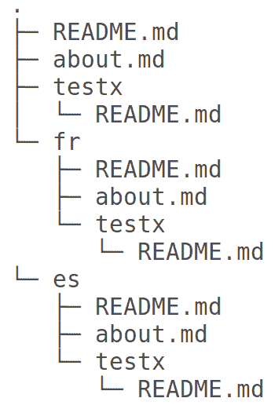

# 用 VuePress 做更多！

在前几章中，我们学习了如何在 VuePress 中设置并使用它构建站点。我们还知道如何以降价方式格式化内容，以及定制 VuePress 主题的方法。

总的来说，假设您已经阅读了上一章的内容，那么现在您应该能够对 VuePress 进行大量的控制。

尽管如此，web 开发的一个关键方面仍然存在。如今，越来越多的人转向互联网，英语不再是网络上唯一的语言。因此，很自然地，这个特殊的关键方面涉及到网站的国际化。

在 VuePress 中，国际化不是火箭科学。事实上，在网站内容中添加对不同地区和语言的支持是相当容易的，这样就可以在几分钟内完成。

当然，您仍然需要以希望添加的语言输入正确的内容。如果您正在考虑自动翻译，那么您就错了，国际化并不意味着内容是自动翻译的。

那么，您应该如何向 VuePress 添加新语言呢？本章将解释这一切。

在本章中，您将学习以下内容：

*   国际化基础
*   VuePress 的国际化
*   分析 VuePress 作为软件的未来发展

# VuePress：国际化和利用它做更多事情

但除此之外，关于 VuePress，你还应该知道什么？嗯，请记住，它正在积极开发中，并不像其他许多内容管理系统那样古老。

因此，我们也将在这一章的最后部分讨论 VuePress 的未来，现在，你已经学会了如何使用它，你应该考虑什么时候使用它。

现在，让我们从国际化开始。

# 什么是国际化？

在进一步讨论之前，我们首先需要花一点时间来理解国际化的含义。

一开始，应该强调的是，国际化实际上并不包括基于机器的内容翻译。

相反，它指的是内容的翻译。

国际化本身就是指将支持添加到软件和产品中的过程，以便这些软件和产品可以很容易地进行调整并在以后翻译成其他语言。因此，国际化涉及适当的规划和战略，例如：

*   理解不同语言的口语和书写方式
*   了解多种语言的文化方面及其差异

这两点都非常重要。例如，有几种语言（如阿拉伯语）是从右向左书写的，而不是从右向左书写。类似地，其他几种语言，如泰米尔语和印地语，都有自己的非常复杂的脚本，这对一个说英语的人来说可能令人望而生畏。此外，许多语言，如日语和汉语，通常包含需要特殊符号和键盘布局的字符。

因此，可以肯定地说，国际化是一种方式和过程，通过这种方式和过程，可以将内容翻译成用户的本地语言。这种实际调整内容以适应各种当地语言和地区需求的过程称为本地化。

**Internationalization** is also abbreviated as **i18n**, or **i-18-n**, which implies **i-eighteen-n**; that is, the eighteen letters from I to N.

就软件而言，最大的担忧通常是，应该适当地确保需要一段代码的语言（如英语）的字符可以轻松转换为需要多段字符代码的语言（如汉语）的相应字符。

一旦满足了这个条件和其他一些次要条件，我们就可以放心地说，给定的软件支持国际化或本地化。

# VuePress 中的国际化

VuePress 默认支持国际化。这意味着您可以轻松地为所选语言添加区域设置，然后用所需语言本地化站点内容。此后，VuePress 将自动处理日常任务，如适当的内容结构、其他语言的菜单切换等。

在 VuePress 中，国际化本身在两个级别上实现：

*   在站点级别进行配置
*   在主题级别进行配置

我们将涵盖这两个方面。为了便于解释，我们将在代码中使用任何第二语言，例如法语。但是，为了用给定的语言实际本地化您的站点，您需要正确输入与相关语言相关的详细信息。

# VuePress 中的 i18n 配置

让我们首先从主题级 i18n 配置开始。

# 默认主题的 i18n 配置

在默认的 VuePress 主题中，本机支持国际化。这是在`themeConfig.locales`选项的帮助下实现的。

理想情况下，您添加的每个区域设置都应该有自己的导航和侧栏选项。侧边栏和导航栏选项已经在[第 6 章](6.html)、*VuePress*主题开发中讨论过。此外，还应该分别为每个语言环境指定特定于站点的元数据和其他字段。

让我们看一下下面的代码：

```js
module.exports = {
 locales: { /* ... */ },
 themeConfig: {
    locales: {
      '/': {
        // text for the language dropdown in menu
        selectText: 'Languages',
        // label for this language in the language dropdown
        label: 'English',
        // text for the edit-on-github link
        editLinkText: 'Edit this page on GitHub',
        // configuring Service Worker popup UI (optional)
        serviceWorker: {
          updatePopup: {
            message: "New content is available.",
            buttonText: "Refresh"
          }
        },
        // algolia docsearch options (optional)
        algolia: {},
        nav: [
          { text: 'Nested', link: '/nested/' }
        ],
        sidebar: {
          '/': [/* ... */],
          '/nested/': [/* ... */]
        }
      },

     '/fr/': {
        // text for the language dropdown in menu
        selectText: 'Languages-text-in-french',
        // label for this language in the language dropdown
        label: 'French',
        // text for the edit-on-github link
        editLinkText: 'text-in-french',
        // configuring Service Worker popup UI (optional)
        serviceWorker: {
          updatePopup: {
            message: "text-in-french",
            buttonText: "Refresh-text-in-french"
          }
        },
        // algolia docsearch options (optional)
        algolia: {},
        nav: [
          { text: 'Nested', link: '/nested/' }
        ],
        sidebar: {
          '/': [/* ... */],
          '/nested/': [/* ... */]
        } }

    '/es/': {
        // text for the language dropdown in menu
        selectText: 'Languages-text-in-spanish',
        // label for this language in the language dropdown
        label: 'Spanish',
        // text for the edit-on-github link
        editLinkText: 'text-in-spanish',
        // configuring Service Worker popup UI (optional)
        serviceWorker: {
          updatePopup: {
            message: "text-in-spanish",
            buttonText: "Refresh-text-in-spanish"
          }
        },
        // algolia docsearch options (optional)
        algolia: {},
        nav: [
          { text: 'Nested', link: '/nested/' }
        ],
        sidebar: {
          '/': [/* ... */],
          '/nested/': [/* ... */]
        } }
    }
  }
 }
```

前面的代码是做什么的？

它为英语、法语和西班牙语的多个地区设置了主题。

它在菜单中添加了一个下拉列表，用于选择语言。然后，它为 GitHub 的条目添加相应的文本，以及不同语言的 Algolia 搜索和 Service Worker 弹出式 UI。

因此，当用户在我们网站的英文版上时，他们将看到刷新作为按钮文本。但是当用户在法语（位于`/fr`URL）版本上时，他们会看到法语版本的刷新词，当用户在我们网站的西班牙语版本（位于`/es`URL）上时，他们会在同一个按钮上看到刷新词，但这次是西班牙语，这是我们指定的。

注意，在前面的代码中，您需要输入法语和西班牙语地区的实际对应值。西班牙语中的刷新文本意味着您应该在此处指定相应的文本，否则 VuePress 实际上（字面上）会在前端显示西班牙语中的短语“刷新文本”。 

您可以对任意多种语言重复此过程。

# 站点级别的 i18n 配置

现在，我们已经了解了如何在 VuePress 的主题级别添加多语言支持。然而，在实际执行此操作之前，我们需要首先在站点级别实现此操作。

因此，在主题中添加对给定语言环境的支持之前，我们首先需要在`config.js`文件中指定语言环境选项。

考虑以下站点结构：



请注意，我们已经用相同的文件名创建了相同结构的三个相同副本。`/`副本显然是为英文网站准备的。但`/fr/`和`/es/`版本分别为法文版和西班牙文版。`fr/about.md`文件包含与`/about.md`文件相同的内容，尽管语言不同。

现在，一旦我们按照我们想要的方式构建了我们的站点，我们就可以在`config.js`文件中指定 locales 选项，如下所示：

```js
//goes in .vuepress/config.js
module.exports = {
  locales: {
    // The default locale can use '/' as its path
    '/': {
      lang: 'en-US', // this will be set as the lang attribute in HTML
      title: 'Good Morning',
      description: 'English VuePress'
    },
    '/fr/': {
      lang: 'fr-FR',
      title: 'Bon Jour',
      description: 'French VuePress'
    }
     '/es/': {
      lang: 'es-ES',
      title: 'Buenos Dias',
      description: 'Spanish VuePress'
    }
  }
 }
```

如您所见，我们分别为每个区域设置指定标题和描述属性，从而使 VuePress 能够添加对多个区域设置的支持，并根据语言/区域设置选择切换到标题、描述和其他信息的正确版本。

If, by chance, a given locale does not have its own title or description values, VuePress will automatically fallback to the root values (in our case, English).

一旦我们在站点级别实现了前面的内容，就可以安全地实现主题级别的更改，如前面所讨论的。之后，VuePress 将自动向导航栏级别的菜单添加语言切换项。

官方 VuePress 网站本身就是一个活生生的例子，它已经本地化为英文和中文。菜单中有语言切换器，以及所需位置的所有相关标签


就 VuePress 而言，这涵盖了我们对 i18n 的讨论范围。一旦您确定添加了正确的目录结构，并且为特定于主题的区域设置更改做了必要的安排，您就可以安全地使用您的站点了。

谈到这一点，我们很快将在下一章讨论部署问题。然而，在这个阶段，更明智的做法是迅速讨论有关 VuePress 的其余花絮。

# VuePress 分析

现在，我们已经介绍了几乎所有与 VuePress 开发相关的内容，让我们关注一些与这个令人印象深刻的静态站点生成器相关的实际方面。

最大的问题是：关于 VuePress 的知识会把我们带到哪里？

或者换一句话来说：在不久的将来，人们能从 VuePress 中得到什么？从长远来看，维护 VuePress 站点是什么感觉？

# VuePress 的下一步是什么？

在现阶段，这个问题几乎是意料之中的。现在，您已经了解了一个全新的静态站点生成器工具，接下来会发生什么？

VuePress 绝对是一个随着时间的推移可能会大受欢迎的解决方案。这主要是因为它提供的一些特性长期以来一直是开发人员社区所期望的。

例如，它提供了开箱即用的国际化支持这一事实是一个巨大的优势。您可以轻松地在多个地区创建网站和项目。

VuePress 另一个令人印象深刻的地方是，它自带了一个功能齐全的默认主题。没有多少静态站点生成器可以夸耀这一事实！更重要的是，正如我们在前一章中看到的，默认主题不仅仅是一个起始主题或骨架主题。这是一段完整的代码，具有前端显示和惊人的定制范围。

除此之外，VuePress 支持降价编辑，而且由于降价非常流行，这也很可能有利于 VuePress。事实上，即使是流行的工具，比如 WordPress，最近也添加了用于标记编辑和格式化的插件。Ghost 是一个基于 Node.js 的通用博客平台，也支持本地降价。

现在博客的话题已经提出来了，值得一提的是 VuePress 还没有完全准备好写博客。的确，使用 VuePress 创建博客是可能的，但这样的博客在功能和特性方面都非常缺乏。例如，几乎不支持对博客文章进行标记或分类，等等。

VuePress is still under active development. This means there are really good chances that blogging support might be added in near future, pretty much like Jekyll.

然而，到目前为止，VuePress 更多的是一个文档生成器软件，而不是一个博客平台。它可以创建惊人的静态网站，可以作为单页应用程序运行。这就是 VuePress 的 USP！

随着时间的推移，随着 VuePress 获得更多的动力，它的普及率和使用率也会上升。随着 Vu.js 在世界上 JavaScript 框架的崛起，VuePress 有一个坚实的基础和自己的基础。如果 VuePress 继续受欢迎，并开始被列为一些顶级静态站点生成器之一，这也就不足为奇了。

# 长期使用 VuePress

既然你已经学会了如何使用 VuePress 来建立和维护一个网站，那么你是否应该考虑从长远来看使用这个工具来实现你的项目？

很有可能您已经在使用各种其他静态站点生成器或类似的服务。在这种情况下，转向 VuePress 会对您有额外的好处吗？

如果您希望为项目创建文档站点，那么从长远来看，VuePress 绝对是您应该认真考虑的问题。显然，VuePress 似乎是为创建和维护文档而定制的。它具有对国际化的本机支持、多标题链接结构、简单的导航机制以及与 GitHub 或 GitLab 集成以更轻松地推送更新的能力。

此外，当您想到其他经常用于文档编制的此类项目时，您会注意到 VuePress 比其他项目具有非常明显的优势。以 Nuxt.js 为例，虽然它可以创建令人印象深刻的一流文档站点，但它也适用于应用程序级开发。

另一方面，VuePress 不是各行各业的高手，也不是什么大师。您可以使用它构建单页应用程序，但很难完全基于 VuePress 构建活动或电子商务注册系统。需要文件吗？完美的

也许 VuePress 很好地打球，并与降价整合得很好，这是另一个需要考虑的因素。如果你是一个喜欢用减价方式写作的人（就像我一样），VuePress 可能就是你正在寻找的静态站点代 CMS！

另一方面，目前唯一需要注意的是，精简的 VuePress 软件没有一流的博客支持。通常情况下，开发人员会按照博客的思路构建文档站点，其中包含评论、查询、标记和内容类别。到目前为止，VuePress 还没有做到这一点。当然，在不久的将来，它可能会添加这样的功能，但这更多的是预测，而不是确定性。

说到做到，如果以下任何一项适用，您可以并且应该使用 VuePress：

*   您正在寻找一个简单的静态站点生成器
*   您更喜欢使用 Vue.js
*   你需要的东西有很好的国际化能力，带有一个极好的默认主题，并且喜欢降价
*   您的主要目的是整合一系列精简的内容，Git 集成可能会对您有所帮助

另一方面，如果以下任何一项适用于您，您可能会发现 VuePress 不值得您付出努力：

*   您需要支持高级功能，如博客、杂志式发布、所见即所得编辑等
*   您不喜欢降价，也不觉得有必要像文档项目那样对内容进行简化组织

# 总结

好了，给你！

在本章中，我们介绍了 VuePress 中与国际化相关的所有内容。在正确的语言环境选择的帮助下，您可以轻松地将 VuePress 网站本地化为您选择的语言。

此外，我们还简要讨论了 VuePress 的未来。毫无疑问，这一特定产品正在稳步开发，新功能以及错误修复也在定期提供。当然，它可能适合您的工作流程，也可能不适合您的工作流程，但是如果您需要一些可以按降价操作且易于使用的东西，VuePress 绝对值得一试！

未来是什么？

在本书的最后一章，我们将把注意力转向 VuePress 在云上的部署，这样我们就可以让我们的网站上线了。在[第 4 章](4.html)*中，我们在 VuePress*中创建了一个站点，我们已经创建了一个小型 VuePress 站点，在随后的章节中，我们学习了通过 VuePress 中的降价和主题定制来进行内容编辑。

当然，通过学习如何部署我们的 VuePress 站点来结束本快速入门指南是有意义的。因此，在下一章中，我们将学习如何将 VuePress 网站部署到 Heroku、Netlify 等服务中！