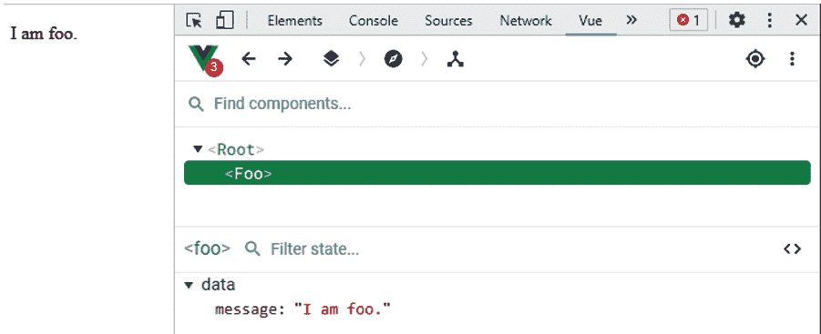

# 一、在 Vue 3 中创建您的第一个应用

**Vue 3**是流行的 Vue.js 框架的最新版本。它专注于提高开发人员的体验和速度。它是一个基于组件的框架，让我们能够轻松创建模块化、可测试的应用。它包括其他框架所共有的概念，如道具、转换、事件处理、模板、指令、数据绑定等。本章的主要目标是让您开始开发第一款 Vue 应用。本章重点介绍如何创建组件。

在本章中，我们将了解如何使用 Vue 3 从头开始创建简单的应用。我们将从构建最基本的应用开始，然后在接下来的几章中继续构建更复杂的解决方案。

我们将讨论的主要议题如下：

*   将 Vue 理解为一个框架
*   设置 Vue 项目
*   Vue 3 核心功能–组件和内置指令
*   使用 Vue.js Devtools 进行调试

# 技术要求

本章代码位于[https://github.com/PacktPublishing/-Vue.js-3-By-Example/tree/master/Chapter01](https://github.com/PacktPublishing/-Vue.js-3-By-Example/tree/master/Chapter01) 。

# 将 Vue 理解为一个框架

正如我们在介绍中提到的，Vue 中有概念可从其他框架获得。指令操作**文档对象模型**（**DOM**）就像在 Angular.js 和 Angular 中一样。模板呈现数据，就像我们处理角度数据一样。对于数据绑定和添加指令，它也有自己的特殊语法。

Angular 和 React 都有在组件之间传递数据的道具。我们还可以循环遍历数组和对象条目以显示列表中的项目。此外，与 Angular 一样，我们可以向 Vue 项目添加插件以扩展其功能。

Vue.js 独有的概念包括计算属性，即从其他属性派生的组件属性。此外，Vue 组件具有监视程序，让我们监视反应性数据更改。反应数据是 Vue.js 监视的数据，当反应数据发生变化时，会自动执行操作。

随着反应数据的更改，组件的其他部分以及引用这些值的其他组件都会自动更新。这就是 Vue 的魔力。这是我们可以用这么少的代码做这么多事情的原因之一。它负责监视我们的数据变化，这样我们就不必这样做了。

Vue 3 的另一个独特功能是，我们可以使用脚本标记添加框架及其库。这意味着，如果我们有一个遗留前端，我们仍然可以使用 Vue 3 及其库来增强遗留前端。此外，我们不需要添加构建工具来构建我们的应用。这是其他大多数流行框架所没有的一个很好的特性。

还有用于路由的流行 Vue 路由库和用于状态管理的 Vuex 库。它们都已更新为与 Vue 3 兼容，因此我们可以安全地使用它们。这样，我们就不必像对待 React 等其他框架那样担心使用哪个路由和状态管理库。Angular 有自己的路径，但没有指定标准的状态管理库。

# 使用 Vue CLI 和脚本标记设置 Vue 项目

有几种方法可以创建 Vue 项目或向现有前端添加脚本标记。出于原型设计或学习目的，我们可以通过添加以下代码来添加最新版本的 Vue 3：

```js
<script src="https://unpkg.com/vue@next"></script>
```

这将始终在我们的应用中包含最新版本的 Vue。如果我们在生产中使用它，我们应该包括版本号，以避免新版本的意外更改破坏我们的应用。如果要指定版本，版本号可以替换`next`字。

我们还可以将 Vue 作为软件包安装。为此，我们可以运行以下命令：

```js
npm install vue@next
```

这将在我们的 JavaScript 项目中安装最新版本的 Vue。

如果我们使用较旧的 Vue CLI 版本从头开始创建 Vue 项目，那么我们可以使用 CLI 生成所有文件并为我们安装所有软件包。这是开始 Vue 项目最简单的方法。对于 Vue 3，我们应该通过运行以下命令来使用 Vue CLI v4.5：

```js
yarn global add @vue/cli@next
```

我们还可以通过运行以下命令来安装 Vue Plate：

```js
npm install -g @vue/cli@next
```

然后，要将我们的 Vue 项目升级到 Vue 3，我们可以运行以下命令：

```js
vue upgrade –-next
```

Vite 构建工具将允许我们从头开始创建 VUE3 项目。它使我们能够比使用 Vue CLI 更快地为项目提供服务，因为它可以在本地使用模块。通过使用 NPM 运行以下命令，我们可以从头开始设置 Vue 项目：

```js
$ npm init vite-app <project-name>
$ cd <project-name>
$ npm install
$ npm run dev
```

对于纱线，我们必须运行以下命令：

```js
$ yarn create vite-app <project-name>
$ cd <project-name>
$ yarn
$ yarn dev
```

在任何一种情况下，我们都会将`<project-name>`替换为我们选择的项目名称。

我们可以使用不同的 Vue 版本。一组是 CDN 版本，没有捆绑包。我们可以通过文件名中的`vue(.runtime).global(.prod).js`模式识别它们。这些可以直接包含在脚本标记中。

我们将它们与直接添加到 HTML 中的模板一起使用。`vue.global.js`文件是完整版本，包含编译器和运行时，因此可以从 HTML 动态编译模板。`vue.runtime.global.js`文件仅包含运行时，并要求在构建步骤中预编译模板。

开发和生产分支是硬编码的，我们可以通过检查文件是否以`.prod.js`结尾来区分它们。这些文件在缩小后即可投入生产。这些不是**通用模块定义**（**UMD**版本）。它们包含用于正则脚本标记的 IIFE。

如果我们使用诸如 Webpack、Rollup 或 Parcel 之类的捆绑程序，那么我们可以使用`vue(.runtime).esm-bundler.js`文件。开发和生产分支机构由`process.env.NODE_ENV`财产决定。它还有一个完整版本，在运行时动态编译模板，还有一个运行时版本。

在本章中，我们将使用 Vue 的脚本标记版本介绍 Vue 的基本功能。在后续章节中，我们将继续使用 Vue CLI 创建 Vue 3 项目。这样，我们就可以专注于探索 Vue 3 的基本功能，当我们继续创建更复杂的项目时，这些功能将非常方便。让我们首先创建一个 Vue 实例。

## 创建您的 Vue 实例

现在我们已经设置了 Vue 项目，我们可以更仔细地查看 Vue 实例。所有 Vue 3 应用都有一个 Vue 实例。Vue 实例作为应用的入口点。这意味着这是首先加载的内容。它是应用的根组件，它有一个模板和一个组件选项对象来控制模板在浏览器中的呈现方式。

要创建我们的第一个 Vue 3 应用，我们必须将以下代码添加到`index.html`文件中：

```js
<!DOCTYPE html>
<html lang="en">
  <head>
    <title>Vue App</title>
    <script src="https://unpkg.com/vue@next"></script>
  </head>
  <body>
    <div id="app">
      count: {{ count }}
    </div>
    <script>
      const Counter = {
        data() {
          return {
            count: 0
          };
        }
      };
      Vue.createApp(Counter).mount("#app");
    </script>
  </body>
</html>
```

在我们的第一个 VUE3 应用中，我们首先添加了`script`标记以添加 Vue 框架脚本。它还不是最终版本，所以我们添加了 Vue 脚本的下一个版本。

在主体中，我们有一个带有 ID 应用的`div`，用于保存模板。模板内的唯一内容将由 Vue 3 附带的模板编译器编译。下面，我们有一个`script`标签来创建我们的应用。它提供了`Counter`对象，其中包含我们可以用来创建应用的属性。

Vue 组件作为对象提供，Vue 将使用这些对象创建任何必要的组件。`data`属性是一个特殊属性，它返回状态的初始值。这些状态是自动反应的。`count`状态是我们可以更新的反应状态。它与模板中的相同。大括号中的任何内容都必须是包含反应属性或其他 JavaScript 表达式的表达式。

如果我们在花括号之间添加反应状态，那么它们将被更新。由于`count`反应性属性被初始化为`0`，所以`count`属性在模板中也是`0`。`Counter`对象被传递到`Vue.createApp`方法中，以编译模板并连接反应属性，以呈现花括号内的表达式作为最终结果。因此，我们应该在渲染输出中看到[T6]。

`mount()`方法接受 CSS 选择器字符串作为其参数。选择器是用于渲染应用的模板。其中的任何内容都将被视为 Vue 表达式，并将相应地进行渲染。将呈现大括号中的表达式，Vue 将属性解释为道具或指令，具体取决于它们的编写方式。

在下一节中，我们将了解 Vue.js 3 的核心功能。

# Vue 3 核心功能–组件和内置指令

现在，我们已经创建了一个带有 Vue 实例的基本 Vue 应用，我们可以更仔细地了解如何让它做得更好。VUE3 是一个基于组件的框架。因此，组件是用于构建完整生产质量的 Vue 3 应用的核心构建块。组件是可以组合成一个完整应用并可重用的部分。Vue 3 组件有几个部分，包括模板、组件选项对象和样式。样式是我们应用于渲染元素的 CSS 样式。模板是在浏览器屏幕上呈现的内容。它包含 HTML 代码和 JavaScript 表达式，以形成在浏览器中呈现的内容。

模板从相应的组件选项对象获取数据。此外，组件模板可以具有控制内容呈现方式以及如何将模板中的数据绑定到被动属性的指令。

## 组件

我们用一个 Vue 实例创建了一个基本的 Vue 应用。现在，我们必须找到一种方法来管理我们的应用。Vue 3 是一个基于组件的前端框架。这意味着使用 Vue 3 创建的应用是通过将多个组件组合成一个组件来创建的。通过这种方式，我们可以使应用的每个部分都很小，这有助于简化测试和调试。这一点很重要，因为我们正在创建一个为用户提供功能的非平凡应用。

在 Vue 3 中，组件是带有一些预定义选项的 Vue 实例。要在另一个组件中使用组件，我们必须注册它们。要创建 Vue 组件，我们可以调用`app.component()`方法。第一个参数是名为`string`的组件，而第二个参数是包含组件选项的对象。

最小组件应至少包含添加到对象的模板属性。这样，它将在我们的组件中显示一些有用的内容。我们将首先创建一个用于显示 todo 项的组件。要显示待办事项，我们可以创建一个`todo-item`组件。此外，组件很可能需要接受道具来显示来自其父组件的数据。**属性**是一个特殊属性，允许 Vue 组件将一些数据传递给子组件。子组件具有`props`属性来定义它将接受的类型的值。为此，我们可以编写以下代码：

```js
<!DOCTYPE html>
<html lang="en">
  <head>
    <title>Vue App</title>
    <script src="https://unpkg.com/vue@next"></script>
  </head>
  <body>
    <div id="app">
      <div>
        <ol>
           ...
            ]
          };
        }
      };
      const app = Vue.createApp(App);
      app.component("todo-item", {
        props: ["todo"],
        template: `<li>{{todo.description}}</li>`
      });
      app.mount("#app");
    </script>
  </body>
</html>
```

我们调用了`app.component()`方法来创建`todo-item`组件。它包含带有一个属性名称数组的`props`属性，以接受`todo`属性。我们定义道具的方式意味着我们可以接受任何值作为`todo`道具的值。我们还可以使用值类型指定它们，设置是否需要，或者为其提供默认值。[T5]属性允许我们在需要时渲染它。我们只是将其设置为字符串，它将像其他模板一样呈现项目。

模板中呈现了`li`元素。花括号的工作方式与任何其他模板相同。它用于插值该值。要访问道具的值，我们只需在组件中将其作为属性访问，或者只需在模板中使用道具名称本身即可。

为了将`todo`道具从根 Vue 实例传递到`todo-item`组件，我们在道具名称前面加了一个冒号，表示它是道具。结肠是`v-bind`的缩写。`v-bind`指令是一个内置的 Vue 指令，允许我们将数据作为道具传递给子组件。如果我们有一个在 camel case 中的 prop 名称，那么它将映射到 HTML 中的 kebab case 名称以保持其有效性。这是因为有效属性应该有烤肉串案例名称。Vue 3 附带的模板编译器将自动进行映射。所以，我们只需要遵循惯例，然后我们就可以正确地传递道具了。

如果我们使用的是[T0]指令，我们应该添加关键道具，以便 Vue 3 能够正确跟踪项目。通过`v-for`指令，我们可以循环遍历数组或对象，并显示其中的条目。该值应该是唯一的 ID，以便 Vue 可以正确呈现项目，即使我们交换项目的位置、添加或删除项目以及在列表中执行其他操作。为此，我们可以编写以下代码：

```js
<!DOCTYPE html>
<html lang="en">
  <head>
    <title>Vue App</title>
    <script src="https://unpkg.com/vue@next"></script>
  </head>
  <body>
  ...
    </div>
    <script>
      const App = {
        data() {
          return {
            todos: [
              { id: 1, description: "eat" },
              { id: 2, description: "drink" },
              { id: 3, description: "sleep" }
            ]
          };
          ...
      app.mount("#app");
    </script>
  </body>
</html>
```

每个`id`属性值对于 Vue 的列表跟踪来说都是唯一的。

Vue 组件在 web 组件规范中看起来像自定义元素，但 Vue 组件不是自定义元素。它们不能互换使用。这只是一种使用熟悉语法创建组件的方法，这是标准的。Vue 组件中有一些功能在自定义元素中不可用。没有跨组件数据流、自定义事件通信和与自定义组件的构建工具集成。但是，Vue 组件中提供了所有这些功能。我们将在以下部分介绍 Vue 组件的这些功能。

### 组件生命周期

每个 Vue 3 组件都有自己的生命周期，每个生命周期阶段都有自己的方法。如果达到了生命周期的给定阶段，并且在组件中定义了该方法，则将运行该方法。

在应用安装了`app.mount(),`之后，事件和生命周期立即初始化。加载组件时将运行的第一种方法是`beforeCreate()`方法。然后，使用反应属性初始化组件。然后，运行`created()`方法。由于反应性属性在此阶段初始化，因此我们可以访问此方法中的反应性属性以及在此方法之后加载的方法。

然后，运行组件的模板或渲染函数来渲染项目。加载内容后，`beforeMount`运行。一旦`beforeMount`运行，应用将被安装到我们通过`app.mount()`方法传递的选择器指定的元素中。

一旦应用安装到元素中，安装的钩子就会运行。现在，当任何反应性属性改变时，`beforeUpdate`钩子运行。然后，虚拟 DOM 被重新渲染，最新的项目将根据反应属性的最新值进行渲染。它是为外部库运行任何初始化代码的好地方。完成后，`updated`挂钩运行。

`beforeDestroy`在卸下组件之前运行。这是在销毁组件之前运行任何清理代码的好地方。当部件损坏时，`destroyed`吊钩运行。此处不提供反应性属性。

### 反应性

被动属性是 component option 对象的属性，它允许我们同步模板中显示的内容，并且它们根据我们对它们所做的操作而变化。应用于反应性属性的任何更改都会在应用中传播到引用它们的任何位置。

在前面的示例中，我们将`count`反应性属性添加到我们的应用中。为了更新它，我们只需要更新反应性属性本身的值：

```js
<!DOCTYPE html>
<html lang="en">
  <head>
    <title>Vue App</title>
    <script src="https://unpkg.com/vue@next"></script>
  </head>
  <body>
    <div id="app">
      <button @click="count++">increment</button>
      count: {{ count }}
    </div>
    <script>
      const Counter = {
        data() {
          return {
            count: 0
          };
        }
      };
      Vue.createApp(Counter).mount("#app");
    </script>
  </body>
</html>
```

在这里，我们有`@click="count++"`表达式，它监听按钮的点击，当我们点击递增按钮时，我们将计数增加`1`。最新的值将在任何地方反映，因为它是一种反应性属性。Vue 可自动拾取反应性特性的变化。`@click`是`v-on:click`的缩写。

此外，我们还可以将表达式重写为方法。为此，我们可以编写以下代码：

```js
<!DOCTYPE html>
<html lang="en">
  <head>
    <title>Vue App</title>
    <script src="https://unpkg.com/vue@next"></script>
  </head>
  <body>
    <div id="app">
      <button @click="increment">increment</button>
      count: {{ count }}
    </div>
    <script>
      const Counter = {
        data() {
          return {
            count: 0
          };
        },
        methods: {
          increment() {
            this.count++;
          }
        }
      };
      Vue.createApp(Counter).mount("#app");
    </script>
  </body>
</html>
```

要引用 Vue 实例对象中的[T0]被动属性，必须将其作为该实例对象的属性引用。因此，Vue 实例对象中的`this.count`与模板中的`count`相同。`this`关键字引用组件实例。我们应该记住这一点，以免以后遇到问题。

此外，我们还将[T0]方法的属性添加到组件对象中。这是一个特殊属性，用于保存代码中的方法，我们可以在 Vue 实例的其他部分或模板中引用这些方法。与反应性属性一样，方法在 Vue 实例对象中被引用为该属性，我们在模板中省略了该属性。

因此，当我们点击按钮时，我们在`methods`属性中运行 increment 方法。当我们在浏览器中点击`1`按钮时，我们将看到输出值增加。

### 处理用户输入

大多数应用要求用户在表单中输入内容。我们可以通过 Vue 3 和[T0]指令轻松实现这一点。它将输入值与我们在 Vue 实例中定义的被动属性同步。

要使用它，我们只需将`v-model`属性添加到输入框中。为此，我们可以编写以下代码：

```js
<!DOCTYPE html>
<html lang="en">
  <head>
    <title>Vue App</title>
    <script src="https://unpkg.com/vue@next"></script>
  </head>
  <body>
    <div id="app">
      <p>{{ message }}</p>
      <input v-model="message" />
    </div>
    <script>
      const App = {
        data() {
          return {
            message: "hello world."
          };
        }
      };
      Vue.createApp(App).mount("#app");
    </script>
  </body>
</html>
```

这里，我们有`message`reactive 属性，它已经初始化为`hello world.`字符串。我们可以通过将模板中的值设置为`v-model`指令的值来使用相同的值。它将在输入值和`message`被动属性之间进行同步，以便我们键入的任何内容都将传播到 Vue 实例的其余部分。

因此，`hello world.`字符串是，显示在输入框和段落元素中。当我们在输入框中输入一些东西时，它也会显示在段落元素中。它将更新`message`反应性属性的值。这是 Vue 3 附带的一个很好的功能，我们将在许多地方使用它。

### 条件与循环

Vue 3 的另一个非常有用的特性是，我们可以有条件地在模板中呈现内容。为此，我们可以使用`v-if`指令，它允许我们有条件地显示某些内容。`v-if`指令仅当我们为元素指定的条件为 true 时才将元素放入 DOM 中。[T2]指令显示并隐藏它通过 CSS 绑定到的[T4]元素，并且该元素始终在 DOM 中。如果它的值为 true，那么我们将在模板中看到它。否则，我们看不到显示的项目。

它通过有条件地将项附加到 DOM 来工作。只有当[T1]值为 true 时，才将包含[T0]指令的元素或组件中的元素和组件附加到 DOM 中。否则，它们将不会附加到 DOM。

例如，假设我们有以下代码：

```js
<!DOCTYPE html>
<html lang="en">
  <head>
    <title>Vue App</title>
    <script src="https://unpkg.com/vue@next"></script>
  </head>
  <body>
    <div id="app">
      <span v-if="show">hello world</span>
    </div>
    <script>
      const App = {
        data() {
          return {
            show: true
          };
        }
      };
      Vue.createApp(App).mount("#app");
    </script>
  </body>
</html>
```

在这里，`'hello world'`将显示为，因为`show`是`true`。如果我们有以下代码，我们将不会看到显示的任何内容，因为 span 没有连接到 DOM：

```js
<!DOCTYPE html>
<html lang="en">
  <head>
    <title>Vue App</title>
    <script src="https://unpkg.com/vue@next"></script>
  </head>
  <body>
    <div id="app">
      <span v-if="show">hello world</span>
    </div>
    <script>
      const App = {
        data() {
          return {
            show: false
          };
        }
      };
      Vue.createApp(App).mount("#app");
    </script>
  </body>
</html>
```

要呈现模板中的项数组和最终的输出，我们可以使用`v-for`指令。我们放置一个值，它是一个特殊的 JavaScript 表达式，允许我们在数组中循环。我们可以通过编写以下代码来使用`v-for`指令：

```js
<!DOCTYPE html>
<html lang="en">
  <head>
    <title>Vue App</title>
    <script src="https://unpkg.com/vue@next"></script>
  </head>
  <body>
    <div id="app">
      <ol>
        <li v-for="todo in todos" :keu="todo.id">
          {{ todo.description }}
        </li>
      </ol>
    </div>
    <script>
      const App = {
        data() {
          return {
            todos: [
              { description: "eat", id: 1 },
              { description: "drink", id: 2 },
              { description: "sleep", id: 3 }
            ]
          };
        }
      };
      Vue.createApp(App).mount("#app");
    </script>
  </body>
</html>
```

我们有`v-for`指令和`li`元素。`'todo in todos'`循环通过`todo`数组，并在标记之间呈现项目。`todo`变量是正在迭代的单个*todos*条目。我们访问 description 属性，以便在列表中显示 description 的值。

完成后，我们将看到一个编号的列表，其中列出了`todo`文本。

### 模板语法

我们已经广泛使用了模板。我们主要使用插值来显示数据和一些指令来渲染数据。此外，我们还可以使用`@`或`v-on`指令来侦听发出的事件，例如单击和输入值更改。

我们还可以使用其他有用的语法来创建模板。其中之一是使用插值表达式显示原始 HTML。默认情况下，Vue 3 将转义所有 HTML 实体，以便它们按原样显示。`v-html`指令允许我们将 HTML 代码显示为真正的 HTML 而不是纯文本。

例如，让我们编写以下代码：

```js
<!DOCTYPE html>
<html lang="en">
  <head>
    <title>Vue App</title>
    <script src="https://unpkg.com/vue@next"></script>
  </head>
  <body>
    <div id="app">
      <span v-html="rawHtml"></span>
    </div>
    <script>
      const App = {
        data() {
          return {
            rawHtml: `<b>hello world</b>`
          };
        }
      };
      const app = Vue.createApp(App);
      app.mount("#app");
    </script>
  </body>
</html>
```

在这里，我们将`rawHtml`reactive 属性设置为`v-html`的值，因此可以看到`b`标记被呈现为粗体文本，而不是呈现原始形式的字符。

### JavaScript 表达式和模板

我们可以将任何[T0]JavaScript 表达式放在花括号之间。它只能是一个表达式。

例如，以下代码片段显示了大括号之间的有效内容：

```js
{{ number + 1 }} 
{{ areYouSure ? 'YES' : 'NO' }}
{{ message.split('').reverse().join('') }}
```

然而，我们不能在大括号之间插入任何 JavaScript 语句。例如，我们不能写[T0]或[T1]。

### 计算属性

**计算性质**是从其他反应性质衍生而来的特殊反应性质。计算特性作为函数添加到计算特性的对象中。它们总是返回从其他反应性属性派生的东西。因此，它们必须是同步函数。

要创建计算属性，我们可以编写以下代码：

```js
<!DOCTYPE html>
<html lang="en">
  <head>
    <title>Vue App</title>
    <script src="https://unpkg.com/vue@next"></script>
  </head>
  <body>
    <div id="app">
      <p>{{message}}</p>
      <p>{{reversedMessage}}</p>
    </div>
    <script>
      const App = {
        data() {
          return {
            message: "hello world"
          };
        },
        computed: {
          reversedMessage() {
            return
             this.message.split("").reverse().join("");
          }
        }
      };
      const app = Vue.createApp(App);
      app.mount("#app");
    </script>
  </body>
</html>
```

在这里，我们创建了`reversedMessage`计算属性，它与`message`反应属性相反。我们返回消息，字符顺序颠倒。每当`message`反应性属性更新时，`reversedMessage()`方法将再次运行并返回最新值。因此，我们可以在同一个模板中看到`'hello world'`和`'dlrow olleh'`。这些计算属性的返回值必须包含其他反应属性，以便在其他反应属性更新时更新。

## 指令

组件可能没有足够的资源来完成我们想要的任务。缺少的主要功能是操作 DOM 并将输入数据与反应性属性同步。指令是以`v-`前缀开头的特殊属性。他们期望单个 JavaScript 表达式作为值。我们已经看到一些内置指令，例如`v-if`、`v-for`、`v-bind`和`v-on`被用于各种用途。指令可以接受值之外的参数。

例如，我们可以编写`<a v-on:click="doSomething"> ... </a>`来监听锚元素上的点击事件。`v-on`部分是指令的名称。冒号和等号之间的部分是指令的参数，`click`是指令的参数。`doSomething`是指令的值。它是我们要调用的方法的名称。

指令参数可以是动态的。要添加动态参数，我们可以将它们放在方括号中：

```js
<a v-bind:[attributeName]="url"> ... </a>
```

`attributeName`是用来设置参数值的被动属性。它应该是一个字符串。我们也可以对`v-on`指令执行同样的操作：

```js
<a v-on:[eventName]="doSomething"> ... </a>
```

我们用给定的[T0]收听事件。`eventName`也应该是字符串。

### 指令修饰语

指令可以使用修饰符，让我们改变指令的行为。修饰语是用点表示的特殊后缀。它们可以链接以提供更多更改。它们表示指令应以某种特殊方式绑定。例如，如果我们需要监听`submit`事件，我们可以添加`prevent`修饰符使其调用`event.preventDefault()`，这将阻止默认提交行为。我们可以通过编写以下代码来实现这一点：

```js
<form v-on:submit.prevent="onSubmit">...</form>
```

接下来，我们将了解如何使用 Vue.js Devtools 浏览器扩展轻松调试 Vue 3 项目。

# 使用 Vue.js Devtools 进行调试

现在，没有简单的方法来调试我们的应用。我们所能做的就是在代码中添加`console.log`语句来查看值。有了 Vue.js Devtools，我们可以在我们的应用中有更多的可见性。Vue.js Devtools 是一个 Chrome 或 Firefox 扩展，可用于调试 Vue.js 应用。它可用于使用 Vite 创建的项目，或通过包含 Vue 3 的`script`标记从头开始创建的项目。我们可以通过在相应浏览器的应用商店中搜索 Vue.js Devtools 扩展来安装该扩展。

重要：

安装 Vue.js Devtools 的 Chrome 版本的 URL 位于[https://chrome.google.com/webstore/detail/vuejs-devtools/nhdogjmejiglipccpnnnanhbledajbpd](https://chrome.google.com/webstore/detail/vuejs-devtools/nhdogjmejiglipccpnnnanhbledajbpd) 。

该插件的 Firefox 版本位于[https://addons.mozilla.org/en-CA/firefox/addon/vue-js-devtools/?utm_source=addons.mozilla.org &utm_ 媒体=推荐&utm_ 内容=搜索](https://addons.mozilla.org/en-CA/firefox/addon/vue-js-devtools/?utm_source=addons.mozilla.org&utm_medium=referral&utm_content=search)。

安装完成后，我们应该在浏览器的开发控制台中看到 Vue 选项卡。使用它，我们可以检查 Vue 加载的反应性属性。如果我们的组件具有`name`属性，那么它将显示在应用的组件树中。例如，假设我们有以下代码：

```js
<!DOCTYPE html>
<html lang="en">
  <head>
    <title>Vue App</title>
    <script src="https://unpkg.com/vue@next"></script>
  </head>
  <body>
    <div id="app">
      <foo></foo>
    </div>
    <script>
      const App = {
        data() {
          return {};
        }
      };
      const app = Vue.createApp(App);
      app.component("foo", {
        data() {
          return {
            message: "I am foo."
          };
        },
        name: "foo",
        template: `<p>{{message}}</p>`
      });
      app.mount("#app");
    </script>
  </body>
</html>
```

在这里，由于我们将`foo`组件的`name`属性设置为`'foo'`，我们将看到组件树中列出的属性。此外，`foo`组件具有`message`反应性属性，因此我们还将看到`message`属性显示为及其值。在组件树的上方，有一个搜索框，可以让我们找到具有给定名称的被动属性。我们也可以使用**查找组件**`…`输入框搜索组件。

以下屏幕截图显示了 Vue Devtools 扩展中 Vue 3 应用中的反应性属性值：



图 1.1–使用 Vue Devtools 检查反应性特性

还有一个**时间线**菜单项，我们可以使用它来检查发出的事件。例如，假设我们有以下代码：

```js
<!DOCTYPE html>
<html lang="en">
<head>
  <title>Vue App</title>
  <script src="https://unpkg.com/vue@next"></script>
</head>
<body>
  <div id="app">
    <button @click="count++">increment</button>
    count: {{ count }}
  </div>
  <script>
    const Counter = {
      data() {
        return {
          count: 0
        };
      }
    };
    Vue.createApp(Counter).mount("#app");
  </script>
</body>
</html>
```

当我们点击**递增**按钮时，我们将看到**时间线**部分中记录的鼠标事件。触发事件的时间也将被记录。

在**全局设置**部分，我们可以看到**规范化组件名称**设置，它允许我们更改组件名称的显示方式。我们可以用 Pascal 或 Kebab 的形式显示原始名称。**主题**选项允许我们更改 Vue 选项卡的主题颜色。

# 总结

我们在这一章中学习了 Vue 的不同部分。我们讨论的一个重要部分是反应性质。它们是组件的属性，我们可以更改它们以更新应用中引用被动属性的所有部分。这些属性可以手动查看，Vue 3 也会自动拾取任何值更改，以便自动更新应用中引用被动属性的任何部分。组件的组成方式是尽可能重用它们。

然后，我们继续了解模板在每个组件中的作用。模板也是每个组件的一部分。他们都必须在屏幕上呈现一些东西。模板可以包含 HTML 元素、其他组件以及修改模板中元素和组件呈现方式的指令。模板中可以有 JavaScript 表达式，这样我们就可以对事件做出反应。然后，我们研究了组件中计算属性的重要性。计算性质是依赖于其他反应性质的特殊反应性质。它们是同步函数，并基于组合其他反应性属性返回值。

我们研究的另一个重要点是`v-model`指令，它内置于 VUE3 中。Vue 3 提供了`v-model`指令，以便我们可以绑定反应性属性以形成控制值。指令是特殊的 Vue 代码，允许我们更改 DOM 元素的呈现方式。Vue 3 提供了许多内置指令来执行诸如从数组渲染元素、将表单控件值绑定到反应属性等操作。

在上一节中，我们介绍了如何使用 Vue.js Devtools 简化调试。它是一个可用于 Chromium 浏览器和 Firefox 的浏览器扩展，让我们可以查看组件的反应属性值，并查看呈现的组件。它还将记录由组件中的元素触发的任何事件。

在下一章中，我们将了解如何构建一个简单的 GitHub 应用来发出 HTTP 请求。