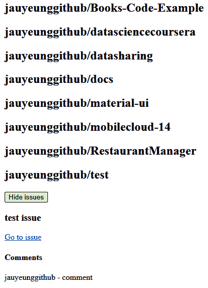
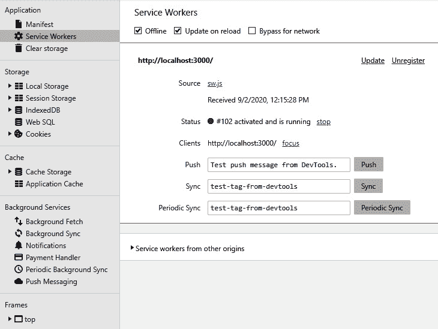

# 二、构建 Vue3 渐进式 Web 应用

在本章中，我们将介绍如何使用 Vue 3 创建 GitHub**渐进式 web 应用**（**PWA**。在构建项目时，我们将通过深入查看基本构建块来检查 Vue 应用的内部工作。我们将创建带有组件的 Vue 应用，在创建这些应用时，我们将查看组成组件的部件及其工作方式。

我们还将在需要时使用更高级的功能，如指令。DOM 操作一个无需混乱的组件模型。它们为我们提供了一种干净的方式来访问 DOM 元素，并以可重用的方式使用它们。这有助于简化测试，并帮助我们模块化代码。

Vue 3 附带了许多我们将使用的内置指令。在上一章中，我们看到了这些的简要概述。在本章中，我们将更详细地了解它们是如何工作的。这些指令提供了易于使用的抽象，使许多事情对我们来说更容易，并且是 Vue 3 的一个基本功能，我们离不开它。

我们将使用组件来显示我们想要的数据，这些数据将通过道具接收输入，以便我们能够获得正确的数据并显示出来。在每个组件中，我们将添加自己的方法，并使用一些组件生命周期方法。为了减少代码的重复，我们使用 mixin 来提取组件中常用的特性，并将它们合并到我们的组件中。

在本章中，我们将研究以下主题：

*   组件和 PWA 的基本理论
*   介绍 GitHub 公文包应用
*   创建 PWA
*   为工务局服务

# 技术要求

本章代码见[https://github.com/PacktPublishing/-Vue.js-3-By-Example/tree/master/Chapter02](https://github.com/PacktPublishing/-Vue.js-3-By-Example/tree/master/Chapter02) 。

# 组件和 PWA 的基本理论

在开始构建 Vue 应用之前，让我们先熟悉一下组件和 PWA。Vue 3 让我们可以使用组件构建前端 web 应用。有了它们，我们可以将我们的应用划分为小的、可重用的部分，这些部分组合在一起，形成一个大的应用。这种组合是通过嵌套完成的。为了让应用的不同部分组合在一起，我们可以在它们之间传递数据。组件可以从库中获取，也可以由我们创建。

一个组件由几个部分组成；它包括模板、脚本和样式。模板是屏幕上呈现的内容。它有**超文本标记语言**（**HTML**元素、指令和组件。组件和 HTML 元素可以添加道具和事件侦听器。道具用于将数据从父组件传递到子组件。

**事件侦听器**让我们侦听子组件向父组件发出的事件。事件可以与有效负载一起发射，其中包含数据。这使我们能够进行子组件到父组件的通信。把这两件事放在一起，我们就有了一个完整的系统来在父组件和子组件之间进行通信。

任何非平凡的应用都会有多个需要相互通信的组件。

PWA 是可以安装在用户计算机上的特殊 web 应用，浏览器管理这些已安装的应用。它们不同于常规的 web 应用，因为它们允许我们以本机方式访问某些计算机硬件。当我们在浏览器中访问 PWA 时，我们可以选择安装 PWA，然后从应用商店访问我们的应用。

PWA 不需要特殊的捆绑或分发程序。这意味着它们就像任何其他 web 应用一样部署到服务器上。许多现代浏览器，如 Mozilla Firefox、Google Chrome、Apple Safari 和 Microsoft Edge 都支持 PWAs。这意味着我们可以用它们安装应用。

PWA 的特殊特性包括能够为每个用户工作，而不考虑浏览器的选择。它们还具有响应能力，这意味着它们可以在任何设备上工作，如台式机、笔记本电脑、平板电脑或移动设备。初始加载也很快，因为它们应该在第一次加载时缓存。

他们也应该工作，无论是否有连接到互联网。服务人员在后台运行，让我们离线或在低质量网络上使用 PWA。这也是 PWAs 可用的缓存的另一个好处。

尽管PWA 是从浏览器运行的，但它们的行为与应用类似。他们有应用式的互动和导航。显示的内容也始终是最新的，因为服务人员在后台运行以更新数据。

安全性是 PWAs 的另一个重要好处。它们只能通过**HTTP 安全**（**HTTPS**）提供服务，因此外界无法窥探连接。这样，我们知道连接没有被篡改。

PWA 也提供推送通知，以便他们可以与用户接触并通知他们更新。

它们也可以通过**统一资源定位器**（**URL**链接到，PWA 在使用之前不需要安装过程，安装是严格可选的。当我们安装它时，它在浏览器上提供了一个主屏幕图标，这样我们就可以点击它并开始使用它。

Vue 3 有一个`@vue/cli-plugin-pwa`插件，可以让我们在不进行任何手动配置的情况下将 PWA 功能添加到 Vue 3 项目中。我们只需运行一个命令，并自动为我们添加所有文件和配置。有了这个插件，我们可以用 VUE3 开发我们的 PWA，其中的服务人员将在生产中运行。我们现在看到的是如何创建可重用组件。

# 推出 GitHub 公文包应用

本章的主要项目是 GitHub portfolio 应用。它是 PWA，这意味着它具有本章*组件基础理论和 PWA*部分列出的所有特性。这些功能由`@vue/cli-plugin-pwa`插件自动提供。我们可以添加所需的代码，用一个命令添加服务工作者和任何其他所需的配置。这样，我们就不必在创建 Vue 项目时从头开始自己配置所有内容。

为了开始我们的应用项目，我们将使用 Vite 创建它。我们进入希望项目所在的文件夹，然后运行 Vite 创建 Vue 3 应用项目。为此，我们使用**节点包管理器**（**npm**运行以下命令：

1.  第一个命令，如下面的代码片段所示，运行 npm 全局安装 Vue**命令行界面**（**CLI**）：

    ```js
    npm install -g @vue/cli@next
    ```

2.  我们运行 Vue CLI 来创建我们的 Vue 3 项目。我们的项目文件夹名称为`vue-example-ch2-github-app`。需要以下命令来创建项目文件夹，并添加所有文件和设置，这样我们就不必自己添加它们。此命令将转到我们刚刚创建的项目文件夹，并在被询问时选择 Vue 3 项目：

    ```js
    npm vue create vue-example-ch2-github-app 
    ```

3.  然后，我们运行以下命令来运行开发服务器，这样我们就可以在浏览器中看到项目，并在编写代码时刷新应用预览：

    ```js
    npm run serve
    ```

或者，我们可以与**另一个资源谈判者**（**纱线**一起运行以下命令：

1.  我们运行`yarn global add`全局安装 Vue CLI，如下所示：

    ```js
    yarn global add @vue/cli@next
    ```

2.  要创建 Vue 3 项目，我们运行以下命令并在被询问时选择 Vue 3 项目：

    ```js
    yarn create vue-example-ch2-github-app
    ```

3.  然后，我们运行以下命令来运行开发服务器，这样我们就可以在浏览器中看到项目，并在编写代码时刷新应用预览：

    ```js
    yarn serve
    ```

前面的所有命令都是相同的，因为它们都以相同的方式创建项目；这只是我们想要使用哪个包管理器来创建 Vue 3 项目的问题。此时，项目文件夹将包含我们的 Vue 3 项目所需的文件。

我们的 GitHub portfolio 应用是一个渐进式 web 应用，我们可以使用现有的 Vue CLI 插件轻松创建此应用。一旦我们创建了项目，我们就可以开始创建我们的 Vue 3 PWA 了。

# 创建 PWA

首先，我们需要一种通过其**代表性状态传输**（**REST**）**应用编程接口**（**API**访问 GitHub 数据的简便方式。幸运的是，一位名为*Octokit*的开发人员开发了一个 JavaScript 客户端，让我们可以使用我们创建的访问令牌访问 GitHub REST API。我们只需要从提供服务的**内容分发网络**（**CDN**中导入包，就可以从我们的浏览器访问 GitHub REST API。它还有一个节点包，我们可以安装和导入。但是，Node 软件包仅支持 Node.js 应用，因此无法在我们的 Vue 3 应用中使用。

Vue 3 是一个客户端 web 框架，这意味着它主要在浏览器上运行。我们不应该将仅在节点上运行的包与支持浏览器的包混淆，否则在浏览器中使用不受支持的包时会出错。

首先，我们对现有文件进行一些更改。首先，我们从`index.css`中删除样式代码。我们关注的是这个项目应用的功能，而不是样式。此外，我们在`index.html`文件中将标题标记的内部文本重命名为`GitHub App`。

然后，为了使我们构建的应用成为 PWA，我们必须运行另一个命令来添加服务工作者，以整合硬件访问支持、安装和离线使用支持等内容。为此，我们使用`@vue/cli-plugin-pwa`插件。我们可以通过运行以下命令来添加：

```js
vue add pwa
```

这将添加使我们的 Vue 3 项目成为 PWA 项目所需的所有文件和配置。

Vue CLI 创建了一个 Vue 项目，该项目使用单文件组件，并为我们的大多数应用使用**ECMAScript 6**（**ES6**模块。当我们构建项目时，这些文件被捆绑到一起，并在 web 服务器上提供服务并在浏览器上运行。使用 Vue CLI 创建的项目包含`main.js`作为其入口点，它运行创建 Vue 应用所需的所有代码。

我们的`main.js`文件应包含以下代码：

```js
import { createApp } from 'vue'
import App from './App.vue'
import './registerServiceWorker'
createApp(App).mount('#app')
```

此文件位于`src`文件夹的根目录下，当应用首次加载或刷新时，Vue 3 将自动运行此文件。`createApp`函数将通过传入入口点组件来创建 Vue 3 应用。入口点组件是我们第一次加载应用时第一次运行的组件。在我们的项目中，我们引入了`App`并将其传递给`createApp`。

此外，`index.css`文件也从同一文件夹导入。这有我们应用的全局样式，这是可选的，所以如果我们不想要任何全局样式，我们可以省略它。然后导入`registerServiceWorker.js`文件。带有文件名的导入仅意味着直接运行文件中的代码，而不是从模块中导入任何内容。

`registerServiceWorker.js`文件应包含以下代码：

```js
/* eslint-disable no-console */
import { register } from 'register-service-worker'
if (process.env.NODE_ENV === 'production') {
...
    offline () {
      console.log('No internet connection found. App is running          in offline mode.')
    },
    error (error) {
      console.error('Error during service worker          registration:', error)
    }
  })
}
```

这是我们运行`vue add pwa`时创建的。如果应用处于`production`模式，我们调用`register`函数注册服务工作者。当我们运行`npm run build`命令时，将创建服务工作者，我们可以使用创建的服务工作者，让用户从我们提供的构建代码中访问缓存和硬件访问等功能。服务工作者仅在`production`模式下创建，因为我们不希望在开发环境中缓存任何内容。我们总是希望看到显示的最新数据，这样我们就可以创建代码并进行调试，而不会被缓存搞混。

我们还需要做的一件事是从`src/components`文件夹中删除`HelloWorld.vue`组件，因为我们的应用中不需要这个组件。稍后我们还将删除对`App.vue`中`HelloWorld`组件的任何引用。

现在我们已经对现有代码文件进行了编辑，我们可以创建新文件了。为此，我们执行以下步骤：

1.  在`components`文件夹中，我们添加了一个`repo`文件夹；在`repo`文件夹中，我们添加了一个`issue`文件夹。在`repo`文件夹中，我们添加了`Issues.vue`组件文件。
2.  在`components/repo/issue`文件夹中，我们添加了`Comments.vue`文件。`Issues.vue`用于显示 GitHub 代码存储库的问题。`Comments.vue`用于显示添加到代码库问题的注释。
3.  在`components`文件夹中，我们添加了`GitHubTokenForm.vue`文件，以便输入并存储 GitHub 令牌。
4.  我们还将`Repos.vue`文件添加到同一文件夹中，以显示 GitHub 访问令牌所引用的用户的代码库。然后，最后，我们将`User.vue`文件添加到`components`文件夹中，以便显示用户信息。
5.  在`src`文件夹中创建一个`mixins`文件夹以添加一个 mixin，让我们使用 GitHub 访问令牌创建 Octokit GitHub 客户端。

我们将文件添加到`mixins`文件夹中，以添加空的 mixin。现在，我们将它们全部保留为空，因为我们已经准备好添加文件。

## 为我们的应用创建 GitHub 客户端

我们通过创建我们将在整个应用中使用的 GitHub`Client`对象来启动项目。

首先，在`src/mixins/octokitMixin.js`文件中，我们添加了以下代码：

```js
import { Octokit } from "https://cdn.skypack.dev/@octokit/rest";
export const octokitMixin = {
  methods: {
    createOctokitClient() {
      return new Octokit({
        auth: localStorage.getItem("github-token"),
      });
    }
  }
}
```

前面的文件是一个 mixin，它是一个我们合并到组件中的对象，以便我们可以在组件中正确使用它。mixin 与组件具有相同的结构。添加了[T0]属性，以便我们可以创建合并到组件中的方法。为了避免命名冲突，我们应该避免在我们的组件中命名任何名为`createOctokitClient`的方法，否则我们可能会得到我们不期望的错误或行为。`createOctokitClient()`方法使用 Octokit客户端通过获取`github-token`本地存储项并将其设置为`auth`属性来创建客户端。`auth`属性是我们的 GitHub 访问令牌。

`Octokit`构造函数来自[添加的`octokit-rest.min.js`文件 https://github.com/octokit/rest.js/releases?after=v17.1.0](https://github.com/octokit/rest.js/releases?after=v17.1.0) 。我们找到`v16.43.1`标题，点击**资产**，下载`octokit-rest.min.js`文件，并将其添加到`public`文件夹中。然后，在`public/index.html`中，我们添加一个`script`标记来引用该文件。我们在`index.html`文件中应该有以下代码：

```js
<!DOCTYPE html>
<html lang="en">
  <head>
    <meta charset="utf-8">
    <meta http-equiv="X-UA-Compatible" content="IE=edge">
    <meta name="viewport" content="width=device-
      width,initial-scale=1.0">
    <link rel="icon" href="<%= BASE_URL %>favicon.ico">
    <title><%= htmlWebpackPlugin.options.title %></title>
    <script src="<%= BASE_URL %>octokit-rest.min.js">
      </script>
  </head>
  <body>
    <noscript>
      <strong>We're sorry but <%= htmlWebpackPlugin.
          options.title %> doesn't work properly without 
           JavaScript enabled. Please enable it to 
            continue.</strong>
    </noscript>
    <div id="app"></div>
    <!-- built files will be auto injected -->
  </body>
</html>
```

## 添加问题和评论的显示

然后，在的`src/components/repo/issue/Comments.vue`文件中，我们添加了以下代码：

```js
<template>
  <div>
    <div v-if="comments.length > 0">
      <h4>Comments</h4>
      <div v-for="c of comments" :key="c.id">
        {{c.user && c.user.login}} - {{c.body}}
      </div>
    </div>
  </div>
...
        repo,
        issue_number: issueNumber,
      });
      this.comments = comments;
    }
  },
  watch: {
    owner() {
      this.getIssueComments();
    },
    repo() {
      this.getIssueComments();
    },
    issueNumber() {
      this.getIssueComments();
    }
  }
};
</script>
```

在这个组件中，我们有一个`template`部分和一个`script`部分。`script`部分有我们的逻辑，可以从问题中获得评论。`name`属性具有我们组件的名称。如果需要，我们在其他组件中使用此名称引用我们的组件。`props`属性具有组件接受的道具，如以下代码段所示：

```js
  props: {
    owner: {
      type: String,
      required: true,
    },
    repo: {
      type: String,
      required: true,
    },
    issueNumber: {
      type: Number,
      required: true,
    },
  },
```

组件采用`owner`、`repo`和`issueNumber`道具。我们使用一个对象来定义道具，这样我们就可以使用`type`属性轻松地验证类型。`owner`和`repo`的类型值为`String`，所以它们必须是字符串。`issueNumber`属性的类型值设置为`Number`，因此它必须是一个数字。

`required`属性设置为`true`，这意味着当我们在另一个组件中使用`Comments`组件时，必须设置`prop`。

`data()`方法用于返回具有反应属性初始值的对象。`comments`被动属性设置为空数组作为其初始值。

`mixins`属性允许我们设置要合并到应用中的混音。由于`octokitMixin`有一个`methods`属性，内部的任何内容都将添加到我们组件的`methods`属性中，这样我们就可以直接调用组件，就像我们在这个组件的`methods`属性中所做的一样。

我们将 mixin 合并到组件对象中，如下所示：

```js
mixins: [octokitMixin],
```

在`methods`属性中，我们在`Comments`组件中有一个方法。我们使用`getIssueComments()`方法获取问题的评论。下面的代码片段显示了这方面的代码：

```js
  ...
  methods: {  
    ...
    async getIssueComments(owner, repo, issueNumber) {
      if (
        typeof owner !== "string" ||
        typeof repo !== "string" ||
        typeof issueNumber !== "number"
      ) {
        return;
      }
      const octokit = this.createOctokitClient();
      const { data: comments } = await 
        octokit.issues.listComments({
        owner,
        repo,
        issue_number: issueNumber,
      });
      this.comments = comments;
    },
    ...
  }
  ...
}
```

我们需要[T0]、[T1]和[T2]属性。`owner`参数是拥有存储库的用户的用户名，`repo`参数是存储库名称，`issueNumber`参数是问题的问题编号。

我们使用`octokit.issue.listComments()`方法检查每个问题的类型，以确保它们是我们在发出获取问题的请求之前所期望的类型。Octokit 客户端是通过我们 mixin 的`createOctokitClient()`方法创建的。`listComments()`方法返回一个承诺，用注释数据解决问题。

在那之后，我们有`watch`属性来添加我们的观察者。属性的关键是我们正在观看的道具的名称。每个对象都有一个`immediate`属性，它使观察者在组件加载后立即开始观察。`handler`方法具有在 prop 值更改或组件加载时运行的处理程序，因为我们将`immediate`属性设置为`true.`

我们从 this 的属性中传入所需的值，连同`val`一起调用`getIssueComments()`方法。`val`参数具有我们正在观察的任何道具的最新值。这样，如果我们设置了所有道具的值，我们总是会得到最新的评论。

在模板中，我们通过引用`comments`reactive 属性加载注释。这些值由在观察程序中运行的`getIssueComments()`方法设置。使用`v-for`指令，我们循环遍历每个项并呈现值。`c.user.login`属性包含发表评论的用户的用户名，`c.body`包含评论的主体。

接下来，我们在`src/components/Issues.vue`文件中添加以下代码：

```js
...
<script>
import { octokitMixin } from "../../mixins/octokitMixin";
import IssueComments from "./issue/Comments.vue";
export default {
  name: "RepoIssues",
  components: {
    IssueComments,
  },
  props: {
    owner: {
      type: String,
      required: true,
    },
    repo: {
      type: String,
      required: true,
    },
  },
  mixins: [octokitMixin],
  ...
};
</script>
```

前面的代码添加了一个用于显示问题的组件。我们在`Comments.vue`组件中有类似的代码。我们使用相同的`octokitMixin`mixin 合并来自 mixin 的`createOctokitClient()`方法。

不同之处在于，我们有`getRepoIssues()`方法来获取给定 GitHub 存储库的问题，而不是给定问题的注释，并且我们有两个道具，而不是三个。`owner`和`repo`道具都是字符串，我们将它们设置为必需的，并以相同的方式验证它们的类型。

在`data()`方法中，我们有`issues`数组，它是在调用`getRepoIssues`时设置的。这显示在以下代码段中：

src/components/Issues.vue

```js
  data() {
    return {
      issues: [],
      showIssues: false,
    };
  },
```

`octokit.issues.listForRepo()`方法返回解决给定存储库问题的承诺。`showIssue`反应性属性允许我们切换是否显示问题。

我们还提供了获取 GitHub 问题的方法，如以下代码片段所示：

src/components/Issues.vue

```js
  methods: {
    async getRepoIssues(owner, repo) {
      const octokit = this.createOctokitClient();
      const { data: issues } = await 
        octokit.issues.listForRepo({
        owner,
        repo,
      });
      this.issues = issues;
    },
  },
```

`showIssues`无功特性由**显示问题**按钮控制。我们使用`v-if`指令来显示`showIssues`反应性属性为`true`时的问题。外部`div`标签用于检查问题的长度属性，因此我们仅在长度大于`0`时显示**显示问题**按钮和问题列表。

方法由观察者触发，如下所示：

src/components/Issues.vue

```js
  watch: {
    owner: {
      handler(val) {
        this.getRepoIssues(val, this.repo);
      },
    },
    repo: {
      handler(val) {
        this.getRepoIssues(this.owner, val);
      },
    },
  },
  created () {
    this.getRepoIssues(this.owner, this.repo);
  }
```

在`components`属性中，我们将导入的`IssueComments`组件（我们之前创建的组件）放入我们的组件对象中。如果我们将组件放在`components`属性中，那么它将在组件中注册，我们可以在模板中使用它。

接下来，我们将模板添加到文件中，如下所示：

src/components/Issues.vue

```js
<template>
  <div v-if="issues.length > 0">
    <button @click="showIssues = !showIssues">{{showIssues 
       ? 'Hide' : 'Show'}} issues</button>
    <div v-if="showIssues">
      <div v-for="i of issues" :key="i.id">
        <h3>{{i.title}}</h3>
        <a :href="i.url">Go to issue</a>
        <IssueComments :owner="owner" :repo="repo" 
          :issueNumber="i.number" />
      </div>
    </div>
  </div>
</template>
```

当我们使用`v-for`指令时，我们需要包括`key`道具，以便正确显示条目，以便 Vue 3 跟踪条目。`key`的值必须是唯一的 ID。我们引用我们在模板中注册的`IssueComments`组件，并将`props`传递给它。`:`符号是`v-bind`指令的缩写，表示我们正在向组件传递道具，而不是设置属性。

## “T0”：允许用户使用 GitHub 令牌访问 GitHub 数据

接下来，我们对`src/components/GitHubTokenForm.vue`文件进行处理，如下所示：

```js
<template>
  <form @submit.prevent="saveToken">
    <div>
      <label for="githubToken">Github Token</label>
      <br />
      <input id="githubToken" v-model="githubToken" />
    </div>
    <div>
      <input type="submit" value="Save token" />
      <button type="button" @click="clearToken">Clear token
         </button>
...
    clearToken() {
      localStorage.clear();
    },
  },
};
</script>
```

我们有一个表单，它有一个输入，允许我们输入 GitHub 访问令牌。这样，我们可以在提交表单时保存它。此外，我们还有输入，类型为`submit`。它的`value`属性显示为**提交**按钮的文本。我们还有一个按钮，可以清除令牌。`@submit.prevent`指令允许我们同时运行`saveToken`提交处理程序并调用`event.preventDefault()`。`@`符号是`v-on`指令的缩写，它侦听表单发出的提交事件。

文本输入有一个`v-model`指令，将输入值绑定到`githubToken`被动属性。为了让屏幕阅读器能够访问我们的输入，我们有一个带有`for`属性的标签，该属性引用输入的 ID。标签中会显示标记之间的文本。

一旦提交表单，`saveToken()`方法运行，以`github-token`字符串作为键将输入值保存到本地存储器。`created()`方法是一个生命周期挂钩，让我们从本地存储中获取值。访问带有`github-token`键的项目以获取保存的令牌。

当我们点击**清除令牌**按钮时，`clearToken()`方法清除令牌并运行。

接下来，我们在`src/components/Repos.vue`组件中添加以下代码：

```js
<template>
  <div>
    <h1>Repos</h1>
    <div v-for="r of repos" :key="r.id">
      <h2>{{r.owner.login}}/{{r.name}}</h2>
      <Issues :owner="r.owner.login" :repo="r.name" />
    </div>
  </div>
</template>
<script>
import Issues from "./repo/Issues.vue";
import { octokitMixin } from "../mixins/octokitMixin";
export default {
  name: "Repos",
  components: {
    Issues,
  },
  data() {
    return {
      repos: [],
    };
  },
  mixins: [octokitMixin],
  async mounted() {
    const octokit = this.createOctokitClient();
    const { data: repos } = await 
       octokit.request("/user/repos");
    this.repos = repos;
  },
};
</script>
```

我们使用`octokit.request()`方法向 GitHub REST API 的`/user/repos`端点发出请求。同样地，`octokit`对象是用我们之前使用的相同 mixin 创建的。我们注册`Issues`组件，以便使用它显示代码库的问题。我们循环使用`repos`反应性属性，该属性由`octokit.request()`方法中的值指定。

数据在模板中呈现。`r.owner.login`属性具有 GitHub 存储库所有者的用户名，`r.name`属性具有存储库名称。我们将这两个值作为道具传递给`Issues`组件，以便`Issues`组件加载给定存储库的问题。

类似地，在`src/components/User.vue`文件中，我们编写了以下代码：

```js
<template>
  <div>
    <h1>User Info</h1>
    <ul>
      <li>
        
      </li>
      <li>username: {{userData.login}}</li>
      <li>followers: {{userData.followers}}</li>
      <li>plan: {{userData.pla && userData.plan.name}}</li>
    </ul>
  </div>
...
    const { data: userData } = await 
      octokit.request("/user");
    this.userData = userData;
  },
};
</script>
<style scoped>
#avatar {
  width: 50px;
  height: 50px;
}
</style>
```

`scoped`关键字表示样式仅应用于当前组件。

此组件用于显示我们可以从 GitHub 访问令牌访问的用户信息。我们使用相同的 mixin 为 Octokit 客户端创建`octokit`对象。调用`request()`方法，通过向用户端点发出请求来获取用户数据。

然后，在模板中，我们使用`avatar_url`属性显示用户数据。`username.login`属性具有令牌所有者的用户名，`userData.followers`属性具有用户的追随者数量，`userData.plan.name`属性具有计划名称。

最后，为了将整个应用放在一起，我们在`App.vue`组件中使用`GitHubTokenForm`、`User`和`Repo`组件。`App.vue`组件是我们加载应用时加载的`root`组件。

在`src/App.vue`文件中，我们编写以下代码：

```js
<template>
  <div>
    <h1>Github App</h1>
    <GitHubTokenForm />
    <User />
    <Repos />
  </div>
</template>
<script>
import GitHubTokenForm from "./components/GitHubTokenForm.vue";
import Repos from "./components/Repos.vue";
import User from "./components/User.vue";
export default {
  name: "App",
  components: {
    GitHubTokenForm,
    Repos,
    User,
  },
};
</script>
```

我们通过将这三个组件放入`components`属性来注册它们。然后，我们在模板中使用它们。

现在，我们应该看到以下屏幕：



图 2.1–存储库列表

我们会看到显示的存储库列表，如果有任何问题记录下来，我们会看到**显示问题**按钮，该按钮允许我们查看给定存储库的任何问题。这可以在以下屏幕截图中看到：


图 2.2–显示问题按钮

我们可以点击**隐藏问题**进行隐藏。如果有任何意见，那么我们应该在问题下方看到它们。

# 为 PWA 服务

既然我们已经构建了这个应用，我们可以为它提供服务，这样我们就可以在浏览器中安装它了。让我们开始，如下所示：

1.  要构建应用，我们运行以下命令：

    ```js
    npm run build
    ```

2.  We can use the `browser-sync` package, which we install by running the following command:

    ```js
    npm install –g browser-sync
    ```

    前面的命令将安装 web 服务器。

3.  我们可以进入包含构建文件的`dist`文件夹，运行`browser-sync`为 PWA 服务。
4.  现在，要运行应用，我们需要从 GitHub 帐户获取 GitHub 身份验证令牌。如果你没有 GitHub 帐户，那么你必须注册一个。
5.  一旦我们创建了一个帐户，我们就可以获得令牌。要获取令牌，请登录您的 GitHub 帐户。
6.  转到[https://github.com/settings/tokens](https://github.com/settings/tokens) 。
7.  加载页面后，单击**个人访问令牌**链接。
8.  Click **Generate new token** to generate a token. Once it's created, copy the token down somewhere so that we can use it by entering it in our app.

    我们应该看到这样的情况：

    

    图 2.3–获取令牌的屏幕

9.  获得令牌后，返回到我们创建的应用，该应用将加载到浏览器中。
10.  将令牌输入**GitHub 令牌**输入，点击**保存令牌**，刷新页面。如果有任何存储库以及相关的问题和评论，那么它们应该显示在页面中。
11.  进入浏览器后，我们会在 URL 栏的右侧看到加号（**+**）。这个按钮让我们安装 PWA。
12.  Once we install it, we should see it on the home screen. We can go to the `chrome://apps` URL to see the app we just installed, as shown in the following screenshot:

    

    图 2.4–我们的 PWA 中的 GitHub 存储库列表

13.  如果您正在使用 Chrome 或任何其他 Chrome 浏览器，如 Edge，您可以按*F12*打开开发者控制台。
14.  Click on the **Application** tab and then the **Service Workers** link on the left side to let us test the service worker, as illustrated in the following screenshot:

    

    图 2.5–应用选项卡的服务人员部分

15.  我们可以选中**离线**复选框来模拟它离线时的行为。当我们刷新页面时，检查重新加载时的**更新**将使用获取的最新数据重新加载应用。URL 应与运行应用的 URL 相同。这是我们的 GitHub PWA 注册的服务人员。
16.  **注销**链接将注销服务工作者。当我们再次运行应用时，应该重新注册它。

现在，我们已经完成了使用 Vue 3 创建渐进式 web 应用的工作。我们可以用浏览器安装它，然后像我们设备上的任何其他应用一样使用它。

# 总结

通过构建 GitHub PWA，我们学习了如何创建可重用的组件。我们还研究了如何添加道具，以便将数据从父组件传递到子组件。在子组件中，我们通过检查数据类型并指定是否需要道具来验证道具。通过这种方式，我们可以很容易地看到道具的值是否出乎意料。

我们还研究了如何使用观察者来观察具有被动属性值的更改。可以添加观察者来观察任何反应性属性的变化。我们可以查看本地正在更改的数据，以及道具的价值。它们都是被动的，因此它们都会触发观察者方法。我们可以在观察程序中运行异步代码，这是使用计算属性无法完成的。

此外，我们还研究了组件的生命周期挂钩。每个组件也有自己的生命周期挂钩。我们可以将自己的代码添加到生命周期方法中，以便在需要运行它们时运行代码。组件生命周期的所有部分都有生命周期挂钩，包括从加载到更新和销毁的开始阶段。

最后，我们学习了如何使用命令行插件将 VUE3 web 应用转换为 PWA。我们可以在 Vue 项目中添加一个插件来创建 PWA。使用它，服务工作者将在我们的应用中注册，以处理不同的连接类型和缓存。

在下一章中，我们将使用 Vue 3 创建一个滑块拼图，通过自动化测试来测试我们应用的每个部分。