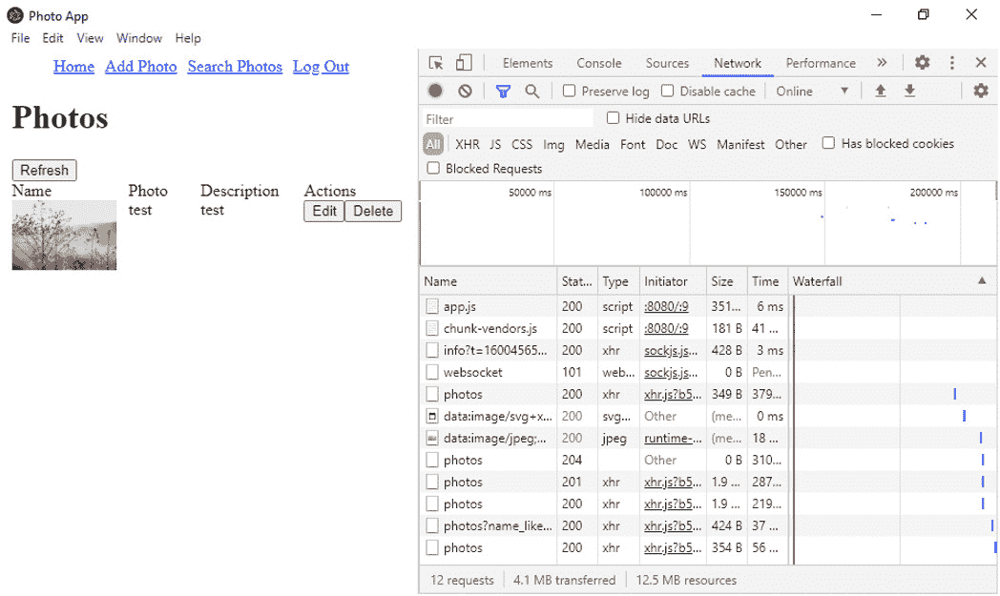
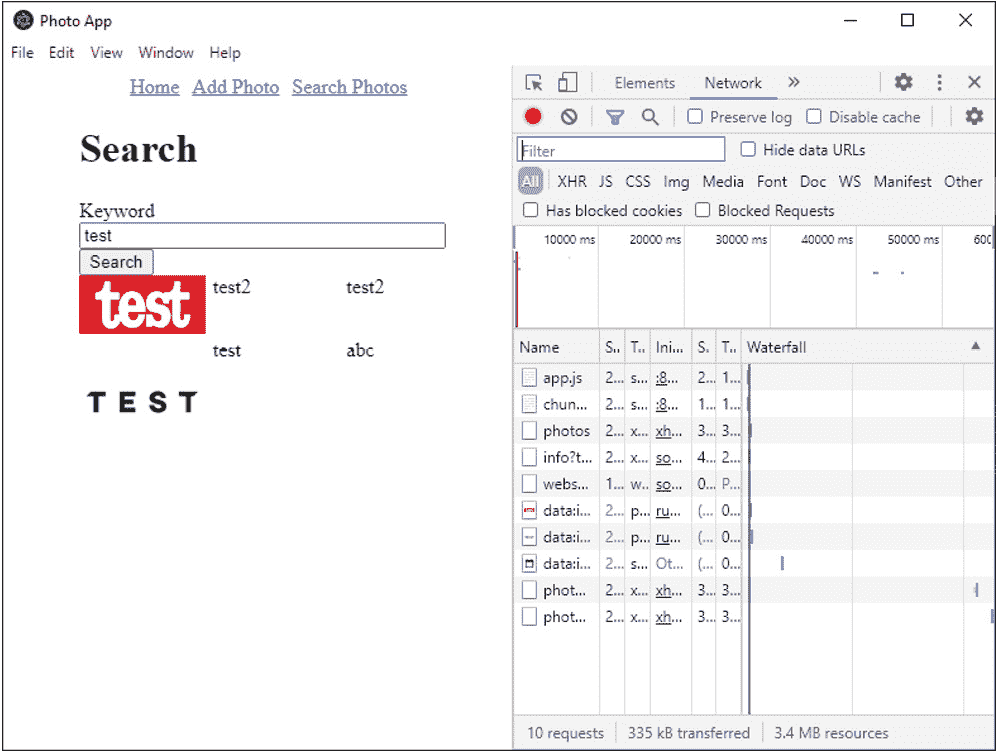

# *第 4 章*：构建照片管理桌面应用

到目前为止，我们只使用 VUE3 构建了 web 应用程序。在本章中，我们将使用 Vue Electron 插件构建一个照片管理桌面应用程序。我们将学习如何使用 Electron 和 Vue 轻松构建跨平台桌面应用程序。这是很有用的，因为我们无需额外努力就可以构建跨平台的桌面应用程序。这将节省我们的时间，给我们带来好的结果。

在本章中，我们将重点关注以下主题：

*   了解组件
*   使用 Vue CLI 插件创建项目
*   添加照片提交 UI
*   添加照片显示
*   将路由添加到照片管理器应用程序
*   将我们的应用程序与照片管理 API 结合使用

# 技术要求

要理解本章，您应该已经知道如何执行以下操作：

*   创建基本的 Vue 组件
*   使用 Vue CLI 创建项目

您可以在【T0 所有章节】中找到 https://github.com/PacktPublishing/-Vue.js-3-By-Example/tree/master/Chapter04 。

# 了解组件

**组件**内部只能有这么多。它们从父组件获取道具，因此我们可以自定义它们的行为。此外，他们可以有计算属性和观察者来观察反应属性并返回数据或做我们希望他们做的事情。他们也可以有方法让我们用他们做特定的事情。组件应该简单；也就是说，他们不应该有太多的内部活动。为了保持简单，模板中应该只有一些元素和组件。组件也有一些内置指令供我们操作**文档对象模型**（**DOM**）并进行数据绑定。

除此之外，组件不能做很多事情。如果我们只有几个组件，并且没有办法使用 URL 导航，那么就不可能构建任何具有非平凡复杂性的东西。

如果我们的应用程序只有组件，那么在变得太复杂之前，我们只能嵌套一些组件。此外，如果我们有很多嵌套组件，那么导航就会变得困难。大多数应用程序都有不同的页面，如果没有某种路由机制，就不可能导航。

使用 Vue 路由器，我们可以在转到给定 URL 时呈现所需的组件。我们还可以使用 Vue 路由器提供的`router-link`组件导航到路由。Vue 路由器具有许多功能。它可以将 URL 与路由匹配。URL 可以有查询字符串和 URL 参数。此外，我们可以使用它添加嵌套管线，以便将管线嵌套在不同的组件中。映射到 URL 的组件显示在 Vue 路由器的`router-view`组件中。如果我们有嵌套路由，那么我们需要父路由中的`router-view`组件。这样，将显示子管线。

为了导航到不同的路由，Vue Router 为 JavaScript 历史 API 提供了一个包装器，该 API 内置于几乎所有现代浏览器中。有了这个 API，我们可以轻松地返回到不同的页面、历史记录或我们想要的 URL。Vue 路由器还支持 HTML5 模式，因此我们可以使用不带哈希符号的 URL 来区分它们与服务器端呈现的路由。

此外，还支持过渡效果，当我们在不同路线之间导航时可以看到它们。当链接是已导航到并处于活动状态的链接时，样式也可以应用于链接。

# 了解 Vue CLI 插件 Electron Builder

我们可以使用 Electron 将JavaScript 客户端 web 应用程序转换为桌面应用程序。Vue CLI 插件 Electron Builder 使我们能够添加文件和设置，以便在桌面应用程序中构建 Vue 3 应用程序，而无需进行许多手动更改。本质上，Electron 应用程序是一种 web 应用程序，它运行在显示 web 应用程序的 Chromium 浏览器包装中。因此，通过浏览器，它可以做我们需要它做的任何事情。这包括一些有限的硬件交互，例如使用麦克风和摄像头。此外，它还提供了一些本机功能，例如在常用操作系统的通知区域中显示项目和显示本机通知。这是一种从不需要低级别硬件访问的 web 应用构建桌面应用的简单方法。

Vue CLI 插件 Electron Builder 是从 Vue 应用程序创建 Electron 应用程序的最快方法，因为它支持一些本机代码。我们还可以在代码中包含本机模块；我们只需要包含 Node.js 模块的位置以及我们想要包含的本机代码。此外，我们可以包含环境变量，从而为不同的环境构建相应的代码。由于 Chromium 支持 Web workers，因此也支持 Web workers。我们可以使用它来运行后台任务，这样当我们想要执行长时间运行或 CPU 密集型任务时，就不必占用主浏览器线程。所有这些都可以通过常规 Vue 应用程序代码或通过配置更改来完成。Electron 还支持 Vue CLI 插件 Electron Builder 不支持的其他功能。这意味着它的能力更加有限。使用此插件时，本机菜单等功能不可用。但是，我们可以在多个平台上构建桌面应用程序。

在本章中，我们将构建一个在 Windows 上运行的照片管理器桌面应用程序。该应用程序将包含一个页面，显示您添加的所有照片。此外，它还允许用户添加照片并存储它们；它将有一个表单，允许用户添加照片。照片将使用我们自己的照片存储机制进行存储。我们将使用 Vue 路由器手动或自动浏览页面。

## 使用 Vue CLI 插件创建项目

使用 Vue 3 和 Vue CLI 插件生成器创建项目是一项简单的任务。执行以下步骤：

1.  To create the project, create a project folder called `vue-example-ch4-photo-manager`. Then, go into the folder and run the following commands with `npm`:

    ```js
    npm install -g @vue/cli@next
    npm vue create
    ```

    或者，您可以使用`yarn`运行以下命令：

    ```js
    yarn global add @vue/cli@next
    yarn create
    ```

    一旦有了“创建项目类型”菜单选项，您就可以运行“创建项目类型”命令。

2.  选择默认的**Vue 3 项目**选项创建 Vue 3 项目。然后，将 Vue CLI 插件 Electron Builder 添加到我们的 Vue 应用程序中。
3.  要添加 VueCLI Electron Builder 插件，请在项目文件夹中运行`vue add electron-builder`。运行`cd <folder path>`导航到该文件夹。所有文件和设置都将添加到项目中。

一旦命令运行，我们应该在项目中看到一些新的东西。我们现在有了`background.js`文件，其中包含显示电子窗口的代码。我们还在`package.json`文件中添加了一些新的脚本命令。`electron:build`脚本命令允许我们为生产构建应用程序。`electron:server`命令允许我们使用开发服务器为我们的电子应用程序提供服务，以便我们可以使用它开发我们的应用程序。我们自动提供了热重新加载功能，因此我们可以在浏览器和电子桌面应用程序窗口中实时查看所有更改。因为它只是一个浏览器的包装，我们可以通过我们的应用程序在桌面窗口中看到最新的变化。

在桌面窗口中，我们还应该看到 Chromium 开发控制台，它与浏览器中的控制台相同。为了使调试更容易，我们建议查看浏览器窗口进行调试，因为我们可以在开发控制台中检查元素并执行我们想执行的任何操作。

`background.js`文件的内容可在[找到 https://github.com/PacktPublishing/-Vue.js-3-By-Example/blob/master/Chapter04/src/background.js](https://github.com/PacktPublishing/-Vue.js-3-By-Example/blob/master/Chapter04/src/background.js) 。

`BrowserWindow`构造函数默认创建一个宽度为 800 像素、高度为 600 像素的浏览器窗口。我们可以通过拖动窗口来更改窗口大小，就像对其他桌面应用程序一样。`win.loadURL()`方法加载我们应用程序的主页，即`index.html`文件。`index.html`文件位于`dist-electron`文件夹中。否则，我们调用`win.loadURL()`方法加载`webpack-dev-server`URL，以便在开发环境的窗口中查看应用程序。这是因为`webpack-dev-server`只有在开发环境中运行时才会在内存中加载应用程序。

`win.webContents.openDevTools()`方法在开发环境中打开 Chromium development控制台。`app.quit()`方法退出桌面应用程序。当消息事件在 Windows 下运行时，我们会侦听它，如`process.platform === 'win32'`表达式所示。否则，Electron 将侦听 SIGTERM 事件，并在发出该事件时关闭窗口。SIGTERM 事件在我们结束程序时发出。

要更改窗口的标题，我们只需更改`public/index.html`文件中的`title`标记。例如，我们可以编写以下内容：

```js
<!DOCTYPE html>
<html lang="en">
  <head>
    <meta charset="utf-8">
    <meta http-equiv="X-UA-Compatible" content="IE=edge">
    <meta name="viewport" content="width=device-width,       initial-scale=1.0">
    <link rel="icon" href="<%= BASE_URL %>favicon.ico">
    <title>Photo App</title>
  </head>
  <body>
    <noscript>
      <strong>We're sorry but <%= htmlWebpackPlugin.options
        .title %> doesn't work properly without JavaScript 
          enabled. Please enable it to continue.</strong>
    </noscript>
    <div id="app"></div>
    <!-- built files will be auto injected -->
  </body>
</html>
```

我们只需将`title`标记的内容更改为我们想要的内容，文本将显示为窗口的标题。

然后，一旦我们运行了`vue add electron-builder`命令，我们就可以添加文件和设置。要启动开发服务器并在屏幕上显示 Electron 应用程序，我们运行 Vue CLI 插件 Electron Builder 提供的[T1]或[T2]命令。您应该会在屏幕上看到一个窗口显示（请参考*图 4.1*。当我们对现有文件进行任何更改或添加或删除文件时，这将自动刷新。现在，我们几乎可以开始构建我们的应用程序了：


图 4.1–Electron 应用程序窗口

我们将安装一些我们需要在 Vue 应用程序和 Vue 路由器库中使用的包，以便将路由添加到我们的应用程序中。我们将把它用于路由器链接，并以编程方式导航。我们还将使用 Axios HTTP 客户端轻松地向 API 发出 HTTP 请求。要安装软件包，我们可以运行`npm install axios vue-router@4.0.0-beta.9`或`yarn add axios vue-router@4.0.0-beta.9`命令。

我们安装 Axios 是为了方便地进行 HTTP 请求。现在，我们已经准备好构建我们的应用程序。

# 新增照片提交界面

要构建应用程序，我们首先将组件和文件添加到中，以存储整个应用程序所需的常量。首先，我们去掉了`components/HelloWorld.vue`文件。然后，我们移除`App.vue`文件中对它的任何引用，包括`import`和`components`属性，以注销组件。现在，我们将向我们的应用程序添加一些新组件。

首先，我们将`PhotoFormPage.vue`组件文件添加到`src/components`文件夹中。在文件中，我们添加了以下模板：

```js
<template>
  <div class="form">
    <h1>{{ $route.params.id ? "Edit" : "Add" }} Photo</h1>
    <form @submit.prevent="submit">
      <div>
        <label for="name">Name</label>
        <br />
        <input
          type="text"
          v-model="form.name"
          name="name"
          id="name"
          class="form-field"
        />
...
        <label for="dateTaken">Date Taken</label>
        <br />
        <input
          type="datetime-local"
          name="dateTaken"
          id="dateTaken"
          v-model="form.dateTaken"
        />
      </div>
      ...
    </form>
  </div>
</template>
```

此模板具有用于添加和编辑照片的输入。`name`和`description`为文本输入。`Date Taken`字段是一个日期输入。

然后，我们添加照片字段作为文件输入：

```js
<template>
  <div class="form">
    <h1>{{ $route.params.id ? "Edit" : "Add" }} Photo</h1>
    <form @submit.prevent="submit">
      ...
      <div>
        <label for="photoFile">Photo</label>
        <br />
        <input type="file" name="photoFile" id="photoFile" 
          @change="onChange" />
        <br />
        
      </div>
    </form>
  </div>
</template>
```

我们将把所选文件读入 base64 字符串，以便使用 HTTP 请求轻松保存数据。我们还使用 base64 字符串预览`img`元素中的图像。

然后，我们将标记添加到`PhotoFormPage.vue`：

```js
<script>
import axios from "axios";
import { APIURL } from "../constant";
export default {
  name: "PhotoForm",
  data() {
    return {
      form: {
        name: "",
        description: "",
        dateTaken: "",
        photoFile: undefined,
      },
    };
  },
...
      reader.onload = () => {
        this.form.photoFile = reader.result;
      };
    },
  },
  async beforeMount() {
    const { id } = this.$route.params;
    if (id) {
      const { data } = await 
        axios.get(`${APIURL}/photos/${id}`);
      this.form = data;
    }
  },
};
</script>
```

这通过检查`id`参数是否设置来确定是编辑现有照片还是创建新照片。如果是，那么我们正在编辑。否则，我们将创建一张新照片。此逻辑用于`submit`方法和`beforeMount`钩子。

`submit()`方法的`id`用于向 API 发出 HTTP 请求以保存条目。我们通过写入以下内容从路由中获取`id`参数：

```js
const { id } = this.$route.params;
```

然后，我们在它的正下方添加一个`if`语句，以检查它是否已设置。如果设置了，我们会发出*PUT*请求来更新现有条目。否则，我们将发出*POST*请求以创建新条目。

在这个组件中，我们有一个表单，允许我们在应用程序中添加和编辑照片。我们根据`edit`道具的值显示**添加**或**编辑**文本。然后，我们有一个表单，里面有一堆字段。`form`元素有一个提交事件监听器，当我们点击**提交****输入**按钮时，该监听器运行`submit()`方法。`prevent`修饰符运行`event.preventDefault()`方法，而无需我们自己将其添加到`submit`处理程序中。我们需要它，因为我们不希望浏览器执行默认的`submit`行为，这将直接向服务器提交表单数据。我们希望使用自己的客户端代码在客户端处理数据。

在这个项目中，我们不会创建自己的 API，也不会在服务器端进行任何数据验证。

此外，修饰符使我们不必键入它，也使代码更短。指令语法非常常见，因此有一个符号。`@`符号也可以替换为`v-on`指令，因为`@`是`v-on`指令的简写。

在`form`标签中，我们有`input`元素和`v-model`指令，它们绑定到`form`反应性属性的各种属性。`label`HTML 元素是每个输入的标签。`label`具有`for`属性，允许它将标签映射到`input`元素的`id`参数。这对可访问性很好，因为屏幕阅读器将拾取它并将其读给用户。这对我们应用程序的视障用户非常有帮助。我们将在`textarea`标记中使用非常类似的代码。

日期和时间选择器是通过将`type`属性设置为`datetime-local`创建的本机日期和时间选择器。这使我们能够添加设置为设备时区的日期和时间选择器。然后，我们设置`v-model`指令，将日期和时间选择器值绑定到用户在浏览器或桌面应用程序窗口中选择的值。大多数现代浏览器都支持这种类型的输入，因此我们可以使用它让用户选择日期和时间。`type`属性也可以设置为`date`以仅添加日期选择器。此外，我们可以将类型设置为`datetime`以添加设置为 UTC 的日期和时间选择器。

`file`输入更复杂。输入的`type`属性设置为`file`，以便我们可以看到文件输入。此外，它还有一个更改事件侦听器，它运行`onChange()`方法将二进制图像文件转换为 base64 字符串。这会将图像作为文本字符串保存到 API 中。对于一个小应用程序，例如这个照片管理应用程序，我们可以将图像直接保存为字符串。

但是，如果我们正在构建一个生产质量高的应用程序，有大量用户使用该应用程序并进行大量文件上传，那么将文件保存在第三方存储服务（如 Dropbox 或 Amazon S3）中将是一个好主意。然后，我们可以从 URL 而不是 base64 字符串获取文件。HTTP URL 和 base64 URL 是等效的。我们可以将两者都设置为`img`标签的`src`属性值来显示图像。在本例中，我们在表单元素内的`img`标记中将`src`属性设置为 base64 URL。

在表单的底部，我们将输入的`type`属性设置为`submit`。这允许我们通过按下表单输入元素上的*Enter*或点击**submit input**按钮来提交输入。

接下来，我们添加`data()`方法。这将返回`form`反应性属性的初始值。`form`反应性质包括`name`、`description`、`dateTaken`和`photoFile`性质。`name`属性是我们照片的名称。`description`属性是对我们照片的描述。`dateTaken`属性有一个字符串，其中包含照片拍摄的日期和时间。[T10]属性是照片文件的 base64 字符串表示形式。

接下来，我们在这个组件中有一些方法。首先，我们有`submit()`方法，可以发出*PUT*请求来更新现有的照片条目，或者发出*POST*请求来创建新的照片条目。在发出任何 HTTP 请求之前，我们检查`this.form`被动属性的所有属性是否都填充了非 falsy 值。我们希望填写所有字段。如果有一个假值被设置为任何属性的值，那么我们将显示一个警报，告诉用户填写所有字段。

为了缩短获得性质的过程，我们对`this.form`反应性质的性质进行分解，然后进行检查。然后检查`edit`道具是否为`true`。如果是，那么我们使用*PUT*请求更新现有条目。`id`属性被设置为`$route.params.id`值，以便我们从 URL 获取 ID URL 参数的值。

如果`edit`反应性属性为`true`，则我们向 API 发出*PUT*请求，以更新现有照片条目。为了发出*PUT*请求，我们调用`axios.put()`方法。这将 URL 作为第一个参数，并将具有请求正文内容的对象作为第二个参数。否则，我们使用相同的参数调用`axios.post()`来发出*POST*请求，以创建新的照片条目。*可以将附有 API 的 URL 的条目*放在更新的末尾：

```js
{ 
  methods: {    
    async submit() {
      const { name, description, dateTaken, photoFile } = 
        this.form;
      if (!name || !description || !dateTaken || 
        !photoFile) {
        alert("All fields are required");
        return;
      }
      if (this.edit) {
        await axios.put(`${APIURL}/photos/${this.id}`, 
          this.form);
      } else {
        await axios.post(`${APIURL}/photos`, this.form);
      }
      this.$router.push("/");
    },
    onChange(ev) {
      const reader = new FileReader();
      reader.readAsDataURL(ev.target.files[0]);
      reader.onload = () => {
        this.form.photoFile = reader.result;
      };
    },
  }
}
```

我们还定义了`onChange()`方法作为文件输入的更改事件侦听器。选择文件时，将运行此方法。在方法体中，我们创建一个新的`FileReader`实例，将所选图像文件读入 base64 字符串。该参数有一个事件对象，其中包含我们选择的文件。`ev.target.files`属性是一个具有选定文件的类似数组的对象。因为我们只允许用户选择一个文件，所以我们可以使用`0`属性来获取第一个文件。`0`是一个属性名，而不是索引，因为`files`属性是一个类似数组的对象；也就是说，它只是看起来像一个数组，但行为却不像它。但是，它是一个迭代对象，因此我们可以使用`for-of`循环或`spread`操作符循环项目或将其转换为数组。

要将所选文件读入 base64 字符串，我们调用[T0]方法，以 file 对象作为参数，将文件读入 base64 字符串。然后，我们通过监听`reader`对象发出的加载事件得到结果。为此，我们将事件处理程序设置为`onload`属性的值。读取的结果位于`result`属性内。它被设置为`this.form.photoFile`属性，以便我们可以在文件输入下方的`img`标记中显示图像，并在提交后将其存储在数据库中。

然后，我们向[T0]钩子添加一些代码。我们检查`this.edit`道具的值，然后如果`this.edit`道具的值为`true`，则从我们的 API 获取照片条目。我们只需要在安装此组件时进行检查，因为我们在`route`组件中使用此组件。此外，当我们转到映射到该组件的 URL 时，会挂载一个`route`组件。当我们转到另一个 URL 时，该组件将被卸载。因此，我们不需要观察者来观察`edit`或`id`道具的值。我们将检索到的数据设置为`form`reactive 属性，以便用户可以在表单字段中查看数据并根据自己的意愿进行编辑。

`axios.post()`、`axios.put()`和`axios.get()`方法都返回一个承诺，将响应数据解析为其解析值。`data`属性具有响应数据。因此，我们可以使用`async`或`await`语法来缩短承诺代码，就像我们在整个组件中所做的那样。

在`style`标签中，我们可以使用几种样式来设计表单。我们通过在`form`类中添加`margin`属性并将其设置为`0 auto`，将表单显示在更靠近屏幕中心的位置。宽度设置为`70vw`，因此它仅占视口宽度的 70%，而不是整个宽度。`form-field`类将`width`属性设置为 100%，以便表单字段填充整个表单宽度。否则，它们将以非常短的默认宽度显示。`photo-preview`ID 被分配给我们用于预览的`img`标记。我们将其`width`属性设置为`200px`，以便只显示图像的缩略图预览：

```js
<style scoped>
.form {
  margin: 0 auto;
  width: 70vw;
}
.form-field {
  width: 100%;
}
#photo-preview {
  width: 200px;
}
</style>
```

在此文件中，我们发出请求，允许我们编辑或删除照片条目。

接下来，我们为主页创建一个组件。我们将在`src/components`文件夹中创建一个`HomePage.vue`文件，并在其中写入以下代码：

```js
<template>
  <div>
    <h1>Photos</h1>
    <button @click="load">Refresh</button>
    <div class="row">
      <div>Name</div>
      <div>Photo</div>
      <div>Description</div>
      <div>Actions</div>
    </div>
...
<script>
import axios from "axios";
import { APIURL } from "../constant";
export default {
  data() {
    return {
      photos: [],
    };
  },
  methods: {
    ...
  }
</script>
<style scoped>
  ...
</style>
```

这个文件比我们之前创建的组件更复杂。在`component options`对象中，我们使用`data()`方法返回反应属性的初始值。这个组件中只有一个可以保存照片。`photos`被动属性将包含这些文件。在`methods`属性中，我们有几种方法可用于填充反应性属性。`load`方法使用`axios.get()`方法从`photos`端点获取数据。`APIURL`来自`constants.js`文件，我们稍后将创建该文件。它只是有一个带有端点基本 URL 的字符串，我们可以向其发出 HTTP 请求。

`axios.get()`方法返回解析为对象的承诺。对象具有 HTTP 请求。`data`属性具有响应主体。我们将身体数据分配给`this.photos`反应属性，以显示模板中的照片条目。

以下代码用于检索照片：

```js
{  
  ...
  methods: {
    async load() {
      const { data } = await axios.get(`${APIURL}/photos`);
      this.photos = data;
    },
    ...
  },
  beforeMount() {
    this.load();
  },
};
```

`edit()`方法使用一个对象调用`this.$router.push()`方法，该对象具有我们想要访问的 URL 路径。此外，`path`属性具有我们要转到的路由的基本路径，以及我们要添加到路径末尾的 URL 参数。`id`参数是我们附加到路径的 URL 参数。它具有照片条目的 ID：

```js
{  
  ...
  methods: {
    ...
    edit(id) {
      this.$router.push({ path: `/edit-photo-form/${id}` });
    },
    ...
  },
  ...
};
```

`deletePhoto()`方法也采用`id`参数。与`edit()`方法的参数相同。在该方法中，我们调用`axios.delete()`方法，使用`id`参数向`photos`端点发出*删除*请求，该参数用作 URL 参数，以标识要删除的条目。一旦该项被删除，我们调用`this.load()`方法从 API 重新加载最新的条目：

```js
{
  ...
  methods: {
    ...
    async deletePhoto(id) {
      await axios.delete(`${APIURL}/photos/${id}`);
      this.photos = [];
      this.load();
    },
  },
  ...
}
```

在`template`部分，我们使用`v-for`指令将`photos`反应性属性数组的条目呈现到一个表中。`key`道具需要识别具有唯一 ID 的唯一项目。`key`道具非常重要，因为当用户单击**删除**按钮时，我们将从列表中删除项目。这意味着每个条目必须具有唯一的 ID，以便 Vue 3 在正确删除一个条目后可以识别所有条目。这是为了使最新的项目可以正确渲染。

我们使用`v-for`循环渲染照片：

```js
   ... 
   <div v-for="p of photos" class="row" :key="p.id">
      <div>
        
      </div>
      <div>{{p.name}}</div>
      <div>{{p.description}}</div>
      <div>
        <button @click="edit(p.id)">Edit</button>
        <button @click="deletePhoto(p.id)">Delete</button>
      </div>
    </div>
    ...
```

为了渲染图像，我们使用带有`src`属性的`img`标记。`photoFile`属性是一个 base64 URL，具有图像的文本形式。其他属性是直接在表中呈现的字符串。在最右边的一栏中，我们有两个按钮-**编辑**和**删除**。当我们点击**编辑**按钮时，`edit()`将调用照片条目的`id`属性。这将引导我们找到照片编辑表单，稍后我们将创建该表单。**删除**按钮将调用具有照片条目的`id`属性的`deletePhoto()`方法进行删除。删除项目后，将重新加载项目：



图 4.2–编辑和删除按钮

在`style`标记中，我们有一些 CSS 将`div`标记显示为一个表。`row`类将`display`属性设置为`flex`，以便我们可以将其用作`flexbox`容器。`flex-wrap`属性设置为`wrap`，以便我们可以包装溢出的任何内容。通常，此模板中不会有溢出的内容。将`justify-content`设置为`space-between`，以便在`flexbox`容器中均匀分布子元素。

具有`row`类的`div`标记中的`div`标记将`width`属性设置为`25%`，以便我们可以在该行中均匀分布子元素。这使我们能够并排显示行的`div`标记内的四个`div`标记。带有`row`类的`div`标记中的`img`元素将`width`属性设置为`100px`，以便我们可以在照片列表中查看小缩略图预览。

`style`标记具有`scoped`属性，这意味着样式不会影响我们项目中的任何其他组件：

```js
<style scoped>
.row {
  display: flex;
  flex-wrap: wrap;
  justify-content: space-between;
}
.row div {
  width: 25%;
}
.row img {
  width: 100px;
}
</style>
```

接下来，我们在应用程序中创建一个导航栏。为此，我们进入`src/components`文件夹并添加`NavBar.vue`组件文件。创建文件后，我们可以添加以下代码：

```js
<template>
  <nav>
    <ul>
      <li>
        <router-link to="/">Home</router-link>
      </li>
      <li>
        <router-link to="/add-photo-form">Add Photo
          </router-link>
      </li>
      <li>
        <router-link to="/search">Search Photos
          </router-link>
      </li>
    </ul>
  </nav>
</template>
```

在这里，我们添加了一个`ul`元素来添加一个无序列表。这样，我们就不会在每个`li`元素的左边显示任何数字。在`li`元素中，我们有 Vue Router 的`router-link`组件来显示允许我们导航应用程序的链接。我们使用`router-link`而不是常规的`a`标签。这是因为 Vue 路由器会将`router-link`组件的`to`属性解析为正确的路径，并在 URL 模式中找到匹配项时显示我们期望的组件。

由于我们尚未注册 Vue 路由器插件或任何路由，也未向任何组件添加[T0]，因此在导航栏中不会看到任何内容。`style`标记具有一些样式，可以使链接水平显示，而不是垂直显示。

此外，我们还有一个**注销**链接，可以将我们从应用程序中注销。`logout()`方法使用`localStorage.clear()`方法清除本地存储。然后，我们通过使用`/login`路径调用`this.$router.push()`方法重定向回登录页面：

```js
<script>
export default {
  methods: {
    logOut() {
      localStorage.clear();
      this.$router.push("/login");
    },
  },
};
</script>
```

`ul``li`选择器的`list-style`属性设置为`none`，因此我们看不到`NavBar`项左侧显示的项目符号。我们水平显示它们，将[T5]属性设置为[T6]。然后，我们添加`margin-right`属性并将其设置为`10px`，以便在链接之间有一些空格。

`ul`选择器将的`margin`属性设置为`0 auto`，因此我们可以将链接水平居中。`width`为`70vw`，因此它们更靠近屏幕中央，而不是将项目放在左侧：

```js
<nav>
    <ul>
      <li>
        <router-link to="/">Home</router-link>
      </li>
      <li>
        <router-link to="/add-photo-form">Add Photo
          </router-link>
      </li>
      <li>
        <router-link to="/search">Search Photos
          </router-link>
      </li>
    </ul>
  </nav>
<script>
export default {
  methods: {
    logOut() {
      localStorage.clear();
      this.$router.push("/login");
    },
  },
};
</script>
<style scoped>
ul li {
  list-style: none;
  display: inline;
  margin-right: 10px;
}
ul {
  margin: 0 auto;
  width: 70vw;
}
</style>...
```

现在我们已经完成了让我们保存照片的表单，让我们来看看如何在页面上显示添加的照片。

# 增加照片显示

在这里，我们添加了一个搜索页面，以便我们可以使用照片条目的名称搜索它们。为此，我们将`SearchPage.vue`组件文件添加到项目的`src/components`文件夹中。

`SearchPage.vue`组件比`PhotoForm`组件简单。它有一个表单元素和一个表单字段。表单字段用于接受用户提供的关键字以搜索我们的照片集。输入的`type`属性设置为`text`，因此我们在代码中有一个常规文本输入。与其他输入一样，我们使用[T4]指令将输入值绑定到反应性属性。设置了`id`参数，以便我们可以将`for`属性与标签一起使用。该表单还有一个**搜索**按钮，其`input`类型设置为`submit`：

```js
<template>
  <div>
    <h1>Search</h1>
    <form @submit.prevent="submit">
      <div>
        <label for="name">Keyword</label>
        <br />
        <input type="text" v-model="keyword" name="keyword"
          id="keyword" class="form-field" />
      </div>
      <div>
        <input type="submit" value="Search" />
      </div>
    </form>
    <div v-for="p of photos" class="row" :key="p.id">
      <div>
        
      </div>
      <div>{{p.name}}</div>
      <div>{{p.description}}</div>
    </div>
  </div>
</template>
```

然后，搜索结果显示在`row`类中，以便项目位于行中。这类似于我们在`HomePage`组件中显示照片的方式。`img`将 base64 URL 设置为`src`属性的值。此外，我们在其右侧拥有`name`和`description`属性。`v-for`指令通过`photos`反应性属性数组循环，使我们能够显示数据。再一次，我们将`key`道具设置为一个唯一的 ID，以通过其 ID 显示项目。

在`component options` 对象中，我们使用`data()`方法初始化我们的反应属性。它们包括`keyword`和`photos`。`keyword`被动属性用于搜索关键字。`photos`reactive 属性用于存储照片采集搜索结果：

```js
<script>
import axios from "axios";
import { APIURL } from "../constant";
export default {
  name: "SearchPage",
  data() {
    return {
      keyword: "",
      photos: [],
    };
  },
...
  watch: {
    $route: {
      immediate: true,
      handler() {
        this.keyword = this.$route.query.q;
        this.search();
      },
    },
  },
};
</script>
```

在`methods`属性中，我们可以使用一些方法。`search()`方法允许我们使用`axios.get()`方法获取数据。此方法使用查询字符串发出*GET*请求，因此我们可以获取我们正在查找的条目。`this.$route.query.q`属性用于从 URL 获取`q`查询参数。此属性可用，因为我们将注册 Vue 路由器插件，以便从该属性获取`query`参数。一旦我们得到响应数据，我们将其分配给`this.photos`反应性属性。

在提交表单时，通过点击**搜索**按钮或按*输入*来运行`submit()`方法。由于我们监听表单中的`submit`事件，因此将运行此方法。与所有其他形式一样，我们将`prevent`修饰符添加到`@submit`指令中。这样我们就可以调用`event.preventDefault()`方法来防止数据提交到服务器端。在这个方法中，我们调用`this.$router.push()`方法，用查询字符串将页面重定向到`/search`路径。`/search`路径将映射到当前组件，因此我们只需在 URL 中使用新的查询字符串重新装载此组件。这样，我们就可以设置`this.$router.query. q`属性来获取查询字符串参数，并使用键来获取查询字符串值并使用它。

API 将拾取`name_like`URL 查询参数，以便我们可以搜索我们在`name`字段中设置为值的文本。

最后，我们有一个观察者来观察`$route`反应性质。我们需要将`immediate`属性设置为`true`，以便获取`query`参数的最新值，然后在该组件挂载时运行`search()`方法从*获取*请求获取数据。`handler()`方法有一个在`$route`对象更改时运行的方法。[T7]属性的更改将被拾取。因此，在方法内部，我们将`keyword`reactive 属性设置为`this.$route.query.q`的值，以在输入框中显示`q`查询字符串的最新值。另外，我们调用`this.search()`方法，根据查询字符串获取最新的搜索结果。

`styles`标记有一些样式，我们可以使用它们来设置表单和行的样式。它们与我们以前的相似。我们使表单字段变宽，并使表单更靠近中心显示。行使用 flexbox 容器显示，所有单元格在行内的宽度均为均匀：

```js
<style scoped>
.form-field {
  width: 100%;
}
.row {
  display: flex;
  flex-wrap: wrap;
  justify-content: space-between;
}
.row div {
  width: 25%;
}
.row img {
  width: 100px;
}
</style>
```

最后我们需要一个引用来导出组件。到目前为止，我们已经在创建的大多数组件中使用了这些组件。在`src`文件夹中，我们创建`constants.js`文件，并编写以下代码导出`APIURL`变量：

```js
export const APIURL = 'http://localhost:3000'
```

现在，我们可以将`SearchPage.vue`正确导入到我们所有的组件中，并添加一个搜索页面。

# 将路由添加到照片管理器应用程序

如果没有 Vue 路由器插件，我们无法在应用程序中显示页面组件。链接将不起作用，我们无法重定向到任何地方。要添加 Vue 路由器插件，我们需要注册它，然后添加路由。我们将以下代码添加到`src/main.js`文件中：

```js
import { createApp } from 'vue'
import App from './App.vue'
import { createRouter, createWebHistory } from 'vue-router'
import PhotoFormPage from './components/PhotoFormPage';
import SearchPage from './components/SearchPage';
import HomePage from './components/HomePage';
const routes = [
  { path: '/add-photo-form', component: PhotoFormPage },
  { path: '/edit-photo-form/:id', component: PhotoFormPage },
  { path: '/search', component: SearchPage },
  { path: '/', component: HomePage },
]
const router = createRouter({
  history: createWebHistory(),
  routes
})
const app = createApp(App)
app.use(router);
app.mount('#app') ...
```

在这个文件中，我们导入所有页面组件，然后将它们放入的`routes`数组中。`routes`阵列具有路由。数组中的每个对象都具有`path`和`component`属性。`component`在加载模式时，我们需要的 URL 和路径与`component`中的模式匹配。路径是一个带有 URL 模式的字符串。字符串中有一个 URL 参数占位符。`:id`字符串具有`id URL`参数的 URL 占位符。在我们的`EditPhotoFormPage`组件中，我们使用`this.$route.params.id`属性检索`id URL`参数。它将作为字符串返回。

`createRouter()`函数使我们能够创建一个路由器对象，我们可以使用`app.use()`方法在应用程序中注册该对象。这是 Vue 路由器 4 的新功能，与 Vue 路由器 3 不同。我们注册 Vue 路由器插件和路由的方式与 Vue 路由器 3 不同。因此，Vue 路由器 4 是唯一可以与 Vue 3 一起使用的版本。`createWebHistory()`函数允许我们使用 HTML5 模式。使用此方法，我们可以删除基本 URL 段和 URL 其余部分之间的哈希符号。这使得 URL 看起来更好，用户更熟悉。我们之前创建的数组的`routes`。然后，为了注册路由和 Vue 路由器插件，我们调用`app.use(router)`来注册两者。现在`router-link`组件和重定向应该可以工作了。

`beforeEnter()`方法是每条路线的导航保护。我们需要这种方法，以便我们只能访问登录后可用的页面。在此方法中，我们检查登录密钥的本地存储项是否为`true`。然后，如果是`false`，我们通过调用`next()`函数将`path`属性设置为`login`重定向到登录页面。调用`next`之前需要使用`return`关键字，因为我们不想运行函数的其余代码。否则，我们只需调用`next`继续导航到目的地路线，这是`path`属性的值。我们还将`beforeEnter()`方法添加到要应用的路由对象中：

```js
const beforeEnter = (to, from, next) => {
  const loggedIn = localStorage.getItem('logged-in') ===     'true';
  if (!loggedIn) {
    return next({ path: 'login' });
  }
  next();
}
```

然后在`src/App.vue`中，我们通过编写以下代码来添加`router-view`组件和`NavBar`组件：

```js
<template>
  <div id="app">
    <nav-bar v-if="!$route.fullPath.includes
      ('login')"></nav-bar>
    <router-view></router-view>
  </div>
</template>
<script>
import NavBar from "./components/NavBar.vue";
export default {
  name: "App",
  components: {
    NavBar,
  },
};
</script>
<style scoped>
#app {
  margin: 0 auto;
  width: 70vw;
}
</style>
```

我们导入`NavBar.vue`组件，然后通过将其放入`components`属性进行注册。然后，我们添加`nav-bar`组件以显示导航栏，其中包含使用路由器链接的`router-link`组件。`router-view`组件通过将 URL 模式与`routes`数组中的模式进行比较，显示 Vue 路由器匹配的组件。

现在，当我们点击链接或成功提交表单时，我们将看到加载的路由。

当我们在登录页面上时，不必显示`nav-bar`组件。因此，我们为`$route.fullPath.includes()`方法添加了一个检查，以检查我们是否在登录页面上。`$route.fullPath`属性具有完整路径，但不包含当前页面的基本 URL。

# 通过照片管理 API 使用我们的应用程序

在前面的部分中，我们查看了照片显示的客户端部分。要从API 返回照片，我们必须添加一个后端 API，使我们能够存储和检索应用程序的数据。由于本书主要关注 Vue 3 的客户端应用程序开发，而不是服务器端应用程序开发，因此我们将使用简单的 API 解决方案使用 JSON 存储数据，这样我们就不必创建自己的 API。所有数据都存储在一个平面文件数据库中，该数据库完全是 JSON。为此，我们使用 JSON 服务器包。这是一个不需要配置的包，我们可以在一分钟内让它运行。我们所有的字段都存储为 JSON 对象属性，所以它们必须是文本，包括图像。这个软件包是为前端开发者设计的，他们需要后端来快速原型化我们的应用程序。

首先，我们运行`npm i –g json-server`来安装 JSON 服务器包。这样，我们就可以从任何文件夹访问 JSON 服务器包。一旦我们这样做了，我们就创建一个`photo-api`文件夹来存储我们的照片数据库。然后，在文件夹中，我们添加了`db.json`文件。接下来，我们创建`photo-api`文件夹，转到刚才创建的文件夹，然后运行`json-server --watch db.json`来运行服务器。在文件夹中，我们添加以下代码：

```js
{
  "photos": []
}
```

在`db.json`文件中，我们将拥有我们在 Vue 3 应用程序中指向的所有端点。服务器应该侦听端口`3000`，因此，API 的基本 URL 为`localhost:3000`。现在，我们应该可以访问以下 API 端点：

*   `GET /photos`
*   `GET /photos/1`
*   `POST /photos`
*   `PUT /photos/1`
*   `PATCH /photos/1`
*   `DELETE /photos/1`

`GET /photos`端点允许我们获取`photos`JSON 数组中的所有项。`GET /photos/1`端点返回一个 ID 为`1`的照片条目。我们可以用任何 ID 替换它。`POST /photos`端点允许我们在`photos`JSON 数组中添加一个新条目。`PUT /photos/1`和`PATCH /photos/1`允许我们使用 ID`1`更新照片条目。`DELETE /photos`路径允许我们删除 ID 为`1`的照片。

*GET*请求还接受一个查询字符串。为了使用给定的文本段搜索字段，我们可以向 URL（如`GET /photos?tname_like=foo`发出*GET*请求。这使我们能够搜索每个条目的名称字段，并找到包含文本的名称字段作为其值的`photos`条目。

现在，我们应该能够发出客户端 API 中的请求，以获得我们想要的东西。整个 JSON 数组以 JSON 的形式返回，因此我们可以轻松地呈现项目。JSON 服务器包将监视 JSON 的任何更新，因此我们将始终获得最新数据。此外，我们可以使用`port`标志更改端口。因此，我们可以编写类似于`run json-server --watch db.json –port 3005`的东西来运行端口`3005`中的 JSON 服务器。[T3]变量也必须相应更改。

当服务器运行时，我们应该在命令提示符中看到类似于以下内容的内容：


图 4.3–JSON 服务器输出

现在我们的Electron desktop 应用程序窗口显示了 Vue 3 照片管理应用程序，我们可以随心所欲地操作我们的照片集。我们现在应该可以按如下方式查看我们的应用程序：


图 4.4–照片应用程序表单

我们可以在以下截图中查看搜索页面：



图 4.5–搜索页面

照片 app项目现已完成。我们添加了表单，使用户可以添加照片条目。我们使用 Vue 路由器来添加具有多个页面的应用程序，并在它们之间轻松导航。我们还添加了 Vue CLI Electron 插件，以便使用 Vue 3 轻松构建跨平台桌面应用程序。

# 总结

因此，我们可以使用 Vue 路由器的几个组件构建超越简单应用的应用。这允许我们将不同的 URL 映射到不同的组件。这样，我们可以转到不同的 URL 并呈现不同的组件。URL 中可以包含查询字符串、哈希和 URL 参数，它们将由 Vue 路由器自动解析。它们将与路由定义数组中列出的路由模式匹配。

路由可以嵌套，它们可以有名称，这样我们就可以通过它们的名称而不是它们的路由模式来识别它们。此外，我们可以使用 catchall 或 404 路由，以便在路由定义中列出的路由模式都不匹配时显示某些内容。

Vue Router 还具有用于编程导航的方法，这些方法的命名方式与浏览器历史 API 中的方法相同，并且可以使用相同的参数调用。

此外，我们还学习了如何限制某些路线显示，除非满足某些条件。为了限制用户何时可以看到路由组件，我们可以在进入路由之前使用导航卫士进行检查。也可以添加导航卫士以在加载路线后运行。它们也可以应用于全局或单个路由。如果我们单独应用导航防护，那么导航检查可以根据每条路线进行定制。此外，我们可以对一条路线应用多个每条路线导航卫士。这使我们比使用全球导航卫士时拥有更大的灵活性。

然后，我们研究了如何将 Vue 3 web 应用程序转换为桌面应用程序。有了 Electron，我们可以从浏览器应用程序构建桌面应用程序。这非常方便，因为我们可以构建基于 web 的业务应用程序，并轻松地将其转换为桌面应用程序。这些应用程序是跨平台的，我们可以轻松地用常规桌面应用程序做很多事情。例如，我们可以像使用浏览器应用程序一样，限制对摄像头和麦克风等硬件的访问。此外，我们可以向用户显示本机通知，就像在桌面应用程序中一样，因为 Chromium 浏览器引擎支持本机通知。Electron 只是在 Chromium 浏览器中运行我们的应用程序。Vue CLI Electron Builder 插件允许我们使用一个命令将 Vue 应用程序转换为 Electron 应用程序。

在下一章中，我们将使用 Ionic 构建一个计算器移动应用程序。