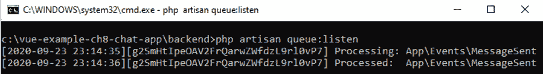

# *第 8 章*：使用 Vue 3、Laravel 和 Socket.IO 构建聊天应用

在前面的章节中，我们创建了仅通过 HTTP 进行通信的前端项目或完整堆栈项目。前端和后端之间没有实时通信。如果我们需要将数据从服务器端传送到客户端，或者从客户端传送到服务器端，那么实时通信有时是必要的。如果没有一些实时通信机制，没有客户端发起请求，就无法从服务器端通信到客户端。这是我们可以通过 Laravel 框架和 Socket.io 轻松添加的内容。

在本章中，我们将了解以下主题：

*   使用 Laravel 创建 API 端点
*   设置 JWT 身份验证
*   创建前端让用户聊天

Laravel 是一个用 PHP 编写的后端 web 框架。它是一个全面的后端框架，包括处理 HTTP 请求、数据库操作和实时通信。

在本章中，我们将了解如何使所有这些部分协同工作，以便我们可以创建一个与 Vue 3、Laravel、Laravel Echo Server 和 Redis 协同工作的聊天应用程序。

# 技术要求

要完全理解本章，需要以下内容：

*   对 PHP 的基本理解
*   使用 Vue 组件创建基本应用程序的能力
*   使用 Axios HTTP 客户端发送和接收 HTTP 请求的能力

本章项目代码见[https://github.com/PacktPublishing/-Vue.js-3-By-Example/tree/master/Chapter08](https://github.com/PacktPublishing/-Vue.js-3-By-Example/tree/master/Chapter08) 。

# 使用 Laravel 创建 API 端点

创建聊天应用程序的第一步是使用 Laravel 创建后端应用程序。使用 Laravel 创建 API 是本章我们必须学习的主要内容。这是我们以前没有做过的事情。这也意味着我们必须用 PHP 编写代码，因为 Laravel 是一个基于 PHP 的 web 框架。因此，在阅读此代码之前，您应该学习一些基本的 PHP 语法。与 JavaScript 和其他面向对象语言一样，它们共享类似的概念，例如使用对象、数组、字典、循环、类和其他基本的面向对象编程概念。因此，就学习难度而言，它不应该与 JavaScript 有太大区别。

## 安装所需的库

要使用 Laravel 创建我们的 API，我们不必自己创建所有文件，我们只需运行一些命令，这将自动为我们创建所有文件和配置设置。在创建 API 之前，我们必须运行 PHP。在 Windows 中，将 PHP 添加到 Windows 安装中最简单的方法是使用 XAMPP。我们可以通过[下载并安装 https://www.apachefriends.org/download.html](https://www.apachefriends.org/download.html) 。它也可用于 macOS 和 Linux。

一旦我们安装了它，我们就可以用**Composer**创建我们的 Laravel API。Composer 是一个用于 PHP 的包管理器，我们稍后将使用它安装更多库。创建项目的最简单方法是创建项目文件夹，然后在转到文件夹后运行命令创建 Laravel 项目：

1.  首先，我们创建一个名为`vue-example-ch8-chat-app`的项目文件夹，它将前端和后端都保存在各自独立的文件夹中。
2.  然后，在这个文件夹中，我们创建后端文件夹来存放我们的 Laravel 项目代码文件。
3.  现在我们进入命令行，然后进入`vue-example-ch8-chat-app`，然后运行`composer global require laravel/installer`。

这将安装 Laravel 安装程序，让我们创建 Laravel 项目。全球图书馆的位置如下：

*   所以这和 MacOS 是一样的。
*   **窗口**：`%USERPROFILE%\AppData\Roaming\Composer\vendor\bin`
*   **GNU/Linux 发行版**：`$HOME/.config/composer/vendor/bin`或`$HOME/.composer/vendor/bin`

我们还可以运行`composer global about`查找库文件的位置。

完成后，我们使用所有文件创建 scaffold，还包括所有配置文件，并使用一个命令为我们安装所有必需的库。

我们通过命令行进入`vue-example-ch8-chat-app`文件夹，然后运行`laravel new backend`在后端文件夹中创建 Laravel 应用程序。Laravel 安装人员将运行并为我们的 Laravel 创建脚手架。此外，Composer 将安装运行 Laravel 所需的所有 PHP 库。一旦这一切完成，我们应该有一个完整的 Laravel 安装与所有文件和配置，我们需要运行我们的应用程序。

## 创建数据库和迁移文件

现在，随着Laravel应用程序的创建和所有相关库的安装，我们可以在 Laravel 应用程序上创建 API。首先，我们通过创建一些迁移文件来创建数据库。我们需要他们创建`chats`和`messages`表。`chats`表中有聊天室数据。`messages`表中有与聊天室相关的聊天信息。它还将引用发送消息的用户。

我们不必创建`users`表，因为它是在创建 Laravel 应用程序时自动创建的。几乎每个应用程序都需要保存用户数据，因此这是自动包含的。使用 Laravel scaffold，我们可以使用用户名、电子邮件和密码创建用户，并使用我们刚刚创建的用户的用户名和密码登录。Laravel 还能够发送电子邮件供用户验证，而无需添加任何代码。

要创建迁移，我们运行以下命令：

```js
php artisan make:migration create_chats_table
php artisan make:migration create_messages_table
```

前面的命令将为我们创建迁移文件，并在迁移文件的文件名前添加日期和时间。所有迁移文件都在`database/migrations`文件夹中。所以我们可以进入这个文件夹并打开文件。在以`create_chats_table`作为文件名的文件中，我们添加了以下代码：

```js
<?php
use Illuminate\Database\Migrations\Migration;
use Illuminate\Database\Schema\Blueprint;
use Illuminate\Support\Facades\Schema;
class CreateChatsTable extends Migration
{
    public function up()
    {
        Schema::create('chats', function (Blueprint $table)
        {
            $table->id();
            $table->string('name');
            $table->timestamp('created_at')->useCurrent();
            $table->timestamp('updated_at')->useCurrent();
        });
    }
    public function down()
    {
        Schema::dropIfExists('chats');
    }
}
```

前面的代码将创建`chats`表。`up()`方法包含我们在运行迁移时想要运行的代码。`down()`方法具有我们想要反转迁移时运行的方法。

在`up()`方法中，我们调用`Schema::create`来创建表。`::`符号表示方法为静态方法。第一个参数是表名，第二个参数是回调函数，我们添加代码来创建表。`$table`对象使用`id()`方法创建`id`列。`string()`方法使用参数中的列名创建一个`string`列。`timestamp()`方法允许我们使用给定的列名创建一个`timestamp`列。`useCurrent()`方法允许我们将时间戳的默认值设置为当前日期和时间。

在`down()`方法中，我们使用`Schema::dropIfExists()`方法删除参数中具有给定名称的表，如果该表存在，则删除该表。

迁移文件必须具有继承自`Migration`类的类，才能用作迁移。

同样地，在文件名中有`create_message_table`名称的迁移文件中，我们编写以下内容：

```js
<?php
use Illuminate\Database\Migrations\Migration;
use Illuminate\Database\Schema\Blueprint;
use Illuminate\Support\Facades\Schema;
class CreateMessagesTable extends Migration
{
    public function up()
    {
        Schema::create('messages', function (Blueprint 
         $table) {
            $table->id();
            $table->unsignedBigInteger('user_id');
            $table->unsignedBigInteger('chat_id');
            $table->string('message');
            $table->timestamp('created_at')->useCurrent();
            $table->timestamp('updated_at')->useCurrent();
            $table->foreign('user_id')->references('id')-
              >on('users');
            $table->foreign('chat_id')->references('id')-
              >on('chats');
        });
    }
    public function down()
    {
        Schema::dropIfExists('messages');
    }
}
```

前面的文件有创建`messages`表的代码。此表有更多列。我们有与`chats`表中相同的`id`和`timestamp`列，但我们还有`user_id`未签名`integer`列用于引用发布消息的用户的 ID，`chat_id`未签名`integer`列用于引用`chats`中的条目表将消息与创建该消息的聊天会话相关联。

`foreign()`方法允许我们分别指定`user_id`和`chat_id`列在用户和`chats`表中引用的内容。

### 配置我们的数据库

在我们可以运行迁移之前，我们必须配置我们的数据库，用于存储后端的数据。为此，我们在项目的`root`文件夹中创建`.env`文件，方法是复制`.env.example`文件，然后将其重命名为`.env`。

`.env`文件有许多设置，我们需要这些设置来运行 Laravel 应用程序。要配置要使用的数据库，请运行以下命令以连接到 SQLite 数据库：

```js
DB_CONNECTION=sqlite
DB_DATABASE=C:\vue-example-ch8-chat-app\backend\db.sqlite
```

完整的配置文件位于[https://github.com/PacktPublishing/-Vue.js-3-By-Example/blob/master/Chapter08/backend/.env.example](https://github.com/PacktPublishing/-Vue.js-3-By-Example/blob/master/Chapter08/backend/.env.example) 。我们只需将其内容复制到同一文件夹中的`.env`文件中即可使用配置。

为了简单起见，我们在本章中使用 SQLite，这样我们就可以专注于使用 Vue 3 创建聊天应用程序。然而，如果我们正在构建一个生产应用程序，我们应该使用一个具有更好安全性和管理能力的生产质量数据库。`DB_CONNECTION`环境变量具有我们想要使用的数据库类型，即 SQLite。在`DB_DATABASE`设置中，我们指定数据库文件的绝对路径。Laravel 不会自动为我们创建此文件，因此我们必须自己创建它。为了创建 SQLite 文件，我们可以使用 SQLite 程序的 DB 浏览器。它支持 Windows、macOS 和 Linux，因此我们可以在所有流行的平台上运行它。您可以从[下载程序 https://sqlitebrowser.org/dl/](https://sqlitebrowser.org/dl/) 。安装完成后，只需点击左上角的**新建数据库**，点击**文件**菜单，点击**保存**即可保存数据库文件。

### 配置到 Redis 的连接

除了使用 SQLite 作为我们应用程序的主数据库外，我们还需要配置与 Redis 的连接，以便我们可以使用 Laravel 的排队功能将我们的数据广播到 Redis 服务器，然后由 Laravel Echo 服务器拾取，以便将事件发送到 Vue 3 前端。Redis 配置的环境变量如下所示：

```js
BROADCAST_DRIVER=redis
QUEUE_CONNECTION=redis
QUEUE_DRIVER=sync
```

我们添加了 Redis 配置，包括以下内容：

```js
REDIS_HOST=127.0.0.1
REDIS_PASSWORD=null
REDIS_PORT=6379
```

第一组环境变量配置队列将数据定向到的位置。`BROADCAST_DRIVER`设置被设置为`redis`，以便我们将事件定向到 Redis。出于同样的原因，`QUEUE_CONNECTION`也必须设置为`redis`。`QUEUE_DRIVER`设置为`sync`，以便事件在广播后立即发送到队列。

## 运行迁移文件

现在我们已经创建了迁移并配置了要使用的数据库，我们运行`php artisan migrate`来运行迁移。运行迁移将把表添加到我们的 SQLite 数据库中。在添加表之后，我们可以添加种子数据，这样当我们想要重置数据库或有空数据库时，就不必自己重新创建数据。为了创建种子数据，我们在`database/seeders/DatabaseSeeder.php`文件中添加了一些代码。在该文件中，我们编写以下代码为数据库添加文件：

```js
<?php
namespace Database\Seeders;
use Illuminate\Database\Seeder;
use Illuminate\Support\Facades\DB;
use Illuminate\Support\Facades\Hash;
use Illuminate\Support\Str;
use App\Models\User;
use App\Models\Chat;
class DatabaseSeeder extends Seeder
{
    public function run()
    {
        $this->addUsers();
        $this->addChats();
        $this->addMessages();
    }
    private function addUsers()
    {
        for ($x = 0; $x <= 1; $x++) {
            DB::table('users')->insert([
                'name' => 'user'.$x,
                'email' => 'user'.$x.'@gmail.com',
                'password' => Hash::make('password'),
            ]);
        }
    }
  ...
}
```

我们有`addUsers()`方法将一些用户添加到`users`表中。我们创建一个循环，调用`DB::table('users')->insert`将一些条目插入`users`表。`->`符号与 JavaScript 中的句点相同。它允许我们访问对象属性或方法。

在`insert()`方法中，我们传入一个关联数组或字典，其中包含要插入的键和值：

```js
    ...
    private function addChats()
    {
        for ($x = 0; $x <= 1; $x++) {
            DB::table('chats')->insert([
                'name' => 'chat '.$x,
            ]);
        }
    }
    ...
```

`addChats()`方法允许我们添加聊天室条目。我们只需插入名称。在`addMessages()`方法中，我们插入`messages`表的条目。我们从`users`表中的现有条目中获取要设置为值的用户条目的`id`值。同样地，我们通过从`chats`表中获取一个条目来对`chat_id`执行相同的操作，并使用该条目的`id`值，并将其设置为`chat_id`的值：

```js
...
    private function addMessages()
    {
        for ($x = 0; $x <= 1; $x++) {
            DB::table('messages')->insert([
                'message' => 'hello',
                'user_id' => User::all()->get(0)->id,
                'chat_id' => Chat::all()->get($x)->id
            ]);
            DB::table('messages')->insert([
                'message' => 'how are you',
                'user_id' => User::all()->get(1)->id,
                'chat_id' => Chat::all()->get($x)->id
            ]);
        }
    }
...
```

一旦我们编写了播种机，我们可能需要重新生成 Composer 的自动加载器，以使用我们拥有的依赖项更新自动加载器。我们可以通过运行`composer dump-autoload`来实现这一点。如果对任何依赖项的引用已过时，并且我们希望刷新引用，以便它们不会过时，那么这将非常方便。然后我们运行`php artisan db:seed`运行播种器，将所有数据填充到表中。

要将数据重置为原始状态，我们可以通过运行`php artisan migrate:refresh –seed`同时运行迁移和播种机。我们也可以通过运行`php artisan migrate:refresh`清空数据库并重新运行所有迁移。

## 创建我们的应用程序逻辑

现在我们已经了解了数据库结构和种子数据，我们可以继续创建应用程序逻辑了。我们创建了一些控制器，以便从前端接收请求。Laravel 控制器应位于`app/Http/Controllers`文件夹中。我们创建一个用于接收请求或操纵`chats`表，另一个用于接收请求以操纵`messages`表。Laravel 附带了一个用于创建控制器的命令。首先，我们通过运行以下代码创建`ChatController.php`文件：

```js
php artisan make:controller Chat
```

然后我们应该将`app/Http/Controllers/ChatController.php`文件添加到我们的项目中。完整代码位于[https://github.com/PacktPublishing/-Vue.js-3-By-Example/blob/master/Chapter08/backend/app/Http/Controllers/ChatController.php](https://github.com/PacktPublishing/-Vue.js-3-By-Example/blob/master/Chapter08/backend/app/Http/Controllers/ChatController.php) 。

Laravel 控制器有一个从`Controller`类继承的类。在这个类中，我们有一些稍后将映射到 URL 的方法，这样我们就可以运行这些方法并做我们想做的事情。每个方法都获取一个包含请求数据的请求对象，包括头、URL 参数和主体。

`get()`方法查找单个`Chat`条目。`Chat`是`chats`表的模型类。在 Laravel 中，约定是通过移除末尾的*s*来转换表名，然后将第一个字母转换为大写，从而使类名与表名相对应。因此，`Chat`模型类用于操作`chats`表中的条目。Laravel 自动进行映射，因此我们不必自己做任何事情。我们只要记住这个惯例，就不会被它弄糊涂了。`find()`方法是一种`static`方法，我们使用它通过 ID 获取单个条目。

在所有控制器函数中，我们只需返回字符串、关联数组、响应对象或从`query()`方法返回的结果即可将其作为响应返回。因此，当我们发出请求并调用`get`方法时，`Chat::find`方法的返回值将作为响应返回。

`getAll()`方法用于从`chats`表中获取所有条目。`all()`方法是一个静态方法，返回所有条目。

`create()`方法用于根据请求数据创建条目。我们调用`Validate::make`静态方法为请求数据创建验证器。第一个参数是`$request->all()`，它是一个返回请求对象中所有项的方法。第二个参数是一个关联数组，其中包含要验证的请求主体的键。它的值是一个带有验证规则的字符串。所需规则确保已填写名称。字符串规则检查作为名称键的值设置的值是否为字符串。`max:255`规则是`name`值中可以包含的最大字符数：

```js
...
    public function create(Request $request)
    {
        $validator = Validator::make($request->all(), [
            'name' => 'required|string|max:255',
        ]);
        if($validator->fails()){
            return response()->json($validator->errors()-
              >toJson(), 400);
        }
        $chat = Chat::create([
            'name' => $request->get('name'),
        ]);
        return response()->json($chat, 201);
    }
...
```

我们使用`$validator->fails()`方法检查验证是否失败。`$validator`是`Validator::make`方法返回的对象。在`if`块中，我们调用`response()->json()`将错误返回给具有 400 状态码的用户。

否则，我们调用`Chat::create`来创建`chats`表项。我们使用`$request->get`方法从请求主体获取`name`字段的值，该方法使用我们想要获取的键。然后我们将其设置为关联数组中`'name'`键的值，我们将其传递到`create`方法中。

我们做了一些与`update()`方法类似的事情，除了调用`Chat::find`以通过`id`值查找项目。然后我们将请求主体中的`name`字段的值分配给返回的聊天对象的`name`属性。然后调用`$chat->save()`保存最新的值。然后我们通过调用`response()->json($chat)`返回转换为 JSON 的最新聊天条目来返回响应：

```js
...
    public function update(Request $request)
    {
        $validator = Validator::make($request->all(), [
            'name' => 'required|string|max:255',
        ]);
        if($validator->fails()){
            return response()->json($validator->errors()-
              >toJson(), 400);
        }
        $chat = Chat::find($request->id);
        $chat->name =  $request->get('name');
        $chat->save();
        return response()->json($chat);
    }
...
```

当我们向 API 发出*删除*请求以删除聊天室条目时，调用`delete()`方法。我们再次调用`Chat::find`从`chats`表中找到具有给定 ID 的条目，然后调用`$chat->delete()`删除返回的条目。然后我们返回一个空响应：

```js
...
    public function delete(Request $request)
    {
        $chat = Chat::find($request->id);
        $chat->delete();
        return response(null, 200);
    }
...
```

对于`MessageController.php`我们有类似的逻辑来保存聊天信息。我们有带代码的`UserController.php`文件，以便在注册用户帐户时保存用户数据。

重要：

这些文件可在[找到 https://github.com/PacktPublishing/-Vue.js-3-By-Example/blob/master/Chapter08/backend/app/Http/Controllers/MessageController.php](https://github.com/PacktPublishing/-Vue.js-3-By-Example/blob/master/Chapter08/backend/app/Http/Controllers/MessageController.php) 和[https://github.com/PacktPublishing/-Vue.js-3-By-Example/blob/master/Chapter08/backend/app/Http/Controllers/UserController.php](https://github.com/PacktPublishing/-Vue.js-3-By-Example/blob/master/Chapter08/backend/app/Http/Controllers/UserController.php) 分别。

## 暴露端点的控制器方法

接下来，我们必须将控制器方法映射到我们将发出调用请求的 URL。我们通过在`routes/api.php`文件中添加一些代码来实现这一点。为此，我们用以下代码替换文件中的内容：

```js
<?php
use Illuminate\Http\Request;
use Illuminate\Support\Facades\Route;
use App\Http\Controllers\AuthController;
use App\Http\Controllers\UserController;
use App\Http\Controllers\ChatController;
use App\Http\Controllers\MessageController;
Route::post('register', [UserController::class, 'register']);
Route::group([
    'middleware' => 'api',
    'prefix' => 'auth'
], function () {
    Route::post('login', [AuthController::class, 'login']);
    Route::post('logout', [AuthController::class, 
     'logout']);
    Route::post('refresh', [AuthController::class, 
     'refresh']);
    Route::post('me', [AuthController::class, 'me']);
     });
...
    Route::get('{chat_id}', [MessageController::class, 
     'getAll']);
    Route::post('create', [MessageController::class, 
     'create']);
});
```

我们将控制器方法公开为 POST，并通过分别调用`Route::post`和`Route::get`方法向客户端获取端点。

`jwt.verify`中间件是我们在为路由运行`controller`方法之前检查 JSON web 令牌的工具。这样，`controller()`方法将仅在令牌有效时运行。

然后我们必须创建`AuthController`让我们进行 JSON web 令牌身份验证。

首先，我们运行以下命令：

```js
php artisan make:controller AuthController
```

然后在`app/Http/Controllers/AuthController.php`文件中，我们为端点添加方法，以便获取当前用户的数据、登录和注销。此文件的代码位于[https://github.com/PacktPublishing/-Vue.js-3-By-Example/blob/master/Chapter08/backend/app/Http/Controllers/AuthController.php](https://github.com/PacktPublishing/-Vue.js-3-By-Example/blob/master/Chapter08/backend/app/Http/Controllers/AuthController.php) 。

如果您没有`app/Http/Middleware/JwtMiddleware.php`文件，则此文件的完整代码位于[https://github.com/PacktPublishing/-Vue.js-3-By-Example/blob/master/Chapter08/backend/app/Http/Middleware/JwtMiddleware.php](https://github.com/PacktPublishing/-Vue.js-3-By-Example/blob/master/Chapter08/backend/app/Http/Middleware/JwtMiddleware.php) 。

它允许我们在 Vue 客户端和此应用程序之间使用 JSON web 令牌启用身份验证。

# 设置 JWT 认证

现在，我们必须使用我们的 Laravel 应用程序设置JSON web 令牌身份验证，这样我们就可以独立于后端托管前端。为此，我们使用 `tymon/jwt-auth`库。要安装它，我们运行以下命令：

```js
composer require tymon/jwt-auth
```

接下来，我们运行以下命令来发布包配置文件：

```js
php artisan vendor:publish --provider="Tymon\JWTAuth\Providers\LaravelServiceProvider"
```

前面的命令将为我们添加所有必需的配置。我们现在应该将[T0]添加到我们的应用程序中。然后，我们通过运行以下命令生成密钥，对 JSON web 令牌进行签名：

```js
php artisan jwt:secret
```

[T0]键将被添加到具有[T2]键的[T1]文件中。

## 配置我们的身份验证

接下来，我们必须配置我们的身份验证，以便在成功请求需要身份验证的路由之前验证 JSON web 令牌。在`config/auth.php`中，我们有以下代码：

```js
<?php
return [
    'defaults' => [
        'guard' => 'api',
        'passwords' => 'users',
    ],
    'guards' => [
        'web' => [
            'driver' => 'session',
            'provider' => 'users',
        ],
        'api' => [
            'driver' => 'jwt',
            'provider' => 'users',
        ],
    ],
    'providers' => [
        'users' => [
            'driver' => 'eloquent',
            'model' => App\Models\User::class,
        ],
    ],
    'passwords' => [
        'users' => [
            'provider' => 'users',
            'table' => 'password_resets',
            'expire' => 60,
            'throttle' => 60,
        ],
    ],
    'password_timeout' => 10800,
];
```

在`guards`部分，我们有一个`api`密钥，该密钥的值是一个关联数组，驱动密钥设置为`'jwt'`，提供者设置为`'users'`，让我们使用`jwt-auth`库发布的 JSON web 令牌对用户进行身份验证。

接下来，我们添加代码以启用 CORS，以便我们的 Vue.js 3 应用程序可以与之通信。

# 启用跨域通信

为了使我们能够在前端和后端之间进行跨域通信，我们安装了`fruitcake/laravel-cors`包。为此，我们运行以下命令：

```js
composer require fruitcake/laravel-cors
```

那么，在`app/Http/Kernel.php`中，我们应该有以下内容：

```js
<?php
namespace App\Http;
use Illuminate\Foundation\Http\Kernel as HttpKernel;
class Kernel extends HttpKernel
{
    protected $middleware = [
        \App\Http\Middleware\TrustProxies::class,
        \Fruitcake\Cors\HandleCors::class,
        \App\Http\Middleware\
           PreventRequestsDuringMaintenance::class,
        \Illuminate\Foundation\Http\Middleware\
           ValidatePostSize::class,
        \App\Http\Middleware\TrimStrings::class,
        \Illuminate\Foundation\Http\Middleware\
           ConvertEmptyStringsToNull::class,
        \Fruitcake\Cors\HandleCors::class,
    ];
...
        'password.confirm' =>  \Illuminate\Auth\Middleware\
           RequirePassword::class,
        'signed' => \Illuminate\Routing\Middleware\
           ValidateSignature::class,
        'throttle' => \Illuminate\Routing\Middleware\
           ThrottleRequests::class,
        'verified' => \Illuminate\Auth\Middleware\
           EnsureEmailIsVerified::class,
        'jwt.verify' => \App\Http\Middleware\
           JwtMiddleware::class,
    ];
}
```

我们注册`laravel-cors`包附带的`HandleCors`中间件，在`$routesMiddleware`关联数组中写入以下代码，在`$routeMiddleware`关联数组中注册`jwt.verify`中间件：

```js
'jwt.verify' => \App\Http\Middleware\JwtMiddleware::class,
```

这样，我们就可以使用`jwt.verify`中间件来验证令牌。

完整代码位于[https://github.com/PacktPublishing/-Vue.js-3-By-Example/blob/master/Chapter08/backend/app/Http/Kernel.php](https://github.com/PacktPublishing/-Vue.js-3-By-Example/blob/master/Chapter08/backend/app/Http/Kernel.php) 。

此外，我们还安装了`predis`软件包，以便更轻松地与 Redis 数据库进行通信。要安装`predis`包，我们运行以下命令：

```js
composer require predis/predis
```

然后，在`config/database.php`中，我们编写以下代码：

```js
<?php
use Illuminate\Support\Str;
return [
    ...    'redis' => [
        'client' => env('REDIS_CLIENT', 'predis'),
        'options' => [
            'cluster' => env('REDIS_CLUSTER', 'redis'),
            'prefix' => env('REDIS_PREFIX', Str::slug(   
            env('APP_NAME', 'laravel'), '_').'_database_'),
        ],
        ...
        'cache' => [
            'url' => env('REDIS_URL'),
            'host' => env('REDIS_HOST', '127.0.0.1'),
            'password' => env('REDIS_PASSWORD', null),
            'port' => env('REDIS_PORT', '6379'),
            'database' => env('REDIS_CACHE_DB', '1'),
        ],
    ],
];
```

我们在为`'redis'`设置的关联数组中配置我们的 Redis 数据库连接，以便我们可以连接到 Redis。

完整文件位于[https://github.com/PacktPublishing/-Vue.js-3-By-Example/blob/master/Chapter08/backend/config/database.php](https://github.com/PacktPublishing/-Vue.js-3-By-Example/blob/master/Chapter08/backend/config/database.php) 。

现在我们已经创建了用于存储用户数据和聊天信息的 API，接下来我们将向 Laravel 应用程序添加实时通信功能，以便用户可以实时保存和获取聊天信息。

# 增加实时通信

现在我们已经添加了路由、身份验证、数据库配置和操作代码，我们准备添加代码，让我们在前端和后端之间实时通信。首先，我们需要在 Laravel 后端创建一个`event`类，这样我们就可以像在`MessageController`中一样调用`event`函数来广播事件。

为此，我们运行`php artisan make:event MessageSent`命令来创建`MessageSent`事件类。该类现在应该位于`backend/app/Events/MessageSent.php`文件中。创建文件后，我们将用以下代码替换文件中的内容：

```js
<?php
namespace App\Events;
...
class MessageSent implements ShouldBroadcast
{
    use InteractsWithSockets, SerializesModels;
    public $user;
    public $message;
    public function __construct(User $user, Message 
      $message)
    {
        $this->user = $user;
        $this->message = $message;
    }
    public function broadcastOn()
    {
        return new Channel('chat');
    }
    public function broadcastAs()
    {
        return 'MessageSent';
    }
}
```

`__constructor()`方法为构造函数；我们获取`$user`和`$message`对象，然后将它们分配给具有相同名称的类变量。`broadcastOn()`方法返回`Channel`对象，它创建了一个我们可以在前端收听的频道。`broadCastAs()`方法返回我们在聊天频道中收听的事件名称。我们将在前端使用它来收听广播事件。一个`event`类应该实现`ShouldBroadcast`接口，以便可以从中广播事件。

`MessageSent.php`的完整代码位于[https://github.com/PacktPublishing/-Vue.js-3-By-Example/blob/master/Chapter08/backend/app/Events/MessageSent.php](https://github.com/PacktPublishing/-Vue.js-3-By-Example/blob/master/Chapter08/backend/app/Events/MessageSent.php) 。

在`backend/routes/channels.php`文件中，我们应该有以下代码，以便所有用户都可以收听聊天频道：

```js
<?php
use Illuminate\Support\Facades\Broadcast;
Broadcast::channel('chat', function () {
    return true;
});
```

我们要订阅的第一个参数的名称是。回调函数是一个返回`true`的函数，如果用户可以监听事件，则返回`false`，否则返回。一个可选参数是`user`对象，这样我们就可以检查用户是否可以监听给定的事件。

此文件的完整代码位于[https://github.com/PacktPublishing/-Vue.js-3-By-Example/blob/master/Chapter08/backend/routes/channels.php](https://github.com/PacktPublishing/-Vue.js-3-By-Example/blob/master/Chapter08/backend/routes/channels.php) 。

通信流程为，如下图所示：


图 8.1–聊天应用程序架构图

Vue 3前端向 Laravel 应用程序发出 HTTP 请求，其中包含我们要发送的消息。Laravel 应用程序使用聊天会话和用户的 ID 将消息保存到`messages`表中。它还通过队列向 Redis 服务器广播事件。然后，Laravel Echo 服务器监视 Redis，查看是否有任何内容保存到 Redis 数据库中。如果保存了任何新内容，则 Laravel Echo 服务器会将其推送到 Vue 3 前端。Vue 3 前端通过收听 Laravel Echo 服务器与 Laravel Echo 客户端和 Socket.IO 客户端的事件来获取这些信息。

# 与 Socket.IO 的通信

为了使我们的后端应用程序通过 Socket.IO 与前端通信，我们需要 Laravel Echo 服务器。为此，我们首先需要在全球范围内安装 Laravel Echo Server`npm`包。我们通过运行`npm install –g laravel-echo-server`来安装它。然后，我们将运行这个包来创建用于设置通信的配置文件。

为此，我们创建一个新文件夹，然后运行`laravel-echo-server init`运行命令行向导，在文件夹中创建 Laravel Echo 服务器配置文件。此时，我们可以使用默认设置回答所有问题。这是因为我们将编辑此向导完成后创建的配置文件。

向导完成后，我们将看到文件夹中的`laraval-echo-server.json`文件。现在，我们打开它并用以下代码替换其中的任何内容：

```js
{
 "authHost": "http://localhost:8000",
 "authEndpoint": "/broadcasting/auth",
 "clients": [
  {
   "appId": "APP_ID",
   "key": "c84077a4dabd8ab2a60e51b051c9d0ea"
  }
 ...
  },
  "sqlite": {
   "databasePath": "/database/laravel-echo-server.sqlite"
  },
  "publishPresence": true
 },
 "devMode": true,
 "host": "127.0.0.1",
 ...
 "http": true,
  "redis": true
 },
 "apiOriginAllow": {
  "allowCors": true,
  "allowOrigin": "*",
  "allowMethods": "GET, POST",
  "allowHeaders": "Origin, Content-Type, X-Auth-Token,     X-Requested-With, Accept, Authorization, X-CSRF-TOKEN,     X-Socket-Id"
 }
}
```

在前面的代码中，我们有用于配置的 JSON 代码，这样 Laravel Echo 服务器可以监听保存在 Redis 中的项目，然后通过 Socket.IO 客户端将 Redis 数据库中的任何内容发送到前端。`devMode`属性设置为`true`，这样我们就可以看到发送的所有事件。主机具有 Laravel Echo 服务器的主机 IP 地址。`port`属性设置为`6001`，因此此服务器将侦听端口 6001。该文件的另一个重要部分是`apiOriginAllow`属性。它被设置为一个对象，`allowCors`被设置为`true`，这样我们就可以与前端进行跨域通信。

`allowOrigin`属性允许我们设置允许侦听发出事件的域。`allowMethods`属性具有允许从前端接收的 HTTP 方法。`allowHeaders`属性具有允许从前端发送到 Laravel Echo 服务器的 HTTP 请求头列表。

`authHost`具有 Laravel 应用程序的基本 URL，因此可以收听 Laravel 应用程序广播的事件。`authEndpoint`具有身份验证端点，用于检查用户是否已通过身份验证以侦听需要身份验证的事件。

此配置文件的另一个重要部分是数据库配置属性。数据库属性设置为`"redis"`，以便它将侦听 Redis 服务器上保存的项目。`databaseConfig`属性具有允许我们连接到 Redis 服务器的设置。`"redis"`属性设置为对象，而`"port"`属性设置为 Redis 服务器侦听的`port`。Redis 的默认端口为`6379`。`host`属性是 Redis 服务器的位置。`publishPresence`属性设置为`true`，以便 Redis 发布保存在其数据库中的项目。

完整配置位于[https://github.com/PacktPublishing/-Vue.js-3-By-Example/blob/master/Chapter08/laravel-echo-server/laravel-echo-server.json](https://github.com/PacktPublishing/-Vue.js-3-By-Example/blob/master/Chapter08/laravel-echo-server/laravel-echo-server.json) 。

Redis 的最新版本仅适用于 Linux 或 macOS。要在 Ubuntu Linux 上安装 Redis，请运行以下命令安装 Redis 服务器：

```js
sudo apt update
sudo apt install redis-server
```

如果您正在运行 Windows 10，您可以使用 Windows Linux 子系统安装 Ubuntu Linux 的副本，以便运行最新版本的 Redis。要在 Windows 10 上安装 Ubuntu，请执行以下操作：

1.  Type in `Turn Windows Features on and Off` in the **Start** menu.

    然后我们滚动到底部，点击**Windows Subsystem for Linux**安装它。它会要求您重新启动，您应该在继续之前重新启动。

2.  电脑重启后，进入**Windows 应用商店**搜索**Ubuntu**，点击**获取**。
3.  安装完成后，您可以在**开始**菜单中输入`Ubuntu`并启动。现在只需按照说明完成安装。

然后可以运行前面的两个命令来安装 Redis。

安装 Redis 后，我们运行以下命令来运行 Redis 服务器：

```js
redis-server
```

现在，我们项目的后端部分已经完成。现在我们运行`php artisan serve`和`php artisan queue:listen`来运行 Laravel 应用程序和队列工作者。我们还必须通过运行`laravel-echo-server start`来启动 Laravel Echo 服务器，从而运行 Laravel Echo 服务器。

如果您遇到任何问题，那么您可能必须清除缓存以确保最新的代码正在实际运行。为此，可以运行以下命令清除所有缓存：

```js
php artisan config:cache
php artisan config:clear
php artisan route:cache
php artisan route:clear
```

如果缓存被清除，并且代码仍然不工作，那么您可以返回检查代码。

现在，我们已经在 Laravel 应用程序中添加了实时通信，我们准备继续创建前端，让用户注册帐户、登录并开始在聊天室聊天。

# 创建前端让用户聊天

现在我们已经完成并运行了后端代码，我们可以在前端工作了。前端与前面几章中的内容没有太大区别。我们使用 Vue CLI 在`vue-example-ch8-chat-app`文件夹的`frontend`文件夹中创建项目，然后开始编写代码。

在`vue-example-ch8-chat-app/frontend`文件夹中，我们运行`vue create`，然后选择**选择版本**，然后在启用**Vue 路由**选项的情况下选择**Vue 3**选项。一旦 Vue CLI 向导完成运行，我们就可以开始构建前端了。

## 安装 Vue 依赖项

除了Vue 依赖项外，我们还需要安装 Axios HTTP 客户端、Socket.IO 客户端和 Laravel Echo 客户端包，分别通过 Laravel Echo 服务器发出 HTTP 请求和监听服务器端发出的事件。要安装这些，我们运行以下命令：

```js
npm install axios socket.io-client laravel-echo
```

首先，在`src`文件夹中，我们创建`constants.js`文件并添加以下代码：

```js
export const APIURL = 'http://localhost:8000';
```

我们添加了`APIURL`常量，当我们向 API 端点发出请求时将使用该常量。在`src/main.js`中，我们将现有代码替换为以下代码：

```js
...
axios.interceptors.request.use((config) => {
  if (config.url.includes('login') || 
   config.url.includes('register')) {
    return config;
  }
  return {
    ...config, headers: {
      Authorization: `Bearer ${localStorage.getItem('token')}`,
    }
  }
}, (error) => {
  return Promise.reject(error);
});
axios.interceptors.response.use((response) => {
  const { data: { status } } = response;
  if (status === 'Token is Expired') {
    router.push('/login');
  }
  return response;
}, (error) => {
  return Promise.reject(error);
});
createApp(App).use(router).mount('#app')
```

我们在这个文件中有两件新的东西。我们有 Axios 请求和响应拦截器，因此我们可以对所有请求应用相同的设置，而无需在发出每个请求时重复相同的代码。`axios.interceptors.request.use()`方法接受回调，让我们根据需要返回一个新的`config`对象。

如果请求 URL 不包含`login`或`register`，那么我们需要将令牌添加到`Authorization`头中。这就是我们在传入`use()`方法的回调中所做的。我们将令牌添加到需要它们的端点的请求配置中。第二个回调是一个错误处理程序，我们只返回一个被拒绝的承诺，以便在发出请求时处理它们。

类似地，我们有`axios.interceptor.response.use()`方法来检查第一个参数中带有回调的每个响应。我们检查响应主体是否将`status`属性设置为`"Token is expired"`字符串，以便在收到此消息并返回响应时重定向到登录页面。否则，我们只返回原样的响应。第二个参数中的错误处理程序与请求拦截器相同。

## 创建我们的组件

接下来，我们创建组件。我们从表单开始设置或编辑聊天室名称。为此，我们进入`src/components`文件夹并创建`ChatroomForm.vue`文件。然后，在该文件中，我们编写以下代码：

```js
<template>
  <div>
    <h1>{{ edit ? "Edit" : "Add" }} Chatroom</h1>
    <form @submit.prevent="submit">
      <div class="form-field">
        <label for="name">Name</label>
        <br />
        <input v-model="form.name" type="text" name="name" 
          />
      </div>
      <div>
        <input type="submit" />
      </div>
    </form>
  </div>
</template>
...
```

此组件采用具有布尔类型的`edit`属性和具有字符串类型的`id`属性。它有一个反应性质，即`form`性质。它用于将输入值绑定到被动属性。我们有`submit()`方法来检查名称是否已填写。如果是，那么我们继续提交。如果`edit`属性为 true，则我们发出 PUT 请求，以使用给定 ID 更新`chats`表中的现有条目。否则，我们将使用给定的名称值在同一个表中创建一个新条目。完成后，我们重定向到主页，其中有聊天室列表。

在`created`钩子中，我们检查`edit`反应性属性是否正确。如果是，则我们在`chats`表中获得具有给定 ID 的条目，并将其设置为`form`无功属性的值，以便我们可以在输入框中看到`form.name`属性的值：

```js
<script>
import axios from "axios";
import { APIURL } from "../constants";
export default {
  name: "ChatroomForm",
  ...
  async created() {
    if (this.edit) {
      const { data } = await 
       axios.get(`${APIURL}/api/chat/${this.id}`);
      this.form = data;
    }
  },
 };
</script>
```

接下来，在`src/components`文件夹中，我们创建`NavBar.vue`来创建一个组件来渲染导航栏。在该文件中，我们编写以下代码：

```js
<template>
  <div>
    <ul>
      <li>
        <router-link to="/">Chatrooms</router-link>
      </li>
      <li><a href="#" @click="logOut">Logout</a></li>
    </ul>
  </div>
</template>
<script>
import axios from "axios";
import { APIURL } from "../constants";
export default {
  name: "NavBar",
  methods: {
    async logOut() {
      await axios.post(`${APIURL}/api/auth/logout`);
      localStorage.clear();
      this.$router.push("/login");
    },
  },
};
</script>
...
```

我们有一个`router-link`组件，可以进入**聊天室**页面。这是通过将`to`道具设置为`/`路线来实现的。当我们点击`logout()`方法时，我们还有一个链接来调用它。`logout()`方法向`/api/auth/logOut`端点发出 POST 请求，以使 JSON web 令牌无效。然后我们调用`localStorage.clear()`方法来清除本地存储。然后我们调用`this.$router.push`重定向到登录页面。

在样式部分，我们有一些用于`ul`和`li`元素的样式，因此`li`水平显示，它们之间有一些空白。我们还将`list-style-type`属性设置为`none`，以便从列表中删除项目符号：

```js
<style scoped>
ul {
  list-style-type: none;
}
ul li {
  display: inline;
  margin-right: 10px;
}
</style>
```

在`src/views`文件夹中，我们将页面的组件映射到 Vue 路由的 URL，以便我们可以从浏览器访问这些组件。首先，我们在`src/views`文件夹中创建`AddChatroomForm.vue`组件文件，并添加以下代码：

```js
<template>
  <div>
    <NavBar></NavBar>
    <ChatroomForm></ChatroomForm>
  </div>
</template>
<script>
import ChatroomForm from "@/components/ChatroomForm";
import NavBar from "@/components/NavBar";
export default {
  components: {
    ChatroomForm,
    NavBar
  },
};
</script>
```

我们只需在`components`属性中注册`NavBar`和`ChatroomForm`组件，然后将它们添加到模板中。

接下来，我们创建`ChatRoom.vue`组件来显示我们的聊天信息，并将代码添加到收听`laravel_database_chat`频道的`MessageSent`事件，我们通过 Redis 数据库和该文件中的 Laravel Echo 服务器从 Laravel 应用程序发出该事件。在此文件中，我们编写以下代码：

```js
...
<script>
import axios from "axios";
import { APIURL } from "../constants";
import NavBar from "@/components/NavBar";
export default {
  name: "Chatroom",
  components: {
    NavBar,
  },
  beforeMount() {
    this.getChatMessages();
    this.addChatListener();
  },
  data() {
    return {
      chatMessages: [],
      message: "",
    };
  },
  ...};
</script>
```

然后我们将这些方法添加到同一个文件中，通过编写以下代码来获取和发送聊天信息：

```js
...
<script>
...
export default {
  ...
  methods: {
    async getChatMessages() {
      const { id } = this.$route.params;
      const { data } = await 
        axios.get(`${APIURL}/api/message/${id}`);
      this.chatMessages = data;
      this.$nextTick(() => {
        const container = this.$refs.container;
        container.scrollTop = container.scrollHeight;
      });
    },
    async sendChatMessage() {
      const { message } = this;
      if (!message) {
        return;
      }
      const { id: chat_id } = this.$route.params;
        ...
        () => {
          this.getChatMessages();
        }
      );
    },
  },
</script>
```

`getChatMessages`方法从 API 获取聊天室的聊天消息，`sendChatMessage`方法通过 HTTP 请求向 API 提交聊天消息，向聊天室发送消息。然后，API 端点将通过 Laravel Echo 服务器向队列发送一条消息，并返回到此应用程序中使用的 Socket.IO 聊天客户端。我们调用`addChatListener`来监听来自服务器的`laravel_database_chat`事件，服务器调用`getChatMessages`来获取最新消息。

组件模板仅使用`v-for`指令呈现`chatMessages`反应性属性的每个条目并呈现它们。下面代码中的`form`元素用于让我们输入一条消息，然后通过发出 HTTP 请求将其提交给 Laravel。端点将消息保存到`messages`表中，并发出我们监听的事件，该事件通过 Redis 数据库和 Laravel Echo 服务器发送。前端仅从实时通信的角度了解 Laravel Echo 服务器：

```js
<template>
  <div>
    <NavBar></NavBar>
    <h1>Chatroom</h1>
    <div id="chat-messages" ref="container">
      <div class="row" v-for="m of chatMessages" 
        :key="m.id">
        <div>
          <b>{{ m.user.name }} - {{ m.created_at }}</b>
        </div>
        <div>{{ m.message }}</div>
      </div>
    </div>
    <form @submit.prevent="sendChatMessage">
      <div class="form-field">
        <label for="message">Message</label>
        <br />
        <input v-model="message" type="text" name="message"
           />
      </div>
      <div>
        <input type="submit" />
      </div>
    </form>
  </div>
</template>
```

在`component`对象中，我们有`beforeMount`钩子来调用`getChatMessage`方法来获取聊天信息。`addChatListener()`方法使用 Socket.IO 客户端创建一个事件侦听器，让我们侦听从 Laravel Echo 服务器发出的事件。在`getChatMessage()`方法中，我们通过回调调用`this.$nextTick()`方法，以便在获得消息后始终滚动到保存消息的`div`标记的底部。我们在`$nextTick`回调中运行了该代码，因为我们需要确保在呈现所有消息之后运行滚动代码。

`this.$nextTick()`方法允许我们在回调中运行代码之前，在更新反应性属性之后等待组件重新呈现。

在`addChatListener()`方法中，我们订阅`laravel_database_chat`频道，这与我们在 Laravel 应用程序中定义的聊天频道相同。通过观察 Laravel Echo 服务器的输出，我们可以确保订阅了正确的频道。`.MessageSent`事件与我们在后端应用程序中定义的事件相同。事件名称前的点是必需的，以便它侦听正确命名空间中的正确事件。在我们传入的用于侦听的回调中，我们调用`this.getChatMessages()`以获取最新消息。

聊天信息容器的高度设置为 300px，这样当我们有太多的信息时，它就不会太高。当我们有足够的消息溢出容器时，它还允许我们滚动到底部：

```js
<style scoped>
#chat-messages {
  height: 300px;
  overflow-y: scroll;
}
.row {
  display: flex;
  flex-wrap: wrap;
}
.row div:first-child {
  width: 30%;
}
</style>
```

接下来，在`src/views`文件夹中，我们通过编写以下代码创建`Chatrooms.vue`组件文件：

```js
<template>
  <div>
    <NavBar></NavBar>
    <h1>Chatrooms</h1>
    <button @click="createChatRoom">Create Chatroom
      </button>
    <table id="table">
      <thead>
        <tr>
          <th>Name</th>
          <th>Go</th>
          <th>Edit</th>
          <th>Delete</th>
...
  beforeMount() {
    this.getChatRooms();
  },
};
</script>
<style scoped>
#table {
  width: 100%;
...
</style>
```

我们呈现一个带有聊天室列表的表，我们可以访问、编辑聊天室的名称或删除聊天室。该方法仅获取聊天室数据，然后分别转到使用给定 ID 编辑聊天室、添加聊天室、重定向到使用给定 ID 的聊天室页面和删除聊天室的路径。当我们删除聊天室时，我们会使用`getChatRooms()`方法再次获取最新的条目，以便获取最新的数据。

我们在`beforeMount`钩子中获得聊天室列表，以便在页面加载时看到表条目。接下来，在同一个文件夹中，我们创建`EditChatroomForm.vue`文件并添加以下代码：

```js
<template>
  <div>
    <NavBar></NavBar>
    <ChatroomForm edit :id="$route.params.id">
      </ChatroomForm>
  </div>
</template>
<script>
import ChatroomForm from "@/components/ChatroomForm";
import NavBar from "@/components/NavBar";
export default {
  components: {
    ChatroomForm,
    NavBar,
  },
};
</script>
```

它的内容与`AddChatroomForm.vue`文件相同，但`ChatroomForm`上的`edit`属性设置为`true`，而`id`属性设置为我们从 Vue 路由获得的 URL 中的`id`URL 参数。

## 创建登录页面

接下来，我们通过创建`src/views/Login.vue`并添加以下代码来创建登录页面：

```js
<template>
  <div>
    <h1>Login</h1>
    <form @submit.prevent="login">
      <div class="form-field">
        <label for="email">Email</label>
        <br />
        <input v-model="form.email" type="email" name="email" />
      </div>
      <div class="form-field">
        <label for="password">Password</label>
        <br />
        <input v-model="form.password" type="password"            name="password" />
      </div>
      <div>
        <input type="submit" value="Log in" />
        <button type="button" @click="goToRegister">Register</            button>
      </div>
    </form>
  </div>
</template>
<script>
import axios from "axios";
import { APIURL } from "../constants";
export default {
  name: "Login",
  data() {
    return {
      form: {
        email: "",
        password: "",
      },
    };
  },
  methods: {
    async login() {
      const { email, password } = this.form;
      if (!email || !password) {
        alert("Email and password are required");
        return;
      }
      try {
        const {
          data: { access_token },
        } = await axios.post(`${APIURL}/api/auth/login`, {
          email,
          password,
        });
        localStorage.setItem("token", access_token);
        this.$router.push("/");
      } catch (error) {
        alert("Invalid username or password");
      }
    },
    goToRegister() {
      this.$router.push("/register");
    },
  },
};
</script>
```

该模板只是有一个登录表单，它接受电子邮件和密码，让我们登录。提交表单时，调用`login()`方法。它首先检查所有字段是否正确填写，然后使用凭据向`/api/auth/login`路由发出 HTTP 请求，以查看我们是否可以登录。

该表单还有一个`Register.vue`文件，可以转到**注册**页面，这样我们就可以注册帐户并加入聊天室。

我们必须创建的最后一页是用于放置注册表的页面。要创建它，我们编写以下代码：

```js
<template>
  <div>
    <h1>Register</h1>
    <form @submit.prevent="register">
      <div class="form-field">
        <label for="email">Name</label>
        <br />
        <input v-model="form.name" type="text" name="name"
          />
      </div>
      <div class="form-field">
        <label for="email">Email</label>
        <br />
        <input v-model="form.email" type="email" 
          name="email" />
      </div>
      <div class="form-field">
        <label for="password">Password</label>
        <br />
          …
          name,
          email,
          password,
          password_confirmation: confirmPassword,
        });
        this.$router.push("/login");
      } catch (error) {
        alert("Invalid username or password");
      }
    },
  },
};
</script>
```

该表单包含**名称**、**电子邮件**、**密码**和**确认密码**字段，这些字段都是注册帐户所必需的。当我们提交表单时，我们称之为`register()`方法。我们对字段进行检查，看它们是否填写正确。对[T2]正则表达式调用[T1]方法以检查有效的电子邮件地址。如果有效，`test()`方法返回`true`。否则返回`false`。我们还检查密码是否与`confirmPassword`变量相同。如果所有内容都有效，那么我们会发出 POST 请求以注册用户帐户。

在`src/App.vue`中，我们用以下代码替换中的内容，添加`router-view`组件，以便我们可以从`src/views`文件夹中看到路由组件：

```js
<template>
  <div>
    <router-view />
  </div>
</template>
<style scoped>
div {
  width: 70vw;
  margin: 0 auto;
}
</style>
<style>
.form-field input {
  width: 100%;
}
</style>
```

然后，在`src/router/index.js`文件中，我们用以下代码替换那里的内容，以注册所有路由，并创建`Socket.io`事件以使用 LaravelEcho 库进行监听：

```js
...
window.io = require('socket.io-client');
const beforeEnter = (to, from, next) => {
  const hasToken = Boolean(localStorage.getItem('token'));
  if (!hasToken) {
    return next({ path: 'login' });
  }
  next();
}
const routes = [
  {
...
    path: '/edit-chatroom/:id',
    name: 'edit-chatroom/:id',
    component: EditChatroomForm,
    beforeEnter
  },
]
...
export default router
```

Laravel Echo 客户端与 Socket.IO 客户端一起使用，以便我们可以收听从 Laravel Echo 服务器广播的事件。`broadcaster`属性被设置为`'socket.io'`，以便我们可以监听来自 Laravel Echo 服务器的事件。`host`属性设置为 Laravel Echo 服务器的 URL。

此外，我们有`beforeEnter`导航保护，我们在前面的章节中已经看到，当我们需要限制一条路径只有在认证成功后才可用时。我们只是检查令牌是否存在。如果存在，我们会呼叫`next`继续下一条路线。否则，我们重定向到登录页面。

现在我们可以通过运行`npm run serve`来运行前端，就像在所有其他项目中一样。现在我们应该看到如下截图。以下屏幕截图具有**聊天室**用户界面：


图 8.2–聊天室的屏幕截图

下面的屏幕截图是 Laravel Echo 服务器正在工作。我们应该看到所广播事件的名称及其发送的频道：


图 8.3–聊天事件发送到前端时 Redis 的输出

下面的截图是队列事件的日志：



图 8.4–Laravel 事件的输出

我们早些时候通过在`backend`文件夹中运行`php artisan queue:listen`启动了队列，该文件夹包含 Laravel 项目。

现在聊天应用的前端工作正常了，我们用 Laravel 和 Vue 创建了一个简单的聊天系统。

# 总结

在本章中，我们介绍了如何使用 Laravel 和 Vue 构建聊天应用程序。我们用 Laravel 构建了后端，并添加了控制器来接收请求。我们使用内置在 Laravel 中的队列系统将数据发送到前端。我们还在 Laravel 应用程序中添加了 JSON web 令牌身份验证。

在前端，我们使用 Socket.IO 客户端监听从 Laravel Echo 服务器发送的事件，该服务器通过 Redis 从 Laravel 获取数据。

现在，我们已经经历了不同难度的 Vue 3 项目，我们可以根据实际情况调整我们在这里学到的内容。现实生活中的 Vue 应用程序几乎总是向服务器发出 HTTP 请求。Axios 库使这变得简单。一些应用程序还与服务器实时通信，如本章中的聊天应用程序。

唯一的区别是，在现实生活中的应用程序中，会进行检查，以查看用户是否经过身份验证并有权将数据发送到服务器。